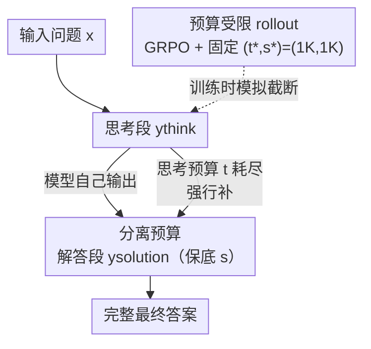

# Elastic Reasoning：通过弹性推理实现可扩展的思维链

**会议**: ICLR 2026  
**OpenReview**: [https://openreview.net/forum?id=E0Qfhma53J](https://openreview.net/forum?id=E0Qfhma53J)  
**代码**: https://github.com/SalesforceAIResearch/Elastic-Reasoning  
**领域**: LLM推理  
**关键词**: 长度控制, 测试时预算, 高效推理, GRPO, 思维链

## 一句话总结
本文提出 Elastic Reasoning：把推理输出显式拆成"思考段"和"解答段"并分别分配 token 预算，配合一个把"思考被截断后还能答对"练进模型的预算受限 rollout（集成进 GRPO），让大推理模型在严格的 token 预算下依然稳定给出完整解答——训练成本仅为 L1 的零头，且即使不限预算也能让推理变得更短更高效。

## 研究背景与动机

**领域现状**：大推理模型（LRM，如 DeepSeek-R1、o1）靠生成超长思维链（CoT）在数学、编程等复杂任务上取得突破，强化学习（RL）进一步把这些推理轨迹训得越来越长、越来越细。

**现有痛点**：推理轨迹的长度是**不受控**的。真实部署里 token / 延迟 / 算力往往有硬预算，而模型既不知道也不在乎自己该写多长。现有两条路线都不理想：Long2Short 用轨迹惩罚或压缩微调让推理变短，但拿不到"精确、用户指定"的长度；length control 路线里 S1（budget forcing）靠强行截断或补特殊 token 卡长度，但会严重掉点；L1 用 RL 对整条轨迹施加显式长度约束，更灵活，却要把长度指令塞进 prompt、训练开销巨大（4K 响应长度下要 700~820 步），且相比原模型仍明显退化。

**核心矛盾**：现有截断式方法把整条轨迹当成一个均质的 token 流来砍，**忽略了解答段的关键作用**。一旦预算用尽，被砍掉的往往正是最后那段"最终答案"，于是输出残缺、不可用——哪怕思考已经基本到位，答案没写出来也等于零分。

**本文目标**：让模型在任意给定的 token 预算 $c$ 下都能**优先保住一个完整的解答**，同时学会在思考被提前掐断时也能给出高质量答案，并且这种能力要能泛化到训练时没见过的预算配置。

**切入角度**：作者观察到 S1（强制输出 "Final Answer" 这类特殊 token 来收尾）比直接硬截断整条轨迹表现更好，这恰恰说明"保住解答段"是关键。顺着这个观察，与其在一条轨迹上整体卡长度，不如**把思考和解答拆开、各给一份预算**。

**核心 idea**：用"思考预算 $t$ + 解答预算 $s$ 的分离预算（$c=t+s$）"替代"整条轨迹一刀切截断"，再用"预算受限 rollout"把模型练得对截断鲁棒，从而在严格预算下既不牺牲解答完整性、又能泛化到任意预算。

## 方法详解

### 整体框架

Elastic Reasoning 的输出沿用 `<think> 中间推理 </think>，解答` 这种两段式结构。整个方法围绕两个相互配合的组件转：**推理时**用分离预算（separate budgeting）保证解答段一定有 token 可写；**训练时**用预算受限 rollout（集成进 GRPO）让模型在"思考被强行截断"的条件下也能学会给出好答案。两者共享同一套"在 $t$ 处插 `</think>`、再用 $s$ 个 token 写解答"的机制——训练时模拟它、推理时执行它，于是模型在单一固定预算 $(t^*,s^*)=(1\text{K},1\text{K})$ 上训练后，能直接泛化到推理时任意的 $c_i=t_i+s^*$ 而无需再微调。

### 关键设计

**1. 分离预算：先把答案的位子占住，再谈思考写多少**

针对"整条轨迹一刀切会砍掉解答"这个痛点，作者把总预算 $c$ 显式拆成两份——思考预算 $t$ 与解答预算 $s$，满足 $c=t+s$。推理时模型先在 `<think>` 块里推理：如果它在用满 $t$ 之前就自己吐出 `</think>`，立刻切到解答阶段；如果 $t$ 用尽了还没收尾，就**强行追加 `</think>`** 掐断思考，然后用剩下最多 $s$ 个 token 写解答。这样解答段永远有一份**被保底预留**的预算，不会被思考挤占。关键支撑是作者的一个观察：即便思考被强行终止，模型依然能产出连贯、往往还正确的解答。$t$ 可以在推理时随场景自由调，而 $s$ 始终有保障。如图 1 所示，分离预算在各种预算下都优于 vanilla budgeting（朴素截断）和 S1（budget forcing），因为后两者都可能让最终答案残缺。

**2. 预算受限 rollout：把"思考被掐断也能答对"直接练进模型**

光有分离预算还不够——作者发现，在代码生成这类复杂任务上，**朴素地截断思考会带来明显掉点**，因为模型从没在"思考不完整"的条件下被训练过。为此他们提出预算受限 rollout：用 GRPO 做 RL 微调，训练时**完全复现推理时的分离预算流程**。具体地，策略 $\pi_\theta$ 在固定预算对 $(t^*,s^*)$ 下采样：思考段 $y_\text{think}$ 最多滚动 $t^*$ 个 token，若中途吐出 `</think>` 就正常进入解答，否则在 $t^*$ 处强行补 `</think>`，再用剩下 $s^*$ 个 token 生成解答 $y_\text{solution}$。训练目标是最大化任务奖励

$$J(\theta) = \mathbb{E}_{x\sim D,\, y\sim \pi_\theta(\cdot\mid x;\, t^*,s^*)}\big[r(y)\big],$$

GRPO 的优势项用组内奖励的均值方差归一化：$A(x,y) = \big(r(y) - \mathbb{E}_{y'}[r(y')]\big)\big/\sqrt{\mathbb{V}_{y'}[r(y')]}$，其中所有轨迹都在 $(t^*,s^*)$ 约束下采样。作者固定 $(t^*,s^*)=(1\text{K},1\text{K})$ 训练，**只需 200 步**（对比 L1-Exact 700 步、L1-Max 820 步），却惊人地泛化到大量没见过的预算配置：训练让模型学会把信息量大的推理内容**前置**、并强化了"基于不完整推理写出好解答"的能力，因此 $t$ 缩小时解答质量仍能扛住。消融表明，训练后**解答段的提升比思考段更显著**，这正是泛化能力的来源。

### 损失函数 / 训练策略

基模型为 DeepScaleR-1.5B-Preview（数学）和 DeepCoder-14B-Preview（代码），均由 DeepSeek-R1-Distill-Qwen 系列经迭代上下文加长得到。训练数据沿用各自基模型的配方（数学：AIME 1984–2023、AMC、Omni-Math、STILL；代码：TACO、SYNTHETIC-1、LiveCodeBench）。RL 算法为 GRPO，唯一关键改动是把 rollout 限制在 $(t^*,s^*)=(1\text{K},1\text{K})$、最大响应长度仅 2K，奖励为任务特定的正确性奖励。数学结果按 16 次运行平均，代码按 8 次平均。

## 实验关键数据

### 主实验

数学（AIME2024，Pass@1）：

| 方法 | 预算约束下准确率 | 相对原模型退化 | 训练步数 |
|------|------|------|------|
| 原始 DeepScaleR-1.5B | 41.0% | — | — |
| S1 (Budget Forcing) | 偏低 | 大 | — |
| L1-Exact | 24.2% | 16.8% | 700 |
| L1-Max | 27.1% | 12.9% | 820 |
| **E1-Math-1.5B** | **35.0%** | **6.0%** | **200** |

在 MATH500 上，E1-Math-1.5B 用 1619 token/题 达 83.6%，而 L1-Exact 用 1959 token 仅 79.9%、L1-Max 用 1796 token 同为 83.6%——E1 更省 token。不限预算时 E1-Math-1.5B 在所有数学 benchmark 上准确率高于全部 baseline，且平均 token 用量比原 DeepScaleR 降 30%+（AIME2024 降 32.1%）。

代码（Table 1）：E1-Code-14B 在不限预算时 Codeforces 评分 **1987（96.0 百分位）**，比 DeepCoder 基线 +42 分，与 O1-2024-12-17 (Low) 的 1991（96.1 百分位）相当，并优于 O3-Mini (Low)；LiveCodeBench 58.4（+0.3），同时把平均 token 从 17,815 降到 11,145（**−37.4%**）。

### 消融实验

谁被训练增强了（AIME2024，混搭 DeepScaleR 与 E1 分别生成思考/解答）：

| 预算 (思考+解答) | 仅换思考段为 E1 的增益 | 仅换解答段为 E1 的增益 |
|------|------|------|
| 0.5K+1K | +1.4 | **+8.7** |
| 1K+1K | +3.1 | +9.4 |
| 2K+1K | +8.1 | +9.4 |
| 3K+1K | +4.0 | +12.7（思考段视角） |

思考预算 $t^*$ 消融（固定 $s^*=1$K，五个数学 benchmark）：$t^*\in\{0.5\text{K},1\text{K},2\text{K},3\text{K}\}$ 都能泛化到不同推理预算，其中 $t^*=1$K 综合最优，且最大生成长度只需 2K，最省。

### 关键发现

- **解答段才是泛化的关键**：预算受限 rollout 对解答段的提升远大于思考段（如 0.5K+1K 下仅换解答段就 +8.7%），这解释了为何用单一固定 $(1\text{K},1\text{K})$ 训练就能泛化到任意预算——模型学会了"基于不完整推理也能写好答案"。
- **训练极省**：仅 200 步 / 最大响应 2K，就达到甚至超过要 700~820 步 / 4K 的 L1，训练成本是数量级的下降。
- **意外的简洁性**：训练后即使不加任何预算约束，E1 生成的轨迹也显著变短（AIME2024 −32.1%、LiveCodeBench −37.4%），且性能不降反略升——说明该训练不只是学会"卡长度"，还把模型推得更简洁高效。
- **token 分配规律**：预算收紧时思考 token 随之减少，而解答 token 基本稳定甚至略增，印证了"解答段被保护"的设计意图。

## 亮点与洞察
- **把"答案完整性"提升为一等公民**：分离预算的本质是"先占住解答的位子再谈思考"，一个极简却切中要害的视角——很多长度控制方法的掉点其实都源于把答案给砍了。
- **训练即模拟推理**：预算受限 rollout 让训练分布和推理时的截断行为完全对齐，这种"train as you infer"的思路可迁移到任何"推理时会被外部约束改写"的场景（如工具调用预算、流式截断）。
- **单点训练、全域泛化**：固定 $(1\text{K},1\text{K})$ 一次训练就覆盖任意预算，免去了 L1 那种把长度指令塞进 prompt 的负担，部署侧只需调一个 $t$ 即可。
- **副产品比主目标更香**：本来是为"省预算"设计的方法，却顺带让无约束推理也变得更短更准，提示"被迫精简"可能本身就是一种正则。

## 局限与展望
- 论文只在数学和编程两类有明确正确性奖励的任务上验证；对没有清晰可验证奖励的开放式推理（如多步规划、长文写作）是否同样有效，未作探讨。
- 思考/解答的边界依赖 `<think>/</think>` 这类特殊 token 的结构化输出，对没有显式两段式结构的模型需要先适配。
- 解答预算 $s$ 在主实验里基本固定为 1K，"解答本身需要很长"（如长代码、多步证明）时这种保底是否够用、如何动态分配 $s$，留待后续（附录有部分 solution-token 消融）。
- 泛化机制目前是经验观察 + 假设（"解答段增强带来泛化"），缺少更严格的理论刻画。

## 相关工作与启发
- **vs S1 (Budget Forcing)**: S1 靠在整条轨迹上插特殊 token 强行卡长度，常导致解答残缺、掉点严重；本文用分离预算从机制上保住解答段，并训练模型适应截断，稳定性显著更好。
- **vs L1 (length control via RL)**: L1 对整条轨迹施加显式长度约束、需把长度指令写进 prompt 且训练昂贵（700~820 步）；本文不需 prompt 里写长度，单一固定预算训练 200 步即泛化到任意预算，准确率与 L1-Max 相当、训练成本远低。
- **vs Long2Short / 高效推理路线**: 这类方法用轨迹惩罚或压缩微调让链变短，但拿不到精确的用户指定长度；本文给出与算力预算精确对齐的可控机制，且无须为不同预算分别训练。

## 评分
- 新颖性: ⭐⭐⭐⭐ "思考/解答分离预算 + 训练模拟截断"组合简单却切中长度控制的真痛点
- 实验充分度: ⭐⭐⭐⭐ 数学+代码双域、多 benchmark、训练成本与 token 效率均有量化，消融清晰
- 写作质量: ⭐⭐⭐⭐⭐ 动机—观察—方法链条干净，图表直指核心
- 价值: ⭐⭐⭐⭐⭐ 训练极省、即插即用、还顺带让推理更简洁，对真实部署的预算约束非常实用

<!-- RELATED:START -->

## 相关论文

- [\[ICLR 2026\] FROST: Filtering Reasoning Outliers with Attention for Efficient Reasoning](frost_filtering_reasoning_outliers_with_attention_for_efficient_reasoning.md)
- [\[ICLR 2026\] PEAR: Phase Entropy Aware Reward for Efficient Reasoning](pear_phase_entropy_aware_reward_for_efficient_reasoning.md)
- [\[ICLR 2026\] Vision-R1: Incentivizing Reasoning Capability in Multimodal Large Language Models](vision-r1_incentivizing_reasoning_capability_in_multimodal_large_language_models.md)
- [\[ICLR 2026\] RFEval: Benchmarking Reasoning Faithfulness under Counterfactual Reasoning Intervention in Large Reasoning Models](rfeval_benchmarking_reasoning_faithfulness_under_counterfactual_reasoning_interv.md)
- [\[ICLR 2026\] Towards Safe Reasoning in Large Reasoning Models via Corrective Intervention](towards_safe_reasoning_in_large_reasoning_models_via_corrective_intervention.md)

<!-- RELATED:END -->
