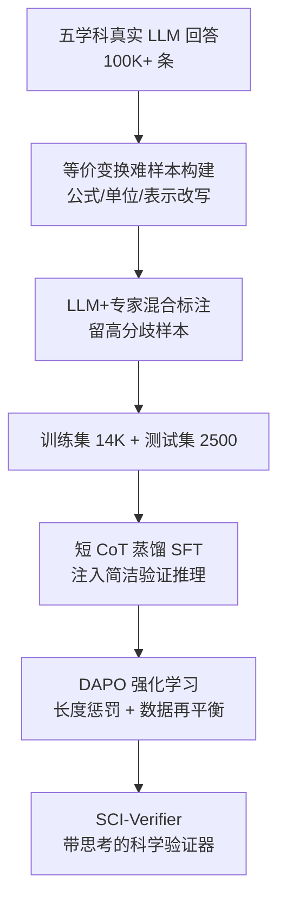

# SCI-Verifier: Scientific Verifier with Thinking

**会议**: ICLR 2026  
**OpenReview**: [https://openreview.net/forum?id=kBzqPE8FTE](https://openreview.net/forum?id=kBzqPE8FTE)  
**代码**: 无（项目页 SCI-Verifier）  
**领域**: LLM推理 / 答案验证 / 科学推理  
**关键词**: 答案验证器、等价性判断、思维链、跨学科基准、后训练

## 一句话总结
针对科学推理答案"形式多样、等价表达难判"的痛点，本文同时从数据和模型两侧出手：构建覆盖数理化生与通用 QA 五大学科、带等价变换的跨学科验证基准 SCI-VerifyBench，并用 SFT+RL 两阶段后训练出一个"带简洁思考"的验证器 SCI-Verifier，8B 版本在科学验证任务上追平闭源 SOTA 模型 GPT-5。

## 研究背景与动机

**领域现状**：随着 LLM 越来越多地用于科学推理，"判断模型输出的答案是否和参考答案等价"成了评估能力、做 RL 奖励、刷 benchmark 的基础环节。目前的验证手段主要有两类——一类是规则匹配（手写模板、正则、字符串归一化），另一类是用通用大模型或专门训练的验证器（如 xVerify、CompassVerifier）直接给"对/错"判断。

**现有痛点**：这两类做法在科学场景都不够用。规则法依赖人工堆模板和启发式，面对单位换算、公式改写、蛋白质序列的三字母/单字母表示这类领域特有的等价形式就会失效；而现有验证器/通用模型则严重依赖 prompt 工程，输出不稳定，且在多步推理和跨学科任务上泛化差。更糟的是，评测这件事本身也没有好标尺——现有验证基准学科覆盖窄（多停留在数学/逻辑），且不刻意构造"等价但形式不同"的难样本，导致没法真正衡量验证器的能力。

**核心矛盾**：科学答案的本质复杂性（多步推理 + 同一答案有大量等价写法）与现有验证器"无思考、靠表面匹配"之间存在根本矛盾。大多数验证器研究为了部署效率，刻意砍掉了推理过程，直接吐结论，而这恰恰丢掉了判断等价性最需要的那部分能力。

**本文目标**：拆成两个子问题——(1) 造一个跨学科、带难度控制、专门塞进等价变换难样本的验证基准；(2) 训一个既会推理、又输出简洁稳定、能跨学科泛化的验证器。

**切入角度**：作者做了一个被多数验证器忽视的观察——给各种规模的模型开启 CoT 思考后，科学验证准确率普遍显著上升（Fig. 1）。原因在于科学答案常有多种等价形式，需要从多个角度推演才能判断等价，单纯比对表面字符串不够。

**核心 idea**：把"推理能力"重新注入验证器，但要"简洁的推理"——用 SFT 蒸馏短 CoT、再用带长度惩罚的 RL 收紧，使验证器既能做复杂等价判断，又保持短而稳定的输出便于部署。

## 方法详解

### 整体框架
本文是"基准 + 模型"双线工作。数据侧 SCI-VerifyBench 走一条"采集真实回答 → 合成等价难样本 → LLM+专家混合标注 → 按难度/分歧过滤"的流水线，最终产出 2,500 条测试样本（五学科各 500）和 14K 训练样本，每条样本是一个四元组 $(q, a, r, l)$：问题、参考答案、待判断回答、真值标签（对/错）。模型侧 SCI-Verifier 则在 Qwen3-4B/8B-Base 上做两阶段后训练：先用大模型拒绝采样产生的高质量短推理轨迹做 SFT 把基础验证推理能力"注入"小模型，再用 DAPO（带长度惩罚的 GRPO 变体）做 RL 防过拟合、强化简洁推理。

### 关键设计

**1. 等价变换难样本构建：把"形式不同但答案相同"做成基准的核心难度**

现有验证基准的盲区是：样本大多是"回答和参考答案长得一模一样"的简单情况，再强的验证器在这种数据上都接近满分，根本测不出真实差距。本文先从五个学科各采集 15k+ 问答对、用 8 个不同规模的模型生成 100K+ 真实回答，覆盖各种问题与答案风格；再针对每个学科挑出 500 个允许等价变换的代表性问题，每题生成 5 个等价答案，涵盖数学的数值等价、物理的单位换算、化学的名称↔分子式转换、生物的蛋白序列单字母↔三字母表示、QA 的等价表述等。生成时用 5 个 LLM 互评等价质量，明显无效且多模型一致否决的样本被丢弃重生成。正是这批等价样本最能拉开差距——实验里连 GPT-5 在数学、物理的等价子集上都掉到 60% 以下，而 SCI-Verifier 显著更高。

**2. LLM+专家混合标注与难度过滤：用"模型分歧"自动筛出值得人标的硬骨头**

全量人工标注 5,000+ 样本成本高、且容易把简单样本也标了浪费预算。作者的做法是先让 5 个 LLM 对每条样本判对错，只保留"五个模型意见不一致"的样本——分歧大恰恰意味着这是难样本。从两条数据通路（真实/合成）里挑出模型分歧最大的 2,500 条（每学科 500）交给人标，每条至少两名本科及以上学历专家判断，分歧时引入第三人仲裁，判据是"两答案能否相互转化即视为等价"。测试集进一步要求专家全体一致、并优先纳入人机分歧样本以提高难度；训练集则反过来滤掉 LLM 之间分歧过大的样本以保证标签可靠，得到 14K 训练集。这套"用分歧度当难度信号"的机制让基准在控制标注成本的同时保持了高区分度。

**3. 短 CoT 蒸馏 SFT：把"会推理"注入小模型，但只留精炼的推理痕迹**

验证任务和数学/物理那种 IMO 级难题不同——它相对简单，只需领域知识 + 简短推理，长链思考反而浪费资源还可能跑偏。所以 SFT 阶段用大模型 + 拒绝采样产生结构化推理路径后，做严格过滤：对推理模型只保留结论性的总结段，对非推理模型丢弃过长或无结构的回答，只留下"有价值且简洁"的轨迹去微调小模型。训练目标是标准的轨迹似然 $L_{\text{SFT}}(\theta) = -\mathbb{E}_{(x,y)\sim D_{\text{SFT}}}[\log \pi_\theta(y\mid x)]$。和数学/物理领域 SFT 主要管"输出格式"不同，验证 SFT 的核心是把领域特定的验证知识迁移进小模型。消融显示蒸馏完整 CoT 不仅没涨点、反而大幅拉长输出，证实"短推理"才是验证任务的正确选择。

**4. 带长度惩罚的 DAPO 强化学习：防过拟合、压输出长度、再平衡正负样本**

SFT 后模型已具备基础验证能力和格式，但容易过拟合。RL 阶段用 DAPO（GRPO 的改良版），它会过滤掉过易和过难的样本，并加长度惩罚鼓励简洁推理。优势函数按组内奖励归一化 $\hat{A}_{i,t} = (R_i - \text{mean}(\{R_j\}))/\text{std}(\{R_j\})$，最终奖励是对齐奖励加超长惩罚 $R_i = R_{\text{align},i} + P_{\text{overlong},i}$：预测与真值一致时 $R_{\text{align}}=1$ 否则为 0；超长惩罚分三段——长度 $\le L_{\max}$ 不罚，在 $L_{\max}$ 到 $L_{\max}+L_{\text{buffer}}$ 之间按超出比例线性惩罚 $-\frac{|o_i|-L_{\max}}{L_{\text{buffer}}}\cdot\lambda_{\text{penalty}}$，再超则固定罚 $-\lambda_{\text{penalty}}$。由于验证是二分类，标签不均会让模型靠先验而非推理作答，所以 RL 阶段把正负样本再平衡到 1:1。SFT 与 RL 互补：实验显示二者结合在跨数据集泛化上最佳，直接对 Base 模型上 RL（无 SFT 暖启）效果很差。

## 实验关键数据

### 主实验
在自建 SCI-VerifyBench（五学科各 500，正负平衡，报 Accuracy）上，SCI-Verifier-8B 全面领先，并追平/反超闭源 SOTA GPT-5：

| 模型 | Math | Physics | Chemistry | Biology | QA | Total | Avg.Token |
|------|------|---------|-----------|---------|----|-------|-----------|
| GPT-5（闭源） | 90.0 | 89.0 | 85.4 | 84.8 | 95.4 | 88.92 | 384.6 |
| CompassVerifier-32B | 90.0 | 82.0 | 84.0 | 85.4 | 89.8 | 86.24 | 212.0 |
| xVerify-8B（无思考） | 77.8 | 60.6 | 85.8 | 88.6 | 88.0 | 80.16 | 1.0 |
| **SCI-Verifier-4B** | 92.4 | 84.6 | 86.4 | 94.2 | 93.4 | **90.20** | 485.1 |
| **SCI-Verifier-8B** | 93.8 | 90.4 | 87.8 | 96.4 | 95.2 | **92.72** | 490.7 |

在两个外部基准 VerifierBench 与 VerifyBench-Hard 上同样领先，验证跨任务泛化：

| 模型 | VerifierBench Acc/F1 | VerifyBench-Hard Acc/F1 |
|------|----------------------|--------------------------|
| GPT-5 | 91.80 / 90.48 | 90.40 / 85.34 |
| CompassVerifier-32B | 89.88 / 88.91 | 88.30 / 85.86 |
| **SCI-Verifier-8B** | **93.01 / 93.06** | **90.30 / 87.45** |

### 消融实验

| 配置 | 关键结论 | 说明 |
|------|---------|------|
| SFT only | 已有较强验证能力 | 监督适配即可注入基础任务推理 |
| Only-RL（从 Base 直接 RL） | 表现最差 | 缺 SFT 暖启，学不到针对性推理 |
| RL from 推理模型 | 有竞争力 | 但不及 SFT+RL |
| **SFT+RL** | **最佳**，尤其跨数据集泛化 | 两阶段互补 |
| 完整 CoT 蒸馏 | 不涨点 + 输出大幅变长 | 验证任务不需长链推理 |
| w/o CoT（无思考推理模式） | 推理更快但显著掉点 | 证实思考对科学验证的必要性 |

### 关键发现
- **思考是验证科学答案的关键**：开启 CoT 普遍带来显著提升；去掉思考虽快但大幅掉点，因为科学答案常有多种等价形式，需多角度推演。
- **等价样本是真正的试金石**：在等价增强子集上，连 GPT-5 在数学/物理都跌破 60%，而 SCI-Verifier 显著更高，说明针对等价做优化是核心价值。
- **模型规模不是决定因素**：增大参数不一定涨点（Fig. 4a），因为现有模型并未针对"答案等价"这个目标优化，光堆容量没用——这也解释了为何 4B/8B 小模型能反超百亿级通用模型。
- **学科难度有别**：数学/物理因泰勒展开等复杂变换得分偏低，其他学科只要具备前置知识判断就更直接，提示需要学科特化验证器。
- **prompt 鲁棒性强**：换用 xVerify 风格 prompt 时 SCI-Verifier 几乎不掉点，而通用模型（如 Qwen3-30B 在 VerifyBench-Hard 上从 88.7 掉到 75.4）对 prompt 高度敏感，因为它们缺乏对"答案等价"的内在概念。

## 亮点与洞察
- **"用模型分歧度当难度信号"很巧**：既自动筛出真正难判的样本，又把昂贵的人工标注集中在刀刃上，是个可复用的数据构建 trick。
- **反直觉的"短推理胜过长推理"**：验证不是解题，需要的是"从固定几个角度快速核对等价"而非长链演算，蒸馏短 CoT 既省 token 又不掉点，对部署友好。
- **重新发现被验证器社区忽视的"思考"**：多数验证器为效率砍掉推理，本文证明这恰恰丢掉了判断等价最需要的能力，是个有说服力的"回归常识"洞见。
- **可迁移性**：把"等价变换"显式做进基准的思路，可推广到代码、SQL、化学反应式等任何"同一正确答案有多种合法写法"的验证场景。

## 局限与展望
- **学科特化未真正落地**：作者自己指出不同学科难度差异大、暗示需要学科特化验证器，但本文给的是统一模型，未做学科级定制。
- **基准规模有限**：测试集 2,500 条、每学科 500，等价变换类型虽列举但未穷尽，复杂跨学科混合题（如物理化学交叉）覆盖不足。
- **依赖 LLM 标注**：训练集大多靠 LLM 标注，仅小部分人标，标签噪声对 RL 奖励的影响未充分量化。
- **改进方向**：可探索按学科自适应选择推理深度（数学多推、QA 少推）、把验证器直接当 RL 奖励模型闭环训练更强的推理 LLM。

## 相关工作与启发
- **vs xVerify**：xVerify 高效但无推理，导致在等价/复杂样本上明显偏弱（物理仅 60.6）；本文证明注入简洁推理能在保持小模型规模下大幅反超。
- **vs CompassVerifier**：CompassVerifier 靠精心设计的错误模板做高鲁棒验证，但仍受限于推理能力；SCI-Verifier 用 SFT+RL 直接学会推理，且 prompt 鲁棒性更强。
- **vs 奖励模型（J1 / Think-J / Compass-Judger2）**：奖励模型排序回答质量，验证器判断正确性，目标不同带来数据构建与训练策略的差异；本文聚焦"对/错"等价判断这一更明确的语义。

## 评分
- 新颖性: ⭐⭐⭐⭐ 把"被忽视的思考"重新引入验证器 + 等价变换难样本基准，角度扎实但属于"组合已知技术做对方向"。
- 实验充分度: ⭐⭐⭐⭐⭐ 三基准、四类 baseline、规模/学科/prompt/训练四维消融，证据链完整。
- 写作质量: ⭐⭐⭐⭐ 动机清晰、图表支撑充分，部分等价案例细节散在附录。
- 价值: ⭐⭐⭐⭐⭐ 小模型追平 GPT-5、可直接当 RL 奖励，对科学推理评测与训练管线实用价值高。

<!-- RELATED:START -->

## 相关论文

- [\[ICLR 2026\] ROC-n-Reroll: How Verifier Imperfection Affects Test-Time Scaling](roc-n-reroll_how_verifier_imperfection_affects_test-time_scaling.md)
- [\[AAAI 2026\] Improving Value-based Process Verifier via Low-Cost Variance Reduction](../../AAAI2026/llm_reasoning/improving_value-based_process_verifier_via_low-cost_variance_reduction.md)
- [\[ICLR 2026\] Unleashing Scientific Reasoning for Bio-Experimental Protocol Generation via Structured Component-based Reward Mechanism](unleashing_scientific_reasoning_for_bio-experimental_protocol_generation_via_str.md)
- [\[ACL 2025\] Local Look-Ahead Guidance via Verifier-in-the-Loop for Automated Theorem Proving](../../ACL2025/llm_reasoning/local_look-ahead_guidance_via_verifier-in-the-loop_for_automated_theorem_proving.md)
- [\[ICLR 2026\] TSLM: Tree-Structured Language Modeling for Divergent Thinking](tslm_tree-structured_language_modeling_for_divergent_thinking.md)

<!-- RELATED:END -->
