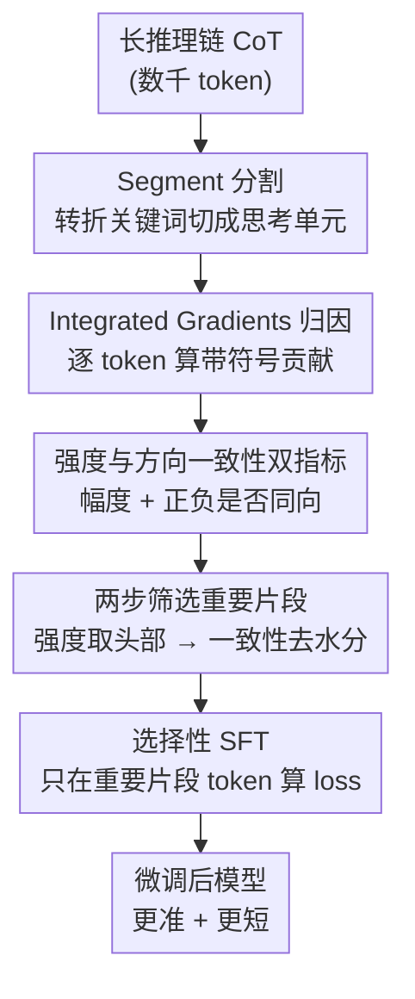

# Segment-Level Attribution for Selective Learning of Long Reasoning Traces

**会议**: ICLR2026  
**arXiv**: [2602.00425](https://arxiv.org/abs/2602.00425)  
**代码**: [GitHub](https://github.com/SiyuanWangw/SegmentSelectiveSFT)  
**领域**: LLM推理  
**关键词**: reasoning trace, integrated gradients, selective SFT, segment attribution, CoT compression  

## 一句话总结
用Integrated Gradients计算长推理链中每个segment对最终答案的归因强度和方向一致性，识别重要segment进行选择性SFT，相比全CoT训练提升准确率达4.7%同时缩短输出18%。

## 背景与动机
1. 大推理模型(LRM)生成数千token的CoT，但仅少部分真正对答案预测有贡献，大量冗余重复/截断内容
2. 对冗余CoT做全量SFT会使模型学习冗长无信息模式，浪费学习能力甚至降低性能
3. 现有压缩方法token-level分析忽略语义完整性，segment-level的困惑度/熵指标与重要性不完全一致
4. 困惑度方法存在假阳性（高估过渡文本）和假阴性（低估验证/中间结论）问题
5. 需要直接度量segment对正确答案预测的因果贡献

## 方法详解

### 整体框架
长推理链里只有一小部分内容真正推动答案，其余是重复、截断、套话；直接拿整条 CoT 做 SFT 会让模型把这些冗余也学进去，反而越训越啰嗦、越训越差。本文的思路是：先把一条长 CoT 按转折关键词切成若干语义片段，再用 Integrated Gradients（积分梯度，IG）逐 token 量出它对最终正确答案的因果贡献，把 token 级归因聚合成片段级的「归因强度」和「方向一致性」两个指标，据此分两步筛出真正重要的片段，最后只在这些片段的 token 上算 loss 做选择性 SFT（Selective SFT）。整条流水线不改训练目标的形式，只改"哪些 token 该学"，因此能像普通 SFT 一样即插即用。

### 关键设计

**1. Segment 分割：把推理链切成可归因的思考单元**

token 级别的重要性分析会割裂语义，而一句完整的推理（问题理解、中间探索、验证）往往要跨多个 token 才有意义，逐 token 筛选很容易删半句、毁掉上下文连贯。本文先用一组转折关键词（如 `\n\nWait`、`\n\nAlternatively`、`\n\nLet me`）把长 CoT 切成片段 $T=\{S_1,\dots,S_n\}$，每个片段恰好对应一个独立的思考动作，后续所有归因和筛选都在片段粒度上做，从而保证选择时不破坏推理的语义完整性。

**2. Integrated Gradients 归因：直接量出 token 对正确答案的因果贡献**

困惑度、熵这类间接指标会高估过渡性的脚手架文本（如"那我们一步步算"）、低估独立验证和中间结论，因此既有假阳性又有假阴性；而逐段拼接或留一法（leave-one-out）又会低估那些"间接打基础"的探索片段。本文改用 IG：以 padding embedding 为 baseline $x'$，沿到真实 embedding $x$ 的直线路径积分梯度，用 $J$ 个插值步近似

$$\text{IG}_i(x) \approx (x_i - x_i') \times \frac{1}{J}\sum_{j=1}^{J}\frac{\partial F(x'+\frac{j}{J}(x-x'))}{\partial x_i}$$

其中 $F$ 是模型对正确答案的预测概率。这样每个 token $o_n$ 都拿到一个带符号的归因值 $\text{IG}(o_n)$，正号表示它在推高正确答案概率、负号表示在拉低，幅度表示贡献大小——IG 同时捕捉直接和间接影响，正是 PPL/熵给不出的方向信息。

**3. 强度与方向一致性双指标：分别刻画"贡献多大"和"贡献是否纯粹"**

拿到逐 token 的带符号归因后还要聚合到片段：单看幅度会被长片段的 token 数量带偏，单看正负号又分不清贡献量级，所以本文把片段级重要性拆成两个互补指标。归因强度 $\text{Strength}(S) = \sum_{o_n \in S}|\text{IG}(o_n)| / \sqrt{N}$ 用 $\sqrt{N}$ 归一化抵消长度优势（再在一条 CoT 内做全局归一使各片段可横向比较）；方向一致性 $\text{Consistency}(S) = |\sum \text{IG}(o_n)| / \sum|\text{IG}(o_n)|$ 衡量片段内正负贡献是否同向，取值接近 1 说明 token 几乎全正或全负，对应浅层确认或彻底跑偏的错误探索，而中等值意味着片段里既有支持又有自我纠正——这恰恰是反思性推理的指纹。用绝对值算强度也保证了"先错后纠"的探索片段不会因为净归因偏负而被当成不重要。

**4. 两步筛选重要片段：先按量级取头部、再按方向去水分**

有了两个指标，本文按"先量级、后方向"两步定出重要片段集 $\mathcal{S}_{\text{important}}$。第一步把片段按归因强度降序排列，取累计强度首次达到阈值 $\tau=70\%$ 的最小 top-$k^*$ 个片段（数据上约 30–40% 的片段就承载了 80%+ 的总归因，冗余很多）；第二步在这批头部片段里过滤掉方向一致性 $>\beta=0.8$ 的，只保留一致性 $\le 0.8$ 的作为重要片段。先量级后方向的顺序保证既不漏掉高贡献片段，又能剔除只做表面确认的"水"片段。这套阈值（$\tau=0.7$、$\beta=0.8$ 由验证集贪心搜索得到）平均把约 33% 的片段标为重要，但因为重要片段普遍更长，它们覆盖了约 45% 的 token。

### 损失函数 / 训练策略
训练时完整 CoT 仍整条喂进模型以保持自回归上下文的连贯，但只有落在重要片段里的 token 才计入交叉熵，其余 token 的 loss 被指示函数 $I(o_t)$（标记 $o_t$ 是否属于某个重要片段）mask 为 0：

$$L_{\text{Selective-SFT}}(\theta) = -\frac{1}{\sum_t I(o_t)}\sum_{t=1}^{T}I(o_t)\log P(o_t \mid o_{<t}, q; \theta)$$

这相当于一种隐式正则化：模型仍能读到全部上下文，却不会去拟合冗余、重复或截断的填充内容，参数更新被引导向关键推理模式，因此准确率和输出长度能同时改善。这也比"直接剪掉冗余 token 再 SFT"的剪枝方案更稳——剪枝会破坏轨迹连贯、反而掉点。

## 实验

| 模型 | 方法 | Overall Acc | 输出长度 |
|------|------|:-----------:|:--------:|
| R1-Distill-Qwen-1.5B | Full SFT | 44.8 | 16520 |
| R1-Distill-Qwen-1.5B | **Segment Selective** | **46.9**(+4.7%) | 13506(-18%) |
| R1-Distill-Qwen-7B | Full SFT | 62.1 | 9693 |
| R1-Distill-Qwen-7B | **Segment Selective** | **64.5**(+3.9%) | 8499(-12%) |
| Qwen2.5-7B-Instruct | Full SFT | 44.2 | 10317 |
| Qwen2.5-7B-Instruct | **Segment Selective** | **45.6**(+3.2%) | 9852(-5%) |

### 消融实验与分析

| 设置 | Overall Acc | Overall Length |
|------|:-----------:|:--------------:|
| R1-Distill-Qwen-7B (base) | 57.7 | 12518 |
| + Full CoT SFT | 62.1 | 9693 |
| + Token-level pruning SFT | 60.5 | 8112 |
| + **Segment Selective SFT** | **64.5** | **8499** |
| Only Strength (无Consistency过滤) | 63.2 | 8856 |
| Only Consistency (无Strength排序) | 61.8 | 9234 |

**关键发现**:
1. 30-40%的segment贡献80%+的总归因(CDF曲线验证)，大量冗余
2. 重要segment具有更低困惑度/熵，不重要segment更多重复(高BLEU>0.8)和截断(49% vs 26%)
3. Selective SFT一致优于全量SFT和token-level剪枝方法——剪枝会破坏上下文完整性
4. 在OOD难题(AIME24)上提升最显著(+13.3 pp)，说明选择性学习帮助模型更好泛化
5. 方向一致性过滤(β=0.8)额外贡献约1.3%的准确率提升，验证了segment内正负混合推理的价值
6. 该方法思路可泛化到RL场景——在重要segment上加大policy gradient权重
7. 温度采样(pass@6)下Selective SFT优势更明显，说明学到了更好的推理模式而非仅拟合特定输出

## 亮点与洞察
- 用IG归因直接度量segment对答案的因果贡献，比PPL/熵等间接指标更可靠
- 方向一致性(consistency)指标设计巧妙：区分浅层确认vs反思性推理
- Selective SFT同时提升准确率和效率（缩短输出），双赢
- 分析透彻：验证了不重要segment确实对应重复/截断/废话

## 局限性
- IG计算需多步插值前向传播，计算开销较大（虽是一次性成本）
- 关键词分割方式较简单，可能不适应所有推理风格
- 仅在数学推理数据集上验证，对代码生成/自然语言推理的效果未知
- τ和β阈值需在验证集上搜索，增加调参成本

## 相关工作
- CoT压缩: Xia et al. 2025b token-level分析; Cui et al. 2025b segment-level PPL; Li et al. 2025b 基于熵
- Selective SFT: Lin et al. 2024 selective learning framework
- 归因方法: Sundararajan et al. 2017 Integrated Gradients; 本文首次应用于推理链segment
- 长推理冗余: Wang et al. 2025d 分析截断思维; Wu et al. 2025 冗长降低推理性能

## 评分
- 新颖性: ⭐⭐⭐⭐ (IG+segment归因+selective SFT组合新颖)
- 实验充分度: ⭐⭐⭐⭐ (多模型+ID/OOD+消融充分)
- 写作质量: ⭐⭐⭐⭐ (分析细致，可视化好)
- 价值: ⭐⭐⭐⭐ (对长推理链训练有直接工程价值)

<!-- RELATED:START -->

## 相关论文

- [\[ICLR 2026\] Tracing the Traces: Latent Temporal Signals for Efficient and Accurate Reasoning](tracing_the_traces_latent_temporal_signals_for_efficient_and_accurate_reasoning.md)
- [\[NeurIPS 2025\] Segment Policy Optimization: Effective Segment-Level Credit Assignment in RL for Large Language Models](../../NeurIPS2025/llm_reasoning/segment_policy_optimization_effective_segment-level_credit_assignment_in_rl_for_.md)
- [\[ICLR 2026\] PERK: Long-Context Reasoning as Parameter-Efficient Test-Time Learning](perk_long-context_reasoning_as_parameter-efficient_test-time_learning.md)
- [\[ICLR 2026\] Is In-Context Learning Learning?](is_in-context_learning_learning.md)
- [\[ACL 2026\] SPPO: Sequence-Level PPO for Long-Horizon Reasoning Tasks](../../ACL2026/llm_reasoning/sppo_sequence-level_ppo_for_long-horizon_reasoning_tasks.md)

<!-- RELATED:END -->
