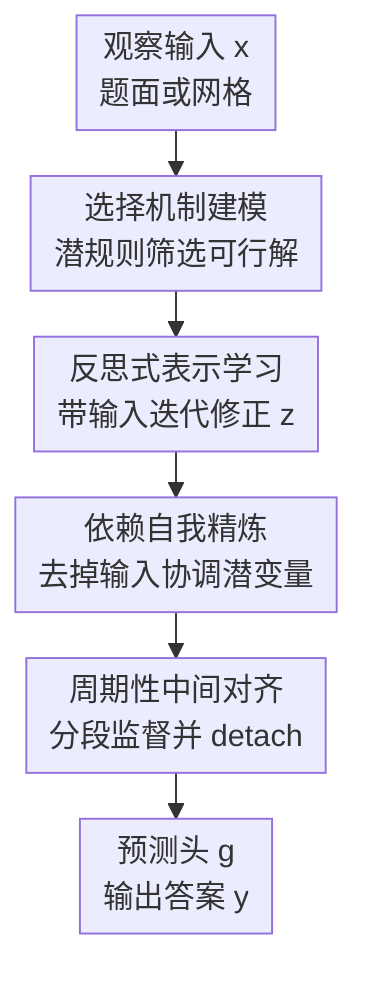

# Selection, Reflection and Self-Refinement: Revisit Reasoning Tasks via a Causal Lens

**会议**: ICLR 2026  
**OpenReview**: [https://openreview.net/forum?id=0X5moS8KSm](https://openreview.net/forum?id=0X5moS8KSm)  
**代码**: https://github.com/dengyl20/SR2  
**领域**: LLM推理 / 因果分析  
**关键词**: 因果选择机制、潜变量推理、递归 Transformer、自我精炼、约束满足  

## 一句话总结
这篇论文把 Sudoku、Maze、ARC 这类推理任务解释为因果选择机制下的潜变量约束满足问题，并提出 SR2 用反思式表示学习、依赖自我精炼和周期性中间对齐来迭代修正潜表示，在更少参数下显著提升结构化推理准确率。

## 研究背景与动机
**领域现状**：推理任务一直是检验机器学习模型，尤其是大语言模型是否真正具备抽象能力的重要基准。近年的路线大致有两类：一类继续扩大预训练、后训练和推理时计算；另一类给模型加入 chain-of-thought、奖励模型或自我反馈，让模型产出更像人类解题步骤的中间轨迹。

**现有痛点**：这些做法能提高分数，却没有真正解释推理为什么难。规模化模型可能学到输入到答案的相关性，CoT 监督也可能只是模仿自然语言解释的表面形式；一旦任务需要在隐含规则之间保持全局一致，模型仍然容易出现局部正确、整体矛盾的结果。对 Sudoku 来说，填一个格子不是只看附近数字，而是要同时满足行、列和宫的约束；对 Maze 来说，下一步路径也要和整条最短路径的可达性一致。

**核心矛盾**：作者认为难点不在于观察空间本身有多大，而在于观察背后的潜变量空间更复杂，而且潜变量之间高度耦合。一个题面 $x$ 和答案 $y$ 可能是唯一确定的，但通向答案的规则组合、候选中间状态和可行推理轨迹非常多；同时，潜变量中的一个局部修改会牵动大量其它变量。只学 $x \rightarrow y$ 的直接映射，就容易绕开这种结构。

**本文目标**：论文要做两件事。第一，用因果里的 selection mechanism 给推理任务一个统一解释：高层逻辑概念像选择算子一样筛掉不满足规则的观察-答案组合。第二，把这个解释落到模型设计上，让模型不是一次性吐出答案，而是在潜空间中反复反思、清理依赖关系，并在长递归训练中保持可优化。

**切入角度**：作者从 Sudoku 的约束满足例子出发，把推理写成由潜规则 $z$ 选择观察对 $(x,y)$ 的过程。这个角度有意思的地方在于，它把“会推理”从“输出正确答案”转成“找到满足选择约束的潜状态”。于是模型设计自然指向 fixed-point / recurrent refinement，而不是单纯堆深层 Transformer。

**核心 idea**：用一个共享的递归 Transformer block 在潜空间中先带输入做反思式初始化，再去掉输入只靠潜状态自我精炼，最后用周期性中间监督稳定长递归训练，从而显式学习推理任务中的密集潜变量依赖。

## 方法详解

### 整体框架
SR2 的整体逻辑可以分成“因果建模”和“神经实现”两层。因果层把推理任务写成选择机制：潜规则 $z$ 决定哪些 $(x,y)$ 组合满足约束；神经层则用一个权重共享的 Transformer block 反复更新潜状态 $z$，先从输入中抽取可用信息，再让潜状态在没有输入注入的情况下继续自我协调，最后通过预测头 $g$ 输出答案。

训练时，SR2 设定两个迭代尺度：每个对齐块内部运行 $M$ 次更新，一共运行 $N$ 个对齐块。第一个块执行 reflective representation learning，每一步都把观察 $x$ 注入更新 $z^{(t+1)}=f(z^{(t)},x)$；后续块执行 dependency self-refinement，不再注入 $x$，而是更新 $z^{(t+1)}=f(z^{(t)},0)$。每隔一个块用 $g(z)$ 产生中间预测并计算损失，随后 detach 状态，避免远距离梯度把训练拖垮。

这个流程里，选择机制更多是理论解释和设计动机；真正的可训练模块是后面三块。反思式表示学习负责把题面信息压进潜状态，依赖自我精炼负责解决潜变量之间的全局一致性，周期性中间对齐负责让长递归模型能稳定训练。三者合起来，构成了“Selection, Reflection and Self-Refinement”的 SR2。

### 关键设计
**1. 选择机制建模：把推理难点从答案空间转到潜规则空间**

论文首先把推理任务写成一个因果选择过程。令 $x$ 表示观察输入，$y$ 表示答案，$z$ 表示潜在规则或逻辑概念，只有当选择条件 $S(z)=1$ 时，对应的 $(x,y)$ 才是有效样本。形式上，作者写出联合分布 $p(x,y)=\int p(z)p_g(x,y|z)I(S(z)=1)dz$。这个式子不是为了直接估计联合分布，而是为了强调：训练数据中出现的答案，是被隐藏规则筛选后的结果。

这个视角解释了为什么直接拟合 $p(y|x)$ 不够。以 Sudoku 为例，题面给出的数字是观察空间，答案也是确定的，但潜在规则包括行、列、宫、候选排除和填数顺序等大量可行轨迹。即使唯一解存在，潜变量集合仍然可能远大于观察本身。作者在附录里用填空顺序说明：若有 $n$ 个空格，固定一个完整解也有 $n!$ 种有效填充轨迹；这让“唯一答案”背后仍然有巨大的潜空间。

**2. 反思式表示学习：用输入反馈压缩过大的潜空间**

SR2 的第一阶段解决的是“从题面进入潜空间”的问题。模型从零初始化潜状态 $z^{(0)}$，然后反复应用共享更新函数 $z^{(n+1)}=f(z^{(n)},x)$。这里的关键不是把 Transformer 加深，而是把同一个 atomic block 当成一个 fixed-point operator：每次更新都看到上一步潜状态和观察输入，让表示逐步靠近一个同时解释输入、又更接近约束满足的潜状态。

这和普通多层 Transformer 的区别在于参数共享和状态反馈。标准 Transformer 可以写成不同层 $h^{(l+1)}=T_l(h^{(l)},x)$，SR2 则把它压平为同一个 block 的递归调用 $h^{(m+1)}=T(h^{(m)},x)$。参数少了，但有效深度来自迭代次数。作者借鉴了 deep equilibrium model 的直觉，却没有用隐式函数定理求无限深平衡，而是显式展开固定步数，使训练目标可以直接作用在中间轨迹上。

**3. 依赖自我精炼：去掉输入后强迫潜变量自己达成一致**

如果一直把 $x$ 注入每个递归步骤，模型可能会继续依赖观察中的浅层模式，而不是学习潜规则之间的约束传播。因此 SR2 在得到初始潜状态后进入第二阶段：把输入置零，仅用 $z^{(t+1)}=f_s(z^{(t)},0)$ 继续更新。由于后续更新不能再从题面拿信息，模型必须在潜状态内部消解冲突，让行、列、路径、抽象转换等隐含变量彼此协调。

这个设计正好对应作者的第二个假设：可行潜变量是密集依赖的。Sudoku 中一个格子变化会影响同一行、列、宫；Maze 中某个路径选择会影响后续可达性；ARC 中局部图案变换也会改变全局一致性。自我精炼让这些依赖通过同一个共享 block 反复传播。实验里去掉这一步后 Sudoku-Extreme 从 $66.63\%$ 掉到 $53.11\%$，说明“有输入反馈”还不够，长程潜变量协调本身是核心贡献。

**4. 周期性中间对齐：把长递归训练拆成可优化的短段**

SR2 的总更新步数是 $T=M\times N$，如果只在最后一步加监督，梯度需要穿过很长的递归链，很容易消失或变得不稳定。作者因此在若干对齐点 $A$ 上加入中间监督，目标写成 $L=\sum_{t\in A}\ell(g(z^{(t)}),y)$。每个对齐块结束后，模型用当前 $z$ 预测答案并计算损失，再将状态 detach，让后一个块不能把梯度反传回很远的过去。

这不是简单的 deep supervision。它和前两阶段配合后，形成一种“分段逼近固定点”的训练方式：每个块都要让潜状态更接近可读出的答案，但块与块之间又保留状态传递。消融显示，频繁重新注入输入反而会变差：Mixture 2 Reflections 为 $63.32\%$，Mixture 4 Reflections 降到 $55.25\%$。这说明 SR2 不是靠多次看输入取胜，而是靠一次输入建模之后的长时间潜空间自我协调。

### 一个完整示例
以 Sudoku 中某个待填格 $Y_{ij}$ 为例，观察输入 $x$ 是一个部分填好的 $9\times9$ 网格，目标 $y$ 是所有空格的补全结果。传统直接预测会把每个空格当成分类问题，最多通过 attention 看见同一行、列、宫的信息；但它不一定保证整张盘面一致。

在 SR2 中，第一个 $M$ 步把题面数字反复注入潜状态。模型会逐渐形成对候选数字、行约束、列约束和宫约束的内部编码，例如某个格子暂时倾向于候选 $\{2,5,8\}$，相邻格子也有各自的候选集。进入自我精炼后，模型不再读题面，而是在这些候选状态之间传播约束：如果同一宫里另一个格子被更新为 $5$，这个格子的候选就应当同步排除 $5$；如果某一行只剩一个位置可放 $8$，其它相关潜状态也要跟着收缩。

每运行完一个对齐块，预测头都把当前潜状态解码成完整盘面并接受监督。早期输出可能只有局部合法，后期输出逐渐满足行、列和宫的联合约束。这个例子能看出 SR2 和 verbal self-refinement 的区别：它不是让模型写一句“我再检查一下”，而是在隐藏状态中持续更新候选结构。

### 损失函数 / 训练策略
SR2 的训练目标是任务特定损失的周期性求和，核心形式为 $L=\sum_{t\in A}\ell(g(z^{(t)}),y)$。其中 $g$ 是把潜状态映射到答案空间的预测头，$\ell$ 在 Sudoku、Maze 这类离散输出任务上可理解为与目标答案对齐的分类损失；论文实现中所有 baseline 使用相同 backbone、优化器、学习率、batch size 和损失函数，以保证比较公平。

默认超参数采用 $M=N=16$。作者在固定 $M\times N=256$ 的预算下扫过不同配比，发现 $M\approx N$ 时效果最好；若二者不平衡，$M>N$ 的退化比 $N>M$ 更轻。训练使用 AdamAtan2，学习率 $1\times10^{-4}$，batch size 为 768；Sudoku-Extreme 和 Maze-Hard 都训练 60,000 epochs。硬件为 8 张 AMD MI210 64GB GPU，Sudoku 训练约 1 小时，Maze 约 15 小时。

## 实验关键数据

### 主实验
作者在 Sudoku-Extreme、Maze-Hard 和 ARC-AGI 上评估 SR2。Sudoku-Extreme 只有 1,000 个训练题、422,786 个测试题，平均需要 22 个 backtracking steps；Maze-Hard 是 $30\times30$ 迷宫，训练和测试各 1,000 个实例；ARC-1 / ARC-2 用官方任务划分，并报告 pass@2。

| 方法 | 参数量 | Sudoku-Extreme | Maze-Hard | ARC-1 | ARC-2 |
|------|--------|----------------|-----------|-------|-------|
| Transformer | 27.3M | 1.17 | 0 | 21.0 | 0 |
| Block Universal Transformer | 3.4M | 0 | 30.4 | - | - |
| Recurrent Depth | 3.4M | 42.52 | 48.4 | - | - |
| HRM | 27.3M | 55.0 | 74.5 | 40.3 | 5.0 |
| Reflective Model | 27.3M | 53.12 | 70.8 | - | - |
| SR2 | 3.4M | 66.63 | 93.7 | 44.3 | 6.7 |

这张表最重要的信息不是 SR2 只比某个 baseline 高一点，而是参数效率非常突出。SR2 只有 3.4M 参数，却在 Sudoku-Extreme 上比 27.3M 的 HRM 高 $11.63$ 个点，在 Maze-Hard 上高 $19.2$ 个点；相比 Recurrent Depth，Sudoku 提升约 $24.11$ 个点，Maze 几乎翻倍。

| 方法 | 训练速度 Batch/s | 训练显存 GB | 推理速度 Sample/s |
|------|------------------|-------------|-------------------|
| Direct Pred | 21.39 | 3.024 | 7489.6 |
| HRM | 10.57 | 3.231 | 1487.7 |
| SR2 | 14.73 | 3.950 | 2073.6 |

效率上，SR2 比直接预测慢，因为它有周期性对齐和更多迭代；但它仍然比 HRM 快，推理速度约为 2073.6 samples/s，高于 HRM 的 1487.7 samples/s。代价是训练显存略高，达到 3.950GB。

### 消融实验
| 配置 | Sudoku-Extreme 准确率 | 说明 |
|------|----------------------|------|
| No Self-Refinement | 53.11 | 不做后续潜空间自我精炼，主要剩下输入反馈 |
| No Reflection | 0 | 不重复注入输入，模型无法保留题面特征 |
| Mixture (2 Reflections) | 63.32 | 在多个块中重新注入输入，略低于默认 SR2 |
| Mixture (4 Reflections) | 55.25 | 过多输入注入明显干扰潜依赖学习 |
| Separate Function | 59.76 | 反思与精炼使用两个不同函数，反而变差 |
| Reflective Model | 53.12 | 8 层非共享反思模型 |
| Flattened Reflective Model | 53.75 | 单层共享递归可替代深堆叠 |
| SR2 | 66.63 | 默认完整模型 |

### 关键发现
- 反思和自我精炼都是必要的。去掉 Reflection 后准确率直接归零，说明模型首先必须反复吸收观察输入；去掉 Self-Refinement 后仍有 $53.11\%$，但明显低于完整模型，说明潜变量之间的长程协调贡献很大。
- 更多输入反馈不一定更好。2 次 reflection 已经低于默认，4 次 reflection 退化更明显，作者据此认为频繁注入 $x$ 会诱导模型拟合浅层输入模式，而不是学习潜空间依赖。
- 一个共享函数足够。Separate Function 用两个 Transformer layer 分别处理 reflection 和 self-refinement，准确率低于共享版本，说明两阶段不必由两个完全不同的动力系统承担。
- SR2 对任务类型有边界。附录在 CUB-200-2011 细粒度分类上测试，ViT 约 $75\%$ top-1，而 SR2 低于 $45\%$；这支持作者的判断：迭代潜空间精炼适合约束满足和复杂推理，不适合输入到标签关系比较直接的分类任务。

## 亮点与洞察
- 因果选择机制给“推理为什么难”提供了比经验叙述更清楚的语言。它把问题从“模型不会输出答案”改写成“模型没有学到筛选可行潜状态的约束结构”，这对分析 Sudoku、Maze、ARC 这类任务很自然。
- SR2 的漂亮之处在于把理论假设直接转成架构分工。潜空间大，所以先用 reflection 缩小搜索；潜变量耦合强，所以再用 self-refinement 做无输入协调；递归链太长，所以用 periodic alignment 分段训练。
- 论文把 recurrent Transformer、DEQ、latent reasoning 和 self-refinement 几条线索放在同一框架里。它不追求语言形式的“自我反省”，而是把反省落实为隐藏状态的固定点迭代，这一点对 LLM 推理架构很有启发。
- 参数效率是一个很有价值的信号。SR2 用单层共享 Transformer 反复迭代，胜过更大的 HRM，说明在某些结构化推理任务上，“正确的计算过程”比“更多独立层参数”更关键。
- 对 test-time compute 的分析也比较实际。论文指出减少测试对齐步数会形成准确率-吞吐的 Pareto frontier，而把测试步数推到训练 horizon 之外收益有限，这提醒后续方法不能只靠无限加推理步数。

## 局限与展望
- 选择机制视角可能过于理想化。Sudoku 和 Maze 有明确、封闭、可验证的约束，但自然语言推理、开放域数学证明或多跳知识推理中的规则往往模糊且可争议，未必能被简单写成 $S(z)=1$。
- 实验主要集中在小规模结构化 benchmark。虽然 ARC-1 / ARC-2 给了一点抽象推理证据，但 SR2 是否能扩展到真正的大语言模型、长文本推理或工具使用任务，还没有被验证。
- 当前方法依赖大量递归步骤，推理速度仍然慢于直接预测。对需要低延迟部署的任务，需要进一步研究动态停止、难例自适应步数或只对部分 token / 状态做精炼。
- 周期性对齐的目标仍然依赖标准监督标签。对于没有中间标签、答案稀疏或目标不可微的复杂任务，如何设计可靠的 self-supervision 或 consistency signal 是后续关键。
- 方法对简单分类任务表现很差，说明 SR2 不是通用替代 Transformer 的架构。更合理的未来方向可能是任务自适应地判断是否启用 latent refinement，而不是在所有任务上固定套用。

## 相关工作与启发
- **vs Chain-of-Thought / verbal self-refinement**: CoT、Reflexion、Self-Refine 通过自然语言中间步骤或反馈来引导模型，SR2 则完全在潜空间中做自我修正。前者更可解释、适合 LLM 接口；后者少了语言冗余，更像一种神经计算机制。
- **vs Recurrent Depth**: Recurrent Depth 也把同一层重复应用，并把中间表示映射回输入空间；SR2 的区别是明确分开“前期输入注入”和“后期无输入精炼”，用后者专门学习潜变量依赖，因此在 Sudoku 和 Maze 上提升明显。
- **vs HRM**: HRM 用高层/低层模块模拟慢规划和快计算，结构更复杂、参数更多。SR2 的结果暗示，对于这类约束满足任务，层级模块不是唯一道路，一个共享递归函数加正确的训练时序也能完成类似甚至更强的推理。
- **vs DEQ / implicit deep learning**: DEQ 把表示定义为隐式平衡点，并用隐式求导训练；SR2 更像显式展开的 truncated fixed-point model。它牺牲了 DEQ 的理论紧凑性，但换来可观察、可监督的中间状态。
- **对后续工作的启发**: 如果把 SR2 的潜空间精炼接到 LLM 的隐藏层或 verifier 上，可能形成一种“先生成候选，再在隐藏状态里做约束一致性修复”的推理模块。另一个方向是把选择机制中的 $S(z)$ 显式化，例如用可验证规则、程序执行器或神经约束检查器给 periodic alignment 提供更强信号。

## 评分
- 新颖性: ⭐⭐⭐⭐ 因果选择机制解释推理任务很有辨识度，SR2 的三阶段设计也和现有 recurrent reasoning 方法拉开了差异。
- 实验充分度: ⭐⭐⭐⭐ Sudoku 和 Maze 的结果很强，消融扎实，但开放域 LLM 推理和更大规模任务仍缺验证。
- 写作质量: ⭐⭐⭐⭐ 论文主线清楚，理论假设、架构和消融能对应起来；部分公式更像解释性建模而非可直接估计模型，需要读者区分理论层和实现层。
- 价值: ⭐⭐⭐⭐⭐ 对“推理不是答案拟合，而是潜约束协调”这个观点表达得很清楚，对后续 latent reasoning、test-time compute 和小参数推理模型都有参考价值。

<!-- RELATED:START -->

## 相关论文

- [\[ICLR 2026\] Semantic Voting: A Self-Evaluation-Free Approach for Efficient LLM Self-Improvement on Unverifiable Open-ended Tasks](semantic_voting_a_self-evaluation-free_approach_for_efficient_llm_self-improveme.md)
- [\[ICLR 2026\] Plan-Answer-Refine-on-Graph: Structured Planning and Self-Refinement for Large Language Model Reasoning on Knowledge Graphs](plan-answer-refine-on-graph_structured_planning_and_self-refinement_for_large_la.md)
- [\[ICLR 2026\] Premise Selection for a Lean Hammer](premise_selection_for_a_lean_hammer.md)
- [\[ICLR 2026\] Rectifying LLM Thought from Lens of Optimization](rectifying_llm_thought_from_lens_of_optimization.md)
- [\[ICLR 2026\] A Stitch in Time Saves Nine: Proactive Self-Refinement for Language Models](a_stitch_in_time_saves_nine_proactive_self-refinement_for_language_models.md)

<!-- RELATED:END -->
