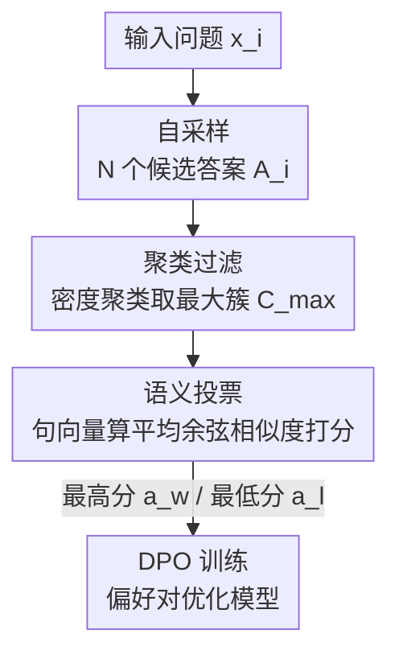

# Semantic Voting: A Self-Evaluation-Free Approach for Efficient LLM Self-Improvement on Unverifiable Open-ended Tasks

**会议**: ICLR 2026  
**OpenReview**: [https://openreview.net/forum?id=7AlPbFkcs3](https://openreview.net/forum?id=7AlPbFkcs3)  
**代码**: https://github.com/rubickkcibur/Semantic-Voting  
**领域**: LLM推理 / 自我提升 / 偏好学习  
**关键词**: 自我提升, 语义投票, 无监督伪标签, DPO, 开放式任务

## 一句话总结
针对翻译、摘要这类「答案对不上字面、又没有可验证奖励」的开放式任务，本文提出 **语义投票（semantic voting）**：用一个轻量句向量模型把模型自采样的若干候选答案两两算语义相似度、给每个候选打「与共识的对齐分」，直接挑出最高分/最低分组成 DPO 偏好对，全程不让 LLM 给自己当裁判，从而以自评方法千分之一到百分之几的算力拿到相当甚至更稳的自我提升效果。

## 研究背景与动机

**领域现状**：LLM 自我提升（self-improvement）的核心是「不靠外部标注，自己造伪标签再训自己」。在**可验证任务**（数学题、选择题）上，最朴素也最有效的造伪标签方式是**多数投票（majority voting）**——对同一问题采样多个答案，取出现次数最多的那个当伪标签（LMSI、ScPO、TTRL 都是这条线）。

**现有痛点**：多数投票依赖**硬匹配（exact matching）**——只有答案能逐字对上才能统计「谁出现最多」。可一旦换到**不可验证的开放式任务**（翻译、摘要），同一个意思可以有无数种合法表达，硬匹配直接失效。为此学界转向**自评（self-evaluation）**机制造伪标签，主要两条路：① **自我评判（self-judging）**，即「LLM-as-a-Judge」让模型给自己的输出打分/排序；② **熵最小化（entropy minimization）**，用香农熵之类度量输出置信度、强化低熵（高自信）的回答。

**核心矛盾**：自评这条路有两个绕不开的毛病。一是**贵**——无论自评判还是熵估计，都要额外跑一遍（甚至多遍）模型推理，开销随模型变大而暴涨；二是**有偏**——模型给自己打分会有 self-preference bias（偏爱自己的风格），熵最小化会被预训练先验带偏、放大**过度自信（overconfidence）**，小模型上甚至直接崩溃。而另一边，已有研究（Chowdhury et al., 2024）表明偏好学习对噪声标签相当鲁棒，这就让人怀疑：既然不需要那么精细的伪反馈，**何必花大代价去做自评？**

**本文目标**：在开放式不可验证任务上做自我提升，同时**绕开自评机制**，要又轻又稳。

**核心 idea**：把多数投票的「硬匹配」**松弛成「软匹配」**——不再数谁出现最多，而是用句向量算**语义相似度**，谁和其余候选最语义一致谁就是「最被投票的」。一个轻量句向量模型同时干掉了自评的算力开销和内在偏置。

## 方法详解

### 整体框架

方法叫 **SVSI（semantic voting-based self-improvement）**，本质是一条「自采样 → 过滤 → 语义投票 → DPO」的伪标签流水线。对数据集里每个输入 $x_i$：先让基座 LLM 随机采样 $N$ 个候选答案凑成集合 $\mathcal{A}_i$；因为随机采样可能混进跑偏的离群答案，先用密度聚类把候选聚成几簇、**只保留最大的那一簇** $\mathcal{C}_i^{max}$ 当干净候选池；在这一簇内做**语义投票**——给每个候选算「它与簇内其余候选的平均语义相似度」当分数；最后取分数最高的候选 $a_i^w$ 当 preferred、最低的 $a_i^l$ 当 dispreferred，组成 $(x_i, a_i^w, a_i^l)$ 偏好对，用 DPO 训练模型。整条链路里没有任何一步让 LLM 给自己打分，唯一的「评判者」是一个轻量句向量模型。

### 关键设计

**1. 语义投票：把多数投票的硬匹配松弛成句向量软匹配**

这是全文的发动机，直接解决「开放式任务无法逐字数票」的痛点。多数投票的统计量是「某答案出现的次数」，需要硬匹配；语义投票把它换成一个软度量——对候选 $a_i^j$，它的投票分定义为与集合内其余候选的**平均相似度**：

$$S_{sv}(a_i^j \mid \mathcal{A}_i) = \frac{1}{|\mathcal{A}_i|} \sum_{a_i^k \in \mathcal{A}_i,\, k \neq j} f_{sim}(a_i^j, a_i^k)$$

相似度函数 $f_{sim}$ 用句向量的**余弦相似度**实现：$f_{sim}(a_i^j, a_i^k) = \frac{M_{emb}(a_i^j) \cdot M_{emb}(a_i^k)}{\|M_{emb}(a_i^j)\| \times \|M_{emb}(a_i^k)\|}$，其中 $M_{emb}$ 是一个轻量句向量模型（实现用 SimCSE）。直觉上，分最高的答案就是「和大家最语义一致」的那个，即语义共识下「最被投票」的候选。这一步的妙处在于：它把「需要 LLM 理解并评判」的任务，降维成「编码一次 + 算余弦」的廉价操作，既不让模型当裁判（避开 self-preference bias 与过度自信），又把开销压到极低。

**2. 自采样过滤：聚类取最大簇，先剔除离群候选再投票**

语义投票的前提是候选池能形成「有意义的共识」，所以候选之间不能差异过大。可随机采样（temperature 0.7、top-p 0.9、采 64 个）难免吐出严重跑偏的离群样本，作者实证发现这些异常候选会**扭曲投票结果**，对能力弱的小模型尤其致命。

对策是在投票前加一道**聚类过滤**：以句向量为特征、余弦相似度为距离，用密度聚类算法 HDBSCAN 把 $\mathcal{A}_i$ 聚成若干簇 $\{\mathcal{C}_i^k\}$，**只保留最大簇** $\mathcal{C}_i^{max} = \arg\max_k |\mathcal{C}_i^k|$，其余全丢，语义投票只在这个最干净、最一致的子集上进行（公式 4 把投票范围从 $\mathcal{A}_i$ 换成 $\mathcal{C}_i^{max}$）。这等于先把「明显不在讨论范围里」的答案踢出去，再让剩下的人投票，共识自然更可靠。消融显示这一步对噪声多的弱模型（如 Llama-1B）是刚需，对本身生成质量高的模型（如 Qwen-1.5B）则可有可无。

**3. DPO 训练：用最高/最低分构造偏好对，靠 DPO 抗噪声**

语义投票给每个候选一个连续分数，原则上能喂给在线 RL 当奖励、也能拿来建偏好对。但无监督伪信号天然带噪，需要一个对错标鲁棒的训练框架。作者选 **DPO**——已有工作证明 DPO 对错标/不完美数据有可证明的鲁棒性，正好契合本设定。为了把偏好间隔拉到最大，直接取**投票分最高的候选当 preferred** $a_i^w$、**最低的当 dispreferred** $a_i^l$，组成 $(x_i, a_i^w, a_i^l)$ 用标准 DPO 损失优化：

$$\mathcal{L}_{DPO} = -\mathbb{E}_{(x, a^w, a^l) \sim \mathcal{D}_{dpo}} \left[ \log \sigma \left( \beta \log \frac{\pi_\theta(a^w \mid x)}{\pi_{ref}(a^w \mid x)} - \beta \log \frac{\pi_\theta(a^l \mid x)}{\pi_{ref}(a^l \mid x)} \right) \right]$$

其中 $\beta$ 是正则系数，$\pi_\theta$、$\pi_{ref}$ 分别是训练策略与参考策略。作者也试过把语义投票分数直接当 GRPO 的连续奖励（SVSI-G），但发现连续奖励排序里大量偏好对因噪声而出错、收敛不稳，反而 DPO「只取两端、丢掉中间模糊地带」的做法更稳。

### 一个完整示例

以德译英 "Facepalm und im Boden versinken" 为例：模型自采样得到一堆候选，如 "Facepalm and sink to the ground"、"Facepalm and sink into the ground"、……、以及跑偏的 "Flop and sink into the ground" 和干脆没翻译的 "Facepalm und im Boden sinken"。先聚类过滤，把那些语义离群的（没翻译的、用词怪的）踢出最大簇之外；再在最大簇内做语义投票，每个候选拿到一个平均相似度分（如 0.97、0.74、0.55、0.35、0.30……）；0.97 的候选与大家最一致，当 preferred，0.30 的当 dispreferred，配成一条 DPO 训练对。整个过程没有任何一次「让 LLM 评价这条翻译好不好」。

## 实验关键数据

### 主实验

在 **翻译**（WMT24++ 的 de/fr/ru/es→en，指标 BLEU + n-MQM）和 **摘要**（CNN/DailyMail、PubMed，指标 ROUGE-L + BLEURT）两类任务上，跨 6 个基座（Llama 1B/3B/8B、Qwen 1.5B/3B/7B）对比 SVSI 与两个自评基线 SJ（self-judging）、EM（entropy minimization）。n-MQM $= \frac{1}{1+\text{MQM}}$ 是把「越低越好」的 MQM 归一化成「越高越好」。

| 设置 | 指标 | base | SJ | EM | SVSI |
|------|------|------|------|------|------|
| Qwen-1.5B / wmt24pp de | BLEU | 16.12 | 3.45 | 18.21 | **18.04** |
| Qwen-1.5B / cnn dailymail | RougeL | 13.50 | 13.54 | 1.63 | **13.72** |
| Qwen-7B / cnn dailymail | BLEURT | 33.9 | 16.33 | 33.75 | **42.61** |
| Llama-8B / wmt24pp es | BLEU | 28.92 | 26.08 | 12.4 | **29.33** |
| Llama-1B / pubmed | BLEURT | 50.23 | 50.54 | 45.69 | **50.92** |

关键不在某一格谁高 0.x，而在**稳定性**：SJ 和 EM 在不少设置下会把基座**打崩**（如 Qwen-1.5B 上 SJ 的 BLEU 从 16.12 跌到 3.45，EM 的摘要 RougeL 从 13.50 跌到 1.63），而 SVSI **几乎在所有设置上都不低于基座、无严重退化**。作者把所有配置相对基座的提升画在对数坐标（图 2），SVSI 的点集中在「双指标都正」的区域，没有自评方法那种偶发的灾难性掉点。

**算力开销**（图 3）：SVSI 构造偏好对的时间是两个自评基线的**几个数量级之低**（论文摘要称为「千分之几到百分之几」），且开销**不随基座规模增长**——因为句向量模型固定，模型越大这个优势越明显。

### 消融实验

| 配置 | 效果 | 说明 |
|------|------|------|
| Full（聚类 + SV） | 最优 | 完整 SVSI |
| w/o. SV（只用聚类结果建对） | 显著下降 | 大簇取 preferred、小簇取 dispreferred，证明光靠聚类信号不足以训 DPO |
| w/o. clustering（不过滤直接投票） | 看模型而定 | Llama-1B 稳定掉点；Qwen-1.5B 几乎不变甚至略升 |

### 关键发现
- **语义投票是主引擎，聚类是稳定器**：去掉 SV 一致大幅掉点，说明聚类本身给的信号不够可靠；去掉聚类的影响则取决于基座——弱模型（Llama-1B）噪声多，聚类是刚需，强模型（Qwen-1.5B）生成本就干净，聚类近乎冗余。
- **不是「虚假奖励」**：把偏好对翻转（flipped-SV）后训练，性能一致低于正常 SV、且几乎都低于基座，且退化幅度与正常 SV 的提升幅度成正比，证明语义投票捕捉到的是**真实有效的偏好信号**，而非 Shao et al. (2025) 所述那种「乱给奖励也能涨」的假象。
- **超参建议**：温度设 0.7–1.0、采样数 ≥32 较稳；HDBSCAN 的最小簇大小 $m$ 越大越好（$m>5$ 时对邻域参数 $k$ 不敏感）。温度过高会破坏回答连贯性、扰乱聚类甚至让算法失败；Qwen 系对高温更耐受。
- **句向量模型不敏感**：换成 DeBERTa-v3、BGE-en、BGE-m3 等替代 SimCSE，下游性能都稳定，说明方法不挑特定编码器。

## 亮点与洞察
- **「降维评判」的思路最值得借鉴**：把「需要 LLM 智能去评判」的开放式打分，降维成「编码一次 + 算余弦」的廉价几何操作——绕开了 LLM 当裁判的偏置与开销，是一种很轻巧的范式替换，可迁移到任何「想做自评但嫌贵/嫌偏」的场景。
- **软匹配是对多数投票的优雅推广**：多数投票是「相似度退化为 0/1 硬匹配」的特例，语义投票把它连续化，一举把这条成熟范式从可验证任务搬到了不可验证任务。
- **flipped-SV 这个对照实验很扎实**：在「乱给奖励也能涨」的怀疑论盛行时，翻转偏好对来证伪「虚假奖励」假说，是一个低成本但有说服力的验证设计，值得任何自我提升工作借鉴。
- **DPO vs GRPO 的取舍洞察**：连续奖励排序基数高但噪声大、难收敛；DPO「只取两端、丢中间模糊地带」反而稳——这点对设计噪声伪标签的训练框架有普适启发。

## 局限与展望
- **依赖「共识即正确」的隐含假设**：语义投票本质假设「多数候选语义一致的方向就是好方向」。若基座系统性地往同一个错误方向偏（共识本身就错），最高分候选反而是被强化的错误，方法无力纠正——这与熵最小化「被预训练先验带偏」的风险同源，只是换了形式。
- **GRPO 变体不稳**：作者承认把语义投票当连续奖励接进 GRPO（SVSI-G）波动很大，不如离散奖励的 EMPO 稳；如何在保留语义细粒度的同时提升训练稳定性（如混合策略）留作未来工作。
- **任务范围有限**：实验只覆盖翻译与摘要两类开放式 NLP 任务，对话、创意写作、长文生成等更开放、候选语义更发散的场景是否还能形成有意义的「最大簇共识」，尚未验证。
- **句向量是新的瓶颈**：方法把「评判能力」外包给句向量模型，跨语言/专业领域（如医学）相似度估计若不准，投票质量会被这个外部模型的天花板限制。

## 相关工作与启发
- **vs 多数投票（majority voting / TTRL / ScPO）**：它们靠硬匹配数票，只能用于可验证闭式任务；本文用句向量软匹配，把同一思路推广到开放式不可验证任务，是直接的范式延伸。
- **vs 自我评判（self-judging / SRLM）**：自评判让 LLM 给自己打分，贵且有 self-preference bias；本文完全不用 LLM 当裁判，开销低几个数量级且无自偏。
- **vs 熵最小化（EM / RENT / INTUITOR / EMPO）**：熵最小化强化高自信输出，易被预训练先验带偏、放大过度自信甚至崩溃；本文用「与同伴的语义共识」替代「自身置信度」，避开过度自信陷阱，主实验里稳定性明显更好。

## 评分
- 新颖性: ⭐⭐⭐⭐ 把多数投票从硬匹配松弛到语义软匹配、并彻底去掉自评，切入角度简洁且打到痛点
- 实验充分度: ⭐⭐⭐⭐ 6 基座 × 6 数据集 + 翻转对照 + 聚类/温度/采样/句向量四组分析，覆盖到位；但任务仅限翻译与摘要
- 写作质量: ⭐⭐⭐⭐ 动机推导清晰、公式与算法完整，图表自洽
- 价值: ⭐⭐⭐⭐ 给「不可验证开放式任务的廉价自我提升」提供了一个即插即用、算力极省的实用方案

<!-- RELATED:START -->

## 相关论文

- [\[ICLR 2026\] ShinkaEvolve: Towards Open-Ended and Sample-Efficient Program Evolution](shinkaevolve_towards_open-ended_and_sample-efficient_program_evolution.md)
- [\[ICLR 2026\] Reverse-Engineered Reasoning for Open-Ended Generation](reverse-engineered_reasoning_for_open-ended_generation.md)
- [\[ICLR 2026\] Selection, Reflection and Self-Refinement: Revisit Reasoning Tasks via a Causal Lens](selection_reflection_and_self-refinement_revisit_reasoning_tasks_via_a_causal_le.md)
- [\[ICLR 2026\] Think in Parallel, Answer as One: Logit Averaging for Open-Ended Reasoning](think_in_parallel_answer_as_one_logit_averaging_for_open-ended_reasoning.md)
- [\[ICLR 2026\] Toward Effective Tool-Integrated Reasoning via Self-Evolved Preference Learning](toward_effective_tool-integrated_reasoning_via_self-evolved_preference_learning.md)

<!-- RELATED:END -->
