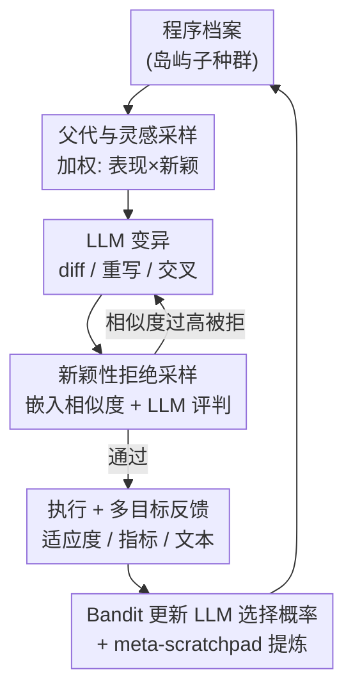

# ShinkaEvolve: Towards Open-Ended and Sample-Efficient Program Evolution

**会议**: ICLR 2026  
**OpenReview**: [https://openreview.net/forum?id=lKEdGCoDNC](https://openreview.net/forum?id=lKEdGCoDNC)  
**代码**: https://github.com/SakanaAI/ShinkaEvolve  
**领域**: LLM推理 / 程序进化 / 自动科学发现  
**关键词**: LLM 程序进化, 样本效率, 拒绝采样, Bandit 模型选择, 开放式发现

## 一句话总结
ShinkaEvolve 用「父代加权采样 + 代码新颖性拒绝采样 + Bandit 式 LLM 集成选择」三件套，把 LLM 驱动的程序进化从动辄数千次评估压到 150 次，并在圆填充、AIME agent 脚手架、ALE-Bench 竞赛编程、MoE 负载均衡损失四个领域上做到 state-of-the-art。

## 研究背景与动机
**领域现状**：用 LLM 当「变异算子」来做科学/工程代码的自动发现，已经形成一条成熟路线——AlphaEvolve、OpenEvolve、LLM4AD 等框架维护一个被评估过的程序档案（archive），反复采样父代程序、让 LLM 改写出新变体、评估适应度、把好的留下来繁衍，逐代逼近高质量解。

**现有痛点**：这条路线有个致命的实用瓶颈——**样本效率极低**。现有方法通常需要**数千次评估**才能找到一个有效解。每次评估往往意味着一次昂贵的 LLM 调用加一次程序执行，于是整个搜索既烧钱又耗时。以经典的圆填充任务为例，AlphaEvolve 也要上千次迭代。

**核心矛盾**：低效的根源在于**探索策略太朴素**，没能有效利用前几代积累下来的知识。具体表现为三处浪费：父代选择要么纯随机（不利用适应度）要么纯贪心（早早收敛到局部最优）；LLM 生成的变体大量是「换汤不换药」的近重复程序，白白花掉一次评估；用固定的单一 LLM 或均匀集成，无法根据当前档案状态把算力倾斜给此刻最能产出突破的模型。

**本文目标**：在不牺牲解质量的前提下，把所需评估次数砍掉一两个数量级，让 LLM 驱动的发现既「省钱」又「能持续开放式创新」。

**切入角度**：作者把三处浪费分别对症下药——父代选择上同时考虑「表现」和「新颖」、变异产物上用嵌入相似度做新颖性过滤、模型调度上用多臂赌博机自适应分配，三者协同提升采样效率。

**核心 idea**：把进化搜索的每一个采样决策（选谁当父代、留不留这个变体、用哪个 LLM）都做成**自适应、知识驱动**的，而不是朴素随机，从而用极少的评估榨出 SOTA 解。

## 方法详解

### 整体框架
ShinkaEvolve 维护一个**固定容量的程序档案**，档案被切成若干并行演化的「岛屿」子种群（island model）。每一代的控制流走三个阶段：① 从某个岛屿里采样一个**主父代**程序和若干**灵感程序**（trade-off 探索与利用）；② 让 LLM 以三种变异方式（diff 编辑 / 全量重写 / 交叉重组）改写出候选程序，并用**新颖性拒绝采样**把近重复的候选挡在门外；③ 执行通过的程序，得到标量适应度 + 公开指标 + 文本反馈，这些反馈一边回写档案当作下一代的上下文，一边用来更新**Bandit 式 LLM 选择概率**，同时每隔若干代由 meta-scratchpad 提炼共性策略追加进提示。三个阶段构成闭环，逐代把「踏脚石」（次优中间解）组合成突破性方案。

### 关键设计

**1. 父代与灵感采样：用「表现 × 新颖」加权打破探索-利用两难**

朴素方法在选父代时陷入两难：均匀随机不利用历史适应度，纯爬山（只挑当前最好）则很快平台化、卡死在局部最优。ShinkaEvolve 先用**岛屿模型**保住多样性——档案分成多个独立演化的子种群，岛屿间偶尔迁移以扩散知识，但**禁止每个岛的最优程序迁出**以保护各岛独特性；采样时先均匀抽一个岛 ID，再在岛内抽父代和灵感程序。岛内的父代选择默认用**加权采样**：对每个程序 $P_i$，先算种群适应度中位数 $\alpha_0 = \mathrm{median}(\{F(P_1),\dots,F(P_n)\})$，表现分量用 sigmoid 缩放 $s_i = \sigma(\lambda \cdot (F(P_i) - \alpha_0))$（$\lambda$ 控制选择压力），新颖分量 $h_i = \frac{1}{1+N(P_i)}$ 偏好后代数 $N(P_i)$ 少的程序，最终概率 $p_i = \frac{w_i}{\sum_j w_j}$，其中 $w_i = s_i \cdot h_i$。作者还提供了幂律采样作对照：按适应度排名 $r_i$（$r_i=1$ 为最优），$p_i = \frac{r_i^{-\alpha}}{\sum_j r_j^{-\alpha}}$，$\alpha=0$ 退化为均匀、$\alpha\to\infty$ 退化为爬山。乘法式 $s_i \cdot h_i$ 的妙处在于：既给高适应度程序更高被选概率（利用），又主动把机会让给「还没被充分繁衍」的程序（探索），消融显示它在所有任务上稳定优于随机搜索和爬山。

**2. 代码新颖性拒绝采样：把近重复变体挡在评估之前**

LLM 在变异时常产出「换皮」的近重复程序，每一个都要花掉一次昂贵评估，是样本浪费的大头。ShinkaEvolve 在程序真正执行**之前**先做一道新颖性过滤：用嵌入模型把程序的**可变部分**（被 `EVOLVE-BLOCK-START/END` 标记的可改区域）编码成向量，计算它与岛内已有程序的余弦相似度，取最大值；若最大相似度超过阈值（如 $\eta = 0.95$），再额外查询一个 LLM 当「新颖性评判官」，判断这个候选是否在语义上真有实质区别——若判定为雷同则拒绝、重新采样。这套设计把「过滤」放在「评估」前面，省下的正是最贵的那步执行开销。消融表明，单靠嵌入相似度阈值就带来显著增益，外加的 LLM 评判官只带来边际提升，说明嵌入相似度本身已是足够好的新颖性代理。变异侧则用三种方式保多样性：基于 SEARCH/REPLACE 块的 **diff 编辑**、保留不可变块的**全量重写**、把父代与另一档案程序融合的**交叉变异**；不可变代码若被动到则用 Reflexion 反馈重采。

**3. Bandit 式 LLM 集成选择：把算力动态倾斜给此刻最能突破的模型**

不同 LLM 在不同问题域、不同档案状态下的变异能力差异很大，而且这种「谁更强」随搜索进程**非平稳**地变化。固定单模型或均匀集成都吃不到这层红利。ShinkaEvolve 在每代结束时用 **UCB1** 的变体演化各 LLM 的采样概率：给每个模型维护访问计数和期望分估计。关键改造在于奖励信号——不用变异的绝对适应度 $F(P_i)$，而是用相对改进 $F(P_i)_u = \exp(\max(F(P_i) - F(P_i)_b,\ 0)) - 1$，其中基线 $F(P_i)_b$ 取「该程序的父代」与「数据库初始程序」二者的最大值。$\max(\cdot,0)$ 让没带来改进的变异不被奖励，$\exp(\cdot)$ 则放大大幅改进的权重，于是这套奖励**精准偏爱敢于高风险、高回报变异的模型**，而非只做安全小修小补的模型；再用观测奖励的统计量归一化 $F(P_i)_u$，保证对各领域适应度尺度不变。消融显示 Bandit 集成显著优于单模型和固定均匀集成。

**4. Meta-Scratchpad 在线提炼：把累积的进化经验回灌进提示**

进化过程会沉淀大量「什么改法有效」的隐性经验，但若不显式总结，LLM 每代都在「重新发现」。ShinkaEvolve 设了一块 meta-scratchpad：每隔 $T$ 代，由一个 meta-agent 汇总近期程序评估、识别共性优化策略与设计原则，把洞见综合成可操作的建议追加到变异提示里，相当于把「高层指导」从累积经验里蒸馏出来反哺当前生成。同时每个程序执行后做**多目标评估**——除标量适应度外还暴露一组公开指标和文本反馈，一并存进档案作为后续 LLM 变异的信息上下文，让模型「看着前人的成绩单和评语」继续改。

## 实验关键数据

### 主实验
四个领域全面验证，核心卖点是**用极少评估拿到 SOTA**：

| 任务 | 评估/迭代预算 | 关键结果 | 对照 |
|------|--------------|----------|------|
| 圆填充（26 圆装单位正方形） | 仅 **150** 代 | 刷新 SOTA 解 | AlphaEvolve 需上千次迭代 |
| AIME 2024 agent 脚手架 | 75 代，gpt-4.1-nano | 演化出 7 次调用的脚手架，准确率 34.4% | Base 18.4% / Majority@5 24.4% |
| ALE-Bench LITE（10 场竞赛编程） | 50 代 | 平均分较 ALE-Agent 提升 **~2.3%**（1879.3→1932.1 私测） | ahc039 从第 5 名提到第 2 名 |
| MoE 负载均衡损失 | 仅 **30** 代 | 发现新 LBL 正则项，跨 $\lambda$ 一致优于 global-batch LBL | 556M 调参 / 2.7B 验证 |

AIME 上更亮眼的是迁移性：换到 2025 新题增益更大（说明不是数据污染带来的虚高），跨模型迁移到 gpt-4.1-mini/gpt-4.1/o4-mini 均把准确率大幅抬高（如 o4-mini 65.6%→94.4%），说明发现的是可泛化的策略而非模型特定 trick。

### 消融实验
在圆填充任务上逐一拆掉三大组件：

| 配置 | 趋势 | 说明 |
|------|------|------|
| 父代选择 | Weighted ＞ Hill Climbing ＞ Best-of-N | 爬山初期猛但很快平台化；加权采样全程稳定爬升 |
| LLM 集成 | + Bandit 优先 ＞ 固定均匀集成 ＞ 单模型 | Bandit 自适应优先高产模型，增益最大 |
| 新颖性拒绝采样 | + LLM 评判 ≳ 阈值拒绝 ≫ 无拒绝 | 嵌入阈值已带来主要增益，LLM 评判官仅边际提升 |

### 关键发现
- **三个组件协同而非单点取胜**：父代加权采样负责「选对方向」、拒绝采样负责「不浪费评估」、Bandit 负责「用对模型」，三者叠加才把评估预算压到极致。
- **嵌入相似度是足够好的新颖性代理**：再加一层 LLM 评判官只换来边际提升，提示实际部署可省掉这层额外开销。
- **进化解会「贴着初始解」改**：ALE-Bench 上 ShinkaEvolve 倾向在 ALE-Agent 解附近做细粒度精修，作者坦言这暗示对初始解存在过拟合风险。

## 亮点与洞察
- **把「省评估」拆成三个正交决策点**：选父代、留变体、挑模型——每个点都从朴素随机升级成知识驱动的自适应策略，是一套可整体迁移到任何 archive-based 进化框架的方法论。
- **Bandit 奖励的 $\exp(\max(\cdot,0))-1$ 设计很巧**：用相对父代/初始解的改进当奖励解决非平稳性，再用 exp 放大、max 截断，精准奖励「敢冒险且成功」的模型，而非平均表现好的模型——这正是开放式发现需要的偏好。
- **MoE 负载均衡损失是真有用的副产物**：发现的新正则项 $\frac{0.1}{L}\sum_\ell s(P_\ell)\sum_i \max(0,\tau - f_{\ell,i})$ 补上了 global-batch LBL 的盲区（点积 $f\cdot P$ 看着均衡，却可能有几个专家几乎没被触达），像一张「死专家安全网」自适应激活又自动消失——这套「让进化去发现损失函数」的范式本身可迁移。

## 局限与展望
- **仍需人工任务规格**：作者承认框架依赖人提供目标函数和领域专业知识，受限于「有良定义、可实现的数值目标」的问题，难以直接处理任意人类偏好与启发式。
- **对初始解过拟合**：ALE-Bench 上进化倾向贴着初始解小修，意味着若起点不好可能被锚定，与「真·开放式」尚有距离。
- **依赖闭源模型 + API 成本**：大规模 LLM 调用的经济门槛可能与「民主化」目标相悖。
- **改进方向**：作者提出用 LLM 自动生成任务规格，迈向「系统自己定义目标」的真正开放式发现。

## 相关工作与启发
- **vs AlphaEvolve**：同为 LLM 驱动的 archive-based 进化框架，ShinkaEvolve 沿用其 diff 编辑与 EVOLVE-BLOCK 不可变标记，但靠拒绝采样 + LLM 优先 + meta-scratchpad 把样本效率推到前所未有的程度（圆填充 150 vs 上千次）。
- **vs OpenEvolve / LLM4AD**：同属开源进化代码优化路线，ShinkaEvolve 的差异化在于「三件套」对采样决策的系统性自适应，并承诺开源全套代码。
- **vs 传统新颖性搜索**：传统方法靠显式多样性指标（Lehman & Stanley），ShinkaEvolve 改用代码嵌入相似度 + LLM 语义评判来判新颖，既保语义连贯又过滤近重复。

## 评分
- 新颖性: ⭐⭐⭐⭐ 三件套都是已有思想（加权采样/拒绝采样/UCB1）的针对性改造，但组合 + 奖励设计扎实有效。
- 实验充分度: ⭐⭐⭐⭐⭐ 四个异质领域 + 完整三组件消融 + 跨年/跨模型迁移，证据链很全。
- 写作质量: ⭐⭐⭐⭐ 结构清晰、图表充分，公式与动机交代到位。
- 价值: ⭐⭐⭐⭐⭐ 把 LLM 驱动发现的评估成本砍掉一两个数量级且开源，实用价值高。

<!-- RELATED:START -->

## 相关论文

- [\[ICLR 2026\] Reverse-Engineered Reasoning for Open-Ended Generation](reverse-engineered_reasoning_for_open-ended_generation.md)
- [\[ICLR 2026\] Think in Parallel, Answer as One: Logit Averaging for Open-Ended Reasoning](think_in_parallel_answer_as_one_logit_averaging_for_open-ended_reasoning.md)
- [\[ICLR 2026\] Stabilizing Policy Gradients for Sample-Efficient Reinforcement Learning in LLM Reasoning](stabilizing_policy_gradients_for_sample-efficient_reinforcement_learning_in_llm_.md)
- [\[ICML 2026\] Deliberate Evolution: Agentic Reasoning for Sample-Efficient Symbolic Regression with LLMs](../../ICML2026/llm_reasoning/deliberate_evolution_agentic_reasoning_for_sample-efficient_symbolic_regression_.md)
- [\[ICLR 2026\] GeoGramBench: Benchmarking the Geometric Program Reasoning in Modern LLMs](geogrambench_benchmarking_the_geometric_program_reasoning_in_modern_llms.md)

<!-- RELATED:END -->
