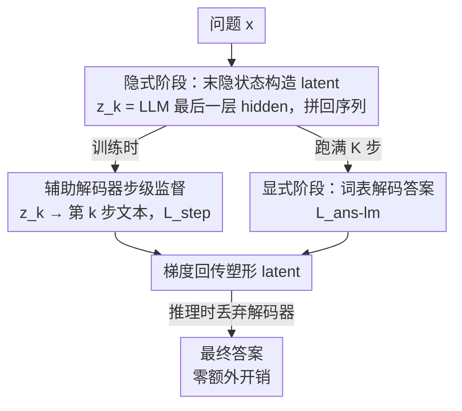

# SIM-CoT: Supervised Implicit Chain-of-Thought

**会议**: ICLR 2026  
**OpenReview**: [https://openreview.net/forum?id=6YRJ4jmVQl](https://openreview.net/forum?id=6YRJ4jmVQl)  
**代码**: https://github.com/InternLM/SIM-CoT  
**领域**: LLM推理  
**关键词**: 隐式思维链, 步级监督, 潜在表示坍缩, token 效率, 辅助解码器

## 一句话总结
SIM-CoT 发现隐式思维链在增加推理 token 时会因缺乏细粒度监督而发生潜在表示坍缩，于是在训练阶段引入一个"用得完即弃"的辅助解码器，把每个隐式 latent 对齐到对应的显式推理步骤，从而稳定训练、丰富语义，在 GPT-2 上把 Coconut 提升 +8.2% 并首次让隐式 CoT 反超显式 CoT，推理时却不增加任何开销。

## 研究背景与动机
**领域现状**：大模型靠显式思维链（explicit CoT）把复杂问题拆成一步步的自然语言推理，在数学、编程上效果很好。但显式 CoT 必须把每一步"说出来"，被固定词表约束、也无法探索多条解题路径，而且生成大量中间 token 会显著拉高推理成本、产生冗余的"过度思考"。为此隐式思维链（implicit CoT）应运而生：用连续的潜在向量（latent）代替离散文本 token 来表示推理，每个 latent 能编码比单个 token 更丰富的信息，用很少的几个 latent 就替代一长串显式推理链。代表工作 Coconut 只在最终答案上监督，CODI 进一步做轨迹级（trajectory-level）蒸馏。

**现有痛点**：隐式 CoT 虽然快、省 token，但准确率始终落后显式 CoT，存在一道持续的性能鸿沟。一个自然的想法是模仿显式 CoT"加算力换性能"，即增加隐式 token 数量。但作者发现一个反直觉现象——**潜在不稳定（latent instability）**：当隐式 token 从默认的 3 个增加到 5 个时，训练初期准确率上升，随后却变得不稳定甚至彻底坍缩，最差掉到 12.5%。

**核心矛盾**：作者把坍缩的模型拆开分析（通过 LM head 把 latent 投影回词表看 top-8 解码 token），定位到病根是**多样性与稳定性的权衡**。坍缩时出现两个同步变化：(1) 信息丢失——latent 几乎只编码数字，几乎完全丢掉了运算符（+、−）这类做计算必需的信息；(2) 语义同质化——latent 之间的距离急剧缩小（互相变得几乎相同），同时整体漂离词表嵌入中心，失去了与 token 的语义锚定。根本原因是现有隐式方法只在答案级或轨迹级监督，**没有告诉模型"哪个 latent 该编码哪一步"**，缺乏步级（step-level）监督。

**本文目标 / 切入角度 / 核心 idea**：既然坍缩源于监督太粗，那就给每个隐式 latent 配一个明确的"答案"。作者提出 SIM-CoT：训练时挂一个辅助解码器，把第 $k$ 个 latent 解码成第 $k$ 个显式推理步骤的文本，用这种步级监督把 latent 牢牢锚定到具体推理内容上；推理时把解码器丢掉，保持隐式 CoT 原本的效率。一句话——**用"训练时可拆卸的步级解码器"给隐式 latent 上细粒度监督，根治潜在坍缩**。

## 方法详解

### 整体框架
SIM-CoT 不改变隐式 CoT 的推理范式，只在训练时加一条监督支路。整个流程分两个阶段：**隐式阶段**让 LLM 跑固定 $K$ 步推理，每一步把最后一层 hidden state 当作隐式 latent $z_k$ 拼回序列当作下一个"token 向量"；$K$ 步后切回**显式阶段**，在词表上正常解码生成最终答案。关键创新落在训练时：一个与 LLM 结构相同的**辅助解码器** $p_\phi$ 只拿单个 latent $z_k$ 作条件，自回归生成第 $k$ 步的文本，从而提供步级监督；推理时这个解码器被完全移除，运行时只是"直接答案生成 + $K$ 个前向位置"，远短于显式 CoT 的 token 长度。

### 关键设计

**1. 隐式阶段：用末隐状态自回归构造 latent 链**

这一步解决"隐式推理到底怎么发生"的问题。作者预先固定推理步数 $K$，对每一步 $k=1,\dots,K$，直接取 LLM 在当前前缀末位的最后一层 hidden state 作为该步的隐式 latent，再把它拼接回序列充当下一个输入向量：

$$z_k = H_\theta\!\left(U^{(k-1)}\right) \in \mathbb{R}^d, \qquad U^{(k)} = U^{(k-1)} \oplus z_k$$

其中 $\oplus$ 表示沿时间轴拼接。于是整条隐式思维链就是一串连续 hidden state $z_{1:K}$，自回归地生成并追加到上下文里，之后模型才切回显式解码。这套构造和 Coconut 一脉相承——latent 不对应任何具体词，纯在连续空间里"想"，因此能比一长串文本 token 更紧凑。

**2. 训练时辅助解码器：把每个 latent 锚定到对应推理步**

这是全文的核心，直击"latent 不知道自己该编码哪一步"这个病根。训练时引入一个架构上与 LLM 完全相同的解码器 $p_\phi$，它**只**拿第 $k$ 个 latent $z_k$ 作条件，自回归生成第 $k$ 个文本步骤 $s_k=(y_{k,1},\dots,y_{k,L_k})$：

$$p_\phi(s_{1:K} \mid z_{1:K}) = \prod_{k=1}^{K}\prod_{t=1}^{L_k} p_\phi\!\left(y_{k,t} \mid z_k, y_{k,<t}\right)$$

实现上有个关键细节：由于 $z_k$ 不对应任何词表 token，它不参与损失计算，而是作为一个额外的**前缀向量**注入、用来初始化解码器的隐状态，解码器输入序列为 $U_k^{\text{dec}}=\big[z_k;\, e(y_{k,1}),\dots,e(y_{k,L_k})\big]$，其中嵌入函数 $e(\cdot)$ 在两个模型间共享。这种"一个 latent ↔ 一步文本"的强对应正是 Coconut（只管答案）和 CODI（只对齐整条轨迹）都没做到的：粗粒度监督无法约束单个 latent 的语义，而步级监督直接逼着每个 $z_k$ 编码 distinct 且有意义的推理内容，从而把互相塌成一团的 latent 重新拉开。

**3. 双损失目标：步级监督塑形 latent，答案监督保证可独立推理**

为了既让 latent 学到细粒度语义、又不破坏推理时"丢掉解码器照样答题"的能力，训练用两个互补的交叉熵损失。步级损失只在文本步骤 token 上计算（$z_k$ 不算 loss）：

$$\mathcal{L}_{\text{step}} = -\sum_{k=1}^{K}\sum_{t=1}^{L_k}\log p_\phi\!\left(y_{k,t}\mid z_k, y_{k,<t}\right)$$

答案损失则是标准语言建模目标，让基座 LLM 在 $K$ 步隐式后直接解码出答案：

$$\mathcal{L}_{\text{ans-lm}} = -\sum_{t=1}^{L_a}\log p_\theta\!\left(a_t\mid x, z_{1:K}, a_{<t}\right)$$

总目标为加权和 $\mathcal{L}=\lambda_{\text{step}}\mathcal{L}_{\text{step}}+\lambda_{\text{lm}}\mathcal{L}_{\text{ans-lm}}$。妙处在于梯度路径：$\mathcal{L}_{\text{step}}$ 的梯度经解码器回传进 latent 表示、再经 latent 构造式（设计 1）一路传回 LLM，把 hidden state 塑形成编码步级推理；而 $\mathcal{L}_{\text{ans-lm}}$ 训练基座独立产出答案，于是推理时辅助解码器可被安全丢弃、不影响效率。相比 SFT-CoT 强迫模型逐字模仿确定性的自然语言标注、CODI 在粗粒度轨迹上对齐，SIM-CoT 是一种"适中"的监督——既保证每步推理的合理性，又保留推理轨迹的多样性，因而泛化更好。

### 损失函数 / 训练策略
训练数据用 GSM8k-Aug（把 GSM8k 扩到 38.5 万条，去掉自然语言推理链、只留结构化数学表达式如 `<<12*3=36>><<9*2=18>>...`）。按 Coconut 约定每个 latent 对应两个 token，最大隐式 latent 数设为 8（因多数题目 2–6 步）。SIM-CoT 是即插即用模块，可直接挂在 Coconut、CODI 乃至 training-free 方法上；在大模型上作者选 CODI 作 backbone，因为其 KL 正则目标能约束训练不偏离原模型分布、缓解灾难性遗忘。

## 实验关键数据

### 主实验
在 GPT-2 与 LLaMA 3 系列（1B/3B/8B）上，报告 in-domain（GSM8k-Aug）与 out-of-domain（GSM-Hard / MultiArith / SVAMP）准确率。SIM-CoT 作为插件叠在 Coconut、CODI 上均带来稳定增益，并首次让隐式 CoT 反超显式 SFT-CoT。

| 模型 / backbone | 配置 | GSM8k-Aug (ID) | OOD 平均 | 备注 |
|------|------|------|------|------|
| GPT-2 SFT-CoT（显式基线） | — | 42.7 | 45.2 | 显式 CoT，24.7 token |
| GPT-2 Coconut | 原版 | 36.6 | 42.6 | 答案级监督 |
| GPT-2 Coconut | +SIM-CoT | **44.8 (+8.2)** | 46.9 (+4.3) | 反超 SFT-CoT +2.1，且 2.3× 提速 |
| GPT-2 CODI | +SIM-CoT | 42.6 (+0.6) | 48.3 (+0.3) | 叠在当时 SOTA 上仍有增益 |
| LLaMA-3.2 1B Coconut | +SIM-CoT | 42.2 (+9.0) | 47.0 (+9.0) | — |
| LLaMA-3.2 1B CODI | +SIM-CoT | 56.1 (+3.4) | 56.8 (+1.0) | 达到 SFT-CoT 96% 准确率 |
| LLaMA-3.1 8B CODI | +SIM-CoT | 64.1 (+3.0) | 65.2 (+0.8) | MultiArith 100.0、SVAMP 79.4 反超 SFT-CoT |

### 消融实验

| 配置 | 关键指标 (GSM8k-Aug) | 说明 |
|------|---------|------|
| Coconut，scale 到 5 latent | 坍缩至 12.5% | 缺步级监督 → 潜在不稳定 |
| SIM-CoT，scale 到 8–16 latent | 持续稳定提升 | 步级监督随 latent 容量扩展仍有效 |
| LLaMA-1B + 1B 解码器 | 56.1 | 同族同尺寸解码器最佳 |
| LLaMA-1B + 3B 解码器 | 50.4 | 解码器过大反而掉点 |
| LLaMA-1B + 8B 解码器 | 50.0 | 表征不匹配、优化困难 |
| latent 距离：Fail 5 latent | Dist. 4.21 / 到词表中心 39.39 | 坍缩：latent 互相塌、漂离词表 |
| latent 距离：After SIM-CoT | Dist. 32.81 / 到词表中心 29.80 | latent 重新拉开、回到词表空间 |

### 关键发现
- **步级监督直接修复了几何坍缩**：latent 两两距离从坍缩时的 4.21 恢复到 32.81，到词表中心距离从 39.39 收回到 29.80，定量印证了"拉开 latent + 重新锚定词表"的机制，与 +8.2% 的准确率提升因果对应。
- **解码器不是越大越好**：1B backbone 配 1B 解码器最优，换 3B/8B 反而掉点。作者归因于同族同尺寸模型共享更兼容的表征空间，过大解码器需要隐式投影对齐、引入表征错配，破坏训练稳定性。
- **可扩展性强**：Coconut 在 8/16 latent 时坍缩，SIM-CoT 仍稳定且持续涨点；规模从 GPT-2 到 8B 增益一致，OOD 上常反超显式 CoT。
- **效率零损失**：解码器训练后即弃，GPT-2 上相对显式 CoT 取得 2.3×/2.2× 提速，LLaMA-1B 上 1.9×/1.7×。

## 亮点与洞察
- **"训练时可拆卸的监督头"是个很可复用的范式**：把昂贵/有信息的监督信号放在训练专用模块里，推理时整块丢掉、不留任何开销。这一招可迁移到任何"想加细粒度监督又怕拖慢推理"的场景。
- **把表征坍缩量化成两个可观测几何指标**（latent 间距、到词表中心距离），让"潜在不稳定"这种抽象现象变得可诊断、可验证——监督前后这两个数字的变化本身就是最有说服力的消融。
- **附带可解释性**：辅助解码器把每个 latent 投影回显式推理词表，能逐步可视化"这个 latent 在想什么"，给隐式推理这种黑箱过程提供了 per-step 的诊断窗口。
- **"适中监督"的视角很有启发**：显式 SFT 太死（逼模型逐字模仿）、轨迹蒸馏太糙（只对齐整条路径），步级监督卡在中间，既保证每步合理又不抹掉轨迹多样性——这解释了它为何在 OOD 上泛化更好。

## 局限与展望
- **解码器扩展性受限**：解码器必须与 backbone 同族同尺寸才最优，跨尺寸（3B/8B 解码器配 1B backbone）会掉点，意味着这套监督对解码器选择较敏感、不能随意换更强的"老师"。
- **依赖步级文本标注**：步级监督要求训练数据能切成对应的显式推理步（如 GSM8k-Aug 的结构化表达式），对于没有清晰分步标注的任务，如何获得 $s_k$ 是个未交代的问题。
- **评测域较窄**：实验集中在小学数学推理（GSM8k 系列 + 三个算术 OOD 集），尚未验证在代码、常识、多跳问答等更异质的推理任务上是否同样能防坍缩。
- **改进思路**：可探索用自动分步（如让强模型生成 step 标注）扩展到无显式分步的任务，或研究跨尺寸解码器对齐的投影方法以解锁"小 backbone + 强解码器"的潜力。

## 相关工作与启发
- **vs Coconut**：Coconut 只在最终答案上监督（answer-level），不约束单个 latent，scale 到 5+ token 时坍缩；SIM-CoT 在其上加步级监督，GPT-2 +8.2%、LLaMA-1B +9.0%，并把可 scale 的 latent 上限从坍缩点推到 8/16 仍稳定。
- **vs CODI**：CODI 做轨迹级蒸馏（对齐整条推理轨迹的末隐状态），是当时 SOTA 但仍是粗粒度、不告诉模型哪个 latent 对应哪一步；SIM-CoT 把监督细化到步级，叠在 CODI 上 8B 再 +3.0%，且更"适中"的监督带来更好的 OOD 泛化。
- **vs SFT-CoT（显式）**：显式 CoT 逐字生成中间步、token 多、且被固定词表锁死路径多样性；SIM-CoT 在 GPT-2 上首次让隐式 CoT 反超显式（+2.1%）并 2.3× 提速，在 8B 上 MultiArith/SVAMP 也反超，证明隐式推理在效率与精度上可以两全。
- **vs iCoT（Stepwise Internalization）**：iCoT 用课程学习把 CoT 模式逐步内化进模型以产出直接答案；SIM-CoT 不靠内化而靠显式的步级解码器对齐 latent，几何分析显示这能真正防止表征同质化。

## 评分
- 新颖性: ⭐⭐⭐⭐⭐ 把隐式 CoT 坍缩诊断为"缺步级监督"并用可拆卸解码器精准解决，视角与方法都新。
- 实验充分度: ⭐⭐⭐⭐⭐ 覆盖 GPT-2 + LLaMA 1B/3B/8B、ID/OOD 四基准，含几何指标、解码器尺寸、latent 数量等多维消融。
- 写作质量: ⭐⭐⭐⭐⭐ 从现象（坍缩）到诊断（几何/语义）再到方法逻辑链清晰，图表把抽象问题讲得很透。
- 价值: ⭐⭐⭐⭐⭐ 即插即用、零推理开销、首次让隐式反超显式，对推动隐式 CoT 落地有直接价值。

<!-- RELATED:START -->

## 相关论文

- [\[ICLR 2026\] CoT-RVS: Zero-Shot Chain-of-Thought Reasoning Segmentation for Videos](cot-rvs_zero-shot_chain-of-thought_reasoning_segmentation_for_videos.md)
- [\[ICLR 2026\] CoT-Evo: Evolutionary Distillation of Chain-of-Thought for Scientific Reasoning](cot-evo_evolutionary_distillation_of_chain-of-thought_for_scientific_reasoning.md)
- [\[ICLR 2026\] Uni-CoT: Towards Unified Chain-of-Thought Reasoning Across Text and Vision](uni-cot_towards_unified_chain-of-thought_reasoning_across_text_and_vision.md)
- [\[ICLR 2026\] Why is Your Language Model a Poor Implicit Reward Model?](why_is_your_language_model_a_poor_implicit_reward_model.md)
- [\[ICLR 2026\] The CoT Encyclopedia：分析、预测并控制推理模型的思考方式](the_cot_encyclopedia_analyzing_predicting_and_controlling_how_a_reasoning_model_.md)

<!-- RELATED:END -->
