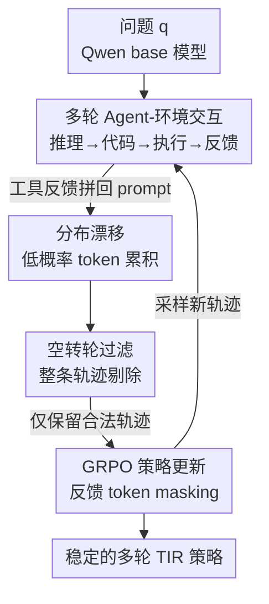

# SimpleTIR: End-to-End Reinforcement Learning for Multi-Turn Tool-Integrated Reasoning

**会议**: ICLR 2026  
**OpenReview**: [https://openreview.net/forum?id=EplNy91Xqh](https://openreview.net/forum?id=EplNy91Xqh)  
**代码**: 待确认  
**领域**: LLM推理 / 工具集成推理 / 强化学习  
**关键词**: 工具集成推理, 多轮 RL, Zero RL, 梯度爆炸, 轨迹过滤

## 一句话总结
SimpleTIR 发现多轮工具集成推理（TIR）的 RL 训练崩溃根源在于工具反馈引入的低概率 token 累积，并提出一个即插即用的轨迹过滤策略——丢弃含「空转轮（void turn）」的整条轨迹——从而稳住梯度，把 Qwen2.5-7B base 的 AIME24 从纯文本基线 22.1 拉到 50.5。

## 研究背景与动机
**领域现状**：从预训练模型出发、只用结果奖励训练 LLM 的 Zero RL（DeepSeek-R1 范式）被认为能解锁更通用的解题能力。而工具集成推理（TIR）让模型迭代地「推理 → 写代码 → 执行 → 用输出继续推理」，直接补上 LLM 算术差、知识过期的短板。把二者结合——用 Zero RL 训练多轮 TIR——是一个很有潜力的前沿。

**现有痛点**：多轮 TIR 的 RL 训练极不稳定，频繁出现性能崩溃和梯度范数爆炸。一种常见补救是用蒸馏出的 TIR 轨迹做「冷启动」SFT 来稳住训练，但这从根本上违背了 Zero RL 的初衷——把模型约束在人工标注的固定模式里，扼杀了新颖推理策略的涌现。

**核心矛盾**：不稳定的真正根源此前一直没被讲清。作者指出：当外部工具反馈被拼进下一轮 prompt 时，这段反馈偏离了模型预训练分布（OOD）；即使在算 policy loss 时把反馈 token mask 掉，模型后续自己生成的 token 仍会继承这种分布漂移，变得高度随机、采样到异常低概率的 token。这种漂移在多轮循环里逐轮累积、不断放大，最终导致响应崩塌和梯度爆炸。

**本文目标**：在不引入 SFT 冷启动的前提下，找到一个简单、即插即用、与具体 RL 算法无关的机制，识别并屏蔽这些病态轨迹，稳住多轮 TIR 的 Zero RL 训练。

**切入角度**：作者通过单轮 vs 多轮 TIR 的对照实验，把不稳定来源精确定位到「工具反馈环」；又通过对 softmax logits 的梯度范数做理论分析，找到两个与 token 概率负相关、被低概率 token 放大的主导项，解释了梯度爆炸。

**核心 idea**：低概率 token 常以一种可观测的症状现身——「空转轮」，即一轮响应既没产出完整代码块、也没给出最终答案。只要在 policy update 时把含空转轮的整条轨迹过滤掉，就能一举堵住病态梯度、同时修正信用分配错误。

## 方法详解

### 整体框架
SimpleTIR 解决的问题是「让多轮 TIR 在 Zero RL 下训练不崩」。它把多轮 TIR 建模成一个**分层 MDP**：高层 MDP 在「轮」的粒度上决策（每一轮选一个高层子策略），低层 MDP 在 token 粒度上执行（逐 token 生成），但训练时只学一个统一策略 $\pi_\theta(a_t|s_t)$ 来隐式求解两层问题。优化用 GRPO，并对工具反馈 token 做 mask，只在模型自己生成的响应 token 上累积损失。

在这个标准管线之上，SimpleTIR 的核心改动只有一处：在每次 GRPO 更新前，先扫描这一 batch 里每条采样轨迹的每一轮，凡是出现「既无完整代码块、又无最终答案」的空转轮，就把**整条轨迹**从 policy loss 里剔除，只用剩下的合法轨迹做参数更新。这一步同时干掉了低概率序列带来的高幅梯度，又避免了「前几轮正确却被最后崩溃连坐」的信用分配错误。

### 关键设计

**1. 把不稳定根因归到「工具反馈诱发的低概率 token 累积」**

这是全文的诊断地基。作者先做了一个干净的对照：单轮 TIR（模型只出一段含推理和可选代码块的响应，不分析任何工具反馈）训练平滑、性能不错；而多轮 TIR 在同样设置下却性能崩溃、梯度反复尖峰。两者唯一的区别就是「是否存在工具反馈环」，于是病因被锁定在反馈环上。进一步的 case study 可视化了一条多轮轨迹的 token 对数概率：第 1、2 轮工具反馈里就含极低概率 token，证实其 OOD 性质；尽管反馈 token 在算 loss 时被 mask 掉，它诱发的分布漂移仍污染了模型自身的后续生成——第 2、3 轮模型自己写的文本里开始冒出低概率片段，到第 4 轮直接塌成一段毫无意义、概率极低的乱码。关键结论是：**对反馈 token 做 mask 是不够的**，因为漂移会传染到没被 mask 的生成 token 上。

**2. 用 logits 梯度范数公式解释低概率 token 为何引爆训练**

光说「低概率 token 不好」不够，作者给出了定量解释。对某个 token $c$ 在时刻 $t$ 的 logits $z_t$，policy 梯度的 L2 范数为：

$$\|\nabla_{z_t} J_{\text{TIR}}\|_2 = \frac{m_{i,t}}{\sum_j m_{i,j}} \cdot \rho_{i,t}(\theta) \cdot g_{i,t} \cdot |\hat{A}_i| \cdot \sqrt{1 - 2P(c) + \sum_{j\in A} P(j)^2}$$

其中 $\rho_{i,t}$ 是重要性采样比，$\hat{A}_i$ 是优势，$P$ 是当前策略分布。这个式子暴露了两个被低概率 token 放大的项：其一是**未截断的重要性比** $\rho_{i,t} = \pi_\theta / \pi_{\theta_{\text{old}}}$，对负优势轨迹（$\hat{A}_i<0$）它从上方无界——若某 token 由旧策略以极低概率生成，分母 $\pi_{\theta_{\text{old}}}$ 极小，哪怕 $\pi_\theta$ 只微调一点，$\rho$ 就会爆掉，对应训练中观察到的梯度尖峰；其二是**概率相关项** $\sqrt{1-2P(c)+\sum_j P(j)^2}$，当采样 token $c$ 概率很低时 $1-2P(c)$ 逼近最大值 1，若分布又很尖锐则碰撞概率 $\sum_j P(j)^2$ 仍大，使梯度范数迟迟不衰减。除了梯度爆炸，低概率 token 还制造**信用分配错位**：它们多出现在后几轮，而稀疏的终局奖励对整条轨迹只给一个负信号，无法区分「前几轮的正确高概率推理」和「导致最终失败的后几轮低概率 token」，于是合法的多轮行为被不公平地惩罚，策略被逼着退回更安全的单轮生成。

**3. 空转轮过滤：用可观测症状一招同时堵梯度、修信用分配**

作者没有直接对低概率 token 下手（如 mask 高困惑度轨迹、截断重要性比），因为这些启发式阈值难调、且不能解决信用分配问题，实验里也确实压不住多轮 TIR 的不稳定。更鲁棒的判据来自一个观察：那条崩塌的第 4 轮，紧跟在一个「既无工具调用、也无最终答案」的轮之后——这种轮在推理上毫无进展，本不该出现在有效轨迹里。作者把它定义为**空转轮（void turn）**，常见成因是代码块不完整或随机性过高导致提前生成 EOS。空转轮在成功轨迹里罕见、却是病态轨迹的强信号，因此是个比概率阈值好用得多的启发式。算法据此极其简单：扫描每条轨迹的每一轮，只要有一轮是空转轮，就 mask 掉整条轨迹的 policy loss，在 GRPO 更新前把它从 batch 移除。这一步**同时**阻断了低概率序列的高幅梯度回传，又通过「不让后期崩溃连坐前期成功」修正了信用分配。它与具体 RL 算法无关、与其它 RL-for-reasoning 改进正交，因此是即插即用的。

**4. 面向 base 模型的实现细节：让 Zero RL 真的能跑起来**

为了在不依赖 SFT 的 base 模型上稳住训练，作者补了几个工程实践。第一，**不用 chat template**，以免引入 base 模型没见过的 OOD 特殊 token，转而用一句朴素前缀 `Code Execution Result:` 拼接工具输出。第二，给每个 LLM 生成的代码块**预置一个 `final_answer` 函数**，为简单任务提供单轮就能终止作答的捷径，提升样本效率。第三，**严格在完整代码块产出后就停止生成**，并总是把真实的外部工具反馈拼进下一轮，杜绝模型自己幻想工具输出。这些细节看似琐碎，但正是它们让「从 base 模型直接 Zero RL 训多轮 TIR」从理论可行变成实际可训。

### 损失函数 / 训练策略
训练目标是带反馈 mask 的 GRPO（公式 1）：优势 $\hat{A}_i = r_i - \text{mean}(\{r_j\}_{j=1}^G)$ 基于同 prompt 内 $G$ 条轨迹的相对表现，损失只在二值 mask $m_{i,t}=1$（属于响应 $l_k$）的 token 上累积，$L_{\text{CLIP}}$ 是标准 PPO 截断目标。SimpleTIR 在此之上加一道轨迹级过滤。训练用 VeRL + Search-R1 框架、Sandbox Fusion 做异步代码解释器，数据集为 SimpleRL 的 Math3-5 与 Deepscaler，base 模型用 Qwen2.5-7B/32B、Qwen3-4B-Base。rollout batch 512、mini update 128，最大响应长度初始 16K、最多 5 轮代码执行；当平均响应长度趋于平台期后，扩到 24K、最多 10 轮。

## 实验关键数据

### 主实验
数学推理 benchmark 上（average@32），SimpleTIR 全面超越所有 Zero RL 基线，甚至胜过从专门的 math-instruct 模型冷启动的方法：

| 模型 | 从 | AIME24 | AIME25 | MATH500 | AMC23 | Hmmt25 |
|------|----|--------|--------|---------|-------|--------|
| Qwen2.5-7B (base) | Base | 3.2 | 1.1 | 51.9 | 21.7 | 0.0 |
| ToRL-7B (TIR) | Math-Inst | 40.2 | 27.9 | 82.2 | 75.0 | - |
| Effective TIR-7B | Math | 42.3 | 29.2 | 86.4 | 74.2 | - |
| ZeroTIR-7B (Zero+TIR) | Base | 39.6 | 25.0 | 80.2 | - | 22.5 |
| **SimpleTIR-7B** | Base | **50.5** | **30.9** | **88.4** | **79.1** | **29.7** |
| ZeroTIR-32B | Base | 48 | 27 | 87.8 | - | 20.0 |
| **SimpleTIR-32B** | Base | **59.9** | **49.2** | **92.9** | **91.6** | **34.6** |
| **SimpleTIR-4B** (Qwen3) | Base | 48.1 | 40.2 | 90.0 | 83.1 | 28.2 |

值得注意的是，base 模型直接套 TIR（Qwen2.5-7B-TIR）反而比纯文本 base 还差（AIME24 1.7 vs 3.2、MATH500 18.0 vs 51.9），印证了「天真地上多轮 TIR 会崩」；而 SimpleTIR 在 7B/32B/4B 三个 base 上都稳定大涨，说明方法具备通用性和可扩展性。

### 消融实验
取 1000 梯度步内最高分（因为消融方法本身训练不稳）：

| 配置 | AIME24 | MATH500 | 说明 |
|------|--------|---------|------|
| **SimpleTIR-7B** | **50.5** | **88.4** | 完整方法（空转轮过滤） |
| Naive Multi-Turn | 20.8 | 73.1 | 直接在多轮 TIR 上做 RLVR |
| Low Prob Filtering | 23.3 | 72.8 | mask 最低概率 token |
| High Ratio Filtering | 26.3 | 75.0 | mask 最高重要性比 token |
| Stop Gen w/o Filtering | 26.1 | 77.3 | 空转轮停生成但不过滤轨迹 |

### 关键发现
- **空转轮过滤是稳定训练的关键组件**：低概率过滤、高比值过滤这两类阈值启发式都压不住梯度爆炸，训练分数曲线剧烈震荡；只有 SimpleTIR 的梯度范数平滑，AIME24 比次优消融高出一倍多（50.5 vs 26.3）。
- **「停生成但不过滤」仍然不够**（AIME24 26.1）：仅在空转轮处截断生成、却把该轨迹保留进 loss，会因信用分配错位继续掉点——必须把含空转轮的**整条响应**的 loss mask 掉才行。
- **多轮带来的收益随任务而异**：MATH500 分数和响应长度随轮数（1→5→10）上升而提升，但 AIME24 收益不明显，说明不同难度任务需要的推理模式不同（有的几步可解，有的需多轮外部反馈）。
- **Zero RL 保住了推理多样性**：无 SFT 约束下，模型自发涌现交叉验证、渐进推理、错误纠正三类模式；用 Claude-3.7-Sonnet 统计正确响应中的模式频率，SimpleTIR-32B 比 ReTool 展现出更多渐进推理与错误纠正。

## 亮点与洞察
- **把「玄学崩溃」做成可观测、可操作的诊断**：从「单轮稳/多轮崩」对照锁定反馈环，再用 logits 梯度范数公式（Prop. 1）把梯度爆炸归因到重要性比和概率项两个具体来源——这条从现象到理论再到方法的链条非常干净，是本文最有价值的部分。
- **空转轮这个代理信号选得巧**：它不是去直接量化「低概率」（阈值难调），而是抓住一个二值、易判、与病态高度相关的外显症状（无代码块且无答案），把一个连续难调的问题变成一刀切的轨迹过滤。
- **即插即用、与算法正交**：过滤逻辑不绑定 GRPO，可叠加到其它 RL-for-reasoning 改进上，迁移成本极低——任何多轮 agent RL 训练遇到崩溃都可以先试这一招。
- **坚持 Zero RL 的回报**：不靠 SFT 冷启动反而换来更丰富的推理模式涌现，为「奖励驱动的能力涌现 vs 模仿固定模式」提供了一个有说服力的实证。

## 局限与展望
- **空转轮是启发式而非充要判据**：它对「低概率累积」是强相关但非等价信号，可能漏掉不表现为空转轮的病态轨迹，也可能误伤个别合法但碰巧未产出代码/答案的轮；论文未给出空转轮过滤的精确率/召回率分析。
- **过滤会丢样本**：剔除整条含空转轮的轨迹在训练早期可能损失相当比例的 batch，对样本效率和有效 batch size 的影响、以及在更难任务上过滤率是否会过高，文中未深入讨论。
- **任务域较窄**：实验集中在数学推理（代码解释器工具），对搜索引擎等其它工具、或更长程的 agent 任务是否同样有效，仍待验证。
- **横向比较需谨慎**：不同基线的 base 模型、轮次预算、数据不同，表 1 的绝对分数不宜直接当作方法优劣的唯一依据。

## 相关工作与启发
- **vs 冷启动 SFT（如 ReTool/ReTool-style）**: 他们用蒸馏 TIR 轨迹做 SFT 来稳训练，本文完全不用 SFT、纯 Zero RL，区别在于 SimpleTIR 靠轨迹过滤而非模仿固定模式稳住训练；优势是保住推理多样性，代价是需要解决随之而来的不稳定。
- **vs 反馈 token masking（Jin et al. / Mai et al.）**: 他们 mask 工具反馈 token 的 loss，本文指出这不够——漂移会污染未被 mask 的生成 token，所以在 token mask 之上再加一层轨迹级过滤。
- **vs 低概率/高比值过滤等阈值启发式**: 他们按 token 概率或重要性比设阈值过滤，本文用二值的空转轮信号替代连续阈值，且强调要过滤整条轨迹而非单 token，从而同时解决梯度爆炸和信用分配，消融显示效果显著更优。
- **vs ZeroTIR（Mai et al.）**: 同为严格 Zero RL + TIR 从 base 训练，但 SimpleTIR 在 7B/32B 上全面领先（AIME24 50.5 vs 39.6、59.9 vs 48），核心差异就是空转轮过滤带来的稳定性。

## 评分
- 新颖性: ⭐⭐⭐⭐ 诊断链条（反馈环→低概率 token→梯度爆炸/信用分配）与空转轮代理信号都很有洞察，方法本身简单但抓到了真问题。
- 实验充分度: ⭐⭐⭐⭐ 三个 base 模型 × 五个 benchmark + 多组过滤判据消融，训练曲线证据扎实；缺空转轮判据本身的精召分析。
- 写作质量: ⭐⭐⭐⭐ 从现象到理论到方法层层递进，图表把不稳定讲得很直观。
- 价值: ⭐⭐⭐⭐⭐ 即插即用、与算法正交，为多轮 agent RL 训练崩溃提供了一个低成本通用解法。

<!-- RELATED:START -->

## 相关论文

- [\[ICLR 2026\] Generalizable End-to-End Tool-Use RL with Synthetic CodeGym](generalizable_end-to-end_tool-use_rl_with_synthetic_codegym.md)
- [\[ICLR 2026\] Toward Effective Tool-Integrated Reasoning via Self-Evolved Preference Learning](toward_effective_tool-integrated_reasoning_via_self-evolved_preference_learning.md)
- [\[CVPR 2026\] Scaling Agentic Reinforcement Learning for Tool-Integrated Reasoning in VLMs](../../CVPR2026/llm_reasoning/scaling_agentic_reinforcement_learning_for_tool-integrated_reasoning_in_vlms.md)
- [\[CVPR 2026\] Latent Chain-of-Thought World Modeling for End-to-End Autonomous Driving](../../CVPR2026/llm_reasoning/latent_chain-of-thought_world_modeling_for_end-to-end_autonomous_driving.md)
- [\[ICLR 2026\] THOR: Tool-Integrated Hierarchical Optimization via RL for Mathematical Reasoning](thor_tool-integrated_hierarchical_optimization_via_rl_for_mathematical_reasoning.md)

<!-- RELATED:END -->
