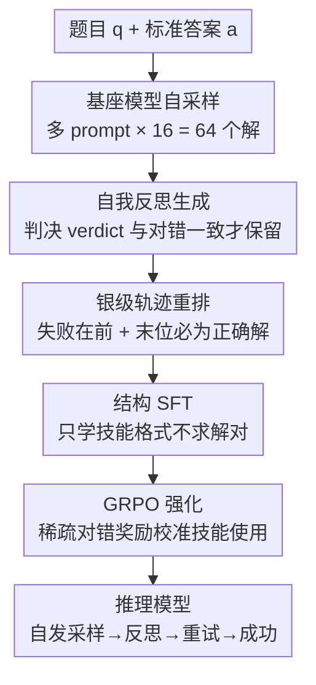

# SkillFactory: Self-Distillation for Learning Cognitive Behaviors

**会议**: ICLR 2026  
**OpenReview**: [https://openreview.net/forum?id=ttMLNXBWKY](https://openreview.net/forum?id=ttMLNXBWKY)  
**代码**: https://github.com/Zayne-sprague/SkillFactory (有)  
**领域**: LLM推理  
**关键词**: 认知技能, 自蒸馏, 冷启动SFT, GRPO, 推理泛化

## 一句话总结
SkillFactory 用基座模型自己采样的对错解 + 自我反思，重排成带 `<sample>`/`<reflect>`/`<verdict>` 标签的"银级"轨迹做 SFT，给模型预装"验证—重试"等认知技能，再用 GRPO 强化——不依赖更强教师模型，就能让 RL 后的模型在更难任务变体和跨域任务上更强、更抗遗忘。

## 研究背景与动机

**领域现状**：现代推理大模型（o1、DeepSeek-R1 等）之所以强，很大程度上来自它们会用一套"认知技能"——系统性搜索解空间、验证自己的输出、失败后换个方法重试。已有工作（Gandhi et al. 2025）发现：只要基座模型已经"隐隐"会这些技能，再用 RL（如 GRPO）就能把它们放大。

**现有痛点**：问题是，如果基座模型压根没展现某种技能，RL 也无从强化。要补上这些技能，现有三条路都有硬伤——(1) 纯 RL 稀疏奖励只能激发基座里"已潜在"的技能，跨任务泛化时根本不稳；(2) 从更强模型蒸馏（如用 R1 的轨迹做 SFT）需要先有一个更强的教师，且常常只在蒸馏数据所在的域内有效；(3) 定向数据构造（continual pre-training、ICL、MCTS rollout）要么要外部强模型、要么要大量定制数据。

**核心矛盾**：大家默认"SFT 阶段任务解得越好 = RL 后越强"，于是拼命让 SFT 模型多对几道题。但作者发现这个假设是错的——**RL 前的高准确率并不蕴含 RL 后的高准确率**，真正重要的是 SFT 有没有把"该用什么技能、在哪用"这套结构先装进去，而不是把任务本身学到最好。

**本文目标**：在不借助更强教师模型的前提下，把"验证 + 重试"这类认知技能在 RL 之前就灌进模型，作为 RL 的良好起点（warm start），让 RL 后在更难变体、跨域任务上都更稳。

**切入角度**：既然基座模型自己采样时偶尔就会冒出隐式的验证、重试，那就把它**自己产出的对解、错解、反思**收集起来，按"技能的格式"重新拼装成轨迹——哪怕这些"银级"轨迹本身解题不完美，只要结构对，就足以给 RL 打底。

**核心 idea**：用模型自己的采样自蒸馏出带显式标签的"试错—反思—重试—成功"轨迹做 SFT 冷启动，**只学结构不求解对**，再用 GRPO 校准技能的使用时机。

## 方法详解

### 整体框架
SkillFactory 是一条三段式流水线：**数据构造 → SFT → RL**。输入是一个带标准答案的任务数据集 $D_T=\{(q_i,a_i)\}$ 和一个基座模型 $M$；输出是一个经过 RL、会显式使用验证/重试技能的推理模型。

关键在第一段"数据构造"：对每道题，先让基座模型多次采样得到一堆**解题尝试** $y$（有对有错），再让同一个基座模型对每个 $y$ 写**反思** $r$ 并给出"对/错"判决（verdict）；然后把这些 (解, 反思) 对按"几次失败 + 最后一次成功"的顺序重排，包上 `<sample>`/`<reflect>`/`<verdict>`/`<answer>` 标签并加上"让我再想想"之类的衔接语，拼成一条结构化训练轨迹。SFT 阶段只让模型学会**这套结构**（不指望准确率上升），最后 GRPO 用稀疏的"答对/答错"奖励校准技能该在何时何处使用。

### 关键设计

**1. 自采样银级数据：用模型自己的对错解换掉强教师**

这一步直接针对"蒸馏需要更强教师"的痛点。对每道题 $q_i$，作者用 4 个不同的思维链提示 $P_{solve}$、每个采 16 条，得到 $N_{sample}=64$ 个解 $Y$；每个解用 `<answer>` 标签里的内容做抽取，定义 $\text{correct}(y,a_i)=\mathbb{1}[\text{extract}(y)=a_i]$ 来打对错标签。注意**对解和错解都要保留**——错解是教模型"自我纠错"必不可少的素材。这些轨迹被作者称作"silver"（银级而非金级）：单看解题它们并不完美，但它们提供的是技能的**结构样板**。这跟蒸馏的根本区别在于：蒸馏是从一个更强模型学新知识、新策略，而这里完全是把同一个模型的产出"换种摆法"喂回去，因此天花板不受外部模型限制，也不会把模型拉去过拟合教师的领域。

**2. 自我反思 + 判决过滤：让验证信号可靠**

光有对错解还不够，模型要学会的是"看着一个解判断它对不对"。作者用反思提示 $P_{reflect}$ 让基座模型对每个解 $y$ 写一段批判性反思 $r$，并要求用 `<verdict>...</verdict>` 标签给出"Correct/Incorrect"判决。每个解采 4 条反思，但**只保留判决与真实对错一致的那些**，即满足 $\text{verdict}(r)=\text{correct}(y,a_i)$ 的反思。这一步是质量闸门：如果让模型把"明明错了却说对"的反思也学进去，验证技能就成了噪声。过滤后得到的反思集 $R$，保证了 SFT 看到的每一次"验证"都是判对的，从而把可靠的验证行为印进模型——分析表里验证 F1 普遍 >0.8 正是这一过滤的回报。

**3. 轨迹重排算法：把碎片拼成"试错—成功"的完整故事**

最后要把零散的 (解, 反思) 对组装成一条像样的推理轨迹（算法 1）。作者把对/错对分成 $Y^+$ 和 $Y^-$，对每条轨迹：先采 $n^+\le L_{max}$ 个正确对、$n^-\in[0,n^+-1]$ 个错误对；把"除最后一个正确对之外的全部对"打乱（$\text{shuffle}(T^-\cup T^+[1{:}n^+{-}1])$），再把保留的那个正确对**追加到末尾**，确保 $\text{trace}=\dots\cup\{T^+[n^+]\}$ **总是以正确解收尾**。这样每条轨迹都呈现"尝试→反思→（错了就）重试→最终成功"的形态。重排顺序很关键：消融显示，如果轨迹内部不做这种有序排布（No Sample Order），验证器在跨域任务上的准确率会明显下降——结构本身，而不只是内容，才是技能能否泛化的决定因素。

### 损失函数 / 训练策略
SFT 阶段在银级轨迹上做标准监督微调，作者明确**不期望此阶段准确率上升**，目标只是给 RL 找一个更好的起点。RL 阶段用现成的 GRPO，奖励是基于答案正确性的二元稀疏奖励，与各 baseline 共用同一套 GRPO 配置。Countdown 实验训练上下文长度 4,096、评测 16,384；OpenThoughts 实验在 1k/10k 行 SFT 数据上微调 Qwen2.5-7B-Instruct。

## 实验关键数据

两大设置：(1) 只在 **Countdown-3arg** 上做 SFT+RL，评测更难的 4–6 arg 变体及一系列跨域任务（易→难 + OOD 泛化）；(2) 在 **OpenThoughts** 子集上训练，评测 GPQA/AIME25/AMC/Math500（复杂数学推理）。基座覆盖 Qwen2.5-1.5B/7B-Instruct 与 Olmo-3-7B。

### 主实验

Countdown-3arg 训练、跨难度/跨域评测（Qwen2.5-1.5B-Instruct，Overall 为综合平均）：

| 方法 | Countdown | Mult | CSQA | GSM8k | Overall |
|------|-----------|------|------|-------|---------|
| 基座 Qwen2.5-1.5B | 1.9 | 29.8 | 55.7 | 59.2 | 27.3 |
| RL-Only | 15.8 | 24.4 | 62.6 | 67.7 | 31.9 |
| R1 Distill → GRPO | 21.2 | 37.1 | 63.8 | 72.9 | **35.9** |
| **SkillFactory → GRPO** | **25.1** | 35.0 | 60.8 | 68.2 | 35.7 |

关键对照：在最难的 Countdown 变体上 SkillFactory→GRPO 拿到 25.1%，比次强的 R1 Distill→GRPO（21.2%）高 +3.9，比 RL-Only 高 9.3 个点；综合分 35.7 与依赖强教师的 R1 蒸馏（35.9）几乎打平——但 SkillFactory 全程不需要任何更强模型。

OpenThoughts 训练、复杂数学评测（Qwen2.5-7B，Overall 平均）：

| 方法 | AMC | Math500 | Overall |
|------|-----|---------|---------|
| RL Only | 33.5 | 59.1 | 38.0 |
| QwQ distill 10k | 36.5 | 58.6 | **42.5** |
| SkillFactory 1k | **37.5** | **64.6** | 42.1 |
| SkillFactory 10k | 35.2 | 61.9 | 40.6 |

SkillFactory 仅用 1k SFT 数据就逼近 QwQ 蒸馏 10k（42.1 vs 42.5），并在 AMC、Math500 这两个未被 OpenThoughts 显式针对的基准上反超蒸馏。

### 消融实验

| 配置 | 现象 | 说明 |
|------|------|------|
| SkillFactory（完整） | CD-3arg 验证 F1 0.96/0.92 | 对/错两类判决都准 |
| w/o 轨迹内部有序（No Sample Order） | OOD 验证 F1 下降（如 Letter CD 0.34→0.22） | 重排结构对跨域泛化是必需 |
| Budget Forcing（推理时加 `<sample>` 触发） | Countdown +5.3（17.5→22.8） | 内置技能让模型能吃下更长上下文 |

### 关键发现
- **"SFT 解得好 ≠ RL 后强"被证伪**：R1 Distill 的 SFT 准确率（11.7%）远高于 SkillFactory（2.8%），但 RL 后关系反转，SkillFactory→GRPO 反超。说明给 RL 装"对的技能结构"比把任务学到最好更重要。
- **数据多反而略降**：SkillFactory 从 1k→10k OpenThoughts 数据，综合分从 42.1 掉到 40.6——核心技能早早就学会了，多喂 SFT 数据没有像蒸馏那样带来新策略/新知识。
- **抗遗忘 / 抗回退**：RL 后的 SkillFactory 在 OOD 任务（CSQA、GSM8k）上比 RL 后的纯基座更不易灾难性遗忘；纯 RL 在 OOD 上常退化成短输出或退化输出。
- **验证确实在用且可靠**：分析表显示错误类 F1 普遍 >0.8（错解被正确否决），且反思次数随任务难度上升（CD-4arg 多于 CD-3arg），证明技能是真用而非装饰。

## 亮点与洞察
- **"只学结构、不求解对"是反直觉但有效的训练哲学**：把 SFT 的目标从"提高准确率"重新定义成"安装技能脚手架"，等于把 cold-start 问题拆成"先装结构、再由 RL 校准时机"，绕开了对强教师的依赖。
- **自蒸馏闭环天然抗过拟合教师域**：因为数据全来自基座自己，技能不会被绑定到某个外部模型擅长的领域，这正是它在 OOD 上比蒸馏更稳的根因。
- **判决过滤 + 末位必正确**这两个小约束很关键：前者保证学到的验证可靠，后者保证每条轨迹是"会成功的试错"而非"放弃"，可迁移到任何"易验证难求解"的搜索类任务（NP 风格任务）。
- **Budget Forcing 复用**：内置的 `<sample>` 标签让推理时简单追加触发词就能"再想一轮"，还能把陷入循环的退化输出打断，是一个几乎零成本的推理扩展接口。

## 局限与展望
- 作者坦言部分任务（如 Letter Countdown）表现差主要受**模型规模**所限——小模型本身分不清"是不是英文单词"，并非方法失效。
- 实验最大规模到 7B，是否在更大模型、更复杂多步推理上仍保持"少量 SFT 即可"的优势未验证。
- 银级轨迹的质量受基座采样能力上限约束：如果基座连隐式技能都几乎不出现，自采样可能凑不出足够的对解/有效反思。
- 当前只聚焦"验证"和"重试"两类技能，能否用同一范式装入更复杂的认知行为（如分解、回溯到特定步）是自然的延伸方向。

## 相关工作与启发
- **vs 蒸馏（R1 Distill / QwQ）**：他们从更强教师学轨迹做 SFT，SFT 准确率高但绑定教师域、需要强模型；本文用基座自身产出，SFT 准确率低却在 RL 后追平甚至反超，且更抗遗忘、不需教师。
- **vs STaR**：STaR 也是自蒸馏，但只收集**正确**输出来训练；本文刻意保留错解 + 反思来教自我纠错，在更难的 Countdown 变体上 STaR 几乎无增益（RL 后甚至低于基座），而 SkillFactory 拿到最高分。
- **vs 纯 RL（RL-Only）**：纯 RL 只能放大基座里已潜在的技能，跨任务泛化不稳、OOD 易退化成短输出；本文先用结构 SFT 把技能装进去再 RL，跨域更稳。
- **vs BOLT / ASTRO 等定向数据构造**：思路相近（都想 RL 前装技能），但本文强调数据**完全来自基座**、且揭示"结构"而非"内容"才是技能一致泛化的关键。

## 评分
- 新颖性: ⭐⭐⭐⭐ "自采样银级轨迹 + 只学结构"的冷启动范式，把"SFT 解得好≠RL 后强"讲透
- 实验充分度: ⭐⭐⭐⭐ 两大设置、三种基座、易→难/OOD/复杂数学全覆盖，含验证 F1 与长度分布分析
- 写作质量: ⭐⭐⭐⭐ 动机推导清晰，Algorithm 1 把数据构造写得可复现
- 价值: ⭐⭐⭐⭐ 给"无强教师也能装认知技能"提供了简单可落地的配方，对中小模型推理尤其实用

<!-- RELATED:START -->

## 相关论文

- [\[ICML 2026\] The Role of Feedback Alignment in Self-Distillation](../../ICML2026/llm_reasoning/the_role_of_feedback_alignment_in_self-distillation.md)
- [\[ICLR 2026\] Probing to Refine: Reinforcement Distillation of LLMs via Explanatory Inversion](probing_to_refine_reinforcement_distillation_of_llm_reasoners_via_explanatory_in.md)
- [\[ICLR 2026\] RESTRAIN: From Spurious Votes to Signals — Self-Training RL with Self-Penalization](restrain_from_spurious_votes_to_signals_self-training_rl_with_self-penalization.md)
- [\[ICLR 2026\] Toward Effective Tool-Integrated Reasoning via Self-Evolved Preference Learning](toward_effective_tool-integrated_reasoning_via_self-evolved_preference_learning.md)
- [\[ICLR 2026\] KaVa: Latent Reasoning via Compressed KV-Cache Distillation](kava_latent_reasoning_via_compressed_kv-cache_distillation.md)

<!-- RELATED:END -->
