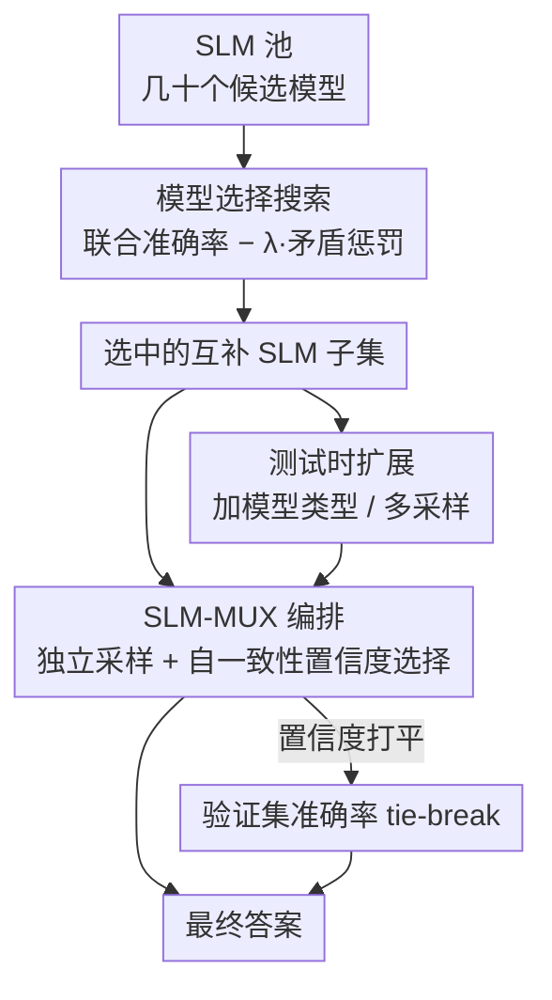

# SLM-MUX: Orchestrating Small Language Models for Reasoning

**会议**: ICLR 2026  
**OpenReview**: [https://openreview.net/forum?id=317bcKF4zv](https://openreview.net/forum?id=317bcKF4zv)  
**代码**: 无  
**领域**: LLM推理  
**关键词**: 小语言模型, 多模型编排, 置信度选择, 模型选择搜索, 测试时扩展

## 一句话总结
本文发现「让模型互相讨论纠错」的编排方法在小语言模型（SLM）上不仅无效甚至掉点，转而提出无需训练、无需文本交互的 SLM-MUX——各 SLM 独立采样、按自一致性置信度选最终答案，再配上模型选择搜索与测试时扩展两套优化策略，仅用两个 SLM 就在 GPQA/GSM8K 上超过 Qwen2.5-72B。

## 研究背景与动机
**领域现状**：近年小语言模型（几十亿到几百亿参数）大量涌现，单点精度比不上前沿大模型，但推理成本低、可端侧部署。一个自然的想法是：能不能像当年 CPU 从单核转向多核那样，把多个 SLM 编排成一个系统，让整体精度超过任何单个模型。现有的多模型编排方法（Mixture-of-Agents、LLM-Debate、Multi-Agent Verification）正是沿着这条路走的。

**现有痛点**：这些方法本文统称为「基于讨论的编排」（discussion-based orchestration）——多个模型实例用自然语言互相提议、批评、辩论、验证，最后聚合成一个答案。它们都隐含同一个假设：参与的模型具备足够强的推理与反思能力，能在交互中自我纠错。这个假设在前沿大模型上成立（MoA/Debate/Verification 能比单模型最好结果再涨约 2%），但本文系统实验发现，**一旦换成 SLM，这套机制不仅不涨，反而最多掉 5.5%**。

**核心矛盾**：SLM 没有可靠的自纠错能力。在讨论里它们不是修正错误，而是陷入「群体思维」（groupthink）——互相强化错误推理、放大而非缓解错误。作者在附录分析中指出，59.5% 的失败可归因于群体思维，且即便做大量 prompt 优化，性能差距依旧存在。换句话说，「语言模型能互相纠正答案」这个前提对 SLM 根本不成立。

**本文目标**：给定一池可用的 SLM，要回答两个问题——（i）如何编排它们的输出获得最佳整体性能；（ii）如何从几十个 SLM 中选出一个互补的有效子集。

**切入角度**：既然 SLM 不会讨论纠错，那就**别让它们讨论**。作者的关键观察是：模型答案的「自一致性」与「正确性」高度相关——一个把高概率质量放在正确答案上的模型，会在多次采样里反复给出等价答案；而不确定的模型则输出五花八门。于是可以用一条无需训练的规则，估计每个模型的置信度，再选置信度最高者的答案。

**核心 idea**：用「独立采样 + 自一致性置信度选择」替代「文本讨论纠错」，并通过模型选择搜索挑出能力互补的 SLM 子集，从而在不训练任何模型的前提下榨取多个 SLM 的互补能力。

## 方法详解

### 整体框架
SLM-MUX 的整条管线分三层。最底层是 **SLM-MUX 编排架构**：对一道题，池中每个被选中的 SLM 各自独立采样多个候选答案（温度 > 0），统计每个模型自己最频繁的答案及其出现频率作为「置信度」，最终输出置信度最高的那个答案；若多个模型置信度打平，用各模型在验证集上的准确率做 tie-break。中间层是 **模型选择搜索**：在把哪些 SLM 放进系统之前，先在验证集上做一次搜索，用「联合准确率 − λ·矛盾惩罚」这个目标，挑出能力互补、且不会互相用「自信的错答」压制对方的子集。最上层是 **测试时扩展**：固定一组模型后，再沿「加入更多模型类型」和「每个模型多采样几个」两个维度增加推理算力，进一步把精度推高并找到精度-算力的甜点。三者关系是：搜索决定「用谁」，架构决定「怎么选答案」，扩展决定「投多少算力」。

### 关键设计

**1. SLM-MUX：用自一致性置信度选答案，彻底绕开文本讨论**

这一设计直接针对 SLM「不会讨论纠错、反而群体思维放大错误」的痛点：既然交互有害，那就让模型之间**零文本交互**。它分两个阶段。独立生成阶段中，对同一道题，每个模型 $M_i$ 用温度 > 0 独立采样 $k$ 个候选答案 $Y_i=\{y_i^{(1)},\dots,y_i^{(k)}\}$。置信度估计阶段中，先统计每个候选答案的出现频率 $f_i(y)=\frac{1}{k}\sum_{j=1}^{k}\mathbb{1}[y_i^{(j)}=y]$，取该模型最频繁的答案 $y_i^*=\arg\max_y f_i(y)$，并把它的频率 $s_i=f_i(y_i^*)$ 作为这个模型的置信度。系统最终选所有模型里置信度最高者的答案：$S_{\max}=\max_i s_i$；若只有一个模型达到 $S_{\max}$ 就直接采纳，若多个模型并列，则在并列集合 $I^*$ 内选验证集准确率 $a_i$ 最高的模型 $i^*=\arg\max_{i\in I^*} a_i$ 的答案。

它有效的根源在于「自一致性 ⟺ 正确性」这一被反复验证的经验规律：模型对越有把握的题，多次采样越收敛到同一答案。SLM-MUX 把这个单模型现象用作**跨模型的仲裁信号**——谁的答案更自洽，就更可能对。这样既保留了各 SLM 各自擅长领域的互补能力（实验中 MATH 上最终答案 38.8% 来自 Gemma-2 27B、38.0% 来自 Mixtral-8×7B、21.2% 来自 Llama 3.1 8B），又避免了讨论带来的错误传染，且整套规则不需要训练任何模型。

**2. 模型选择搜索：用「联合准确率 − 矛盾惩罚」挑互补而非挑最强**

光有架构还不够——把哪些 SLM 放进系统至关重要。一个常见误区是「按单模型准确率挑最强的几个」，但本文指出这会忽略模型间的相互作用：如果一个模型在所有维度都弱于另一个（如 Llama3.2-3B 全面弱于 Qwen2.5-7B），把它加进来毫无增益；反过来两个各有所长的模型（如 Mistral Small 24B 与 Qwen2.5-7B 在不同子学科互有胜负）才值得组合。

于是作者把选模型建模成验证集上的搜索问题，目标函数同时权衡两项。第一项是**联合准确率**，衡量系统能力的乐观上界——只要子集 $S$ 里至少有一个模型答对就算对：$\text{UnionAcc}(S)=\frac{1}{|D|}\sum_{x\in D}\mathbb{1}\{\exists m\in S: m(x)\text{ 正确}\}$。第二项是**矛盾惩罚**，刻画「一个模型自信地答错、压制了另一个模型的正确答案」这种坏情况——因为 SLM-MUX 按一致性选答案，一个一直答 B（错但自信）的模型会和一直答 A（对）的模型显得同样自信，从而无法区分：$\text{Contradiction}(S)=\frac{1}{|D|}\sum_{x\in D}\mathbb{1}\{\exists m_1\in S: m_1(x)\text{ 一致错},\ \exists m_2\in S: m_2(x)\text{ 正确}\}$。最终目标为 $O(S)=\text{UnionAcc}(S)-\lambda\cdot\text{Contradiction}(S)$。由于候选模型数不大，直接穷举搜索。

这个目标的精妙之处在于它框定了 SLM-MUX 真实精度的上下界：联合准确率是「有个理想仲裁器总能挑出正确答案」的乐观上界；当 $\lambda=1$ 时，目标退化为「碰到自信错答必选错」的悲观下界。实际系统因为有 tie-break 和自信正确答案的存在，落在两者之间。Figure 7 显示随模型数 $K$ 从 2 增到 5，联合准确率上升但矛盾惩罚也同步上升，说明「加模型」不是越多越好，而要在两股竞争力量间取得平衡。

**3. 测试时扩展：在选定子集上沿模型数与采样数两维加算力**

固定一组模型后，本文进一步探索两个正交的测试时扩展维度。**加入更多模型类型**：对每个预算 $K$（2 到 5），先用上面的搜索挑出该预算下的最优组合，再评估其精度——它带来更多互补能力，但也引入更多矛盾。**每个模型多采样**：固定一组模型，把每个模型的采样数从 2 增到 9。由于置信度是靠数「多数答案出现频率」估计的，采样越多，置信度估计越准、tie-break 越可靠。

这两维有效的原因不同：前者扩的是「能力覆盖面」，后者扩的是「置信度估计的统计稳定性」。实验也揭示它们各有甜点而非单调变好——「加模型类型」在不同 benchmark 上差异很大（GPQA 上两个模型时达峰、之后下降；GSM8K 两个模型即饱和；MATH 还能随模型数继续涨），提示实际部署要按任务挑扩展维度，而不是无脑堆模型或堆采样。

## 实验关键数据

### 主实验
基模型为 Mistral 8×7B、LLaMA 3.1 8B、Gemma 2 27B；每模型温度 0.3 采样三轮，按多数答案频率算置信度，平局用验证集准确率打破。对比基于讨论的编排方法（MATH / GPQA / GSM8K，准确率 %）：

| 方法 | MATH | GPQA | GSM8K |
|------|------|------|-------|
| Mixture-of-Agents | 51.4 | 33.3 | 81.6 |
| LLM-Debate | 51.6 | 36.8 | 80.8 |
| Multi-Agent Verification | 48.4 | 35.3 | 86.4 |
| Single-Best（最强单模型） | 56.8 | 38.9 | 84.2 |
| Single-Best-SC（单模型自一致性） | 58.0 | 42.4 | 86.8 |
| **SLM-MUX（本文）** | **61.8** | **42.1** | **87.8** |

相比讨论类方法，SLM-MUX 在 MATH 上最高提升 13.4%、GPQA 8.8%、GSM8K 7.0%；且仅用两个 SLM 即在 GPQA/GSM8K 上超过 Qwen2.5-72B、在 MATH 上与之持平。

### 消融 / 分析实验

**讨论类方法在 SLM vs 大模型上的对照（Single-Model Max 为单模型最好结果）**：

| 设置 | 数据集 | Single-Model Max | MoA | Debate | Verification |
|------|--------|------------------|-----|--------|--------------|
| SLM 编排 | MATH | 56.8 | 51.6 | 48.4 | — |
| SLM 编排 | GPQA | 46.2 | 38.8 | 33.3 | 35.4 |
| 大模型组合 | MATH | 90.4 | 88.8 | 90.8 | 91.6 |
| 大模型组合 | GPQA | 63.6 | 58.6 | 65.6 | 64.2 |

同一套讨论方法在前沿大模型上能涨约 2%，在 SLM 上却普遍跌破单模型最好结果（最多掉 5.5%），直接验证了「跨尺度不可迁移」。

**模型选择搜索的收益（两模型组合，best-single vs 编排后）**：MATH（Mistral Small 24B + Qwen2.5-7B）75.5→80.0（+4.5）；GPQA（Gemma 2 27B + Mistral Small 24B）45.1→49.5（+4.4）；GSM8K（Mistral Small 24B + Qwen2.5-7B）88.5→92.8（+4.3）。

**测试时扩展 vs Agent Forest（每模型 2 样本 / 最佳样本数）**：

| 数据集 | 设置 | SLM-MUX | Agent Forest | 增益 |
|--------|------|---------|--------------|------|
| MATH | 2 样本 | 76.8 | 72.3 | +4.5 |
| GPQA | 2 样本 | 46.3 | 40.4 | +5.9 |
| GSM8K | 2 样本 | 82.1 | 77.7 | +4.4 |

### 关键发现
- **讨论失败的根因是群体思维**：59.5% 的 SLM 编排失败可归因于讨论中互相强化错误，且 prompt 优化无法弥合差距——这是「为什么要换思路」的实证支撑。
- **挑模型要挑互补而非挑最强**：搜索带来稳定 +4% 增益；联合准确率与矛盾惩罚随模型数同步上升，说明存在「加模型反而被错答拖累」的拐点（GPQA 两模型即达峰）。
- **两个扩展维度各有甜点**：采样数 2 时 SLM-MUX 对 Agent Forest 优势最大（GPQA +5.9），样本充足后优势收窄（部分仅 +0.3），说明本方法在低算力预算下性价比尤其突出。

## 亮点与洞察
- **「不让模型讨论」反而是关键洞察**：与主流多智能体「越交互越聪明」的直觉相反，本文证明对能力不足的模型，交互是负担而非红利；把自一致性从单模型 trick 升格为跨模型仲裁信号，简单却切中要害。
- **矛盾惩罚把「自信的错答」显式建模进选模型目标**，并用 $\lambda$ 在乐观上界（联合准确率）与悲观下界之间插值估计真实精度——这套上下界刻画让「该选几个模型」从拍脑袋变成可分析的权衡。
- **零训练、零文本交互、可迁移**：核心原理还能推广到开放式生成（HumanEval）、前沿 LLM 与领域微调 SLM，迁移成本极低——任何「多候选 + 可估置信度」的场景都可复用这套选择规则。

## 局限与展望
- 置信度完全依赖「自一致性 ⟺ 正确性」这一相关性，对那些「自信地系统性答错」的题（矛盾惩罚刻画的正是这类）天然无能为力，只能靠 tie-break 和模型互补部分缓解。
- 主要在多选/可判定答案的推理基准（MATH/GPQA/GSM8K）上评测，置信度靠「答案频率」统计；对开放式生成，答案等价性判定更难，置信度信号会变噪。
- 模型选择用穷举搜索，依赖候选池不大的假设；候选规模一旦上去，搜索成本与验证集开销都会成为瓶颈，需要更高效的近似搜索。

## 相关工作与启发
- **vs Mixture-of-Agents / LLM-Debate / Multi-Agent Verification**：它们靠文本讨论让模型自纠错，假设模型有强推理与反思能力；本文证明该假设对 SLM 失效，改用无交互的置信度选择，规避群体思维带来的错误放大。
- **vs Self-Consistency**：自一致性是单模型多采样取多数；SLM-MUX 把它扩展为跨模型——用每个模型自己的一致性当置信度，再跨模型择优，从而吃到模型间的互补能力。
- **vs Agent Forest**：Agent Forest 把所有模型的输出混在一起做多数投票；SLM-MUX 先在模型内部估置信度、再跨模型择一，在低采样预算下显著更优（GPQA 2 样本时 +5.9）。
- **vs 基于单模型准确率的模型选择**：以往按 standalone 准确率挑模型，忽略交互；本文用端到端的「联合准确率 − 矛盾惩罚」直接评估编排效果，凸显「最强单模型未必组成最强系统」。

## 评分
- 新颖性: ⭐⭐⭐⭐ 「讨论对 SLM 有害」是反直觉且有价值的发现，方法本身简单但切中要害
- 实验充分度: ⭐⭐⭐⭐ 跨三个基准、对照大模型/SLM、含搜索与扩展两套消融，并有理论上下界分析
- 写作质量: ⭐⭐⭐⭐ 三层方法层次清晰，置信度与搜索目标都给了明确公式
- 价值: ⭐⭐⭐⭐ 零训练、低成本、可迁移，对端侧/低算力部署多 SLM 很实用

<!-- RELATED:START -->

## 相关论文

- [\[ICLR 2026\] Following the Navigation: Enhancing Small Language Models Contextual Reasoning with LLM Guidance](following_the_navigation_enhancing_small_language_models_contextual_reasoning_wi.md)
- [\[ICLR 2026\] T1: Tool-Integrated Verification for Test-Time Compute Scaling in Small Language Models](t1_tool-integrated_verification_for_test-time_compute_scaling_in_small_language_.md)
- [\[ICLR 2026\] Efficient Test-Time Scaling for Small Vision-Language Models](efficient_test-time_scaling_for_small_vision-language_models.md)
- [\[ICML 2026\] DenseSteer: Steering Small Language Models towards Dense Math Reasoning](../../ICML2026/llm_reasoning/densesteer_steering_small_language_models_towards_dense_math_reasoning.md)
- [\[ICLR 2026\] Variational Reasoning for Language Models](variational_reasoning_for_language_models.md)

<!-- RELATED:END -->
