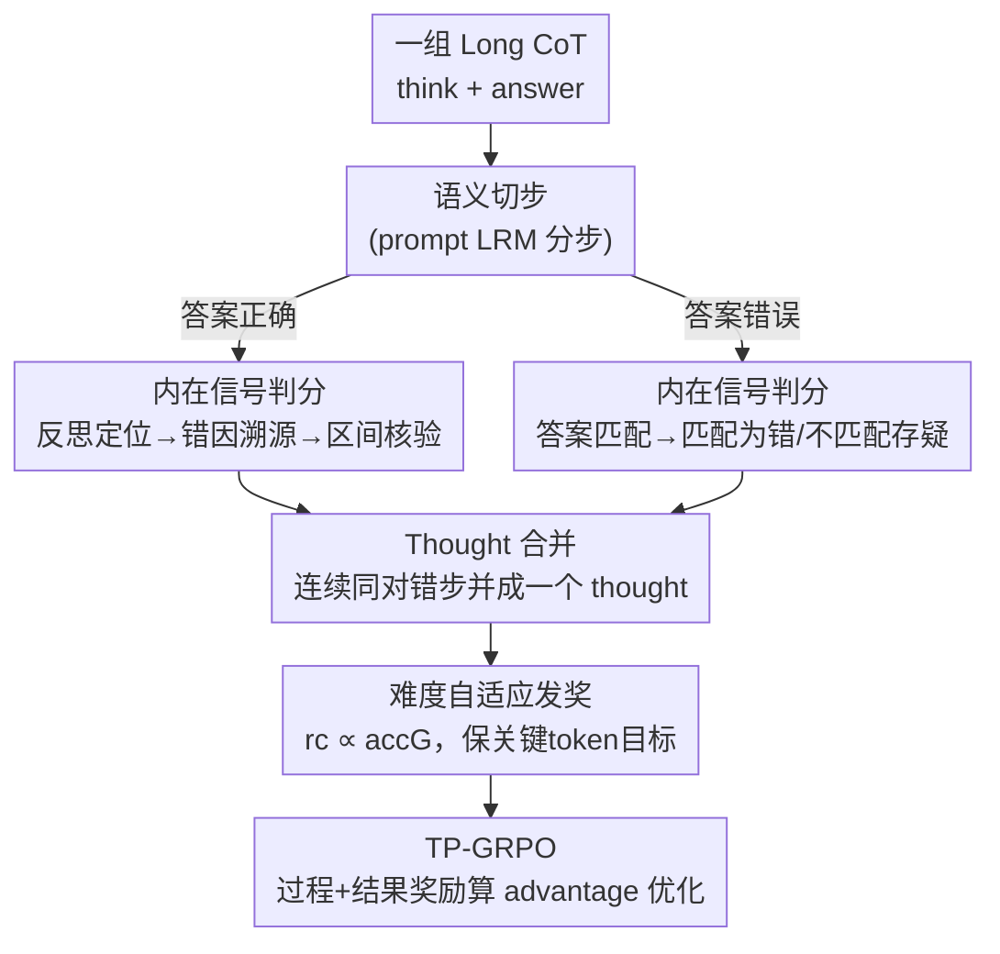

# Smarter Not Harder: Generative Process Evaluation with Intrinsic-Signal Driving and Ability-Adaptive Reward Shaping

**会议**: ICLR 2026  
**OpenReview**: [https://openreview.net/forum?id=LZZENDlZt9](https://openreview.net/forum?id=LZZENDlZt9)  
**代码**: 无  
**领域**: LLM推理  
**关键词**: 过程奖励, GenPRM, 强化学习, 数学推理, 训练效率

## 一句话总结
针对生成式过程奖励模型（GenPRM）做 RL 时三大隐患——判分依赖推理能力、密集步奖励触发 reward hacking、静态奖励压制探索——本文提出"用解题轨迹里的内在语义信号（反思/匹配）来判对错"+"把连续同对错的步合并成 thought 再发奖"+"按当前难度自适应缩放奖励"，整合进过程监督 GRPO 得到 TP-GRPO，在 1.5B/7B 模型上用 5× 更少的样本超过 outcome-only GRPO。

## 研究背景与动机

**领域现状**：RLVR（带可验证奖励的强化学习）靠规则化的结果奖励（答对 +1 / 答错 -1）训练大推理模型（LRM），在数学推理上效果显著（DeepSeek-R1、Kimi k1.5）。但结果奖励只看最终答案对错，对中间几千 token 的推理轨迹一概不评，反馈极其稀疏，样本利用率低。

**现有痛点**：为了利用中间过程，研究者转向过程奖励模型（PRM）。判别式 PRM 受困于步骤切分不稳、泛化差、标注贵；生成式 PRM（GenPRM）让强模型"边想边判"更灵活，但作者发现把 GenPRM 朴素地塞进 reward shaping 会引入三个致命隐患：① **判分阶段**——GenPRM 靠"重新推一遍/模拟推理"来判每一步对错，这隐含假设 PRM 的推理能力 ≥ actor LRM；任务越难、actor 越强，对 PRM 的要求水涨船高，评估可靠性崩塌（自评场景还有 bias）；② **发奖阶段（密集）**——给每一步都发静态 ±1，步数一多，过程奖励就主导了 advantage 估计，模型转而去最大化"过程收益"而非答对，即 reward hacking；③ **发奖阶段（静态）**——对错误尝试一律惩罚，会压制本该鼓励的试错探索，使模型困在局部最优。

**核心矛盾**：过程奖励想"更细粒度地利用轨迹"，但越细就越要求 PRM 有强推理能力来判分、越密集就越容易扭曲优化目标。判分依赖、密集偏置、探索压制三者纠缠。

**本文目标**：设计一套 GenPRM 机制，使其 ① 判分不依赖强推理；② 奖励粒度合适不扭曲优化；③ 平衡探索与利用。对应三条原则 P1 解耦评估与推理、P2 适当粒度发奖、P3 平衡探索利用。

**切入角度**：作者观察到 Long CoT 里本身就埋着内在信号——正确解里若有错误步，必然伴随一次"反思纠错"（否则错误会传播到最终答案），错误解里"被采纳进答案的步"天然可作为惩罚目标。这些语义/匹配线索，恰是 LLM 比"再推一遍"更稳的基础能力。

**核心 idea**：把"判推理对错"这件难事，拆成 LLM 更擅长的"语义理解+匹配"子任务（intrinsic-signal-driven），并把奖励上提到 thought 粒度、按难度自适应缩放，整合进 GRPO 成 TP-GRPO。

## 方法详解

### 整体框架

TP-GRPO 把 GenPRM 拆成两个阶段串进 GRPO 训练回路：输入是 LRM 对某道数学题采样出的一组 Long CoT（think + answer），输出是给每个 token 的 advantage，最终用标准 GRPO 目标优化。**阶段 I（评估）**先把 think 切成语义步，再用"内在信号"判每步对错——不靠重新推理，而是对正确解走"反思定位→错因溯源→区间核验"三步、对错误解走"答案匹配"协议。**阶段 II（发奖）**把连续同对错的步合并成 thought，按当前题目的组内准确率 $acc_G$ 自适应地给每个 thought 发 $\pm r_c$，并刻意保持关键 token 的优化目标不变以抑制 reward hacking。两阶段结果接入过程监督 GRPO 的 advantage 计算，得到 TP-GRPO。

### 关键设计

**1. 内在信号驱动评估：把"判对错"从"会不会推理"上解耦**

这针对第①个隐患——现有 GenPRM 要"重新推一遍"才能判每步对错，等于要求 PRM 推理能力压过 actor，越难越靠不住。作者的做法是把判分换成 LLM 更稳的语义理解/匹配能力，并对正确解和错误解设计两套协议。对**正确解**（找出无效步），基于一个自洽假设：答案既然对了，任何错误步必然伴随一次有效反思把它纠回来，否则错误会传到最终答案——所以错误与反思成对出现。于是走三步：1) **反思定位**，用语义理解找到 LRM 自我反思（如 "wait, I made a mistake"）的步；2) **错因溯源**，顺着反思里对错因的分析回溯，圈出一段候选错误区间；3) **区间核验**，在区间内用启发式规则（如"依赖前面错误结论的步也算错"）逐步判定。对**错误解**（避免过度惩罚），先做保守假设"答案里所有步都错"，再把 think 中**语义匹配错误答案**的步标错、**不匹配**的步标为"存疑"——这样既不像纯结果奖励那样把 think 里的有效探索一棍子打死，又不需要 PRM 有超强判分力，只要会语义对齐。本质是用"语义理解+匹配"这种 LLM 的根基能力替掉"再推理"这种异质且不稳的能力。

**2. Thought 级奖励单元：把密集步奖励上提到段落粒度**

这针对第②个隐患——think 常被切成大量步，若按步发静态奖励，过程奖励会主导 advantage 把优化带歪。论文给的反例很直观：第 4 步本是对的，但后面连续 5 个错误步的累积负回报会反过来把这个正确步也惩罚掉（advantage 是 token 之后所有标准化过程奖励的累加 $\hat{A}_{i,t}=\sum_{index(j)\ge t}\hat{r}_i^{index(j)}$，负号会污染前面）。解法很简单：把**连续且同对错**的步合并成一个逻辑单元——thought（正确解里连续对/错步并成正确/错误 thought，错误解里连续匹配/不匹配步同理），奖励发在 thought 级而非 step 级。这不是盲目过滤奖励信号，而是保留"正确引导优化所需的最小奖励集"、最大化削减冗余。实验显示这条最简单的策略掉点反而最多（去掉它 AIME 25 从 25.63 掉到 22.29），因为它显著降低了 token advantage 的方差、提高了 advantage 与 token 正确性的互信息。

**3. 难度自适应奖励：按题目难度缩放，既不压探索也不被 hack**

这针对第③个隐患（静态奖励压探索）并兜住 reward hacking。核心是奖励强度随当前能力动态调。对**正确解**，每个正确 thought 发 $+r_c$、错误 thought 发 $-r_c$，其中

$$r_c = \alpha \cdot acc_G,\quad \alpha>0$$

$acc_G$ 是同一题 $G$ 个采样解的准确率。当 $acc_G=0$（题很难）时 $r_c\to 0$，退化成纯结果奖励、优先放开探索；当 $acc_G=1$（题很简单）时 $r_c=\alpha$，过程奖励最强，狠抓强化对的步、压制错的步。这样难题让它自由探索、易题给强过程引导，避免过早压制探索。对**错误解**，只惩罚"被采纳进错误答案"的匹配 thought：给定标准化结果奖励 $\hat{r}_i^o\le 0$，匹配 thought 拿 $\hat{r}_i^o$、不匹配 thought 拿 $-\hat{r}_i^o$（非负），让那些没进答案的探索性尝试不挨罚。

**4. TP-GRPO：保关键 token 优化目标的 advantage 构造**

把上面两阶段结果接进过程监督 GRPO 即 TP-GRPO，过程奖励**不**做 Eq.2 的标准化、结果奖励照常组内标准化。它最关键的性质是"引入过程奖励但不改原训练目标"，作者用两条命题刻画：正确解里**正确 thought 的 token** advantage 仍等于纯结果奖励 $\hat{r}_i^o$（命题 1），错误解里**匹配 thought 的 token** advantage 也仍等于 $\hat{r}_i^o$、不匹配 thought 拿 0（命题 2）。也就是说，"该往哪个方向优化"的关键 token 目标被原封保留，过程奖励只对错误/无效步做减权（正确解错误 thought 拿 $\hat{r}_i^o-r_c$），从而从根上避免 reward hacking——因为模型没法靠刷过程奖励来偏移主目标。

### 损失函数 / 训练策略
沿用 GRPO 的 clipped surrogate + KL 正则目标（Eq.1），advantage 由 token 之后过程/结果奖励累加得到。因 GenPRM 推理开销大，训练用 off-policy：每轮先用最新模型采够 50 步训练量的 rollout，再并行部署多个 GenPRM 评估，评完做多步训练。框架基于 TRL + vLLM，batch=5、lr=1e-6、每 prompt 采 8 rollout。

## 实验关键数据

骨干为 DeepSeek-R1-Distill-Qwen 1.5B/7B，训练数据 DeepScaler-40K，在 AIME24/25、AMC23、MATH-500、Olympiad 五个数学基准评测。自定义效率指标 $\text{Effic.}=\frac{\text{Improvement}}{\#\text{training solutions}}\times 10^5$，越高越省样本。

### 主实验

| 模型(1.5B) | AIME24 | AIME25 | Avg. | #Solution | Effic. |
|--------|------|------|------|------|------|
| Base Model | 28.80 | 22.50 | 48.06 | - | - |
| GRPO Replication (850步) | 32.71 | 24.58 | 49.64 | 34K | 4.65 |
| GRPO + LLM-as-judge (118步) | 30.41 | 24.58 | 48.85 | 4.7K | 16.8 |
| GRPO + GenPRM-32B (262步) | 31.45 | 23.12 | 48.86 | 10.4K | 7.63 |
| **TP-GRPO (140步)** | **33.12** | **25.63** | **50.10** | **5.6K** | **36.43** |

7B 上 TP-GRPO（214 步、8.56K 解）平均 67.23，超过 16K 解（400 步）的 on-policy GRPO（65.34），AIME24/25 分别 +6.67/+6.66。效率指标 40.07，远高于 GRPO Replication 的 9.6。核心结论：用约 5× 更少样本就超过 outcome-only GRPO，且两个 GenPRM baseline（LLM-as-judge、GenPRM-32B）只比 base 微涨，远不及 TP-GRPO，说明过程奖励"设计不当则用不上"。

### 消融实验

| 配置(1.5B) | AIME24 | AIME25 | AMC23 | 说明 |
|------|------|------|------|------|
| TP-GRPO | 33.12 | 25.63 | 64.01 | 完整模型 |
| - w/o Stage I | 31.04 | 23.54 | 63.93 | 换成 LLM-as-judge 直判 |
| - w/o S1 (步合并) | 31.66 | 22.29 | 62.19 | 直接按 step 发奖，掉最多 |
| - w/o S2 (难度自适应) | 32.71 | 22.92 | 63.47 | 固定 ±1 静态奖励 |

奖励拆解消融（Table 4）：只用正确解奖励在 AIME24 更好（30.00），只用错误解奖励在 AIME25 更好——印证两套奖励分工不同（错误解奖励缓解过度惩罚利于难题探索，正确解奖励强化有效模式），缺一都掉。

### 关键发现
- **步合并（S1）贡献最大**：去掉它 AIME25 从 25.63 掉到 22.29。分析显示按 step 发奖会让 token advantage 方差飙到 ~77.97、advantage 与 token 正确性互信息仅 0.22；合并到 thought 后互信息升到 0.69，因为连续错误步不再扭曲甚至翻转前面步的 advantage 符号。
- **对评估器推理能力依赖小**：用 Qwen3-32B/4B、Gemma3-12B-it（推理力递减）做 PRM，TP-GRPO 几乎不掉（51.64→51.13），而 LLM-as-judge 显著下滑（51.33→48.75，Gemma 甚至低于 base），验证"解耦评估与推理"的有效性。
- **收益绝对值不大但稳定且高效**：作者坦言提升幅度有限（1.5B 平均 +2.04），但在更少步数内取得，支持"合理的 GenPRM 能超过纯结果奖励提升训练效率"的核心假设。

## 亮点与洞察
- **"用反思找错"是个聪明的免费信号**：正确解里"错误必伴反思"的自洽假设，把"判哪步错"这个难问题转成"定位反思+回溯错因"，绕开了"PRM 得比 actor 还会推理"的死结，这个观察可迁移到任何带自反思的 Long CoT 评估。
- **保关键 token 目标不变 = 从结构上堵死 reward hacking**：命题 1/2 表明过程奖励只对错误步减权、不动正确步的主目标，这比"事后检测 hacking"更根本。
- **难度自适应 $r_c\propto acc_G$ 一行公式串起探索/利用**：难题自动退化成纯结果奖励放开探索、易题加强过程引导，把 trade-off 编码进一个标量，简洁可复用。

## 局限与展望
- **绝对增益偏小**：1.5B 平均仅 +2.04，作者自承"modest in absolute scale"，主要卖点是效率而非天花板。
- **只在 1.5B/7B 小模型、数学单领域验证**：受算力所限，未测更大规模、更多模型族与非数学任务，泛化性待证。
- **off-policy 流水线增加工程复杂度**：每轮需并行部署多个 GenPRM 评估，且 TP-GRPO 只保留非零过程奖励的解，实际每轮训练步少于 50，curve 比较不完全对齐。
- **正确解假设可能被违反**：若正确答案是"蒙对/错误抵消"而非真有反思纠错，"错误必伴反思"的前提会失效，三步评估可能漏判。

## 相关工作与启发
- **vs 判别式 PRM（Lightman 2023 等）**：判别式靠人工/蒙特卡洛标步级标签，受困于切分主观、泛化差、标注贵；本文用生成式 + 内在信号，免重标注且更稳。
- **vs 推理式 GenPRM（Feng 2025 等）**：它们靠"再推一遍/模拟"判分，隐含 PRM 推理力 ≥ actor 的强假设；本文把判分解耦到语义匹配，实验里换弱评估器几乎不掉点，正是对这条假设的直接反驳。
- **vs LLM-as-a-judge**：直接让强模型打分对评估器推理力敏感（Gemma3-12B 甚至低于 base）；TP-GRPO 用结构化内在信号判分，对评估器更鲁棒。
- **vs 标准过程监督 GRPO（DeepSeekMath）**：沿用其 advantage 累加框架，但改 thought 粒度 + 难度自适应 + 不标准化过程奖励，专门修掉密集奖励主导 advantage 的问题。

## 评分
- 新颖性: ⭐⭐⭐⭐ "内在信号解耦判分"+"thought 级难度自适应奖励"是对 GenPRM 隐患的有针对性新解法。
- 实验充分度: ⭐⭐⭐⭐ 五基准 + 两规模 + 三类消融 + 评估器依赖分析，但限于小模型与数学单域。
- 写作质量: ⭐⭐⭐⭐ 三隐患→三原则→三创新的主线清晰，命题刻画到位。
- 价值: ⭐⭐⭐⭐ 把"过程奖励用不起来"的根因讲清并给出可落地修法，效率指标提升显著。

<!-- RELATED:START -->

## 相关论文

- [\[ICLR 2026\] Generative Adversarial Reasoner: Enhancing LLM Reasoning with Adversarial Reinforcement Learning](generative_adversarial_reasoner_enhancing_llm_reasoning_with_adversarial_reinfor.md)
- [\[ICLR 2026\] Linking Process to Outcome: Conditional Reward Modeling for LLM Reasoning](linking_process_to_outcome_conditional_reward_modeling_for_llm_reasoning.md)
- [\[ICLR 2026\] StepORLM: A Self-Evolving Framework with Generative Process Supervision for Operations Research Language Models](steporlm_a_self-evolving_framework_with_generative_process_supervision_for_opera.md)
- [\[ICML 2026\] GRPO is Secretly a Process Reward Model](../../ICML2026/llm_reasoning/grpo_is_secretly_a_process_reward_model.md)
- [\[ICLR 2026\] OR-PRM: A Process Reward Model for Algorithmic Problem in Operations Research](or-prm_a_process_reward_model_for_algorithmic_problem_in_operations_research.md)

<!-- RELATED:END -->
