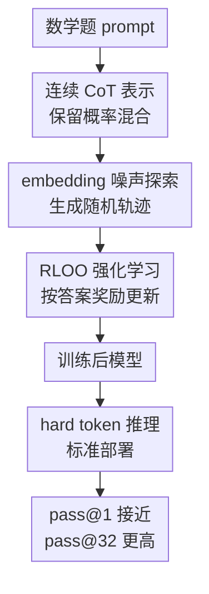

# Soft Tokens, Hard Truths

**会议**: ICLR2026  
**OpenReview**: [https://openreview.net/forum?id=9JjKTp8Jmy](https://openreview.net/forum?id=9JjKTp8Jmy)  
**代码**: 待确认  
**领域**: LLM推理  
**关键词**: 连续链式思维, soft tokens, fuzzy tokens, 强化学习微调, 推理多样性

## 一句话总结
这篇论文提出一种不用离散 CoT 标注、只在连续 CoT embedding 上加噪声就能用 RL 训练的 soft/fuzzy token 方法，在数学推理上保持 pass@1 接近离散 CoT，同时显著改善 pass@32 多样性和域外能力保持。

## 研究背景与动机
**领域现状**：LLM 的推理增强通常依赖 Chain-of-Thought，让模型先生成一段中间推理 token，再给出最终答案。传统 CoT 的中间步骤都是离散 token：每一步从词表中采样一个 token，接着把它的 embedding 喂回 transformer。这种做法和现有语言模型训练范式天然兼容，也方便用 RLHF、RLOO、GRPO 等强化学习式后训练方法优化最终答案正确率。

**现有痛点**：离散 CoT 的问题在于每一步只能落到一个 token 上，推理轨迹会被迫沿着单一路径展开。连续 CoT 或 soft thinking 的直觉是，如果中间状态保留完整概率分布或连续向量，就可能同时携带多个候选推理方向，像一种“推理叠加态”一样并行探索。但此前连续 CoT 的实际训练很难：有的方法只在推理时把预训练离散模型改成 soft 输入，并没有真正训练模型适应连续推理；有的方法需要从人工或模型生成的离散 CoT 中蒸馏；还有 Coconut 这类方法要穿过整段连续 CoT 做反向传播，显存和计算限制使 CoT 长度只能做到很短。

**核心矛盾**：连续 token 的理论表达力很强，但如果没有随机性，连续 CoT 轨迹对给定 prompt 几乎是确定的，无法直接套用基于采样轨迹的 REINFORCE/RLOO。反过来，离散 token 天然有采样噪声，因此可训练、可探索，却可能在微调中变得过度自信，牺牲推理多样性和域外行为。

**本文目标**：作者想解决三个具体问题：第一，怎样让连续 CoT 可以像离散 CoT 一样用强化学习训练；第二，这个方法能否扩展到数百个 CoT token，而不是只能做 4 到 6 步 toy 推理；第三，连续 CoT 训练到底应该在训练和推理阶段怎样搭配，是否真的比离散 CoT 带来可观收益。

**切入角度**：论文的关键观察很直接：RL 训练并不一定需要离散 token 本身，它需要的是可计算的轨迹概率和足够的探索噪声。于是作者不再尝试对整段连续 CoT 做 BPTT，也不要求参考 CoT，而是在 soft token 的输入 embedding 上加入高斯噪声，把连续 CoT 变成一条随机轨迹。这样既保留了连续混合 embedding 的表达空间，又能把每一步噪声的 log probability 写出来，用 REINFORCE 类方法优化最终答案奖励。

**核心 idea**：用“概率分布加权的连续 token embedding + embedding 噪声”替代离散 CoT 采样，使连续推理轨迹获得 RL 所需的探索性，并在训练后仍可用标准离散 token 推理部署。

## 方法详解

### 整体框架
这篇论文的方法可以看成对 CoT 阶段的 token 生成方式做了一次局部替换：普通 prompt 和最终答案仍按语言模型的常规方式处理，只有中间推理 token 不再必须采样成 one-hot 离散 token。训练时，模型先把下一 token 分布转成 embedding 混合，再加入高斯噪声形成连续 CoT 状态；最终答案被正常解码并用数学 verifier 打分；RLOO 根据奖励更新模型，使它学会利用带噪连续轨迹做更丰富的推理探索。推理时作者系统比较 hard、soft、fuzzy 六种设置，最后发现最实用的组合反而是“soft/fuzzy 训练 + hard token 推理”。

方法里有两个容易混淆的概念。soft tokens 指用温度 $\tau=0.5$ 的完整 next-token 概率分布做 embedding 加权平均，再加噪声；fuzzy tokens 指把 CoT 阶段温度设到非常低，比如 $\tau=0.0001$，未加噪时几乎退化成离散 token embedding，但仍在 embedding 上加高斯扰动。两者都属于连续 CoT 训练，只是连续程度不同：soft 更像真正的分布混合，fuzzy 更像离散 token 附近的局部连续扰动。

### 关键设计
**1. 概率混合 CoT：把一步离散选择改成连续 embedding 状态**

普通 hard token 生成在第 $t$ 步会从概率 $p_{t-1}$ 中采样一个 one-hot token $x_t$，再通过 embedding 矩阵 $E$ 得到输入 embedding。本文沿用 soft thinking 的基本思路：在 CoT 阶段不采样 one-hot，而是直接保留整个分布，把下一步输入写成 $h_t^0=p_{t-1}E$。这一步的意义是，模型不必过早承诺某个具体 token，而是可以把多个 token 的语义方向以加权形式合进同一个连续向量。

这个设计真正服务的是推理探索的表达空间。离散 CoT 的每一步都像在搜索树上选一条边，而 soft token 允许中间状态携带多条候选边的线性混合。论文没有声称这种混合天然就会提升所有任务，反而强调只在推理时把 hard 模型改成 soft 输入并不可靠；它的主张是，连续表示必须进入训练环节，让模型学会如何使用这种表示，而不是指望预训练模型自动理解分布混合的含义。

**2. embedding 噪声探索：让连续 CoT 从确定函数变成可用 RL 优化的随机轨迹**

只有 $h_t^0=p_{t-1}E$ 还不够，因为对给定 prompt 和模型参数来说，这条连续 CoT 是确定的，缺少 REINFORCE 所需的采样轨迹。作者在输入 embedding 上加入高斯噪声，得到 $\tilde{h}_t^0=p_{t-1}E+\sigma N(0,I_d)$。这个小改动让连续 CoT 每一步都成为随机变量，探索不再来自离散 token 抽样，而来自连续 embedding 空间中的扰动。

关键之处在于，这个噪声的 log probability 很容易计算。给定过去的 noisy soft tokens，模型可以算出未加噪的 $h_t^0$，而实际输入是 $\tilde{h}_t^0$，因此每步的轨迹 log probability 就是高斯密度：$\log \pi(\tilde{h}_t^0|\tilde{h}_{<t}^0)=-\frac{1}{2\sigma^2}\|\tilde{h}_t^0-h_t^0\|^2+\text{cst}$。这样连续 CoT 的轨迹概率可微、可累加，也就能接入 RLOO、GRPO、PPO 这类 REINFORCE 派生算法。相比对整段 CoT 做 BPTT，它只需要保存每步概率向量和加噪 embedding，额外计算开销很小。

**3. soft/fuzzy 训练与 hard 推理解耦：训练时扩展探索，部署时回到标准解码**

论文不是简单地提出一种新的推理模式，而是把训练方法和推理方法完全交叉评估。训练有 hard、soft、fuzzy 三种，测试又有 hard greedy、hard sample、soft greedy、soft sample、fuzzy greedy、fuzzy sample 六种。这个设计回答了一个很实际的问题：如果 soft token 训练只能在 soft token 推理下有效，那部署成本和系统兼容性都会变差；如果训练后的模型可以用普通 hard token 推理，那它就能无缝接入现有推理栈。

实验结论很有意思：最强的平均组合通常不是 hard 训练后 soft 推理，也不是 soft 训练后继续 soft 推理，而是 soft/fuzzy 训练后用 hard token 推理。也就是说，连续 CoT 更像一种训练时的“温和探索机制”，它帮助模型在后训练阶段保留更多推理路径和分布熵；到实际推理时，模型已经把这种训练收益吸收到参数里，可以用标准离散 token 输出。这也解释了标题里的 “Soft Tokens, Hard Truths”：soft token 的价值并不必然体现在 soft 推理本身，而体现在它揭示了 hard CoT 微调可能损失多样性和泛化能力。

**4. 只按最终答案给奖励：避免依赖参考 CoT，同时暴露多样性收益**

作者训练时不需要 ground-truth CoT，只用数学题最终答案是否正确来给 reward。每个 mini-batch 包含 $B=2$ 个 prompt，每个 prompt 采样 $G=32$ 条包含 CoT 和最终答案的序列；奖励由 Math Verify 判断，答案完全正确给 100，能抽取 boxed 答案但不正确给 10，否则给 0。RLOO 对同一个 prompt 的 32 条样本做 leave-one-out baseline，用某条样本的奖励减去其余样本平均奖励作为 advantage。

这种训练方式故意不约束中间推理文本是否像人类 CoT，也不蒸馏参考路径。好处是可扩展、监督成本低，并且能让连续 CoT 自己寻找有用的内部轨迹；风险是 outcome-only RL 容易把模型推向能拿分但分布更窄的区域。论文通过 pass@32、域外 NLL 和 entropy 曲线证明，soft/fuzzy 训练相对 hard 训练更不容易把模型压成过度自信的单一路径，因此它的收益主要体现在采样多样性和域外行为保持，而不仅是 pass@1 的小幅变化。

### 一个完整示例
以一道 GSM8K 数学题为例，hard CoT 训练会在每一步采样实际 token，例如先生成“First”，再生成“we”，接着沿着某条自然语言推理路径展开。如果这条路径前几步已经偏向某种解法，后续 token 往往会被历史上下文锁住，强化学习又只根据最终答案奖励，容易让高奖励路径越来越集中。

soft 训练下，第一个 CoT 状态不是一个 token，而是 $p_0E$：它可能同时混有“First”“Let”“We”等多个合理起始方向的 embedding。模型随后加入规模约为 token embedding RMS norm 的 $0.33$ 倍的高斯噪声，得到 $\tilde{h}_1^0$，再继续生成下一步连续状态。对同一道题采样 32 条轨迹时，这些噪声会把 CoT 推向不同但相近的推理流形；如果某些轨迹最终答案正确，RLOO 会提升其相对 log probability。训练结束后，部署时仍可用 hard greedy 或 hard sample 生成普通文本 CoT，但模型参数已经从训练阶段的连续探索中获益。

### 损失函数 / 训练策略
理论上，给定 prompt 后，模型采样一条 noisy continuous CoT $\tilde{h}$，再采样最终答案 $a$，目标是最大化期望奖励 $E_{(\tilde{h},a)\sim\pi}[R(a)]$。REINFORCE 把它写成最小化带奖励的负 log probability：

$$
E_{(\tilde{h},a)\sim\pi_{sg}}\left[-R(a)(\log \pi(\tilde{h}^0)+\log \pi(a|\tilde{h}^0))\right].
$$

其中 $\log \pi(a|\tilde{h}^0)$ 是最终答案 token 的常规语言模型 log probability，$\log \pi(\tilde{h}^0)$ 则由每一步高斯噪声密度相加得到。实际实验使用 RLOO：对同一个 prompt 的 $G=32$ 条样本，用 leave-one-out 平均奖励作为 baseline，advantage 为 $A_{b,g}=r_{b,g}-\bar{r}_{b}^{(-g)}$，再乘以整条序列 log probability 更新。

训练配置上，作者在 Llama 3.2 3B Instruct、Llama 3.1 8B Instruct 和 Qwen 2.5 3B Instruct 上做实验，训练数据包括 GSM8K、MATH 和 DeepScaleR。GSM8K 训练时最多采样 128 个 CoT token，MATH 和 DeepScaleR 最多 512 个 CoT token；每个模型训练 4000 步，用 greedy validation 选择 checkpoint。soft 训练 CoT 温度为 $\tau=0.5$，fuzzy 训练为 $\tau=0.0001$，噪声尺度默认设为 $0.33$ 倍 token embedding RMS norm。

## 实验关键数据

### 主实验
作者最重要的结论来自 hard inference 下的 pass@1/pass@32：soft/fuzzy 训练在单次 greedy 或 sample pass@1 上大体接近 hard 训练，但在 pass@32 上更常胜出。下表摘取论文 Table 1 中几个最能说明趋势的设置。

| 模型 / 训练集 | 测试集 | 训练方式 | Greedy pass@1 | Sample pass@32 | 主要观察 |
|--------|------|----------|------|------|------|
| Llama 3B / GSM8K | GSM8K | hard | 75.9±1.3 | 94.1±0.3 | pass@1 可用，但采样上限较低 |
| Llama 3B / GSM8K | GSM8K | fuzzy | 76.7±1.8 | 97.4±0.3 | pass@1 接近，pass@32 更高 |
| Llama 3B / GSM8K | GSM8K | soft | 77.2±0.9 | 97.9±0.3 | 同组 pass@32 最好 |
| Llama 8B / GSM8K | MATH-500 | hard | 20.2±0.8 | 45.4±3.2 | 域外数学性能明显崩塌 |
| Llama 8B / GSM8K | MATH-500 | fuzzy | 44.6±2.1 | 83.1±0.9 | 接近 base 水平且保留多样性 |
| Llama 8B / GSM8K | MATH-500 | soft | 44.7±2.3 | 83.9±1.1 | 域外恢复最明显 |
| Qwen 3B / MATH | MATH-500 | hard | 59.0±1.7 | 83.6±1.0 | pass@1 最强 |
| Qwen 3B / MATH | MATH-500 | fuzzy | 58.1±0.9 | 84.4±0.2 | pass@32 略高 |
| Qwen 3B / MATH | MATH-500 | soft | 54.7±0.3 | 84.4±0.7 | pass@1 略降，pass@32 保持优势 |

这个表最值得看的不是某一个数字，而是两个模式。第一，continuous CoT 训练并没有显著牺牲 pass@1，说明它不是“更花哨但更难优化”的 toy 方法。第二，pass@32 的提升说明 soft/fuzzy 训练保留了更多可采样的正确轨迹，尤其在 Llama 上非常明显。Llama 8B 用 GSM8K hard 训练后在 MATH-500 上掉到 20.2% greedy，而 soft/fuzzy 训练保持在 44% 左右，这是论文中最有说服力的域外泛化案例。

### 消融实验
| 配置 | 关键指标 | 说明 |
|------|---------|------|
| fuzzy embedding 噪声，$\gamma=0.33$ | GSM8K hard greedy 76.7±1.8，hard sample pass@32 97.4±0.3 | 默认设置，稳定学习且 pass@32 高 |
| fuzzy embedding 噪声，$\gamma=1.0$ | GSM8K hard greedy 78.1±0.2，hard sample pass@32 97.7±0.2 | 小于等于 1 的噪声尺度整体鲁棒 |
| fuzzy embedding 噪声，$\gamma=3.0$ | GSM8K hard greedy 65.4±1.9 | 噪声过大导致学习明显崩塌 |
| soft/fuzzy final hidden 噪声 | hard greedy 约 66-68 | 在最终 hidden 层加噪不如 embedding 加噪 |
| soft/fuzzy logits 噪声 | hard greedy 约 60-67 | 直接在完整 logits 上加噪信噪比差，学习不稳定 |
| soft logits top-k=5 噪声 | hard greedy 72.8±0.1 | 限制到 top-k logits 后略有学习迹象，但仍不如 embedding 噪声主方法 |
| fuzzy 温度 $\tau\in[0.0001,0.1]$ | hard sample pass@32 约 97.3-97.8 | fuzzy 训练对低温范围较鲁棒 |

消融说明本文方法的关键不是“随便加点噪声”就行，而是噪声位置和尺度很重要。embedding 层的噪声既直接作用在 transformer 输入上，又维度适中、概率密度容易建模，因此最适合做连续轨迹探索。logits 层维度等于词表大小，噪声空间太大，除非只对 top-k logits 加噪，否则很难学习。

### 关键发现
- soft/fuzzy 训练的最大收益主要体现在 pass@k 而不是 pass@1。greedy pass@1 多数情况下与 hard 训练接近，说明主方法没有明显牺牲单次解题能力；sample pass@32 更高，说明推理轨迹多样性保留得更好。
- hard inference 通常优于 soft/fuzzy inference。论文没有复现“hard 模型推理时换成 soft thinking 就能显著变好”的早期说法，反而发现训练时用 continuous CoT、测试时用普通 hard token 更实用。
- 域外鲁棒性是亮点。HellaSwag、ARC、MMLU 上的 accuracy 三种训练差不多，但 hard training 往往提高正确答案 NLL，soft/fuzzy training 更接近 base model，说明它对原模型能力的扰动更温和。
- entropy 分析支持“hard training 变过度自信”的解释。Llama base model 在 hard sample CoT 下熵会随步数升高，而 hard training 后熵曲线明显变低；soft/fuzzy training 更接近 base entropy profile，与更高 pass@32 和更好域外 NLL 相一致。

## 亮点与洞察
- 这篇论文最巧妙的地方，是把 continuous CoT 的训练难点转化成一个噪声建模问题。只要在 embedding 上加高斯噪声，就能为连续轨迹写出 log probability，于是 RL 不再要求中间推理必须是离散 token。
- 它对 soft token 的定位很克制。作者没有把 soft inference 包装成万能推理增强，而是通过交叉实验指出：soft token 最可靠的作用可能在训练时提供更柔和、更丰富的探索，推理时仍回到 hard token。
- pass@32 的提升比 pass@1 更有解释力。对于数学推理，单次答案正确率容易被 checkpoint、prompt 和采样温度影响；pass@k 更直接反映模型是否保留多条可能成功的推理路径。
- 论文把域外 NLL 和 entropy 曲线放进分析，是一个很好的诊断范式。很多 RL 微调论文只看任务分数上涨，却忽略模型分布是否被压窄；本文用 NLL 和 CoT entropy 展示 soft/fuzzy 训练的“软触碰”特性，这一点很可迁移。
- 对实际系统来说，soft/fuzzy 训练 + hard 推理的组合很有吸引力。训练阶段可以稍微改 generation 逻辑，但部署阶段不要求服务端支持连续 token 输入或自定义 decoding，这降低了工程采用门槛。

## 局限与展望
- 实验主要集中在数学推理，尚不清楚这种连续 CoT RL 训练能否迁移到代码生成、复杂规划、多轮 agent 或开放式问答。数学 verifier 给了清晰的 outcome reward，其他任务的 reward 噪声会更大。
- 方法虽然声称计算开销很小，但实验仍需要 8×H100/H200 节点、每个 run 48 到 96 小时。对普通研究者来说，复现实验成本不低。
- continuous CoT 的内部可解释性仍然有限。soft/fuzzy token 训练后可以用 hard token 推理，但训练过程中连续轨迹到底学到了哪些“非语言”推理结构，论文主要通过性能、熵和 NLL 间接说明。
- 论文没有充分回答长程复杂推理中的扩展规律。它能做到 512 个 CoT token 已比 Coconut 的 6 步强很多，但更长上下文、更大模型、更难任务下噪声尺度和温度是否还稳，需要继续验证。
- outcome-only RL 的奖励仍然可能诱导不忠实 CoT。虽然 soft/fuzzy 训练保留了多样性，但最终推理文本是否更 faithful、是否更容易被 verifier hack，论文没有专门评估。

## 相关工作与启发
- **vs Soft Thinking**: Soft Thinking 主要在推理时把 next-token 分布转成连续概念 token，期待模型在连续空间里隐式并行推理；本文认为未经训练的 hard-token LLM 未必会正确使用 soft 输入，因此把 soft token 放到 RL 后训练中，并加入噪声解决探索问题。
- **vs Coconut**: Coconut 也尝试连续 latent reasoning，但依赖 ground-truth CoT 蒸馏和穿过连续步骤的反向传播，CoT 长度受计算限制很大；本文只用最终答案 reward，通过 noisy embedding 的轨迹概率做 RL，可以扩展到数百步 CoT。
- **vs Codi / continuous CoT distillation**: Codi 保持连续模型的输出和内部活动接近原离散 CoT 模型，本质上仍在蒸馏参考轨迹；本文不要求参考 CoT，更适合只有答案标签或 verifier 的数学任务。
- **vs Reasoning by Superposition**: Reasoning by Superposition 给出连续 CoT 比离散 CoT 更高效的理论证据；本文更偏实践，把这种理论直觉落到可训练的 LLM 后训练算法上，并发现收益主要表现为推理多样性和域外保持。
- **vs 普通 hard-token RL 微调**: hard-token RL 直接优化离散 CoT 和答案，工程简单但可能降低熵、损失域外 NLL；本文用 continuous noise 让训练更像在邻域中探索，而不是快速压向少数高奖励离散轨迹。

## 评分
- 新颖性: ⭐⭐⭐⭐⭐ 第一个较系统地把连续 CoT 与无需参考 CoT 的 RL 后训练结合起来，核心思路简单但击中了训练瓶颈。
- 实验充分度: ⭐⭐⭐⭐ 覆盖多模型、多数学数据集、域外任务、推理方式交叉和多项消融，但任务类型仍集中在数学推理。
- 写作质量: ⭐⭐⭐⭐ 论文结构清楚，理论推导和实验结论能对上；部分表格信息量很大，需要读者自己提炼主线。
- 价值: ⭐⭐⭐⭐⭐ 对 LLM 推理训练很有启发，尤其是“训练时 continuous、推理时 hard”的结论，兼具理论意义和工程可用性。

<!-- RELATED:START -->

## 相关论文

- [\[ICLR 2026\] Learning to Reason over Continuous Tokens with Reinforcement Learning (HyRea)](learning_to_reason_over_continuous_tokens_with_reinforcement_learning.md)
- [\[ICLR 2026\] Analytica: Soft Propositional Reasoning for Robust and Scalable LLM-Driven Analysis](analytica_soft_propositional_reasoning_for_robust_and_scalable_llm-driven_analys.md)
- [\[ICLR 2026\] Curriculum Reinforcement Learning from Easy to Hard Tasks Improves LLM Reasoning](curriculum_reinforcement_learning_from_easy_to_hard_tasks_improves_llm_reasoning.md)
- [\[ICLR 2026\] Sample Smart, Not Hard: Correctness-First Decoding for Better Reasoning in LLMs](sample_smart_not_hard_correctness-first_decoding_for_better_reasoning_in_llms.md)
- [\[ICML 2026\] Reasoning Can Be Restored by Correcting a Few Decision Tokens](../../ICML2026/llm_reasoning/reasoning_can_be_restored_by_correcting_a_few_decision_tokens.md)

<!-- RELATED:END -->
