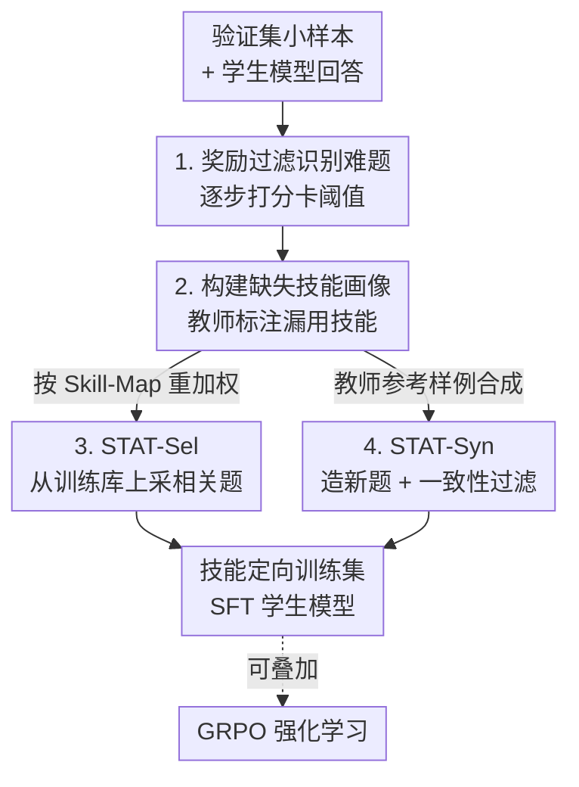

# STAT: Skill-Targeted Adaptive Training

**会议**: ICLR 2026  
**OpenReview**: [https://openreview.net/forum?id=m3jG3GaNIj](https://openreview.net/forum?id=m3jG3GaNIj)  
**代码**: https://github.com/princeton-pli/STAT  
**领域**: LLM推理 / 数据选择 / 监督微调  
**关键词**: 技能定向训练, 缺失技能画像, SFT 饱和, 元认知教师, 数学推理

## 一句话总结
用一个更强的 LLM 当"老师"，先诊断学生模型在数学题上**到底缺哪些技能**，再据此重加权或合成训练数据做 SFT，让在 MATH 上已经"练饱和"的小模型继续涨点（MATH 最高 +7.5%、OOD 平均 +4.6%），而且和后续 GRPO 强化学习互补叠加。

## 研究背景与动机
**领域现状**：把语言模型在某个领域数据集（如 MATH）上做监督微调（SFT）是提升专项能力的标准手段。常见做法是直接在固定训练集上多训几个 epoch，或者用 embedding / 梯度相似度从训练集里挑出"与验证集失败样例最相近"的子集来训。

**现有痛点**：对已经经过大量后训练的指令模型（如 Llama-instruct），在 MATH 这种它见过的数据上继续 SFT 几乎不涨点——这就是**饱和（saturation）**。论文实验里，MATH-Train 和 MATH-Augment 这类朴素 SFT 相比基座最多只提升 1–2%，Qwen2.5-3B 甚至会掉点。更糟的是，基于 embedding 相似度的数据选择（Embed-Sel/Syn）在这些饱和模型上同样收效甚微。

**核心矛盾**：饱和的根源在于 SFT 用的是**所有样本上的平均 next-token 损失**——当模型已经会做绝大多数题时，平均损失提供的训练信号被稀释殆尽；而且"平均损失"和真正自回归生成时犯的错之间存在错配，验证集 loss 只是模型实际生成错误的一个粗糙代理。embedding 相似度只衡量"题面像不像"，并没有触及模型究竟在**哪一步推理能力上欠缺**。

**本文目标**：不去笼统地降低平均 loss，而是像老师因材施教一样，精准定位学生模型缺失的**底层技能（skill）**，把训练信号集中到这些技能对应的题目上。

**切入角度**：借助前沿 LLM 的**元认知（meta-cognition）**能力——强模型不仅会做题，还能分析一道题需要哪些技能、以及学生的答案里漏用了哪些技能。于是强模型可以充当"教师"，主动监控学生在单个技能上的掌握度并据此调配训练样本。

**核心 idea**：让教师为学生构建一份**缺失技能画像（Missing-Skill-Profile）**，再用它来"选数据"（STAT-Sel 重加权已有题）或"造数据"（STAT-Syn 合成新题），实现技能定向的自适应训练。

## 方法详解

### 整体框架
STAT 把"诊断—配药—开方"做成一条三阶段流水线，全程由一个前沿教师 LLM（实验默认 GPT-4o-mini）驱动。给定一批测试题 $Q$（切成验证集 $Q_{val}$ 和评测集 $Q_{test}$）和一份模型曾经训练过的训练题库 $P$（如 MATH 训练集），目标是构造一个技能定向的训练集 $P_{targeted}$ 让学生继续 SFT。

整条管线先用现成的技能体系做底座：沿用 Didolkar et al. (2024) 的方法，从大模型枚举出解题所需的技能集合 $S$，并建立 **Skill-Map** $S \to P$（每个技能映射到训练库里需要该技能的题目）。然后三个阶段依次执行：① 在验证集上用奖励模型筛出学生答错/答得差的**难题**；② 教师逐题分析学生的错误回答，标注它漏用了哪些技能，汇总成 **Missing-Skill-Profile**；③ 根据这份画像，要么从 $P$ 里按缺失技能**重加权采样**（STAT-Sel），要么让教师**合成**针对缺失技能的新题（STAT-Syn），得到 $P_{targeted}$ 后做 SFT。

### 关键设计

**1. 奖励过滤识别难题：不依赖标准答案地圈出学生的薄弱题**

要"对症"先得知道学生在哪些题上栽了跟头。最直接的办法是看哪些题答错，但这需要标准答案，限制了通用性。STAT 改用**奖励模型**给学生的逐步推理打分来判定难易。假设一道题 $q$ 的回答由 $t$ 步组成，奖励模型对每步给出分数 $\{r_{q,1}, \dots, r_{q,t}\}$，然后用两个阈值 $\tau_1, \tau_2$ 做过滤：

$$R(q)=0 \iff r_{q,t}\le\tau_1 \;\text{或}\; \tfrac{1}{t}\sum_{i=1}^{t} r_{q,i}\le\tau_1 \;\text{或}\; \exists\, i<t,\; r_{q,i}\le\tau_2$$

即只要**最后一步得分低、全程平均分低、或中间任意一步得分过低**，就把该题判为难题（$R(q)=0$）。难题集合 $Q_{difficult}$ 再按验证/测试切分成 $Q^{val}_{difficult}$（用于后续标技能）和 $Q^{test}_{difficult}$（用于 MATHD 评测）。这样既避开了对 ground-truth 的依赖，又能定位到"哪一步崩了"，比单纯看对错信息更细。

**2. 缺失技能画像：把"答错"翻译成"缺哪几项可操作的技能"**

知道学生在哪些题上薄弱还不够，得知道**为什么**薄弱。STAT 对每道难题 $q \in Q^{val}_{difficult}$，让教师 LLM 去检查学生的回答里漏用了技能集 $S$ 中的哪些技能，得到映射 $\text{Missing-Skill-Profile}: Q^{val}_{difficult} \to S$。这一步是整套方法的诊断核心：它把模糊的"这题不会做"转化成一张可统计、可操作的缺失技能频率表（如"解方程缺失 800 次、复数运算缺失 400 次"）。论文的技能级分析发现一个反直觉现象——即便模型在 MATH 上被反复训练过，它最常缺失的反而是**基础代数、基本算术运算**这类底层技能，而 embedding 方法和朴素 SFT 强调的技能与学生真正缺失的 Top-10 技能对不上，这正解释了它们为何无效。

**3. STAT-Sel：按缺失技能从已有训练库里重加权采样**

有了缺失技能画像，最省钱的用法是不造新题、只调整旧题的权重。对每道难题 $q$，遍历它的 $\text{Missing-Skill-Profile}(q)$，对其中每个缺失技能，借助 Skill-Map 从训练库 $P$ 里采样多道需要该技能的题目。于是一个技能被采到的频率，正比于它在缺失技能画像里出现的次数——学生越缺的技能，对应训练题在 $P_{targeted}$ 里被采得越多。这相当于把训练分布**朝学生的短板倾斜**，让平均损失重新对准它真正没掌握的技能，而不是在已经会做的题上空转。

**4. STAT-Syn：针对缺失技能让教师合成新题**

当已有题库不足以覆盖某些缺失技能、或想要更强的针对性时，STAT-Syn 让教师直接造题。对每道难题 $q$，针对画像里的每个缺失技能，先用 Skill-Map 随机采 3 道相关题作为 in-context 参考，再让教师**仿照这些样例生成新的题目和解答**。为保证合成质量，加了一道**一致性过滤**：只有当教师对同一道题的多次回答中至少 2 次答案一致时，才保留这条 QA 对。STAT-Syn 比 STAT-Sel 更贵，但在难题（MATHD、AIME）上收益更大，因为它能造出训练库里原本稀缺的、专攻薄弱技能的样本。

### 损失函数 / 训练策略
得到 $P_{targeted}$ 后用标准 SFT 目标微调学生（3 个 epoch，学习率按各方法在 MATH 上的准确率单独调）。为公平对比，所有方法（含基线）都从 MATH 数据选/合成，且都控制在约 4k 不重复题 / 9.5k QA 对的同等规模。STAT 与 GRPO 互补：先用 STAT 做 SFT 补技能缺口，再在同一 MATH 训练集上接 GRPO，可继续叠加收益。

## 实验关键数据

### 主实验
在 Llama-3.2-3B-Instruct 上，STAT 大幅超越各类朴素 SFT 和 embedding 数据选择基线（数学多基准平均分）：

| 方法 | MATH | MATHD | AMC23 | AIME24 | 平均 |
|------|------|-------|-------|--------|------|
| 基座 | 44.0 | 18.2 | 33.7 | 33.3 | 30.5 |
| MATH-Augment（朴素 SFT） | 45.2 | 23.9 | 35.1 | 30.0 | 31.7 |
| Embed-Sel | 46.0 | 26.5 | 36.2 | 36.7 | 32.8 |
| Embed-Syn | 48.8 | 27.3 | 36.9 | 26.7 | 33.0 |
| **STAT-Sel** | **51.5** | 26.6 | **39.8** | **43.3** | 36.5 |
| **STAT-Syn** | 50.2 | **31.7** | 39.1 | 40.0 | **37.2** |

STAT 把 MATH 提升最高 +7.5%（51.5 vs 44.0），平均分较基座最高 +6.7%（Llama-3B）、+5.2%（Qwen2.5-3B）、+3.4%（Llama-1B），且在 7 个 OOD 基准上一致提升（STAT-Sel/Syn 的 OOD 平均提升 5.3%/5.8%）。

### 与 GRPO 互补
STAT 做完 SFT 再接 GRPO，收益继续叠加而非冲突：

| 方法（+GRPO） | 平均 |
|------|------|
| 基座 + GRPO | 31.8 |
| MATH-Augment + GRPO | 37.9 |
| **STAT-Sel + GRPO** | 48.0 |
| **STAT-Syn + GRPO** | **48.4** |

值得注意的是，在 Llama 系列上 GRPO 单独训练几乎无效（≤2.4%），而 STAT 仅靠 SFT 就已超过纯 GRPO，叠加 GRPO 后再涨约 4%。

### 关键发现
- **缺失技能与基线选的技能严重错配**：Figure 2 显示朴素 SFT 和 Embed-Sel 强调的 Top-10 技能与学生实际缺失的 Top-10 技能对不上，这是它们无效的直接原因；STAT 之所以有效，是因为它精准命中了"基础代数、基本算术"这类被忽视的底层短板。
- **STAT-Syn 更擅长啃硬骨头**：在 MATHD、AIME 这类难题上，合成新题的 STAT-Syn 普遍优于只重加权的 STAT-Sel。
- **持续适应新难度**：用同一份 MATH 训练题、仅把缺失技能画像换成 MATH-perturb-hard 上的画像继续训练（STAT-ConSel/ConSyn），可在该更难基准上再涨 3–4%（17.2/17.6 vs STAT 的 13.3/14.7），说明技能定向可随评测难度演进而持续校准。

## 亮点与洞察
- **把"数据选择"的锚点从 loss/embedding 换成"技能缺口"**：以往方法都绑在验证集 loss 或题面相似度这种粗代理上，STAT 直接用教师元认知诊断学生缺哪项可操作技能，命中了平均损失看不见的生成错误，这是它能突破饱和的根本原因。
- **诊断—选数据/造数据解耦且复用**：缺失技能画像一旦建好，既能驱动便宜的 Sel（重加权），也能驱动贵但更强的 Syn（合成），还能换个评测基准重建画像做持续学习，模块化程度高、迁移性强。
- **与 RL 正交叠加**：STAT 补的是 SFT 阶段的技能缺口，GRPO 优化的是策略，二者互补而非替代——这一点对今天"SFT→RL"的主流训练管线很有现实价值，几乎可即插即用。
- **可迁移思路**：用"强模型诊断弱模型缺失的细粒度能力，再定向配数据"的范式不限于数学——代码、逻辑推理等可分解为技能的任务都能套用同一套诊断-配药框架。

## 局限与展望
- **依赖技能体系与教师质量**：方法建立在 Didolkar et al. (2024) 的技能集 $S$ 和 Skill-Map 之上，技能枚举是否完备、教师 LLM 标注缺失技能是否准确，会直接影响画像质量；技能难以精确定义本身也是隐患。
- **主要在数学、小模型上验证**：实验集中在 MATH 和 1B–3B 小模型，"技能可枚举"在数学上较自然，迁移到开放域、大模型上的有效性还需进一步检验。
- **STAT-Syn 成本较高**：合成新题需多次调用教师并做一致性过滤，开销明显大于 STAT-Sel；论文也坦承 Syn 是"更贵"的方案。
- **奖励模型与阈值敏感性**：难题识别依赖奖励模型和 $\tau_1,\tau_2$ 阈值，虽有消融讨论其鲁棒性，但阈值选择仍是需要调的超参。

## 相关工作与启发
- **vs embedding/梯度数据选择（Embed-Sel/Syn, LESS 等）**：它们按题面相似度或对验证 loss 的影响挑数据，锚在 loss 代理上；STAT 锚在"模型缺哪项技能"上，实验证明在饱和的指令模型上前者几乎无效、后者大幅领先。
- **vs 朴素 SFT / 难题筛选（MATH-Augment、MATH-Hard）**：单纯换更好的解答或只训 Level 4-5 难题都没解决"训练信号没对准短板"的问题，提升有限；STAT 通过技能画像把信号重新对准。
- **vs 纯 GRPO 等 RL 方法**：RL 直接优化生成策略，但在弱基座上可能起不来；STAT 先补技能缺口再接 RL，二者叠加效果最好，说明数据侧的技能定向与策略侧的 RL 是互补的两条腿。

## 评分
- 新颖性: ⭐⭐⭐⭐⭐ 把元认知诊断出的"缺失技能"作为数据选择/合成的锚点，跳出 loss/embedding 代理的窠臼
- 实验充分度: ⭐⭐⭐⭐ 覆盖 3 个小模型、9 个数学基准、SFT/GRPO 叠加与持续学习，但模型规模和领域偏窄
- 写作质量: ⭐⭐⭐⭐ 三阶段流程清晰，技能级分析有说服力
- 价值: ⭐⭐⭐⭐⭐ 即插即用地缓解 SFT 饱和、与 RL 互补，对当下训练管线有直接借鉴意义

<!-- RELATED:START -->

## 相关论文

- [\[ICLR 2026\] TRIM: Hybrid Inference via Targeted Stepwise Routing in Multi-Step Reasoning Tasks](trim_hybrid_inference_via_targeted_stepwise_routing_in_multi-step_reasoning_task.md)
- [\[ICLR 2026\] Temperature as a Meta-Policy: Adaptive Temperature in LLM Reinforcement Learning](temperature_as_a_meta-policy_adaptive_temperature_in_llm_reinforcement_learning.md)
- [\[ICLR 2026\] RLAD: Training LLMs to Discover Abstractions for Solving Reasoning Problems](rlad_training_llms_to_discover_abstractions_for_solving_reasoning_problems.md)
- [\[ICLR 2026\] Zero-Overhead Introspection for Adaptive Test-Time Compute](zero-overhead_introspection_for_adaptive_test-time_compute.md)
- [\[ICLR 2026\] Smarter Not Harder: Generative Process Evaluation with Intrinsic-Signal Driving and Ability-Adaptive Reward Shaping](smarter_not_harder_generative_process_evaluation_with_intrinsic-signal_driving_a.md)

<!-- RELATED:END -->
