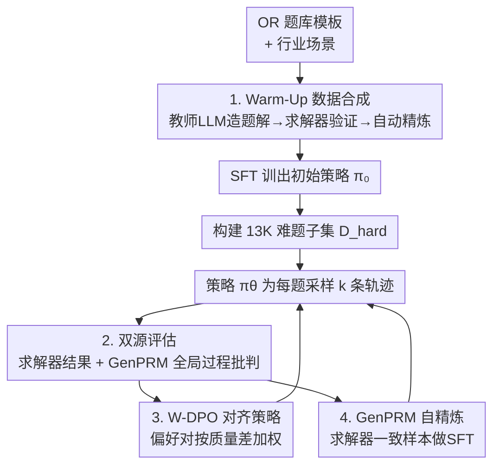

# StepORLM: A Self-Evolving Framework with Generative Process Supervision for Operations Research Language Models

**会议**: ICLR 2026  
**OpenReview**: [https://openreview.net/forum?id=ZrgxU8WMmG](https://openreview.net/forum?id=ZrgxU8WMmG)  
**代码**: https://github.com/0xzhouchenyu/StepORLM (有)  
**领域**: LLM推理  
**关键词**: 运筹优化, 生成式过程奖励, 自进化, W-DPO, 求解器验证

## 一句话总结
StepORLM 让一个 8B 策略模型和一个生成式过程奖励模型（GenPRM）在自进化循环里互相打磨：策略采样的每条建模轨迹同时接受"求解器结果验证"和"GenPRM 全局过程批判"两路反馈，再用加权 DPO 对齐策略、用 SFT 精炼 GenPRM，最终在六个运筹基准上以小模型刷出 SOTA，且 co-evolved 的 GenPRM 还能当通用推理时验证器。

## 研究背景与动机
**领域现状**：把大模型用到运筹优化（OR）——把自然语言问题翻译成数学规划并写出可执行求解代码——主要走两条路：搭多智能体 agentic 流水线，或对模型做专门的强化学习训练。RL 这一支又分两派：用最终答案对错给奖励（outcome reward），或给中间步骤打分（process supervision）。

**现有痛点**：两派在 OR 这种"长程、步骤强耦合"的任务上都露馅。outcome reward 有典型的**信用分配（credit assignment）问题**：一个最优的最终答案可能是从一条有错的推理路径里凑出来的，结果错误的中间步骤反被强化。而传统的**判别式（discriminative）逐步 PRM 又太短视**：它孤立地给每一步打分，但在 OR 里一个约束是否合法，往往取决于很多步之前的变量定义——早期那步对不对，要等后面约束写出来才看得出来，逐步打分因此给出不一致、不可靠的奖励。

**核心矛盾**：OR 建模的步骤之间是上下文相关、互相依赖的，可"逐步打分"的范式本质上是局部的、myopic 的，看不到整条轨迹的全局一致性；而纯结果奖励又完全没有中间监督。两者都不匹配 OR 的结构。

**本文目标**：设计一种既有结果层面"硬验证"、又有过程层面"全局评判"的训练范式，让策略模型学到**过程合理 + 结果正确**的双重能力。

**切入角度**：作者主张从"短视的逐步评估"转向"整体的、轨迹级的过程监督"——评判者应该回看完整推理路径、理解步骤间的依赖关系后再分配信用。这天然指向**生成式 PRM**：让奖励模型先对整条轨迹做链式推理、再生成一段整体批判，而不是吐一堆互不相干的局部分数。

**核心 idea**：用"策略模型 ↔ 生成式过程奖励模型（GenPRM）"的协同自进化循环，配合"求解器结果 + GenPRM 过程"双反馈和加权 DPO，把过程监督真正落到求解器可行性与数值最优性上。

## 方法详解

### 整体框架
StepORLM 是一个两阶段的自进化训练框架。**阶段一（Warm-Up）**先合成一批被求解器严格验证过的高质量 OR 题解，用 SFT 训出一个初始策略 $\pi_0$；**阶段二（协同进化）**在此基础上启动一个自进化循环：当前策略 $\pi_\theta$ 为每道难题采样 $k$ 条候选轨迹，每条轨迹同时接受外部求解器的"结果验证"和 GenPRM 的"过程评估"，这套双反馈一方面蒸馏成偏好对、用加权 DPO（W-DPO）对齐策略，另一方面筛出"求解器一致"的样本、用 SFT 继续精炼 GenPRM。策略越练越强、产出更优轨迹，GenPRM 也随之拿到更高质量的训练数据、变成更敏锐的批判者，两者互为奖励、循环上升。

### 关键设计

**1. Warm-Up 数据合成与初始策略：先用求解器把训练语料"洗干净"**

自进化要起步，得先有一个不太离谱的初始策略，否则采样出来全是垃圾轨迹、双反馈也无从谈起。作者搭了一条可扩展的数据合成流水线：以一大批 OR 题目模板和多样的行业场景为底料，先用强力教师模型（本文是 GPT-4o）把兼容的模板和场景配对、起草自然语言问题 $Q$，再通过改写、单位换算、参数缩放做数据增强，然后让教师模型像人类专家一样从问题分析一路写到可执行求解代码，生成完整的多步推理轨迹 $R$。关键在于**每条解都要过一道确定性验证**：执行代码、检查求解器状态、核对目标值；一旦报错就触发自动自精炼循环，反复让教师模型修正建模或代码，直到验证通过或耗尽重试预算；多解时取目标值最优的那条。最终得到一批验证过的 $(Q, R)$ 对，约 50K 条，用 SFT 训出 $\pi_0$。这一步保证了进化起点是"求解器认证"的，而非靠模型自说自话——消融里 w/o SFT 掉得最狠也印证了它的地基作用。

**2. 双源评估：把"结果硬验证"和"全局过程批判"两路信号合在一起**

这是全框架的灵魂，直接对治前面两个痛点。阶段二里策略不再用静态数据，而是每轮为难题子集 $D_{hard}$（从 50K 池里挑出那些 warm-up 策略 5 路多数投票都凑不齐一致正确答案的 13K 难题）动态采样 $k$ 条轨迹，每条轨迹走两路评估：一路是**结果验证**——执行最终代码，由外部求解器给出"成功/失败"的 ground-truth 标签，这是确定的、对治信用分配的硬信号；另一路是**过程评估**——GenPRM 对整条轨迹做评判，但它不是判别式地逐步打分，而是**先对 OR 解做链式推理、再生成一段事后的全局批判**，给出各步的正确性判断。正因为是"看完整条轨迹再回头评"，它能捕捉到逐步验证器漏掉的长程依赖（比如一个约束的合法性依赖很多步前的变量定义），从而避免奖励黑客（reward hacking）。两路信号互补：求解器管"结果对不对"，GenPRM 管"过程顺不顺"。

**3. W-DPO 策略对齐：把双反馈蒸成带质量权重的轨迹级偏好信号**

有了双反馈，怎么用来更新策略？作者先把评估结果蒸馏成偏好对 $(\tau_w, \tau_l, w)$，选择逻辑（Algorithm 1）**优先看求解器**：若一条轨迹结果正确、另一条不正确，正确者胜，权重固定为高值 $w=1.0$；若两条结果相同（同对或同错），则比 GenPRM 判定的"正确步骤比例"，高者胜，权重取两者过程质量分之差 $w=|r(\tau_{pos})-r(\tau_{neg})|$。再用加权 DPO 训练：

$$\mathcal{L}_{\text{W-DPO}}(\theta) = -\mathbb{E}_{(x,\tau_w,\tau_l)}\Big[\, w(\tau_w,\tau_l)\cdot \log\sigma\big(\beta(\log\pi_\theta(\tau_w\mid x) - \log\pi_\theta(\tau_l\mid x))\big)\Big]$$

其中权重 $w$ 量化了一对轨迹的质量差距。和不稳定的逐步 DPO 不同，这种标量加权的写法把细粒度的过程反馈**聚合成稳健的轨迹级信号**，让训练聚焦在信息量最大的偏好对上——消融里把 W-DPO 换成普通 DPO 平均掉 3.4 个点，说明这个加权确实有用。

**4. GenPRM 自精炼与协同进化：让批判者也跟着一起变强**

如果 GenPRM 一直冻结，它对越来越强的策略就会越来越不准。所以同一轮的轨迹评估数据也用来精炼 GenPRM：为保证监督质量，**只挑"求解器一致"的轨迹**——即 GenPRM 的判断与外部求解器结果吻合的高置信样本，把 GenPRM 自己生成的批判和逐步判断当作 SFT 目标，继续微调 $\rho_\theta$。这就形成正反馈：策略变强 → 产出更多样更准确的推理路径 → GenPRM 拿到更优训练数据 → GenPRM 评得更准 → 奖励信号更可靠 → 策略对齐更快。正是这种"策略与生成式 PRM 共同进化"让模型最终超越初始 SFT，也让 co-evolved GenPRM 学到了模型无关的"什么是合理 OR 推理"，可以当通用验证器去提升别的 OR 模型。

## 实验关键数据

### 主实验
8B 的 StepORLM 在六个公开 OR 基准（NL4Opt、MAMO-EasyLP/ComplexLP、NLP4LP、ComplexOR、IndustryOR、ReSocratic）上以 Pass@1 平均 **81.4%** 取得 SOTA，碾压远比它大的通用模型和 agentic 方法；再叠加 GenPRM 做推理时验证器（StepORLM+GenPRM）平均冲到 **85.6%**，在最难的 ComplexOR、IndustryOR 上相对基础版分别再涨 9.9% 和 9.5%。

| 模型 | 参数量 | 平均 Pass@1 |
|------|--------|------------|
| OpenAI o3 | Closed | 80.3 |
| Gemini-2.5-Pro | Closed | 78.9 |
| DeepSeek-V3 | 671B | 75.4 |
| Qwen2.5-72B-Instruct | 72B | 70.7 |
| ORLM（专用微调） | 8B | 65.0 |
| LLMOPT（专用微调） | 14B | 65.7 |
| OptiMUS-v0.3（agentic） | Closed | 67.1 |
| **StepORLM** | 8B | **81.4** |
| **StepORLM + GenPRM** | 8B+8B | **85.6** |

### 推理时缩放对比
把 GenPRM 当 Best-of-4 验证器，明显优于多数投票、求解器执行、判别式 PRM 等策略；尤其作用到另一个开源 ORLM 上时，平均直接提了 10 个点，证明它是模型无关的通用验证器。

| 验证策略（作用于 ORLM） | 平均 Pass@1 |
|------|------------|
| ORLM 基线 | 65.0 |
| + Major Vote | 65.9 |
| + Solver Exec | 69.9 |
| + Discriminative PRM | 70.2 |
| + GenPRM (final) | **75.0** |

### 消融实验

| 配置 | 平均 Pass@1 | 说明 |
|------|------------|------|
| StepORLM (Full) | 81.4 | 完整框架 |
| w/o SFT | 64.6 | 跳过 warm-up，掉 16.8，最致命 |
| w/o Self-evolution | 76.4 | 只做一轮 DPO 不迭代，掉 5.0 |
| w/o GenPRM Evolution | 77.7 | 冻结初始 GenPRM，掉 3.7 |
| w/o W-DPO | 78.0 | 换成普通 DPO，掉 3.4 |

### 关键发现
- **warm-up SFT 是地基**：去掉后掉 16.8 个点最多，证明强初始策略对后续自进化不可或缺（NLP4LP 单项 SFT 就带来 62.5% 的提升）。
- **协同进化的两个轮子都重要**：冻结 GenPRM（−3.7）和不迭代（−5.0）都明显掉点，说明策略和批判者必须一起进化。
- **数据质量 > 数据规模**：在 LLaMA-3-8B 上把语料都降采样到 3K，用本文 warm-up 子集训得 66.8%，而用 ORLM 的 OR-Instruct 只有 60.9%（+5.9），增益主要来自数据质量而非数量。
- **跨 backbone 可迁移**：把整套流水线搬到 LLaMA-3-8B，从 16.1% → warm-up 69.4% → 三轮自进化 82.2% → GenPRM 缩放 85.0%，在同一 backbone 上超过已发布的 ORLM（65.0%）17 个点以上。
- IndustryOR 上性能曲线非单调（先降后升），作者归因于测试集小且题难，早期迭代先修结构性建模错误、后期才转向修代码级 bug（如越界）。

## 亮点与洞察
- **生成式过程监督落到 OR 的"求解器可行性 + 数值最优"上**：这是本文最"啊哈"的点——把抽象的"过程合理"接到了求解器这个确定性裁判上，让过程奖励有了硬地基，避免了纯靠答案字符串监督的虚浮。
- **W-DPO 的标量加权很巧**：用"求解器分得开就给满权重、分不开就按过程质量差加权"把双反馈优雅地折叠进一个轨迹级标量，既稳定又聚焦信息量大的样本，规避了逐步 DPO 的不稳定。
- **co-evolved GenPRM 是"白拿"的通用验证器**：训练副产物竟能直接当推理时验证器去提升别的模型（ORLM +10 点），说明它学到的是模型无关的 OR 推理原则，这套"训练顺手产出一个通用 critic"的思路可迁移到其他可验证的领域（代码、数学证明）。

## 局限与展望
- 依赖一个强教师模型（GPT-4o）来 bootstrap 初始语料，教师的盲区可能传导到 warm-up 数据里。
- 整个范式高度依赖"外部求解器能给确定性结果"这一前提，迁到没有可靠自动验证器的任务（如开放式建模、含主观约束的决策）会失去硬信号。
- IndustryOR 上的非单调曲线提示自进化在小而难的分布上仍不够稳，作者用"先修结构、后修代码"解释但未给出系统性的稳定化手段。
- 难题子集 $D_{hard}$ 用"5 路投票不一致"来界定，这种难度筛选偏经验，可能漏掉一类"一致但都错"的隐蔽难题。

## 相关工作与启发
- **vs SIRL（结果驱动 RL）**: 它只用求解器最终判决给奖励，信号精确但有信用分配问题；本文在结果硬验证之外加了 GenPRM 的全局过程反馈，补上了中间监督。
- **vs 判别式逐步 PRM**: 它给每步独立打分、看不到长程依赖、易被奖励黑客；本文用生成式 PRM 先推理再回看整条轨迹做整体批判，捕捉步骤间依赖。
- **vs rStar-Math 等自进化框架 / GenPRM、R-PRM 等生成式 critic**: 这些大多靠"答案字符串监督"；StepORLM 把它们的思想适配到求解器化的 OR 域，提出双反馈 W-DPO，并显式让策略与验证器在数值可行性上协同进化。
- **vs Step-Opt 等并发数据合成工作**: 它们在"数据侧"用规则/符号检查器造可验证数据；StepORLM 在"模型侧"建策略与生成式 PRM 的协同循环，二者互补。

## 评分
- 新颖性: ⭐⭐⭐⭐⭐ 首次把生成式过程监督落到求解器化 OR 域，双反馈 W-DPO + 策略/验证器协同进化是干净且新的组合
- 实验充分度: ⭐⭐⭐⭐⭐ 六基准、三类强基线、推理缩放、消融、跨 backbone 与数据质量对照，覆盖很全
- 写作质量: ⭐⭐⭐⭐ 动机推导清晰、图示到位，部分核心定义（如 CorrectStepRatio）细节需翻附录
- 价值: ⭐⭐⭐⭐⭐ 8B 小模型刷 SOTA + 副产物 GenPRM 是通用验证器，开源权重，对 LLM-for-OR 社区实用价值高

<!-- RELATED:START -->

## 相关论文

- [\[ICLR 2026\] OR-PRM: A Process Reward Model for Algorithmic Problem in Operations Research](or-prm_a_process_reward_model_for_algorithmic_problem_in_operations_research.md)
- [\[ICLR 2026\] Smarter Not Harder: Generative Process Evaluation with Intrinsic-Signal Driving and Ability-Adaptive Reward Shaping](smarter_not_harder_generative_process_evaluation_with_intrinsic-signal_driving_a.md)
- [\[ICLR 2026\] Co-rewarding: Stable Self-supervised RL for Eliciting Reasoning in Large Language Models](co-rewarding_stable_self-supervised_rl_for_eliciting_reasoning_in_large_language.md)
- [\[ICLR 2026\] Once-More: Continuous Self-Correction for Large Language Models via Perplexity-Guided Intervention](once-more_continuous_self-correction_for_large_language_models_via_perplexity-gu.md)
- [\[ICLR 2026\] Generative Adversarial Reasoner: Enhancing LLM Reasoning with Adversarial Reinforcement Learning](generative_adversarial_reasoner_enhancing_llm_reasoning_with_adversarial_reinfor.md)

<!-- RELATED:END -->
