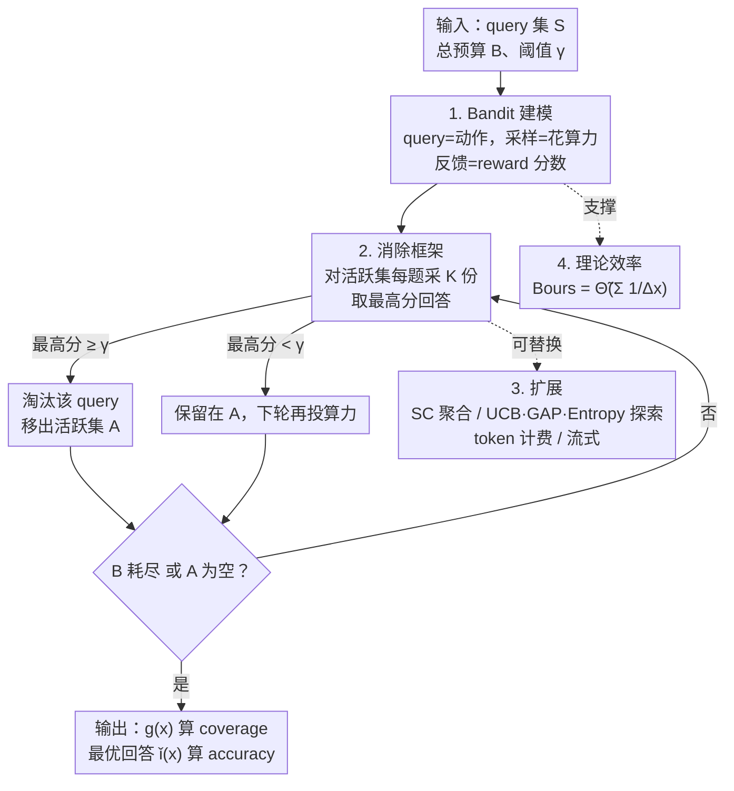

# Strategic Scaling of Test-Time Compute: A Bandit Learning Approach

**会议**: ICLR 2026  
**OpenReview**: [https://openreview.net/forum?id=0mNnINd2z5](https://openreview.net/forum?id=0mNnINd2z5)  
**代码**: 无  
**领域**: LLM推理  
**关键词**: 测试时计算, 自适应分配, Bandit学习, 纯探索, Best-of-N

## 一句话总结
把"给一批 query 分配测试时计算预算"建模成一个全自适应的纯探索式 bandit 问题，用"边采样边估难度 + 答对就淘汰"的消除算法，在固定预算下把算力优先投给最可能受益的难题，理论上证明比均匀分配高效得多，实测在 MATH-500 / AIME25 / LiveCodeBench 上最高提升约 11%。

## 研究背景与动机

**领域现状**：测试时计算（test-time compute）已经成为不重新训练就提升 LLM 表现的有效手段，典型做法是 Best-of-N 采样和自一致性（Self-Consistency）——对同一个 query 生成多份回答，再用 reward oracle（PRM / ORM / ground-truth 验证器）挑出最好的那份。OpenAI o1 报告里提到，对 AIME 题目重复采样 64 次能把准确率从 74.4% 拉到 83.3%，无需任何参数更新。

**现有痛点**：绝大多数测试时缩放方法都是**均匀分配**——给每道题分配相同的计算预算 $\bar{B}$。这是一刀切的浪费：简单的算术题和需要多步推理的难题拿到一样多的采样次数，结果是简单题上算力溢出、难题上预算不够。理想情况下应该"刚好够确信地答对简单题，把省下的预算重新投给难题"。

**核心矛盾**：要做自适应分配，就必须在**不预先知道每道题难度**的前提下，一边花算力一边估计难度并决定继续往哪投——这是一个典型的"探索 vs 利用"决策问题。已有的自适应工作要么只在**单个 query 内部**调度算力，要么依赖**两阶段**流程（先训一个辅助模型 / 预跑一轮估难度，再据此分配），后者本质上第一阶段仍是均匀分配，开销下不来。

**本文目标**：在固定总预算 $B$ 下，跨一批 query 自适应分配算力，最大化"被正确回答的 query 比例"。

**切入角度**：作者发现这件事和 bandit 的**纯探索（pure exploration）**问题天然同构——把每个 query 看成一个"动作（arm）"，对它采样一次就是花一单位算力换一份带分数的回答。但它和经典纯探索的目标又**根本不同**：经典纯探索要找出期望分数高的那批 arm（对应"挑出简单题"），而这里的目标是**给每道题至少生成一份正确回答**，不管它期望分数高低。

**核心 idea**：把测试时计算分配重新表述成一个全自适应的纯探索式 bandit 问题，用"采样—估难度—答对即淘汰"的消除式算法把算力按需流向最该投的 query。

## 方法详解

### 整体框架

整篇方法围绕一个简单的循环展开：维护一个"活跃集" $A$（还没被自信答对的题），每一轮对 $A$ 里每道题生成 $K$ 份新回答，用 reward oracle 打分；一旦某道题出现一份分数 $\geq \gamma$ 的回答，就把它从 $A$ 里**淘汰**（说明已经搞定，不再浪费算力），直到总预算 $B$ 耗尽或 $A$ 清空。算力因此自然地从"已答对的简单题"流向"还在活跃集里的难题"。

整个方法分四块：先把问题**形式化成 bandit**（动作=query，采样=花算力，反馈=reward 分数）；再给出核心的**消除算法框架**（探索规则 + 淘汰规则）；然后是一组**扩展**，让框架能换聚合方式、换探索策略、按 token 计费、处理流式 query；最后用一个概率模型给出**理论效率分析**，证明自适应分配的预算复杂度严格优于均匀分配和两阶段法。

### 关键设计

**1. 把测试时计算分配建成纯探索式 bandit：用决策理论给"按难度分配"找到精确语义**

针对"在线估难度、按需分配"这个核心挑战，作者把每个 query $x \in S$ 当作一个动作，"对 $x$ 采样一次"等价于花一单位算力得到一份随机回答 $y$，learner 收到 reward oracle 的打分 $r(x, y)$ 作为反馈。用一个阈值 $\gamma \in [0, 1]$ 定义正确性：$r(x, y) \geq \gamma$ 即视为答对。于是目标写成在预算 $B$ 下最大化答对比例：

$$\max_{\{c(x_i)\}} \frac{1}{n} \sum_{i=1}^{n} \mathbb{I}\!\left[\max_{y \in g(x_i; c(x_i))} r(x_i, y) \geq \gamma\right] \quad \text{s.t.} \sum_{i=1}^{n} c(x_i) \leq B$$

这个建模的微妙之处在于它**偏离了经典纯探索**：标准纯探索（thresholding bandit 等）是想识别出期望分数高的 arm，对应到这里就是"找出能被可靠答对的简单题"；而本文真正要的是**给每道题至少生成一份正确回答**，跟这题期望分数高不高无关——一道整体很难、但偶尔能蒙对的题同样值得被攻克。正是这个目标差异让它成为一个新的 bandit 形式，也把测试时缩放和 bandit 两个社区接上了。

**2. 消除式算法框架：探索规则 + 淘汰规则，让算力自动从易题流向难题**

针对"不知道难度还要分配"的痛点，框架（Algorithm 1）维护活跃集 $A=S$，给每道题记录回答集 $g(x)$、历史最优回答 $\check{y}(x)$ 及其分数 $\check{r}(x)$，然后分轮推进，每轮做两件事：

- **探索规则**：对活跃集里**每道**题 $x \in A$ 生成 $K$ 份新回答，更新 $g(x)$，预算扣 $K$。
- **淘汰规则**：令 $i^\star = \arg\max_{i \in [K]} r(x, y_i)$ 是本轮最高分回答；若 $r(x, y_{i^\star}) > \check{r}(x)$ 就更新历史最优；若同时 $r(x, y_{i^\star}) \geq \gamma$，就把 $x$ 从 $A$ 里移出——意味着"这题已自信答对，不必再投算力"。

循环直到 $B=0$ 或 $A=\varnothing$。输出时用 $g(x)$ 算 coverage（只要有一份回答正确即算覆盖），用 $\check{y}(x)$ 算 accuracy。两个超参控制行为：每轮每题预算 $K$ 决定分配粒度（$K$ 越小越细、轮次越多），淘汰阈值 $\gamma$ 决定何时收手（可由专家知识或在独立训练集上交叉验证确定）。关键在于这个框架**和均匀 Best-of-N 用的 reward oracle 调用次数完全一样**——它不靠额外验证开销取胜，纯靠"答对即停"省下来的算力转投难题。

**3. 模块化扩展：换聚合、换探索、按 token 计费、处理流式 query**

框架被设计成可插拔，针对不同模型和部署场景给出四类扩展，对应框架图里那条"可替换"虚线：

- **换聚合方式**：把选最优的规则从 reward model 换成 **Self-Consistency（SC）**——当超过一定比例（如 >50%）的回答收敛到同一答案就淘汰该题。这对推理模型（如 Qwen3-4B）更有效，且能彻底摆脱对 PRM 的依赖。
- **换探索规则**：基础版对活跃集均匀探索，框架还支持更有针对性的策略——**UCB**（优先经验 reward 高+不确定性 bonus 大的题）、**GAP**（聚焦逼近阈值 $\gamma$ 的题，按估计 reward gap 的倒数分配）、以及作者新提的 **Entropy**（选回答模式更多样、经验熵更高的题）。Entropy 在极难题集上尤其有效。所有探索规则都额外配一个每题上限 `max_sample`，防止在难题上过度堆算力。
- **按 token 计费**：默认把算力记成"生成份数"，可改成跟踪 token 用量、达到 token 预算即停，甚至对每次生成设 token 上限。
- **流式 query**：query 顺序到达、看不到全池时，把探索规则改成只盯当前 $x_t$，其余不变，靠 `max_sample` 强制每题内部的局部探索—利用权衡。

**4. 自适应的预算复杂度严格优于均匀分配与两阶段法**

为说明为什么自适应有效，作者建了一个概率模型：每道题单次生成答对的概率服从 $X \sim \text{Bernoulli}(\Delta_x)$，$\Delta_x$ 越小题越难；并假设 reward oracle 与阈值对齐（Assumption 1：$r(x,y) \geq \gamma$ 当且仅当 $y$ 答对）。在 $K=O(1)$ 下得到核心结论（Theorem 1）：要以 $1-\delta$ 概率答对 $S$ 里所有题，本算法只需总预算

$$B_{\text{ours}} = \tilde{\Theta}\!\Big(\sum_{x \in S} \frac{1}{\Delta_x}\Big)$$

这已匹配信息论下界（差对数因子）；而均匀分配要 $B_{\text{unif}} = \tilde{\Omega}\big(\max_{x \in S} \frac{|S|}{\Delta_x}\big)$。举例：$|S|=n$、$\Delta_{x_i}=i/n$ 时，$B_{\text{ours}}=\tilde{O}(n)$ 而 $B_{\text{unif}}=\tilde{\Omega}(n^2)$——均匀分配能差出一个 $n$ 倍因子。更进一步，经典两阶段 explore-then-commit（ETC，第一阶段给每题固定探索预算 $m$）即便部分自适应，也因第一阶段是均匀的而被卡住：$B_{\text{ETC}} = \tilde{\Omega}\big(\sum_{x \in S} \max(m, \frac{1}{\Delta_x})\big)$，简单题上有不可避免的 $\Theta(m)$ 探索开销，而本算法只花 $\tilde{O}(1/\Delta_x)$。这从理论上把 ETC 和全自适应分配严格分开，也解释了实验里 Two-Stage 基线为何被显著拉开。

## 实验关键数据

### 主实验

数据集为 MATH-500（500 题）、AIME25（30 难题）、LiveCodeBench（479 题，代码执行可确定性验证）；另从 MATH-500 切出最难子集 MATH-500-Hard-16（16 单位算力仍答不对的题）。模型涵盖 Llama-3.2-1B / Llama-3.1-8B、推理模型 DeepSeek-R1-Distill-Llama-8B / Qwen3-4B、前沿模型 Gemini-2.5-Flash-Lite。reward oracle 按模型选 PRM（Qwen2.5-Math-PRM-7B）/ LLM-as-judge（Gemini-3.0-Flash）/ GT。平均预算取 {4,8,16,32}，4 次随机种子平均。基线为 Uniform（均匀 Best-of-N）和 Two-Stage（ETC 式，stage-1 比例从 {25%,50%,75%} 取最优）。

| 数据集 / 模型 | 指标 | 预算 | 绝对提升 | 相对提升 | 效率增益 |
|--------------|------|------|---------|---------|---------|
| MATH-500 / Llama-3.1-8B | coverage | 8 | +11.10% | 15.04% | 3.93× |
| MATH-500 / Llama-3.2-1B | coverage | 16 | +10.70% | 17.95% | 2.00× |
| MATH-500 / Llama-3.2-1B | accuracy | 16 | +2.50% | 7.37% | 1.82× |
| AIME25 / Qwen3-4B | coverage | 16 | +10.82% | 14.44% | 4.00× |
| LiveCodeBench / DeepSeek-R1-8B | coverage | 8 | +9.97% | 12.30% | 4.00× |
| LiveCodeBench / Llama-3.1-8B | coverage | 8 | +7.41% | 14.40% | 3.11× |

"效率增益 $k\times$"指：均匀分配要花 $k$ 倍算力才能达到本算法在某预算点的表现。Gemini-2.5-Flash-Lite 因基础能力强，用更小预算 {1,2,3,4}，accuracy 仍提升 3.4% 绝对（>2× 效率）。

### 消融与分析实验

| 配置 | 结论 |
|------|------|
| 不同 $K \in \{1,2,4,8\}$ | 全部超过 Uniform；$K$ 越大粒度越粗、紧预算下越接近均匀，但预算增大后差距收窄，整体对 $K$ 鲁棒（默认 $K=1$） |
| token 计费版 | 匹配均匀分配的平均 token 预算后，在 LiveCodeBench / DeepSeek-R1-8B 上仍胜过 Uniform |
| 流式版 | 与全池版表现相当，且仍优于有全池访问权的 Uniform |
| MATH-500-Hard-16 | 基础 Elimination 表现一般（很多题底模根本解不了），但 Entropy 显著更好 |

### 关键发现
- **标准数据集上"省易投难"**：把 MATH-500 按"32 单位内能否答对"分成易组/难组，本算法相比均匀分配明显给易组更少、难组更多算力，证明它真的在按难度调度。
- **难数据集上"投可解、避不可解"**：在 MATH-500-Hard-16 上分出"可解"与"500 单位也答不对的不可解"题，Entropy 把更多算力投给可解题（更大比例拿到 >32 次采样），避免在注定解不出的题上烧算力。
- **Entropy 为何奏效**：不可解题常产出无效回答（不完整 / 格式差），生成间熵低；可解题输出更多样、格式更好、熵高——熵因此成了"这题值不值得继续投"的有效信号。

## 亮点与洞察
- **一个干净的同构**：把"按难度分配测试时算力"映射到纯探索 bandit，并点明它和经典纯探索目标的本质差异（"每题至少一份正确"而非"找高分 arm"），既给了理论工具又开了新问题，是很漂亮的 reframing。
- **零额外开销**：消除算法和均匀 Best-of-N 用**完全相同**的 reward oracle 调用次数，提升全靠"答对即停"的算力再分配，没有引入第二阶段训练或预跑，落地成本极低。
- **理论与现象对齐**：$\tilde{\Theta}(\sum 1/\Delta_x)$ vs $\tilde{\Omega}(\max |S|/\Delta_x)$ 的复杂度分离干净地解释了"为什么均匀和两阶段都差"，而且实验里 Two-Stage 被拉开正好印证了 ETC 的 $\Theta(m)$ 开销分析。
- **可迁移的调度思路**：这套"维护活跃集 + 答对即淘汰 + 可插拔探索规则"的框架，可迁移到任何"一批任务、固定预算、成功即停"的推理调度场景（如 agent 多任务采样、批量代码生成验证）。

## 局限与展望
- **依赖足够准的 reward oracle**：Theorem 1 建立在 Assumption 1（reward 与正确性完全对齐）之上，这在 GT 可验证（数学/代码）时成立，但对一般任务的 PRM 只是近似满足；oracle 误差如何影响淘汰决策的稳健性没有充分量化。
- **难度模型偏理想**：把单次答对建成独立 $\text{Bernoulli}(\Delta_x)$，忽略了同一 query 多次生成间的相关性、以及推理链长度差异——真实采样未必满足独立同分布。
- **阈值 $\gamma$ 的选取敏感**：$\gamma$ 直接决定何时淘汰，论文靠专家知识或交叉验证设定，但跨数据集/模型的可迁移性、设错时的代价没有系统分析。
- **基础版在极难题上失灵**：Elimination 在 MATH-500-Hard 上几乎无效，要靠 Entropy 救场，说明"答对即淘汰"在底模能力不足时缺乏有效探索信号，仍需更精细的策略。

## 相关工作与启发
- **vs 均匀 Best-of-N / Self-Consistency**：它们对每题一刀切分配，本文在相同 oracle 调用预算下按难度自适应分配，省易投难，理论上可差一个 $n$ 倍因子。
- **vs 两阶段 / ETC（Damani et al., Wang et al.）**：两阶段先均匀估难度再按比例分配，本文证明其第一阶段的均匀探索带来不可消除的 $\Theta(m)$ 开销，被全自适应严格压制，实验中 Two-Stage 也被明显拉开。
- **vs 单 query 内部算力调度（Sun et al., Manvi et al., Tan et al.）**：那类工作只在一道题内部决定多采几次，本文是**跨一批 query** 全局重分配预算，粒度和目标都更上一层。
- **vs 经典纯探索 / thresholding bandit（Bubeck, Jamieson, Locatelli, Zhu et al.）**：本文借用其算法工具（消除、UCB、gap-based），但把目标从"识别高分 arm"改成"每题至少一份正确回答"，是 bandit 形式上的新变体。

## 评分
- 新颖性: ⭐⭐⭐⭐⭐ 把测试时计算分配首次形式化成纯探索式 bandit，并指出与经典目标的本质差异，桥接两个社区
- 实验充分度: ⭐⭐⭐⭐ 覆盖数学/代码、多尺寸模型、多 oracle、token/流式/Hard 子集消融，但缺 oracle 噪声的系统鲁棒性分析
- 写作质量: ⭐⭐⭐⭐⭐ 问题—算法—扩展—理论—实验层层递进，理论结论与实验现象对齐紧密
- 价值: ⭐⭐⭐⭐⭐ 零额外开销、即插即用、理论有保证，对测试时缩放的工程落地有直接价值

<!-- RELATED:START -->

## 相关论文

- [\[ICLR 2026\] T1: Tool-Integrated Verification for Test-Time Compute Scaling in Small Language Models](t1_tool-integrated_verification_for_test-time_compute_scaling_in_small_language_.md)
- [\[ICLR 2026\] Zero-Overhead Introspection for Adaptive Test-Time Compute](zero-overhead_introspection_for_adaptive_test-time_compute.md)
- [\[ICLR 2026\] Mode-conditioning unlocks superior test-time compute scaling](mode-conditioning_unlocks_superior_test-time_compute_scaling.md)
- [\[ICLR 2026\] e3: Learning to Explore Enables Extrapolation of Test-Time Compute for LLMs](e3_learning_to_explore_enables_extrapolation_of_test-time_compute_for_llms.md)
- [\[ICLR 2026\] ROC-n-Reroll: How Verifier Imperfection Affects Test-Time Scaling](roc-n-reroll_how_verifier_imperfection_affects_test-time_scaling.md)

<!-- RELATED:END -->
