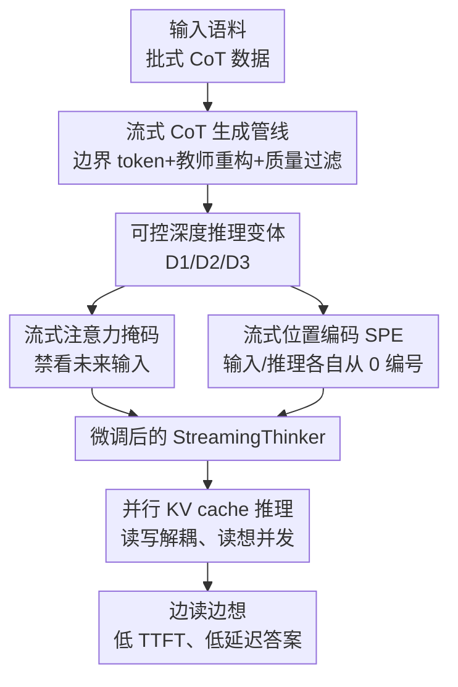

# StreamingThinker: Large Language Models Can Think While Reading

**会议**: ICLR2026  
**OpenReview**: [https://openreview.net/forum?id=10Iiew095e](https://openreview.net/forum?id=10Iiew095e)  
**代码**: 有（论文称已开源，仓库见原文 footnote）  
**领域**: LLM推理  
**关键词**: 流式推理、思维链、注意力掩码、并行 KV cache、低延迟推理

## 一句话总结
StreamingThinker 让 LLM 像人一样"边读边想"——在输入逐句到达时就同步生成顺序对齐的推理片段、读完后再按需加深思考，通过流式 CoT 数据构造 + 流式注意力掩码/位置编码训练 + 并行 KV cache 推理三件套，在数学/逻辑/上下文 QA 推理上保持与传统"读完再想"相当的准确率，却把开始推理前的等待 token 砍掉约 80%、首答延迟降低 60% 以上。

## 研究背景与动机

**领域现状**：以 OpenAI-o1、DeepSeek-R1 为代表的强推理 LLM 普遍走的是"batch thinking（批式思考）"范式——必须等整段输入全部接收完，模型才在 `<think>` 里开始推理，然后给出答案。

**现有痛点**：这套"读完再想"在需要实时响应或动态信息流的场景下有两个硬伤。其一是**延迟**：输入越长，开始推理前的纯等待时间越久，用户要干等。其二是**注意力稀释**：随着输入变长，推理步骤和它真正相关的那段早期上下文之间隔得越来越远，模型对靠前信息的关注被冲淡，连贯性下降、幻觉风险上升。为了补救，模型往往被迫拉长 CoT 或反复自我修正来"重新聚焦"，反而推高了 token 消耗和算力成本。

**核心矛盾**：批式范式把"读"和"想"强行串行化——推理必须在输入全部就位之后才能启动，于是"低延迟"和"对早期信息的强对齐"两件事都被这个串行结构卡死。

**本文目标**：让 LLM 在输入还在到达的过程中就能推理（降低等待延迟），且每一步推理只依赖当前已读到的内容、与对应输入紧紧对齐（缓解注意力稀释），读完后还能按问题难度自由加深思考。

**切入角度**：作者借鉴认知科学里人类"thinking while reading（边读边想）"的机制——人在阅读时会即时解码、构建语义、激活背景知识、做整合推理并主动生成推断，读的同时就在想；读完后再做一次全局整合，把局部浅层理解升华为整体深层理解。这套"局部即时推理 + 全局后处理加深"正好对应延迟与质量的平衡。

**核心 idea**：把"批式思考"改成"流式思考"——推理沿输入流逐句展开、顺序对齐当前上下文，读完后再用指令信号控制是否做全局整合与反思，并在训练和推理机制上真正实现"读"与"想"的并发。

## 方法详解

### 整体框架

StreamingThinker 是一个监督微调（SFT）框架，把原本"批式"的 LLM 改造成"流式思考者"。它要解决三个层层递进的问题：**用什么数据教模型边读边想**、**怎么训练才能强制推理只看已读内容**、**推理时怎么让读和想真正并行**。对应三大模块串成一条流水线。

整体流转是：先用一条**流式 CoT 生成管线**把普通批式推理数据改造成"逐句、顺序对齐、可控深度"的流式推理轨迹作为训练数据；再用**流式训练框架**（流式注意力掩码 + 流式位置编码）在这批数据上微调，强制每一步推理只能看过去和当前的输入、且与对应输入位置对齐；最后在**流式推理**阶段用并行 KV cache 把输入编码和推理生成解耦，让模型一边接收新句子一边对已读内容推理。推理深度分三档（D1 直接答 / D2 全局整合 / D3 自我反思），由指令显式控制，按问题难度调节延迟-质量权衡。

### 关键设计

**1. 流式 CoT 生成管线：把批式推理轨迹改造成逐句顺序对齐、可控深度的训练数据**

现成的强推理数据都是批式 CoT（读完整段再一口气推完），根本没有"边读边想"的形态，没法直接拿来教模型流式思考，所以第一步得自己造数据。管线先对输入插入句级**边界 token**（句末 `<EOS>`、问题末 `<EOQ>`）来界定"最小推理单元"，然后提示一个生成模型（Qwen3-32B）：每遇到一个 `<EOS>`，就只针对前面这一句生成顺序保持的推理片段、并以 `<EOT>` 结束当前步。为了进一步强化顺序对齐，再用一个更大的**教师模型**（Qwen3-235B-A22B-Instruct）把生成的推理重构一遍。

造出来的轨迹还要过质量关，作者定义两个指标。**粒度分（granularity）**衡量推理是否和输入逐句对齐，定义为输入与输出边界 token 数之比：$\text{granularity} = \frac{N_{\text{EOS}}}{N_{\text{EOT}}}$，等于 1 说明推理步数与输入句数一致、对齐理想。**顺序一致性分（sequential consistency）**衡量每段推理是否真的在讲对应那句输入，用句向量余弦相似度刻画：$\text{consistency} = \text{sim}(R_t, C_t) = \frac{v_R \cdot v_C}{\lVert v_R\rVert \lVert v_C\rVert}$，其中 $v_R, v_C$ 是推理句 $R_t$ 与输入句 $C_t$ 的 SentenceBERT 嵌入。通过的样本再用**token 级干预**（token-level intervention）生成三种深度变体（直接答 / 全局思考 / 自我反思）；没通过的重新生成，Pass@2 仍失败就丢弃。这样训练集本身就同时教会了"顺序对齐"和"深度可控"两件事。

**2. 流式注意力掩码：从训练层面强制每一步推理都不能偷看未来输入**

最朴素的做法是把输入句和推理句交错排（interleaved），看着像流式，但它和 LLM 预训练时的格式不一致，而且仍然是串行——推理时没法同时吃新输入。作者要的是"真流式"，核心约束（来自式 1）是：第 $t$ 步的推理绝不能访问第 $t$ 步之后才到达的输入。而标准批式注意力掩码会把全部输入暴露给每一步推理，正好违背这点。于是在推理句→输入句的那块注意力上额外注入一个因果约束，把第 $t$ 步对位置 $>t$ 的输入的注意力屏蔽掉，记为流式掩码区：

$$M_{\text{streaming}}(i,j) = M(i,j) + \big(-\infty - M(i,j)\big)\cdot \mathbb{I}\{\,i>T,\ j<T,\ j>i-T+1\,\}$$

其中 $M$ 是原始因果掩码、$T$ 是输入长度、$L$ 是推理段长度、$\mathbb{I}$ 是指示函数。这样训练出来的模型在结构上就被钉死成"只能基于已读内容推理"，从根上保证了流式语义，又不破坏批式预训练分布。

**3. 流式位置编码（SPE）：给输入和推理各自从 0 编号，消除并发时的位置争用**

LLM 用 RoPE 以相对位置旋转 query/key，推理 token $R_t$ 与输入 token $S_t$ 的注意力是 $\text{Attn}(R_t, S_t) = q_R^{\top} R(T+t-t)\,k_S$（$T$ 是输入长度，位置 ID 为 $t$ 与 $t+T$）。问题在于流式场景下输出生成和输入接收是并发的，二者挤在同一套位置 ID 空间里会产生**位置争用**（positional contention），破坏对齐。作者的解法是给输入和推理 token 分配各自独立、都从 0 起的位置 ID：让 $R_t$ 与 $S_t$ 的位置 ID 都设为 $t$，于是 $\text{Attn}(R_t, S_t) = q_R^{\top} R(t-t)\,k_S = q_R^{\top}R(0)k_S$。这既消除了并发处理的位置冲突，又让每段推理在位置上离它对应的那句输入最近、离别的输入远，天然符合流式对齐的本意。可视化也显示 SPE 的注意力呈明显对角线集中（聚焦当前上下文），而原始 RoPE 在上下文上没有清晰的位置偏好。

**4. 并行 KV cache 推理：把输入编码和推理生成解耦，实现真正的读写并发**

光有掩码和位置编码还不够，推理时若仍用一条连续的 KV cache，读和想还是被迫串行。作者设计两条并行 cache：**源 cache（source）**存输入 token，**目标 cache（target）**存推理 token。输入按到达顺序逐句 prefill 写进源 cache；解码前把两条 cache **合并（merge）**，让推理能 attend 到已读输入，新生成的推理 token 写入合并后的 cache；一句处理完再**拆开（split）**。这样源端 prefill 和目标端 decoding 就能并发——一边读新句子一边对已读内容推理，而批式和交错式都依赖单条连续 cache、只能严格串行。正是这条设计把"边读边想"从语义落到了真正的并行执行，也是 StreamingThinker 相比朴素 interleaved 模式延迟更低的关键。

### 一个完整示例

以论文里 Charlie 两天会议时长的题为例。输入逐句到达：① "Charlie 有两天会议安排" → 模型读到就想"好，这是背景"；② "第一天 3 场各 45 分钟会议" → 立刻算"3×45=135 分钟"；③ "第二天 2 场各 1 时 30 分研讨" → 立刻算"2×90=180 分钟=3 小时"；④ 读到问题"总共多少小时"。到这一步它已经把各句的局部结果想好了。然后按深度档分流：**D1（直接答）**直接给"5.25 小时"；**D2（全局思考）**把前面局部结果整合"135/60=2.25 小时 + 3 小时 = 5.25 小时"；**D3（自我反思）**在全局整合后再回头复核一遍各步（"等一下，再核对：第一天 135 分钟=2.25 小时……"）。整个过程里"读"和"想"是并发的——读到第三句时第二句的推理早已算完，最后的等待只剩问题到达后那一点点收尾，这正是 TTFT 和首答延迟大幅下降的来源。

### 损失函数 / 训练策略

整体是监督微调：用流式 CoT 生成管线造出的"逐句顺序对齐 + 三档深度"轨迹作为监督信号，在 Qwen3-1.7B / Qwen3-4B 上微调，训练时套用流式注意力掩码（式 2）与流式位置编码 SPE。生成端用 Qwen3-32B 产初稿、Qwen3-235B-A22B-Instruct 当教师重构，质量不过关的样本用 Pass@2 把关后丢弃。推理深度（D1/D2/D3）在训练数据里就以指令信号区分，推理时按问题难度选档。

## 实验关键数据

评测覆盖三类推理任务：数学（GSM-Symbolic、MetaMathQA）、逻辑（ProofWriter、LogicNLI）、上下文 QA（HotPotQA、PubMedQA），backbone 为 Qwen3-1.7B / Qwen3-4B，对比批式原始、批式 SFT 蒸馏、朴素 interleaved 三种 baseline。

### 主实验

延迟对比（Qwen3-4B，TTFT = 开始推理前需观察的输入 token 数，Delay = 首答 token 的时间延迟，输入速率设为人类语速 150 词/分）：

| 任务/方法 | Acc↑ | TTFT↓ | Delay↓(s) |
|--------|------|------|----------|
| GSM-Symbolic / Batch Original | 0.855 | 94.74 | 47.70 |
| GSM-Symbolic / Interleaved D3 | 0.843 | 20.77 | 15.46 |
| GSM-Symbolic / **Streaming D3** | **0.856** | **20.77** | **9.77** |
| ProofWriter / Batch Original | 0.620 | 232.11 | 61.99 |
| ProofWriter / **Streaming D3** | **0.813** | **20.51** | **11.05** |
| HotPotQA / Batch Original | 0.575 | 1485.5 | 20.37 |
| HotPotQA / **Streaming D3** | **0.603** | **24.32** | **6.50** |

流式思考在保持（甚至超过）批式准确率的同时，把 TTFT 从几十~上千 token 压到二十几 token、首答延迟普遍降到批式的 1/3~1/6。论文摘要给出的总体结论是：开始推理前的等待 token 减少约 80%、首答时间延迟减少 60% 以上。

### 消融实验

推理深度档位的作用（Qwen3-4B，批处理设定下的 Acc，节选）：

| 配置 | GSM-Symbolic | ProofWriter | 说明 |
|------|---------|---------|------|
| Batch Original | 0.855 | 0.620 | 读完再想 baseline |
| Batch-S, D1 (SPE) | 0.437 | 0.596 | 只做局部流式、直接答，快但粗 |
| Batch-S, D2 (SPE) | 0.871 | 0.795 | 加全局整合，提升最大 |
| Batch-S, D3 (SPE) | 0.874 | 0.861 | 再加自我反思，逼近/超过批式 |

另一组对照是 RoPE vs Streaming RoPE（SPE）：同深度下二者准确率和 token 消耗几乎一致，说明把 RoPE 改成流式版本不损模型能力；而 Streaming vs Interleaved：同样是流式，Streaming 靠并行 KV cache 在准确率更高的同时延迟更低（如 GSM D3：Streaming 0.856/9.77s vs Interleaved 0.843/15.46s）。

### 关键发现
- **全局整合（D1→D2）这一步带来的边际收益最大**：流式阶段是轻量增量推理，必须靠一次全局整合才能把分散信息汇总起来支撑复杂推理——这与"边读边想需要读完再深加工"的动机吻合。
- **SPE 的价值是对齐而非涨点**：它和 RoPE 准确率相当，但注意力图呈明显对角线集中，证明它把推理"钉"在了当前已读上下文上，真正实现"think while reading"。
- **朴素 interleaved 不够**：它虽然也能早开始推理降 TTFT，但格式偏离预训练分布、且强制串行同步，准确率更低、总延迟更高，凸显并行 KV cache 这类流式专用机制的必要性。
- **输入顺序鲁棒**：context-first 与 question-first 两种顺序下趋势一致；question-first 在信息稀疏的上下文 QA 上更省 token（模型提前知道目标、跳过无关推理）。

## 亮点与洞察
- **把"人边读边想"翻译成了可训练、可推理的工程三件套**：粒度/一致性两个量化指标管住数据质量，掩码+位置编码管住训练时的"不许偷看未来"，并行 KV cache 管住推理时的真并发——动机、训练、推理三层一一对应，很完整。
- **"延迟"被拆成 token 级（TTFT）和时间级（delay）两个维度**度量，并用人类语速 150 词/分钟把"输入到达"设为真实瓶颈，这个评测视角比单看吞吐更贴近交互式流式应用。
- **可控深度 D1/D2/D3 是个干净的延迟-质量旋钮**：简单题 D1 秒答、难题 D3 深想，这种"先快出局部、再按需加深"的范式可迁移到流式语音问答、实时翻译、长文档边读边答等任何输入逐步到达的场景。
- **SPE 让输入和推理各自从 0 编号**这个小设计很巧：它用最小改动消除了并发场景下 RoPE 的位置争用，且顺带强化了局部对齐，是个可复用的 trick。

## 局限与展望
- **依赖较强的教师/生成模型造数据**：整条流式 CoT 管线用到 Qwen3-32B 生成 + 235B 教师重构，数据构造成本不低，迁移到没有同等强教师的领域时质量能否保持存疑。
- **真实加速以"输入慢于解码"为前提**：论文明确把输入速率设为人类语速、认定瓶颈在输入到达而非解码。若输入本身很快（如一次性给定的长文档而非流式语音），"边读边想"的延迟优势会被压缩。
- **主要在 Qwen3 系列 + 中小模型（1.7B/4B）上验证**，更大模型、其他模型族上流式范式是否同样稳定、SPE 是否仍无损，尚待检验。
- **局部流式推理偏浅**：D1 单独看准确率明显低于批式，质量主要靠 D2/D3 的全局后处理补回来，说明"流式阶段"本身的推理深度仍有限，如何让局部推理更强而不必依赖全局兜底是可改进方向。

## 相关工作与启发
- **vs 批式思考（o1 / R1 式 batch thinking）**：他们读完整段才在 `<think>` 里推理，延迟高、对早期信息注意力稀释；本文让推理沿输入流展开、读完再按需加深，在相当准确率下把等待 token 砍 80%、延迟降 60%+，本质是把"读-想串行"改成"读-想并发"。
- **vs 朴素 interleaved 流式**：交错式虽也能早推理，但格式偏离预训练、强制串行同步；本文用并行 KV cache 解耦读写、配流式掩码与 SPE，准确率更高、延迟更低。
- **vs 长 CoT / 自我修正类增效**：那些方法靠拉长链或反复 refine 去对抗注意力稀释，代价是 token 暴涨；本文从"顺序对齐 + 局部即时推理"的结构上缓解稀释，反而更省 token。

## 评分
- 新颖性: ⭐⭐⭐⭐⭐ 首次为 LLM 推理提出流式思考范式，并给出数据/训练/推理完整落地，视角新颖
- 实验充分度: ⭐⭐⭐⭐ 三类任务、两种模型、三种 baseline、深度与顺序消融齐全，但仅限 Qwen3 中小模型
- 写作质量: ⭐⭐⭐⭐⭐ 动机-机制-实验逻辑顺畅，图示与公式把抽象的"边读边想"讲清楚了
- 价值: ⭐⭐⭐⭐ 对实时/流式交互场景的低延迟推理有直接价值，可控深度范式具迁移潜力

<!-- RELATED:START -->

## 相关论文

- [\[CVPR 2026\] Think-as-You-See: Streaming Chain-of-Thought Reasoning for Large Vision-Language Models](../../CVPR2026/llm_reasoning/think-as-you-see_streaming_chain-of-thought_reasoning_for_large_vision-language_.md)
- [\[ICLR 2026\] Characterizing and Mitigating Reasoning Drift in Large Language Models](characterizing_and_mitigating_reasoning_drift_in_large_language_models.md)
- [\[ICLR 2026\] A Simple "Motivation" Can Enhance Reinforcement Finetuning of Large Reasoning Models](a_simple_motivation_can_enhance_reinforcement_finetuning_of_large_reasoning_mode.md)
- [\[ICLR 2026\] Vision-R1: Incentivizing Reasoning Capability in Multimodal Large Language Models](vision-r1_incentivizing_reasoning_capability_in_multimodal_large_language_models.md)
- [\[ICLR 2026\] On the Thinking-Language Modeling Gap in Large Language Models](on_the_thinking-language_modeling_gap_in_large_language_models.md)

<!-- RELATED:END -->
