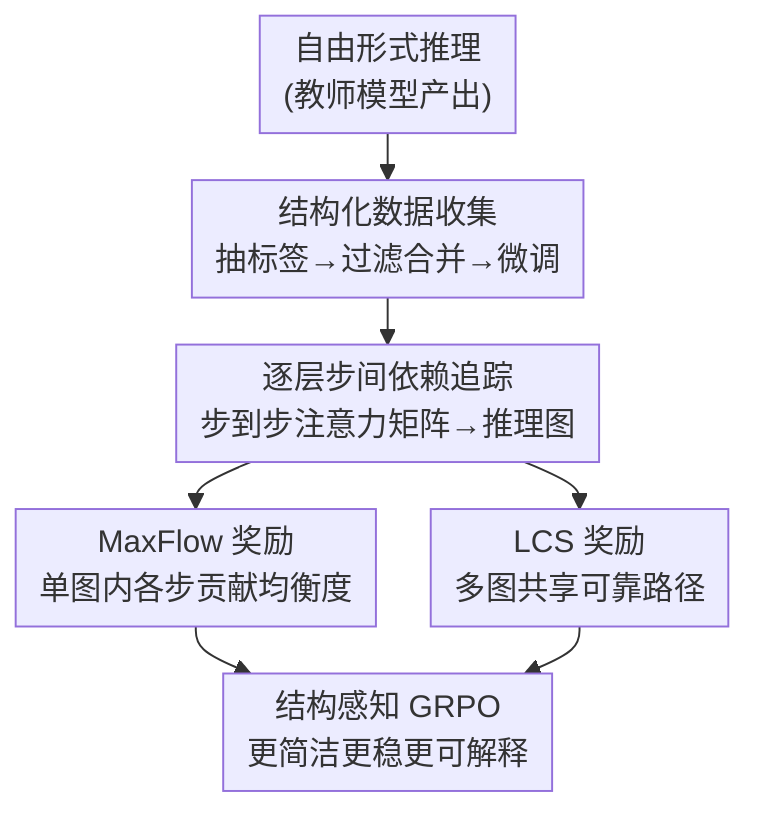

# Structured Reasoning for LLMs: A Unified Framework for Efficiency and Explainability

**会议**: ICLR 2026  
**OpenReview**: [https://openreview.net/forum?id=TIu1RM84P0](https://openreview.net/forum?id=TIu1RM84P0)  
**代码**: 项目页 Structured-Reasoning（论文未给 GitHub 链接）  
**领域**: LLM推理  
**关键词**: 结构化推理, 推理图, 最大流奖励, LCS奖励, GRPO

## 一句话总结
这篇论文把 LLM 的推理过程显式拆成带标签的「步骤」并建模成一张有向图，再用「最大流奖励」和「最长公共子序列奖励」两个结构感知的算法去扩展 GRPO，让 DeepSeek-R1-Distill-Qwen-1.5B/7B 在更短上下文下推理得更简洁、更稳、更可解释，且超过 GRPO 等调过参的基线。

## 研究背景与动机

**领域现状**：当下提升 LLM 推理能力的主流路线是 RL（GRPO 及其各种变体），靠在 token 级别的概率关系上做长 CoT 来刷分。配套的「高效推理」工作大多走长度惩罚、token 预算、按困惑度剪步骤这类思路。

**现有痛点**：作者点出现有推理范式有三个具体毛病——(i) 内容冗余啰嗦，(ii) 性能不稳定（换个采样温度结果就抖），(iii) 内部推理逻辑不可解释、不可审计。这三点直接影响 LLM 在实际应用里的安全性、可控性与可信度。

**核心矛盾**：根子在于现有方法只在 token 概率层面优化，缺少对「推理步骤之间依赖结构」的显式刻画。于是优化的对象是错的——长度惩罚只压字数不管逻辑，困惑度也无法准确反映某一步对最终答案到底有多重要。

**本文目标**：把优化从「token 序列」抬升到「推理步骤的图结构」层面，同时拿下三件事：让推理更高效（更少步骤拿到更好分）、更稳定（跨温度方差小）、更可解释（步骤依赖看得见）。

**切入角度**：受认知科学的双过程理论和神经符号 AI 启发，作者把一段推理看成从「问题步」到「答案步」的单源单汇流扩散过程。高质量推理 = 一张稀疏、各步贡献均衡的推理图；冗余/重复/无意义的步会被答案步忽略，表现为它到 sink 的连接很弱。这样「优化冗余推理」就被转化成「优化推理图结构」这个有数学抓手的问题。

**核心 idea**：先用标签把自由形式的推理切成离散步骤、构造结构化数据微调，再把步间注意力当成图的边，用最大流（单图内部均衡度）和 LCS（多图之间共识）两个奖励去做结构感知的强化学习。

## 方法详解

### 整体框架

整个系统是一条三阶段流水线，作用对象始终是「带标签的推理步骤」而非裸 token。第一阶段**结构化数据收集**：用教师模型 DeepSeek-R1 把自由推理切出高频、跨领域的步骤标签（如 rephrase / inference / verify），过滤合并出一个小而精的结构化数据集，再用带标签的 prompt 微调出会产出结构化推理的模型 $\theta_{struct}$。第二阶段**逐层步间依赖追踪**：把模型某层的注意力张量按步骤的 token 区间聚合，算出 $n \times n$ 的步到步注意力矩阵 $\mathcal{A}$，作为推理有向图的边权——这一步也顺带揭示了中间层在整合全局推理上下文上起关键作用。第三阶段**结构感知强化学习**：在 GRPO 之上挂两个互补的奖励——MaxFlow 看单张图内部各步贡献是否均衡，LCS 看多条采样回答之间共享的可靠推理路径，二者一起把模型推向「简洁 + 可靠」。

### 关键设计

**1. 结构化推理数据收集：把自由文本切成可解析的标签步骤**

小模型几乎没法把一大段自由推理可靠地切成离散步骤，这让后续一切「按步骤优化」都无从谈起。作者的做法是先用教师模型 $T$（DeepSeek-R1）对问题集 $Q_0$ 产出原始推理 $r_{raw}$ 和答案 $a$，再用一个自我总结 prompt 让它把这段推理压成线性的标签链 $l = (l_1 \to \cdots \to l_m)$；然后保留高频标签、合并近义词、剔除领域专用标签，得到一个跨领域通用的核心标签集 $P$。接着对每个问题采样一组标签 $\pi \in P$，让 $T$ 生成对应的带标签推理，并用过滤函数 $F(q,\pi,r,a)$ 校验答案正确性与推理难度，只留下 $F=0$ 的样本组成 $D_{struct}$。最终微调目标是让模型在结构化 prompt $I$ 引导下产出结构化推理和答案：$\theta_{struct} = \prod_{(q,r,a) \in D_{struct}} P(r,a \mid q, I)$。整个数据集刻意做得「tiny but high-quality」，靠质量而非规模驱动结构化能力的冷启动。

**2. 逐层步间依赖追踪：用注意力把推理变成一张图**

要把推理当图优化，先得有边。给定某层注意力张量 $\mathcal{A} \in \mathbb{R}^{H \times L_{seq} \times L_{seq}}$，作者按每个步骤的 token 区间 $T_k = [s_k^{start}, s_k^{end}]$ 做聚合，得到归一化的步到步注意力矩阵：

$$\mathcal{A}_{ij} = \frac{1}{H T_i} \sum_{h=1}^{H} \sum_{a \in T_i} \max_{b \in T_j} A_{h,a,b}.$$

即步 $i$ 的每个 token 对步 $j$ 取最大注意力、再对 head 和 token 取均值，刻画「步 $i$ 有多依赖步 $j$」。这个矩阵就是推理有向图的边权来源，时间复杂度 $O(B \times H \times n^2 \times T_{avg})$，靠向量化 reduce 和及时释放每层缓冲把显存压住。论文还在 Entailment Trees 这个带金标准依赖标注的数据集上验证了这张注意力矩阵确实抓到了真实推理依赖（见实验），说明它不是虚假相关。

**3. MaxFlow 奖励：用最大流衡量单图内各步贡献是否均衡**

光有图还不够，得有个能区分「好图 vs 冗余图」的标量奖励。作者的洞察是：理想的逐步依赖链里，删掉任意一步都会打断流，每步贡献近似相等；而冗余/无意义的步对 sink 贡献很弱。于是把图设为单源（步 1=Question）单汇（步 $n$=Answer），只保留 $\mathcal{A}_{ij} > \tau$（$\tau=0.05$）的边以得到稀疏骨架。先算全图最大流 $F$，再对每个中间节点 $k$ 删掉后重算最大流 $F_{-k}$，用 $\Delta F_k = F - F_{-k}$ 量化该步有多关键。取最重要的前 25% 步集合 $K_{top}$，定义推理质量

$$Q = 1 - \frac{\sum_{k \in K_{top}} \Delta F_k}{\sum_{j=0}^{n-1} \Delta F_j} \in [0,1],$$

$Q$ 越高表示重要性越分散、没有单步独大，即推理越均衡非冗余。最终奖励 $r_{maxflow} = Q$（答案正确时）否则 $-1$。这正好对应「困惑度无法准确评估步骤重要性」的痛点——最大流直接从图结构里读出每步对结论的因果贡献。工程上用优化版 Dinic + 残差网络复用，把理论 $O(n^4)$ 压到经验 $O(n^{2.5})$，提速 7.41×。

**4. LCS 奖励：用最长公共子序列在多条回答间筛可靠路径**

MaxFlow 只看单张图内部，无法利用「多次采样之间的共识」。LCS 奖励则在一组采样回答 $R=\{r_1,\dots,r_n\}$ 之间，对每对 $(r_i, r_j)$ 抽取推理步骤标签序列、求最长公共子序列 $LCS(r_i, r_j)$，把多条回答都走过的连续步骤当成可靠路径。为防止「长度作弊」（故意把每步写长来刷分），对每个匹配步引入长度抑制因子 $ratio_k$（当 $\ell_{i,k} > \ell_{j,k}$ 时取 $\frac{\ell_{j,k}}{2\ell_{i,k}}$，否则 $1 - \frac{\ell_{i,k}}{2\ell_{j,k}}$），加权后得 $L_{lcs} = \sum_k ratio_k \cdot \ell_{i,k}$。pairwise 得分按四种正误组合给符号：两者都对奖励 $\frac{L_{lcs}}{L_i}$、都错惩罚 $-\frac{L_{lcs}}{L_i}$、$r_i$ 对 $r_j$ 错给 $1-\frac{L_{lcs}}{L_i}$、反之 $-1+\frac{L_{lcs}}{L_i}$——即「向正确回答靠拢、与错误回答拉开」。最终 $r_{lcs}(c_i) = \frac{1}{n-1}\sum_{j \neq i} Score_{lcs}(c_i, c_j)$。这让模型在鼓励共识的同时压短冗长步骤，得到既简洁又可靠的推理路径。

### 一个完整示例

以论文图 1 的例子「把直角坐标 $(0,3)$ 转成极坐标」走一遍：教师模型先产出一段自由推理，里面混着「Wait, if x is 0...」这类犹豫、回看、重复验证的句子。结构化数据收集阶段把它切成带标签的步骤链——`<rephrase>` 重述问题、`<inference>` 代入公式、`<specialize>`/`<case_analysis>` 讨论 x=0 的特殊情形、`<verify>` 反代验证 $(3\cos\frac{\pi}{2}, 3\sin\frac{\pi}{2})=(0,3)$、`<summarize>` 给出 $(3, \frac{\pi}{2})$。第二阶段把这些步按 token 区间聚合出步到步注意力矩阵，连成 Q→…→A 的有向图。第三阶段 MaxFlow 发现那些重复确认、犹豫的步对 sink 贡献很弱（删掉它们最大流几乎不变，$\Delta F_k \approx 0$），于是在 RL 里被压低权重；而代入公式、验证这些步贡献大且分布均衡，$Q$ 高、奖励高。多次采样时 LCS 又把「代入→验证→给答案」这条多条回答共享的骨架认定为可靠路径并强化。训练后模型学会用更少、更密的步骤直奔答案。

## 实验关键数据

模型基座为 DeepSeek-R1-Distill-Qwen-1.5B 与 7B。结构化微调用 S1 数据集中精选的 500 条高质量样本，RL 阶段用 DeepScaleR（40K 数学题）。评测覆盖 9 个 benchmark（AIME24/25、AMC、MATH500、Minerva、Olympiad、DROP、LSAT-AR、MMLU-ALL），并在 0.5k–8k 多种最大响应长度下报告 Pass@1。

### 主实验（1.5B，平均分 Avg.）

| 最大长度 | GRPO | Ours(LCS) | Ours(MaxFlow) |
|----------|------|-----------|---------------|
| 1K | 21.58 | **24.28** | 22.19 |
| 2K | 32.33 | **33.79** | 32.78 |
| 4K | 39.28 | 40.50 | **41.68** |
| 8K | 43.28 | 44.19 | **48.89** |

在 8K 长度下，MaxFlow 版本平均分 48.89，不仅大幅超过 GRPO（43.28），还追平甚至超过由他人专门训练的强基线 DeepScaleR（48.14）。短长度（1K）时 LCS 版本更占优（24.28 vs GRPO 21.58），说明结构化优化在「短预算下逼出简洁推理」尤其有效。

### 7B 结果与注意力-依赖对齐验证

| 配置 | 1K Avg. | 2K Avg. |
|------|---------|---------|
| GRPO（7B） | 29.19 | 43.36 |
| Ours(LCS, 7B) | **35.06** | **47.34** |
| Ours(MaxFlow, 7B) | 32.32 | 43.36+ |

| 注意力-依赖对齐（Entailment Trees） | 平均对齐度 | 胜率 |
|----------------------|-----------|------|
| Shuffled（打乱步序） Task1 | 28.48% | 5.50% |
| Structured Task1 | **71.27%** | **97.15%** |
| Shuffled Task2（含干扰） | 24.87% | 4.71% |
| Structured Task2 | **72.27%** | **95.29%** |

打乱步序后对齐度从 ~71% 暴跌到 ~28%，胜率近乎全胜（>95%），有力证明步到步注意力矩阵抓到的是真实推理依赖，而非偶然相关。这是「可解释性」这条 claim 的硬证据。

### 关键发现
- **MaxFlow 主打长上下文效率**：在 8K 长度下涨幅最大（1.5B：43.28→48.89），因为长推理里冗余步多，最大流的「贡献均衡度」信号最能发挥作用。
- **LCS 主打短预算与小模型**：1K/2K 及 7B 的 1K 上 LCS 更强，多回答共识能在步数有限时快速锁定可靠骨架。
- **稳定性**：在温度 0.1–1.0 区间、固定 8K 长度下测准确率方差，本文方法方差更小，即换温度结果更稳。
- **可解释性（IISR 实验）**：通过注入明显无关步、再比较各方法的错误过滤效率，MaxFlow 在剔除 1–11 个无关步时优于 top-p/top-k 回溯、平均步困惑度和随机选择——说明它确实能识别步骤重要性。

## 亮点与洞察
- **把「高效推理」重定义为「优化稀疏推理图」**：这是全文最漂亮的一步——不再纠结于长度惩罚或困惑度这些代理指标，而是给「好推理」一个图论刻画（各步对 sink 的流贡献均衡），让优化目标第一次和「逻辑结构」对齐。
- **最大流的删点敏感度 = 步骤因果重要性**：用 $\Delta F_k = F - F_{-k}$ 衡量一步删掉后流损失多少，等价于做了一次因果消融，比困惑度这种纯统计量更贴近「这步对结论是否必要」。
- **LCS 的四象限符号设计很巧**：用正误组合决定奖励符号，一边鼓励向正确回答的共识靠拢、一边和错误回答拉开距离，配合长度抑制因子直接堵住「写长刷分」的漏洞。
- **注意力即依赖图这一假设有硬验证**：打乱步序对齐度从 71% 掉到 28% 的对照实验，把「注意力能否当推理依赖用」这个常被质疑的假设落到了实处，可迁移到任何想用注意力做可解释性的工作。

## 局限与展望
- **强依赖教师模型与注意力可得性**：数据收集要 DeepSeek-R1 当教师，依赖追踪要拿到模型内部注意力张量，闭源 API 模型无法直接套用。
- **步骤切分粒度敏感**：整套方法建立在「能可靠把推理切成离散标签步骤」之上，若切分噪声大，图结构和奖励都会失真；论文也承认小模型自身难以可靠解析。
- **主要在数学/STEM 域验证**：RL 用 DeepScaleR 数学数据，benchmark 也偏数学与推理，迁移到开放式生成、长程规划等场景的效果未知。
- **最大流计算成本**：尽管优化到经验 $O(n^{2.5})$，对超长推理（n 很大）仍是训练时的额外开销；$\tau=0.05$、top-25% 等阈值的敏感性也值得进一步分析。

## 相关工作与启发
- **vs GRPO**：GRPO 在 token/序列级用组相对优势做 RL，本文在其上叠加两个结构感知奖励，把优化对象从 token 概率抬到推理图结构，因而在更短长度下就能拿到更高分。
- **vs 长度惩罚 / token 预算类（L1、O1-Pruner、DAST、THINKPRUNE）**：它们直接压字数控成本，本文不直接惩罚长度，而是奖励「图结构均衡 + 多图共识」，简洁性是结构优化的副产物而非硬约束，避免了「为压长度牺牲逻辑」。
- **vs 基于困惑度的高效 CoT**：作者明确指出困惑度无法准确评估步骤重要性，并用 IISR 实验证明 MaxFlow 在错误步过滤上优于困惑度，提供了比困惑度更可靠的步骤重要性度量。

## 评分
- 新颖性: ⭐⭐⭐⭐⭐ 把推理建模成流图、用最大流+LCS 双奖励改造 GRPO，视角新且自洽
- 实验充分度: ⭐⭐⭐⭐ 9 benchmark × 5 长度 × 1.5B/7B + 对齐验证 + IISR，较充分；但偏数学域
- 写作质量: ⭐⭐⭐⭐ 三阶段管线讲得清楚，公式与动机对得上，少量笔误
- 价值: ⭐⭐⭐⭐⭐ 同时改善效率/稳定/可解释，且对可解释性给出硬证据，实用价值高

<!-- RELATED:START -->

## 相关论文

- [\[ICLR 2026\] Unleashing Scientific Reasoning for Bio-Experimental Protocol Generation via Structured Component-based Reward Mechanism](unleashing_scientific_reasoning_for_bio-experimental_protocol_generation_via_str.md)
- [\[ICLR 2026\] A State-Transition Framework for Efficient LLM Reasoning](a_state-transition_framework_for_efficient_llm_reasoning.md)
- [\[ICLR 2026\] Enhancing Language Model Reasoning with Structured Multi-Level Modeling](enhancing_language_model_reasoning_with_structured_multi-level_modeling.md)
- [\[ICML 2026\] FloorplanQA: A Benchmark for Spatial Reasoning in LLMs Using Structured Representations](../../ICML2026/llm_reasoning/floorplanqa_a_benchmark_for_spatial_reasoning_in_llms_using_structured_represent.md)
- [\[ICLR 2026\] Emergent Hierarchical Reasoning in LLMs through Reinforcement Learning](emergent_hierarchical_reasoning_in_llms_through_reinforcement_learning.md)

<!-- RELATED:END -->
