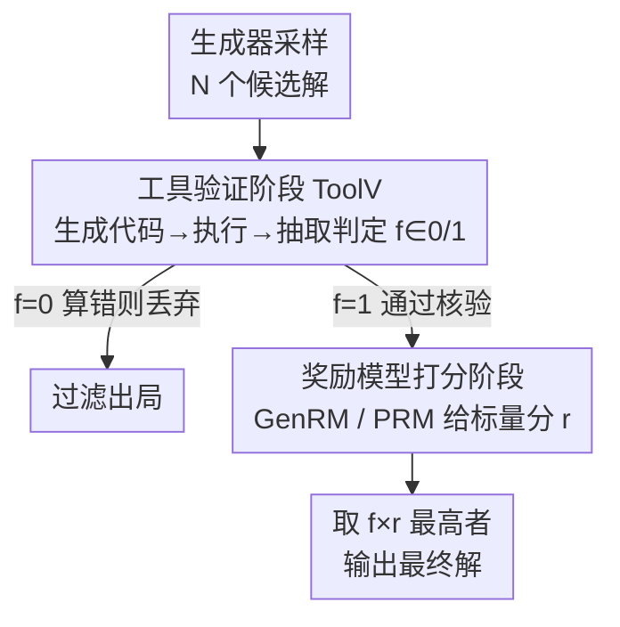

# T1: Tool-Integrated Verification for Test-Time Compute Scaling in Small Language Models

**会议**: ICLR 2026  
**OpenReview**: [https://openreview.net/forum?id=tBkLWfmugI](https://openreview.net/forum?id=tBkLWfmugI)  
**领域**: LLM推理  
**关键词**: 测试时计算扩展, 小语言模型, 验证器, 工具调用, best-of-N

## 一句话总结
小模型在测试时扩展里当验证器时，会因记不住算术/事实而误判，T1 用「先让代码解释器等外部工具过滤掉算错的候选、再让奖励模型打分」的两阶段验证，把记忆密集的活外包给工具，让 Llama-3.2-1B 在 MATH 上反超 Llama-3.1-8B。

## 研究背景与动机
**领域现状**：测试时计算扩展（test-time compute scaling）是让小语言模型（sLM）变强的热门路线——典型做法是 best-of-N：用生成器采样 $N$ 个候选解，再用一个验证器（verifier）给每个解打分，取最高分作为最终答案。已有工作显示，配上一个大验证器，3B 的小模型在 MATH/AIME 上能逼近甚至超过 405B 的大模型。

**现有痛点**：但这套方案的验证器通常得是 7B+ 的大模型（PRM 过程奖励模型、critic 模型、GenRM 生成式奖励模型）。一旦验证还得靠大模型，sLM「省显存、省成本」的优势就被抵消了。那能不能让 sLM 自己来验证？作者做了个概念验证实验：让 Llama-1B/3B 验证「$N$ 个三位数相加是否正确」，发现 1B 模型随着 $N$ 增大准确率断崖下跌，3B 却稳定——即便用大验证器做知识蒸馏也救不回来。

**核心矛盾**：sLM 验证失败的根因不是「不会推理」，而是**参数容量有限、记不住验证所需的全部事实**（算术表、知识事实）。验证「$237+321=556$ 对不对」需要模型脑子里真的算对这一步，而小模型恰恰在这种记忆密集（memorization-heavy）的步骤上崩盘。

**本文目标**：让 sLM 在不增加参数、不依赖大模型的前提下，达到接近大验证器的验证可靠性，从而支撑测试时扩展。

**切入角度**：那个概念验证实验还有后半段——一旦允许 1B 模型生成并执行代码，它在大 $N$ 下的验证准确率几乎追平大模型。这说明把算术/事实核查这类记忆密集步骤**外包给外部工具**，就能绕开 sLM 的容量瓶颈。工具不只是「有帮助」，对 sLM 验证而言是「必要」的。

**核心 idea**：把验证拆成两阶段——先用外部工具（代码解释器、检索器）硬过滤掉算错/知识错的候选，再让 sLM 对剩下的候选做语义层面的打分；记忆密集的活交给工具，逻辑判断的活留给小模型。

## 方法详解

### 整体框架
T1（Tool-integrated Verification）是套在 best-of-N 测试时扩展上的两阶段验证流程。输入是生成器对同一问题采样出的 $N$ 个候选解，输出是被选中的那一个最终解。核心是把原本「单一验证器打分」的环节，改成「工具硬过滤 + 奖励模型软打分」的乘积门控：

$$y^* = \arg\max_{y \in \{y_1,\dots,y_N\}} f(x, y; \mathcal{T}, \theta) \times r(x, y; \theta)$$

其中 $f(x,y;\mathcal{T},\theta) \in \{0,1\}$ 是工具验证函数（0 表示该候选被过滤掉），$\mathcal{T}$ 是所用工具（如代码解释器、检索器），$r(x,y;\theta)$ 是奖励模型打的标量分。这个乘法很关键：只要工具判定一个解算错了（$f=0$），无论奖励模型给多高分都会被清零；只有通过工具核验的解才进入打分排序。两阶段都还能用大验证器蒸馏来进一步增强。

### 关键设计

**1. 两阶段乘性门控：工具硬过滤在前，奖励模型软打分在后**

针对的痛点是单一 sLM 验证器把「算得对不对」和「推得通不通」混在一起判，结果在记忆密集的算术核查上翻车，把一个最终答案错的解打了高分。T1 的解法是把两件事解耦：第一阶段工具验证器 ToolV 只管事实/数值层面的对错，输出二值 $f \in \{0,1\}$；第二阶段奖励模型（GenRM 或 PRM）只在通过过滤的候选里评估整体逻辑一致性与连贯性，输出连续分 $r$。最终用 $f \times r$ 排序，等价于「先一票否决，再择优」。这个设计的好处是**对生成式验证器和过程奖励模型都通用**——不管第二阶段用 GenRM 还是 PRM，前面套一层 ToolV 就行，是个统一框架；而且乘法门控保证了被工具判错的解一定不会被选中，堵死了「奖励模型给错误解打高分」这条出错路径。

**2. ToolV 工具验证阶段：查询生成 → 工具执行 → 判定抽取三步**

这是 T1 真正把记忆负担外包出去的环节。ToolV 不是直接让 sLM 答「对/错」，而是让它走一套可执行流程。工具验证函数拆成三部分：先由 sLM 根据问题和候选解生成工具调用查询 $c_1$（如把解里的算式翻译成 Python 代码），再把 $c_1$ 喂给工具执行得到 $\mathcal{T}(c_1)$（代码解释器跑出真实计算结果），最后 sLM 结合执行结果抽取出判定 $c_2$：

$$f(x, y; \mathcal{T}, \theta) = c_2 \sim \pi\big(c \mid \mathcal{T}(c_1), x, y, I_f; \theta\big), \quad c_1 \sim \pi(c \mid x, y, I_c; \theta)$$

其中 $I_c$、$I_f$ 是任务相关的指令提示。关键在于：判断「$237+321$ 到底等于几」不再依赖 sLM 脑子里背下的算术表，而是由代码解释器真实算出来——sLM 只负责「把要算的写成代码」和「读懂执行结果」，这两件事都不吃记忆容量。同一套机制换成检索器，就能做知识事实核查。

**3. 多-LoRA 验证器蒸馏：给两阶段各配一套适配器**

光靠零样本提示，sLM 既不太会写对的核验代码，也不太会打靠谱的分。T1 用大教师模型蒸馏来增强两个阶段，但两个任务（写工具核验轨迹 vs. 做奖励打分）差异很大，于是采用多-LoRA：给 ToolV 和 RM 各挂一套独立适配器 $\Delta\theta_{\text{tool}}$、$\Delta\theta_{\text{reward}}$。ToolV 的蒸馏目标是让学生模仿教师生成的工具核验轨迹：

$$\mathcal{L}_{\text{tool}}(\Delta\theta_{\text{tool}}) = -\mathbb{E}\,\log \pi(c \mid t, x, y, I; \theta + \Delta\theta_{\text{tool}})$$

其中 $c \in \{c_1, c_2\}$、$t$ 为空或工具执行结果 $\mathcal{T}(c_1)$。奖励侧的 $\mathcal{L}_{\text{reward}}$ 则是先从学生自己的分布采样响应、再由教师给出验证标签、最后回过头微调学生。教师用 gpt-4o-mini 生成 GenRM 轨迹，PRM 侧用 Qwen2.5-Math-PRM-7B。这样一个 sLM backbone 通过切换 LoRA 就能在「写代码核验」和「打分」两个角色间复用，不必各训一个完整模型。

**4. 理论保证：工具把记忆需求从 $\Omega(M^3)$ 压到 0，且过滤单调提升 best-of-N**

这一节解释「为什么工具外包是对的」。作者在一个「验证 $a+b=c$ 是否成立」的玩具任务上证明：不借助工具时，任何接近最优的学习算法要达到近零误差，需要在参数 $\theta$ 里记住的信息量 $I(X;\theta\mid P) = \Omega(M^3)$（$M$ 是数值范围），即记忆量随问题规模三次方爆炸（Lemma 5.1）；而一旦能访问工具 $\mathcal{T}$，由于答案由工具独立给出、与训练集无关，$I(X;\theta\mid P) = 0$（Theorem 5.2）——记忆需求被彻底消除。另一条定理证明：把 ToolV 当作过滤器会提高验证器在正确解上的命中概率 $p$，而 best-of-N 选中正确答案的概率 $\pi_N(1\mid x)$ 关于 $p$ 单调递增（Theorem 5.3），所以「过滤掉算错的解」必然不会让测试时扩展变差、反而稳赚。

## 实验关键数据

### 主实验
评测设定：在 MATH500 与 GSM8K 上用加权 best-of-N，固定生成器采样 64 个解，验证后统计解题正确率。验证器同时测 PRM 和 GenRM-CoT。小模型选用各家族最小的 instruct 版：Qwen2.5-0.5B、Llama-3.2-1B，并额外测极小的 SmolLM2-360M。

| 设置 | 数据集 | 关键结论 |
|------|--------|----------|
| Distilled PRM + ToolV | MATH500 | Llama-3.2-1B 反超 Llama-3.1-8B；Qwen2.5-0.5B 仅用 16 个解就追平 1.5B |
| Distilled GenRM + ToolV | MATH500 | 三个 sLM 全面提升，GenRM 单独搞不定的算术错误被工具直接过滤 |
| Distilled GenRM + ToolV | GSM8K | 同样有效，最弱的 SmolLM2-360M 增益最明显；但简单任务上增益较小 |
| 对比 Themis | MATH (Llama-1B) | ToolV+GenRM 与 ToolV+PRM 均超过 Themis 这一已有工具增强方案 |

### 消融与分析

| 配置 / 分析 | 关键指标 | 说明 |
|------|---------|------|
| Zero-shot GenRM | 最低 | 不蒸馏的小模型几乎不会验证 |
| Distilled GenRM/PRM | 中等 | 蒸馏后仍受数值错误拖累 |
| + ToolV（完整 T1） | 最高 | 工具过滤补上了奖励模型补不了的算术错误 |
| ToolV 作用域（按难度） | Level 2–4 提升稳定，Level 5 回落 | 工具对最难题帮助有限 |
| ToolV 作用域（按类别） | Algebra/Number Theory/Counting 大涨，Geometry 下降 | 计算密集领域受益最大 |
| GenRM 放大到 1B/3B/8B | ToolV 始终有增益 | MATH 上「1B GenRM + ToolV」反超「8B GenRM」 |

### 关键发现
- **工具过滤是主要增益来源**：ToolV 在 $N=64$ 候选里把算错的解清掉后，正确解占比的分布明显右移，best-of-N 准确率显著提升——验证了「过滤单调提升」的理论。
- **小验证器 + 工具 > 大验证器**：固定 ToolV 用 1B，只放大 GenRM 时增益缩小但不消失；而 1B+ToolV 直接超过 8B GenRM，说明在 MATH 这类硬任务上，加工具比单纯堆验证器参数更划算（尤其省显存）。
- **计算开销可控**：每题平均 token 数为 生成器 574.39、GenRM 4431.11、ToolV 代码 610.84；折算下来 ToolV 的额外成本只相当于用一个 1.14 倍大的验证器（$k = (5616.34-574.39)/4431.11 = 1.14$）。即便把 x 轴按 1.14 倍计算预算归一化后重画（Figure 10），ToolV 仍保持领先，对最小的 SmolLM2-360M 和大 $N$ 场景增益尤为明显。

## 亮点与洞察
- **把「验证」重新诊断为「记忆问题」而非「推理问题」**：作者用一个干净的概念验证（验证多位数相加，1B 随 $N$ 崩、3B 稳）精准定位了 sLM 验证的真正瓶颈是记忆容量，这个 framing 比泛泛地说「小模型能力弱」深刻得多。
- **二值过滤 × 连续打分的乘性门控很巧**：用 $f \times r$ 把「硬约束（事实对错）」和「软偏好（逻辑优劣）」干净地组合起来，且天然兼容 PRM/GenRM 两类验证器，是个可复用的接口设计——任何「先排除明显错误、再择优」的场景都能套。
- **理论与实验对齐**：记忆界 $\Omega(M^3)\to 0$ 和过滤单调性两条定理，分别解释了「工具为什么必要」和「过滤为什么稳赚」，不是事后凑的理论。
- **可迁移**：把记忆密集步骤外包给可验证工具的思路，可推广到检索做事实核查、调用计算器/单位换算/日历等任何「sLM 记不住但工具能确定算出」的验证子任务。

## 局限与展望
- **对最难题和非计算领域帮助有限**：Level 5 难题上 ToolV 回落，Geometry 类别甚至下降——工具能核验数值，但对需要复杂空间推理、而非算术的题目无能为力。
- **依赖「工具已知且可用」的假设**：方法假设所用工具 $\mathcal{T}$ 是显式已知的（如这题该用代码解释器），没处理「该调哪个工具/工具不可用」的选择与鲁棒性问题。
- **额外 token 开销真实存在**：虽然只相当于 1.14 倍验证器，但 ToolV 多了一轮代码生成与执行，在极端低延迟场景仍是成本；GenRM 本身 4431 token 的开销也不小。
- **主要在数学推理上验证**：知识密集任务（MMLU-Pro 子集）仅在附录补充，工具检索式核验的可靠性在更开放领域还需更多检验。

## 相关工作与启发
- **vs 大验证器路线（PRM / GenRM / critic, 7B+）**：他们靠堆验证器参数获得可靠验证，本文反其道——用 1B 小验证器 + 工具过滤，既省显存又在硬任务上反超 8B，论证了「工具是测试时扩展的另一个维度」。
- **vs Themis（工具增强奖励建模）**：Themis 在 7B 模型上用统一的工具增强奖励框架处理计算器/天气/日历等任务；本文聚焦更小的模型 + 数学推理，且采用「过滤+打分」两阶段而非统一框架，实验上 ToolV+GenRM/PRM 均超过 Themis。
- **vs 程序辅助语言模型（PAL / Toolformer 等）**：前人把工具用于**生成/推理**阶段（让模型调代码算出答案），本文把工具用在**验证**阶段（核验候选解对错），并把工具使用形式化为测试时扩展的一个新维度。

## 评分
- 新颖性: ⭐⭐⭐⭐ 把工具从「辅助生成」搬到「验证过滤」，并用记忆界给出干净的理论动机，角度新。
- 实验充分度: ⭐⭐⭐⭐ 多模型/多数据集/难度与类别分解/开销归一化都做了，但任务以数学为主。
- 写作质量: ⭐⭐⭐⭐ 概念验证图引出问题、理论与实验对齐，逻辑清晰。
- 价值: ⭐⭐⭐⭐ 给资源受限场景下「小模型自验证」提供了实用且省显存的方案。

<!-- RELATED:START -->

## 相关论文

- [\[ICLR 2026\] Efficient Test-Time Scaling for Small Vision-Language Models](efficient_test-time_scaling_for_small_vision-language_models.md)
- [\[ICLR 2026\] Strategic Scaling of Test-Time Compute: A Bandit Learning Approach](strategic_scaling_of_test-time_compute_a_bandit_learning_approach.md)
- [\[ICLR 2026\] ROC-n-Reroll: How Verifier Imperfection Affects Test-Time Scaling](roc-n-reroll_how_verifier_imperfection_affects_test-time_scaling.md)
- [\[ICLR 2026\] Zero-Overhead Introspection for Adaptive Test-Time Compute](zero-overhead_introspection_for_adaptive_test-time_compute.md)
- [\[ICLR 2026\] Mode-conditioning unlocks superior test-time compute scaling](mode-conditioning_unlocks_superior_test-time_compute_scaling.md)

<!-- RELATED:END -->
