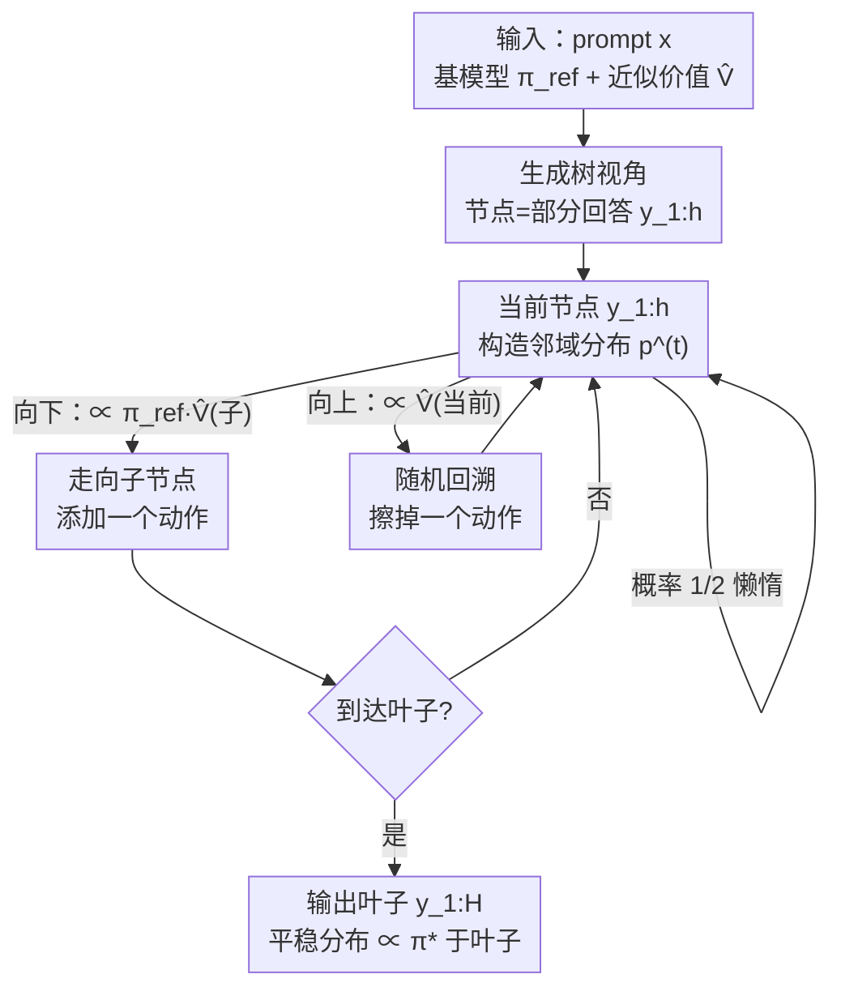

# Taming Imperfect Process Verifiers: A Sampling Perspective on Backtracking

**会议**: ICLR 2026  
**OpenReview**: [https://openreview.net/forum?id=MFDkLbcydi](https://openreview.net/forum?id=MFDkLbcydi)  
**代码**: 有（论文 supplementary material 附带）  
**领域**: LLM推理  
**关键词**: 过程验证器, 测试时对齐, 随机回溯, 马尔可夫链采样, 误差放大

## 一句话总结
把"用过程验证器引导语言模型生成"重新理解成"在生成树上做一次随机游走"，并引入概率化的**回溯**（偶尔擦掉已生成的 token），从而即使验证器（价值函数）存在估计误差，也能证明性地避免误差沿生成长度被放大，最终在多项分布保真度指标上稳定优于不带回溯的逐动作采样。

## 研究背景与动机

**领域现状**：测试时算法把语言模型的生成能力和"验证器"结合起来已经成为提升推理能力的主流手段。最简单的是 best-of-N（用验证器从 N 个完整回答里挑分最高的），更强的是用**过程验证器**——它能评估**部分生成**（前缀 $y_{1:h}$）的好坏，于是可以在生成过程中逐步引导。其中最有原则的一类过程验证器是**价值函数** $V^\star_{\text{tilt}}(x, y_{1:h}) := \mathbb{E}_{\pi_{\text{ref}}}[\tau(x, y_{1:H}) \mid y_{1:h}]$，即在基模型 $\pi_{\text{ref}}$ 下、给定前缀后最终奖励的条件期望。如果拿到真实的 $V^\star_{\text{tilt}}$，测试时对齐问题（从倾斜分布 $\pi^\star(y\mid x) \propto \pi_{\text{ref}}(y\mid x)\cdot \tau(x,y)$ 采样）就能通过逐动作拒绝采样（ActionLevelRS）精确且高效地解决。

**现有痛点**：天下没有免费的午餐——真实价值函数本身就计算不可解，实践中只能用蒙特卡洛 rollout 回归出一个**近似价值函数** $\widehat V$，它必然带有误差（模型设定偏差、优化瓶颈、有限样本）。问题在于：哪怕这些误差看起来"人畜无害"，ActionLevelRS 也会在长序列生成中把它们**逐步放大**，最终灾难性地崩掉。论文给了两个反例：① 仅在某个动作上乘一个 $(1+\varepsilon_V)$ 的小扰动，输出分布与目标的总变差距离就会达到 $\Omega(\min(\varepsilon_V\sqrt H, 1))$；② 即使没有"扰动"、只是把真值延迟一步（$\widehat V(y_{1:h}) := V^\star_{\text{tilt}}(y_{1:h-1})$），由于 $\widehat V$ 不依赖当前动作 $y_h$，ActionLevelRS 退化成从 $\pi_{\text{ref}}$ 均匀采样，承受 $\Omega(1)$ 的 KL 正则后悔。

**核心矛盾**：逐动作采样的随机游走**只会沿树往下走**，一旦在某一步根据带噪的价值做出了系统性偏向，后面没有任何机制去纠正——这正是机器学习里广为人知的"horizon 诅咒"（长程会放大学习误差）在生成场景的具体化身。而延迟反例恰恰泄露了一线生机：$\widehat V(x, y_{1:h})$ 虽然没法指导**选哪个** $y_h$，却能判断**上一步** $y_{h-1}$ 选得好不好——信息其实是可以往回传的。

**本文目标**：给"不完美过程验证器"建立一个具体的误差模型，并设计一个能**证明性地缓解误差放大**的测试时采样算法，把"误差不随生成长度 $H$ 退化"做成定理。

**切入角度**：作者把这个问题与理论计算机科学里经典的近似采样工具箱接上——具体是 Sinclair-Jerrum 随机游走（1989），它原本用来证明"近似计数可以约化为近似采样"且不放大误差。价值函数恰好是"计数 oracle"在本场景的推广，于是这套机器可以把经验上的启发式"回溯"（偶尔擦掉已生成 token）实现成**数学上严格成立**的步骤。

**核心 idea**：在逐动作采样的随机游走上加一条"按概率往父节点回溯"的边，让整条游走的平稳分布在叶子上恰好正比于 $\pi^\star$——哪怕内部节点的价值估计有误差。

## 方法详解

### 整体框架

把对一个 prompt $x$ 的所有可能回答组织成一棵指数大的树 $\mathcal{T}$：节点是部分回答 $y_{1:h}$，$y_{1:h-1}$ 是 $y_{1:h}$ 的父节点，叶子是完整回答 $y_{1:H}$。所有引导生成算法都可以看成在这棵树上从根 $\varnothing$ 走到某个叶子的随机游走。ActionLevelRS 的游走**只往下**：在 $y_{1:h}$ 处，选子节点 $(y_{1:h}, y_{h+1})$ 的概率正比于 $\pi_{\text{ref}}(y_{h+1}\mid x, y_{1:h})\,\widehat V(x, y_{1:h}, y_{h+1})$。

VGB（Value-Guided sampling with stochastic Backtracking）只对它做"一行改动"：在每个节点的邻域 $N(y_{1:h})$ 里，除了所有子节点，**还加上父节点** $y_{1:h-1}$ 作为候选，往父节点回溯的概率正比于 $\widehat V(x, y_{1:h})$。每一步以 $1/2$ 概率原地不动（laziness，保证平稳分布存在），否则按这个邻域分布 $p^{(t)}$ 采样下一个节点。整条游走是一条懒惰、可逆的马尔可夫链，其平稳分布 $\widetilde\pi$ 在叶子上正比于 $\pi^\star$，于是只要让它充分混合再读出叶子，就拿到了近似的目标采样。这是 Sinclair-Jerrum 游走从"均匀 $\pi_{\text{ref}}$ + 二值 $\tau$"到"一般基模型 + 一般价值函数"的推广。

### 关键设计

**1. 树上随机游走 + 概率化回溯：给"只往下走"的采样加一条返回边**

ActionLevelRS 之所以会放大误差，根因是它的随机游走是单向的——从根一路向叶子，一旦某一步被带噪价值带偏就再也回不来。VGB 的核心动作是在每个内部节点 $y_{1:h}$ 的转移邻域里把**父节点也算进去**：定义邻域分布

$$p^{(t)}(y_{1:h-1}) \propto \widehat V(x, y_{1:h}), \qquad p^{(t)}(y_{1:h}, y_{h+1}) \propto \pi_{\text{ref}}(y_{h+1}\mid x, y_{1:h})\,\widehat V(x, y_{1:h}, y_{h+1}),$$

然后以 $1/2$ 概率原地停留（laziness），否则从 $p^{(t)}$ 采样下一个节点。"往父节点走"在语义上就是**擦掉刚生成的那个动作**，也就是把经验里五花八门的启发式 backtracking 落到一个有数学依据的形式上。回溯权重恰好用当前节点的价值 $\widehat V(x, y_{1:h})$，使得这条链可逆且其平稳分布在叶子上正比于 $\pi^\star$——这正是延迟反例所暗示的"把信息往回传"：当某个前缀的价值偏低时，游走会更倾向回退、重选，从而自动纠偏，而不是像单向游走那样把错误固化。

**2. Sinclair-Jerrum 游走的推广：用近似计数的工具箱保证平稳分布正确**

这条带回溯的链不是随手设计的，而是 1989 年 Sinclair-Jerrum 随机游走的推广。后者原本服务于"在 SAT 这类自归约问题里，把近似采样约化为近似计数，且不重蹈早期约化误差放大的覆辙"。作者的概念性洞察是：**价值函数就是计数 oracle 在测试时对齐里的对应物**——$V^\star_{\text{tilt}}$ 度量"从这个前缀出发能凑出多少合格完整回答的（加权）质量"，正对应"子问题里有多少满足解"。在 Assumption 4.1（$\widehat V$ 与真值在每个内部节点的乘性误差被 $1+\varepsilon_V$ 一致控制、且最终位置用精确奖励 $\widehat V(x,y_{1:H})=\tau(x,y_{1:H})$）下，VGB 继承了该游走的三条性质：① 快速混合到平稳分布 $\widetilde\pi$；② $\widetilde\pi$ 在叶子上放了 $\Omega(1/H)$ 的质量；③ 只要末端用精确奖励，$\widetilde\pi$ 在叶子上正比于 $\pi^\star$。也就是说**内部节点的价值即便有误差，叶子上的目标分布依旧精确**——误差被回溯机制吸收掉了，而不是沿 $H$ 累积。

**3. 两层理论保证：从最坏情况一致误差松弛到平均情况误差**

论文给了强弱两档保证，对应"价值函数从哪来"的不同假设。**强档（Theorem 4.1，一致误差）**：在 Assumption 4.1 下，取步数 $T = \widetilde O\big(H^2(1+\varepsilon_V)^4\log(1/\delta)\big)$，VGB 输出落在叶子的概率 $\geq 1/(8(1+\varepsilon_V)H)$，且条件在叶子事件 $E_{\text{leaf}}$ 上有 $D_{\text{TV}}(\widehat\pi|_{E_{\text{leaf}}}, \pi^\star)\leq\delta$；KL 正则设定下对应后悔 $J_\beta(\pi^\star) - J_\beta(\widehat\pi|_{E_{\text{leaf}}})\leq\beta\delta$。因为前面两个崩溃反例都满足 $\varepsilon_V = O(1)$，VGB 在它们上都不再放大误差；同时它避开了 OutcomeLevelRS 对序列级覆盖系数 $C_{\text{seq}}(x)$（可能是 $H$ 的指数）的依赖，只付出 $\widetilde O(H^3)$ 量级的总时间。

但一致乘性误差对蒙特卡洛回归学出来的价值函数往往太苛刻。于是有**弱档（Theorem 4.2，平均情况误差）**：把假设松弛为在目标分布 $\pi^\star$ 下对误差比值的期望被 $1+\varepsilon_V$ 控制（$\mathbb{E}_{y_{1:h}\sim\pi^\star}[\widehat V/V^\star_{\text{tilt}}]\leq 1+\varepsilon_V$ 及其倒数），并且**不再要求知道 $\tau$**。此时不再给出对目标的直接逼近，而是给出对 $\pi^\star$ 典型回答的**覆盖**保证：以高概率 $\Pr_{y_{1:H}\sim\pi^\star}\big[\pi^\star(y_{1:H})/\widehat\pi(y_{1:H}) > 48H(1+\varepsilon_V)^2/\delta\big]\leq\delta$，即 VGB 不会给目标策略的典型回答分配过低的概率。这一档的分析难点在于全局电导（global conductance）失效，作者改用分析慢混合马尔可夫链的现代工具——**局部平稳性 / 局部混合**（local stationarity, Liu et al. 2024b），把"统计学习里常见的平均情况保证"和"近似采样里传统要求的一致保证"桥接起来，这是论文的关键技术贡献。论文还证明了若干看似更自然的替代假设（$\pi_{\text{ref}}$ 下的平均乘性误差、$\widehat V$ 的加性误差界、$\widehat Q$ 的 MSE 界）都不足以让任何高效算法拿到非平凡保证，反衬出 Assumption 4.2 这个比值期望条件的恰当性。

### 一个完整示例

以延迟反例（Example 3.2）为直觉来源：动作空间 $A=\{0,1\}$，$\pi_{\text{ref}}$ 均匀，奖励 $r^\star = \frac1H\sum_h y_h$，真值 $\widehat V$ 被延迟一步，因此 $\widehat V(y_{1:h})$ 与当前 $y_h$ 无关。ActionLevelRS 在每一步都从 $\widehat V$ 里读不到任何"选 0 还是选 1"的信号，只能均匀采样，最终生成的 $1$ 的比例接近 $1/2$，承受 $\Omega(1)$ 后悔。而在 VGB 里，假设游走刚走了一步选了 $y_1=0$（一个"坏"动作）：到了 $y_{1:1}$ 节点，往父节点回溯的概率正比于 $\widehat V(x, y_{1:1})$，由于该价值反映了"上一步好不好"，坏前缀对应较低的向下推进倾向、较高的被回退重选倾向，于是游走会以更大概率擦掉这个 $0$、回到根再重抽——信息成功地从"下一步选谁选不出来"被转化为"这一步该不该退回"，把延迟的反馈利用了起来。这正是单向采样做不到、而加了回溯边后自然涌现的纠错行为。

## 实验关键数据

实验聚焦**约束采样**（$\tau:=r^\star$ 为二值奖励），价值函数用 MLP（小 $|A|$ 用 one-hot，大 $|A|$ 用预训练 LM 的池化隐状态）经蒙特卡洛 rollout 回归得到。

### 主实验

| 任务 | 基模型 / 设置 | 对比对象 | VGB 表现 |
|------|--------------|----------|----------|
| ABC（合成，Example 3.1） | 解析 $\pi_{\text{ref}}$，训练 $\widehat V$ | ActionLevelRS | KL 散度更低，且随 $H$ 增大优势变大（图 2） |
| Parity（合成，延迟反馈） | 设计成部分位置是难学的 parity | ActionLevelRS | 找到 reward-1 回答的 wall-clock 更短，随 $H$ 扩展更好（图 6） |
| Dyck 语法 | 从头训的 Transformer | Block Best-of-N / Block 拒绝采样 | 在准确率↔多样性 Pareto 前沿上取得稳健非占优点（图 1） |
| Code（生成合法 Python 测试用例） | Qwen-2.5-0.5B | ActionLevelRS | 测试用例长度分布显著更接近 $\pi^\star$，类型/去重数相当（表 3） |
| Letter avoidance（不含字母 e 的句子） | Qwen-2.5-0.5B，$\widehat V(y_{1:h})=\alpha^{H-h}r^\star$ | 局部约束解码（=ActionLevelRS） | 大范围 $\alpha$ 下连贯性 winrate 与 log-prob 都更优（图 3） |

ABC 任务上随价值函数训练样本数 $N\in\{500, 1000, 10000\}$、horizon $H\in\{6,8,10\}$ 重复 10 次：VGB 的 KL 散度系统性低于 ActionLevelRS，且 $N$ 越小、$H$ 越大时差距越明显——印证"回溯抵抗有限样本误差被长程放大"。

### 消融实验

| 配置 / 变量 | 关键指标 | 说明 |
|------------|---------|------|
| Dyck：block 大小 $\in\{1,2,4,8,16\}$、候选数 $\in\{2,...,32\}$ | 准确率 / # 不同正确回答 | 在与 VGB 等查询预算下扫参，baseline 各点被 VGB 的前沿点支配 |
| Letter avoidance：回溯权重 $\alpha\in[0.1,0.5]$ | GPT-4o-mini 判连贯 winrate；Qwen-2.5-1.5B 评 log-prob | $\alpha$ 控制 VGB 的回溯概率，对 ActionLevelRS 无影响；宽范围内 VGB 均胜 |
| 价值函数训练 epoch 数（Dyck OOD 前缀） | $\ell_1$ 分布误差 | 初始若干 epoch 后 VGB 的 $\ell_1$ 误差低于 ActionLevelRS，且比 OutcomeLevelRS 更省查询 |

### 关键发现
- **优势随 horizon 单调增强**：VGB 相对 ActionLevelRS 的好处在 $H$ 越大、价值函数越不准（训练样本越少）时越突出，直接对应"避免误差沿长度放大"的理论主张。
- **代价是计算量**：回溯让链需要更多步才到叶子，输出一个叶子约需 $\widetilde O(H^3)$ 时间，是用"额外算力换鲁棒性"的取舍，论文把它定位为理解"效率↔误差缓解"权衡的一步。
- **$\alpha$（回溯权重）很稳健**：在字母规避任务里，$\alpha$ 直觉上应≈"平均每个位置 $\pi_{\text{ref}}$ 出错的概率"，但在 $[0.1, 0.5]$ 整个区间 VGB 都优于不回溯的局部约束解码，说明回溯机制不挑超参。
- **零训练也能用**：约束文本生成里把奖励本身当弱价值函数（$\widehat V\propto r^\star$）就能跑 VGB，无需训练价值函数，且比主流的局部约束解码生成更连贯。

## 亮点与洞察
- **"一行改动"的优雅**：VGB 相对 ActionLevelRS 只是在转移邻域里加上父节点这一项，工程改动极小，却把单向游走变成可逆链，从根上消除误差放大——简单到可以直接替换现有 pipeline。
- **跨领域搬运的范式**：把 LLM 引导生成和理论计算机科学的"近似计数↔近似采样"对接，指出"价值函数 = 计数 oracle 的推广"，为引入更多马尔可夫链设计与分析工具（电导、局部混合）打开了门。
- **诚实区分两类误差**：一致误差（Assumption 4.1）给出对 $\pi^\star$ 的精确逼近，平均情况误差（Assumption 4.2）只给覆盖保证——这种"假设强弱决定保证形态"的诚实分层，比笼统宣称"鲁棒"有用得多，也解释了为什么覆盖型保证还要再叠一层 best-of-N 才能转成无正则后悔。
- **可迁移 trick**：把"采样而非纯搜索/奖励最大化"作为利用不完美验证器的更鲁棒框架——这个视角可迁移到任何带学习型过程奖励的测试时算法。

## 局限与展望
- **计算开销大**：输出一个叶子需 $\widetilde O(H^3)$ 量级时间，回溯带来的额外 wall-clock 成本在长序列上不容忽视；论文坦言多项式对 $H$ 的依赖未做优化，附录用 momentum 等手段提效仍是初步。
- **保证依赖叶子事件**：强档定理的逼近是条件在"游走停在叶子"上的，需要重跑 $\widetilde O(H)$ 次才能高概率拿到叶子；大 $|A|$ 情形在弱档定理里被略过未分析。
- **平均情况档只给覆盖、不给后悔**：Theorem 4.2 不直接蕴含低 KL 正则后悔，要转成有用的"无正则后悔"还得再复合 best-of-N，实际部署的端到端保证链条偏长。
- **实验仍偏受控**：主战场是合成任务与小模型（Qwen-2.5-0.5B、从头训的 Dyck Transformer），在真实大模型推理任务（数学/代码长链推理）上的有效性尚待验证。

## 相关工作与启发
- **vs ActionLevelRS / 局部约束解码（Scholak et al. 2021）**：它们是只往下走的单向采样，验证器误差会沿长度放大、且已知不从 $\pi^\star$ 采样；VGB 加回溯边后平稳分布在叶子上正比于 $\pi^\star$，是对前者的"一行修正"。
- **vs Block Best-of-N / Beam search（Wang et al. 2025）**：这些靠并行扩候选或贪心束搜索，在有误差时仍不足（beam search 即便无误差也不够，见附录 C）；VGB 用序贯回溯换鲁棒性，在准确率↔多样性前沿上占优。
- **vs OutcomeLevelRS**：后者是 $\pi^\star$ 的精确采样器但运行时随序列级覆盖系数 $C_{\text{seq}}(x)$（可能指数级）爆炸；VGB 只依赖动作级覆盖系数 $C_{\text{act}}(x)\leq C_{\text{seq}}(x)$，指数级更高效。
- **vs Sinclair-Jerrum walk（1989）**：原版限于均匀 $\pi_{\text{ref}}$ + 二值 $\tau$ 且只有一致保证；VGB 推广到一般基模型与价值函数，并用局部混合（Liu et al. 2024b）首次给出平均情况误差下的正确性保证。

## 评分
- 新颖性: ⭐⭐⭐⭐⭐ 把测试时对齐与近似采样/计数理论接通，"一行回溯"+ 平稳分布正确性的视角令人耳目一新。
- 实验充分度: ⭐⭐⭐⭐ 合成到真实任务、多指标覆盖且与理论紧密对应，但模型规模偏小、缺真实长链推理任务。
- 写作质量: ⭐⭐⭐⭐⭐ 反例驱动动机、强弱保证分层清晰，把抽象理论讲得有据可循。
- 价值: ⭐⭐⭐⭐ 为"不完美过程验证器下的鲁棒生成"提供了有理论保证的范式与新工具箱，代价是计算开销。

<!-- RELATED:START -->

## 相关论文

- [\[ICLR 2026\] Reinforcing General Reasoning without Verifiers](reinforcing_general_reasoning_without_verifiers.md)
- [\[ICLR 2026\] Beyond Speedup - Utilizing KV Cache for Sampling and Reasoning](beyond_speedup_-_utilizing_kv_cache_for_sampling_and_reasoning.md)
- [\[ICLR 2026\] Reasoning with Sampling: Your Base Model is Smarter Than You Think](reasoning_with_sampling_your_base_model_is_smarter_than_you_think.md)
- [\[ICLR 2026\] Dynamics-Predictive Sampling for Active RL Finetuning of Large Reasoning Models](dynamics-predictive_sampling_for_active_rl_finetuning_of_large_reasoning_models.md)
- [\[ICLR 2026\] Process-Verified Reinforcement Learning for Theorem Proving via Lean](process-verified_reinforcement_learning_for_theorem_proving_via_lean.md)

<!-- RELATED:END -->
