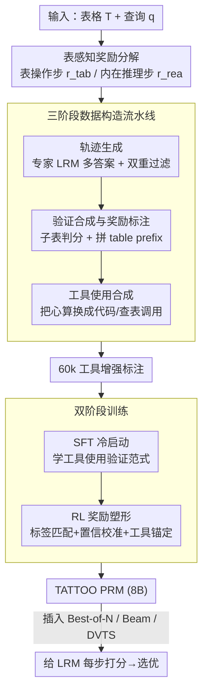

# TATTOO: Tool-Grounded Thinking PRM for Test-Time Scaling in Tabular Reasoning

**会议**: ICLR 2026  
**OpenReview**: [https://openreview.net/forum?id=zc1ezBrr5m](https://openreview.net/forum?id=zc1ezBrr5m)  
**代码**: 无  
**领域**: LLM推理  
**关键词**: 过程奖励模型, 测试时扩展, 表格推理, 工具集成, 奖励塑形

## 一句话总结
针对通用 PRM 在表格推理上"看不出子表检索对不对、抓不住远距离 schema 依赖"的盲区，本文提出 TATTOO——一个把奖励拆成"表操作奖励 + 内在推理奖励"、并在验证过程中真的调用代码/查表工具的生成式 PRM；用 6 万条工具增强标注做 SFT 冷启动再加 RL 奖励塑形，仅 8B 参数就在 5 个表格推理 benchmark 上把下游策略模型平均提升 30.9%，超过 72B 的 Qwen2.5-Math-PRM。

## 研究背景与动机
**领域现状**：过程奖励模型（PRM）已经成为测试时扩展（TTS）的核心组件——它在推理轨迹的每一步打分 $r_i = R_\theta(a_i \mid T, q, \tau_{<i})$，再聚合成轨迹奖励 $r_\tau$，配合 Best-of-N、Beam Search、DVTS 这些策略筛选/重采样候选答案，从而在不重训模型的情况下提升大推理模型（LRM）的表现。这套范式在数学、代码、科学推理上已被反复验证。

**现有痛点**：但当推理对象从自由文本换成**半结构化表格**时，现成的通用 PRM 几乎失效。作者先做了一组诊断实验：用 Qwen2.5-Math-PRM-72B、Skywork-PRM-7B 等给 DeepSeek-R1-Distill-Qwen-14B 在 TableBench 上的轨迹打分做 Best-of-N。结果发现一旦候选数 $N \geq 8$，三类表格任务的准确率全部触顶（比如 fact-checking 在 $N=\{8,16,32\}$ 上分别是 79.19%、79.82%、79.84%，几乎不再涨），额外的算力被白白浪费。

**核心矛盾**：作者抽样 500 个被 PRM 选中却仍出错的案例，按 13 种表格错误类型归到 4 类推理步骤上，发现 82% 的错误集中在**表检索步**（47.7%）和 **schema 交互步**（34.3%），纯内在推理步反而很少出错。再深挖原因有两条：① 对表检索步，把 LRM 真实检索的子表换成**随机子表**后，PRM 给出的奖励分布几乎不变——说明它根本分不清检索内容对不对；② schema 交互步往往出现在轨迹很靠后的位置，而表检索步在最开头，受自回归 locality bias 影响，模型对远处检索内容的注意力急剧衰减，PRM 又只盯当前局部步、看不到长程依赖，于是这类误读全被漏判。更糟的是 PRM 自己在做表查找/算术时也会算错，把噪声引进监督信号。

**本文目标**：造一个能对表格推理提供可靠步级监督的 PRM——既要分得清表操作步对不对，又要能利用远处的检索上下文，还要不被自己的算术错误污染。

**切入角度**：作者发现一个简单但关键的现象——只要把检索到的子表当作 **table prefix** 拼到 schema 交互步前面，PRM 的监督质量和下游表现就明显改善（绕开了对长程依赖的需求）。问题只是现有 PRM 不会自动识别哪些步是 schema 交互步、也无法保证 prefix 本身正确。这提示：监督表格推理需要的不是更大的模型，而是**表感知的奖励设计 + 工具锚定的验证**。

**核心 idea**：把步级奖励**拆成表操作奖励和内在推理奖励两路**分别监督，并在验证过程中**调用外部表格工具**（代码计算、DataFrame 查表）替代 PRM 自己心算，从而提供精确、可锚定的监督信号。

## 方法详解

### 整体框架
TATTOO 是一个**生成式** PRM：给定表格 $T$、查询 $q$ 和策略模型生成的轨迹 $\tau=(a_1,\dots,a_L)$，它逐步输出每一步的验证理由 $v_i$ 和对应奖励 $r_i$。整条管线分两大块：先用一条三阶段流水线造出 6 万条带工具调用的高质量步级标注，再用"SFT 冷启动 + RL 奖励塑形"的双阶段范式把这套验证能力训进 8B 模型里；训练好的 PRM 在推理时插进任意 TTS 策略给 LRM 的每一步打分。

### 关键设计

**1. 表感知奖励分解：让表操作步和文本推理步各受各的监督**

通用 PRM 把所有步用同一把尺子打分，结果对表检索、schema 交互这类表特异操作完全无感。TATTOO 的第一刀就是按步的类型把奖励拆开：

$$r_i = \begin{cases} r_{i,\text{rea}}, & a_i \in \text{内在推理步} \\ r_{i,\text{tab}}, & a_i \in \text{表检索步或 schema 交互步} \end{cases}, \quad r_\tau = \frac{1}{L}\sum_{i=1}^{L} r_i$$

其中 $r_{i,\text{rea}}$ 衡量纯文本推理是否正确，$r_{i,\text{tab}}$ 衡量表操作是否准确（取值 $\{-1, +1\}$）。这样表操作步就有了一条专门的监督通道，不再被淹没在通用打分里。作者还从理论上给了支撑：Theorem 4.1 证明在一步自然策略梯度更新下，这种可分解奖励对策略提升的贡献下界由 $r_{i,\text{tab}}$ 与 $r_{i,\text{rea}}$ 各自的方差（可区分性）和它们与优势函数 $A^\pi$ 的对齐项**相加**构成——也就是说两路奖励只要各自和优势对齐，就能加性地推动策略改进，这正是分解设计的好处。

**2. 三阶段数据构造流水线：把"专家理由 + table prefix + 工具调用"合成进标注**

要训出会用工具的表感知 PRM，得先有这种数据，而这种步级标注现成没有，所以作者设计了一条可规模化的合成流水线。① **轨迹生成**：用 DeepSeek-R1、Claude-Opus-4.1 等专家 LRM 在 TableInstruct、HybridQA、ToTTo、WikiTQ 等数据上对每个查询采多个答案，再用人工标注 + 专家 LLM 双重验证滤掉低质轨迹，得到轨迹池 $\mathcal{T}_{\text{pool}}$。② **验证合成与奖励标注**：对表检索步，抽出该步检索的子表用 LLM-as-a-judge 判它和查询相不相关，据此给 $r_{i,\text{tab}}\in\{-1,1\}$；对 schema 交互步，先把正确子表当 table prefix 拼到验证理由前面（正是前文诊断出的"prefix is the key"），再按表操作/推理对不对打分；对内在推理步则按常规推理质量打分给 $r_{i,\text{rea}}$。③ **工具使用合成**：把理由里凡是涉及表查找、算术的手工推理，**替换成对应的工具调用及其执行输出**——计算类用 Python/SQL 代码片段做算术与聚合，查表类用 Polars 这样的 DataFrame API 或 CSV/Excel 读取工具取行列单元格。三阶段下来产出 6 万条带完整验证理由和步级奖励的训练实例。这条流水线的价值在于：table prefix 解决了长程依赖，工具调用把 PRM 自己会算错的环节外包给确定性执行，从源头上消除了诊断阶段发现的两类盲区和自身噪声。

**3. 双阶段训练：SFT 学会用工具验证，RL 用工具锚定奖励塑形精修**

有了数据还要把验证能力真正训进模型。先在 6 万条数据上对 Qwen-3-8B 做 **SFT 冷启动**，以语言建模方式自回归地让 PRM 学会三件事：识别准确的子表区域、把检索到的 table prefix 动态拼进每个 schema 交互步、生成带工具调用模式的验证理由。但作者指出大多数生成式 PRM 到 SFT 就停了，监督和工具使用对齐得不够紧。于是第二阶段用改造的 **GRPO** 做策略优化，把原本稀疏的规则奖励换成一个更密集的逐步奖励信号：

$$s_i = \underbrace{\mathbb{1}\{\hat{r}_i = r_i\}}_{\text{标签匹配}} - \lambda_{\text{cal}}\underbrace{\big(-\log R_\theta(r_i \mid T, q, \tau)\big)}_{\text{置信校准}} + \lambda_{\text{tool}}\underbrace{\text{support}(\hat{v}_i)}_{\text{工具锚定}}$$

三项各司其职：**标签匹配**强制预测奖励 $\hat{r}_i$ 等于真值 $r_i$；**置信校准**鼓励模型给真值标签更高概率以稳住训练；**工具锚定** $\text{support}(\hat{v}_i)\in\{0,1\}$ 衡量该步的验证理由有没有正确吸收工具输出，专门激励有效用工具。把逐步 $s_i$ 聚合成轨迹级训练奖励、在组内归一化算组相对优势，再用 GRPO 目标更新 $R_\theta$。消融显示这一阶段是性能关键：RL 让三任务平均准确率从 SFT-only 的 72.3% 升到 78.5%（+10.2%），其中工具锚定项贡献最大，去掉它在 TB-DA 的 $N=32$ 上掉 4.0%。

## 实验关键数据

### 主实验
策略模型固定为 DeepSeek-R1-Distill-Qwen-14B，在 5 个表格推理任务（TableBench 的数值推理 TB-NR / 事实核查 TB-FC / 数据分析 TB-DA、WikiTQ、MMQA）上做 Best-of-N，对比各类步级验证器。下表节选 $N=32$ 的结果：

| 验证器（Best-of-N, N=32） | 参数量 | TB-NR | TB-FC | TB-DA | WTQ | MMQA |
|--------|------|------|------|------|------|------|
| Majority Vote | - | 66.5 | 77.4 | 26.1 | 67.0 | 20.1 |
| Skywork-PRM-7B | 7B | 70.1 | 78.3 | 29.1 | 68.6 | 25.3 |
| GenPRM | 32B | 74.2 | 79.4 | 30.7 | 73.1 | 26.4 |
| Qwen2.5-Math-PRM-72B | 72B | 75.3 | 79.8 | 32.4 | 72.6 | 28.6 |
| **TATTOO** | **8B** | **78.1** | **82.0** | **34.3** | **74.9** | **30.5** |

TATTOO 用 8B 参数在几乎所有任务/所有 $N$ 上都拿到最优或次优，平均把下游策略模型提升 30.9%，参数效率最高达 9×（vs 72B baseline）。更关键的是它**不饱和**：在 TB-NR 上 Qwen2.5-Math-PRM-72B 从 $N=16$ 到 $N=32$ 仅 74.9%→75.3%，而 TATTOO 从 $N=8$ 的 74.2% 一路涨到 $N=32$ 的 78.1%，说明它能持续吃下更多测试时算力。

### 消融实验

| 配置 | TB-NR (N=32) | TB-FC (N=32) | TB-DA (N=32) | 说明 |
|------|------|------|------|------|
| TATTOO (SFT only) | 73.7 | 75.2 | 26.4 | 只做第一阶段 SFT |
| **TATTOO (完整)** | **78.1** | **82.0** | **34.3** | SFT + RL 奖励塑形 |
| w/o 工具锚定 | 74.6 | 76.3 | 30.3 | 去掉 $\lambda_{\text{tool}}$ 项 |
| w/o 置信校准 | 76.2 | 80.5 | 33.2 | 去掉 $\lambda_{\text{cal}}$ 项 |
| rule-based (原始 GRPO) | 73.1 | 75.8 | 28.6 | 用规则奖励替代奖励塑形 |

### 关键发现
- **RL 阶段不可省**：三任务平均从 SFT-only 的 72.3% 提到 78.5%（+10.2%）；而把奖励塑形换回原始规则 GRPO 几乎等于没训（仅微优于 SFT），说明涨点来自奖励塑形本身而非单纯多跑一段 RL。
- **工具锚定项贡献最大**：去掉它在 TB-DA 的 $N=32$ 掉 4.0%，远大于去掉置信校准的平均 1.6%——印证"让验证理由真吸收工具输出"是消除 PRM 自身算术噪声的关键。
- **跨 TTS 策略泛化**：在 Beam Search 上 TATTOO 把均值从 45.0% 提到 54.8%，而 GenPRM 在 51% 左右饱和、Skywork-PRM 始终低于 46%；DVTS 上同样持续随 $N$ 增长而不 plateau。

## 亮点与洞察
- **诊断驱动设计**：全文从"为什么现有 PRM 不行"的对照实验（随机子表替换 + 注意力衰减曲线 + 错误归因）一路推到方法，每个设计点都能对应到一个被诊断出的具体盲区——这种"先验尸后开药"的写法让方法非常有说服力。
- **table prefix 这个小 trick 很巧**：用一个简单的输入改写（把检索子表拼到 schema 步前），绕开了 PRM 必须建模长程依赖这个硬骨头，且直接被吸收进数据构造流水线，是"工程上四两拨千斤"的典型。
- **把工具调用塞进验证而非推理**：以往工具集成多用于策略模型的推理过程，这里反过来让**验证器**用工具，把 PRM 最容易出错的算术/查表外包给确定性执行——这个视角可迁移到任何需要 PRM 做精确计算的领域（代码、科学推理）。
- **奖励分解 + 理论下界**：把奖励按步类型拆开并证明其加性贡献，给"为什么要分两路"提供了原理性而非纯经验的解释。

## 局限与展望
- 工具集成主要面向计算与查表两类（Python/SQL + DataFrame API），对更复杂的表操作（多表 join、嵌套 schema、时序表）是否够用未充分验证。
- 数据构造重度依赖专家 LRM（DeepSeek-R1、Claude-Opus-4.1）和 LLM-as-a-judge 打标，标注质量上限受这些教师模型制约，且 6 万条的合成成本不低。
- 主实验只在 DeepSeek-R1-Distill-Qwen-14B 这一个策略模型上验证，对不同规模/家族策略模型的普适性还需更多证据。
- Theorem 4.1 是"一步自然策略梯度"下的下界直觉，和实际多步 GRPO 训练之间有 gap，更多是定性指导而非严格保证（⚠️ 以原文证明为准）。

## 相关工作与启发
- **vs 通用 PRM（Qwen2.5-Math-PRM / Skywork-PRM / GenPRM / ThinkPRM）**: 它们用统一打分监督文本推理步，本文诊断出这套方法对表检索/schema 交互无感、且会被自身算术错误污染；TATTOO 用表感知奖励分解 + 工具锚定验证补上这两块，仅 8B 就超过 72B/32B 的它们，区别在于"表特异监督 + 工具外包计算"。
- **vs Table-R1 系列**: 那条线用 RL 直接训**策略模型**让它在表上推得更好；本文 RL 训的是**验证器**（PRM），在推理时给任意策略模型的每步打分，二者是"练选手"与"练裁判"的互补关系。
- **vs 生成式 PRM（ThinkPRM / GenPRM）**: 同样输出长链验证理由，但它们止步于 SFT；TATTOO 多了一段以工具锚定为核心的 RL 奖励塑形，把验证与工具使用对齐得更紧，这也是消融里 +10.2% 的来源。

## 评分
- 新颖性: ⭐⭐⭐⭐ 把"奖励分解 + 工具锚定验证"首次系统地用于表格推理 PRM，诊断与方法环环相扣。
- 实验充分度: ⭐⭐⭐⭐ 5 benchmark + 3 种 TTS 策略 + 细粒度奖励项消融，较全面；但策略模型单一。
- 写作质量: ⭐⭐⭐⭐⭐ 诊断—动机—方法逻辑链清晰，图表和理论支撑到位。
- 价值: ⭐⭐⭐⭐ 用 8B 超 72B、且持续随算力扩展，对表格推理的测试时扩展很实用。

<!-- RELATED:START -->

## 相关论文

- [\[ICLR 2026\] Optimal Aggregation of LLM and PRM Signals for Efficient Test-Time Scaling](optimal_aggregation_of_llm_and_prm_signals_for_efficient_test-time_scaling.md)
- [\[ICLR 2026\] TUMIX: Multi-Agent Test-Time Scaling with Tool-Use Mixture](tumix_multi-agent_test-time_scaling_with_tool-use_mixture.md)
- [\[ICLR 2026\] T1: Tool-Integrated Verification for Test-Time Compute Scaling in Small Language Models](t1_tool-integrated_verification_for_test-time_compute_scaling_in_small_language_.md)
- [\[ICLR 2026\] CaTS: Calibrated Test-Time Scaling for Efficient LLM Reasoning](cats_calibrated_test-time_scaling_for_efficient_llm_reasoning.md)
- [\[ICLR 2026\] ROC-n-Reroll: How Verifier Imperfection Affects Test-Time Scaling](roc-n-reroll_how_verifier_imperfection_affects_test-time_scaling.md)

<!-- RELATED:END -->
