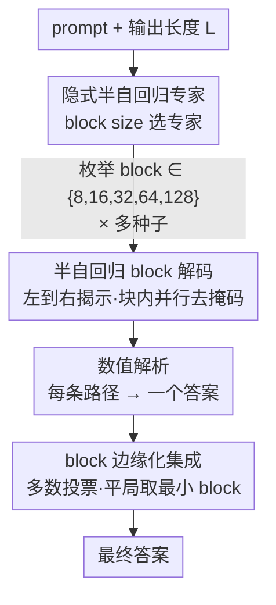

# Test-Time Scaling in Diffusion LLMs via Hidden Semi-Autoregressive Experts

**会议**: ICLR 2026  
**OpenReview**: [https://openreview.net/forum?id=L5y7in91vd](https://openreview.net/forum?id=L5y7in91vd)  
**代码**: [https://github.com/junos-ai-org/Test-Time-Scaling](https://github.com/junos-ai-org/Test-Time-Scaling)  
**领域**: LLM推理 / 扩散模型  
**关键词**: 扩散语言模型, 测试时扩展, 半自回归解码, 隐式专家混合, 多数投票

## 一句话总结
本文发现扩散语言模型（dLLM）在训练时隐式学到了一组"半自回归专家"，不同的 block 解码顺序会激活不同专家；据此提出免训练推理方法 HEX，用多种 block 调度跑出多条生成路径再多数投票，在 GSM8K 上把准确率从 24.72% 提到 88.10%，甚至超过用 GRPO 强化微调过的模型。

## 研究背景与动机

**领域现状**：扩散语言模型（dLLM，如 LLaDA）不像自回归模型那样从左到右逐 token 生成，而是通过"加掩码—去掩码"的迭代过程，理论上可以按任意顺序揭示 token。这种顺序自由度是 dLLM 区别于自回归模型的核心优势。推理时怎么决定"先揭示哪些位置"（即掩码调度 / masking schedule），直接决定了生成质量。

**现有痛点**：主流推理方法靠**模型置信度**来选位置——每步揭示置信度最高（top-K margin）的 token。这套在 Sudoku 这类任务上很有效（7%→90%），但作者在 GSM8K 等推理任务上发现了**反直觉的失败**：top-K margin 只有 24.72%，反而比随机揭示（50.87%）差得多。更糟的是，置信度策略会过早地、过度自信地把 `[AfterEoT]`（文本结束后的填充 token）填满整个尾部，从输出末尾往前倒着生成，导致超过 55.5% 的样本"塌缩"成一片结束符，几乎没有有效输出。

**核心矛盾**：dLLM 的训练目标（公式 (1)）对所有掩码模式**一视同仁地平均**，包括很多"病态"的子问题（如几乎没有上下文时要预测一大片 token）。这些病态条件本身就学不好，模型在它们上面会过度偏向特殊 token（如 `[AfterEoT]`）。于是训练把模型变成了一堆条件分布的集合，质量参差不齐——直接信任单条固定调度，等于把宝押在某个可能没学好的"专家"上。

**本文目标**：找到一种推理策略，既能忠实反映模型训练时真正学好的东西，又能避开置信度崩塌，同时给 dLLM 开辟一个新的测试时扩展（test-time scaling）维度。

**切入角度**：作者把 dLLM 重新解读为一个**隐式的专家混合体**——每个"专家"对应一个特定的可见 token 子集 $U$ 下的条件分布 $p_\theta(x_i \mid x_{\text{prompt}}, x[U])$。在一个玩具例子（"谁发明了电话？"）里，作者枚举对前三个 token 的全部 23 种掩码组合，发现大多数专家都把概率峰值压在正确答案上，只有少数专家给出错误或扁平的分布。既然多数专家"知道答案"，那就不该信任单个专家，而应**跨专家边缘化**。

**核心 idea**：用半自回归（semi-AR）的 block 大小作为"专家选择器"——改变 block size 就能激活不同专家；然后跑多个 block 调度、对最终答案做多数投票，把单条调度的脆弱性变成共识机制。这就是 HEX（Hidden semi-autoregressive EXperts）。

## 方法详解

### 整体框架

HEX 是一个**免训练的推理算法**，直接套在已有的 dLLM（本文用 LLaDA-8B-Instruct）上，不改任何参数。它的核心思路是：与其纠结"哪条解码调度最好"，不如把"block 大小 / 顺序"当成一个**隐变量**，跑一组不同 block 的半自回归解码，每条得到一个答案，最后让这些答案"投票"。

整条流程是：给定 prompt，固定输出长度 $L$（实验用 256，对应 128 步去掩码）；对预设的一组 block size $\mathcal{B}=\{8,16,32,64,128\}$、每个 size 用多个随机种子重复采样（默认每个 5 个种子，共 25 条路径）；每条路径用**半自回归从左到右**的方式解码——把序列切成连续的 block，按 block 从左往右揭示，但 block 内部用扩散并行去掩码；解码完把 token 序列转成文本，做数值解析（去掉 LaTeX、空格、逗号）得到一个答案；最后取所有路径里**出现频次最高**的答案作为输出，平局时选 block size 最小的那条。

### 关键设计

**1. 把 dLLM 看成隐式半自回归专家混合体：block size 当专家旋钮**

这一设计直接针对"单条固定调度会塌缩"的痛点。作者从训练目标出发：dLLM 学到的是一大家族条件分布 $\{p_\theta(x_i \mid x_{\text{prompt}}, x[U])\}$，按可见集合 $U$ 索引，每个 $U$ 就是一个"专家"。理想的推理是把这些专家按门控权重 $\pi(U\mid x_{\text{prompt}})$ 加权混合：

$$p_{\text{mix}}(x_i = a \mid x_{\text{prompt}}) = \sum_U \pi(U \mid x_{\text{prompt}})\, p_\theta(x_i = a \mid x_{\text{prompt}}, x[U]).$$

但专家数量是指数级（第 $N$ 个 token 有 $2^{N-1}$ 个上下文），门控 $\pi(U)$ 又不可观测，直接估计 $p_{\text{mix}}$ 没法做。本文的关键观察是：**不同的 block size 天然对应不同的可见集合 $U_b$**，所以调 block size 就等于"切换专家"。这把一个抽象的、指数大的混合问题，降维成"枚举几个 block size"这种可操作的旋钮——这是后面所有设计的地基。

**2. 半自回归从左到右 block 解码：堵住 `[AfterEoT]` 塌缩**

纯随机顺序或单个超大 block 的并行解码，会制造出模型训练时几乎没见过的"病态部分上下文"，于是模型在尾部胡乱灌 `[AfterEoT]` 或重复。半自回归（semi-AR）的做法是：固定 block 大小 $b$，把序列切成连续块 $M_t = \{(t-1)b+1, \dots, \min(tb, n)\}$，**按块从左到右**揭示（保留语言天然的前缀结构），但每个块**内部**仍用扩散并行去噪。这样既保住了"先定左边、再定右边"的因果性，又保留了块内并行的效率。

这一步的效果很硬：消融表（Table 1）显示，非半自回归（单大块并行）在 GSM8K 上塌缩率 55.80%、准确率仅 22.52%；换成半自回归后塌缩率降到 **0.00%**、准确率升到 76.27%（MATH 同样从 16.60% 升到 32.80%）。直觉上，先锁定输出左半部分，能防止模型过早地猜测长度、或被高置信度的尾部 token 带偏。

**3. block 边缘化集成 + 多数投票：用共识替代置信度**

有了"block 选专家"和"半自回归保稳"，还需要一个聚合规则把多个专家的预测合成一个答案。HEX 不去估计 $p_{\text{mix}}$，而是用蒙特卡洛近似——对一小组 block 调度 $b\in\mathcal{B}$ 各采一条路径、各查询一个专家 $U_b$，再平均：

$$p_{\text{mix}}(x_i = a \mid x_{\text{prompt}}) \approx \mathbb{E}_{b\sim\mathcal{B}}\big[p_\theta(x_i = a \mid x_{\text{prompt}}, x[U_b])\big],\qquad \hat{a} = \arg\max_a p_{\text{mix}}(x_i = a \mid x_{\text{prompt}}).$$

实际实现进一步简化为**对最终答案做多数投票**：每条路径解析出一个数值答案，取出现频次最高的值；若平局（两个值频次并列最高），选 block size 最小的那条路径产出的答案。这一步把"跟随单点置信度"换成了"寻求多条路径的共识"——不同 block 调度会犯不同的错，但倾向于在正确答案上达成一致，投票正好抵消掉调度特有的错误。消融（Table 3）证实，这正是 HEX 的核心驱动力：基于似然（取 NLL 最低的候选）反而很差（ARC-C 上 60.84%，甚至不如随机的 70.05%），而基于频次的多数投票拿到 74.57%，说明"共识"比"置信度"可靠得多。

### 一个例子：2024 图灵奖得主

问"请简要说明谁获得了 2024 年图灵奖"（正确答案是 Andrew Barto 和 Richard Sutton）。如果只用某一个 block size 解码，模型可能因为某条调度产生错误的首字（如 Michael、David），并把后续 reasoning 整段带偏。HEX 用 block size 2 到 128 一共十几个调度各跑一遍：少数调度生成了 Michael/David 等错误名字，但大多数调度都收敛到 Andrew——把这十几条路径的答案做频次统计，最高频的就是 Andrew，正好对应那条走对了推理的路径。错误答案因为彼此不一致而被稀释，正确答案因为被多条独立路径反复命中而胜出。

## 实验关键数据

### 主实验

模型统一用 LLaDA-8B-Instruct；输出长度 256、128 步去掩码、每步揭示 2 个 token；HEX 用 block size $[8,16,32,64,128]$、temperature 0.9、每个 size 5 个种子（共 25 条路径）。下表为四个推理基准上的准确率（%）：

| 数据集 | Top-k margin | Random | d1 (GRPO 微调) | HEX (本文) | 相对最佳 baseline |
|--------|--------------|--------|----------------|------------|------|
| GSM8K | 24.72 | 50.87 | 79.80 | **88.10** | +8.30（超过 GRPO） |
| MATH500 | 16.40 | 16.80 | 37.20 | **40.00** | +2.80（超过 GRPO） |
| ARC-C | 54.18 | 70.05 | 82.68 | **87.80** | +5.12（超过 GRPO） |
| TruthfulQA | 28.36 | 42.40 | — | **57.46** | +15.06（无 GRPO 数据） |

最亮眼的是：HEX **完全不训练**，却在 GSM8K / MATH / ARC-C 三个基准上全面超过需要昂贵强化学习微调的 d1 (GRPO)；相比 top-K margin，GSM8K 上准确率提升达 3.56×（24.72%→88.10%）。

### 消融实验

| 配置 | 关键指标 | 说明 |
|------|---------|------|
| 非半自回归（单大块并行） | GSM8K 准确率 22.52%、塌缩率 55.80% | 容易 `[AfterEoT]` 塌缩 |
| 半自回归 block 解码 | GSM8K 准确率 76.27%、塌缩率 0.00% | 塌缩被完全消除（Table 1） |
| 似然选择（取最低 NLL 候选） | ARC-C 60.84% | 甚至不如随机解码的 70.05%（Table 3） |
| HEX 频次多数投票 | ARC-C 74.57% | 共识比置信度可靠 |
| 动态 block 数 5→30 | GSM8K 81.96%→84.15%，平局率减半 | block 多样性越高越好（Table 2） |
| HEX ×5 seeds（完整） | GSM8K 88.10%，平局率 1.36% | 结构化多样性（固定 block 集 + 多种子）最强 |

### 关键发现
- **半自回归约束是稳定性的来源**：去掉它（纯并行大块）直接 50%+ 样本塌缩成结束符，这是置信度方法在推理任务上失败的根因。
- **共识 > 置信度**：基于似然（NLL）的重排序在多个数据集上甚至打不过随机解码，而基于答案频次的多数投票才是真正涨点的来源——说明 HEX 的增益来自"专家集成的一致性"，而非"挑置信度高的"。
- **可预测的测试时扩展**：随投票样本数增加，准确率单调上升、平局率（歧义指标）稳步下降，四个基准上趋势一致；采样越多线性增加算力，于是 HEX 给出了一个"算力换准确率"的可调旋钮。
- **结构化多样性最优**：固定 block 集 + 多种子 比随机动态 block 调度涨点更多。

## 亮点与洞察
- **把"解码顺序"提升为一个全新的 test-time scaling 维度**：自回归模型的测试时扩展靠 CoT、self-consistency、加算力；本文指出 dLLM 还有一个独有维度——掩码/block 调度的边缘化，这是只属于扩散语言模型的杠杆。
- **"dLLM = 隐式专家混合"这个视角非常解释力强**：它一举解释了多个怪现象——为什么模型会过早停止生成（病态专家偏向 `[AfterEoT]`）、为什么看着很自信却答错（信了没学好的专家）、为什么随机反而比置信度好（随机相当于盲目但无偏地采样专家）。
- **免训练却超过 RL 微调**，这个对比极有冲击力：它暗示很多 dLLM 的推理能力是"潜伏"的，问题不在模型容量而在推理时的调度选择，调度对了就能解锁。
- **可迁移性**：把"调度/顺序当隐变量、跨调度集成投票"的思路，可以迁移到任何具备生成顺序自由度的模型（如其他离散扩散、any-order 自回归），用共识对冲单条路径的脆弱性。

## 局限与展望
- **推理算力开销大**：默认要跑 25 条路径（5 block × 5 seed），是单次解码的 25 倍，虽然可调但天花板由预算决定。
- **只在推理任务上验证**：GSM8K/MATH/ARC-C/TruthfulQA 都是有唯一正确答案、便于多数投票的任务。对开放式生成（故事、长对话、图像）这类没有"频次可投票答案"的场景，多数投票的聚合规则未必适用，作者自己也把这列为未来工作。
- **缺乏理论支撑**：HEX 用蒙特卡洛 + 多数投票近似理想的专家混合 $p_{\text{mix}}$，但门控 $\pi(U)$ 不可观测、近似误差没有理论刻画，作者承认尚无理论理解。
- **可改进处**：当前 block 集 $[8,16,32,64,128]$ 和种子数是手工固定的；若能根据 prompt 自适应地选 block 集、或学一个轻量门控来加权不同专家而非等权投票，可能在更少路径下达到同样精度。

## 相关工作与启发
- **vs Top-K margin（Kim et al. 2025）**: 他们靠单点置信度逐步揭示高置信 token，本文证明这在推理任务上会塌缩（`[AfterEoT]` 倒灌）；HEX 改用跨调度共识，区别在于"信局部置信度"还是"信多路径一致性"，本文在 GSM8K 上 88.10% vs 24.72%。
- **vs Random 解码（Nie et al. 2025b, LLaDA）**: 随机揭示虽无偏但单条路径仍脆弱；HEX 在半自回归约束下多调度投票，把随机的"无偏"升级成"无偏 + 共识"，GSM8K 50.87%→88.10%。
- **vs d1 (GRPO) 强化微调（Zhao et al. 2025）**: 他们用 RL 微调改善 dLLM 推理，需要昂贵训练和数据；HEX 完全免训练，仅靠推理时集成就在三个基准上反超，说明能力本就潜伏在预训练模型里。
- **vs 自回归的 self-consistency（Wang et al. 2022）**: 思路同源（采样多条 + 多数投票），但 HEX 的"多样性"来自 dLLM 独有的 block 调度维度，而非温度采样的随机性，是把 self-consistency 迁移到扩散语言模型上的恰当形态。

## 评分
- 新颖性: ⭐⭐⭐⭐⭐ "dLLM = 隐式半自回归专家"的视角 + block 调度当 test-time scaling 维度，角度新且解释力强。
- 实验充分度: ⭐⭐⭐⭐ 四个推理基准 + 塌缩率/似然vs频次/block多样性/扩展曲线多组消融扎实，但任务局限于有唯一答案的推理。
- 写作质量: ⭐⭐⭐⭐⭐ 从"反直觉失败"一路推到机制再到方法，叙事清晰，玩具例子很到位。
- 价值: ⭐⭐⭐⭐⭐ 免训练超过 RL 微调，给 dLLM 推理提供了即插即用且可扩展的实用方法。

<!-- RELATED:START -->

## 相关论文

- [\[ICLR 2026\] Plan and Budget: Effective and Efficient Test-Time Scaling on Reasoning LLMs](plan_and_budget_effective_and_efficient_test-time_scaling_on_reasoning_large_lan.md)
- [\[ICLR 2026\] Optimal Aggregation of LLM and PRM Signals for Efficient Test-Time Scaling](optimal_aggregation_of_llm_and_prm_signals_for_efficient_test-time_scaling.md)
- [\[ICLR 2026\] ROC-n-Reroll: How Verifier Imperfection Affects Test-Time Scaling](roc-n-reroll_how_verifier_imperfection_affects_test-time_scaling.md)
- [\[ICLR 2026\] Mode-conditioning unlocks superior test-time compute scaling](mode-conditioning_unlocks_superior_test-time_compute_scaling.md)
- [\[ICLR 2026\] CaTS: Calibrated Test-Time Scaling for Efficient LLM Reasoning](cats_calibrated_test-time_scaling_for_efficient_llm_reasoning.md)

<!-- RELATED:END -->
