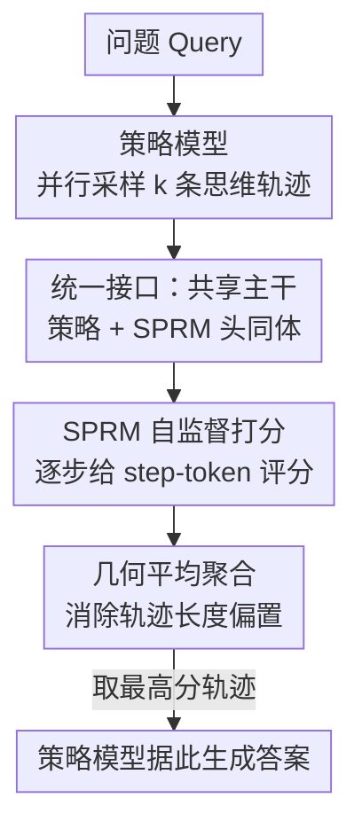

# Test-Time Scaling with Reflective Generative Model

**会议**: ICLR 2026  
**OpenReview**: [https://openreview.net/forum?id=tF56uyxdDy](https://openreview.net/forum?id=tF56uyxdDy)  
**代码**: https://github.com/MetaStone-AI/XBai-o4/  
**领域**: LLM推理  
**关键词**: 测试时扩展, 过程奖励模型, 自监督, 推理轨迹选择, 反射式生成

## 一句话总结
本文提出反射式生成模型（RGM），让一个网络既当策略模型生成推理轨迹、又当过程奖励模型给轨迹打分——只额外加 50M 参数的 SPRM 头，并用自监督的 SPR Loss 摆脱过程级标注，使 32B 模型在 AIME24（84.2 vs. 79.6）上超过 OpenAI o3-mini，且打分性能胜过 72B 级奖励模型。

## 研究背景与动机

**领域现状**：测试时扩展（Test-Time Scaling, TTS）是当下提升推理能力的主流手段，分两类。内部 TTS（也叫 sequential TTS）靠长 CoT 把思考过程拉长，让模型自我纠错；外部 TTS（也叫 parallel TTS）则并行采样多条推理轨迹，再用一个奖励模型当"裁判"把最好的那条挑出来，代表算法有 Best-of-N、Beam Search、Diverse Verifier Tree Search 等。已有研究表明，过程奖励模型（PRM，逐步打分）比结果奖励模型（ORM，只看最终对错）更能提升外部 TTS 的效果。

**现有痛点**：外部 TTS 这套"策略模型 + 独立 PRM"的范式有两个硬伤。其一是**额外计算**：PRM 是一个独立的大模型（常见到 72B 量级），推理时要再跑一遍，参数和算力开销翻倍，严重限制了实际部署。其二是**昂贵标注**：训练一个高质量 PRM 需要大规模的过程级（step-level）标注，而精确标出"哪一步推错了"既难又贵。

**核心矛盾**：PRM 越细粒度越有用，但细粒度恰恰意味着既要独立的大参数量裁判、又要逐步的人工标注——效果和成本之间存在尖锐的 trade-off。已有用蒙特卡洛估计自动打过程标签的工作（只用最终答案当监督）又会引入噪声：一条推理过程错了但最终答案蒙对了，这种样本会污染标签。

**本文目标**：在外部 TTS 框架下，既要保留过程级打分的好处，又要（1）消掉独立 PRM 的参数/计算开销，（2）甩掉过程级标注的依赖。

**切入角度**：作者观察到策略模型和 PRM 其实可以共享同一套主干网络——生成轨迹和给轨迹打分本质上都依赖对推理过程的理解，没必要养两个独立大模型。同时，过程级判别能力或许可以纯靠"最终答案对不对"这一个信号自监督地学出来。

**核心 idea**：提出一种"反射式生成形式"（Reflective Generative Form），让单个网络共享主干、用一个轻量任务头同时完成"生成推理轨迹"和"给推理轨迹打分"，并用自监督损失从结果奖励里直接学出过程判别能力。

## 方法详解

### 整体框架

RGM 把传统外部 TTS 里"策略模型 + 独立 PRM"的两段式范式，压成"一个共享主干网络 + 一个轻量打分头"的统一形式。形式化地，反射式生成形式可写作：

$$\text{answer} = \text{LLM}_{\text{answer}}\Big(\arg\max_{i\in[1,k]} \text{LLM}_{\text{SPRM}}\big([\text{LLM}_{\text{thinking}}(\text{query})]_i\big)\Big)$$

其中 $\text{LLM}_{\text{answer}}$、$\text{LLM}_{\text{SPRM}}$、$\text{LLM}_{\text{thinking}}$ **三者共享同一个主干**。整条推理链路是：给定问题 → 策略模型并行采样 $k$ 条思维轨迹 → 共享主干上的 SPRM 头给每条轨迹逐步打分、再聚合成一个最终分 → 选最高分那条轨迹 → 策略模型据此生成最终答案。训练时，策略模型用 GRPO 优化，SPRM 头用自监督的 SPR Loss 优化，二者在同一网络里端到端联合训练。

### 关键设计

**1. 统一接口：策略模型与 PRM 共享主干，只加 50M 打分头**

这一设计直击外部 TTS"独立 PRM 计算翻倍"的痛点。RGM 不再单养一个奖励大模型，而是让 PRM 和策略模型共用同一套主干网络，只在主干上挂一个轻量的 SPRM 头：它是个二分类器，结构为 $\text{Linear}(c, 2c) \to \text{ReLU} \to \text{Dropout}(0.5) \to \text{Linear}(2c, 1)$，其中 $c$ 是隐状态通道数，整头只引入约 50M 参数。打分时不取最后一层（最后一层主要编码下一 token 的 logits），而是取**倒数第二层**的隐表示喂进 SPRM 头——倒数第二层保留了对整步更丰富的上下文语义。因为生成和打分共用一次前向、共享同一份表示，单个网络就能并行地"生成轨迹 + 评轨迹"，既省掉了独立 PRM 的参数，又支持端到端联合训练。实验里这个 50M 的 SPRM 头打分效果反而胜过 72B 级的独立奖励模型。

**2. SPRM 自监督过程奖励：只用最终答案对错，学出逐步判别力**

这一设计解决"过程级标注昂贵且有噪声"的痛点。SPRM 用一个自监督的 SPR Loss 训练，完全不需要人工的 step-level 标签：

$$\mathcal{L}_{\text{SPR}} = \frac{1}{N}\sum_{n=1}^{N} \mathbb{I}(y = \hat{y}_n)\cdot \text{BCELoss}(\text{Score}_n, \hat{y}_n), \quad \hat{y}_n = \mathbb{I}(\text{Score}_n > 0.5)$$

其中 $y$ 是策略模型最终答案是否正确，$\text{Score}_n$ 是 SPRM 对第 $n$ 步的过程分，$\hat{y}_n$ 是 SPRM 自己产生的伪标签。关键在那个指示函数 $\mathbb{I}(y = \hat{y}_n)$：**只有当某步的伪标签与最终答案的对错一致时，才更新这一步**。这相当于一个动态过滤——因为"答案对但中间步骤错""答案错但某步对"的情况都存在，直接拿最终对错当过程标签会引入大量噪声；SPR Loss 通过这个一致性过滤，只在"最具代表性"的正确/错误步上做优化，从而逐渐拉大正确步与错误步之间的分数间隙，把过程判别能力自监督地学出来。论文还观察到一个"aha moment"：训练初期正确/错误轨迹的分都一起涨（被正样本主导），直到某一步两条曲线开始分叉（正确轨迹斜率转正、错误轨迹斜率转负），SPRM 才真正学会判别。

**3. 几何平均聚合：消除推理轨迹长度对最终分的偏置**

逐步打完分还要聚合成一个轨迹级最终分。先做**步骤切分**：直接复用策略模型 tokenizer 里已有的 token，把含 `.\n\n` 的 token 当作 step-token 来切分轨迹（连续 step-token 只保留第一个，开头的 step-token 忽略），不需要为分步引入额外 token 或微调。聚合时，Lightman 等人原本用过程分的**连乘**，但连乘会让步数多的长轨迹分数被一路压低，导致最终分对长度过度敏感。RGM 改用过程分的**几何平均**：

$$S_{\text{final}} = \left(\prod_{n=1}^{N} \text{Score}_n\right)^{\frac{1}{N}} = \left(\prod_{n=1}^{N} \text{SPRM}(f_{\text{token}_n})\right)^{\frac{1}{N}}$$

其中 $N$ 是步数、$f_{\text{token}_n}$ 是第 $n$ 个 step-token 的表示。开 $N$ 次方正好抵消了步数的影响，让长短不一的轨迹能公平比较。消融显示几何平均明显优于连乘、也略好于算术平均。推理时就用这个 $S_{\text{final}}$ 在 $k$ 条候选里取 argmax，选出最优轨迹交给策略模型作答。

### 损失函数 / 训练策略
策略模型用 GRPO（Group Relative Policy Optimization）优化，SPRM 头用上面的 SPR Loss 优化，二者在同一网络端到端联合训练。训练数据从 NuminaMath、OpenR1-Math-220k、DeepScaleR、LIMR、OREAL-RL 等公开数学数据采样，经难度分类模型过滤掉简单题、再按通过率采样，最终得 40k 条样本。在 64 张 H200 上训练，batch size 128、响应长度 32k，跑 80 个 iteration（QwQ-32B 因 aha moment 出现较晚训到 140 步）。推理时数学任务输出长度 38k，采样温度 GPT-OSS-20B 用 1.0、其余 0.6。

## 实验关键数据

### 主实验

在 4 个数学 benchmark（AIME24/25、BRUMO25、HMMT25）+ 1 个 OOD 编程 benchmark（LiveCodeBench）上评测，指标为 Pass@1（重复 64 次取平均），TTS 时采样 8 个候选。对比的是两个 72B 级奖励模型 Qwen2.5-Math-RM-72B（ORM）和 Qwen2.5-Math-PRM-72B（PRM）。

| 模型 | 方法 | AIME24 | AIME25 | HMMT25 | LiveCodeBench |
|------|------|--------|--------|--------|---------------|
| QwQ-32B | +PRM-72B | 83.3 | 72.3 | 51.7 | 63.0 |
| QwQ-32B | **+RGM8-54M** | **84.2** | **73.4** | **53.1** | **64.0** |
| R1-Distill-Qwen-7B | +PRM-72B | 60.1 | 47.3 | 29.9 | 42.8 |
| R1-Distill-Qwen-7B | **+RGM8-26M** | **66.3** | **48.3** | **33.4** | **44.1** |
| OpenAI o3-mini(med) | — | 79.6 | 74.8 | 53.0 | 67.4 |

QwQ-32B 装上仅 54M 的 RGM 后，在 AIME24（84.2 vs. 79.6）和 HMMT25（53.1 vs. 53.0）上超过 OpenAI o3-mini；7B 模型 +RGM 接近 o1-mini。值得注意的是 50M 量级的 SPRM 打分性能整体压过 72B 量级奖励模型，且只在数学数据上训练的判别力还能泛化到编程任务（Qwen3-32B 的 LiveCodeBench 从 64.6 → 66.2）。

### 消融实验

| 配置 | 关键指标（DeepScaleR-1.5B+RGM8） | 说明 |
|------|------|------|
| 几何平均（Full） | AIME24 53.1 / AIME25 35.7 / HMMT25 21.5 | 完整聚合方式 |
| 算术平均 | AIME24 52.9 / AIME25 35.2 / HMMT25 21.1 | 略低于几何平均 |
| 连乘 Product | AIME24 44.2 / AIME25 31.1 / HMMT25 17.9 | 对长度过敏感，大幅掉点 |
| Process-level（Full） | AIME24 53.1 / LiveCodeBench 26.6 | 用逐步过程分 |
| Outcome-level | AIME24 48.5 / LiveCodeBench 25.7 | 只用最后一步分，掉 4.6 点 |

另外 SPR Loss 对比直接拿最终答案对错当过程监督的 BCELoss：在 1.5B 和 7B 上 SPRLoss 都更优（如 7B+RGM32 的 AIME24 70.2 vs. 69.1），且正确/错误样本的分数间隙更大，说明自监督过滤确实压住了标签噪声。

### 关键发现
- **过程级 vs 结果级**：把 SPRM 退化成只看最后一步（当 ORM 用）后，AIME24 掉 4.6 点、HMMT25 掉 2.7 点，证明逐步过程奖励才是 RGM 增益的来源。
- **聚合方式很关键**：连乘因长度偏置掉到 44.2，几何平均拉回 53.1——一个看似细节的聚合选择直接决定了长轨迹任务上的成败。
- **候选数 $k$ 越大越好**：$k$ 增大性能持续上升，且在各 $k$ 和各模型尺寸下 SPRM 都稳定胜过 72B 奖励模型。
- **MCTS 不如 Best-of-N**：用 SPRM 配 MCTS 做过程级搜索时，搜索 token 从 0 增到 160k，AIME24 从 43.8 升到 52.8，但仍低于 Best-of-N——作者归因于树搜索在长轨迹深层空间下计算开销爆炸、探索不充分。

## 亮点与洞察
- **"一个网络两副面孔"**：让策略模型和 PRM 共享主干、只挂 50M 头，把外部 TTS 从"两个大模型两段式"压成"一个模型一次前向"，参数和计算开销同时大降——这是把"生成"和"评判"统一进单体架构的巧妙工程。
- **自监督拿掉过程标注**：SPR Loss 的核心是那个一致性指示函数，只在伪标签与最终对错一致时更新——用最便宜的结果信号，配上动态过滤，硬是学出了过程级判别力，绕开了 PRM 最贵的那块标注成本。
- **几何平均治长度偏置**：用 $N$ 次方根抵消步数影响这个 trick 简单却关键，可直接迁移到任何"逐步打分后聚合"的场景（如其他 PRM、reranker）。
- **倒数第二层取表示**：刻意避开最后一层（只编码 next-token logits），改用倒数第二层拿整步语义，是个值得复用的细节。

## 局限与展望
- **只在数学数据上训练**：SPRM 的过程判别力主要从数学推理学得，虽展示了向编程/中文任务的泛化，但更广领域（如开放域推理、多模态）的迁移性仍待验证。
- **MCTS 路线受限**：论文坦承 SPRM 配 MCTS 的过程级搜索因计算开销大、探索不充分，反而不如简单的 Best-of-N，说明 SPRM 的过程分目前更适合轨迹级筛选而非深度树搜索引导。
- **step 切分较粗糙**：以 `.\n\n` 这类 token 启发式切分推理步，可能在格式不规范的输出上切错步，影响打分粒度。
- **改进思路**：可探索更鲁棒的语义级步切分、把 SPRM 的过程分用于训练时的轨迹塑形（而非只在推理时筛选），以及在非数学领域补充自监督信号。

## 相关工作与启发
- **vs Qwen2.5-Math-PRM-72B（独立 PRM）**：它是独立的 72B 大模型、需 500k 过程标注；本文用共享主干的 50M SPRM 头 + 零过程标注，参数小三个数量级却打分更准，优势在效率和部署成本，劣势是判别力依赖策略模型主干本身的质量。
- **vs DeepSeek-R1（内部 TTS）**：R1 靠长 CoT 自我纠错，但面临"答案对但过程错"的 false positive 污染；本文走外部 TTS，用独立的过程打分头显式筛选轨迹，且 SPR Loss 的一致性过滤正是针对这种噪声。
- **vs 用最终答案做 MC 估计的 PRM（如 Math-Shepherd）**：它们用蒙特卡洛估计自动打过程标签，但标签噪声大；本文不去估计每步的"真值标签"，而是用 SPRM 自身伪标签 + 最终对错一致性做自监督过滤，思路上更轻、更直接。
- **vs 把生成与评判塞进一个 LLM 的工作（如 Toshniwal 2025）**：它们靠人工设计 prompt、且生成与评判解耦需多次自回归查询；本文在架构和推理管线两层都真正统一，既不要额外模型也不要额外前向。

## 评分
- 新颖性: ⭐⭐⭐⭐⭐ 共享主干统一策略+PRM、自监督 SPR Loss 摆脱过程标注，两个创新都直击外部 TTS 的核心成本
- 实验充分度: ⭐⭐⭐⭐⭐ 5 个模型 × 5 个 benchmark，主实验 + 聚合/损失/过程级/候选数/MCTS 多组消融，对比到 72B 奖励模型和 o3-mini
- 写作质量: ⭐⭐⭐⭐ 形式化定义清晰、图示到位，aha moment 分析有意思，少数细节（MCTS 设置）放附录略简
- 价值: ⭐⭐⭐⭐⭐ 50M 头超 72B 奖励模型、32B 超 o3-mini，且代码开源，对低成本部署高质量 TTS 有很强的实用价值

<!-- RELATED:START -->

## 相关论文

- [\[ICLR 2026\] Optimal Aggregation of LLM and PRM Signals for Efficient Test-Time Scaling](optimal_aggregation_of_llm_and_prm_signals_for_efficient_test-time_scaling.md)
- [\[ICLR 2026\] TATTOO: Tool-Grounded Thinking PRM for Test-Time Scaling in Tabular Reasoning](tattoo_tool-grounded_thinking_prm_for_test-time_scaling_in_tabular_reasoning.md)
- [\[ICLR 2026\] Mode-conditioning unlocks superior test-time compute scaling](mode-conditioning_unlocks_superior_test-time_compute_scaling.md)
- [\[ICLR 2026\] CaTS: Calibrated Test-Time Scaling for Efficient LLM Reasoning](cats_calibrated_test-time_scaling_for_efficient_llm_reasoning.md)
- [\[ICLR 2026\] ROC-n-Reroll: How Verifier Imperfection Affects Test-Time Scaling](roc-n-reroll_how_verifier_imperfection_affects_test-time_scaling.md)

<!-- RELATED:END -->
