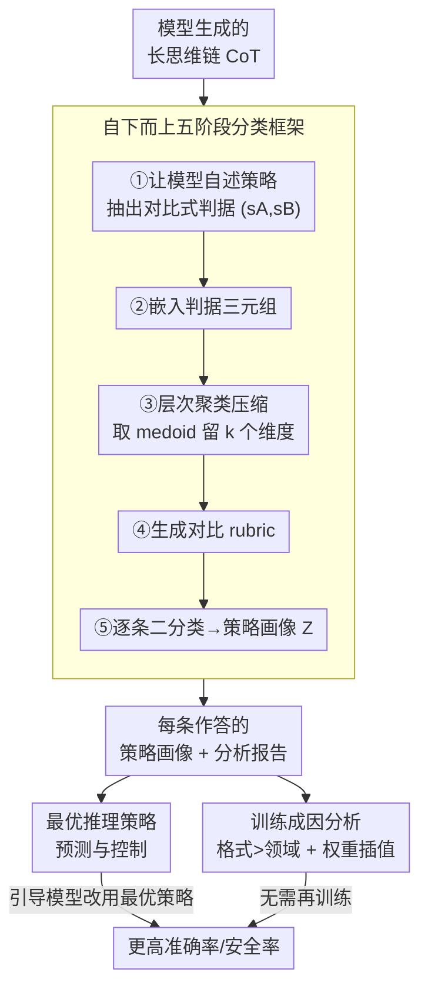

# The CoT Encyclopedia：分析、预测并控制推理模型的思考方式

**会议**: ICLR 2026  
**OpenReview**: [https://openreview.net/forum?id=ugZKZ8vufv](https://openreview.net/forum?id=ugZKZ8vufv)  
**领域**: LLM推理  
**关键词**: 长思维链, 推理策略分类, 可控推理, 自下而上聚类, 安全对齐

## 一句话总结
本文提出 CoT Encyclopedia，一个**自下而上、数据驱动**的框架：从模型自己生成的长思维链里自动挖掘推理策略维度、聚类成可解释的对比式 rubric，再用它预测并主动引导模型采用更优策略——在 5 个基准上把准确率/安全率提升了 12.2–16.1%，还揭示了「训练数据格式比领域更能塑造推理方式」这一关键洞察。

## 研究背景与动机
**领域现状**：长思维链（Long CoT）是现代大模型推理能力的核心要素，模型在作答前会生成大量中间推理步骤，并在长链中混用多种推理策略（验证、回溯、设子目标、逆向链等）。但我们对「模型到底用了哪些策略、不同模型/任务之间策略有何差异、能否系统地控制这些策略」几乎一无所知。

**现有痛点**：以往分析长 CoT 的工作走的是**自上而下**路线——研究者先人为定义一组固定策略类型（如 Gandhi 等人定义的 verification / backtracking / subgoal setting / backward chaining 四种认知行为），再用语言模型去检测它们是否出现。这套做法虽然可解释，但被人的直觉框死了：它只能识别预先定义好的类别，无法捕捉模型真实涌现的、千差万别的策略；而既有的聚类方法又主要针对短/中等长度 CoT，长链多策略交织的场景几乎没人碰。

**核心矛盾**：预定义类别的**覆盖度**与分析的**实用性**之间存在矛盾。本文实验也佐证了这一点——四种预定义认知行为在不同模型间的分布差异极小（$p>0.05$，$|d|\approx 0.1$），几乎区分不出模型，说明固定分类法对细粒度推理差异不敏感，更别说指导模型改进了。

**本文目标**：(1) 不依赖人工先验，自动从数据中发现推理策略维度；(2) 把分析变成可操作的能力——能预测某道题该用什么策略、并把模型引导过去；(3) 搞清楚模型的推理风格究竟由什么训练因素决定。

**切入角度**：与其让人去猜模型在想什么，不如**让模型自己解释**——提示模型用自然语言说出它在某次作答里用了哪些推理策略，把这些解释嵌入语义空间后聚类，自然就浮现出数据本身的策略维度。

**核心 idea**：用「自下而上聚类 + 对比式 rubric」代替「自上而下固定类别」，把推理从一个黑箱变成可分析、可预测、可控制的资产。

## 方法详解

### 整体框架
CoT Encyclopedia 的输入是一批 CoT 作答 $D=\{(x_i,y_i)\}_{i=1}^n$（$x_i$ 是问题，$y_i$ 是模型生成的思维链），输出是每条作答的**结构化策略画像**以及可读的分析报告。整套系统分两层：底层是一个**五阶段的推理分类法构建管线**（从原始 CoT 一路提炼出对比式 rubric 并给每条作答打标签），上层是基于这套分类法的两个落地能力——**最优推理策略的预测与控制**，以及**训练侧的成因分析（格式 vs 领域 + 权重插值）**。

### 关键设计

**1. 自下而上的五阶段推理分类框架：让模型自述策略，再聚类成可解释维度**

这一设计直接针对「预定义类别框死分析」的痛点。框架不预设任何策略类型，而是把分类法的构建拆成五步，全程由大模型驱动：

- **① 判据识别**：给定 CoT 数据集，提示 LLM 头脑风暴出一组分类判据 $C=\{c_1,\dots,c_N\}$。每个判据 $c_j$ 被定义为**一对对比的推理策略** $(s_j^A, s_j^B)$，用自然语言句子表达。例如判据「推理类型」对应 $s^A=$「归纳推理」、$s^B=$「演绎推理」。这一步在实验中从三个 32B 模型的作答里抽出了 **4057 个对比判据**。
- **② 判据嵌入**：把每个三元组拼成一个字符串并用嵌入模型编码，$e_j=E(\text{concat}(c_j, s_j^A, s_j^B))\in\mathbb{R}^d$，得到矩阵 $E\in\mathbb{R}^{N\times d}$。
- **③ 聚类压缩**：4057 个判据高度冗余，于是用**余弦距离上的层次凝聚聚类**把它们压成 $k\ll N$ 个簇。关键细节是每个簇用 **medoid（簇内真实存在的代表判据）而非 centroid** 表示，以保证可解释性。最终在三个基准上收敛出**六大维度**：Analytical Perspective（自上而下 vs 自下而上）、Scope of Approach、Reasoning Type（归纳 vs 演绎）、Idea Development（多路 vs 单路）、Verification Focus（假设驱动 vs 数据驱动）、Clarification Approach。
- **④ Rubric 生成**：对每个代表判据 $c_\ell^*$，让 LLM 生成一份 rubric $R_\ell=(s_\ell^A, s_\ell^B)$，对两侧策略给出详细描述和二分类指引。
- **⑤ 策略画像与报告**：对每条作答 $y_i$、每个 rubric $\ell$，提示 LLM 回答 yes/no——$z_{i,\ell}=1$ 表示对齐 $s_\ell^A$，否则为 $0$。这样得到二值矩阵 $Z\in\{0,1\}^{n\times k}$，每一行就是一条作答的策略画像；再由 LLM 拼接 rubric 模板，合成一段可读的自然语言分析报告（如「该回答呈现自下而上风格，结合数据驱动的验证……」）。

为什么这样有效：判据是从模型真实输出里长出来的，而不是人脑拍脑袋定的，因此能捕捉到固定分类法漏掉的涌现策略；六大维度在统计检验里效应量能到 0.4，远超预定义认知行为的 $\approx0.1$，意味着它真正能区分不同模型/任务的细粒度差异。人类评估也确认了质量：细粒度判据和分组的 Likert 评分达 4.2–4.4，且在盲评的两两对比中，本框架报告以 86% 的 win+tie 率（62% win、24% tie）压过预定义分析器。

**2. 最优推理策略的预测与控制：把诊断变成可操作的提升**

光会分析还不够，本设计要回答「能不能预测某道题该用什么策略、并把模型推过去」。做法分两步。首先估计每个策略的有效性：在六个 helpfulness 判据和七个 harmlessness 判据上，计算 $P(\text{Correct}\mid\text{Pattern})$ 与 $P(\text{Safe}\mid\text{Pattern})$（用 LLM-as-a-judge 评判正确性/安全性以**避免数据泄漏**），从而把每个维度上的两侧策略分成「最优」与「次优」。然后做预测+引导：为每个判据训练一个二分类器，用**初始答对的题**学习其最优策略、用**初始答错的题**做测试；分类器为答错的题预测出该用的最优策略，再把这些策略写进 prompt 让模型重答。

这里有一条贯穿全文的实证支撑——「相似输入、相似思路」：回归分析显示**问题相似度越高，其最优推理策略的相似度也越高**，且策略方差随问题相似度上升而收窄。这意味着可以用「相似历史问题的成功策略」去预测新题该用的策略，预测+控制因此才站得住脚。相比那些只会无方向地生成长推理链的常规做法，本方法是**定向纠错**：找到推理的弱点并精准修正。

**3. 格式重于领域 + 权重插值：揭示并直接操纵推理风格的成因**

前两个设计分析的是「已训好的模型」，这个设计追问「模型为什么训出某种推理风格」。作者用可验证奖励的强化学习（RLVR）做受控实验：在 NuminaMath 上，把同样内容合成成**多选（MC）**与**自由作答（FF）**两种格式以隔离「呈现格式」变量；又对比数学领域与知识领域（OpenBookQA、QASC、SciQ 等）以隔离「领域」变量，训练 7B 的 DeepSeek-R1-Distill 模型，并用第 3 节的 Cohen's $d$ 统计检验衡量策略分布的偏移。

结论很反直觉：**格式差异带来的策略偏移在所有六个判据上都远大于领域差异**。MC 训练的模型倾向**结构化、简洁**的回答，早期就并行探索多个选项，类似广度优先搜索；FF 训练的模型则**冗长、反复验证**，沿单一路径走到底并频繁冒出「wait」之类填充词，类似深度优先搜索（FF 的 wait token 是 MC 的 4.6 倍，8.76 vs 1.89）。作者把这归因于训练时有无答案线索：MC 数据鼓励先评估选项再作答，FF 数据则要求开放式探索、不确定性更高。更进一步，**对 MC 与 FF 两个模型做线性权重插值**，推理策略会随合并比例**平滑过渡**（如 MATH-500 上 Bottom-Up 视角从 85% 一路降到 15%），从而**不需要任何额外训练**就能按任务需求调配推理风格。

### 一个完整示例
以一道初始答错的 GPQA-Diamond 题为例走一遍控制流程：模型第一次作答用的是「次优」策略（比如反复做数据驱动验证却陷入重复计算），CoT Encyclopedia 给它打出策略画像 $Z$ 的某一行；针对这道题，训练好的判据分类器根据「相似题的成功经验」预测出最优策略应为「探索多种方法而非反复验证」；系统把这条策略指令写进 prompt 让模型重答，准确率随之从 61.5% 提升到 72.0%（question-specific 设置）。整条链路把「分析→预测→纠错」串成一个闭环，且全程不改模型权重。

## 实验关键数据

### 主实验：策略引导的性能提升
在五个基准上对比五种设置（未引导 / 引导-次优 / 引导-随机 / 引导-数据集级最优 / 引导-题目级最优），均针对初始答错或不安全的样本。

| 基准 | 指标 | 未引导 | 引导-次优 | 引导-数据集最优 | 引导-题目最优 |
|------|------|--------|-----------|------------------|----------------|
| GPQA-Diamond | Acc. | 61.5 | 60.4 | 70.1 | 72.0 |
| MMLU-Redux | Acc. | 74.0 | 72.2 | 79.1 | 81.3 |
| MATH-500 | Acc. | 78.2 | 75.6 | 84.3 | 87.7 |
| XSTest | Safe | 82.3 | 68.1 | 94.0 | 95.5 |
| WildGuard | Safe | 79.2 | 63.4 | 89.9 | 92.4 |

题目级最优策略一致优于数据集级单一最优；整体提升幅度 12.2–16.1%。值得注意的是「引导-次优」反而把分数压得更低（如 XSTest 从 82.3 掉到 68.1），反向印证了策略选择确实在起作用。

### 分析实验：格式 vs 领域 / MC vs FF

| 对比项 | MC 训练 | FF 训练 | 说明 |
|--------|---------|---------|------|
| 多路探索比例 | 75.4% | 57.4% | MC 更像广度优先 |
| 平均回答长度（token） | 1301 | 2561 | FF 更冗长 |
| 'wait' 总出现次数 | 943 | 4383 | FF 反复验证 |
| 'wait' 平均次数/答 | 1.89 | 8.76 | FF 约为 MC 的 4.6 倍 |

格式差异在六个判据上的 Cohen's $d$ 一致大于领域差异，是本文最重要的「novel insight」之一。

### 关键发现
- **预定义分类法的失效**：四种固定认知行为在不同模型间分布差异极小（$p>0.05$，$|d|\approx0.1$），而本框架判据的效应量可达 0.4，说明自下而上方法对细粒度差异敏感得多。
- **策略可预测**：问题相似度与最优策略相似度正相关，使得「为未见过的题预测最优策略」成为可能。
- **安全的细粒度价值**：进一步拆解发现，鼓励「恶意」意图或把「技术」置于「道德」之上的策略会急剧降低安全率（越狱行为），说明二元 safe/unsafe 标签不够，细粒度策略分析能改进内容审核。
- **权重插值可控**：合并比例不同，各基准的策略过渡曲线不同（MMLU 在 ~50% 处出现交叉，MATH 过渡最陡），说明某些判据对格式更敏感。

## 亮点与洞察
- **「让模型自述策略再聚类」这一自下而上设计**很巧妙：它把「定义分类法」这件本来靠人类直觉的事交给数据，既绕开了预定义类别的覆盖盲区，又通过 medoid 表示保住了可解释性。
- **用「初始答对的题学策略、初始答错的题测控制」**这套划分干净地隔离了控制效果，且用 LLM-as-a-judge 而非 ground-truth 来评分以防数据泄漏，实验设计严谨。
- **「格式重于领域」**是真正让人「啊哈」的发现：长期以来大家关注训练数据的领域覆盖，本文却指出**呈现格式（MC vs FF）**才是塑造推理风格（广度优先 vs 深度优先）的主因，这对数据集与基准设计有直接启示——应重视结构多样性而非只堆领域。
- **可迁移的 trick**：用线性权重插值在两种风格模型间平滑调配推理行为，无需微调，可直接迁移到「按任务定制推理风格」的部署场景。

## 局限与展望
- **依赖 GPT-4o 当评判器**：策略分类用 GPT-4o 输出做评估，可能带入该模型自身的偏见，未必完全代表人类对推理质量的判断。
- **覆盖面有限**：实验只在三个基准、三个模型家族上做，尚未验证到科学推理、代码生成、多模态、小模型/多语言模型等更广场景。
- **依赖指令遵循能力**：策略引导的提升以模型能可靠遵循风格指令为前提，可能限制其在指令微调较弱或低容量模型上的适用性（论文也提到小模型直接 prompt 效果差，需配合数据筛选才有增益）。
- **改进方向**：把评判器换成多模型集成或人类校准，以及把分类法扩展到更多任务/模型，是确认结论普适性的关键。

## 相关工作与启发
- **vs 预定义认知行为分析（Gandhi et al., 2025）**：他们固定四种认知行为做自上而下检测，本文做自下而上数据驱动的判据发现，区别在于覆盖度与对细粒度差异的敏感度（效应量 0.4 vs 0.1），本文优势是能捕捉涌现策略并支持控制，劣势是依赖 LLM 评判器。
- **vs Think patterns / 推理可视化工具（Wen et al. 2025；Zhou et al. 2025）**：他们提供定性洞察或可视化诊断，但缺乏直接的行为控制机制；本文不仅诊断，还能预测并主动引导推理策略。
- **vs CoT 监控（Korbak et al., 2025）**：他们关注「CoT 能否被监控」及其脆弱性，本文则从「能否监控」推进到「如何分解并控制」推理模式，把可解释性进一步转化为可操作的安全/性能提升。

## 评分
- 新颖性: ⭐⭐⭐⭐⭐ 自下而上聚类构建推理分类法 + 「格式重于领域」洞察都很新。
- 实验充分度: ⭐⭐⭐⭐ 五基准 + 人类评估 + RLVR 受控实验扎实，但模型/任务覆盖面仍有限。
- 写作质量: ⭐⭐⭐⭐⭐ 从分析到预测到控制的故事线清晰，图表支撑充分。
- 价值: ⭐⭐⭐⭐⭐ 把推理从黑箱变成可控资产，对性能、安全与数据设计都有实践指导意义。

<!-- RELATED:START -->

## 相关论文

- [\[ICLR 2026\] SIM-CoT: Supervised Implicit Chain-of-Thought](sim-cot_supervised_implicit_chain-of-thought.md)
- [\[ICLR 2026\] CoT-RVS: Zero-Shot Chain-of-Thought Reasoning Segmentation for Videos](cot-rvs_zero-shot_chain-of-thought_reasoning_segmentation_for_videos.md)
- [\[ICLR 2026\] Compositional Generalization from Learned Skills via CoT Training: A Theoretical and Structural Analysis for Reasoning](compositional_generalization_from_learned_skills_via_cot_training_a_theoretical_.md)
- [\[ICLR 2026\] CoT-Evo: Evolutionary Distillation of Chain-of-Thought for Scientific Reasoning](cot-evo_evolutionary_distillation_of_chain-of-thought_for_scientific_reasoning.md)
- [\[ICLR 2026\] Uni-CoT: Towards Unified Chain-of-Thought Reasoning Across Text and Vision](uni-cot_towards_unified_chain-of-thought_reasoning_across_text_and_vision.md)

<!-- RELATED:END -->
