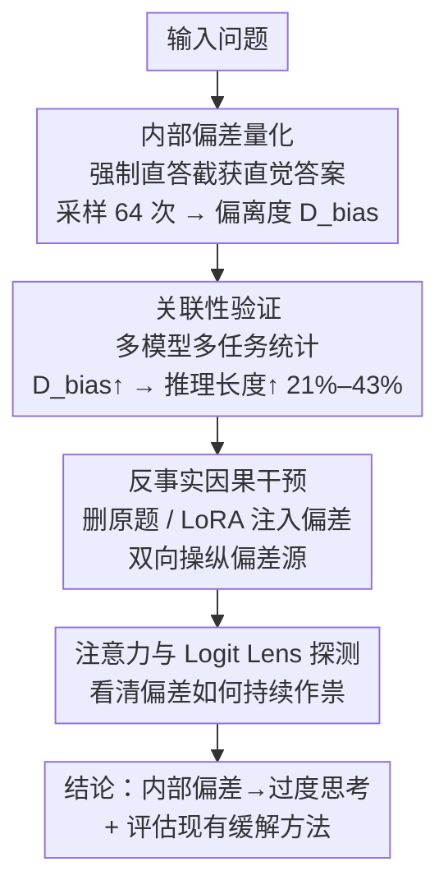

# The First Impression Problem: Internal Bias Triggers Overthinking in Reasoning Models

**会议**: ICLR 2026 (Poster)  
**arXiv**: [2505.16448](https://arxiv.org/abs/2505.16448)  
**作者**: Renfei Dang, Zhening Li, Shujian Huang, Jiajun Chen（南京大学）  
**代码**: 无  
**领域**: LLM 推理 (LLM Reasoning)  
**关键词**: 过度思考, 内部偏差, 推理模型, 因果干预, 注意力机制

## 一句话总结

推理模型在看到问题的瞬间就形成了对答案的"第一印象"（内部偏差），当这个直觉猜测与后续系统推理产生冲突时，模型会反复自我质疑、重新检查，导致推理长度膨胀 21%–43%，而现有所有缓解方法均无法从根本上消除这一效应。

## 研究背景与动机

以 DeepSeek-R1 和 OpenAI o1 为代表的推理模型通过内部 Chain-of-Thought（CoT）进行自我反思和纠错，在复杂推理任务上取得了突破性表现。但它们有一个突出的效率瓶颈——**过度思考（overthinking）**：生成大量冗余的推理步骤（如反复"Wait..."、"Let me re-check..."），既浪费计算资源又不能提升准确率，有时甚至降低最终答案质量。

已有研究主要从**外部行为**层面描述 overthinking（比如推理 token 数与问题难度不匹配），但没有人解释**为什么模型会陷入这种无意义的反思循环**。本文借鉴认知心理学中的**锚定效应（anchoring effect）**，提出了一个全新的因果解释——**"第一印象问题"（The First Impression Problem）**：

- 模型在收到输入问题后、`<think>` 推理正式开始**之前**，其隐状态中已经编码了一个关于答案的初步猜测（称为 **internal bias**）
- 这种"第一印象"不一定被显式输出，但会持久存在于模型的中间层表示中
- 当这个初始猜测恰好与后续推理得出的结论**冲突**时，模型无法"放手"，反复回看原题、反复自我修正，产生大量冗余反思
- 极端情况下，模型甚至会陷入**鹦鹉循环（parroting）**——不断重复相同推理步骤却永远无法收敛到最终答案

## 方法详解

### 整体框架

本文不是提出一个新模型，而是搭了一条递进式的实证链来论证"第一印象"假说。它要回答的核心问题是：推理模型为什么会陷入无意义的反思循环。作者的思路是一步步把这个看不见的"第一印象"逼到台面上——先用强制直答把模型的内部偏差（internal bias）量化成一个数字，再在多模型多任务上验证这个数字和推理长度的统计关联，然后用两组反事实干预把"相关"抬升成"因果"，最后用注意力与 Logit Lens 探测打开黑盒、看清偏差在模型内部到底怎么作祟，顺带评估现有缓解方法为什么治标不治本。四个环节层层递进，前一步的产出（偏差度量 $D_{bias}$）正是后一步的自变量。

### 关键设计

**1. 内部偏差量化：在推理开始前截获模型的"直觉答案"**

要研究第一印象，首先得把这个看不见的初步猜测变成可测量的数字。作者用 **Direct Answer** 方法：给模型拼上 "Answer without thinking more:" 这类强制直答提示，在 `<think>` 推理块真正启动之前就截获输出，拿到直觉答案 $a_{bias}$。单次采样噪声大，于是对每题采样 64 次构成内部偏差分布 $\tilde{a}_{bias}$。有了它，再定义**偏差偏离度（Deviation Degree）** $D_{bias}$ 来刻画直觉与最终推理答案 $a_{final}$ 的距离——数值型任务取平均绝对误差 $D_{bias} = \text{mean}(|a_{bias} - a_{final}|)$，选择题任务则取初始猜测与最终答案的不一致率。$D_{bias}$ 越大，说明第一印象和系统推理越对不上，正是后续所有分析的自变量。

**2. 关联性验证：高偏差的代价全花在首答之后**

在 DeepSeek-R1-671B、QwQ-32B、R1 蒸馏版等多个模型上，横跨 AIME、KnowLogic 等推理 benchmark 做统计：随 $D_{bias}$ 增大，推理长度显著上升，**相对长度增幅 $R_\Delta$ 稳定落在 21.0%–43.1%**。更说明问题的是对**首次得出完整答案位置（First Answer Position）**的测量——无论偏差高低，模型到达第一个逻辑结论的时间点几乎一样，多出来的 token 近乎**全部**是结论之后的反复回看与自我质疑。这把矛头直接指向"得到答案后放不下第一印象"，而非推理本身变难。

**3. 反事实因果干预：双向操纵偏差源验证因果**

相关不等于因果，于是设计两组互补的反事实实验。其一是**移除输入问题（Question Removal）**：在模型生成第一个完整答案后立刻把原题从上下文删掉，逼它只凭已生成的推理链决定是否继续反思，用冗余缩减比 $r = (L_{ori} - L_{rem}) / (L_{ori} - P_{first})$ 度量效果，结果 AIME 2024 上冗余 token **减少 53.5%** 且准确率不降反略升——抽走偏差源，反思就停了。其二是**偏差注入（Bias Injection）**：用 LoRA 把错误偏差注入原本轻松的简单题（Low2Wrong），把正确偏差注入原本困难的题（High2Correct），结果前者让简单题凭空冒出大量冗余反思、后者让困难题的 overthinking 明显消退。一删一注、一正一反，从两个方向钉死了"内部偏差导致过度思考"的因果关系。

**4. 注意力与 Logit Lens 探测：看清偏差怎么持续作祟**

最后用可解释性手段打开机制。注意力动力学显示，在模型即将吐出 "Wait..."、"Let me check..." 触发反思的那一刻，它对原始输入问题的注意力权重会飙到正常推理时的 **4 倍以上**——模型是靠反复"回看"原题来重新激活第一印象。Logit Lens 则给出更刺眼的画面：对一个最终正确推出 $a_{final}=3$、但内部偏差为 $a_{bias}=5$ 的样本，在中后段各层里偏差答案 "5" 的 internal decoding 概率**始终压过**正确答案 "3"，哪怕推理链里早已白纸黑字写出了 "3"。这揭示了一种持续的**认知失调**：直觉猜测与系统推理在模型内部并行共存、互相拉扯，正是过度思考的微观根源。

## 实验关键数据

### 偏差-overthinking 关联实验

在多模型、多任务上验证 $D_{bias}$ 与推理长度的关系：

| 模型 | 任务 | 低偏差组推理长度 | 高偏差组推理长度 | 相对增幅 $R_\Delta$ |
|------|------|:---------:|:---------:|:---------:|
| DeepSeek-R1-671B | AIME | 基准 | 显著增长 | 21.0%–43.1% |
| QwQ-32B | AIME | 基准 | 显著增长 | 范围内 |
| DeepSeek-R1 蒸馏版 | KnowLogic | 基准 | 显著增长 | 范围内 |
| 多模型一致 | 多任务 | 基准 | 显著增长 | **均 >20%** |

关键观察：高偏差组与低偏差组到达**第一个完整答案**的位置基本相同，多出来的 token 全部集中在首答之后的冗余反思区间。

### 反事实干预实验结果

| 干预方法 | 具体操作 | 冗余推理变化 | 准确率影响 |
|---------|---------|:---------:|:---------:|
| Question Removal | 首答后删除原题 | **减少 53.5%**（AIME 2024） | 保持/略升 |
| Low2Wrong 注入 | LoRA 注入错误偏差到简单题 | **显著增加** | 下降 |
| High2Correct 注入 | LoRA 注入正确偏差到困难题 | **显著减少** | 提升 |

### 现有缓解方法评估

| 方法 | 类型 | 能否降低推理长度 | 能否消除偏差影响 ($R_\Delta$) | 准确率影响 |
|------|------|:---------:|:---------:|:---------:|
| FCS (SFT+DPO) | 训练时 | 能降低平均长度 | 否，$R_\Delta$ 未下降甚至恶化 | 复杂任务可能下降 |
| SEAL | 推理时 | 能缩短 | 否，偏差影响持续 | 基本保持 |
| PROBE | 推理时 | 能缩短 | 否，偏差影响持续 | 基本保持 |
| 注意力早退出（本文提出） | 推理时 | 能缩短 | **部分有效**：$R_\Delta$ 从 31.5% → 9.4% | 精度损失微小 |

核心结论：FCS / SEAL / PROBE 等方法本质上只是"截断"推理链，并没有解决内部偏差与推理冲突的根对立问题。唯一有初步效果的是本文提出的**注意力早退出机制**——监控模型对原始问题的归一化注意力，当超过阈值（意味着模型正在重新激活偏差）时直接终止推理。

## 亮点与洞察

1. **从认知心理学到 LLM 机制的完整映射**：将"锚定效应"和 Kahneman 的 System 1/System 2 理论映射到推理模型的行为模式上，发现模型确实存在类似人类的快速直觉（System 1）与慢速推理（System 2）的冲突。这不仅是一个诊断工具，更开辟了用认知科学理论理解 LLM 行为的新路径。

2. **因果推断设计的严谨性**：不满足于简单的相关性分析，通过两种互补的反事实干预（移除偏差源 + 注入偏差）从正反两个方向确立因果关系。特别是 LoRA 偏差注入实验的设计非常精巧：Low2Wrong 和 High2Correct 分别控制了问题难度和偏差方向两个混杂变量。

3. **"负面结果"的重大价值**：系统性地证明 FCS、SEAL、PROBE 等现有方法都无法消除内部偏差，这一发现本身具有重要指导意义——告诉社区表面的推理截断治标不治本，需要从模型架构或训练范式层面寻找根本解决方案。

4. **Logit Lens 揭示的"认知失调"**：在模型已经显式推理出正确答案的情况下，错误的初始猜测在中间层仍保持更高的 decoding 概率，这是一个极其有趣的发现，揭示了推理模型内部"直觉"与"逻辑"并行竞争的动力学。

## 局限与展望

1. **缺乏根本性解决方案**：虽然注意力早退出机制有初步效果（$R_\Delta$ 从 31.5% 降至 9.4%），但这仍然是一种推理时的外部干预，而非让模型本身学会忽略错误直觉。未来可探索在 RL 训练阶段加入"偏差解耦"目标。

2. **模型覆盖有限**：主要在 DeepSeek-R1 和 Qwen 系列的开源推理模型上实验，对 o1、Claude 等闭源商业模型的适用性未知。不同训练范式（纯 RL vs. SFT+RL）下偏差形成机制可能不同。

3. **任务范围聚焦有确定答案的推理**：实验集中在数学（AIME）、逻辑（KnowLogic）等有明确正确答案的任务上。对于开放式生成、创意写作等任务中的 overthinking 尚未探索，偏差的定义和量化在这些场景下也需要重新设计。

4. **偏差提取方法的完备性**："Answer without thinking more" 的直答提示可能无法完整捕获模型隐状态中所有形式的偏差信息。更refined 的探测方法（如训练 probing classifier 直接读取隐状态）或许能获得更精确的偏差估计。

5. **未来方向**：设计显式的 System 1 / System 2 推理架构，让快速直觉通路与慢速推理通路在模型内部解耦；或研究注意力正则化技术减少推理过程中对原始输入的过度关注。

## 相关工作与启发

- **Overthinking 分析**：Chen et al. (2024) "Do not think that much for 2+3=?" 首次系统描述了 o1 类模型的 overthinking 现象，本文在此基础上深入到内部机制层面
- **推理不忠实性**：Arcuschin et al. (2025) 发现 CoT 推理在自然场景下并非总是忠实的，最终答案可能由隐含偏差塑造而非推理链决定，与本文发现相互印证
- **Circuit Tracing**：Anthropic 的研究表明语言模型可能存在独立的"快速估算"神经通路，为本文"内部偏差"的存在提供了机制层面的佐证
- **推理效率优化**：SEAL（隐状态引导）和 PROBE（置信度探测早停）等方法被本文证明只能治标不治本
- 启发方向：**认知科学驱动的 LLM 行为分析**是一条值得深耕的研究路线，System 1/System 2 的区分可能启发全新的推理模型架构设计

## 评分

- 新颖性: ⭐⭐⭐⭐⭐ （"第一印象问题"是一个极具原创性的发现，认知心理学与 LLM 机制分析的桥接非常新颖）
- 实验充分度: ⭐⭐⭐⭐⭐ （关联分析 + 双向因果干预 + 注意力/Logit Lens 可解释性 + 缓解方法评估 + 新方案探索，实验链条完整且严谨）
- 写作质量: ⭐⭐⭐⭐ （概念阐述清晰，"第一印象"类比直觉友好，递进式实验设计的叙事逻辑流畅）
- 价值: ⭐⭐⭐⭐⭐ （对推理模型 overthinking 的根因理解具有里程碑意义，对未来模型设计和训练范式有直接指导价值）

<!-- RELATED:START -->

## 相关论文

- [\[ICLR 2026\] Your Models Have Thought Enough: Training Large Reasoning Models to Stop Overthinking](your_models_have_thought_enough_training_large_reasoning_models_to_stop_overthin.md)
- [\[ICLR 2026\] Sample Smart, Not Hard: Correctness-First Decoding for Better Reasoning in LLMs](sample_smart_not_hard_correctness-first_decoding_for_better_reasoning_in_llms.md)
- [\[ICLR 2026\] Overthinking Reduction with Decoupled Rewards and Curriculum Data Scheduling](overthinking_reduction_with_decoupled_rewards_and_curriculum_data_scheduling.md)
- [\[ICLR 2026\] OR-PRM: A Process Reward Model for Algorithmic Problem in Operations Research](or-prm_a_process_reward_model_for_algorithmic_problem_in_operations_research.md)
- [\[ICML 2025\] Adversarial Manipulation of Reasoning Models using Internal Representations](../../ICML2025/llm_reasoning/adversarial_manipulation_of_reasoning_models_using_internal_representations.md)

<!-- RELATED:END -->
