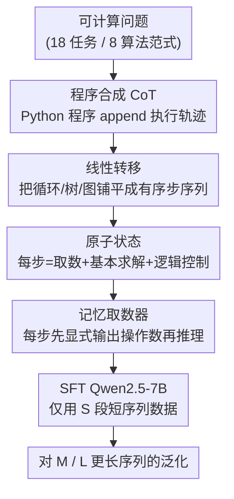

# The Imitation Game: Turing Machine Imitator is Length Generalizable Reasoner

**会议**: ICLR 2026  
**OpenReview**: [https://openreview.net/forum?id=i2IQRtYchF](https://openreview.net/forum?id=i2IQRtYchF)  
**代码**: 无  
**领域**: LLM推理  
**关键词**: 长度泛化, 图灵机模仿, 思维链合成, 可计算问题, 监督微调

## 一句话总结
本文提出 TAIL（Turing mAchine Imitation Learning），用 Python 程序自动合成模仿图灵机执行过程的思维链（CoT）数据，把推理拆成"线性展开 + 原子状态 + 显式取数"三种结构，仅用合成数据微调 Qwen2.5-7B，就在 18 个算法任务上实现了对训练时未见过的更长序列的稳定泛化，并且超过了 DeepSeek-R1（671B）。

## 研究背景与动机
**领域现状**：长度泛化（length generalization）——模型只在短序列上训练却能处理更长输入——是衡量 Transformer 类大模型推理能力的一个核心标尺。思维链（CoT）显著提升了 LLM 的复杂推理能力，但近期研究反复发现：一旦输入长度超出训练分布，LLM 往往会探索并陷入"捷径"（shortcut），最终在长序列上崩盘。

**现有痛点**：已有工作主要走数据驱动路线，通过改造 CoT 结构来增强泛化，例如给符号推理加 Index Hint、给算术加 Reversed Format。但这些技巧都是**任务特定**的——Index Hint 只对位对齐类任务有效，Reversed Format 只适合加法这类问题——既无法迁移到更广的任务，收益也有限。

**核心矛盾**：缺一个**通用且有效**的 CoT 结构。作者观察到这些任务的共性：它们都能被一个良定义、确定性的算法过程求解，而算法天然能处理任意长度的输入。作者把这类任务称为"可计算问题"（Computable Problems）。既然所有可计算问题都能被图灵机求解（Church-Turing 论题），那么让 LLM 在 CoT 里**忠实模仿图灵机执行对应程序的过程**，理论上就能获得不依赖具体任务的长度泛化能力。

**本文目标**：找到一种能跨任务复用的 CoT 结构，让 LLM 像图灵机一样在"记忆带"上一步步做基本操作，而不是靠记忆表层模式或走捷径。

**核心 idea**：用图灵机执行的三个核心性质——状态的线性展开、单步的原子化、对带上数据的显式读写——来约束 CoT 的生成；并且因为图灵机执行可由程序确定性复现，干脆用 Python 程序直接合成这种 CoT 训练数据。

## 方法详解

### 整体框架
TAIL 的核心主张是：**长度泛化不需要"像人一样思考"的语言风格，而需要让 CoT 在结构上对齐图灵机的执行轨迹**。形式上，图灵机是一个 7 元组 $M=(Q,\Sigma,\Gamma,\delta,q_0,B,F)$，其转移函数 $\delta(q_s,a)=(q_{s+1},b,D)$ 表示在状态 $q_s$ 读到符号 $a$、写入 $b$、移动读写头并转移到 $q_{s+1}$；一段完整程序的执行就是状态的线性展开 $q_0\to q_1\to\cdots\to q_n$。作者把 CoT 的每一步 $x_i$ 对齐到一个图灵机状态 $q$，于是整条 CoT $x_0\to x_1\to\cdots\to x_n$ 就是图灵机状态转移的完整铺开。

整个 pipeline 是：对每个可计算任务，写一个求解它的 Python 程序，在程序里按算法步骤插入 append 语句，程序运行时输出的字符串就是一条带三种图灵机性质的 CoT；用这些合成数据对 Qwen2.5-7B 做监督微调（SFT），模型即获得长度泛化能力。三个核心模块从宏观到微观依次是：**线性转移**（Linear Transition）规定整体结构、**原子状态**（Atomic State）约束单步粒度、**记忆取数器**（Memory Fetcher）解决跨距离取数。

### 关键设计

**1. 程序合成 CoT：把图灵机执行轨迹"打印"成训练数据**

痛点是已有数据驱动方法靠人手设计 CoT 格式，既不通用又难保证每步都符合算法逻辑。TAIL 的关键转变是不再让人或大模型去"写" CoT，而是**让确定性的 Python 程序去"跑"出 CoT**：对每个任务写一个标准求解程序，在算法的每个关键步骤插入字符串 append，程序运行结束时拼出的就是一条完整、无错、严格反映程序执行流的 CoT。这样三个核心模块都在程序层面被显式注入——把每个算法步（尤其每次进入循环）当作一个原子状态、把算法过程顺序展开成线性转移、在每步显式打印当前用到的操作数作为记忆取数。作者据此论证 TAIL 是**任务通用**的：只要任务可由程序求解，就能照此构造 CoT，而 Index Hint / Reversed Format 因为结构特异，无法迁移到位匹配之外的任务。训练侧先用只含三模块的极简 TAIL-CoT 验证结构充分性，再用自然语言润色成可读性更好的 TAIL-CoT-styled。

**2. 线性转移：把控制结构铺平，堵住捷径**

根据 RASP-Generalization 猜想，Transformer 在处理含循环这类复杂控制结构的问题时很吃力。线性转移从宏观层面要求：把树、图、循环等结构**完整且无冗余地线性展开**成一串有序推理步，就像图灵机把含循环的程序也压平成 $q_1\to q_2\to\cdots\to q_n$ 的顺序执行一样。这么做的直接好处是消除捷径——传统 CoT 常常把一大块计算塞进一个超大步骤（oversized subtask），模型就有机会在单步内跳过中间过程直接猜结果；强制每一步都显式走到、不许跳跃，模型只能老老实实复现算法，从而把"短序列学到的过程"无缝外推到长序列。消融显示，递归类任务对线性转移尤其敏感。

**3. 原子状态：把单步压到最小，避免步内走捷径**

线性转移只规定了"步要排成线"，没约束"每步多大"。过大的推理步既增加学习难度，也会在单步内部再次诱发捷径。原子状态借鉴图灵机每个状态的固定结构——读数、写数、转移——把每个推理步标准化为三件事：操作数检索（由记忆取数器实现）、该步产生的基本解（elementary solution）、以及一组逻辑控制语句。作者依据 RASP-L 假设要求每个原子状态满足可实现性与简洁性，具体落地为"程序里一个不含内部循环的单一算法步"。把推理切到这种最小粒度后，每一步都简单到 Transformer 能稳定执行，长度增加只是步数线性变多，而非单步难度上升。

**4. 记忆取数器：把"找数"和"算数"解耦**

自回归模型只能 append、不能就地修改已生成的 token，因此 LLM 的上下文实际上是一条只增不减的记忆带；推理越往后，需要用到的操作数离当前位置越远、位置还动态漂移。如果在同一步里既要跨长距离注意力去"找数"、又要"算数"，学习难度陡增。记忆取数器把这两步拆开：(1) 在每个原子状态开头**显式输出本步要用到的全部操作数**，(2) 再基于这些就近的操作数做局部推理并输出结果。例如在 0/1 背包的 DP 里，先把 `dp[9][5]=16`、`dp[9][11]=15` 原样取到当前步，再算 `dp[10][11]=16`。注意力可视化证实：有记忆取数器时，写操作的注意力集中在同一状态内被取出的操作数上（强而聚焦的局部注意力），形似图灵机的读写；去掉它则注意力稀疏紊乱。值得注意的是消融显示它的重要性因任务而异——对迭代类（如 Population Growth）至关重要，对只有局部转移、长程依赖弱的任务（如 Compare Numbers）则没那么关键。

### 一个完整示例：0/1 背包的一步 DP
以"园丁最多种 11 平方米、求最大收益"的 0/1 背包为例。模型先识别这是 DP 问题，把整张 DP 表的填表过程**线性展开**成 Step 1 → Step 2 → … 的有序序列（线性转移）。在 `Step 1. Consider dp[10][11]` 这个**原子状态**里：先经记忆取数器显式写出 `dp[9][5]+6=16`、`dp[9][11]=15` 两个操作数，再做"取/不取第 10 件物品"的基本求解，最后 `Return back to dp[10][11]`，得到 `dp[10][11]=16`。整条 CoT 就是一连串这样的原子状态线性拼接，与图灵机在带上逐格读写、逐状态转移完全同构。

## 实验关键数据

### 主实验
数据集覆盖 8 类经典算法范式、共 18 个任务（含加法这类经典题，但随机化位数与小数位以加大难度），每任务按 Short/Medium/Long 三个长度段各合成 10 万训练样本、500 评测样本。只用 S 段训练，评测 M/L 段是否出现急剧掉点。指标为零样本 pass@1 标签准确率、贪心解码。

| 任务（大数加法） | S | M | L | 说明 |
|------|------|------|------|------|
| Index Hint | 57.0 | 34.5 | 24.0 | 旧数据驱动方法 |
| Reversed Format | 39.5 | 35.5 | 35.0 | 旧数据驱动方法 |
| **TAIL（本文）** | **97.0** | **92.5** | **86.5** | 长序列几乎不掉点 |

跨 18 个任务整体上，TAIL-7B 在标签准确率和长度泛化上同时超过 Qwen2.5-7B Base、Qwen2.5-7B Instruct 与 DeepSeek-R1（671B），且 CoT 长度比推理模型略短。作者归因：推理模型靠"试很多方法 + 抓捷径"绕过结构化推理，而 TAIL 强制逐步执行算法。

### 消融实验
对四类算法各取代表任务，仅在超过训练长度的序列上评 pass@1（取 M/L 平均区间，下表为部分代表值）：

| 配置 | Simulation (M/L) | Iteration (M/L) | Greedy (M/L) | 说明 |
|------|------|------|------|------|
| Qwen2.5-7B Base | 47.4 / 38.6 | 12.4 / 17.0 | 11.2 / 13.0 | 未微调基线 |
| w/o Atomic State | 82.6 / 73.6 | 77.2 / 61.2 | 77.4 / 61.0 | 去原子状态 |
| w/o Linear Transition | 80.0 / 75.4 | 76.2 / 54.0 | 77.4 / 74.2 | 去线性转移 |
| w/o Memory Fetcher | 90.2 / 88.0 | 73.8 / 67.6 | 80.8 / 74.8 | 去记忆取数器 |
| **TAIL（完整）** | **94.2 / 90.0** | **90.0 / 84.4** | **90.2 / 71.8** | 三模块协同 |

### 关键发现
- **去掉任意一个模块，长序列性能都明显下降**：但下降幅度随任务结构而变——记忆取数器对迭代类（Population Growth）关键，对局部转移为主的 Compare Numbers 影响小；递归类任务显著受益于线性转移；几乎所有任务都对原子状态分解敏感。
- **"思考风格"几乎不重要**：极简 TAIL-CoT（只含三模块、无任何拟人语言）与润色后的 TAIL-CoT-styled 最终性能差异极小，说明长度泛化靠的是图灵机结构而非自然语言叙述风格。
- **长度泛化激活（length generalization activation）**：在保持总样本数不变下，只往训练集里掺入极少量长序列（如 S:M:L = 8:1:1），多数未饱和任务的长序列性能就快速饱和。这与以往"训练数据长度要均衡"的结论相反，预示 TAIL 有望以很低成本外推到更长序列。

## 亮点与洞察
- **把"长度泛化"还原成"图灵机模仿"**：用 Church-Turing 论题给"通用 CoT 结构"提供了理论锚点，比逐任务调 CoT 格式更本质——这是全文最"啊哈"的地方。
- **用程序而非大模型合成 CoT**：确定性程序保证每条 CoT 严格无错、三模块天然内嵌，绕开了蒸馏数据噪声大、格式不可控的问题，且零成本批量生成。
- **机制证据**：注意力可视化显示写操作聚焦于同状态内取出的操作数，给"LLM 内部正在执行类图灵机读写"提供了可观测支撑，而不只是性能数字。
- **可迁移 trick**：记忆取数器"先显式取数、再推理"的解耦思路，可迁移到任何需要跨长距离调用中间结果的任务（多跳问答、长程符号计算），缓解长上下文里的检索负担。

## 局限与展望
- **限定在可计算问题**：方法的前提是任务能写出确定性求解程序；对开放式、无明确算法的推理（如常识/创造性任务）不适用。
- **依赖人工写求解程序**：每个任务仍需人写一个正确的 Python 求解器来生成 CoT，任务扩展有人力成本，且程序写错会污染全部数据。
- **CoT 会变长**：原子状态把推理铺平成大量小步，虽然作者称 token 数略少于推理模型，但对极长输入，线性展开的步数仍可能带来推理开销。
- **仅在 Qwen2.5-7B 上验证**：未充分检验该结构在更小/更大模型、或预训练阶段引入时的表现；"长度泛化激活"现象的最优数据配比也只在有限任务上探索。

## 相关工作与启发
- **vs Index Hint / Reversed Format**：它们针对位匹配/算术等狭窄任务设计专用 CoT 格式，结构特异、无法迁移；TAIL 用图灵机这一通用计算模型统一所有可计算问题的 CoT 构造，在大数加法上以 86.5% vs 24–35% 的长序列准确率大幅领先。
- **vs DeepSeek-R1 等推理模型**：推理模型靠拟人化"思考风格"和大量试探，容易抓捷径、在长序列退化；TAIL 证明长度泛化的关键是图灵机式的结构化逐步执行，而非语言风格，用 7B 模型 + 纯合成数据即超过 671B 推理模型。
- **vs Transformer 图灵完备性理论工作**：已有工作证明足够长 CoT 下 Transformer 可达图灵完备，但没给出在广泛任务上构造此类 CoT 的具体方法；TAIL 把"该怎么构造"落地为三个可程序化注入的结构模块。

## 评分
- 新颖性: ⭐⭐⭐⭐⭐ 用图灵机模仿统一长度泛化的 CoT 设计，视角新且有理论支撑
- 实验充分度: ⭐⭐⭐⭐ 18 任务 + 三模块消融 + 数据配比 + 注意力可视化，较全面；但只在单一 7B 模型上验证
- 写作质量: ⭐⭐⭐⭐ 从理论到方法到实验逻辑清晰，图示直观
- 价值: ⭐⭐⭐⭐⭐ 给"如何让 LLM 长度泛化"提供了可复用、可程序化的通用范式

<!-- RELATED:START -->

## 相关论文

- [\[ICLR 2026\] ∇-Reasoner: LLM Reasoning via Test-Time Gradient Descent in Latent Space](nabla-reasoner_llm_reasoning_via_test-time_gradient_descent_in_latent_space.md)
- [\[ICLR 2026\] Generative Adversarial Reasoner: Enhancing LLM Reasoning with Adversarial Reinforcement Learning](generative_adversarial_reasoner_enhancing_llm_reasoning_with_adversarial_reinfor.md)
- [\[ICLR 2026\] When More Is Less: Understanding Chain-of-Thought Length in LLMs](when_more_is_less_understanding_chain-of-thought_length_in_llms.md)
- [\[ICLR 2026\] Generalizable End-to-End Tool-Use RL with Synthetic CodeGym](generalizable_end-to-end_tool-use_rl_with_synthetic_codegym.md)
- [\[ICLR 2026\] InftyThink: Breaking the Length Limits of Long-Context Reasoning in Large Language Models](inftythink_breaking_the_length_limits_of_long-context_reasoning_in_large_languag.md)

<!-- RELATED:END -->
