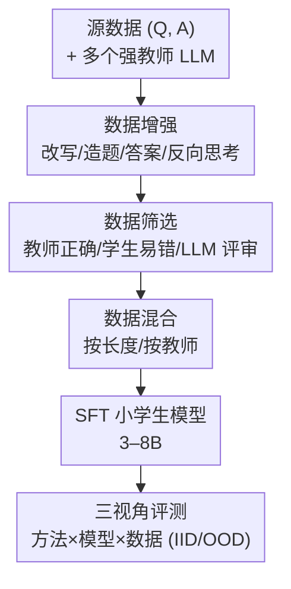

# The Quest for Efficient Reasoning: A Data-Centric Benchmark to CoT Distillation

**会议**: ICLR 2026  
**OpenReview**: [https://openreview.net/forum?id=Dud8FtScW7](https://openreview.net/forum?id=Dud8FtScW7)  
**代码**: 已开源（论文中以匿名仓库提供）  
**领域**: LLM推理 / 思维链蒸馏 / 数据中心方法 / Benchmark  
**关键词**: CoT 蒸馏, 数据增强, 数据筛选, 数据混合, 小模型推理

## 一句话总结
本文提出 DC-CoT——首个**以数据为中心**系统评估思维链（CoT）蒸馏的 benchmark，把"增强 / 筛选 / 混合"三类数据操作放在统一框架下，跨多组师生模型、多类推理任务做大规模实证，得出"数据增强（尤其 Reverse Thinking）收益最大、筛选保质、混合作用有限"等可落地结论。

## 研究背景与动机

**领域现状**：大模型靠思维链（CoT）提示能在多步推理上表现强劲，但最强的推理能力往往绑定在几十上百亿参数的昂贵模型里。知识蒸馏（KD）因此成为把推理能力迁移到 3–8B 小模型的主流手段；其中"数据中心"路线——对教师生成的 CoT 做增强、筛选、混合——因为**架构无关、成本低、只需黑盒文本**而越来越流行。

**现有痛点**：这条路线上的具体技术（问题改写、答案增强、反向思考、教师正确性过滤、LLM 评审过滤、长度/教师混合……）散落在各篇论文里，各用各的师生组合、各测各的数据集，**缺一个统一、可控的 benchmark** 去横向回答"到底哪种操作有用、对谁有用、什么时候有用"。实践者面对一堆 trick 无从取舍。

**核心矛盾**：蒸馏效果同时受三组因素牵制——**用什么数据操作（method）、用什么师生搭配（model）、给多少和什么分布的数据（data）**，而这三者此前从未被放在同一坐标系里对照测量。单看任一篇论文都只能看到局部切片。

**本文目标**：把 CoT 蒸馏拆成三个研究视角系统评测——① Method：各类数据操作如何归类、谁的提升更大；② Model：师生模型的相对大小/架构如何影响效果；③ Data：IID vs OOD、由易到难、数据量等如何左右结果。

**切入角度**：与其再提一个新蒸馏方法，不如**做一个"数据操作的对照实验台"**：固定其余变量，逐一拨动每种数据操作，看小学生模型在统一任务集上的真实变化。

**核心 idea**：用一个抽象变换 $D_{target} = M(D_{source}, \Theta)$ 统一描述所有数据操作，把 $M$ 实例化为增强 / 筛选 / 混合三大类，在多师多生多任务矩阵上跑出"第一份大规模 CoT 蒸馏经验图谱"。

## 方法详解

### 整体框架

DC-CoT 不是一个新算法，而是一套**评测管线 + 实验矩阵**。它的核心是把"教师产出的 CoT 数据"看成可被操作的原料：先由若干强教师（Gemini-1.5-Pro、GPT-4、Claude-3.5、GPT-4.1-mini、o4-mini）对源数据生成 CoT，再把这批数据送进**三类数据操作** $M$——增强（Augmentation）、筛选（Filtering）、混合（Mixing）——得到训练集 $D_{target}$，用它去 SFT 小学生模型（Llama-3.1-8B、Mistral-7B、Gemma-7B、Qwen-2.5 等 3–8B），最后在文本 / 智能体 / 视觉三大类推理任务上评测，并区分 IID 与 OOD。整个过程被组织成"方法 / 模型 / 数据"三个视角的对照实验，回答 10 个研究问题。

### 关键设计

**1. 数据增强：用四种"造数据"操作扩展推理轨迹的多样性**

增强针对的痛点是：单条 vanilla CoT 暴露给学生的推理模式太单一，学生容易"背答案"而非"学推理"。DC-CoT 把增强细分成四种相互独立的操作。**问题改写（Question Rephrasing）** 让教师 $T$ 在保持原义和原答案 $A_i^*$ 的前提下，对问题 $Q_i$ 生成 $L$ 个改写版 $\{\hat{Q}_i^j = T(Q_i, P_{reph})\}$，每个改写问题再生成 CoT 与答案，只有当 $\hat{A}_i^j$ 与原答案一致时才保留。**问题增强（Question Augmentation）** 更进一步，基于种子问题造**全新的平行推理题** $Q_{new} = T(Q, P_{QA})$（如改数值、换主体），强制学生学到底层推理模式而非特定答案，再用同样的"生成-过滤"流程补 CoT。**答案增强（Answer Augmentation）** 固定 $(Q_i, A_i^*)$，让教师以**真值为条件**生成 $L$ 条不同但都通向正确答案的 CoT $\{(R_i^k, A_i^k) = T(Q_i, P_{AA}, \text{temp})\}$，让学生在多条有效逻辑的"交集"上学习——作者发现多样推理路径的收益超过偶发噪声。**反向思考（Reverse Thinking）** 最有特色：对每条 $(Q_i, A_i)$ 先生成前向推理 $R_f$ 并用真值过滤，再用 $(Q_i, A_i)$ 反推一个**反向问题** $Q_b$ 及其反向推理 $R_b$，最后做一致性检查 $c = T(Q_i, A_i, Q_i^b, R_i^b, P_{con})$，只保留 $c=1$ 的四元组 $(Q_i, R_i^f, Q_i^b, R_i^b)$。它逼学生学**双向推理**，因而在数学/逻辑这类需要"逆推"的任务上提升最大。

**2. 数据筛选：用三种选择器从教师 CoT 池里挑出高价值样本**

并非所有 CoT 都同等有用，有些含噪声或干脆错误，筛选的目标是从池子里留下最有学习价值的子集。**教师正确性过滤（Filtering by Teacher Correctness）** 最直接，只保留教师终答与真值一致的样本 $D_{target} = \{(Q_i, R_i, A_i) \mid A_i = A_i^*\}$，保证学生从"结论正确"的链条学习。**学生易错过滤（Filtering by Student Error）** 反其道而行，专挑**学生自己答错**的实例 $D_{target} = \{(Q_i, R_i, A_i) \mid \hat{A}_i \neq A_i^*\}$，把学习集中在学生的薄弱区。**LLM 评审过滤（LLM-as-a-Judge）** 用一个外部 LLM 从连贯性、正确性、清晰度等维度给每条 CoT 打分 $Score_i = L_{judge}(A_i, R_i, Q_i, P_{eval})$，只保留 $Score_i \geq \tau$ 的样本。作者在 SQA/GSM8K 上抽 100 条做人工核对，LLM 评审（GPT-4o）与人类的 Cohen's $\kappa = 0.84$，一致性很强且偏严格——这正是高质量蒸馏想要的偏置。

**3. 数据混合：按长度或教师来源调配训练集的分布**

混合的思路是把不同分布/不同特性的 CoT 拼成更多样的训练集。**长度混合（Length-based Mixing）** 用比例 $\alpha$ 把不同推理长度的 CoT 拌在一起，给学生一个"由简到繁"的平衡课程，试图弥合小模型的可学性鸿沟。**教师混合（Teacher-based Mixing）** 则按比例 $\alpha$ 混合不同教师产出的 CoT，既给学生见识复杂样例、又避免被单一过强教师"压垮"。不过这一类在文本任务上的实证收益相当有限（见实验），更多是"针对特定数据集/模态微调数据复杂度"的工具，而非普适增益。

**4. 三视角评测协议：在方法×模型×数据矩阵上回答十个研究问题**

DC-CoT 真正的贡献载体是这套对照协议，而非单个操作。**Method 视角**用统一任务集横比三类操作；**Model 视角**遍历多教师（含 o4-mini 等小教师）× 多学生（含 R1 蒸馏过的 Llama、Dense/MoE 架构）测"师生匹配性"；**Data 视角**扫种子数据量（25%→100%）、并系统测 IID→OOD 迁移（如 SQA→BoolQ、MATH→GSM8K、WebArena easy↔hard）。任务覆盖文本（SQA/CSQA/ARC/GSM8K/MATH/ANLI/Date）、智能体（WebArena）、视觉（Visual-CoT/OK-VQA/CLEVR）三大类，每个文本分数取三次独立运行的均值，保证结论稳健可比。

## 实验关键数据

### 主实验

下表为 Llama-3.1-8B 学生在三类数据操作下的文本任务平均准确率（节选，分数为三次运行均值）：

| 操作类别 | 代表方法 | 文本平均 Acc(%) | 相对 Vanilla CoT |
|----------|----------|-----------------|------------------|
| 基线 | Vanilla CoT | 34.11 | — |
| 增强 | Rephrase Question | 49.56 | 大幅提升 |
| 增强 | Answer Aug | 57.58 | 大幅提升 |
| 增强 | **Reverse Thinking** | **66.45** | **八任务均值 +24.64%↑** |
| 筛选 | Teacher Correctness | 44.73 | +1.93↑ |
| 筛选 | Judge LLM | 41.04 | 略降 |
| 混合 | Teacher Mixing | 41.97 | −0.83%↓ |
| 混合 | Length Mixing | 41.43 | −1.37%↓ |

黑盒 vs 白盒蒸馏对照（ARC-Challenge，教师 Llama-3.1-70B）：

| 方法 | 需要访问 | Acc(%) |
|------|----------|--------|
| Teacher Baseline | 权重/Logits | 92.4 |
| Standard KD (KL 散度) | 权重/Logits | 64.8 |
| Vanilla CoT (SFT) | 黑盒文本 | 60.4 |
| **DC-CoT (Reverse)** | **黑盒文本** | **69.2** |

即只靠黑盒文本的反向思考增强，反而超过了需要 logits 的白盒标准 KD——说明对推理任务，**显式迁移推理步骤比在输出分布上拉近散度更有效**。

### 消融实验

种子数据量对 Llama-3.1-8B 文本平均的影响（教师 Gemini-1.5-Pro）：

| 数据量 | Vanilla CoT | Reverse | 说明 |
|--------|-------------|---------|------|
| 25% | 64.48 | 60.78 | 低数据量 Vanilla 反而占优 |
| 50% | 65.33（峰值）| 64.62 | Vanilla 在此达峰后下滑 |
| 75% | 57.99 | 70.64 | Vanilla 明显回落 |
| 100% | 49.28 | **75.36** | Reverse 随数据单调走强 |

视觉任务跨架构验证（OK-VQA，含 MoE 的 DeepSeek-VL2）：

| 配置 | Qwen-2.5-VL-8B (Dense) | DeepSeek-VL2 (MoE) |
|------|------------------------|--------------------|
| Vanilla CoT | 59.94 | 45.46 |
| Teacher Filter | 63.80 | **51.82** |
| Teacher Mixing | 61.70 | 48.04 |

### 关键发现
- **增强 > 筛选 > 混合**：对 7–8B 中等学生，"造多样推理"比"挑选/重排已有数据"更有价值；Reverse Thinking 全面领先，尤其结构化逻辑任务（MATH、GSM8K、Date），Answer Augmentation 在常识任务（SQA、CSQA）稳健。
- **可学性鸿沟（Learnability Gap）**：小学生不一定从最强教师学得最好。Qwen-2.5-VL-3B 在 Visual-CoT 上，从 GPT-4-mini（45.44%）、o4-mini（45.20%）蒸馏反而胜过从最大的 GPT-4（42.92%）——超大教师的 CoT 对小模型"太复杂消化不了"。
- **先验蒸馏史会拖后腿**：被 DeepSeek-R1 蒸馏过的 Llama-3.1-8B-R1 再被新教师蒸馏时，文本平均反而略低于原始 Llama-3.1-8B，说明既有特化会干扰对新教师的接受度。
- **传统 scaling law 不普适**：Vanilla CoT 文本性能在 50%（甚至 25%）数据量见顶后随数据增多反而下滑（噪声/低信息样本），而 Reverse 这类高质增强才随数据量单调受益。
- **OOD 迁移普遍正向但不对称**：源任务微调通常显著抬升目标任务 OOD（如 MATH→GSM8K 由 19.64 升到 80.74），但反向（GSM8K→MATH）会掉，视觉任务亦有 OK-VQA↔Visual-CoT 的不对称。

## 亮点与洞察
- **把"数据操作"抽象成统一函数 $M(D_{source},\Theta)$**：让原本零散的改写/增强/过滤/混合落进同一坐标系横比，benchmark 的价值正来自这种"控制变量"的对照设计。
- **黑盒打赢白盒**：DC-CoT(Reverse) 69.2% 超过需要 logits 的标准 KD 64.8%，对"教师不开权重"的现实场景极有指导意义——文本化推理迁移可能本就比分布对齐更契合推理任务。
- **"更强教师不等于更好学生"被量化**：可学性鸿沟以具体数字呈现（小教师反超大教师），提示蒸馏要做"师生容量匹配"而非一味追最大教师，这条经验可直接迁移到任意小模型蒸馏管线。
- **给出按任务类型的配方**：结构化逻辑（数学/代码）→ Reverse + 教师正确性过滤；开放语言（常识/NLI）→ 答案增强 + LLM 评审；智能体/视觉 → 必须 LLM 评审过滤以保证 rationale 与观测对齐。这是可直接抄作业的实践清单。

## 局限与展望
- 作者承认：当前只覆盖 Transformer 架构的师生，未来要扩到非 Transformer 架构，并探索更复杂的选择度量。
- 自己发现的局限：结论主要建立在 3–8B 学生 + 少数几组数据集上，"增强最强、混合最弱"是否在更大学生或更难任务上仍成立存疑；不同任务难度/数据量下的横向数字不宜直接比大小（如混合在个别数据集 CSQA/GSM8K 上其实有正收益，被平均值掩盖）。
- 混合策略整体偏弱可能与 $\alpha$ 配比、教师组合的搜索空间未充分调优有关，benchmark 给的是"默认配置下的快照"而非该类方法的性能上界。
- 改进思路：把增强 × 筛选 × 混合做成可组合的 pipeline 搜索（而非单独评测），并引入成本/Token 预算维度，权衡"造数据收益 vs 教师调用开销"。

## 相关工作与启发
- **vs 经典 Logit-based KD（Hinton 等）**: 经典 KD 需要教师权重/logits 做软标签对齐；DC-CoT 走纯黑盒文本路线，迁移的是显式推理步骤，在 ARC 上反而更高——对闭源教师更友好。
- **vs RevThink / MetaMath / I-SHEEP 等单点方法**: 这些是 DC-CoT 内部某个操作的来源（反向思考、问题改写、LLM 评审），本文的差异在于把它们**统一收编进一个对照 benchmark**，给出谁强谁弱、何时用哪个的横向证据，而非各自孤立宣称有效。
- **vs 通用指令微调（Self-Instruct 等）**: 问题增强刻意约束在"平行推理题"而非泛化造指令，目的是让学生学推理模式而非记答案，针对性更强。

## 评分
- 新颖性: ⭐⭐⭐⭐ 首个数据中心的 CoT 蒸馏 benchmark，贡献在系统化对照而非新算法。
- 实验充分度: ⭐⭐⭐⭐⭐ 多师×多生×多任务×IID/OOD 大规模矩阵，文本结果三次均值，覆盖 Dense/MoE 架构。
- 写作质量: ⭐⭐⭐⭐ 以 10 个研究问题串起结论，逻辑清晰；个别图表数字密集需对照读。
- 价值: ⭐⭐⭐⭐⭐ 给出可直接落地的"按任务选配方"清单与多条反直觉经验（黑盒胜白盒、小教师胜大教师），对做小模型推理蒸馏的实践者很实用。

<!-- RELATED:START -->

## 相关论文

- [\[ICLR 2026\] CoT-Evo: Evolutionary Distillation of Chain-of-Thought for Scientific Reasoning](cot-evo_evolutionary_distillation_of_chain-of-thought_for_scientific_reasoning.md)
- [\[ICLR 2026\] OpenThoughts: Data Recipes for Reasoning Models](openthoughts_data_recipes_for_reasoning_models.md)
- [\[ICLR 2026\] On The Fragility of Benchmark Contamination Detection in Reasoning Models](on_the_fragility_of_benchmark_contamination_detection_in_reasoning_models.md)
- [\[ICLR 2026\] KaVa: Latent Reasoning via Compressed KV-Cache Distillation](kava_latent_reasoning_via_compressed_kv-cache_distillation.md)
- [\[ICLR 2026\] The CoT Encyclopedia：分析、预测并控制推理模型的思考方式](the_cot_encyclopedia_analyzing_predicting_and_controlling_how_a_reasoning_model_.md)

<!-- RELATED:END -->
