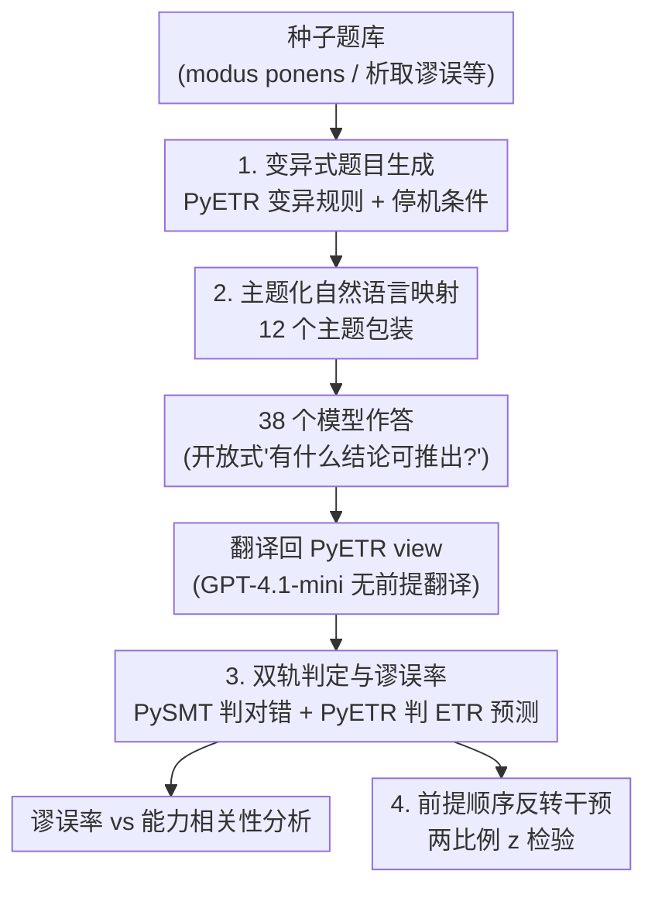

# Theory-Grounded Evaluation of Human-Like Fallacy Patterns in LLM Reasoning

**会议**: ICLR 2026  
**OpenReview**: [https://openreview.net/forum?id=1HjzhdTEC7](https://openreview.net/forum?id=1HjzhdTEC7)  
**代码**: PyETR（ETR 开源实现，论文基于此构建生成管线）  
**领域**: LLM推理  
**关键词**: 推理评测, 认知谬误, Erotetic 理论, 数据污染抗性, 顺序效应

## 一句话总结
本文用认知科学里的 Erotetic 推理理论（ETR）及其开源实现 PyETR 程序化生成 383 道形式化推理题，评测 38 个模型，发现一个反直觉现象：随着模型能力（Chatbot Arena Elo）变强，其逻辑错误中"恰好是 ETR 预测的人类式谬误"的比例反而上升，而整体答对率却和能力无关。

## 研究背景与动机

**领域现状**：LLM 在越来越多复杂任务上表现优异，推理基准上分数节节攀升。评测这些模型时，主流做法是看"错误率"——答对了多少道题。

**现有痛点**：只看错误率丢掉了一个关键维度——**模型是怎么错的**。人类推理的错误不是随机噪声，而是系统性、可复现的谬误（如合取谬误、析取谬误、被无关线索带偏），认知科学几十年来已经把这些谬误的触发条件刻画得很清楚。但 LLM 评测几乎没人去问：当模型答错时，它的错误是否也落在这些人类谬误的模式上？此外，静态推理基准还面临数据污染问题——题目可能早已进入训练集，分数不再反映真实推理能力。

**核心矛盾**：要回答"LLM 错得像不像人"，需要一种能**预先知道正确答案、且预先知道'人会怎么错'**的题目，并且这些题目要源源不断、不会被污染。普通基准做不到这一点——它们既不能预测谬误，也无法无限再生。

**本文目标**：(1) 找一个能形式化预测人类谬误的认知理论，把它变成题目生成器；(2) 用它造一批可无限再生、抗污染的推理题；(3) 在大量模型上量化"错误成分"（error composition），而不只是错误率。

**切入角度**：作者借助 Erotetic 推理理论（ETR）。ETR 用一个统一机制解释人类推理的能力与系统性错误：人推理时维护一组**析取式候选答案**，新信息进来时按"最佳匹配"过滤候选，过滤虽高效但可能过早丢掉相关候选，从而产生特征性谬误。关键是 ETR 不只是定性描述，它有数学形式化和开源实现 PyETR，能**精确判定**某道题会不会触发谬误、人会给出什么错误结论。

**核心 idea**：把 ETR/PyETR 当成"谬误题目工厂"——程序化生成"ETR 预测会答错、且预测了具体错法"的题目，然后看模型的错误有多大比例命中这些预测，以此衡量 LLM 错误与人类谬误的重合度。

## 方法详解

### 整体框架

整个工作可以看成一条流水线：从一个小的"种子题库"出发，用变异规则把它扩展成几百道形式化推理题（每道题的 ETR 预测答案都是一个逻辑谬误），把这些形式化的"view"翻译成 12 种主题包装的自然语言提问，发给 38 个模型作答；模型的自然语言回答再被翻译回 PyETR 的形式表示，用两条独立判据打标签——是否逻辑正确（PySMT 求解器判）、是否命中 ETR 预测（PyETR 判）；最后定义"谬误率"这一错误成分指标，与模型能力做相关性分析，并额外做一次"反转前提顺序"的干预实验来检验顺序效应。

### 关键设计

**1. 变异式题目生成：把认知理论变成可无限再生的谬误题工厂**

普通推理基准是固定题集，既会被污染，又无法保证"题目专门戳人类谬误"。本文从《Reason and Inquiry》一书取一个小种子题库（modus ponens、modus tollens、量化 modus ponens、析取谬误等几类模板），再定义一组对 ETR view 的**变异函数**：引入新谓词/常量/变量、把常量替换成 $\forall/\exists$ 量化变量、合取地插入新原子、析取地新增 state、对原子加/去否定（共 7 类）。生成一道新题的过程是迭代式的：从种子库随机抽一个 view，施加随机数量的随机变异，若 PyETR 判定该题仍有非平凡答案就加入前提列表，不断加 view 直到同时满足三个停机条件——(1) 题目规模合适（各 view 原子数之和落在 4–11，超 11 则回溯）；(2) ETR 预测的结论是单一范畴式结论（不含析取）；(3) ETR 预测的结论是一个**逻辑谬误**。初始生成 400 道，预分析完整性检查剔除 17 道不满足停机条件的，最终保留 383 道。因为题目由 PyETR 机械生成、跨多种领域和结构，它天然抗记忆/污染，且管线可随时再生更大题集——这是相比固定基准的根本区别。

**2. 主题化自然语言映射：在保持形式骨架不变的前提下消除内容效应与污染**

形式化 view 直接喂给模型既不自然、也容易因符号本身的熟悉度引入偏差。作者设计了 12 个主题（如"炼金术士研究神秘物质""研究者鉴定新发现的生物"等），为每个主题建立从逻辑元素到主题元素的固定映射：谓词（如 $Q(x), R(y)$）映射成主题属性（"正在嬗变""正在扭曲时间"），变量映射成主题实体（"宇宙尘埃""生命水银"）。同一道形式题在不同主题下会被包装成完全不同的故事，但底层逻辑结构一字不差。这一步同时服务三个目的：检验推理模式是否对内容鲁棒（对抗 content effect）、检验同一逻辑在不同情境下答案是否一致、以及用训练集里不太可能出现的新场景缓解污染。提示词统一结构——主题前言 + 自然语言前提 + 标准化问句"有什么（如果有的话）结论可以推出？"，并明确告知"可能什么都推不出"，以免诱导模型强行下结论。

**3. 双轨判定与谬误率：把"错得像人"形式化成可计算的错误成分指标**

模型给出的是自然语言结论，要评判必须先转回形式表示。作者用 GPT-4.1-mini 作为翻译层、且**不让它看到原始前提**（只翻译结论本身，避免翻译层替模型"做推理"），人工抽检确认翻译忠实。转回 view 后用两条独立判据打标签：逻辑正确性用 PySMT 检查"结论的否定是否与前提不一致"来判定；ETR 预测性则用 PyETR 的 `default_procedure_does_it_follow` 判定该结论是否为 ETR 所背书。核心指标"人类式谬误"定义为**既被 ETR 预测、又逻辑错误**的回答：

$$\mathrm{HumanLikeFallacy}(m,p)=\begin{cases}1 & \text{ETR-predicted}(m,p)\wedge\neg\mathrm{LogicallyCorrect}(m,p)\\0 & \text{otherwise}\end{cases}$$

进而把"谬误率"定义为人类式谬误占该模型**全部逻辑错误**的比例（注意分母是错误数而非题数）：

$$\mathrm{FallacyRate}(m)=\frac{\sum_{p\in P}\mathrm{HumanLikeFallacy}(m,p)}{\sum_{p\in P}\neg\mathrm{LogicallyCorrect}(m,p)}$$

这一指标刻画的是"模型答错时，错误有多大比例落在可预测的人类推理模式上"，而非传统的"答错多少"。它让分析从错误率转向**错误成分**，是本文方法论上的核心抓手。

**4. 前提顺序反转干预：用经典认知实验范式检验 LLM 的非交换性**

经典逻辑里前提的呈现顺序不影响正确结论，但人类推理存在顺序效应——换个前提顺序会得到逻辑上不同的回答，而且这种非交换性常常能"阻断"谬误。作者把同一批题的前提顺序反转后重新评测，对每个模型用**两比例 z 检验**衡量"反转前提后谬误被阻断（回答变正确）的比例"是否显著。这个干预既是对 ETR 顺序敏感性预测的直接检验，也提供了 LLM 推理是否同样具备人类式非经典性的证据。

### 损失函数 / 训练策略

本文是评测/分析型工作，不训练模型。评测用 Eleuther 的 LM Evaluation Harness 框架，所有模型经 OpenRouter 统一 API 调用；输出 token 上限 3000，推理型模型统一分配 2400 思考 token 以保证公平；总算力消耗不到 \$1000。能力代理指标主要用 Chatbot Arena Elo，并辅以训练算力估计和 HELM Capabilities 分数做稳健性交叉验证。

## 实验关键数据

### 主实验

核心结论是"能力越强、错误越像人"，且这一趋势在三种能力代理上都成立：

| 能力代理 | 相关性检验 | 系数 | p 值 | 结论 |
|--------|------|------|----------|------|
| Chatbot Arena Elo（38 模型） | Spearman ρ | 0.360 | 0.0265 | 谬误率随能力显著上升 |
| Chatbot Arena Elo（指数拟合） | Pearson r | 0.407 | 0.0113 | 同上，拟合更紧 |
| 训练算力估计（19 模型） | Spearman ρ | 0.489 | 0.0334 | 显著正相关，稳健 |
| HELM Capabilities（9 模型） | 指数拟合 r | 0.796 | 0.0103 | 显著，稳健 |

与之形成鲜明对照的是**整体答对率与能力完全无关**：Elo 对逻辑正确率的 Pearson $r=0.004,\ p=0.981$，Spearman $\rho=-0.04,\ p=0.777$。也就是说，更强的模型在这个题集上并没有答得更对，只是答错时错得更"人类"。

### 整体正确率分布与顺序反转干预

| 分析 | 关键数据 | 说明 |
|------|---------|------|
| 整体逻辑正确率（Table 3） | 均值 40.6%，σ=16.7%，范围 18.6%–91.7% | 全体模型在该题集上正确率不高且方差大 |
| 前提顺序反转（Table 4，38 模型） | 多数模型谬误被显著阻断，如 gpt-3.5-turbo-1106 阻断 88.46%（z=4.36），claude-3.5-sonnet 阻断 65.08%（z=4.74，p=2.09e-06） | 反转前提显著降低谬误产生，与人类顺序效应一致 |

### 关键发现

- **能力↑、答对率不变、错误成分却更像人**：这是全文最反直觉的点——scaling 让模型在很多基准上更强，却没让它在这批受控推理题上更"理性正确"，反而把错误推向了可预测的人类谬误模式。
- **错误分析印证 ETR 机制**：人工检查发现模型常"盯住重复出现的对象"、忽略析取候选而下范畴式结论，并在重复信息下错误实例化/错误约束量词——这些正是 ETR 所刻画的"过早过滤候选"失败模式。
- **顺序效应稳健且强**：在大多数模型上，仅仅反转前提顺序就能显著阻断谬误，说明 LLM 的推理和人类一样存在非交换性，而非纯粹的经典逻辑推理。

## 亮点与洞察
- **把认知理论当题目编译器**：用 PyETR 的 `default_procedure_does_it_follow` 既生成题又预测错法，使"正确答案"和"人会怎么错"都先验可知——这是普通基准给不了的，也让"无限再生 + 抗污染"成为生成管线的自然属性。
- **评测维度从错误率转向错误成分**：FallacyRate 把分母设成"逻辑错误数"而非题数，专门刻画"错得像不像人"，这个视角可迁移到任何有"可预测错误模式"的评测场景（如安全、事实性）。
- **翻译层故意不看前提**：用一个小模型做结论的形式化转写、且屏蔽前提，干净地把"模型的推理能力"和"答案的格式/措辞"解耦，避免评测被表达方式污染——这是个可复用的评测工程 trick。

## 局限与展望
- **只是相关、不谈因果**：作者明确强调这是相关性结论，不主张任何因果机制。强模型错得更像人，可能因为它们更多被训练在人类（含谬误）的推理轨迹上，或 RLHF 让推理行为收敛，作者无法区分。
- **正确率无提升可能是天花板效应**：答对率与能力无关，也许是该题集本身对所有模型都偏难造成的 ceiling effect，而非真实推理极限。
- **谓词受限与样本规模**：为简化到自然语言，只用一元（monadic）谓词，表达力弱于完整一阶逻辑（管线称可扩展到多元谓词但未做）；383 题是从 400 题剔 17 题而来，作者因重跑成本未再生更大题集。
- **相关强度中等**：ρ=0.360 数值上不算强，作者用跨架构的稳健性来论证其反映的是基本关系而非偶然，但读者需对效应量保持谨慎。

## 相关工作与启发
- **vs 传统推理基准（如三段论评测）**：以往工作多看 LLM 在固定题集上的错误率，本文转而看错误成分，且题目可无限再生、抗污染，能做"错误如何构成"而非"错了多少"的分析。
- **vs 早期 ETR-on-LLM 工作（Koralus & Wang-Máscianica, 2023）**：本文两位作者的前作首次把 Erotetic 理论用于 LLM，但仅限 GPT 系列、未用 PyETR；本文用 PyETR 实现了内容无关、可无限再生、抗污染的版本，并扩到 38 个模型。
- **vs 人类推理的 mental model 理论**：ETR 在演绎推理任务上匹配并复现了 mental model 的预测，本文借其形式化能力把人类谬误的预测搬到 LLM 评测上，提供了一条认知科学与 LLM 评测对接的范式。

## 评分
- 新颖性: ⭐⭐⭐⭐⭐ 把形式化认知理论 PyETR 变成抗污染题目生成器，并提出"错误成分"评测视角，角度新颖。
- 实验充分度: ⭐⭐⭐⭐ 38 模型 + 三种能力代理交叉验证 + 顺序反转干预，覆盖广；但单元谓词与单一题集规模略限。
- 写作质量: ⭐⭐⭐⭐⭐ 动机、理论、方法、统计处理交代清晰，对因果与局限非常克制诚实。
- 价值: ⭐⭐⭐⭐⭐ 为推理评测提供可复用的生成管线与新指标，对"scaling 是否带来更理性推理"给出反直觉证据。

<!-- RELATED:START -->

## 相关论文

- [\[CVPR 2026\] Human-like Abstract Visual Reasoning via Understanding and Solving Reasoning Loop](../../CVPR2026/llm_reasoning/human-like_abstract_visual_reasoning_via_understanding_and_solving_reasoning_loo.md)
- [\[ICLR 2026\] SceneCOT: Eliciting Grounded Chain-of-Thought Reasoning in 3D Scenes](scenecot_eliciting_grounded_chain-of-thought_reasoning_in_3d_scenes.md)
- [\[ICLR 2026\] Expanding Reasoning Potential in Foundation Model by Learning Diverse Chains of Thought Patterns](expanding_reasoning_potential_in_foundation_model_by_learning_diverse_chains_of_.md)
- [\[ICLR 2026\] TATTOO: Tool-Grounded Thinking PRM for Test-Time Scaling in Tabular Reasoning](tattoo_tool-grounded_thinking_prm_for_test-time_scaling_in_tabular_reasoning.md)
- [\[ICLR 2026\] Semantic Voting: A Self-Evaluation-Free Approach for Efficient LLM Self-Improvement on Unverifiable Open-ended Tasks](semantic_voting_a_self-evaluation-free_approach_for_efficient_llm_self-improveme.md)

<!-- RELATED:END -->
