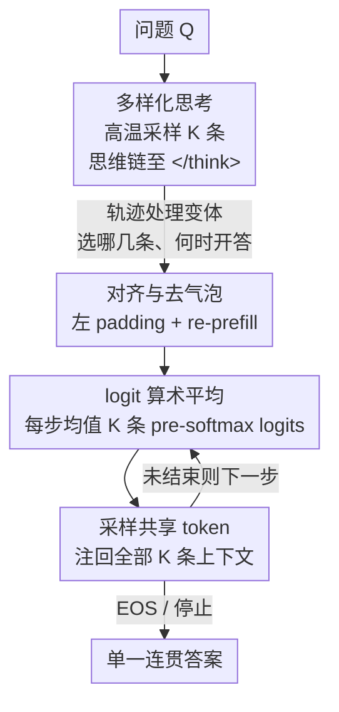

# Think in Parallel, Answer as One: Logit Averaging for Open-Ended Reasoning

**会议**: ICLR 2026  
**OpenReview**: [https://openreview.net/forum?id=hvit36Dyzl](https://openreview.net/forum?id=hvit36Dyzl)  
**代码**: 无（论文承诺待上游 vLLM v1 支持稳定后开源 one-step 变体）  
**领域**: LLM推理  
**关键词**: 并行测试时扩展, logit 集成, 开放式推理, 多数投票, 推理轨迹

## 一句话总结
提出 THINKMERGE：让 LLM 并行跑 $K$ 条推理链、各自思考完后在「作答阶段」逐 token 把它们的 next-token logits 做算术平均再采样，从而把「多数投票」从封闭题扩展到代码生成、深度研究 agent 等无法定义「多数」的开放式任务，训练无关、即插即用。

## 研究背景与动机

**领域现状**：测试时计算扩展是近期 LLM 能力提升的主线。一条路线是「序列扩展」——让模型生成更长的 think 段（o1、DeepSeek-R1）来反复假设、推导、自我纠错；另一条互补路线是「并行扩展」——同时跑多条推理链再聚合证据，其中最有效的就是封闭题上的「多数投票」（self-consistency）。

**现有痛点**：多数投票只在「答案是一个可比较的离散标签」时才成立——数学填空、选择题可以对最终答案点票。但现实中大量任务是**开放式**的：代码生成要输出可执行程序，深度研究 agent 要做 MCP 工具调用、多步规划和长文解释。这些任务里「对完整输出投票」根本无从定义，因为合法解几乎不会逐字重复，没有 canonical answer 可数。

**核心矛盾**：并行采样带来的增益是真实存在的——论文的前置研究表明，无论封闭题（AIME/GPQA）还是开放式的 LiveCodeBench，Pass@$N$ 都随 $N$ 上升，且增益**集中在困难样本**上（hard 子集 Pass@$N$ 涨得最快）。封闭题能用投票把这种「至少有一条对」的覆盖率增益转成准确率，开放式任务却因为投票失效而白白浪费了这部分算力。

**本文目标**：设计一种**不依赖对完整输出投票**的开放式集成机制，把并行思考的红利转成开放式任务上的准确率/成功率。

**切入角度**：既然不能在「完整解」层面投票，那就下沉到 token 层面——在「想—再答」（think-then-answer）范式下，把 $K$ 条思维链当作 $K$ 个专家，只在**作答阶段**逐步融合它们对下一个 token 的预测，而思考阶段保持完全多样。

**核心 idea**：用「逐 token 在 logit 空间做算术平均」代替「对完整答案投票」，让模型并行地想、却用一个声音说话（think in parallel, answer as one）。

## 方法详解

### 整体框架

THINKMERGE 是一个训练无关、即插即用的解码策略，整个流程分两阶段：**(I) 多样化思考**——给定问题 $Q$，用较高温度从模型自身分布里采样 $K$ 条独立的思维链 $R_1,\dots,R_K$，每条都跑到思考结束分隔符（如 `</think>`）为止；**(II) 集成作答**——当足够多的链到达分隔符后，进入共享的作答阶段，在**每一个自回归步** $i$ 上分别查询 $K$ 个上下文 $(Q,R_k,y_{<i})$ 的 next-token pre-softmax logits，把它们算术平均后再过 softmax 采样出一个 token，然后把这个**同一个 token 注回每条链**，让所有链在下一步都条件于同一段已生成答案，如此逐 token 推进直到 EOS。

为了让多链能在作答阶段对齐解码，工程上要把长度不一的「问题+思考」上下文左 padding 到同一长度并 re-prefill（论文称为 squeeze bubble，消除因轨迹长短不齐造成的算力气泡），从而构建对齐的 KV cache。整条 pipeline 在 vLLM/SGLang 上线上/离线、Top-p/Top-k/温度/重复惩罚下都能直接挂载。

### 关键设计

**1. logit 空间算术平均：把「专家投票」下沉到 pre-softmax**

这是全文的核心，直接针对「开放式任务无法对完整解投票」的痛点。在作答的每一步，对每条链 $k$ 取词表上的 logit 向量 $z_i^{(k)}=M_\theta(Q,R_k,y_{<i})\in\mathbb{R}^{|V|}$，先在 **logit 层（softmax 之前）** 取算术平均，再归一化采样：

$$\bar{z}_i=\frac{1}{K}\sum_{k=1}^{K} z_i^{(k)},\qquad \bar{P}_\theta(y_i\mid Q,R_{1..K},y_{<i})=\mathrm{softmax}(\bar z_i)[y_i].$$

之所以在 logit 而非概率层融合，是因为这等价于一种 Product-of-Experts 风格的几何组合（pre-softmax 相加 ≈ 概率相乘后归一），能让所有专家「都不反对」的 token 胜出，比直接平均概率更利于收敛到多链共识的高质量答案；而且它实现成标准解码栈里的一个 logit processor，对后续的 Top-k/温度/惩罚等采样控制**完全透明**、不冲突。关键点在于它只作用于**作答阶段**——思考阶段保持各链完全独立多样，融合只发生在「说出答案」这一刻，因此既保留了并行探索的广度，又输出单一连贯解。

**2. 两阶段 Map-Reduce 工程实现与去气泡**

针对「多链长度不齐、对齐解码会浪费算力」的问题，论文给出两套实现。默认的**两阶段（Map-Reduce）**方案：Map 阶段批量生成 $K$ 条思维链至分隔符；Reduce 阶段把所有「问题+思考」上下文左 padding 到统一长度并 re-prefill，构建对齐 KV cache 后再逐步平均 logits 解码共享答案。re-prefill 看似有额外开销，但现代推理系统的 prefill 极快，相比 decode 几乎可忽略，因此「去气泡」换来的对齐收益远大于成本，且便于做受控消融。另一套**单步（Flex-Attention）**方案把 $K$ 条序列当一个 batch，用灵活注意力 mask 屏蔽短链等待长链时吐出的 padding token，在分隔符后直接逐步平均 logits 产生共享 token，省去显式 re-prefill。两者在 vLLM/SGLang 的线上服务与离线批处理下都只需极小改动即可挂载，这正是「即插即用」的来源。

**3. 四种正交的轨迹处理变体：决定「选哪些链、何时开答」**

融合什么、何时开始作答会显著影响效果，论文把它拆成四个正交策略。**(A) Direct-Merge**：跑满 $K$ 条到分隔符立即融合，是大多数实验的默认配置，相当于不做额外处理。**(B) K Early-Ready**：从 $N(>K)$ 条里只要有 $K$ 条先到分隔符就开始作答（$|R_{ready}|\ge K$），牺牲一点多样性换更低尾延迟，适合在线服务。**(C) Trimming（去重复后缀）**：针对模型在思考末尾常出现 "Wait/Hmm/Alternatively" 这类退化重复片段，用正则匹配检测并裁掉最长重复后缀 $\tilde R_k=\mathrm{trim}(R_k)$，避免这些冗长误导词在作答时被过度加权。**(D) Shortest-K Merge（抗过度思考）**：先产出 $N=64$ 条的轨迹池，按 pre-delimiter 长度排序选最短的 $K$ 条做融合，$S=\mathrm{argsort}(\{\mathrm{len}(R_k)\}_{1:K})$，利用「短链往往更优」的长度—质量归纳偏置规避后期漂移与重复。与 Early-Ready 不同，它要等全部 $N$ 条跑完才能全局选最短，用延迟换抗过度思考的偏置。实验显示这些变体并非万能：Trimming 效果随模型/任务波动、不稳定，故开放式实验里不用；Shortest-K 在数学题上很强、但在代码任务上可能因截掉必要脚手架（import、辅助函数）反而损害可执行性。

## 实验关键数据

### 主实验

闭式任务（AIME'25 / GPQA Diamond）上 THINKMERGE 与多数投票（MV）打平或略胜；开放式任务（LiveCodeBench、深度研究 agent）上则相比单链基线持续提升。

| 任务 | 模型 / 设置 | 基线 / MV | THINKMERGE | 提升 |
|------|-----------|-----------|-----------|------|
| AIME'25 | Qwen3-4B, K=4 (All-Reduce) | MV 68.0 | Direct-Merge 72.0 | +4.0 |
| AIME'25 | Qwen3-14B, K=8 (All-Reduce) | MV 74.0 | Direct-Merge 78.0 | +4.0 |
| GPQA | R1-Distill-7B, K=2 | MV 44.9 | 49.2 | +4.3 |
| LiveCodeBench(总) | DeepCoder-14B | 55.32 | 61.09 (Shortest-K,K=2) | +5.77 |
| LiveCodeBench(总) | Qwen3-8B | 57.14 | 59.57 (All-Merge,K=2) | +2.43 |
| LiveCodeBench(Hard) | DeepCoder-14B | 20.69 | 28.97 | +8.28 |
| LiveCodeBench(Hard) | Qwen3-8B | 24.14 | 31.72 | +7.58 |
| XbenchDeepSearch | WebSailor-32B | 50.40 | 57.60 (N=8) | +7.20 |
| GAIA | WebSailor-32B | 46.64 | 51.46 (N=4) | +4.82 |

### 消融实验

| 配置 | 关键现象 | 说明 |
|------|---------|------|
| Direct-Merge (A) | 默认即有稳定增益 | 跑满 K 条立即融合，最通用 |
| Shortest-K (D) | 数学题强、代码题不稳 | 短链偏置在 code 上可能截掉必要脚手架 |
| Trimming (C) | 效果随模型/任务波动 | 正则规则脆弱，开放式实验弃用 |
| 作答温度 $T_{ans}=0.3$ | 多数 cell 持平或略降 | 思考阶段已够多样，作答再「降温」无必要 |
| 小模型 WebSailor-3B, N↑ | 急剧崩坏（如 GAIA 32→15→5） | 弱模型多链融合放大噪声 |

### 关键发现
- **增益集中在难题**：LiveCodeBench 按难度分层后，提升几乎全来自 Medium/Hard，Easy 已饱和；这与封闭题「难样本从更多采样里收益更大」的规律一致。
- **开放式代码上「越少越好」**：最可靠的增益出现在小 $K$（常 $K=2$），$K$ 增大边际递减甚至反转，与封闭题「$K$ 越大越好」相反。
- **「最短链」偏置不通用**：数学题里短链避开冗余自反思是强先验，但代码生成需要完整脚手架，盲目选短反而掉点。
- **模型容量是门槛**：WebSailor-32B 普遍受益，而 3B 小模型在 $N$ 增大时成功率断崖式下跌——融合多条低质链只会放大错误。

## 亮点与洞察
- **把投票问题转成解码问题**：核心洞见是「开放式任务无法对完整解投票，但可以对每一步的 next-token 分布投票」。把聚合粒度从「解」降到「token」，一举绕开了 canonical answer 不存在的障碍。
- **logit 而非概率层融合**：在 softmax 之前相加等价于 PoE 几何平均，让「众链都支持」的 token 胜出，且天然兼容 Top-p/Top-k/温度/惩罚——这使它能实现成一个 drop-in logit processor，几乎零侵入挂到 vLLM/SGLang。
- **思考多样、作答统一的解耦**：只在作答阶段融合、思考阶段全独立，既保住并行探索广度又给出单一连贯解，这个「何时融合」的设计比「融合什么」更关键。
- **去气泡（squeeze bubble）的工程价值**：左 padding + re-prefill 把长短不齐的轨迹对齐，利用「prefill 远快于 decode」的现实，让多链对齐解码的额外开销可忽略——是该方法能落地高吞吐推理栈的前提。

## 局限与展望
- **算力放大 $K$ 倍**：本质要跑 $K$ 条前向，开放式代码任务上小 $K$ 才最优，说明它对算力—收益比敏感，不是越多越好。
- **小模型会崩**：WebSailor-3B 在多链下急剧退化，方法依赖基模型本身的单链质量；弱模型融合反而放大噪声。
- **变体调参负担**：四个变体（尤其 Trimming）效果随模型/任务大幅波动，缺一条鲁棒规则；Shortest-K 的「短=好」假设在代码上失效，实际部署需按任务挑策略。
- **依赖统一词表与 think-then-answer 范式**：方法在「单个推理模型、共享词表、有明确思考分隔符」前提下成立，跨模型/跨词表融合不在本文范围。
- **代码尚未开源**：one-step 变体承诺待 vLLM v1 上游稳定后放出，复现门槛暂高。

## 相关工作与启发
- **vs 多数投票 / Self-Consistency**：投票在「解」层面选众数，仅适用封闭题；本文在「token logit」层面融合，把并行红利扩展到开放式任务，且不需要可比较的 canonical answer。
- **vs 模型聚合（LLM-Blender / GraphRAG）**：它们训练一个打分器或额外 prompt 一个 LLM 去比较/总结候选，需要监督微调且推理时至少多一次对长拼接序列的前向；本文训练无关、解码时直接在 logit 层融合，单次解码即产出整合多链的答案。
- **vs 概率级 / PoE 集成（M-Ped / EVA / Wicks et al.）**：以往 token 级集成多面向「多 prompt」或「多模型」、且常用于机器翻译等封闭生成；本文在单个推理模型内、把 $K$ 条 CoT 当专家、只在作答阶段融合 pre-softmax logits，思考阶段保持完全多样，并系统性地把这套 PoE 思路用于开放式推理与 agentic 深度研究。

## 评分
- 新颖性: ⭐⭐⭐⭐ 「token-logit 层融合代替完整解投票」把并行测试时扩展干净地推广到开放式任务，角度巧妙。
- 实验充分度: ⭐⭐⭐⭐ 覆盖数学/科学/代码/深度研究四类任务、多模型多 $K$、四变体消融，但部分增益较小且依赖选策略。
- 写作质量: ⭐⭐⭐⭐ 动机—前置研究—方法—变体层层递进，图示清晰；个别表述/排版略有瑕疵。
- 价值: ⭐⭐⭐⭐ 训练无关、即插即用、兼容主流推理栈，开放式任务上有实打实增益，工程落地性强。

<!-- RELATED:START -->

## 相关论文

- [\[ICLR 2026\] Reverse-Engineered Reasoning for Open-Ended Generation](reverse-engineered_reasoning_for_open-ended_generation.md)
- [\[ICLR 2026\] ShinkaEvolve: Towards Open-Ended and Sample-Efficient Program Evolution](shinkaevolve_towards_open-ended_and_sample-efficient_program_evolution.md)
- [\[ICLR 2026\] Generalized Parallel Scaling with Interdependent Generations](generalized_parallel_scaling_with_interdependent_generations.md)
- [\[ICLR 2026\] Continuous Chain of Thought Enables Parallel Exploration and Reasoning](continuous_chain_of_thought_enables_parallel_exploration_and_reasoning.md)
- [\[ICLR 2026\] Reasoning with Sampling: Your Base Model is Smarter Than You Think](reasoning_with_sampling_your_base_model_is_smarter_than_you_think.md)

<!-- RELATED:END -->
