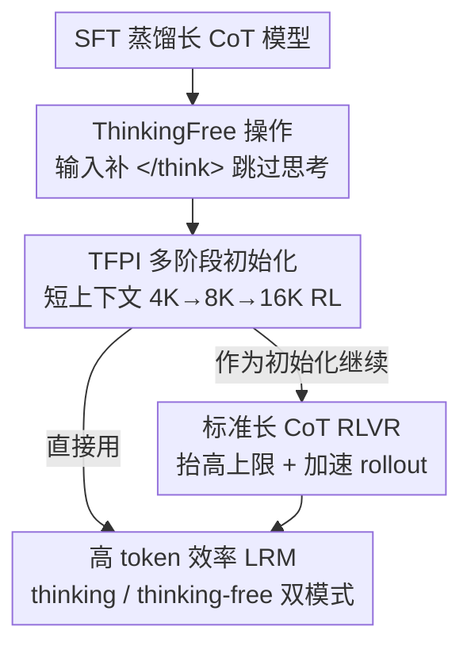

# Thinking-Free Policy Initialization Makes Distilled Reasoning Models More Effective and Efficient Reasoners

**会议**: ICLR 2026  
**OpenReview**: [https://openreview.net/forum?id=RKYO6R8Jgb](https://openreview.net/forum?id=RKYO6R8Jgb)  
**代码**: 有（论文提供 GitHub 仓库与 HuggingFace 模型链接）  
**领域**: LLM推理  
**关键词**: RLVR、长链思维、高效推理、策略初始化、token 效率

## 一句话总结
在 SFT 蒸馏出来的长思维模型和标准 RLVR 之间插入一个叫 TFPI 的廉价初始化阶段——做法只是在 rollout 时给输入直接补一个 `</think>` 跳过显式思考、用很短的上下文做多阶段 RL——就能让模型在慢思考模式下既更准又更省 token，并把后续标准 RLVR 的收敛速度、性能上限一起抬上去（4B 模型用不到 4K H20 小时就在 AIME24 上达到 89.0%）。

## 研究背景与动机

**领域现状**：可验证奖励强化学习（RLVR，verifiable reward）是当前训练大推理模型（LRM）的主流路线，它让模型自发生成长链思维（long CoT）来解难题。实践中从一个 SFT 蒸馏好的长 CoT 模型出发跑 RLVR，比从 base 模型直接 RL 收敛更快、效果更好。

**现有痛点**：蒸馏好的 LRM 在 RLVR 的 rollout 阶段会产生极长的回复，因此训练必须开很大的上下文窗口（动辄 32K~52K），算力开销巨大——比如把 4B 模型上下文从 40K 逐级拉到 52K 大约要 8K H800 GPU 小时。常见的缓解手段是「多阶段 RLVR」：先用较短上下文起步、再逐步加长。但已有工作指出，**起步上下文过短会造成不可逆的性能退化**，而且即便分多阶段，总算力依然很高。

**核心矛盾**：长 CoT 的「准确率」和训练的「上下文长度 / 算力」之间存在硬 trade-off——想省算力就得缩短上下文，但上下文一短，标准 RLVR 直接把模型练崩（4K 上下文下 Qwen3-4B 的 avg@32 暴跌 40% 以上）。问题根子在于：标准 RLVR 在短上下文里硬截断长思维，破坏了慢思考能力。

**本文目标**：找到一种能在**短上下文 / 低算力**下稳定训练、且不损害（甚至增强）慢思考能力的初始化方式，让后续标准 RLVR 收敛更快、上限更高。

**切入角度**：作者先做了两个关键观察。其一，给蒸馏 LRM 的输入直接补一个空的 `</think>`（即「ThinkingFree 操作」），让模型跳过冗长的显式思考，推理 token 立刻砍掉 70% 以上；其二——也是最反直觉的——**用这种 ThinkingFree 输入做 rollout 来训练，即便上下文只有 4K，回到正常慢思考模式评测时准确率反而略升、token 反而下降**。短上下文之所以能不崩，是因为 ThinkingFree 让模型在短窗口里生成的是「完整但精炼」的回答而非「被截断」的长思维。

**核心 idea**：把「ThinkingFree rollout + 多阶段短上下文 RL」打包成一个标准 RLVR 之前的轻量初始化阶段——Thinking-Free Policy Initialization（TFPI），用它代替直接长上下文 RL，作为蒸馏到 RLVR 之间的桥梁。

## 方法详解

### 整体框架

TFPI 的定位是一个**插在「SFT 长 CoT 蒸馏」和「标准长 CoT RLVR」中间的廉价初始化阶段**。整条管线是：拿到一个 SFT 蒸馏好的长 CoT 模型后，先跑 TFPI——在 rollout 阶段把每条输入查询 $x$ 用 ThinkingFree 操作转成 $x'$（即跳过显式思考），用很短的上下文按多阶段日程（如 4K→8K→16K）做 RL；TFPI 结束后，得到的策略既可以直接当成高 token 效率的最终模型用，也可以作为初始化点接着跑标准长上下文 RLVR 进一步抬高上限。整个过程不需要任何专门设计的长度奖励或复杂训练技巧，只是把标准 RLVR 的输入做了个 ThinkingFree 改写。

### 关键设计

**1. ThinkingFree 操作：补一个空 `</think>` 直接跳过显式思考**

这针对的是「蒸馏 LRM 推理 token 太长、训练上下文被迫开很大」这个痛点。作者把 ThinkingFree 定义成一个把查询 $x$ 改写成 $x'=\text{ThinkingFree}(x)$ 的算子：在标准聊天模板（thinking 模式，`<|im_start|>assistant\n`）的基础上，直接在 assistant 起始处追加一段空思考块 `<think>\n\n</think>`，强行让模型「思考内容为空」，从而跳过冗长的中间推理、直接产出精炼回答。这个改写显式控制了输出里有没有思考内容，且**不改变题目的正确答案**，所以奖励 $r(x',y)=r(x,y)$ 完全可复用。实测在 AIME25 上，DS-1.5B 和 Qwen3-4B 应用 ThinkingFree 后输出 token 都减少 70% 以上（如 DS-1.5B 16.5K→4.4K）。值得注意的是它对纯蒸馏长 CoT 模型（DS-1.5B）和快慢融合模型（Qwen3-4B）都有效，趋势一致。

**2. TFPI：用 ThinkingFree rollout 做短上下文的多阶段策略初始化**

这是全文核心，针对的是「短上下文标准 RLVR 会把模型练崩」的痛点。TFPI 把 RLVR 目标里的输入整体换成 ThinkingFree 版本：

$$J_{\text{TFPI}}(\theta)=\mathbb{E}_{x\sim D}\left[J_{\text{RLVR}}(\theta, x')\right],\quad x'=\text{ThinkingFree}(x)$$

rollout 阶段对每条 $x'$ 采样 $G$ 条回复 $\{y_i\}\sim\pi_{\theta_{\text{old}}}(\cdot\mid x')$，重要性比 $r_{i,t}(\theta)$ 和优势 $\hat A_{i,t}$ 也全部基于 $x'$ 重新计算，底层 RLVR 算法实例化为 DAPO（带 clip-higher、动态采样、token 级策略梯度）。关键在于：因为 ThinkingFree 让每条 rollout 都是「完整精炼答」而非「被截断的长思维」，所以可以放心地用很短的上下文起步而不退化——作者按 2K→4K→8K（1.5B/7B）或 4K→8K→16K（4B）的多阶段日程训练。对照之下，标准 RLVR 在 4K 上 avg@32 掉 40% 以上，而 TFPI 在 4K 下能稳定训练并涨点。直观理解：ThinkingFree 训练学到的「`</think>` 之后的验证行为」会迁移回 thinking 模式内部的慢思考验证，所以即便只在短窗口、空思考下训练，回到慢思考评测时反而更强。

**3. TFPI+RL：把 TFPI 当成标准 RLVR 的廉价前置阶段**

这针对的是「直接长上下文 RL 又贵又慢、上限还不够高」的痛点。由于 TFPI 阶段 token 短、算力省（三阶段总算力不到 32K 标准 RL 的 20%），作者把它当作后续标准长 CoT RLVR 的初始化点：先 TFPI、再接标准 RLVR（记作「TFPI+RL」）。这么做有两重收益：一是**抬高性能上限**——TFPI 训练得到的模型再跑 RL 仍能继续涨（Qwen3-4B 上 AIME25 从 70.6%→76.0%）；二是**加速 rollout**——从 TFPI 出来的模型本身输出就短，接 RL 时 rollout 平均 token 从直接 RL 的 9K+ 降到 6K 起步、峰值低于 7K，单步更快。参数层面的分析也佐证：TFPI 的参数更新方向会逐层逐步对齐到「直接 RL」的最终方向，相当于用更便宜的方式提前走到了 RL 想去的参数区域附近。

### 损失函数 / 训练策略

底层算法用 DAPO（GRPO 变体），所有方法共享同一套超参（batch size 256、学习率 $1\times10^{-6}$、无 warm-up、temperature 1、8 rollouts/题），基于 VeRL 代码库、Polaris-53K 数据训练。公平对比的前提是**TFPI 三阶段的总训练算力与「Direct RL」严格相等**。值得强调的是 TFPI 不需要任何专门的长度奖励或复杂训练设计——「省 token」是 ThinkingFree 模式天然带来的副产品，而非靠奖励整形逼出来的。

## 实验关键数据

### 主实验

相同算力下，TFPI（仅初始化阶段、thinking 模式评测）对比 Direct RL 的总体准确率（Overall Avg.）：

| 模型 | 初始模型 | Direct RL | TFPI stage1 | TFPI stage3 |
|------|---------|-----------|-------------|-------------|
| DS-1.5B | 22.0 | 25.3 | 26.7 | **29.2** |
| Qwen3-4B | 60.3 | 60.2 | 60.8 | **63.8** |
| DS-7B | 42.2 | 43.0 | 45.6 | **47.8** |

TFPI 在几乎所有配置上都超过 Direct RL：Qwen3-4B +3.6%、DS-7B +4.8%。即便只在 Polaris-53K（纯数学数据）上训，跨域也有迁移——DS-1.5B 的 GPQA 从 16.3%→29.6%、IFEval 从 36.6%→40.8%。

TFPI 作为前置阶段（TFPI+RL）进一步抬高上限：

| 模型 | AIME24 | AIME25 | LiveCode | Overall |
|------|--------|--------|----------|---------|
| Qwen3-4B Direct RL | 78.8 | 71.5 | 54.3 | 62.0 |
| Qwen3-4B TFPI stage3 | 79.9 | 70.6 | 57.0 | 63.8 |
| Qwen3-4B TFPI+RL | 80.8 | 76.0 | 55.7 | **65.7** |
| Qwen3-4B-2507 TFPI only | **89.0** | 81.2 | **65.5** | **70.6** |

仅用 TFPI（4K→8K→16K）的 Qwen3-4B-2507 在 AIME24 达 89.0%、LiveCode 65.5%，**在数学和代码上反超 Qwen3-235B-Thinking**，而 TFPI+RL 总算力仅约 1.5K H800 小时（对照 Polaris-4B 的约 8K 小时）。

### token 效率实验

DS-1.5B 在 thinking-free 推理模式下对比其它高效推理基线（accuracy / 平均 token）：

| 配置 | AIME24 acc | AIME24 Toks | Overall acc | Overall Toks |
|------|-----------|-------------|-------------|--------------|
| DS-1.5B (Thinking) | 29.6 | 16.7K | 19.4 | 14.3K |
| DS-1.5B (Thinking-Free) | 12.4 | 5.7K | 8.0 | 3.6K |
| TFPI stage1 | 21.9 | 1.6K | 19.7 | 1.3K |
| TFPI stage3 | **37.5** | 5.3K | **28.5** | 4.4K |

TFPI stage3 把 thinking-free 的 AIME24 从 12.4%（初始）拉到 37.5%，token 仅 5.3K（远低于 thinking 的 16.7K），在准确率-token 权衡上稳居 Pareto 前沿，且不靠任何专门的长度奖励。

### 消融实验

| 配置 | Overall (Qwen3-4B) | 说明 |
|------|-------------------|------|
| TFPI 4K→8K→16K | 63.8 | 最佳日程 |
| TFPI 8K→16K | 62.4 | 去掉 4K 起步阶段 |
| TFPI 16K only | 61.9 | 单阶段 |
| Multi-Stage Direct RL | 52.9 | 同样多阶段日程、但不用 ThinkingFree |

### 关键发现
- **ThinkingFree 是涨点的真正来源，而非多阶段本身**：用同样的 4K→8K→16K 多阶段日程跑 Direct RL（不加 ThinkingFree）总分只有 52.9%，远低于 TFPI 的 63.8%——证明收益来自 ThinkingFree 改写，多阶段只是辅助。
- **对日程鲁棒但 4K 起步最好**：三种日程都超过 Direct RL，4K→8K→16K 略优，作者推测是动态采样带来的隐式课程（先做简单题）。
- **行为/参数双层解释**：行为上，验证步比例在 stage1 骤降（类似信息压缩）、stage2/3 回升并大幅探索，`</think>` 之后学到的验证行为迁移回慢思考内部；参数上，TFPI 更快更广地探索参数空间，更新方向逐层对齐 Direct RL 的终点。
- **保持慢思考形态、且能 scale**：thinking 模式下答案段 $|y_{\text{ans}}|$ 稳定在 500–580 token，说明 TFPI 没有把模型推向病态的「慢-慢思考」；放大到 Qwen3-14B 依然有效（Direct RL 几乎追平初始模型 66.9% vs 66.8%，而 TFPI 67.8%，且 token 降 23.8%）。

## 亮点与洞察
- **「省 token」是免费副产品而非优化目标**：现有高效推理方法普遍靠精心设计的长度奖励 / 预算控制去逼短输出，本文证明只要切到 thinking-free 模式就能天然得到一个高效变体，相当于用「一个模型、两种模式」覆盖「高准确」和「高效率」两端。
- **反直觉的核心发现**：用「空思考」训练，回到「有思考」评测反而更强——把它解释为 `</think>` 后验证行为向 think 内部的迁移，这个视角对理解「思考内容到底贡献了什么」很有启发。
- **极简而有效**：整个方法只改了 rollout 的输入模板（补一个 `</think>`），不动算法、不加奖励项，却能同时解决「短上下文练崩」「算力贵」「token 长」三件事，工程可复用性极高，几乎可以无痛叠加到任何现有 RLVR 管线前面。

## 局限与展望
- **训练数据单一**：TFPI 只在 Polaris-53K（纯数学）上训，跨域迁移虽然存在但有波动（如 DS-7B 的 GPQA、DS-1.5B 的 LiveCodeBench 在阶段间会抖动），作者承认多领域混合数据可能让 TFPI 更稳更强。
- **数据难度对大模型偏易**：Qwen3-14B 上 Direct RL 几乎没涨（数据 78% rollout 准确率，动态采样后只剩约 30% 有效），TFPI 的 scaling 潜力受限于数据质量，需要更难的数据才能充分发挥。
- **机制解释偏经验**：行为层「验证步比例」和参数层 PCA / 余弦相似度都是相关性证据，「为什么空思考训练能迁移回慢思考」缺乏更严格的因果刻画。
- **改进思路**：把 TFPI 推广到多领域 / 更难数据上，并探索 ThinkingFree 之外其它「输入改写」算子（如部分保留思考）能否进一步平衡准确率与 token。

## 相关工作与启发
- **vs 多阶段 RLVR（Polaris / DeepScaleR）**：它们也用「短→长」的上下文递增，但直接对长思维做截断，短窗口起步会不可逆退化；TFPI 用 ThinkingFree 让短窗口下的回复「完整而精炼」，因而能在 4K 稳定训练，且总算力只需它们的一个零头（约 1.5K vs 8K H800 小时）就达到相当或更优性能。
- **vs 高效推理 / 长度奖励方法（L1、AdaptThink、AutoThink、Laser、ThinkLess）**：这类方法普遍用专门的长度奖励整形或快慢思考切换去压缩输出，本质是拿准确率换效率；TFPI 不设任何长度奖励，高效率是 thinking-free 模式的自然产物，在 DS-1.5B 上同时拿到更高准确率和更低 token，落在 Pareto 前沿。
- **vs 预/中训练加速 RL（Hu et al. 形式语言预-预训练、Wang et al. 中训练阶段）**：本文受其「在主训练前插一个廉价阶段」的思路启发，但把这个阶段具体落到「ThinkingFree rollout 的短上下文 RL」上，专门服务于 SFT 蒸馏 LRM 到 RLVR 的衔接。

## 评分
- 新颖性: ⭐⭐⭐⭐ 「补 `</think>` 跳过思考来做初始化」做法极简却抓住了短上下文不退化的关键，反直觉发现有价值
- 实验充分度: ⭐⭐⭐⭐⭐ 覆盖 1.5B~14B 多模型、数学/代码/多任务/指令多基准，含算力对齐、日程消融、行为与参数双层分析
- 写作质量: ⭐⭐⭐⭐ 观察→方法→分析链条清晰，公式与图表充分，部分机制解释偏经验
- 价值: ⭐⭐⭐⭐⭐ 几乎无痛可叠加到任意 RLVR 管线，同时省算力、抬上限、降 token，工程价值高

<!-- RELATED:START -->

## 相关论文

- [\[ICLR 2026\] Plan and Budget: Effective and Efficient Test-Time Scaling on Reasoning LLMs](plan_and_budget_effective_and_efficient_test-time_scaling_on_reasoning_large_lan.md)
- [\[ICLR 2026\] DRPO: Efficient Reasoning via Decoupled Reward Policy Optimization](drpo_efficient_reasoning_via_decoupled_reward_policy_optimization.md)
- [\[ACL 2026\] RSAT: Structured Attribution Makes Small Language Models Faithful Table Reasoners](../../ACL2026/llm_reasoning/rsat_structured_attribution_makes_small_language_models_faithful_table_reasoners.md)
- [\[ICLR 2026\] Inpainting-Guided Policy Optimization for Diffusion Large Language Models](inpainting-guided_policy_optimization_for_diffusion_large_language_models.md)
- [\[ICLR 2026\] Stabilizing Policy Gradients for Sample-Efficient Reinforcement Learning in LLM Reasoning](stabilizing_policy_gradients_for_sample-efficient_reinforcement_learning_in_llm_.md)

<!-- RELATED:END -->
