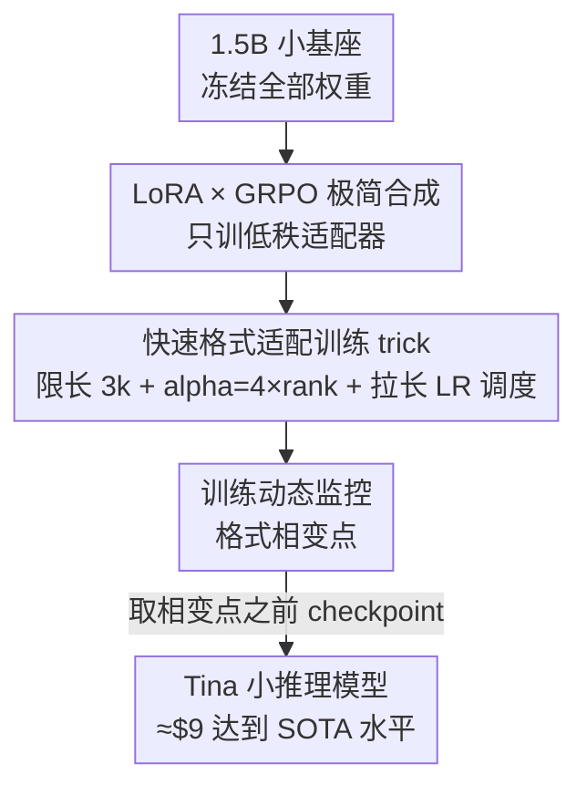

# Tina: Tiny Reasoning Models via LoRA

**会议**: ICLR 2026  
**OpenReview**: [https://openreview.net/forum?id=P2OXYO3bEe](https://openreview.net/forum?id=P2OXYO3bEe)  
**代码**: https://github.com/shangshang-wang/Tina  
**领域**: LLM推理  
**关键词**: LoRA, 强化学习, GRPO, 小模型推理, 成本效率

## 一句话总结
在一个仅 1.5B 的小模型上，用 LoRA 做 RL（GRPO）后训练，只花 9 美元就把数学推理能力训到与同基座的全参数 SOTA 相当甚至更好，并提出"快速推理格式适配"假说来解释这种低成本为何奏效。

## 研究背景与动机
**领域现状**：让语言模型具备稳健的多步推理，目前两条主流路线：一是 SFT 蒸馏，让小模型模仿 o1/R1 等强模型的推理轨迹；二是 RL（如 DeepSeek-R1 用的 GRPO），让模型从可验证的奖励信号里自己探索逻辑路径。RL 通常被认为能学到更鲁棒的推理，但代价是 pipeline 复杂、算力昂贵。

**现有痛点**：现有的开源推理复现工作（STILL-3、DeepScaleR、Open-RS 等）几乎清一色用**全参数训练**，动辄上千美元、几十上百 GPU 小时。这让"RL 究竟最少需要多少资源就能注入推理能力"这个根本问题一直没被认真探过底。

**核心矛盾**：知识容量主要随参数规模增长，而推理能力可能与参数量解耦——这意味着小模型可能藏着没被开发的推理潜力，且参数高效方法（如 LoRA）能在不破坏已有知识的前提下注入特定能力。但没人系统验证过：在极小算力预算下，RL 推理到底能被推到多远。

**本文目标**：把效率压到极限，回答"RL 注入推理的最小资源需求是多少"，并解释为什么这么低的成本就能work。

**切入角度**：同时用两个效率杠杆——**紧凑的小基座**（1.5B 的 DeepSeek-R1-Distill-Qwen）和**RL 阶段只训 LoRA 低秩适配器**。作者赌的是：RL 奖励的本质是让模型输出符合可验证的"推理格式/结构"，而 LoRA 恰好擅长用极少参数学习这种结构性模式，同时保住基座的海量知识。

**核心 idea**：把 LoRA 和 GRPO 直接合成——冻结基座、只用 RL 训低秩适配器，让小模型"快速学会推理的格式，而非重新学习知识"，从而在极低算力下获得强推理。

## 方法详解

### 整体框架
Tina 不是一个复杂的新算法，它的贡献在于一个极简配方加上对其有效性的解释。整体只有一条链路：拿一个已经很小的 1.5B 基座（DeepSeek-R1-Distill-Qwen-1.5B），冻结全部原始权重，**只在 RL 阶段插入并训练 LoRA 低秩适配器**，RL 算法用 GRPO（一种去掉价值网络、用组内相对优势的 PPO 变体），奖励来自数学题答案的可验证正确性加上格式奖励。配上几条专门为"快速适配格式"调过的训练 trick，整个训练在 2 张 L40S 上跑，单个 RL step 通常一分钟内完成。

关键洞察来自训练动态的观察：格式类指标（格式奖励、补全长度）会出现一个明显的"相变点"，而**最好的 checkpoint 恰好出现在相变点之前**——这既指导了选模型，也支撑了核心假说。

### 关键设计

**1. LoRA × GRPO 极简合成：只动一小撮参数就完成 RL 推理后训练**

针对"全参数 RL 推理太贵"这个痛点，Tina 的做法是把参数高效微调直接搬进 RL。基座权重 $W_0 \in \mathbb{R}^{d\times k}$ 全程冻结，只训练一对低秩矩阵 $A \in \mathbb{R}^{d\times r}$、$B \in \mathbb{R}^{r\times k}$（$r \ll \min(d,k)$），前向从 $h(x)=W_0 x$ 改成 $\hat h(x)=W_0 x + ABx$。RL 算法用 GRPO：对每道题 $q$ 从旧策略采一组 $G$ 个输出，用组内奖励的标准化值作为优势 $A_i = \frac{r_i - \mathrm{mean}(\{r\})}{\mathrm{std}(\{r\})}$，再以裁剪目标加 KL 惩罚优化：

$$\mathbb{E}\left[\frac{1}{G}\sum_{i=1}^{G}\Big(\min(\delta_i A_i,\ \mathrm{clip}(\delta_i, 1-\epsilon, 1+\epsilon)A_i) - \beta\, D_{\mathrm{KL}}(\pi_\theta\|\pi_{\mathrm{ref}})\Big)\right]$$

其中 $\delta_i = \pi_\theta(o_i\mid q)/\pi_{\theta_{\mathrm{old}}}(o_i\mid q)$。GRPO 去掉了独立的价值网络，用组基线估计优势，本身就比 PPO 省。这样有效，是因为推理任务天然提供可验证奖励（答案对不对、格式合不合规），而 LoRA 把"该往哪个方向调"压缩进低秩空间——只训不到 1% 的参数，单 step 一分钟，复现最佳 checkpoint 只要 9 美元，相比基线估计降了约 260 倍。LoRA 的模块化还带来额外好处：推理行为可以像开关一样挂载，不用维护多份完整模型副本。

**2. 面向"快速格式适配"的训练 trick：用一套固定超参逼模型尽快学会推理结构**

如果只是把 LoRA 配置照搬常规设置，适配速度未必快。作者刻意偏离常规，用三条 trick 全程固定、不做超参搜索，来加速模型吸收新的推理格式。其一是**限制补全长度为 3k token**：强迫模型用简洁、结构良好的推理路径拿到正确答案，既引导高效表达又降低每条样本的算力。其二是**把 LoRA alpha 设成 rank 的 4 倍**（如 rank 32、alpha 128），而非常规的 2 倍——放大的 alpha 让模型更强地"倾向"采纳 LoRA 学到的适配，更快地靠向 RL 强化出来的推理结构。其三是**把学习率衰减调度铺在两倍训练步数上**，于是实际训练区间内每一步用到的学习率相对更大，进一步加快 LoRA 参数对奖励信号的适配。这三条都服务于同一个目标：在最小算力下尽快把推理格式学到位，而不是慢慢磨。

**3. 快速推理格式适配假说与格式相变：解释"为什么这么省还这么强"**

光给配方不够，作者还要回答"为什么 LoRA 在这里既有效又高效"。核心假说是"学结构/格式，保知识"：RL 推理重奖的是模型生成符合可验证格式（如 step-by-step 推理链）的能力，而 LoRA 极擅长用极少参数改动捕捉这类结构性、风格性模式，所需 FLOPs 极少；同时因为只动一小撮权重，基座预训练时积累的海量知识被基本保住。于是 LoRA 教的是"如何把已有知识格式化成有效推理轨迹"，而非昂贵地重学概念。

支撑这一假说的关键证据是**格式相变**（phase transition）：训练中格式类指标（格式奖励、补全长度）会出现一个尖锐的转折点，而准确率奖励却是平缓漂移、没有对应的拐点。更重要的是，**held-out 上推理准确率最高的 checkpoint 总是出现在这个相变点之前或附近**。这说明 LoRA 先快速把模型优化到符合格式要求，之后继续在格式上优化反而会失稳、不再带来更好的推理。消融进一步验证：把补全上限放宽到 10k，模型生成长度仍只到约 4k、相变照常出现（说明相变不是限长的人为产物）；而若**只用格式奖励、去掉准确率奖励，相变就消失了**——说明这个动态是 LoRA 快速适配格式与"追求答对"两股力量交互的涌现属性，光有格式没有正确性目标，适配就变得无效。

### 损失函数 / 训练策略
训练目标即上面的 GRPO 目标（裁剪比率 + KL 惩罚），奖励为答案正确性奖励加格式奖励。硬件为 2×NVIDIA L40S（约 \$1/GPU·小时），全部实验用单一固定超参集；最佳 checkpoint 通常只跑到一个 epoch 的 19%–57%。

## 实验关键数据

### 主实验
六个数学/科学推理 benchmark（AIME24/25、AMC23、MATH500、GPQA Diamond、Minerva）上，Tina（LoRA）对比同基座的全参数 SOTA（Baseline 为全参数 RL 平均分）：

| Tina 模型 | 最佳步(占1 epoch) | AIME24 | 平均分 | 全参数 Baseline 平均 |
|-----------|------|--------|--------|----------|
| Tina-STILL-3-1.5B-preview | 53% | 36.67 | 48.16 | 44.86 |
| Tina-DeepScaleR-1.5B-Preview | 19% | 43.33 | 48.38 | 48.74 |
| Tina-Open-RS1 | 34% | 43.33 | 48.56 | 44.47 |
| **Tina-Open-RS2** | 51% | 43.33 | **50.60** | 41.60 |
| Tina-Open-RS3 | 57% | 36.67 | 49.45 | 46.06 |

最好的 Tina 在 AIME24 上拿到 43.33% 的 zero-shot Pass@1，相对基座有 >20% 的推理提升，复现这个最佳 checkpoint 只需 \$9（估计降本约 260 倍）；复现全文所有实验也只要 \$798。几乎所有 Tina 都超过了对应全参数基线的平均分。

### 消融实验

| 配置 | 关键指标(平均分) | 说明 |
|------|---------|------|
| Tina-Open-RS (7k 数据) | 50.60 | 7k 小数据集反而最高，超过 93.7k 的 OpenR1(49.26) |
| LoRA rank 16 / 32 | 48.92 / 48.47 | rank 8/16/32 都稳健，rank 16 峰值；4 和 64 略降 |
| LR 1e-6 / 5e-6 / 5e-7 | 48.47 / 47.87 / 47.91 | 1e-6 最优，但差异不大、无需精调 |
| GRPO vs Dr.GRPO | 49.45 / 49.53 | 峰值相当，但 Dr.GRPO 在 17% epoch 就达峰(GRPO 需 57%) |
| 限长 3k → 10k | 49.45 → 50.63 | 放宽限长生成仍只到 ~4k，相变照常，性能可比 |
| 只用格式奖励 | 50.56(需 850 步) | 相变消失，且要更久才达到相近性能 |

### 关键发现
- **数据量不是关键，质量与多样性更重要**：7k 的 Open-RS 击败 93.7k 的 OpenR1，强力支撑"Tiny"前提。
- **"算力越多反而越差"**：在 Tina 上，训练 FLOPs 增加与性能呈反向关系，与全参数训练相反，呈现"少即是多"的现象——这正是 LoRA 快速学格式、过度优化反而失稳的体现。
- **最佳 checkpoint 总在格式相变点之前**：去掉准确率奖励后相变消失，说明相变是"格式适配 × 答对驱动"交互的涌现属性，而非单纯格式优化。
- **超参极其鲁棒**：rank、学习率、RL 算法在较宽范围内都能拿到相近结果，几乎不用调参。

## 亮点与洞察
- **把"贵 RL 推理"打到 9 美元**：核心不是方法多复杂，而是揭示了"小基座 + LoRA + GRPO"这一极简组合在推理上惊人的成本效益，复现门槛极低且全开源。
- **格式相变是个可复用的诊断信号**：用格式奖励/补全长度的尖锐转折点来定位最佳 checkpoint，而准确率奖励是平缓的——这给"什么时候该早停"提供了一个具体、可观测的抓手。
- **"学格式、保知识"的视角可迁移**：把 RL 推理理解为"教模型把已有知识格式化成推理轨迹"，解释了为何参数高效方法在推理上够用——这个思路可推广到其他"能力解耦于知识"的后训练场景。

## 局限与展望
- 假说目前是**经验性**的（相变现象 + 消融），缺乏严格的理论证明，"学格式 vs 学知识"的边界仍是定性描述。
- 全部实验集中在 **1.5B 单一基座 + 数学/科学推理**，更大模型、更广任务（如代码、开放域推理）上是否同样"少即是多"未验证。
- 评测以 zero-shot Pass@1 Mean@1 为主，虽有 Mean@10 鲁棒性补充，但小模型在 AIME 这类小样本 benchmark 上方差较大，部分分差需谨慎解读。
- 改进方向：把格式相变作为自动早停/checkpoint 选择的正式准则；探索 rank/alpha 比与格式适配速度的定量关系。

## 相关工作与启发
- **vs 全参数 RL 复现（STILL-3 / DeepScaleR / Open-RS）**: 它们全参数训练、成本上千美元；Tina 用同样的数据集和配方但只训 LoRA，平均分相当甚至更高，成本降两个数量级，核心差异是"是否动全部参数"。
- **vs SFT 蒸馏**: 蒸馏让模型模仿强模型推理轨迹，有"浅层模仿"风险；Tina 走 RL 从可验证奖励学，更能探索鲁棒解，且把成本压到可复现级别。
- **vs Dr.GRPO**: Tina 直接复用 GRPO/Dr.GRPO 作为 RL 算法，实验发现 Dr.GRPO 因损失归一化改动达峰更早、样本效率略优，可作为进一步降本的选项。

## 评分
- 新颖性: ⭐⭐⭐⭐ 方法本身是 LoRA+GRPO 的直接合成，但"极低成本可达 SOTA 推理"的发现 + 格式相变假说有真正洞见。
- 实验充分度: ⭐⭐⭐⭐⭐ 六 benchmark + 数据/rank/LR/算法/限长/格式 多维消融，成本明细透明，全开源。
- 写作质量: ⭐⭐⭐⭐ 动机与假说讲得清楚，相变分析有说服力。
- 价值: ⭐⭐⭐⭐⭐ 把推理 RL 的复现门槛降到 9 美元，对开源社区与低资源研究极具实用价值。

<!-- RELATED:START -->

## 相关论文

- [\[ICLR 2026\] Vision-R1: Incentivizing Reasoning Capability in Multimodal Large Language Models](vision-r1_incentivizing_reasoning_capability_in_multimodal_large_language_models.md)
- [\[ICLR 2026\] Your Models Have Thought Enough: Training Large Reasoning Models to Stop Overthinking](your_models_have_thought_enough_training_large_reasoning_models_to_stop_overthin.md)
- [\[ICLR 2026\] On The Fragility of Benchmark Contamination Detection in Reasoning Models](on_the_fragility_of_benchmark_contamination_detection_in_reasoning_models.md)
- [\[ICLR 2026\] Variational Reasoning for Language Models](variational_reasoning_for_language_models.md)
- [\[ICLR 2026\] Native Reasoning Models: Training Language Models to Reason on Unverifiable Data](native_reasoning_models_training_language_models_to_reason_on_unverifiable_data.md)

<!-- RELATED:END -->
