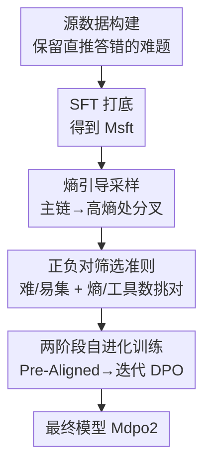

# Toward Effective Tool-Integrated Reasoning via Self-Evolved Preference Learning

**会议**: ICLR 2026  
**OpenReview**: [https://openreview.net/forum?id=mNeitRAdWV](https://openreview.net/forum?id=mNeitRAdWV)  
**代码**: https://github.com/RUC-NLPIR/Tool-Light  
**领域**: LLM推理  
**关键词**: 工具集成推理, 信息熵, 偏好学习, DPO, 自进化采样

## 一句话总结
提出 Tool-Light 框架，从信息熵视角分析工具集成推理（TIR）的低效根源，用「熵引导采样 + 两阶段自进化 DPO」让模型学会"该调工具时调、不该调时不调"，在 10 个数学与知识密集型任务上同时提升了工具调用的准确性与效率。

## 研究背景与动机

**领域现状**：工具集成推理（Tool-Integrated Reasoning, TIR）让大模型在推理过程中自主调用外部工具（如代码解释器、搜索引擎），弥补内部知识或计算能力的不足。它在深度信息检索、精确计算这类纯靠内部推理搞不定的任务上已成主流增强手段。

**现有痛点**：带 TIR 的模型常表现出三类"病态"行为——**调用不足**（该查的没查，答错）、**调用过度**（明明能算却反复调工具，浪费算力）、以及**拿到工具结果后过度思考**（甚至陷入"分析瘫痪"）。作者把这些统称为"不正确的工具调用"（incorrect tool calls）。

**核心矛盾**：现有用强化学习优化工具调用的工作，几乎都只盯着"减少工具过度使用"这一个方向，既忽略了"工具调用不足"，也没考虑"工具结果会怎样反过来扰动后续推理"。问题没被完整刻画，自然治不彻底。

**本文目标**：把 TIR 的"有效性"重新定义为一个更全面的目标——既要减少冗余调用，又要在必要时果断调用，还要避免拿到结果后的过度思考。要从训练侧（算法 + 数据）和推理侧（采样）两端同时解决。

**切入角度**：作者借鉴"高熵 token 决定推理方向"的已有发现，对 TIR 过程做信息熵分析，得到两个关键观察：① 模型收到工具结果后，后续输出的信息熵会先升、再波动、最后在下一次调用工具前骤降；② 对同一道题，**调用工具更少的正确路径，整体熵分布也更低**。这两点把"熵"和"工具调用是否高效"直接挂上了钩。

**核心 idea**：既然低熵路径对应着更精简的工具使用，那就**用熵来引导数据采样**（在高熵处分叉造多样性、在低熵正确路径里挑正例），再用**两阶段自进化偏好学习**把这种"高效用工具"的偏好灌进模型。

## 方法详解

### 整体框架

Tool-Light 是一条多阶段训练流水线，整体分两大块：**数据构建**（精心设计采样策略筛出训练数据）和**两阶段 TIR 训练范式**（先 SFT、再自进化 DPO）。输入是带标注答案的问题集，输出是一个会"恰当用工具"的 TIR 模型 $M_{dpo2}$。

具体流转：先从已有 SFT 数据训出 $M_{sft}$，并用它做**不给工具**的直推、只保留答错的难题构成源数据 $D_{source}$；然后用 $M_{sft}$ 在 $D_{source}$ 上做 TIR 采样，融合"vanilla 采样"和"熵引导采样"两条策略产出候选路径；接着用严格的正负对筛选准则（Cri1/Cri2）把候选整理成偏好对；最后进入两阶段训练——SFT 打底，再做 Pre-Aligned DPO 与 Self-Evolved DPO Alignment（多轮迭代采样+训练），逐步把模型对齐到"高效且必要"的工具调用上。其中**信息熵分析是贯穿始终的先验**：它既解释了为什么要在高熵处分叉，也解释了为什么要在低熵路径里挑正例。

### 关键设计

**1. 信息熵视角的 TIR 分析：找到"高效用工具"的可观测信号**

这是全文的地基。作者用公式 $H(i) = -\sum_{j=1}^{N} P(y_{ji}|y_{<i})\log P(y_{ji}|y_{<i})$ 刻画每个 token 位置的信息熵，再用 Search-R1 在多个 QA 数据集上对每道题 rollout 十条链，按工具调用次数分成"多调用"与"少调用"两组，统计每个推理步的平均熵分布。结论很直接：模型收到工具结果后熵先升后降、临近下次调用前骤降；而**低熵链普遍对应更少的工具调用，且随推理推进，高低熵链的工具数差异越拉越大**。这个观察的价值在于——它把抽象的"工具用得好不好"翻译成了一个**可测量、可优化的熵信号**，后面的采样和挑正例全都建立在它之上，而不是拍脑袋设规则。

**2. 熵引导采样：在最该探索的地方造多样性，还顺手省了算力**

针对 vanilla 采样"推理成本高、结果不确定"的毛病，作者不再均匀地全程重采，而是先生成一条主链 $C_{main}$，对每个步的前 10/20/30/40/50 个 token 算平均熵 $H_{avg}(i)=\frac{1}{i}\sum_{j=1}^{i}H(j)$，保留每步的最大 $H_{avg}$ 及其对应长度；然后挑出**熵最高的 top-k 步**，在这些位置上引导模型续写多条分支：$D^2_{dpo} = \{y \mid y_{>i} = M_{sft}[I(q)\oplus y_{<i}]\}$。因为高熵位置本就更可能岔出多样的输出，所以在这里分叉"性价比"最高。更妙的是，这种树状分叉把理想情况下的采样复杂度从 $O(mn)$ 降到了 $O(n\log m)$（$m$ 为 rollout 次数、$n$ 为平均序列长度），既保多样性又省成本。最终它与 vanilla 采样按一定比例混合，兼顾多样性与平衡性。

**3. 严格的正负对筛选准则：让 DPO 真正学到"对错之间的差距"**

有了候选路径还不够，DPO 的成败取决于正负例对得够不够"干净"。作者按 F1 分把轨迹判成对（F1=1）/错（F1=0），再按正确率把样本分成难集与易集，并把第 1 条设计里的熵结论嵌进挑选规则：熵引导策略下，**正例取"工具调用最少、熵最低的正确轨迹"**（若无正确轨迹则回退到 $D_{source}$ 里的 SFT 轨迹），**负例取"比正例工具调用更多的错误轨迹"**；vanilla 策略则以最短正确轨迹为正、比它更长的错误轨迹为负，并把难/易集比例设成 2:1。这样构造出的偏好对天然编码了"少而准 vs 多而错"的对比，DPO 学的就是这个方向。消融也证实：随机挑正/负例会让性能从 58.0 掉到 53.6/53.9，说明**把正负例区分清楚是 Tool-Light 的命门**。

**4. 两阶段自进化训练：先压冗余，再补必要，让数据难度跟着模型一起长**

训练分两阶段。先 SFT 用 $L_{SFT}(\theta)=-\sum_{(x,y)}\log P_\theta(y|x)$ 让模型快速具备 TIR 能力；再做自进化 DPO，目标是标准 DPO 损失 $L_{DPO}=-\mathbb{E}\left[\log\sigma\left(\beta\log\frac{\pi_\theta(y_w|x)}{\pi_{ref}(y_w|x)} - \beta\log\frac{\pi_\theta(y_l|x)}{\pi_{ref}(y_l|x)}\right)\right]$。DPO 内部又拆成两步：**Pre-Aligned DPO** 用 Cri1 采数据训出 $M_{dpo1}$，专治"工具调用过度 + 过度推理"，把冗余先压下去；**Self-Evolved DPO Alignment** 则换上更严的 Cri2（正确轨迹数不到错误轨迹一半才算难集），用 $M_{dpo1}$ 重新采样 $D^2_{dpo}$、训出 $M_{dpo2}$，再令 $M_{dpo1}\leftarrow M_{dpo2}$ 迭代往复直到收敛。这里"自进化"的精髓是——**模型用自己生成的数据训自己**，且每轮难集判定都随当前模型能力动态调整（易集里挑"少工具低熵正例"巩固效率，难集里挑"最长正确链正例 + 最短错误链负例"补足必要调用），从而在补齐"必要工具调用"的同时不把原有的高效推理能力练废。

### 损失函数 / 训练策略
- **SFT 损失**：$L_{SFT}(\theta)=-\sum_{(x,y)\in D}\log P_\theta(y|x)$，与 Tool-Star 同款配置。
- **DPO 损失**：见设计 4 公式，$\pi_{ref}$ 为原始策略模型，$\beta$ 为温度超参，$\sigma$ 为 sigmoid。
- **自进化迭代**：Self-Evolved DPO Alignment 进行多轮（实验表明 **2 轮最优**），每轮重新采样并更新参考模型。
- **工具**：采用代码解释器 + 搜索两类主流工具。

## 实验关键数据

### 主实验

骨干为 Qwen2.5-7B-Instruct，在 6 个数学推理 + 4 个知识密集型任务上评测（数学用 LLM-as-Judge，知识密集用 F1）。

| 方法 | 类型 | AIME24 | MATH500 | GSM8K | HotpotQA | 2Wiki | Avg. |
|------|------|--------|---------|-------|----------|-------|------|
| Direct Inference (Qwen) | 直推 | 0.0 | 57.2 | 71.4 | 26.1 | 25.6 | 33.0 |
| Search-R1 | 单工具 | 16.7 | 63.8 | 82.4 | 48.7 | 40.0 | 45.6 |
| ToRL | 单工具 | 30.0 | 80.2 | 89.2 | 41.3 | 35.4 | 50.4 |
| Tool-Star | 多工具 | 30.0 | 77.2 | 89.4 | 54.7 | 55.7 | 56.6 |
| **Tool-Light (Qwen)** | 多工具 | **33.3** | **79.0** | **92.0** | **57.7** | **56.1** | **58.0** |

关键结论：① 单工具训练（Search-R1 偏知识、ToRL 偏数学）泛化差，**只在一类任务上强**；Tool-Star/Tool-Light 这类多工具训练两类任务都行。② Tool-Light 仅用 DPO 就在平均分上超过了多数用 GRPO 训练的基线，数学任务在 4 个数据集上取最优、知识密集任务全部进前二。

### 消融实验

| 配置 | Performance | Efficiency | Necessity | 说明 |
|------|-------------|-----------|-----------|------|
| Tool-Light (2 loop) | 58.0 | 0.44 | 0.75 | 完整模型 |
| w. 1 loop | 57.9 (-0.1) | 0.42 | 0.71 | 自进化只 1 轮 |
| w. 3 loop | 56.1 (-1.9) | 0.39 | 0.73 | 轮数过多开始过拟合 |
| w. 5 loop | 54.1 (-3.9) | 0.36 | 0.72 | 继续恶化 |
| w. 1/1 data ratio | 56.9 (-1.1) | 0.44 | 0.76 | 两策略改 1:1（影响最小） |
| w. p-r.（随机选正例） | 53.6 (-4.4) | 0.42 | 0.63 | 破坏正例准则，掉最多 |
| w. n-r.（随机选负例） | 53.9 (-4.1) | 0.41 | 0.74 | 破坏负例准则 |

其中 Efficiency $=\frac{1}{n}\sum_{i=1}^{n}\frac{M_i}{T_i}$（性能除以工具调用数，衡量是否过度用工具），Necessity $=M\left(\frac{1}{n}\sum_{i=1}^{n}(N^i_{in}-N^i_{co})\right)$（衡量是否调用不足，$M$ 为 Min-Max 归一化）。

### 关键发现
- **自进化 2 轮是甜点**：第 2 轮所有指标达峰后开始下滑——初期能采到足够的正负对，但随进化推进有益样本变少，模型逐渐过拟合训练集分布。
- **正负例准则比数据配比重要得多**：数据配比改成 1:1 仅掉 1.1，而随机挑正/负例分别掉 4.4/4.1，说明"把对错样本拉开差距"才是 DPO 在 TIR 上奏效的核心。
- **输出熵确实被压低**：相比 Search-R1、ReCall，Tool-Light 的输出序列熵分布明显更低，且序列长度比 Tool-Star 更短却更准——印证了"低熵学习能缓解过度思考"。

## 亮点与洞察
- **把"工具用得好不好"翻译成可测量的熵信号**：这是最"啊哈"的地方——不再靠人工设奖励规则去判断工具调用是否合理，而是发现"低熵≈少而准的工具使用"，让采样和挑正例都有了客观依据。
- **熵引导采样一举两得**：只在高熵位置分叉，既提升了分支多样性，又把复杂度从 $O(mn)$ 砍到 $O(n\log m)$，是"针对性探索"的好例子，可迁移到任何需要 rollout 造偏好数据的场景。
- **纯 DPO 打过一票 GRPO 基线**：说明只要数据构造得当（正负对足够干净），偏好学习也能在 TIR 这类多步决策任务上取得不输强化学习的效果，训练成本却低得多。
- **"自进化 + 难度自适应"**：用模型自己生成的数据训自己，且难/易集判定随模型能力动态变化，避免了固定难度数据"喂不饱或撑死"的问题。

## 局限与展望
- **自进化轮数收益有限**：2 轮即饱和、3 轮后掉点，本质是自生成数据多样性枯竭 + 过拟合，框架尚缺主动维持数据多样性的机制。
- **熵信号的普适性存疑**：低熵≈少工具的观察来自特定模型（Search-R1）与 QA/数学任务，是否在更复杂的多工具组合、长程 agent 场景下仍成立，论文未充分验证。
- **依赖现成 SFT 数据与工具集**：源数据沿用 Tool-Star 的 $D_{sft}$，工具也只取代码 + 搜索两类，扩展到更丰富工具生态时筛选准则可能要重新设计。
- **Necessity/Efficiency 指标依赖基线池**：Necessity 的计算需要统计"比当前方法多调用却答错/少调用却答对"的其他方法数，指标值会随对比方法集合变化，跨论文横向比较需谨慎。

## 相关工作与启发
- **vs Tool-Star**：Tool-Light 直接以 Tool-Star 为 SFT 起点，区别在于额外引入 Pre-Aligned + Self-Evolved 两段 DPO，把"高效用工具"的偏好显式对齐进去，平均分从 56.6 提到 58.0，且序列更短。
- **vs Search-R1 / ToRL（单工具 RL）**：它们用精心设计的奖励函数做强化学习，但只擅长单一任务类型、泛化差；Tool-Light 用多工具 + 偏好学习，两类任务通吃。
- **vs SMART / IKEA（元认知类）**：那些方法聚焦"模型知识边界"来决定是否调工具，Tool-Light 则从"信息熵"这一可观测信号切入，提供了一个更数据驱动、更易优化的视角。
- **vs 一般 self-evolved 方法**：核心同样是"让模型从自己生成的数据中学习"，但 Tool-Light 把熵准则注入正负对筛选，使自进化的每一轮都朝"更高效工具调用"定向收敛，而非泛泛地自我改进。

## 评分
- 新颖性: ⭐⭐⭐⭐ 信息熵视角统一刻画"工具过度/不足/过度思考"三类问题，并据此设计采样与挑正例，角度新颖且自洽。
- 实验充分度: ⭐⭐⭐⭐ 10 个数据集 + 两类骨干 + 多维消融（轮数/配比/正负例随机化），还引入 Efficiency/Necessity 专用指标。
- 写作质量: ⭐⭐⭐⭐ 从熵观察一路推到方法逻辑清晰；部分符号（$D^1_{dpo}/D^2_{dpo}$、两套准则）较密集，需细读。
- 价值: ⭐⭐⭐⭐ 给 TIR 提供了低成本（纯 DPO）即可超 GRPO 的训练范式，工具调用效率与必要性双升，实践参考价值高。

<!-- RELATED:START -->

## 相关论文

- [\[ICLR 2026\] SimpleTIR: End-to-End Reinforcement Learning for Multi-Turn Tool-Integrated Reasoning](simpletir_end-to-end_reinforcement_learning_for_multi-turn_tool-integrated_reaso.md)
- [\[CVPR 2026\] Scaling Agentic Reinforcement Learning for Tool-Integrated Reasoning in VLMs](../../CVPR2026/llm_reasoning/scaling_agentic_reinforcement_learning_for_tool-integrated_reasoning_in_vlms.md)
- [\[ICLR 2026\] THOR: Tool-Integrated Hierarchical Optimization via RL for Mathematical Reasoning](thor_tool-integrated_hierarchical_optimization_via_rl_for_mathematical_reasoning.md)
- [\[ICLR 2026\] T1: Tool-Integrated Verification for Test-Time Compute Scaling in Small Language Models](t1_tool-integrated_verification_for_test-time_compute_scaling_in_small_language_.md)
- [\[ICLR 2026\] SkillFactory: Self-Distillation for Learning Cognitive Behaviors](skillfactory_self-distillation_for_learning_cognitive_behaviors.md)

<!-- RELATED:END -->
