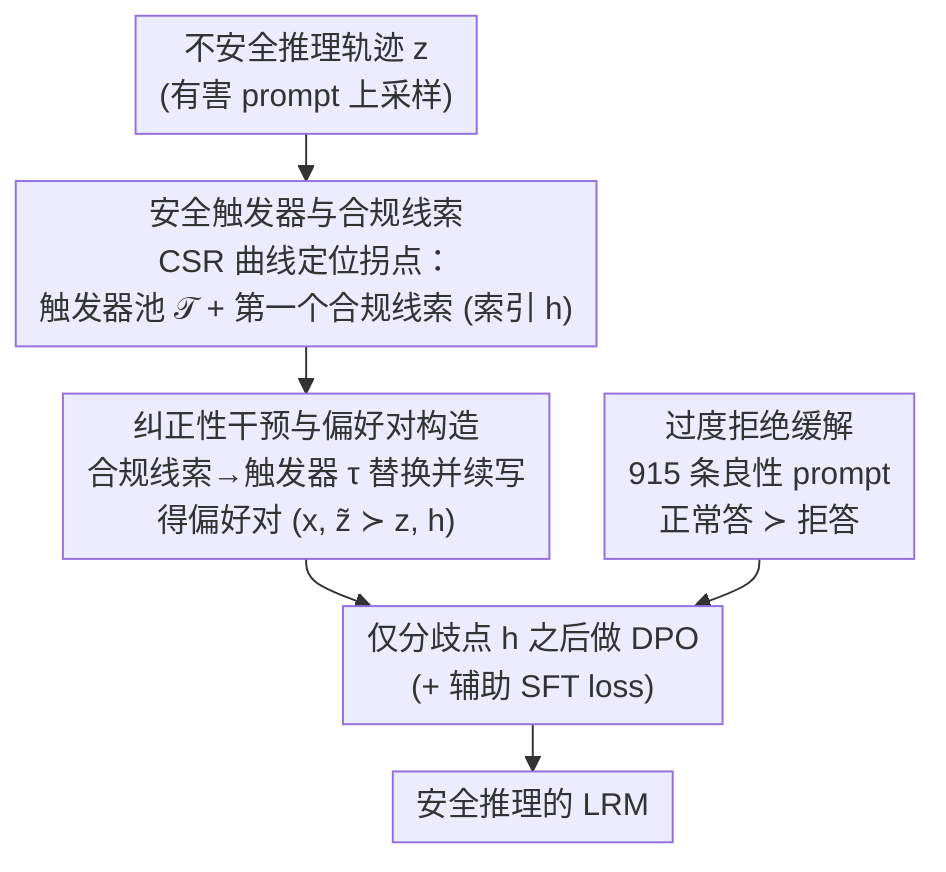

# Towards Safe Reasoning in Large Reasoning Models via Corrective Intervention

**会议**: ICLR 2026  
**arXiv**: [2509.24393](https://arxiv.org/abs/2509.24393)  
**代码**: 待确认  
**领域**: LLM推理  
**关键词**: 推理安全, 大推理模型, 偏好优化, 安全触发器, 合规线索

## 一句话总结
揭示大推理模型（LRM）的推理链即使最终回答安全也常包含有害内容的问题，提出 Intervened Preference Optimization（IPO），通过用安全触发器替换合规线索来纠正不安全推理轨迹，构造偏好对进行对齐训练，在 3 个 LRM 上将推理有害率降低超过 30% 且不损害推理能力。

## 研究背景与动机
大推理模型（如 DeepSeek-R1、Qwen3）在数学、编程和 agent 任务上表现出色，但其 CoT 推理过程常常包含有害内容（欺骗、违法、暴力等），即使最终回答看起来是安全的。这一问题在现有安全对齐方法中被系统性忽视：

**核心矛盾**：现有对齐方法（如 SafeChain、RealSafe、STAR）主要通过在蒸馏安全 CoT 数据上做 SFT 来训练 LRM，但实验表明：(1) 最终回答虽然通常安全，推理链中的有害内容仍大量存在——RealSafe 在 WildJailbreak 上的推理有害率高达 47.1%，虽然回答有害率仅 2.0%；(2) 不安全的推理可能被恶意用户利用（尤其是开源模型），也使模型更容易被越狱攻击所利用。

**为什么 RL 不够**：用 GRPO 直接奖励安全推理是自然的想法，但存在严重的 rollout 多样性不足问题——约 50% 的有害 prompt 几乎产生不了安全推理轨迹，导致组内优势缺乏多样性、策略梯度更新信号弱。

**关键观察**：通过分析推理过程中安全性的演变，作者发现三个关键模式：(1) 安全推理通常由少数**安全触发器**（safety triggers）巩固——模型明确承认风险或援引安全准则的推理步骤，之后安全延续概率接近 100%；(2) **合规线索**（compliance cues）与不安全延续强相关——模型表达顺从意图的步骤出现后，有害延续急剧上升；(3) 用安全触发器替换合规线索能有效纠正推理轨迹。

## 方法详解

### 整体框架
IPO（Intervened Preference Optimization）把推理安全当成一个**过程监督**问题来对齐，整条流水线建立在一个经验观察上：推理的安全性并非均匀散布在整条链上，而是被少数关键句子决定，因此监督也应当精确打在这些句子上、而不是平摊到全链。具体地，给定一条有害 prompt 上采出的不安全推理轨迹，先用一个安全性指标定位链里第一个把模型"带偏"的句子（合规线索），把它替换成一句能扭转方向的安全话术（安全触发器），让模型从替换点续写出一条安全轨迹；原始不安全链与纠正后的安全链构成一条偏好对，再**只在二者分歧点之后**做 DPO；同时配一份良性 prompt 偏好数据缓解过度拒绝，整体在 1,000 条有害 prompt 上约 40 分钟即可完成对齐。

### 关键设计

**1. 安全触发器与合规线索：把"安全的拐点"量化出来**

要在关键步骤上施加监督，前提是先找到这些步骤。作者定义 Continuation Safety Ratio（CSR）来度量推理链中每个位置对最终安全性的边际贡献：给定前缀 $z_s^{\le i}$，估计从此续写到结尾仍安全的概率 $S_i(x, z_s) = \mathbb{E}[\mathbb{I}(z_s^{\le i}\,\|\,z_c \text{ is safe})]$，实现上对每个 token 位置采样 32 次续写取安全比例。在这条 CSR 曲线上，**安全触发器**被定义为让 CSR 骤升到阈值 $\mu=0.9$ 以上并在窗口 $K=15$ 内保持稳定的句子——也就是模型明确承认风险或援引安全准则的那一步，之后几乎必然安全续写；**合规线索**则对称地定义为让 CSR 骤降到 $\eta=0.1$ 以下（同样在窗口 $K=15$ 内保持）的句子——模型流露出顺从恶意意图的那一步，之后有害延续急剧上升。合规线索的检测用 GPT-4o 加 few-shot 完成，与人工标注一致率超过 80%，而且它出现的位置与 CSR 转折点的 Pearson 相关系数高达 0.85，说明这两类句子确实是推理安全的"开关"；把 token 级转折点映射回所在句子，还能自动汇出一个可复用的**触发器池 $\mathcal{T}$**，为后续的精准干预提供了坚实依据。

**2. 纠正性干预与偏好对构造：在拐点处把轨迹掰回来**

找到拐点后，IPO 直接动手纠正而非重新蒸馏数据。设一条不安全轨迹 $z$ 中第一个合规线索位于 token 索引 $h$，从安全触发器池 $\mathcal{T}$ 中采一个触发器 $\tau$ 替换该句，让模型从替换点续写得到干预后轨迹 $\tilde{z}^{\ge h} \sim \pi_\theta(\cdot \mid x, z^{<h}, \tau)$；若续写仍不安全可迭代再干预，具有累积纠正效果。原始链与纠正链便构成一条偏好对 $(x,\ \tilde{z} \succ z,\ h)$，其中 $h$ 标出了二者真正分歧的位置。这种做法一举解决了两个痛点：相比 GRPO 直接奖励安全推理时约 50% 的有害 prompt 几乎采不出安全轨迹、组内优势缺乏多样性的问题，主动替换天然保证了正负样本的多样性；同时由于偏好信号只施加在分歧点之后，监督被精确地集中到安全关键步骤上，等价于在 CSR 发生跳变的位置施加 shaped reward，比全局稀疏奖励更高效。

**3. 过度拒绝缓解：别让安全训练把好问题也拒了**

纯安全数据训练容易让模型走向另一个极端——对良性请求也一概拒答（over-refusal）。为此作者在安全对齐之后再加一个阶段：取一份由 915 条良性 prompt 组成的辅助偏好数据集（STAR-benign-915），每条对比"正常回答"与"拒绝回答"，按一定有害/良性数据配比混合做第二阶段 DPO，并在主目标上叠加一项系数为 0.2 的辅助 SFT loss（类似 RPO 的做法）稳定训练、保留推理结构，把安全与可用性重新拉回平衡。

### 损失函数 / 训练策略
核心训练目标是只从分歧点 $h$ 之后计算的 DPO loss：

$$-\,\mathbb{E}\left[\log \sigma\!\left(\beta \log \frac{\pi_\theta(\tilde{z}^{\ge h}\mid x, z^{<h})}{\pi_{\text{ref}}(\tilde{z}^{\ge h}\mid x, z^{<h})} - \beta \log \frac{\pi_\theta(z^{\ge h}\mid x, z^{<h})}{\pi_{\text{ref}}(z^{\ge h}\mid x, z^{<h})}\right)\right]$$

它把好评给纠正后的安全续写、差评给原始有害续写，且只对 $h$ 之后的 token 生效，从而避免污染分歧点之前本就一致的推理。训练用 1,000 条 STAR-1 有害 prompt 配 6 个代表性安全触发器（$N=1$），构成约 500–1,400 条偏好数据，整个流程约 40 分钟即可完成——相比之下 GRPO 需要 2 小时以上且效果更差。

## 实验关键数据

### 主实验（DeepSeek-R1-Distill-Llama-8B）

| 方法 | JBB 推理↓ | JBB 回答↓ | SR 推理↓ | SR 回答↓ | WJ 推理↓ | WJ 回答↓ | 推理 Avg.↓ | 回答 Avg.↓ | AIME↑ | MATH↑ | GPQA↑ | HEval↑ | 推理 Avg.↑ |
|------|----------|----------|---------|---------|---------|---------|-----------|-----------|-------|-------|-------|--------|-----------|
| Base | 69.0% | 45.0% | 63.2% | 49.3% | 82.4% | 73.9% | 71.5% | 56.1% | 50.7 | 91.8 | 44.9 | 79.5 | 66.7 |
| STAR | 8.0% | 0.3% | 21.9% | 14.6% | 37.8% | 22.7% | 22.6% | 12.5% | 46.0 | 89.4 | 47.0 | 77.1 | 64.9 |
| GRPO | 0.3% | 0.0% | 19.0% | 19.7% | 36.3% | 33.6% | 18.5% | 17.8% | 50.0 | 92.8 | 50.5 | 79.9 | 68.3 |
| **IPO** | **5.7%** | **0.3%** | **16.7%** | **10.9%** | **23.4%** | **9.6%** | **15.3%** | **6.9%** | 54.0 | 91.6 | 49.0 | 79.5 | **68.5** |

IPO 在推理安全平均（15.3%）和回答安全平均（6.9%）上均取得最佳综合表现，同时推理能力（68.5%）超越所有基线包括 base 模型。

### 消融实验

| 消融变量 | SR 推理↓ | SR 回答↓ | Avg.↓ |
|---------|---------|---------|-------|
| 检测器: DS-8B | 21.8% | 17.1% | 19.4% |
| 检测器: DeepSeek-R1 | 16.4% | 11.0% | 13.6% |
| 检测器: GPT-4o | 16.2% | 11.3% | **13.7%** |
| 训练算法: SFT | 47.4% | 37.3% | 42.3% |
| 训练算法: DPO on Full | 25.8% | 12.3% | 19.0% |
| 训练算法: **DPO on Part** | **11.2%** | **10.6%** | **10.9%** |

仅从分歧点做 DPO（DPO on Part）远优于全轨迹 DPO 和 SFT，验证了局部精准监督的有效性。

### 关键发现
- **推理安全 → 回答安全**：安全推理后的回答安全概率极高，说明对齐应优先关注推理过程而非最终回答
- **安全触发器的纠正效果**：单次替换即可大幅降低延续有害率，迭代干预有累积效应
- **IPO vs GRPO 效率**：IPO 每个 prompt 最多 14 次生成（6 个触发器 × 2 + 2 次过拒缓解），GRPO 需至少 40 次生成，IPO 训练 ~40min vs GRPO >2h
- **跨模型一致**：在 DS-8B、DS-7B、Qwen3-8B 三个模型上均有效，Qwen3-8B 的推理有害率从 51.3% 降至 13.9%
- **KL 散度分析**：IPO 在合规线索对应的 token 位置展现更高的 KL 散度，确认了针对性监督的效果

## 亮点与洞察
- "安全触发器"和"合规线索"的发现是本文最重要的经验性贡献——推理安全不是均匀分布的，而是由少数关键步骤决定
- CSR（Continuation Safety Ratio）是一个优雅的度量工具，可量化推理过程中每个 token 对安全性的边际贡献
- IPO 将 reward shaping 的思想引入安全对齐：在 CSR 跳变点施加局部偏好信号，比全局稀疏奖励更高效
- 在安全和推理能力之间取得了目前最好的帕累托平衡——安全性显著提升的同时推理能力不降反升
- 合规线索与 CSR 转折点 0.85 的相关系数为干预提供了坚实的经验基础

## 局限与展望
- 合规线索检测依赖 GPT-4o 作为外部判断器，引入了额外依赖和潜在偏差
- 安全触发器池的构建仍需手动选择（6 个代表性触发器），自动化程度有限
- XsTest 合规率（DS-8B: 80%）低于部分弱安全基线，存在一定过度拒绝
- 仅在 ≤8B 规模上验证（除附录中 1.5B–14B），更大模型上的效果待进一步确认
- 未探索多轮对话和 agent 场景下的推理安全（文章仅提到作为未来方向）
- 训练数据仅 ~1,000 条有害 prompt，数据规模的扩展效应未知

## 相关工作与启发
- 与 SafeChain/RealSafe/STAR 等 SFT 方法相比，IPO 不依赖蒸馏安全 CoT 数据，而是直接干预不安全轨迹
- 与 BackTrack 等基于特殊 token 的回退方法相比，IPO 在推理层面进行正向纠正而非被动检测
- "推理安全应优先于回答安全"的论点有力且有定量支撑，可改变安全对齐研究的关注重点
- CSR 和安全触发器分析方法可推广到其他过程监督场景（如事实性、逻辑一致性）

## 评分
- 新颖性: ⭐⭐⭐⭐⭐ 首次系统性地将推理安全作为独立对齐目标，安全触发器/合规线索的发现和利用都是原创贡献
- 实验充分度: ⭐⭐⭐⭐ 3个LRM × 3个安全基准 + 4个推理基准 + 消融（检测器/算法/效率），但模型规模覆盖有限
- 写作质量: ⭐⭐⭐⭐⭐ 动机链条环环相扣，观察→假说→方法→验证的逻辑非常清晰
- 价值: ⭐⭐⭐⭐⭐ 揭示了LRM安全对齐中被忽视的重要维度，方法实用高效，对安全AI研究有直接和深远影响

<!-- RELATED:START -->

## 相关论文

- [\[ICLR 2026\] RFEval: Benchmarking Reasoning Faithfulness under Counterfactual Reasoning Intervention in Large Reasoning Models](rfeval_benchmarking_reasoning_faithfulness_under_counterfactual_reasoning_interv.md)
- [\[ICLR 2026\] Once-More: Continuous Self-Correction for Large Language Models via Perplexity-Guided Intervention](once-more_continuous_self-correction_for_large_language_models_via_perplexity-gu.md)
- [\[ICLR 2026\] Training Large Reasoning Models Efficiently via Progressive Thought Encoding](training_large_reasoning_models_efficiently_via_progressive_thought_encoding.md)
- [\[ICLR 2026\] Exposing Weaknesses of Large Reasoning Models through Graph Algorithm Problems](exposing_weaknesses_of_large_reasoning_models_through_graph_algorithm_problems.md)
- [\[ICLR 2026\] Dynamics-Predictive Sampling for Active RL Finetuning of Large Reasoning Models](dynamics-predictive_sampling_for_active_rl_finetuning_of_large_reasoning_models.md)

<!-- RELATED:END -->
