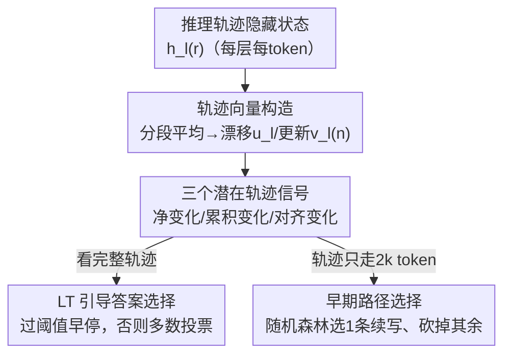

# Tracing the Traces: Latent Temporal Signals for Efficient and Accurate Reasoning

**会议**: ICLR 2026  
**OpenReview**: [https://openreview.net/forum?id=Ytlj8Ckv9n](https://openreview.net/forum?id=Ytlj8Ckv9n)  
**领域**: LLM推理  
**关键词**: 推理轨迹, 隐藏状态, 测试时扩展, 答案选择, 可解释性

## 一句话总结
本文提出 **Latent-Trajectory（LT）信号**——通过追踪推理 token 生成过程中模型隐藏状态的「时间演化轨迹」（净变化、累积变化、对齐变化三个量），无需训练就能预测一条推理轨迹是否会得到正确答案，并用它指导多样本推理的提前停止与早期路径选择，在保持甚至提升准确率的同时把 token 消耗最多降低约 70%。

## 研究背景与动机

**领域现状**：推理模型（DeepSeek-R1、Phi-4-Reasoning、Qwen3 等）靠「测试时扩展」提升能力——生成更长的思维链、采样多条推理轨迹再聚合（如多数投票 majority vote）。但每多采一条样本，token 消耗会成倍增长。

**现有痛点**：并非所有推理轨迹都等价，有的会陷入「过度思考」、不收敛、来回反复。能提前识别「哪条轨迹靠谱」就能省下大量算力。可现有判别手段都有硬伤：① 用 verifier 模型评分——额外推理成本高；② 分析自然语言轨迹表面形式——依赖人工/模型标注，而且语言文字未必反映模型真实的内部策略（甚至有的模型直接输出潜在 embedding 而非文本）；③ 用轨迹长度、输出 token 分布（logit margin / 熵 / 困惑度）等启发式——简单但不可靠，常常接近随机。

**核心矛盾**：判别推理质量时，要么牺牲准确率换简单，要么牺牲算力换准确率；而真正驱动推理的「内部表征动态」一直没被利用起来。

**本文目标**：找到一个**免训练、推理时即可计算、跨模型通用**的信号，仅凭模型自身隐藏状态轨迹就能预测最终答案是否正确，并把它转化为节省算力的推理策略。

**切入角度**：已有大量工作表明探测隐藏状态能揭示模型的可靠性、安全性、性能等信息。作者据此假设：**推理 token 生成期间隐藏状态的「时间演化」本身携带了关于最终答案正确性的预测信息**。这是一个「时间维度」的视角——区别于以往沿「层」方向（cross-layer / spatial）看表征曲率的工作。

**核心 idea**：把一条推理轨迹的隐藏状态序列看成潜在空间里的一条「轨迹」，用它走了多远、累计抖动多大、中间步骤是否朝最终方向直行这三个几何量来判别推理质量，再用这些量在线决定「这条够好了就停」或「这条有希望就续写」。

## 方法详解

### 整体框架
给定一个问题，推理模型会生成 `query → {trace start} 推理 token → {trace end} → 答案` 这样一段序列。本文只盯住中间的推理 token：在每个 token 位置 $r$、每一层 $l$，模型都产生一个隐藏状态 $h_l^{(r)} \in \mathbb{R}^d$。方法把这些隐藏状态先做「时间粗粒化」压成段级状态，再从段级轨迹里抽出三个互补信号，最后把信号用到两类推理控制上——**端到端答案选择**（看完整轨迹再决定）与**早期路径选择**（轨迹只走一部分就决定）。

具体地，先把推理轨迹按每 $k=500$ 个 token 切成不重叠的「段」，对每段内所有 token 的隐藏状态做平均，得到段级状态 $\tilde{h}_l^{(n)}$（第 $l$ 层、第 $n$ 段）。这样每层就得到一条段级轨迹 $\{\tilde{h}_l^{(1)}, \dots, \tilde{h}_l^{(N)}\}$，它平滑了 token 级的局部抖动、保留了大尺度演化。从这条轨迹上定义两个基础向量：**漂移向量** $u_l = \tilde{h}_l^{(N)} - \tilde{h}_l^{(1)}$（整条轨迹首尾的总位移）和**更新向量** $v_l^{(n)} = \tilde{h}_l^{(n)} - \tilde{h}_l^{(n-1)}$（相邻两段之间的增量）。三个 LT 信号都由这两个向量导出，逐层计算后再跨层平均，每条轨迹得到一个标量分数。

### 关键设计

**1. 段级轨迹向量：把隐藏状态序列变成可度量的潜在空间轨迹**

直接在 token 级别看隐藏状态既高维又抖动剧烈，难以提炼稳定信号。本文先把推理轨迹按固定 500 token 切段、段内取平均，得到段级状态 $\tilde{h}_l^{(n)}$，这一步「时间粗粒化」既降维又抑制局部波动，同时保住了模型在整条轨迹上的大尺度表征演化。在此基础上用漂移向量 $u_l$ 刻画「首尾走了多远、朝哪走」，用更新向量 $v_l^{(n)}$ 刻画「每一步怎么走」——前者是终点视角，后者是过程视角，二者合起来既能看总位移、又能看逐步动态，构成后续三个信号的统一基底。这是整套方法的脚手架，它把「推理过程」翻译成了潜在空间里一条可以量化几何性质的折线。

**2. 三个互补的潜在轨迹信号：从大小与方向两面刻画推理质量**

这是全文核心。作者从两个基础向量导出三个量，分别回答三个问题。**净变化（Net Change）** 问「推理整体上把表征推动了多远」，取漂移向量的模、按段数归一以抵消轨迹长度，再跨层平均：

$$\mathrm{NetChange} = \frac{1}{L}\sum_{l\in L}\frac{\lVert u_l\rVert_2}{N}$$

**累积变化（Cumulative Change）** 问「沿途总共抖动了多少」，把每段更新向量的模累加，与最终落点无关：

$$\mathrm{CumulativeChange} = \frac{1}{L}\sum_{l\in L}\sum_{n=2}^{N}\lVert v_l^{(n)}\rVert_2$$

**对齐变化（Aligned Change）** 问「中间每一步是否朝最终方向直行」，用每个更新向量与漂移向量的余弦相似度衡量，再跨段跨层平均：

$$\mathrm{AlignedChange} = \frac{1}{L}\sum_{l\in L}\frac{1}{N-1}\sum_{n=2}^{N}\frac{\langle v_l^{(n)}, u_l\rangle}{\lVert v_l^{(n)}\rVert_2\,\lVert u_l\rVert_2}$$

三者为什么有效，实验给出了机制解释：正确轨迹倾向于**净变化大、对齐变化大、累积变化小**——即表征发生了大幅且定向的位移、中间步骤直奔最终状态；错误轨迹则「游荡」更多、方向更不一致（累积变化与正确率负相关 $r=-.38$，净变化 $r=+.28$、对齐变化 $r=+.32$）。这把以往「长而多变的轨迹准确率更低」的行为学观察，落到了表征动力学的机制层面。三个信号全部免训练、无需外部标注、推理时即可算。

**3. LT 引导的端到端答案选择：用内部信号替代盲目多数投票**

多数投票要固定采满 5 条样本才聚合，对推理模型尤其昂贵。本文改成**顺序采样 + 在线早停**：每采出一条轨迹就算它的 LT 信号，一旦超过校准好的阈值 $\tau$ 就立即采纳为最终答案、停止采样；若至多 $k=5$ 条都没过阈值，再退回到对已有候选做多数投票。阈值 $\tau$ 用交叉验证选取——在校准集上从「错误解的分位数」构造候选阈值（每个候选固定了多少比例错误解会落在阈值之外），模拟整个决策规则后挑最优。这样「内部信号强」的题目几条就解决，信号弱的题目才依赖聚合的鲁棒性。作者还把三个信号按其与正确率的关联强度加权融合成一个 **Combined LT** 分数。

**4. 早期路径选择：信号在轨迹早期就出现，可提前砍掉差路径**

更激进的省算力方式是不等轨迹写完。作者发现 LT 信号在推理早期（前 4k token 内 ROC-AUC 就能超过 0.6）就具备判别力。于是并行采样多条轨迹时，只让每条各走 2k token，用此时的 LT 信号作为特征喂给一个轻量随机森林分类器预测正确性，选出**一条最有希望的轨迹续写到底、终止其余四条**。注意对齐变化因为要和「最后一段」比方向，在轨迹早期不稳定，所以早期选择主要用净变化与累积变化。相比同类方法 ST-BoN（靠跨样本两两距离选样本），LT 只在单条样本的潜在轨迹上计算，因此更便宜。

### 损失函数 / 训练策略
本方法**完全免训练**：三个 LT 信号是隐藏状态的确定性几何量，推理时直接计算。唯一的「学习」成分是早期路径选择里那个轻量随机森林分类器（以 LT 信号为特征），以及答案选择里阈值 $\tau$ 的交叉验证校准，二者开销都远小于额外跑 verifier 或多采样本。

## 实验关键数据

**模型与数据**：三个开源推理模型 DeepSeek-R1-Distill-Qwen-14B（R1-D）、Phi-4-Reasoning-Plus（Phi4R+）、Qwen3-14B（Qwen3）；三个领域 GPQA Diamond（科学多选）、AIME 2025（数学）、TSP（路径优化）。附录还扩展到 8B/32B/70B 及常识、创意、叙事等发散推理任务。

### 主实验
判别力（ROC-AUC，区分正确/错误轨迹，跨模型平均）：

| 信号类型 | 指标 | ROC-AUC |
|--------|------|---------|
| LT–净变化 | Net Change | 0.71 ± 0.09 |
| LT–累积变化（符号反转） | Cumulative | 0.74 ± 0.09 |
| LT–对齐变化 | Aligned | 0.73 ± 0.08 |
| 跨层幅度（baseline） | Layer Mag | 0.58 ± 0.17 |
| 跨层角度（baseline，符号反转） | Layer Ang | 0.67 ± 0.14 |
| 输出分布 Logit Margin | — | 0.59 ± 0.10 |
| 输出分布 Entropy | — | 0.44 ± 0.10 |
| 输出分布 Perplexity | — | 0.49 ± 0.12 |

三个 LT 信号稳定高于随机、显著优于跨层几何与输出分布置信度（后者多数接近甚至低于随机）。

多样本推理的准确率与效率（节选 Table 1，括号为相对 MV@5 的变化）：

| 模型 | 策略 | GPQA Acc. | AIME Acc. | TSP Acc. | 效率（样本数/省 token） |
|------|------|-----------|-----------|----------|------------------------|
| R1-D | MV@5 | 59.90 | 56.67 | 27.50 | 5.00 样本 |
| R1-D | LT–Net | 61.10 (+1.2) | 61.90 (+5.2) | 28.60 (+1.1) | 1.2–1.7 样本，省 54–71% token |
| Qwen3 | MV@5 | 63.96 | 70.00 | 36.25 | 5.00 样本 |
| Qwen3 | LT–Cumulative | 63.30 (-0.7) | **84.10 (+14.1)** | 36.30 (+0.1) | 1.6–2.3 样本，省 41–66% token |

汇总：相对 MV@5，LT 策略平均**省 58% 样本、省 48% token（最高 70.6%）、准确率平均 +2.46%**（−1.4% ~ +14.1%）。

### 消融实验

| 配置 | 关键指标 | 说明 |
|------|---------|------|
| Shortest@5（长度启发式） | 平均掉 1.4% 准确率 | 仅靠「越短越对」不可靠 |
| LT 端到端答案选择 | >85% 数据点触发早停 | 且该子集准确率持续超过 baseline |
| LT 早期选择（2k token） | 准确率平均 +2.49%，省 token 61.2% | R1-D 省 54%、Qwen3 省 62%、Phi4R+ 省 68% |
| vs ST-BoN（早期选择） | LT +2.48% vs ST-BoN +1.12% | LT 平均准确率增益翻倍，且计算更便宜 |

### 关键发现
- **三个信号机制可解释**：正确推理对应「大幅 + 定向」的表征位移（净变化、对齐变化高），错误推理对应「游荡 + 跑偏」（累积变化高）。累积变化与正确率负相关（$r=-.38$）从机制上印证了「长而多变 = 更易错」。
- **输出分布置信度几乎没用**：熵、困惑度 AUC 在 0.44–0.49，接近随机；内部表征轨迹远比输出端置信度可靠。
- **信号出现得早**：前 4k token 内 AUC 就能超 0.6，使得「采一段就砍」成为可能；但不同任务上 Net/Cumulative 谁更强会反转（TSP 上累积变化全程更强）。
- **跨模型/跨域稳健**：扩到 8B–70B 及发散推理任务，AUC 仍稳定在 0.70–0.72。

## 亮点与洞察
- **「时间维度」看隐藏状态是新视角**：以往探测要么沿层方向（cross-layer 曲率），要么看输出分布；本文把整条推理轨迹当潜在空间里的折线，用走多远/抖多少/直不直三个几何量刻画，简单却信息量大。
- **免训练 + 推理时即算**：三个信号是隐藏状态的确定性函数，不需要 verifier、不需要额外采样、不需要标注，几乎零额外成本就能嵌进现有解码流程。
- **把可解释性变成省钱工具**：从「为什么有的推理对、有的错」的机制洞察，直接落到「哪条早停、哪条续写」的算力调度，研究价值与工程价值打通。
- **可迁移**：这套「分段 → 漂移/更新向量 → 大小+方向信号」的框架，原则上可迁移到任何生成长序列中间表征的任务（如 agent 多步规划、latent reasoning 模型），用来在线判别「这条思路靠不靠谱」。

## 局限与展望
- **依赖能访问隐藏状态**：需要白盒模型、且要缓存中间 token 的隐藏状态，对纯 API 黑盒模型不适用。
- **阈值/分类器需校准**：答案选择的 $\tau$ 与早期选择的随机森林都要在校准集上拟合，跨域迁移时可能需要重新校准（附录探索了全局阈值，效果相近但仍是经验性的）。
- **段长 $k=500$ 是超参**：分段粒度、跨层平均的方式都可能影响信号质量，论文在附录里讨论了多种分段方法但未给出自适应方案。
- **信号优先级随任务变化**：Net 与 Cumulative 在不同数据集上谁更强会反转，意味着没有单一最优信号，实际部署可能需要 Combined 或按任务选。

## 相关工作与启发
- **vs 跨层曲率（Wang et al. 2024）**: 他们沿「层」方向看单段内的表征曲率（空间视角），本文沿「token/段」方向看跨时间的轨迹演化（时间视角），并专门针对推理模型；实验中 LT 的 AUC（0.71–0.74）显著高于跨层信号（0.58–0.67）。
- **vs 输出分布置信度（logit margin / 熵 / 困惑度）**: 它们只看答案 token 的分布，本文看推理过程的内部动态；前者接近随机，后者稳健高于随机。
- **vs ST-BoN（早期选择）**: ST-BoN 靠多样本两两的跨层距离选样本，本文只在单条样本的潜在轨迹上算信号——更便宜，且准确率增益翻倍（+2.48% vs +1.12%）。
- **vs 训练 verifier / probe 的并行工作（Zhang et al. 2025）**: 目标一致（判别中间答案是否正确），但本文免训练、跨模型跨域即插即用，几乎零设置成本。

## 评分
- 新颖性: ⭐⭐⭐⭐⭐ 「时间维度的隐藏状态轨迹」视角清新，三个几何信号设计简洁且机制可解释。
- 实验充分度: ⭐⭐⭐⭐⭐ 3 模型×3 域主实验 + 8B–70B 与发散任务扩展 + 答案选择/早期选择两套下游 + ST-BoN 对比，覆盖全面。
- 写作质量: ⭐⭐⭐⭐ 信号定义清晰、图表到位；个别下游设定（阈值校准、分类器）细节藏在附录。
- 价值: ⭐⭐⭐⭐⭐ 免训练、即插即用、最多省 70% token 还能提准确率，兼具可解释性洞察与实用工具价值。

<!-- RELATED:START -->

## 相关论文

- [\[ICLR 2026\] Optimal Aggregation of LLM and PRM Signals for Efficient Test-Time Scaling](optimal_aggregation_of_llm_and_prm_signals_for_efficient_test-time_scaling.md)
- [\[ACL 2026\] Efficient Test-Time Scaling via Temporal Reasoning Aggregation](../../ACL2026/llm_reasoning/efficient_test-time_scaling_via_temporal_reasoning_aggregation.md)
- [\[ICLR 2026\] Where Did This Sentence Come From? Tracing Provenance in LLM Reasoning Distillation](where_did_this_sentence_come_from_tracing_provenance_in_llm_reasoning_distillati.md)
- [\[ICLR 2026\] Segment-Level Attribution for Selective Learning of Long Reasoning Traces](segment-level_attribution_for_selective_learning_of_long_reasoning_traces.md)
- [\[ICLR 2026\] RESTRAIN: From Spurious Votes to Signals — Self-Training RL with Self-Penalization](restrain_from_spurious_votes_to_signals_self-training_rl_with_self-penalization.md)

<!-- RELATED:END -->
