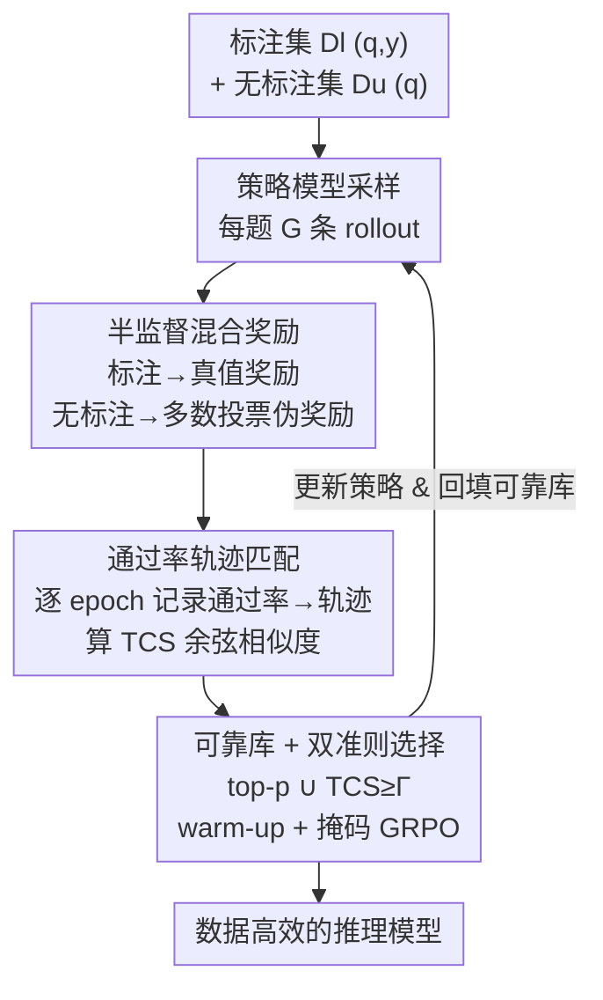

# TRAPO：用半监督强化学习增强 LLM 推理

**会议**: ICLR 2026  
**OpenReview**: [https://openreview.net/forum?id=3K1y4KbWAx](https://openreview.net/forum?id=3K1y4KbWAx)  
**代码**: https://github.com/ShenzhiYang2000/TRAPO  
**领域**: LLM推理  
**关键词**: RLVR, 半监督学习, 通过率轨迹, 伪标签, 数据效率

## 一句话总结
TRAPO 提出半监督 RLVR 范式，用一小撮带标注样本「锚定」无标注样本的一致性奖励，并通过比对有/无标注样本的「通过率轨迹」相似度来挑选可靠的无标注样本，仅用 1K 标注 + 3K 无标注就以 42.6% 平均准确率超过用 45K 无标注训练的最强无监督方法（38.3%），用 10% 标注量即可追平全监督。

## 研究背景与动机
**领域现状**：以 DeepSeek-R1 为代表的 RLVR（带可验证奖励的强化学习）已成为训练大推理模型的主流路线——把题目喂给策略模型采样多条推理轨迹（rollout），用「最终答案是否等于标准答案」算二值奖励，再用组内优势估计（GRPO 等）引导模型探索正确推理路径。

**现有痛点**：监督 RLVR 依赖黄金标注，规模化时标注成本高得离谱，在医学、金融这类标准答案稀缺或昂贵的领域几乎跑不动。为绕开标注，近期无监督 RLVR 改用模型自身的内部信号（多数投票、熵、self-certainty）当奖励，看似不要标签就能自我提升。

**核心矛盾**：纯无监督方法在训练后期普遍「模型坍塌」——奖励信号是自我强化的，一旦多数投票的伪标签本身就是错的，错误推理模式会被不断加固，模型对错误答案越来越自信，陷入恶性反馈循环。根因在于完全缺乏外部 ground truth，无法纠偏。

**本文目标**：在「标注成本」与「训练稳定/有效」之间找平衡——能不能只用极少量标注，就稳住大规模无标注样本上的一致性训练？

**切入角度**：类比人类学习——学生只凭当前信念解题、把最自信的答案当真理，会把错误固化；而人类通常先从少量「已知正确解」的例子里建立正确概念框架，再靠类比泛化。作者据此假设：大推理模型也具备这种性质，少量可验证的标注样本能引导模型从大量无标注语料中泛化出正确模式。

**核心 idea**：提出半监督 RLVR（SS-RLVR），用标注样本当「榜样（role model）」去校准无标注样本的奖励；但作者发现简单地把监督+无监督 loss 相加几乎没用（1K 监督 + 3K 熵无监督只涨 0.6%），关键在于挖掘有/无标注样本之间的内在联系——**只有那些能被标注样本外部验证的推理模式才应被纳入 RL 训练**，为此用「通过率轨迹相似度」来做这个筛选。

## 方法详解

### 整体框架
TRAPO（Trajectory-based Policy Optimization）要解决的是：给定一个小标注集 $\mathcal{D}_l=\{(q_i,y_i)\}$ 和一个大无标注集 $\mathcal{D}_u=\{q_i\}$，如何让无标注样本贡献的奖励是「可靠」的、而不是把错误共识越练越牢。整体转法是——对每道题用策略模型采样 $G$ 条 rollout，标注样本按 ground truth 给监督奖励、无标注样本按多数投票给伪奖励；同时在每个 epoch 记录每道题的「通过率」并拼成一条随训练演化的轨迹；用无标注样本的轨迹与「可靠轨迹库」平均轨迹的余弦相似度来判定哪些无标注样本可信，只让可信的那部分参与 GRPO 更新。核心直觉是：当一个无标注样本被「学对了」，它的通过率轨迹趋势应当和标注样本一致——于是轨迹一致性成了跨越异质解空间、连接有/无标注数据的共享信号。

### 关键设计

**1. 半监督混合奖励：用少量标注锚定一致性奖励**

针对的是纯无监督 RLVR 的恶性反馈循环——伪奖励一旦偏离真实正确性（多数答案≠真值），错误响应就被反复强化。TRAPO 把奖励函数按数据来源拆成两套：标注数据用真值奖励 $R(\tau_i^j,y_i)=\mathbb{I}(a_i^j=y_i)$（提取 boxed 答案与标准答案比对），无标注数据用任意自一致性奖励 $R_u$（论文默认多数投票 $R_u(\tau_i^j)=\mathbb{I}(a_i^j=\mathrm{MAJ}(a_i^1,\dots,a_i^G))$）。合起来是

$$R_{semi}(\tau_i^j)=\begin{cases}R(\tau_i^j,y_i),&(q_i,y_i)\in\mathcal{D}_l\\ R_u(\tau_i^j),&q_i\in\mathcal{D}_u\end{cases}$$

关键在于：标注样本的奖励完全独立于模型共识，于是训练里引入了「正确性（与真值对齐）」与「自一致性（输出内部一致）」之间的显式区分，从而阻止策略去强化那些「内部一致但实际错误」的输出。但作者强调，单这一步还不够——简单相加 loss 只涨 0.6%，必须配合下面的轨迹筛选。

**2. 通过率轨迹匹配（TCS）：用「怎么学」而非「学什么」桥接有/无标注样本**

传统半监督靠特征相似度做标签传播，但 RLVR 里每道题有各自的实例级解空间、「正确输出」差异巨大，直接按相似度对齐无标注与标注样本不可行。TRAPO 的破局点是：从「模型学到了什么」转向「模型是怎么学的」，用训练动态当媒介。对每道题 $q$ 在第 $t$ 个 epoch 定义（伪）通过率——无标注样本用伪标签 $\tilde y^{(t)}$、标注样本用真值 $y$：

$$P_q^{(t)}=\frac{1}{G}\sum_{i=1}^{G}\mathbb{I}(a_i^{(t)}=\tilde y^{(t)}\ \text{或}\ y)$$

把逐 epoch 的通过率拼成轨迹 $T_q^{(t)}=[P_q^{(1)},\dots,P_q^{(t)}]$，再算无标注样本轨迹与可靠库平均轨迹之间的归一化余弦相似度 TCS：

$$\mathrm{TCS}(T_u^{(t)},\bar T_{reliable}^{(t)})=\sum_{j=1}^{t}\hat P_u^{(j)}\cdot\hat{\bar P}_{reliable}^{(j)}$$

其中各项按 L2 范数归一化。直觉是：一个无标注样本若被真正学对，其通过率随训练上升/波动的趋势应与标注样本一致，TCS 高就说明它的推理模式能被标注集外部验证。论文还给出泛化误差界（定理 3.1），证明 $\mathbb{E}_{q'\sim\mathcal{D}_u}[1-\mathrm{TCS}]$ 项相当于一个正则项，把优化路径锚定在标注样本的学习动态上。⚠️ 定理为非正式陈述，细节以原文附录为准。

**3. 可靠轨迹库 + 双准则选择 + warm-up 掩码训练**

这一步把 TCS 落到实际训练里。维护一个可靠通过率数据库 $\mathcal{D}_{reliable}$，初始化为全部标注样本的轨迹 $\mathcal{D}_{reliable}^{(0)}=\{T_l\mid l\in\mathcal{D}_l\}$，后续被选中的可靠无标注轨迹会回填进库、动态更新平均参考轨迹。选择时用两条准则取并集——相似度最高的 top-p 无标注样本，以及任何相似度超阈值 $\Gamma$ 的样本：

$$M(u)=\mathbb{I}\big(u\in\text{top-}p(\mathrm{TCS})\big)\vee\mathbb{I}\big(\mathrm{TCS}\geq\Gamma\big)$$

训练上先做 warm-up（只用标注数据更新、同时累积无标注轨迹），之后才用掩码 $M$ 把可靠无标注样本纳入，最终目标是

$$L(\theta)=J_{GRPO}^{labeled}(\theta)+M\odot J_{GRPO}^{unlabeled}(\theta)$$

$J_{GRPO}$ 即标准 GRPO 目标（带重要性采样裁剪 + KL 正则）。warm-up 保证早期伪标签不至于太噪，双准则兼顾「相对排序」与「绝对可信度」，回填机制让可靠库随训练越来越准——三者共同保证只有「确实在稳步学好」的无标注样本才影响模型更新。

### 损失函数 / 训练策略
训练目标为 $L(\theta)=J_{GRPO}^{labeled}+M\odot J_{GRPO}^{unlabeled}$，无标注分支被选择掩码 $M$ 门控。关键超参为 top-p（默认选 top 30% 无标注样本最优）、阈值 $\Gamma$、warm-up 轮数；过大的 top-p 会引入早期噪声伪标签，$\Gamma$ 过低纳入低质样本、过高则利用不足，warm-up 过短伪标签不稳。基座为 Qwen2.5-Math-7B，训练集采样自 OpenR1-Math-220k，采样温度 $T=0.6$。

## 实验关键数据

### 主实验
基于 Qwen2.5-Math-7B，对比监督 / 无监督 / 半监督三种范式，ID 为六个数学推理基准平均、OOD 为 ARC-c / GPQA-diamond / MMLU-Pro 平均。

| 设置 | 方法 | ID Avg. | OOD Avg. |
|------|------|---------|----------|
| 无监督 / 45K 无标注 | 最强无监督（Self-certainty） | 38.3 | 48.4 |
| 半监督 / 1K 标注+3K 无标注 | 全监督（仅 1K 标注） | 39.4 | 52.1 |
| 半监督 / 1K 标注+3K 无标注 | 最强 naive 半监督 | 40.0 | 52.6 |
| 半监督 / 1K 标注+3K 无标注 | **TRAPO** | **42.6** | **56.1** |
| 半监督 / 4K 标注+12K 无标注 | **TRAPO** | **45.6** | **59.7** |
| 全监督 / 45K 标注 | Fully Supervised | 45.5 | 57.3 |

仅用 1K 标注 + 3K 无标注，TRAPO 比用 45K 无标注的最强无监督方法 ID +4.3% / OOD +3.7%，比最强 naive 半监督 ID +2.6% / OOD +3.5%，比同样 1K 标注的全监督 ID +3.2% / OOD +4.0%。更亮眼的是用 4K 标注 + 12K 无标注（仅 10% 标注量），ID 45.6 / OOD 59.7 反超用全部 45K 标注的全监督（45.5 / 57.3）。

### 跨域无标注实验
标注为数学（ID）、无标注换成非数学（OOD），考验跨域迁移。

| 方法 | ID Avg. | OOD Avg. |
|------|---------|----------|
| 最强无监督 | 39.2 | 53.4 |
| naive 半监督（Self-certainty） | 38.6 | 51.9 |
| **TRAPO** | **41.0** | **56.9** |
| 全监督 / 2K 标注 | 41.9 | 57.8 |

naive 半监督在域偏移下甚至掉点（self-certainty ID −0.6%），而 TRAPO 比最强无监督 ID +1.8% / OOD +3.5%，逼近 2K 全监督（仅差 0.9%），说明轨迹匹配能在跨域时稳健迁移推理知识。

### 关键发现
- **轨迹匹配确实抓得住可靠样本**：轨迹相似度 top 10% 的无标注样本性能比 bottom 10% 高 40% 以上；即使用投票伪标签估计动态，与真值动态仍强正相关，证明 TCS 实用。
- **选择比例存在甜点**：top 30% 无标注样本效果最佳，再加更多反而引入噪声、收益下降，凸显智能去噪/选择的关键作用。
- **超参敏感性符合直觉**：top-p 过大→早期噪声伪标签，$\Gamma$ 过低/过高都伤害性能，warm-up 越长伪标签越稳。
- **换基座仍稳**：在 Llama-3.1-8B-Instruct 上，无监督训练几十步内就快速坍塌，而 TRAPO 走势与监督训练相似、持续改进，说明轨迹匹配选伪监督对稳住训练至关重要。

## 亮点与洞察
- **「怎么学」比「学什么」更可迁移**：传统半监督靠特征/语义相似度，在 RLVR 实例级解空间里失效；TRAPO 改用通过率轨迹（学习动态）当跨样本共享信号，巧妙绕过了解空间异质性——这个视角可迁移到任何「输出空间因样本而异、但学习曲线可比」的半监督场景。
- **标注当锚而非当数据**：1K 标注的价值不在多训练几条样本，而在持续校准无标注样本的奖励可信度，这解释了为何 10% 标注就能反超全监督。
- **理论与机制对齐**：泛化误差界里 $1-\mathrm{TCS}$ 自然充当正则项，把无标注样本的优化路径锚到标注动态上，机制和定理互相印证而非各说各话。

## 局限与展望
- 无标注奖励默认用多数投票，伪标签质量受基座共识能力上限制约；若基座在某域共识普遍偏错，可靠库初期可能引入偏差（warm-up 只能缓解不能根治）。
- 主结果集中在数学推理 + Qwen/Llama，跨域实验也以「数学标注引导非数学」为主，对完全无数学先验的专业域（医学/金融，作者反复举例却未直接实验）有效性仍待验证。
- top-p、$\Gamma$、warm-up 三个超参对性能敏感，实际新域上需要调参，论文给了趋势但缺自适应设定方案。
- 维护逐 epoch 通过率轨迹库 + 每步算 TCS 带来额外开销，附录 E.7 虽分析时间效率，但大规模无标注集下的可扩展性边界值得进一步关注。

## 相关工作与启发
- **vs 无监督 RLVR（TTRL / Self-certainty / Entropy）**：它们完全靠内部信号（多数投票/熵/自信度）算奖励，后期易因偏差信号自我强化而坍塌；TRAPO 用少量标注外部锚定，把「正确性」与「自一致性」解耦，稳住训练且大幅超越。
- **vs naive 半监督（监督+无监督 loss 简单相加）**：naive 做法把有/无标注数据独立处理，忽略二者内在联系，提升微弱（+0.6%）；TRAPO 用标注主动「引导」无标注学习，靠轨迹相似度筛可靠样本，ID/OOD 各再涨 2.6%/3.5%。
- **vs 传统半监督学习（FixMatch / MixMatch 等）**：它们在共享离散标签空间里靠特征相似度做标签传播；RLVR 的实例级解空间让特征对齐失效，TRAPO 转用学习动态（通过率轨迹）作桥，是把半监督思想搬进 RLVR 的关键适配。
- **vs 推理数据选择方法**：外部法依赖人工/知识库/代理模型，内部法用输出概率/语义熵/隐表示等浅层指标；TRAPO 直接探测「数据的内在学习动态」，挑出真正有益于稳健训练的无标注实例。

## 评分
- 新颖性: ⭐⭐⭐⭐⭐ 首次把半监督引入 RLVR，并用通过率轨迹相似度桥接有/无标注样本，视角新且配理论界。
- 实验充分度: ⭐⭐⭐⭐ 覆盖 ID/OOD、跨域、多基座、多超参敏感性与选择策略对比，但主域偏数学。
- 写作质量: ⭐⭐⭐⭐ 动机推导（人类学习类比→恶性循环→锚定）清晰，方法与理论衔接顺畅。
- 价值: ⭐⭐⭐⭐⭐ 10% 标注追平/反超全监督，对标注稀缺的专业域 RLVR 训练有直接实用价值。

<!-- RELATED:START -->

## 相关论文

- [\[ICLR 2026\] Rectifying LLM Thought from Lens of Optimization](rectifying_llm_thought_from_lens_of_optimization.md)
- [\[ICLR 2026\] Nudging the Boundaries of LLM Reasoning](nudging_the_boundaries_of_llm_reasoning.md)
- [\[ICLR 2026\] Quantile Advantage Estimation: Stabilizing RLVR for LLM Reasoning](quantile_advantage_estimation_stabilizing_rlvr_for_llm_reasoning.md)
- [\[ICLR 2026\] Reference-guided Policy Optimization for Molecular Optimization via LLM Reasoning](reference-guided_policy_optimization_for_molecular_optimization_via_llm_reasonin.md)
- [\[ICLR 2026\] Random Policy Valuation is Enough for LLM Reasoning with Verifiable Rewards](random_policy_valuation_is_enough_for_llm_reasoning_with_verifiable_rewards.md)

<!-- RELATED:END -->
