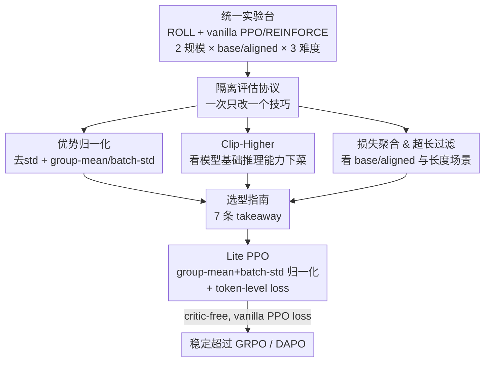

# Tricks or Traps? A Deep Dive into RL for LLM Reasoning

**会议**: ICLR 2026  
**OpenReview**: [https://openreview.net/forum?id=R0JM3BWP7W](https://openreview.net/forum?id=R0JM3BWP7W)  
**代码**: https://github.com/alibaba/ROLL （实验基于 ROLL 框架）  
**领域**: LLM推理  
**关键词**: RL4LLM, 优势归一化, Clip-Higher, 损失聚合, Lite PPO

## 一句话总结
这篇论文在统一开源框架里把 RL4LLM 常用的归一化、裁剪、损失聚合、超长过滤等"技巧"逐个隔离做了 160+ 组对照实验，澄清了它们各自的适用场景，并发现只需把"group-mean + batch-std 优势归一化"和"token-level 损失聚合"两招组合（称为 Lite PPO），就能在 vanilla PPO loss、无 critic 的设置下稳定超过堆料更多的 GRPO 和 DAPO。

## 研究背景与动机

**领域现状**：自 OpenAI o1、DeepSeek-R1 之后，用强化学习（RL）撬动大模型的数学、代码推理能力成了最热的方向，社区涌现出一大批优化技巧——优势归一化（GRPO 的 group-level、REINFORCE++ 的 batch-level）、Clip-Higher、超长过滤、token-/sequence-level 损失聚合、各种 reward shaping 等等。

**现有痛点**：这些技巧缺乏统一的使用准则，而且彼此结论打架。比如 GRPO 主张 group-level 归一化、REINFORCE++ 偏好 batch-level；GRPO 在归一化里保留方差项，而 Dr. GRPO 明确建议去掉方差项以消除偏置。同一件事，不同论文给出相反建议，让实践者无所适从。

**核心矛盾**：结论冲突的根源在于各家工作的实验设置、训练数据、模型初始化差异巨大——有人用 base 模型、有人用 aligned 模型，数据难度也不同，于是把"技巧本身的效果"和"环境差异带来的效果"混在了一起，无法直接比较。再加上 Normalization / Clip / Filtering 这些看似正交的技巧排列组合空间巨大，实践者很难从中挑出真正有效的组合。

**本文目标**：把每个技巧从"配方堆"里单独拎出来，在**完全一致**的框架、baseline、数据、模型下做隔离评估，回答两个问题——每个技巧分别适合什么场景？是否存在一个简单且可泛化的组合能稳定提升策略优化？

**切入角度**：沿用经典 RL 实证分析的做法（"What matters in on-policy RL"那一类），用可复现的大规模对照实验拆解机制，而不是再发明新算法。覆盖两种模型规模（Qwen3-4B/8B）、base 与 aligned 两种初始化、Easy/Medium/Hard 三档难度，共 160+ 组独立 RL 训练实验。

**核心 idea**：先用隔离实验把每个技巧的"内在机制 + 适用条件"讲清楚，再据此反推出一个极简组合 Lite PPO——证明"少即是多"，复杂的技巧堆叠并不必然更好。

## 方法详解

### 整体框架

这篇论文不是提出一个新算法，而是搭了一套"控制变量的实验台"：固定 ROLL 训练框架、固定用 REINFORCE 估计优势 + vanilla PPO loss 作为统一 baseline、固定数据采样与超参，然后**一次只改一个技巧**，观察它在不同模型规模 / 初始化 / 数据难度下对收敛速度、稳定性、最终精度的影响。四大类技巧（优势归一化、Clip-Higher、损失聚合粒度、超长过滤）被逐一解剖，得到 7 条 takeaway 和一张"该用哪个技巧"的选型图谱，最后把其中最稳的两招合成 Lite PPO 与主流方法对打。

### 关键设计

**1. 隔离评估协议：把技巧从配方堆里单拎出来，消除"环境噪声"**

社区结论打架的根因是各家把技巧和环境差异混在一起测，本文针对的就是这一点。所有实验跑在同一个 ROLL 框架上，统一采用 PPO loss + REINFORCE 优势估计作 baseline，统一 global batch size 1024（rollout 128 prompt × 每 prompt 8 条采样）、最大长度 8192、学习率 $1\text{e}{-6}$、采样温度 0.99。在此之上**一次只切换一个技巧**，并系统铺开三个维度：模型规模（Qwen3-4B / 8B）、初始化（base 预训练版 vs aligned 对齐版）、数据难度（用 GPT-4o 把 SimpleRL-Zoo、Deepmath 标成 Easy/Medium/Hard 三档，难度定义为"8 次 rollout 里答对的条数"）。正因为把变量锁死，他们才敢断言"某技巧只在 base 模型上有用"这类条件结论，而不是像以往那样给出无条件的、互相矛盾的推荐。

**2. 优势归一化：方差项不是越多越好，mean 与 std 要分层算**

优势归一化是 RL4LLM 的标配，但 group-level（GRPO）与 batch-level（REINFORCE++）孰优、要不要保留 std 项一直没有定论。本文先比较三种设置（不归一化 / batch-level / group-level），发现 group-level 收敛更稳、最终更高，而 batch-level 对 reward 分布偏斜极敏感，少数离群样本主导优势估计时容易崩。更关键的是 **Takeaway 1**：当一个 prompt 组内的回答几乎全对或全错时，奖励高度集中，组内 std 会趋近于 0，此时除以这个极小的 std 会把梯度异常放大、过度强调极端难度样本（即"difficulty bias"），甚至梯度爆炸。形式上把标准的

$$A^{\text{group}}_k = \frac{r_k - \text{mean}(\{r_j\}_{j=1}^K)}{\text{std}(\{r_j\}_{j=1}^K)}$$

退化成只减均值、不除方差的 $A^{\text{std}\neg}_k = r_k - \text{mean}(\{r_j\}_{j=1}^K)$，在 Easy 数据上反而更稳。在此基础上 **Takeaway 2** 给出更鲁棒的"分层"方案：均值在**局部（group）**算、标准差在**全局（batch）**算——batch-level 的 std 提供了更强的归一化、把梯度幅度压下来，避免单组奖励同质化带来的干扰，比纯 group-std 或纯 batch-std 都更稳。这正是 Lite PPO 采用的归一化形式。

**3. Clip-Higher：放宽上界 $\varepsilon_{high}$ 是给"会推理的模型"用的，且小模型有"scaling law"**

PPO 的 ratio clip 会过度压制低概率 token，导致熵坍缩、输出过度确定、探索枯竭；DAPO 提出放宽裁剪上界 $\varepsilon_{high}$ 来缓解：$J(\theta)=\text{clip}(r_{i,t}(\theta),\,1-\varepsilon_{low},\,1+\varepsilon_{high})$。但何时、调到多少一直缺乏分析。本文 **Takeaway 3** 给出条件：调高 $\varepsilon_{high}$ 对 base 模型几乎无效（base 模型裁剪率仅约 0.003，策略表达力弱、更新本就极小），但对 aligned 模型明显减缓熵坍缩、带来稳定的下游提升——因为 aligned 模型初始高概率 token 更少，放宽上界能缩小 token 概率差距、维持更高的熵和探索。**Takeaway 4** 从语言学角度补充：上界 0.2 时主要裁剪 "therefore/if/but" 这类逻辑连接词，压制了新颖推理结构；放到 0.28 后裁剪焦点转向 "is/the/," 这类高频功能词，既保住句子稳定性又解放了推理多样性。**Takeaway 5** 则发现一个有趣现象：小模型（4B）的精度随上界单调上升、到 0.32 才峰值，呈现类"scaling law"；而 8B 在 0.28 即最优、再调高无收益——说明这个超参要因模型规模而异。

**4. 损失聚合粒度与超长过滤：都得"看模型/看长度下菜"**

这两类技巧本文得出的都是条件性结论，故合并讲。**损失聚合（Takeaway 6）**：sequence-level（GRPO）先在样本内对 token 求均值、再跨样本求均值，等权对待每条回答，但会让长回答的每个 token 影响被稀释、优化偏向简短；token-level 则按 token 计优势以消除长度偏置。实验显示 token-level 只在 **base 模型**上明显更好（尤其难数据），到 aligned 模型上优势消失、反而 sequence-level 收敛更快更高——因为 aligned 模型推理已稳定，细粒度 token 加权不必要甚至有害。**超长过滤（Takeaway 7）**：它把超长被截断的回答的 reward 屏蔽掉，避免把"没生成完"误判成负样本。但效果取决于阈值与任务：8k 阈值下能逼模型写得更简洁、提升明显；放到 20k 后增益减弱，此时被截断的多是"重复且无法终止"的退化生成——过滤恰好滤掉这些无效输出、帮助策略正确建模 EOS 终止，但对真正的长尾推理任务帮助有限。结论同样是"短到中等长度推理任务受益、长尾任务收益甚微"。

### 一个完整示例：Lite PPO 怎么用两招打赢堆料方法

把上面的隔离结论落地：对 base/非对齐模型，最值钱的两条经验是——(i) 优势归一化用 group-mean + batch-std（Takeaway 2），把稀疏奖励转成鲁棒信号；(ii) 损失聚合用 token-level（Takeaway 6），对 base 架构最有效。于是 Lite PPO 就是"vanilla PPO loss + 无 critic + 这两招"，不要 Clip-Higher、不要超长 reward shaping、不要动态采样。对照之下，DAPO 一口气堆了 group-level 归一化、Clip-Higher、超长 reward shaping、token-level loss、动态采样五样东西。实验里（4B/8B base，Easy/Hard）Lite PPO 持续稳步上升，而 GRPO、DAPO 往往峰值之后就崩——印证了"少即是多"：Takeaway 2 的归一化抵消了混合数据里同质奖励的干扰，token-level 聚合又恰好契合 base 模型。

### 损失函数 / 训练策略

底座是 vanilla PPO clip loss，优势用 REINFORCE 蒙特卡洛回报估计，**不引入 critic（value 网络）**。Lite PPO 在此之上只叠加两处改动：优势归一化采用"组内均值 - 批内标准差"，损失按 token-level 聚合。其余超参与统一 baseline 一致（global batch 1024、lr $1\text{e}{-6}$、最大长度 8192）。

## 实验关键数据

### 主实验

整篇论文以学习曲线（精度随训练步、熵随训练步）为主，核心定量结论可归纳如下：

| 设置 | 对比项 | 关键结论 |
|------|--------|----------|
| Base 模型, Easy 数据 | w/ std vs w/o std 归一化 | 奖励集中时去掉 std 项更稳，避免梯度异常放大 |
| Base 模型 | group-mean+batch-std vs 纯 group-std | 分层算（全局 std）收敛更稳、更高 |
| Aligned 4B | $\varepsilon_{high}$ 0.20→0.32 | 精度单调上升，0.32 峰值（小模型 scaling law） |
| Aligned 8B | $\varepsilon_{high}$ 0.20→0.32 | 0.28 最优，再高无收益 |
| Base vs Aligned | token-level vs sequence-level loss | token-level 只对 base 有效，aligned 上 sequence-level 更好 |
| Base 模型, Easy/Hard | Lite PPO vs GRPO vs DAPO | Lite PPO 稳步上升，GRPO/DAPO 峰值后崩 |

### 消融实验

| 配置 | 现象 | 说明 |
|------|------|------|
| Lite PPO（group-mean+batch-std + token-level） | 六个数学 benchmark 平均精度最高、曲线稳定 | 完整组合 |
| GRPO（group-level 归一化 + sequence-level） | 峰值后崩 | 缺分层归一化 |
| DAPO（五种技巧堆叠） | 峰值后崩 | 技巧越多反而越不稳 |
| 超长过滤 @8k vs @20k | 8k 提升、20k 增益弱 | 过滤效果依赖阈值与任务长度 |

### 关键发现
- **方差项是把双刃剑**：奖励分布越集中（Easy 数据 / 几乎全对全错），std 越小、除它越危险；这解释了 GRPO 与 Dr. GRPO 的分歧——它们其实各自在不同奖励方差区间下都对。
- **mean 与 std 该分层**：组内算均值保留组内竞争信号、批内算标准差提供更强的梯度压缩，组合后最鲁棒，是 Lite PPO 的核心。
- **几乎所有技巧都"看模型下菜"**：Clip-Higher、token-level loss 都只在特定初始化（base/aligned）或规模上有效，无条件套用反而有害。
- **少即是多**：两招 Lite PPO 稳过五招 DAPO，挑战了 RL4LLM "技巧越多越好"的惯性。

## 亮点与洞察
- 把"结论打架"归因到实验环境不一致，并用统一实验台逐一隔离验证——这是一份难得的、可复现的 RL4LLM "避坑指南"，比任何单个新 trick 更有沉淀价值。
- 对方差项的分析很到位：不是简单说"要/不要 std"，而是定位到"奖励分布集中度"这个真正的开关变量，统一了社区两派看法。
- Lite PPO 极简到几乎不增加任何工程复杂度（vanilla PPO + 两处改动、无 critic），落地成本低、可直接迁移到自己的 RL pipeline。
- "Clip-Higher 的语言学视角"是个巧妙观察：从被裁剪的具体 token（连接词 vs 功能词）解释为什么放宽上界能解放推理结构，把超参调节和模型行为对上了号。

## 局限与展望
- 实验只覆盖数学推理 + Qwen3 系列两种规模，结论能否外推到代码生成、agent、其他模型族（Llama/Mistral 等）有待验证。
- 是一篇实证 / 经验研究，结论多为"在某设置下更好"的相关性观察，理论保证较弱（如分层归一化为何更优只给了直觉解释）。
- Lite PPO 只在 **base / 非对齐**模型上验证占优；对已经对齐的模型该用什么组合，本文给的是分散的 takeaway 而非现成配方。
- 横向比较需谨慎：不同难度、不同长度阈值下的结论不可直接跨场景套用（论文自己也反复强调"看场景下菜"）。

## 相关工作与启发
- **vs GRPO**：GRPO 用 group-level 归一化 + 保留方差 + sequence-level loss；本文指出方差项在奖励集中时有害，并改用 group-mean/batch-std + token-level，得到更稳的 Lite PPO。
- **vs DAPO**：DAPO 堆叠 Clip-Higher、超长 reward shaping、token-level、动态采样等五样；本文证明在 base 模型上只取其中两招即可超过它，主张去复杂化。
- **vs REINFORCE++ / Dr. GRPO**：本文把"batch-level vs group-level""要不要 std"这些彼此冲突的主张放进统一实验台，给出条件化的调和结论，而非再站一边。
- **vs 经典 RL 实证研究（What matters in on-policy RL 等）**：方法论一脉相承——通过大规模隔离实验提炼实践准则，本文把这套范式搬到了 RL4LLM 场景。

## 评分
- 新颖性: ⭐⭐⭐⭐ 不提新算法，但用系统隔离实验澄清了一堆冲突结论，Lite PPO 的"极简胜堆料"有说服力。
- 实验充分度: ⭐⭐⭐⭐⭐ 160+ 组独立训练，覆盖两规模、base/aligned、三难度、六 benchmark，控制变量严谨。
- 写作质量: ⭐⭐⭐⭐ 七条 takeaway 组织清晰，机制解释到位；但图多表少，部分结论需对照学习曲线才能读全。
- 价值: ⭐⭐⭐⭐⭐ 给 RL4LLM 实践者一份可直接照搬的选型指南 + 低成本强 baseline，复现与落地价值高。

<!-- RELATED:START -->

## 相关论文

- [\[ICLR 2026\] RL of Thoughts: Navigating LLM Reasoning with Inference-Time Reinforcement Learning](rl_of_thoughts_navigating_llm_reasoning_with_inference-time_reinforcement_learni.md)
- [\[ICLR 2026\] Beyond Markovian: Reflective Exploration via Bayes-Adaptive RL for LLM Reasoning](beyond_markovian_reflective_exploration_via_bayes-adaptive_rl_for_llm_reasoning.md)
- [\[ICLR 2026\] THOR: Tool-Integrated Hierarchical Optimization via RL for Mathematical Reasoning](thor_tool-integrated_hierarchical_optimization_via_rl_for_mathematical_reasoning.md)
- [\[ICLR 2026\] Dynamics-Predictive Sampling for Active RL Finetuning of Large Reasoning Models](dynamics-predictive_sampling_for_active_rl_finetuning_of_large_reasoning_models.md)
- [\[ICLR 2026\] Co-rewarding: Stable Self-supervised RL for Eliciting Reasoning in Large Language Models](co-rewarding_stable_self-supervised_rl_for_eliciting_reasoning_in_large_language.md)

<!-- RELATED:END -->
