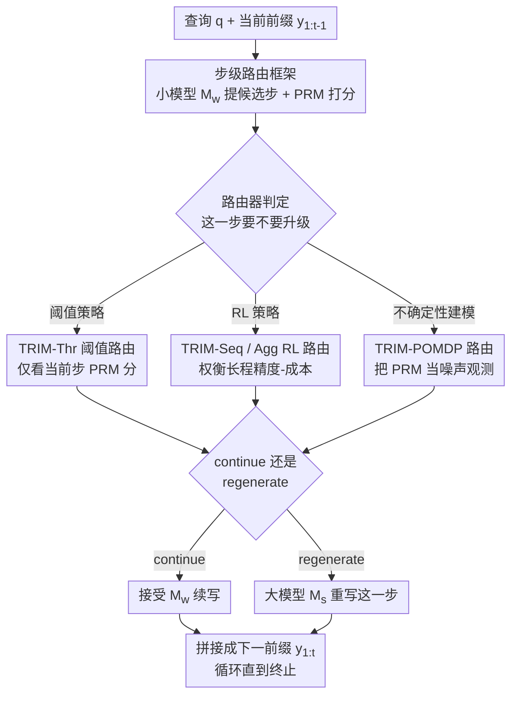

# TRIM: Hybrid Inference via Targeted Stepwise Routing in Multi-Step Reasoning Tasks

**会议**: ICLR 2026  
**OpenReview**: [https://openreview.net/forum?id=MoKrugWUfC](https://openreview.net/forum?id=MoKrugWUfC)  
**代码**: 无  
**领域**: LLM推理 / 推理效率  
**关键词**: 步级路由, 混合推理, 过程奖励模型, POMDP, 成本-精度权衡

## 一句话总结
TRIM 把"大模型 vs 小模型"的路由粒度从整条 query 细化到每一个推理步——用过程奖励模型（PRM）识别"会让解题崩盘的关键步"，只把这些步交给昂贵大模型重写，其余常规步骤让便宜小模型续写，从而在 MATH-500、AIME 等数学推理基准上用低至 20% 的昂贵 token 就追平大模型的精度。

## 研究背景与动机
**领域现状**：LLM 生态里既有强但贵的大模型（如 Claude 3.7 Sonnet），也有弱但便宜的小模型（如 Qwen2.5-3B）。为了平衡质量与成本，主流路由方法（RouteLLM、Smoothie、AutoMix 等）会在**query 级别**做决策：根据问题难度把整条查询整体分给某一个模型。

**现有痛点**：query 级路由隐含一个错误假设——"一条回答里的每个 token 难度都一样，要么全程需要大模型、要么全程不需要"。但在多步推理里这显然不成立：一段解答里只有少数几步是真正决定成败的**关键决策点**，其余大多是常规续写。一旦把整条 query 交给大模型，就在那些本可以让小模型轻松完成的常规步上白白烧掉了昂贵 token。

**核心矛盾**：多步推理的失败是**级联式**的——早期一步错就会像滚雪球一样让整条解答崩溃（cascading failure）。大模型的价值恰恰集中在"防止某一步把轨迹带偏"这件事上，而 query 级路由无法把干预精准投放到这些步。

**本文目标**：把路由问题重新形式化为一个**步级的序贯决策过程**——在生成的每一步判断"这一步要不要升级到大模型重写"，在最大化最终答案正确率与最小化昂贵模型 token 数之间取得最优权衡。

**切入角度**：作者观察到 PRM 能给每个中间步打出"正确性分数"，这个步级信号正好可以用来定位"会让解题derail的关键步"。过去 PRM 主要用于 beam search 选候选或塑造探索，本文把它挪用到**生成过程中的路由决策**上。

**核心 idea**：用"步级靶向干预"替代"整条 query 切换"——只在小模型那一步可能出错时，才用大模型重写这一步，其余交给小模型续写。

## 方法详解

### 整体框架
TRIM 把一条解答按"双换行"切成若干推理步 $y_1, y_2, \dots, y_N$，逐步生成。在每一步 $t$，便宜模型 $M_w$ 先提出一个候选续写 $y_t^w = M_w(y_{1:t-1})$；一个**步级路由器**结合 PRM 对当前部分轨迹的打分，决定动作 $a_t \in \{\text{continue}, \text{regenerate}\}$：若 `continue` 就接受小模型这一步；若 `regenerate` 就让昂贵大模型 $M_s$ 重写这一步 $y_t^s = M_s(y_{1:t-1})$，再让小模型从修正后的前缀继续往下写。这样解答轨迹被逐位拼起来，每一位要么是小模型的步、要么是被大模型重写过的步，而不是像 query 级路由那样把整条剩余解答一次性交给大模型。

成本只按**大模型 decode 出的 token 数**计——因为 prefill（KV-cache 构建）可以像投机解码那样和小模型并行 chunked 摊销掉，而大模型逐 token 的串行解码才是不可规避的开销瓶颈。

围绕这个框架，作者设计了一组**复杂度递增**的路由策略：从只看当前步分数的阈值策略 TRIM-Thr，到用 RL 训练、会权衡长程精度-成本的 TRIM-Seq / TRIM-Agg，再到把 PRM 噪声显式建模为部分可观测的 TRIM-POMDP。

### 关键设计

**1. 步级靶向路由框架：把昂贵干预精准投到"会崩盘的那几步"**

这一设计直击 query 级路由"整条切换、难度均一假设"的痛点。TRIM 不再为整条 query 选模型，而是把生成建模为序贯决策：在每个前缀 $y_{1:t}$ 上选 $a_t \in \{\text{continue}, \text{regenerate}\}$。`continue` 时下一前缀为 $y_{1:t+1} = (y_{1:t}, M_w(y_{1:t}))$；`regenerate` 时先用大模型重写上一步 $y'_{1:t} = (y_{1:t-1}, M_s(y_{1:t-1}))$，再让小模型接着写。决策信号来自 PRM：给定轨迹 $y_{1:t}$，PRM 输出逐步分数 $r_{1:t} = (r_1, \dots, r_t)$，作为"这一步是否正确、是否值得升级"的代理。它之所以有效，是因为多步推理的错误是**局部且级联**的——只要在少数关键步把轨迹拉回正轨，整条解答就能成立，于是绝大多数昂贵 token 被省了下来。

**2. TRIM-Thr 近视阈值策略：最简单的"分数低于阈值就重写"**

最朴素的实例化只看小模型当前步的 PRM 分。设阈值 $k$，策略为

$$\pi_{\text{thr},k}(y_{1:t}) = \begin{cases} \text{regenerate}, & \text{if } \mathrm{PRM}(y_{1:t})_t < k \\ \text{continue}, & \text{otherwise} \end{cases}$$

调节 $k$ 就能在精度-成本曲线上滑动：$k$ 越高越爱升级、越贵越准。它可看作把投机解码里的固定阈值机制搬到路由设定下、并让阈值随成本预算变化。优点是零训练、强 baseline；局限是**近视**——只盯最近一步，既不看历史也不顾未来：哪怕当前步被判错，如果整条轨迹早已偏到无可挽回、或者重写代价大于收益，升级其实是浪费。

**3. TRIM-Seq / TRIM-Agg RL 策略：让路由器权衡长程精度-成本**

为补足近视短板，作者用 RL 训练会看全局的策略。TRIM-Seq 把每步的（PRM 分，token 数）拼成特征序列 $f_{1:t} = ((r_1,c_1), \dots, (r_t,c_t))$，分别编码"语义保真度（轨迹是否还在正轨）"和"边际干预成本（重写这步要烧多少大模型 token）"，用 transformer 策略网络输出动作分布，按下式优化期望回报：

$$J(\pi) = \mathbb{E}_\pi\!\left[ R(y_{1:T}) - \lambda \sum_{t=1}^{T} \mathbb{1}\{a_t = \text{regenerate}\}\cdot |M_s(y_{1:t-1})| \right]$$

其中 $R$ 是最终答案正确与否的二元终端奖励，$\lambda > 0$ 控制成本-精度权衡，惩罚项正比于大模型重写出的 token 数。TRIM-Agg 则把完整序列压成一个**精简聚合特征** $\tilde f_{1:t} = (r_t,\ \min(r_{1:t-1}),\ c_t,\ t)$：当前步分数、历史最低分（"最弱一环"指示器，捕捉一步错则全错的级联结构）、当前步 token 长度、步索引。它用同样的 RL 目标训练，但训练**显著更快**、性能几乎无损——因为数学推理里 $\min$ 和分数连乘这类聚合量本就是解答整体正确性的有效代理。

**4. TRIM-POMDP 策略：把 PRM 分数当成"真状态的噪声观测"**

前面策略都默认 PRM 分可信，但 PRM 其实**有噪声**，会把对的步判错、错的步判对。TRIM-POMDP 显式把真实正确性当作隐状态、把 PRM 分当作它的不完美观测来推断。隐状态分三类（再附加当前步索引与 token 成本）：$S_0$ 轨迹至今正确、$S_1$ 已不可逆地偏离、$S_2$ 最近一步错但前面对、仍可挽回。观测空间是 PRM 给出的历史累计分、当前步分及辅助特征。作者用带步级标注的过程监督数据集（如 ProcessBench）**离线拟合观测函数**——即建模"给定隐状态时 PRM 输出的分布"，图 5 显示这些条件分布虽集中在状态一致区域但有明显扩散，正说明 PRM 噪声真实存在。观测函数只需对齐 PRM 分与标注标签，**训练一次即可在不同 $\lambda$ 下复用**；随后调用标准 POMDP 求解器（通常不到 1 分钟）即可重算出最优路由策略。它还有个附带好处：策略几乎与具体 $(M_s, M_w)$ 无关，只依赖二者的下一步精度作为转移函数输入。实验中 TRIM-POMDP 在**低预算**（大 $\lambda$）区间尤其强——此时 RL 因稀疏奖励难训，而 POMDP 求解不受稀疏奖励动力学拖累。

### 损失函数 / 训练策略
RL 策略（Seq/Agg）以上式 $J(\pi)$ 为目标，二元终端任务奖励 $R$ 加上按大模型 decode token 计的成本惩罚，$\lambda$ 调节权衡；TRIM-Agg 因特征精简而训练更快。TRIM-POMDP 不靠 RL，而是离线拟合观测函数 + 在线 POMDP 求解，对不同成本预算只需重跑求解器、无需重训。两个模型设置为 $M_w=$ Qwen2.5-3B-Instruct、$M_s=$ Claude 3.7 Sonnet，PRM 用 Qwen2.5-Math-PRM-7B。

## 实验关键数据

### 主实验
评测指标围绕"成本-精度权衡"：$\bar C(\pi)$ 为每 query 平均大模型 token 数、$c(\pi)$ 为归一化占比；PGR（恢复了多少 $M_w$ 与 $M_s$ 之间的精度差）；CPT(x%) 为达到 x% PGR 所需的最小 token 成本；$\Delta$IBC 为相对"全用大模型"的单位成本性能增益（越大越省）。下表为 MATH-500 与 AIME 上 CPT(95%) 处的归一化昂贵 token 占比与 $\Delta$IBC（占比越低越省）：

| 数据集 | 指标 | TRIM-POMDP | TRIM-Agg | 之前最佳 baseline | 效果 |
|--------|------|-----------|----------|------------------|------|
| MATH-500 | CPT(95%) token 占比 | 17.98% | 17.21% | AutoMix-PRM 53.96% | 省约 3× token |
| MATH-500 | $\Delta$IBC | 5.86 | 5.67 | AutoMix-PRM 0.95 | TRIM-Thr 已达 4.75（≈5×） |
| AIME | CPT(95%) token 占比 | 28.17% | 38.01% | SW Ranking 82.34% | 大幅降低 |
| AIME | $\Delta$IBC | 5.00 | 2.50 | SW Ranking 0.79 | POMDP 约 6.33× |

关键结论：即便最简单的 TRIM-Thr，在 MATH-500 上 $\Delta$IBC=4.75，已是最强 baseline（AutoMix-PRM 0.95）的约 5×；TRIM-Agg 在高预算区间用约 80% 更少的昂贵 token 就追平大模型 95% 的性能差。

### 消融实验
跨数据集泛化（路由器仅在 AIME 上训练，迁移到 OlympiadBench / Minerva Math），用 $\Delta$IBC 衡量：

| 配置 | AIME | OlympiadBench | Minerva Math | 说明 |
|------|------|---------------|--------------|------|
| BERT (query 级) | 0.44 | -0.04 | -0.1 | query 级路由迁移即崩 |
| SW Ranking (query 级) | 0.79 | 0.07 | 0.04 | 同样大幅退化 |
| TRIM-Thr | 1.81 | 1.31 | 2.23 | 步级信号稳健 |
| TRIM-Agg | 2.50 | 2.57 | 3.12 | 仅 <500 AIME 样本训练，跨域不降反升 |

### 关键发现
- **分预算区间各有所长**：低预算（大 $\lambda$）下 TRIM-POMDP 凭长程规划+不确定性处理领先，因为 RL 在稀疏奖励下难训；高预算（小 $\lambda$）下 TRIM-Agg 反超，因为策略优化更容易。
- **步级信号是可迁移的本质特征**：query 级路由器（BERT、SW Ranking）会拟合数据集的表层相关（题目风格、长度、格式），换域就崩到负值；TRIM 条件于"轨迹内的步级正确性"，反映的是多步推理的普适失败模式（关键步发散），因此跨同难度基准泛化强。
- **样本效率高**：TRIM-Agg 仅用不到 500 条 AIME 样本训练，就在held-out上以 38.01% 昂贵 token 占比达 CPT(95%)，且稳定优于 TRIM-Thr 与所有 query 级 baseline。
- AutoMix 的 PRM 变体一致优于原版自验证版本，说明针对数学步级推理，PRM 比通用自验证给出的正确性信号更可靠。

## 亮点与洞察
- **把路由粒度从 query 降到 step**，是个简单却有效的视角转换：它把"该不该用大模型"这个二元全局决策，拆成一连串"这一步该不该升级"的局部决策，让昂贵算力只花在真正会崩盘的关键步上。
- **一个框架装下一谱系策略**：从零训练的阈值策略，到 RL，到 POMDP，复杂度递增、信息利用递增，读者能清楚看到"看得越远、建模噪声越细，越省"。这种"同一问题、多档策略"的组织方式很值得借鉴。
- **把 PRM 噪声当一等公民**：TRIM-POMDP 不假装 PRM 准，而是用过程监督数据离线拟合"隐正确性状态→PRM 分布"的观测函数，这个 trick 可迁移到任何"用噪声打分器做序贯决策"的场景。
- **观测函数训一次、跨 $\lambda$ 复用**：换成本预算只需重跑 POMDP 求解器（<1 分钟），无需重训，对真实部署里"多档成本档位"非常友好。

## 局限与展望
- 作者指出可进一步从**步级**走向**token 级**路由——既然少数 token 不成比例地影响后续生成，token 级干预可能更细更省，但也更难定位与控制。
- 方法依赖一个质量过得去的 PRM：实验显示在更难的 AIME 上累计正确性估计变得不可靠，限制了路由精度（即便 POMDP 显式建模了噪声）。PRM 越弱，整个框架的天花板越低。
- 评测集中在数学推理（MATH/AIME/Olympiad/Minerva），双模型对也固定为 Qwen2.5-3B + Claude 3.7 Sonnet；跨任务（代码等）与跨模型对的结论放在附录，正文证据有限。
- 跨数据集 $\Delta$IBC 在不同难度基准间不能直接横比大小（任务难度、token 预算口径不同），表中数字应理解为"是否保持正且稳健"而非绝对名次。

## 相关工作与启发
- **vs RouteLLM / Hybrid-LLM / Zooter（query 级路由）**：它们用偏好数据或分类器为整条 query 选模型，假设步间难度均一；TRIM 在步级决策，跨域泛化显著更好（query 级换域即掉到负 $\Delta$IBC）。
- **vs AutoMix**：AutoMix 同样用 POMDP + 自验证做难度估计，但仍是 query 级、且用通用自验证信号；TRIM 用步级 PRM，且作者把 AutoMix 升级成 PRM 版作为更强 baseline 仍被 TRIM 超过。
- **vs 投机解码 / RSD / SpecReason**：这些方法也是多模型协作、用步级信号 accept/regenerate，但目标是**固定高预算下降延迟**；TRIM 的目标是**约束成本预算下最大化精度**，并把阈值规则包含为特例，再叠加对轨迹进度、PRM 噪声、未来收益的更强建模。
- **vs PRM 既有用法**：过去 PRM 多用于 beam search 选候选或塑造 RL 探索；TRIM 把它挪到**生成时的路由决策**，是 PRM 用途上的一个新落点。

## 评分
- 新颖性: ⭐⭐⭐⭐⭐ 把推理路由从 query 级细化到 step 级，并配上阈值/RL/POMDP 一整谱系策略，视角清晰且有据。
- 实验充分度: ⭐⭐⭐⭐ 四个数学基准 + 跨域泛化 + 分预算分析扎实，但任务局限于数学、模型对单一，跨任务/跨模型证据多在附录。
- 写作质量: ⭐⭐⭐⭐⭐ 问题形式化清楚，策略由简到繁层层递进，指标定义完整。
- 价值: ⭐⭐⭐⭐⭐ 用 20% 昂贵 token 追平大模型，对真实成本敏感的推理部署很有吸引力，且观测函数可复用、样本效率高。

<!-- RELATED:START -->

## 相关论文

- [\[ICLR 2026\] Latent Veracity Inference for Identifying Errors in Stepwise Reasoning](latent_veracity_inference_for_identifying_errors_in_stepwise_reasoning.md)
- [\[ICLR 2026\] MAGO: Beyond Fixed Hyperparameters with Multi-Objective Pareto Optimization for Hybrid LLM Reasoning](mago_beyond_fixed_hyperparameters_with_multi-objective_pareto_optimization_for_h.md)
- [\[ICLR 2026\] RL of Thoughts: Navigating LLM Reasoning with Inference-Time Reinforcement Learning](rl_of_thoughts_navigating_llm_reasoning_with_inference-time_reinforcement_learni.md)
- [\[ICLR 2026\] STAT: Skill-Targeted Adaptive Training](stat_skill-targeted_adaptive_training.md)
- [\[NeurIPS 2025\] Self-Evaluating LLMs for Multi-Step Tasks: Stepwise Confidence Estimation for Failure Detection](../../NeurIPS2025/llm_reasoning/self-evaluating_llms_for_multi-step_tasks_stepwise_confidence_estimation_for_fai.md)

<!-- RELATED:END -->
