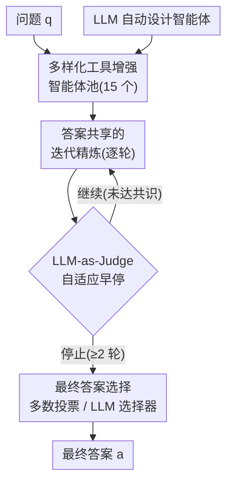

# TUMIX: Multi-Agent Test-Time Scaling with Tool-Use Mixture

**会议**: ICLR 2026  
**OpenReview**: [https://openreview.net/forum?id=HBm3MFtszH](https://openreview.net/forum?id=HBm3MFtszH)  
**领域**: LLM推理 / 多智能体 / Test-Time Scaling  
**关键词**: 工具增强、测试时扩展、多智能体集成、Code Interpreter、Web Search、LLM-as-Judge

## 一句话总结
TUMIX 让同一个 LLM 派生出 15 个工具使用策略各不相同的智能体（纯文本 / 写代码 / 搜索 / 代码+搜索等），让它们并行作答并跨轮共享、相互精炼答案，再用 LLM-as-Judge 自适应早停 + 多数投票挑出最终答案；在 HLE / GPQA / AIME 上以几乎相同的推理成本，平均比最强的工具增强测试时扩展基线高出 3.55%。

## 研究背景与动机
**领域现状**：给 LLM 接上 Code Interpreter 和 Web Search 已经成为前沿产品（ChatGPT Agent、Gemini-Pro、Grok4）提升推理能力的标配，测试时扩展（test-time scaling）也被反复验证有效——多采样几条解、再从中挑对的，往往比单次推理强。

**现有痛点**：但"到底该怎么用工具"几乎没有公开的可操作方法。文本推理擅长语义和常识，却拙于精确计算和获取最新知识；代码擅长精确计算；搜索擅长查事实。问题五花八门，大多数题目本身并不会提示"这题该用代码还是该搜一下"，而 文本/代码/搜索 组合起来的解空间又极大。已有工作要么只用文本、要么只用代码，要么训练模型在数学题上接 Code Interpreter（领域窄），始终没把三种推理模态真正融合好。

**核心矛盾**：测试时扩展本质是两个阶段——(1) 生成多样的候选解以提高覆盖率（coverage，即至少一条对的概率），(2) 从噪声候选里选出正确的那条。已有方法（如 MoA）靠堆多个不同 LLM 来制造多样性，但 Self-MoA 又指出"反复用同一个最强 LLM 比混搭不同 LLM 更好"。于是问题变成：在**单个 LLM + 工具增强**的设定下，到底是"多样的智能体群"赢，还是"重复跑单个最强智能体"赢？同时覆盖率高了，选答案这一步反而成了新瓶颈。

**本文目标**：在单个 LLM 上，系统性地回答工具增强测试时扩展里的四个关键因子——智能体质量、智能体多样性、精炼何时终止、最终怎么选答案。

**切入角度**：作者把整个过程建模成"有限计算预算下、面对一群既多样又相关的专家（智能体）的序贯决策"——每轮决定跑哪些智能体、它们能读到什么、何时停、怎么聚合，在准确率和成本之间权衡。

**核心 idea**：用**工具使用策略的混合（Tool-Use Mixture）**代替"同质化重复采样"——让一个 LLM 派生出一批工具策略迥异的智能体并行作答、跨轮共享精炼，并用 LLM-as-Judge 控制何时停下，从而以近乎相同的成本拿到更高准确率。

## 方法详解

### 整体框架
TUMIX 把测试时扩展拆成"造多样性 → 跨轮精炼 → 自适应停 → 选答案"四步。输入是一道题 $q$（答案未知），输出是最终答案 $\hat{a}$。系统维护一个智能体池 $S=\{s_1,\dots,s_K\}$，默认 $K=15$，每个智能体 $s_i$ 用不同的 文本/代码/搜索 策略给出答案 $Y_i$、代价为 $c_i$、能力 $p_i(q)=P\{Y_i=a^\star\mid q\}$。每一轮里，所有智能体都会拿到"原始问题 + 上一轮所有智能体的推理与答案"拼成的联合提示，各自重新作答（消息传递式精炼）；一个 LLM-as-Judge 在每轮结束后判断是否该停（强制最少 2 轮）；停下后用多数投票 / LLM 选择器敲定最终答案。整套策略 $\pi$ 要最大化的目标是

$$\max_{\pi}\ P\{\hat{a}_\pi=a^\star\}-\lambda\cdot \mathrm{Cost}_\pi,$$

其中 $\mathrm{Cost}_\pi$ 是产出最终答案所需的总推理次数与输入输出 token 数，$\lambda>0$ 控制成本与精度的权衡。

### 关键设计

**1. 多样化工具增强智能体池：让一个 LLM 派生出工具策略迥异的专家群**

这一步直接针对"如何在单个 LLM 上制造高质量多样性"的痛点。作者预先设计了 15 个智能体（Table 1），它们共用同一个底座 LLM，但工具使用策略各不相同：从纯直接回答（Base）、思维链（CoT）、CoT 写代码（CoTcode），到只搜索（S）、只用代码解释器（C / 带人工先验的 C+）、代码+搜索双工具（CS）、再到带 steering 引导的 CSG / CSG+。凡是能搜索的智能体又各有三种搜索变体（Google Search API、LLM 自带搜索、二者组合），带工具的多轮交互最多 5 轮。关键洞察是：**多样性和质量比单纯堆规模更重要**——在相同轮数和推理次数下，把智能体数从 1 → 3 → 15，覆盖率和平均分都显著上升；而强智能体（CSgs）一直比弱智能体（w/o TTS）覆盖率更高。更进一步，作者用 Code Text / Search Text / Code Search Text 三组（每组都是 3 个智能体、各采样 5 次）对照，发现即便平均单体质量相当，**同时拥有代码和搜索的那一组覆盖率和平均分都明显更高**——互补工具不仅提升推理本身，也提升了答案的多样性。这恰好和 Self-MoA"多样性没用、重复最强体更好"的结论相反，原因是这里的多样性来自工具策略而非不同 LLM。

**2. 答案共享的迭代精炼：跨轮消息传递放大探索，但要警惕多样性塌缩**

这一步解决"单轮多样候选还不够，怎么让智能体互相学习"的问题。每一轮，每个智能体都独立重新作答，但作答时会同时参考原始问题和上一轮**所有**智能体的解（消息传递）。作者用两个指标刻画群体答案的质量与多样性：平均准确率，以及覆盖率

$$\mathrm{Coverage}(S)=P\Big(\bigcup_{i\in S}\{Y_i=a^\star\}\Big),$$

在独立假设下 $\mathrm{Coverage}(S)=1-\prod_{i\in S}(1-p_i)$，而正相关会让覆盖率收缩。实测发现一个关键的双刃剑动态：**覆盖率随轮数单调下降**（说明精炼过程会误删一些原本正确的答案），而平均分在 HLE / AIME 上先升后平、在 GPQA 上甚至先升后降。用 Sankey 图看 2500 道 HLE 题：第 1→2 轮"部分正确"的题增多、"全错"和"全对"减少，说明初期共享思路拓宽了探索、促进了多样性；但第 2 轮之后部分正确迅速趋零、全错和全对增多，说明智能体逐渐收敛到一个共享答案（或对或错）。正是这个"过度精炼会塌缩多样性、误删正确解"的现象，催生了下一个设计。

**3. LLM-as-Judge 自适应早停与答案选择：用 49% 成本保住峰值精度**

既然不同难度的题需要不同的精炼轮数、且过度精炼反而掉点，固定轮数就既浪费又有害。作者定义再多跑一轮的期望边际收益

$$\Delta_r=\mathbb{E}[\,A_{r+1}-A_r\mid \text{round } r \text{ 之前的信号}\,],$$

当 $\Delta_r\le\lambda\cdot$（边际成本）时就停。实际策略是：每轮结束后**直接 query LLM 判断是否终止**（依据多样性塌缩、top 答案的票差、答案熵等信号），但强制最少 2 轮——因为 LLM 往往过度自信、会过早停。这个 Term_LLM 策略在保持几乎相同峰值精度的前提下，把推理次数降到原来的约 49%（token 成本更低，约 46%，因为后期轮次的 token 消耗远大于前两轮）。作者还对比了 Term_Rule（多数答案连续两轮稳定才停）和基于 LLM 置信度的停法，发现都更差。停下后，最终答案用多数投票（由 Gemini-2.5-Pro 选最一致的输出）敲定；对比随机选 / 多数投票 / LLM 选择器，后两者在答案分歧大的早期明显优于随机，而答案收敛后三种选法趋于无差别——因为多轮精炼本身就是一种隐式选择。

**4. LLM 自动设计智能体：把"靠人类直觉造专家"升级成"让 LLM 造专家"**

人工设计的 15 个智能体来自已有框架和直觉，未必最优。作者把现有智能体的代码示例喂给 Gemini-2.5-Pro，让它生成更多样、更高质量的智能体完整实现（提示词和框架都由 LLM 决定），得到 25 个新智能体，再保留其中 HLE 首轮表现最好的 15 个。把 15 个人工 + 15 个 LLM 生成的智能体合成 30 个的池子，随机抽 15 个一组、评测 25000 种组合，许多混合组在平均分和覆盖率上都超过纯人工基线。作者用组合指标

$$\text{Combined Score}_i=\frac{\text{Coverage}_i}{\mathbb{E}[\text{Coverage}]}+\frac{\text{Average Score}_i}{\mathbb{E}[\text{Average Score}]}$$

选出 top-3 组，它们在 HLE / GPQA 上都优于原版 TUMIX，平均再加约 +1.2% 且不增成本（即 TUMIX-Evolve）。值得注意的是，作者还试过**每轮动态换智能体**（TUMIX-EvolveD，从 top-3 组里随机选），结果略差于固定组——因为有用的专用智能体被换走后，解读/反思他人答案的能力下降；但影响很小，故结论是"逐轮进化智能体没有实质意义"，固定一组即可。

### 一个完整示例：一道 HLE 题怎么走完 TUMIX
以 2500 道 HLE 题的群体动态为缩影看单题流程：第 1 轮，15 个智能体并行作答——CoT 给出文本推理、C+ 跑代码算数值、CSgs 一边搜一边算，此时覆盖率最高（HLE 上 ≥65% 的题至少有一条正确解）。第 2 轮，每个智能体读到上一轮全部 15 条解后重新作答，"部分正确"的题增多、群体探索被拓宽。此时 LLM-as-Judge 检查：若答案已高度趋同（多样性塌缩、票差悬殊）则在满足最少 2 轮后停止，否则再来一轮。停下后对当前所有智能体答案做多数投票，由 Gemini-2.5-Pro 挑出最一致的那个作为最终答案。整条链路的瓶颈不在覆盖率（已 ≥65%），而在最后这步选择——HLE 上准确率约停在 34%，正是因为 LLM 难以从噪声候选里认出那条正确解。

## 实验关键数据

### 主实验
在 HLE（2500 题）、GPQA Diamond（198 题）、AIME 24&25（60 题）三个高难推理基准上，用 Gemini-2.5-Pro 和 Gemini-2.5-Flash 评测，结果取三次独立运行平均。除 w/o TTS（单次）和 TUMIX+（额外扩展）外，所有方法推理次数与 token 量基本对齐。

| 模型 / 指标 | w/o TTS | 最强基线 | TUMIX | TUMIX+ |
|------|------|------|------|------|
| Pro · HLE | 21.6 | 29.5 (Symbolic-MoE) | **32.3** | 34.1 |
| Pro · GPQA | 84.6 | 86.9 (SciMaster) | **87.9** | 88.3 |
| Pro · AIME | 87.3 | 95.0 (DEI) | **96.7** | 96.7 |
| Pro · 平均归一 | 64.5 | 70.3 | **72.3** | 73.0 |
| Flash · HLE | 9.7 | 19.3 (DEI) | **21.2** | 23.1 |
| Flash · GPQA | 50.0 | 67.9 (SciMaster) | **77.3** | 82.1 |
| Flash · AIME | 70.0 | 82.3 (DEI) | **83.3** | 86.7 |
| Flash · 平均归一 | 43.2 | 55.5 | **60.6** | 64.0 |

TUMIX 平均比各自最强基线在 Pro / Flash 上分别高 +2.0% / +5.9%；相对完全不做测试时扩展，HLE / GPQA / AIME 平均涨 +7.8%（Pro）和 +17.4%（Flash）。进一步 scale 的 TUMIX+ 把 Pro 的 HLE 从 21.6% 推到 34.1%，超过 Gemini-2.5-Pro Deep Research 的 26.9%（高算力下 32.4%）。两两配对 t 检验显示几乎所有基准 p<0.05，提升稳定显著。

### 消融 / 分析实验

| 配置 | 关键现象 | 说明 |
|------|---------|------|
| 智能体数 1→3→15 | 覆盖率与平均分显著上升 | 多样性确实有益（Fig. 5） |
| 强体 vs 弱体（单体 ×15 次） | 强体覆盖率/平均分更高 | 质量同样关键 |
| Code+Search vs 仅 Code / 仅 Search | 全工具组覆盖率/平均分明显更高 | 互补工具提升多样性 |
| Term_LLM（自适应早停） | 保住峰值精度，推理降至 ~49% | token 成本更降至 ~46% |
| Term_Rule / 置信度停 | 均更差 | LLM 判停最优 |
| TUMIX-Evolve（LLM 设计智能体） | +1.2% 且不增成本 | LLM 造的智能体潜力大 |
| TUMIX-EvolveD（逐轮换智能体） | 略差于固定组 | 进化无实质意义 |
| 智能体类型数 >12 | 收益趋零 | 故定为 15 个 |

### 关键发现
- **多样性和质量 > 单纯堆规模**：高温采样能提升覆盖率，但异质工具策略带来的准确率/成本收益超过反复采样单个最强体——这是 TUMIX 区别于传统测试时扩展、也区别于 Self-MoA 结论的核心。
- **瓶颈在"选答案"而非"覆盖率"**：HLE 上覆盖率已 ≥65%，但准确率停在约 34%，因为 LLM 难以从噪声候选里认出正确解；这也解释了为何过度精炼有害（覆盖率单调下降会误删正确解）。
- **成本-性能权衡明确**：TUMIX 在相同 scaling 曲线上以更少推理步和 token 取得更高分；但测试时扩展整体仍需多得多的推理次数和约两个数量级的 token，这是难以回避的代价。

## 亮点与洞察
- **把"工具混合"当作多样性来源**，而非靠不同 LLM——这让方法只需单个 LLM 即可落地，泛化性强，也直接反驳了 Self-MoA"多样性无用"的论断：关键在于多样性来自工具策略时它就有用。
- **LLM-as-Judge 控制早停**很巧妙：它不是简单规则，而是让模型读多样性塌缩/票差/熵等信号自适应判停，且用"最少 2 轮"硬约束抵消 LLM 的过度自信，几乎不掉点却省掉一半成本。
- **覆盖率单调下降 + Sankey 动态分析**这套诊断工具可迁移：任何"多候选 + 迭代精炼"的系统都可以用覆盖率/平均分双指标 + 类别流向图，定位"精炼到底在帮忙还是在塌缩多样性"。
- **让 LLM 自己设计智能体**把人工调 prompt 升级成自动搜索智能体空间，+1.2% 且零额外成本，提示"智能体设计"本身也能被测试时优化。

## 局限与展望
- **选择瓶颈未解**：覆盖率高达 65% 但准确率卡在 34%，说明真正的天花板是"从候选里选对"，TUMIX 用投票/LLM 选择器只是缓解，没有根治。
- **成本仍然高昂**：作者承认测试时扩展需要约两个数量级更多的 token，TUMIX+ 虽涨点但效率明显下降，实际部署需权衡。
- **基准偏学术推理**：仅在 HLE / GPQA / AIME 三个高难封闭题集上验证，对开放式、长程 agent 任务是否成立未知。
- **智能体池靠经验/LLM 生成**：15 个智能体的构成有较强人工/启发式成分，自动设计也只在 HLE 首轮分上筛选，是否对其他任务最优存疑。
- **SciMaster 复现偏低**：作者复现的 SciMaster 在 HLE 上比原报告低，归因于其搜索/代码模块未开源——横向比较需带这一 caveat。

## 相关工作与启发
- **vs MoA / Self-MoA**：MoA 靠共享多个不同 LLM 的答案提升性能；Self-MoA 反驳称重复用单个最强 LLM 更好。TUMIX 用**单个 LLM + 多样工具策略**，在工具增强设定下重新证明"多样智能体群 > 重复单体"，把多样性的来源从"不同模型"换成"不同工具策略"。
- **vs SciMaster**：SciMaster 把同一个预设工具智能体采样 5 次、再用其他智能体批评/精炼/聚合，但对工具利用的深度探索不足；TUMIX 强调智能体间工具策略的**异质性**，并系统分析了多样性、终止、选择三大因子。
- **vs DEI / GSA / SETS / Symbolic-MoE**：这些方法或缺答案共享、或缺多轮精炼、或缺智能体多样性；TUMIX 在对齐推理成本的前提下逐一对照，证明三者缺一不可（答案共享 vs Self-Reflection/SETS、多轮精炼 vs Majority-Vote/DEI、多样性 vs Self-MoA/SciMaster）。
- **vs ToRL / ReTool / ToolRL**：这些训练式工具增强方法多局限于数学题或简单工具选择；TUMIX 走纯测试时扩展路线，无需训练即可跨 HLE/GPQA/AIME 广泛奏效。

## 评分
- 新颖性: ⭐⭐⭐⭐ 把"工具使用策略"作为多样性来源 + LLM-as-Judge 自适应早停，角度新颖且反直觉（与 Self-MoA 对立）。
- 实验充分度: ⭐⭐⭐⭐⭐ 三基准 × 两模型 × 三次重复 + t 检验，覆盖多样性/质量/终止/选择/scaling 全部因子，消融极其扎实。
- 写作质量: ⭐⭐⭐⭐ 把流程建模成序贯决策、用覆盖率/Sankey 讲清精炼动态，逻辑清晰，但符号与附录引用偏多。
- 价值: ⭐⭐⭐⭐⭐ 给"如何融合代码+搜索做测试时扩展"提供了可操作方案，近乎免费省一半成本，实用价值高。

<!-- RELATED:START -->

## 相关论文

- [\[ICLR 2026\] TATTOO: Tool-Grounded Thinking PRM for Test-Time Scaling in Tabular Reasoning](tattoo_tool-grounded_thinking_prm_for_test-time_scaling_in_tabular_reasoning.md)
- [\[ICLR 2026\] MoDr: Mixture-of-Depth-Recurrent Transformers for Test-Time Reasoning](modr_mixture-of-depth-recurrent_transformers_for_test-time_reasoning.md)
- [\[ICLR 2026\] T1: Tool-Integrated Verification for Test-Time Compute Scaling in Small Language Models](t1_tool-integrated_verification_for_test-time_compute_scaling_in_small_language_.md)
- [\[ICLR 2026\] AgentMath: Empowering Mathematical Reasoning for Large Language Models via Tool-Augmented Agent](agentmath_empowering_mathematical_reasoning_for_large_language_models_via_tool-a.md)
- [\[ICLR 2026\] ContextPRM: Leveraging Contextual Coherence for multi-domain Test-Time Scaling](contextprm_leveraging_contextual_coherence_for_multi-domain_test-time_scaling.md)

<!-- RELATED:END -->
