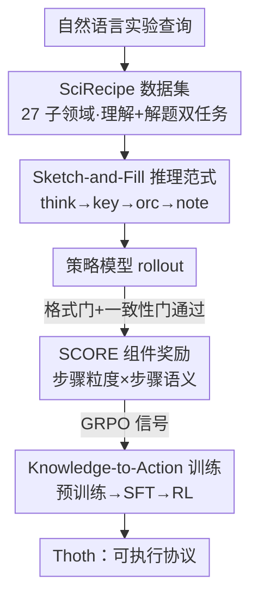

# Unleashing Scientific Reasoning for Bio-Experimental Protocol Generation via Structured Component-based Reward Mechanism

**会议**: ICLR 2026  
**OpenReview**: [https://openreview.net/forum?id=5BRMteyNOp](https://openreview.net/forum?id=5BRMteyNOp)  
**代码**: https://github.com/InternScience/Thoth  
**领域**: LLM推理 / 科学推理 / 强化学习  
**关键词**: 实验协议生成, 结构化推理, 组件化奖励, GRPO, 生物医学

## 一句话总结
本文把"生物实验协议生成"重构成一个可结构化、可验证的推理任务：用 Sketch-and-Fill 推理范式把自由文本拆成「思考→原子步骤→自然语言」三段输出，再用 SCORE 规则化组件奖励（步骤粒度 + 动作顺序 + 语义保真）替代昂贵的 LLM-as-judge 做 RL 信号，配合三阶段 Knowledge-to-Action 训练出 8B 模型 Thoth，在协议生成与多个生物医学基准上反超 GPT-5、DeepSeek-V3 等更大模型。

## 研究背景与动机

**领域现状**：实验协议（protocol）是可复现科学的基石——它不是普通说明文，而是规定了操作、材料、试剂浓度、步骤依赖的"操作蓝图"。让 LLM 根据自然语言问题自动生成协议，能极大提升复现效率。目前要么靠 GPT-5 这类通用大模型的过程推理能力，要么靠 Biomni、STELLA 这类挂外部知识库/工具的 agent 系统。

**现有痛点**：现有数据集和 benchmark 几乎都只覆盖"理解类"任务（看懂协议、问答），缺少"规划与解题"维度，导致模型只会给零散建议，写不出能直接进实验室执行的、逻辑有序的协议。生成结果普遍存在步骤乱序、操作冗余、事实错误、动作幻觉等问题。

**核心矛盾**：评测本身是瓶颈。BLEU/ROUGE/BERTScore 只能衡量词面重叠，一个动作顺序全乱的协议照样能拿高分；而 LLM-as-a-judge 虽然更贴近人类偏好，却要反复调用大模型，放进 RL 训练里成本高到无法 scale。换句话说，**协议的"结构化、可验证"本质没有被任何奖励设计利用起来**。

**本文目标**：① 造一个覆盖理解+解题双任务的协议数据集；② 设计一种把开放式语言输出"锚定"到可执行结构空间的推理范式；③ 设计一个无需调用大模型、却能衡量执行可靠性的高效奖励。

**切入角度**：真实研究者写协议时，是先想清楚做什么操作（action）、对什么对象（objects）、在什么条件下（parameters），再展开成自然语言。如果让模型也按"先抽骨架、再填血肉"的顺序输出，每一步都显式、可解析，就能在结构空间里直接做规则化打分。

**核心 idea**：用"先 Sketch 出原子动作序列、再 Fill 成自然语言"的结构化推理，把协议生成变成可解析、可验证的过程，从而用规则化的组件奖励（而非 LLM 裁判）驱动 RL。

## 方法详解

### 整体框架

整篇工作围绕"让协议生成既可推理又可评测"展开，由四块拼成一条训练管线。先用 **SciRecipe 数据集**提供覆盖 27 个生物子领域、理解+解题双任务的高质量结构化协议；模型在 **Sketch-and-Fill 推理范式**约束下输出 `<think>→<key>→<orc>→<note>` 四段结构（思考链 → 原子步骤 → 自然语言 → 安全提示）；每条 rollout 经过 **SCORE 机制**两道门（格式门 + 一致性门）后，再算步骤粒度奖励与步骤语义奖励，乘成最终 reward；这个 reward 作为 GRPO 的训练信号，嵌在 **Knowledge-to-Action 三阶段训练**（预训练 → SFT → RL）里，最终得到 8B 的 Thoth。SCORE 还能"一鱼两吃"——同一套结构化打分既当 RL 奖励，也直接当评测指标（Step-M / Order-S / Order-LCS / Order-Tau / Semantic-A）。

### 关键设计

**1. SciRecipe 数据集：补上"规划与解题"这块缺失的训练地基**

现有协议资源要么散落在 Nature Protocols、Bio-protocol、Protocols.io 等平台上格式不一，要么 benchmark 只测"理解"。作者从这些平台收集 23K+ 条原始协议，覆盖神经科学、分子生物学、癌症生物学等 27 个子领域，经过抽取清洗、规则+模型双重结构化、去重、专家评审后保留约 12K 条高质量数据，统一成 `exp_name / abstract / materials / equipments / procedures / notes` 的元数据结构。在此之上构造 8 类任务，分两大类：**Protocol-Comprehension**（overview 全局总结 + specific 细粒度分析）和 **Problem-Solving**（检索、规划、排错、约束、缩放、安全六类），二者构成"理解—应用"互补闭环。作者还用同款管线产出 SciRecipe-Eval 作为评测基准，填补协议生成 benchmark 稀缺的空白。

**2. Sketch-and-Fill 推理范式：把开放式输出锚定到可解析的结构空间**

这是让规则化奖励成为可能的前提。范式强制模型按"推理→结构化→表达"的顺序输出三段（外加安全提示）：`<think>` 里模型分解子目标、识别步骤间的顺序依赖、论证每一步的必要性，保证协议有科学推理支撑；`<key>` 是 "Sketch" 阶段，把思考转成一串**原子的、机器可读**步骤，每步严格是一个 JSON 字典 `{"action": 动词, "objects": [...], "parameters": [...]}`，即把自然语言重写成"谓词—宾语—状语"三元组。形式化地，`<key>` 记为 $Y=(y_1,\dots,y_m)$，$y_i=(a_i,O_i,P_i)$，其中 $a_i$ 是操作、$O_i$ 是作用对象、$P_i$ 是参数（温度、浓度等），并施加"One-Action-Per-Step"等一致性约束。`<orc>` 是 "Fill" 阶段，把每个原子步骤展开成流畅可读的自然语言，且强制与 `<key>` **步数和语义一一对应、不增不减**。这样既给 RL 提供稳定训练空间，又为自动评测提供一致基底——后续 SCORE 能直接解析 `<key>` 的 action/objects/parameters 来打分。

**3. SCORE 结构化组件奖励：用规则替代 LLM 裁判，专测"可执行性"**

这是全文核心创新，目标是让奖励直接衡量协议能不能跑、而不是词面像不像。SCORE 采用渐进式设计：先过两道**门**——Format Gate 要求输出含 `<think>/<key>/<orc>/<note>` 四段且每步符合 `Step x:{json}` 格式；Consistency Gate 校验 `<key>` 里每个 action/object/parameter 都在 `<orc>` 中出现且覆盖率 ≥95%，杜绝"骨架与表达脱节"的空壳协议。只有两门都过的协议才进入打分。

打分由两部分相乘融合。**步骤粒度奖励** $r_{\text{scale}}=f(|N_{\text{pred}}-N_{\text{gold}}|)\,/\,g(\bar L)$：$f(d)$ 对步数偏差做余弦衰减（$d<M$ 时 $\cos(\pi d/2M)$，$d\ge M$ 时为 0，阈值 $M=\max(1,\lfloor 0.6 N_{\text{gold}}\rfloor)$），$g(\bar L)$ 在每步平均词长超过上限 $L=30$ 时按比例惩罚啰嗦。**步骤语义奖励** $r_{\text{semantics}}$ 含顺序一致性与语义一致性两块：顺序用"Strict"模式，只有预测与真值动作序列相同或互为子序列才给分，否则归零（呼应实验室现实——步骤可重复可省略，但乱序协议就是无效）；语义则以 action 为锚做逐步对齐，对每对 $(i,j)$ 用 IoU 算对象重叠 $\mathrm{Obj}(i,j)=\frac{|\hat O_i\cap O^*_j|}{|\hat O_i\cup O^*_j|}$、仅当对象重叠 ≥0.5 才比参数 $\mathrm{Par}(i,j)$，并乘位置衰减因子 $m_{ij}=\max\{0,1-(|i-j|/D)^\lambda\}$（$\lambda=1.5$）惩罚"动作类型对但位置错"。语义奖励用加法组合避免过度惩罚：

$$r_{\text{semantics}}=\mathrm{Order}(\hat a,a^*)+\frac{1}{|W|}\sum_{(i,j)\in W} m_{ij}\Big(\mathrm{Obj}(i,j)+\tfrac{1}{2}\mathrm{Par}(i,j)\Big)$$

最终 $\mathrm{SCORE}(y,y^*)=I_{\text{format}}\cdot I_{\text{cons}}\cdot r_{\text{scale}}\cdot r_{\text{semantics}}$。门用乘法、细粒度奖励内部用加法的混合设计，既能严卡结构要求、又能给"动作序列合理但细节略错"的输出部分信用，从而缓解 reward hacking、稳定训练。

**4. Knowledge-to-Action 三阶段训练：从知识积累到可执行操作的课程式过渡**

借鉴课程学习，训练分三阶段模拟人类"学知识→学规范操作→探索优化"的过程。**预训练**让模型从大规模协议文本里学实验语言的语义结构和操作逻辑；**SFT** 在 Sketch-and-Fill 范式数据上做，含参数填充、步骤排序、纠错等子任务，既注入领域知识又给 RL 做冷启动；**RL** 用 GRPO 配合 SCORE 奖励，并去掉熵损失、降低 KL 惩罚以增强探索、避免过早收敛。基座是 Qwen3-8B，预训练/SFT 用 LoRA（LLaMA-Factory），RL 做全参微调（VeRL），8 卡 H100。

## 实验关键数据

### 主实验

SciRecipe-Eval 上，左侧指标测可执行性、右侧测词面相似度，Thoth 在所有指标全面 SOTA（节选）：

| 模型 | Semantic-A | Order-LCS | Order-S | Step-M | AVG |
|------|-----------|-----------|---------|--------|-----|
| ChatGPT-4o | 40.04 | 73.27 | 24.00 | 44.00 | 48.41 |
| GPT-5 | 27.79 | 58.12 | 11.35 | 18.79 | 32.84 |
| Claude Opus 4.1 | 41.32 | 71.70 | 21.80 | 34.59 | 45.65 |
| DeepSeek-V3（最强开源） | 41.72 | 73.97 | 21.44 | 41.71 | 48.16 |
| Qwen3-8B（基座） | 28.89 | 63.51 | 11.17 | 24.33 | 34.32 |
| **Thoth (8B)** | **46.60** | **75.34** | **25.50** | **53.00** | **52.10** |

8B 的 Thoth 平均反超 ChatGPT-4o 约 3.69%、比最强开源 DeepSeek-V3 在 Semantic-A/Order-S/Step-M 上分别 +4.88%/+4.06%/+11.29%，相对基座 Qwen3-8B 更是大幅跃升。值得注意的是 GPT-5、o3 等强推理模型在此反而偏低——它们倾向产出过于复杂、不适合实验室落地的输出，印证了"词面相似 ≠ 可执行"。在 HLE、LAB-Bench、PubMedQA 等域外生物医学基准上，Thoth 也超过同样基于 Qwen3-8B 的 Intern-S1-mini，平均较基座提升 10.87%，说明从协议中学到的推理能力能迁移到更广的生物医学任务。

### 消融实验

| 配置 | 关键指标 | 说明 |
|------|---------|------|
| Thoth（完整） | AVG 52.10 / Step-M 53.00 | 完整模型 |
| 数据：仅 QA | AVG 29.85 | 只用问答数据，BLEU<40% |
| 数据：♠+QA+SciCheck | AVG 49.45 | 双任务+科学评审最优组合 |
| SCORE：w/o $f(d)$ | Order-S 6.83 / Step-M 10.00 | 去步数奖励，协议崩成乱序/不全 |
| SCORE：w/o Order(·) | Order-LCS 61.27 | 去顺序奖励，语义连贯性崩 |
| SCORE：Vanilla 奖励 | AVG 45.62 | 用 BLEU/ROUGE/BERTScore 当奖励，可执行性 -10.65% |
| SCORE：w/o KL | AVG 48.89 | 去 KL 惩罚，平均掉 3.21% |
| 训练：仅 Stage 1+2 | — | 比 Thoth 可执行性低 11.08% |

### 关键发现
- **步数奖励 $f(d)$ 是可执行性的命门**：去掉后 Order-S 暴跌到 6.83、Step-M 跌到 10.00，模型要么啰嗦要么漏步——粒度控制直接决定协议能不能执行。
- **顺序约束不可省**：去掉 Order(·) 后步骤错排、语义连贯性崩塌，说明"乱序即无效"必须被显式建模。
- **规则化奖励 > 词面奖励**：Vanilla 奖励能把 BLEU/ROUGE 刷上去，但可执行性反而平均降 10.65%，正好暴露传统指标"奖励词面重叠"的根本缺陷。
- **三阶段缺一不可**：预训练注入语言结构、SFT 提升词面相似、RL 强化合理性与可执行性，缺预训练（Stage 2+3）或缺 RL 都明显掉点。

## 亮点与洞察
- **把"评测瓶颈"变成"训练杠杆"**：作者没有去优化 LLM 裁判，而是先用 Sketch-and-Fill 把输出结构化，让规则化打分成为可能——同一套 SCORE 既当 RL 奖励又当评测指标，省掉了昂贵的模型调用，这是最巧妙的一手。
- **action 当锚点的对齐思路可迁移**：先对齐动作、再在动作对上比对象/参数，且对象不匹配就不比参数，这种"先骨架后细节"的层次化打分，可推广到任何"步骤序列+结构化要素"的生成任务（如菜谱、装配指令、运维 runbook）。
- **门用乘、细粒度用加的混合奖励**：硬约束（格式/一致性）用乘法一票否决，软评分（语义）用加法给部分信用，兼顾"严卡结构"与"训练稳定"，是一个值得借鉴的 reward shaping 范式。

## 局限与展望
- **强依赖结构化标注与真值协议**：SCORE 的顺序/语义打分都建立在有 gold 协议且能解析成原子步骤之上，对真正开放、无标准答案的探索性实验难以直接套用。
- **"Strict"顺序模式可能过严**：只认相同或互为子序列，对存在多条等效合法路径（步骤可并行/可换序）的协议可能误伤，作者也承认实验室步骤有重复省略的弹性。
- **生物领域专用**：模型与数据高度绑定生物实验协议，迁移到化学、材料等其他实验科学需重建数据与动作库；基座只用到 8B，更大规模下范式收益是否仍显著未验证。
- 评测仍部分依赖 GPT-5 Chat 构造、Gemini 2.5 Flash 校验数据，数据生成端的偏置可能传导到下游。

## 相关工作与启发
- **vs BioPlanner**：BioPlanner 用伪代码重构来评估协议规划，重点是 benchmark 推理；本文则直接生成自然语言、可执行的协议，二者互补，本文更贴近落地。
- **vs BioGPT / BioBERT / SciBERT**：这些域内预训练模型擅长 QA、抽取等知识类任务，但产不出可执行协议；本文用真实协议+结构化推理范式补上了"规划→执行"这一环。
- **vs LLM-as-a-judge 奖励（及 PrefBERT / DRO 等小评估器）**：它们更贴人类偏好但需反复调模型、成本高；SCORE 用纯规则抽取协议要素给出直接、可解释、高效的奖励信号，专门面向 RL 的 scale 问题。

## 评分
- 新颖性: ⭐⭐⭐⭐⭐ 把协议生成重构成可解析结构空间、并据此设计规则化组件奖励替代 LLM 裁判，是一条少见且自洽的路径。
- 实验充分度: ⭐⭐⭐⭐⭐ 覆盖 20+ 基线、5 个可执行性指标、数据/范式/奖励/训练四组消融，结论扎实。
- 写作质量: ⭐⭐⭐⭐ 方法层次清晰、公式完整，但符号与附录引用偏多，初读略密。
- 价值: ⭐⭐⭐⭐⭐ 8B 模型反超 GPT-5/DeepSeek-V3，且方法范式对其他"结构化步骤生成"任务有明显迁移潜力。

<!-- RELATED:START -->

## 相关论文

- [\[ICLR 2026\] Structured Reasoning for LLMs: A Unified Framework for Efficiency and Explainability](structured_reasoning_for_llms_a_unified_framework_for_efficiency_and_explainabil.md)
- [\[ICLR 2026\] SCI-Verifier: Scientific Verifier with Thinking](sci-verifier_scientific_verifier_with_thinking.md)
- [\[ICLR 2026\] Reverse-Engineered Reasoning for Open-Ended Generation](reverse-engineered_reasoning_for_open-ended_generation.md)
- [\[ICLR 2026\] DRPO: Efficient Reasoning via Decoupled Reward Policy Optimization](drpo_efficient_reasoning_via_decoupled_reward_policy_optimization.md)
- [\[ICLR 2026\] PEAR: Phase Entropy Aware Reward for Efficient Reasoning](pear_phase_entropy_aware_reward_for_efficient_reasoning.md)

<!-- RELATED:END -->
