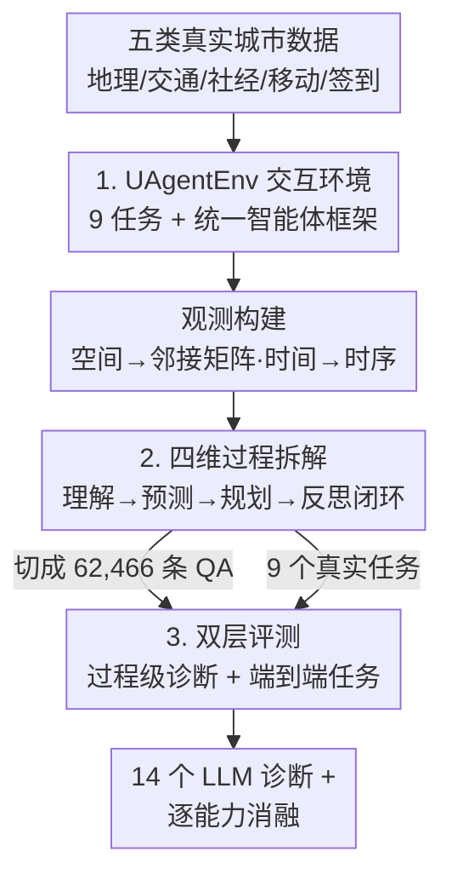

# USTBench: Benchmarking and Dissecting Spatiotemporal Reasoning Capabilities of LLMs as Urban Agents

**会议**: ICLR 2026  
**OpenReview**: [https://openreview.net/forum?id=ETzBStUFJy](https://openreview.net/forum?id=ETzBStUFJy)  
**代码**: https://github.com/usail-hkust/USTBench  
**领域**: LLM推理  
**关键词**: 时空推理, 城市智能体, 过程级评测, 反思推理, Benchmark

## 一句话总结
USTBench 把"LLM 当城市智能体"的时空推理能力拆成**理解—预测—规划—反思**四个过程维度，在交互式城市环境 UAgentEnv 里造了 62,466 条结构化 QA + 9 个真实城市下游任务，评了 14 个主流 LLM，发现它们在理解/预测上不错、但在长程规划和反思上普遍拉胯，而且专门做过推理后训练的模型（如 DeepSeek-R1）在城市任务上并不稳定地强于普通模型。

## 研究背景与动机
**领域现状**：城市系统（交通、人口流动、规划）天然时空交织、动态多变。传统数据驱动方法在预测和决策上有进展，但泛化到没见过的场景差、推理过程不透明。最近一拨工作开始把 LLM 当"城市智能体"用——靠它整合多源信息、跨任务适应、用自然语言给出可解释的推理，去做信号灯控制、拥堵预测、路径规划这类活。

**现有痛点**：但已有的城市 LLM 评测（STBench、CityBench、CityGPT、UrbanPlanBench）几乎只看**结果级指标**——预测准确率、交通效率这种 outcome，看不到中间到底怎么推的。这会掩盖关键的推理缺陷：论文给的反例很扎眼——在拥堵预测的 outcome 指标上，推理模型 DeepSeek-R1 竟然略输给普通模型 Llama3.3；只有做了过程级拆解才发现，问题出在 DeepSeek-R1 对**时间趋势的理解和预测**本身就弱。没有细粒度评测，这种反常现象永远解释不清。

**核心矛盾**：城市任务要求**多步时空推理**，但评测只给一个最终分数；而且城市环境是实时、带反馈的（交通模式一直在变），**反思能力**——把"上一步动作 → 观测到的后果"连成因果、再据此调整后续推理——对智能体至关重要，可现有 benchmark 完全没评这一维。

**本文目标**：建一个能"解剖"LLM 时空推理过程的 benchmark，回答"推理在哪一步成功、在哪一步崩"，同时保留标准化的端到端任务对比。

**切入角度**：把城市时空推理显式分解成一个**智能体-环境交互闭环**的四个过程：理解（看懂空间结构+时间模式）→ 预测（推未来状态）→ 规划（选最优长期动作）→ 反思（用反馈纠错并改进）。每个过程都用 QA 单独评，这样既能定位短板，又能研究四者之间的依赖关系。

**核心 idea**：用"过程级 QA 诊断 + 端到端任务评估"的双层框架，配上一个能生成真实城市观测的交互环境 UAgentEnv，把城市 LLM 智能体的时空推理从"黑箱打分"变成"逐环节解剖"。

## 方法详解

### 整体框架
USTBench 的输入是五大类真实城市数据（地理空间 OSM、交通流、社会经济 GDP/人口、人类移动轨迹、POI 签到），输出是对 LLM 时空推理能力的**双层诊断结果**。中间靠两个东西串起来：底层是交互式城市环境 **UAgentEnv**（撑起 9 个真实城市任务的统一交互），上层是 **USTBench** 评测协议（过程级 QA + 端到端任务）。

整条 pipeline 这样转：UAgentEnv 先把真实城市数据按任务封装成"观测"（空间结构 verbalize 成稀疏邻接矩阵、时间动态 verbalize 成离散时间序列）；LLM 智能体在统一框架里按"理解→预测→规划→反思"的模块化工作流处理观测，产出动作或预测，并把经验存进 memory 供后续检索；评测一侧则双管齐下——一边把交互过程切成 62,466 条结构化 QA 做**过程级**诊断，一边在 9 个真实任务上用领域指标做**端到端**评估。最后拿 14 个主流 LLM（推理/非推理配对，如 Qwen2.5-32B vs QwQ-32B）跑一遍，再做"逐能力消融"看四个过程怎么互相依赖。

### 关键设计

**1. UAgentEnv：撑起九大城市任务的交互式环境与统一智能体框架**

要诊断推理过程，第一步得有个能稳定喂"真实城市观测"的地方，还得让不同任务在同一套接口下可比——这正是 outcome-only 评测做不到、各家 benchmark 任务零散的痛点。UAgentEnv 整合五个维度的公开真实数据（OSM 地理、历史交通流、2000–2019 全球 GDP/人口、纽约出租车轨迹、FourSquare 签到），覆盖 **4 个预测任务**（下一个 POI、拥堵预测、社会经济指标、交通 OD）和 **5 个决策任务**（信号灯控制、POI 选址、路径规划、道路规划、城市规划）共 9 个真实任务。

关键是它给所有任务套了一个**统一智能体框架**：每个任务给智能体一份任务描述 + 数据 schema + 领域知识，把实时时空动态作为上下文观测喂进去；智能体按"理解→预测→规划"的模块化工作流推理，产出动作/预测，并对齐从 memory 检索的历史经验；拿到环境反馈后做**反思**评估自己、诊断错误，再把有用的经验写回 memory 指导下一轮。正是这个"感知→推理→行动→反思→记忆"的闭环，让后面四维过程的 QA 能从真实交互里被自然切出来，而不是人工拼凑。

**2. 四维过程拆解 + 可验证的 QA 构造：把时空推理切成可单独诊断的环节**

这是论文最核心的设计——把城市时空推理显式分解成 4 个过程，每个都用 QA 独立评，准确率打分，共 62,466 条（40% 基础理解 + 60% 高层推理）。四维分别是：① **时空理解**（27,000 条），细分 3 类空间（距离/邻接/连通性，从局部邻域到城市级长程依赖）+ 5 类时间（时长/局部极值/时序/周期性/趋势，从局部分析到长程推断）共 8 种公认时空模式；② **预测**（15,336 条），基于历史观测 $o_i$ 预测下一时刻状态 $s_{i+1}$，ground truth 取真实观测值；③ **规划**（15,000 条），从 5 个决策任务里出题，让智能体选动作 $a_i$ 优化长期目标；④ **反思**（8,130 条），给智能体一个先前动作/预测 + 当前观测 + 环境反馈 $f_i$，让它判断之前对不对、不对就改。

难点在**规划的 ground truth 怎么定**——真实城市因随机性和延迟反馈很少暴露"最优动作"。论文用仿真驱动的穷举搜索，在规划视野 $H$ 内枚举所有未来动作序列，取累积折扣奖励期望最大的动作：

$$a^*_i = \arg\max_{a_i\in A}\ \max_{a_{i+1},\dots,a_{i+H}\in A}\ \mathbb{E}\Big[\sum_{j=0}^{H}\gamma^j R(a_{i+j})\ \big|\ a_i\Big]$$

其中 $R$ 是朝任务目标的进展（如信号灯控制里队列长度的下降），$\gamma$ 平衡即时与未来奖励，期望靠多次 rollout 估计以抵消随机性。决策任务的观测则靠一个**半随机启发式智能体**采集——它以 $1-\epsilon$ 概率选效用 $Q(o,a)$ 最高的动作、以 $\epsilon$ 概率随机探索，靠探索系数 $\epsilon$ 制造多样的决策轨迹，保证场景覆盖面。这套"可验证 ground truth + 多样场景"是过程级诊断能成立的前提。

**3. 双层评测 + 逐能力消融：既定位短板，又揭示四个过程的依赖关系**

光有过程级 QA 还不够——它能说"理解弱在哪"，但不能说"这弱会不会拖垮真实任务"。所以论文配了**端到端下游评估**：在 9 个真实任务上用领域指标统一评（社会经济预测用 MAPE、拥堵预测用准确率+MAPE、城市规划看服务可达性+生态覆盖、道路规划看建设成本+平均出行距离）。过程级回答"哪一步推理崩了"，端到端回答"对真实应用影响多大"，两层互为印证。

更有价值的是**逐能力消融**：按模型推理强弱顺序，依次砍掉某个推理过程看下游怎么变。结果揭示了四个过程的**依赖结构**——对顶级模型 DeepSeek-R1，砍掉时空理解会显著抬高预测误差并拖垮规划（说明它重度依赖前期理解），砍掉预测同样伤规划（说明它真的在用预测指导长期决策），砍掉反思掉得最狠（说明它能有效利用反馈纠错）；但对中等模型 Qwen2.5-32B，绕过预测反而让规划略有提升（噪声预测会误导下游）；对弱模型 Qwen2.5-7B，中间推理和反思甚至有害——能力不足时产出的不可靠中间结果只会传播更多错误。这条"强模型靠中间推理、弱模型被中间推理拖累"的发现，正是 outcome-only 评测永远看不到的。

## 实验关键数据

### 主实验
评测 14 个 LLM（7 非推理 + 7 推理，尽量同架构同规模配对以隔离"推理后训练"的作用）。时空理解上推理模型多能过 80%，但长程空间（连通性）和长程时间（时序/周期/趋势）普遍掉到 70% 以下。

| 能力维度 | 代表强模型 | Overall 准确率 | 普遍短板 |
|--------|-----------|--------------|---------|
| 时空理解 | o4-mini | 0.7924 | 连通性、趋势（Trend 多数 <0.30） |
| 预测 (Forecasting) | o4-mini | 0.7872 | 长期趋势类（拥堵、交通-OD） |
| 规划 (Planning) | gpt-oss-20B | 0.4468 | 整体显著低于理解/预测 |
| 反思 (Reflection) | DeepSeek-R1 | 0.5179 | 多数模型 <0.50 |

> 注：Random 基线在多数子任务约 0.25（四选一），趋势类约 0.11。

端到端下游任务上，LLM 普遍碾压经典方法——预测准确率最高提升 337.31%、决策有效性最高提升 53.48%。

| 任务 | 指标 | 经典方法 | 最优 LLM | 说明 |
|------|------|---------|---------|------|
| 社会经济预测 | MAPE ↓ | 7.09% | 4.97% (o4-mini) | LLM 反超经典方法 |
| 拥堵预测 | Acc. ↑ | 17.18% | 75.73% (o4-mini) | 大幅领先 |
| 城市规划 | Service ↑ | 0.6100 | 0.6858 (DeepSeek-R1) | — |
| 道路规划 | Cost ↓ | 18.95 | 18.40 (QwQ-32B) | — |

### 消融实验
逐能力消融（图 6），按模型强弱看砍掉某过程后下游表现的变化方向：

| 配置 | DeepSeek-R1（强） | Qwen2.5-32B（中） | Qwen2.5-7B（弱） |
|------|------------------|------------------|-----------------|
| Full Pipeline | 基准 | 基准 | 基准 |
| w/o 时空理解 | 误差↑、规划↓（重度依赖） | 仍受损 | 受损 |
| w/o 预测 | 规划↓（确实在用预测） | 规划略↑（噪声预测误导） | 中间推理有害 |
| w/o 反思 | 掉点最多（能用反馈纠错） | 中等敏感 | 反思反而拖累 |

### 关键发现
- **推理后训练≠城市任务更强**：QwQ、DeepSeek-R1、GLM-Z1 相对非推理版多有 7–20% 提升，但不稳定——GPT-4o 常追平甚至超过 GLM-Z1-32B / DeepSeek-R1-Distill-70B；在拥堵、交通-OD 这类长期趋势预测上，非推理基座（Qwen2.5、Llama3.3）反而胜过其推理变体。说明在通用逻辑/数学上的后训练不一定迁移到城市时空推理，**需要领域自适应**。
- **能力是分层的、理解是地基**：擅长长程时间理解的 gpt-oss-20B 在长期时间预测上也更好。论文专门在时空理解上后训练 Qwen2.5-7B 得到 Qwen2.5-7B-ST，结果它不仅超过基座、还超过其推理变体 DeepSeek-R1-Distill-Qwen-7B，验证了"理解→预测/规划"的正向支撑。规划是建立在理解+预测之上的**高阶能力**，这也解释了为何规划分数整体最低。
- **反思是最大短板且与忠实性正交**：多数模型反思 <50%。用 GPT-5 当裁判的定性分析显示，DeepSeek-R1 反思更强（更少解释/适应错误、纠错率更高），但在**动态整合反馈**上仍脆弱；非推理模型常"错得很自信"（overconfident wrong），而 DeepSeek-R1 偶有"前后不一致"——说明忠实性是个不被通用推理增强解决的**正交挑战**。

## 亮点与洞察
- **把"过程级 ground truth"做实**是这篇最硬的贡献：规划用仿真穷举搜索算最优动作、预测用真实未来值、反思用真实环境反馈，让"中间推理对不对"第一次变得可量化，而不是靠人感觉。这套思路可迁移到任何"有环境模拟器"的 agent 评测。
- **配对实验设计很巧**：刻意用同架构同规模的推理/非推理对（Qwen2.5-32B vs QwQ-32B、Llama3.3 vs DeepSeek-R1-70B），把"推理后训练"作为唯一变量隔离出来，于是"推理模型不一定更强"这个反直觉结论才站得住。
- **"砍掉中间推理"消融的方向性结论**最有启发：强模型靠中间推理、弱模型被中间推理拖累——这提示工程落地时，弱模型可能更适合端到端直出而非强行 CoT，是个能直接指导部署的洞察。

## 局限与展望
- 作者承认：本文**只做评测、不给增强方法**，怎么提升城市时空推理仍未充分探索（虽然给了 Qwen2.5-7B-ST 的小验证，但不是系统方法）。
- 决策任务主要在**仿真环境**里评，缺真实世界验证；社会推理、多智能体交互等城市相关维度也没覆盖。
- 自己看：四维分解虽清晰，但"理解/预测/规划/反思"边界在复杂任务里可能交叠，QA 切分的独立性假设值得推敲；规划 ground truth 依赖穷举搜索 + 多 rollout 估计期望，计算量大、且在高维动作空间里的可扩展性存疑。
- 改进思路：把"理解后训练能涨下游"这条线索做成系统的领域自适应方法；引入工具/代码执行来增强结构化时空模式的解析（作者也点到了这个方向）。

## 相关工作与启发
- **vs STBench / CityBench / CityGPT / UrbanPlanBench**：这些只评 outcome 指标、且大多不含反思维度，也不区分推理/非推理基线。USTBench 是第一个同时做**过程级 + 端到端**、并显式纳入**反思推理**和推理模型基线的城市 benchmark。
- **vs PERIA / PreAct / ReflAct 等 agent 框架**：那些是"提出更强的推理/规划/反思机制"的方法侧工作；USTBench 是评测侧，提供一个能解剖这些能力到底强在哪、弱在哪的诊断平台，可作为它们的统一测试床。
- **vs LLMLight / UrbanGPT / UrbanLLM 等城市 LLM 智能体**：那些聚焦单类城市任务的落地；USTBench 用统一框架把 9 类任务串起来横向可比，并指出"通用推理后训练在城市域不稳定"，为这些落地工作指明需要领域自适应。

## 评分
- 新颖性: ⭐⭐⭐⭐⭐ 首个把城市时空推理拆成理解-预测-规划-反思四维、并做可验证过程级诊断的 benchmark。
- 实验充分度: ⭐⭐⭐⭐⭐ 14 个 LLM、62,466 条 QA、9 个真实任务、逐能力消融 + 人工/LLM 裁判定性分析，覆盖很全。
- 写作质量: ⭐⭐⭐⭐ 动机和发现讲得清楚，反例驱动有说服力；定义偏多、部分细节压在附录。
- 价值: ⭐⭐⭐⭐⭐ 揭示"推理后训练≠城市更强""规划/反思是真短板"，对城市智能体研究有明确指导意义。

<!-- RELATED:START -->

## 相关论文

- [\[ICLR 2026\] GeoGramBench: Benchmarking the Geometric Program Reasoning in Modern LLMs](geogrambench_benchmarking_the_geometric_program_reasoning_in_modern_llms.md)
- [\[NeurIPS 2025\] CoRe: Benchmarking LLMs' Code Reasoning Capabilities through Static Analysis Tasks](../../NeurIPS2025/llm_reasoning/core_benchmarking_llms_code_reasoning_capabilities_through_static_analysis_tasks.md)
- [\[ICLR 2026\] Scaling Generalist Data-Analytic Agents](scaling_generalist_data-analytic_agents.md)
- [\[ICLR 2026\] VisioMath: Benchmarking Figure-based Mathematical Reasoning in LMMs](visiomath_benchmarking_figure-based_mathematical_reasoning_in_lmms.md)
- [\[ICLR 2026\] LEXam: Benchmarking Legal Reasoning on 340 Law Exams](lexam_benchmarking_legal_reasoning_on_340_law_exams.md)

<!-- RELATED:END -->
