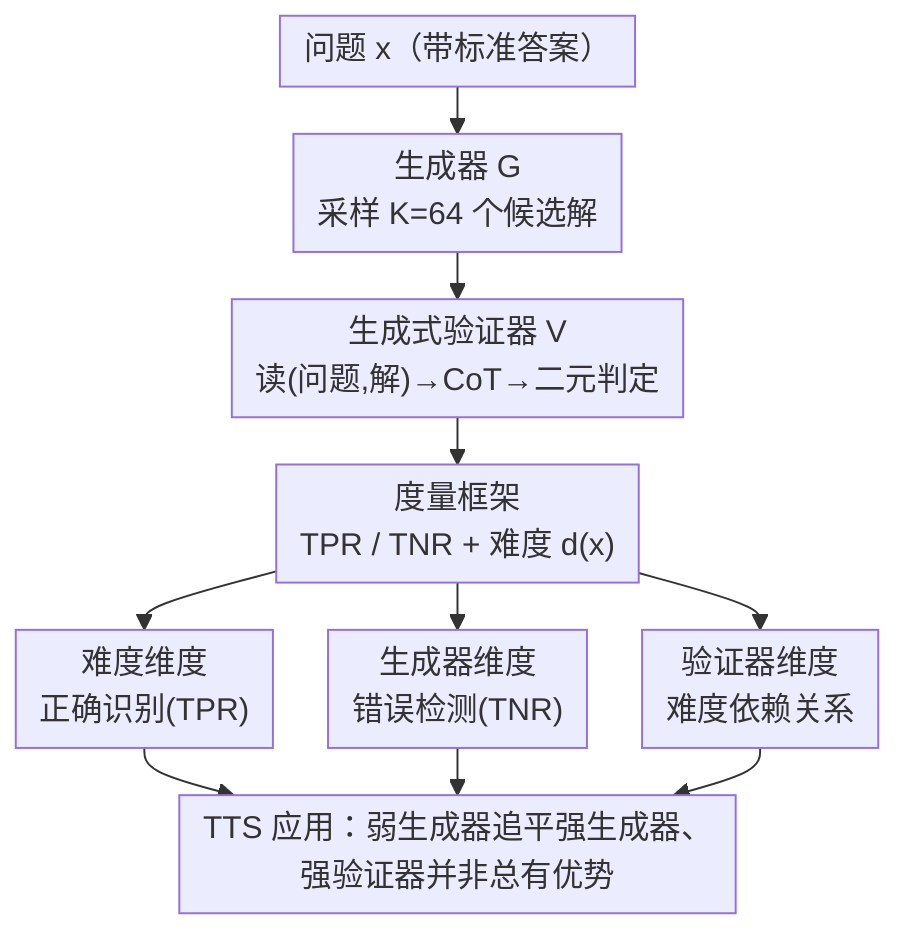

# Variation in Verification: Understanding Verification Dynamics in Large Language Models

**会议**: ICLR 2026  
**OpenReview**: [https://openreview.net/forum?id=DcEuBwrWnB](https://openreview.net/forum?id=DcEuBwrWnB)  
**领域**: LLM推理  
**关键词**: 生成式验证器, 测试时扩展, 验证动力学, 问题难度, TPR/TNR

## 一句话总结
这篇论文系统拆解了"LLM 验证器到底什么时候靠谱"这个问题：通过在 12 个基准、15 个模型上的大规模受控实验，作者发现验证效果由**问题难度、生成器能力、验证器能力**三个维度共同决定——难度主导"认对"（TPR）、生成器能力主导"挑错"（TNR）、验证器能力与验证效果的关系则随难度呈饱和/线性/阈值三种形态，从而揭示了"用最强模型当验证器"这一默认做法在很多场景下其实是浪费。

## 研究背景与动机

**领域现状**：测试时扩展（test-time scaling, TTS）是当前提升 LLM 推理能力的主流范式之一——让生成器对一个问题采样多个候选解，再用一个 LLM 验证器（verifier）在**没有标准答案**的情况下判断每个候选解对不对，从而过滤错误、保留正确。其中"生成式验证器"（generative verifier）尤其受欢迎：它先生成一段思维链（CoT）推理、再吐出一个二元判定 token（"Correct"/"Incorrect"），比早期的判别式验证器或标量奖励模型更能发挥 LLM 的文本生成天赋。

**现有痛点**：业界的默认做法是**直接上最强的闭源前沿模型当验证器**（如 GPT-4o）。这套做法建立在一个假设上——"验证质量随验证器自身的解题能力（生成能力）单调提升"。近期确有工作（Chen et al. 2025c、Krumdick et al. 2025、Tan et al. 2025）展示了这种正相关，于是大家就把它当成铁律。但这其实很可能次优：验证一个解通常比从零生成一个解更容易（即"验证非对称性"，verification asymmetry——就像验证质因数分解远比找出质因数简单），所以验证应当被当作一种**独立能力**来研究，而不是生成能力的副产品。

**核心矛盾**：人们对**生成动力学**研究得很透，却几乎没人系统研究过**验证动力学**——问题本身的性质、被验证响应的性质、模型能力三者如何交互决定验证成败，基本是个黑盒。不理解这些，就会盲目地默认堆最贵的前沿模型，而其实更便宜的替代方案可能就够用，白白浪费算力。

**本文目标**：回答一个核心问题——**到底哪些因素决定验证成功？** 作者把它拆成三个维度：问题难度、生成器能力、验证器能力，并分别量化它们对"认对正确解"和"识别错误解"的影响。

**切入角度**：只在有客观标准答案、可严格判定对错的**可验证问题**上做实验（数学推理、知识问答、自然语言推理），这样既能拿 ground-truth 客观度量验证器表现，又能模拟实际部署时"无参考答案"的验证场景。

**核心 idea**：把验证表现分解成 TPR（认对正确解的概率）和 TNR（拒掉错误解的概率）两个独立指标，再沿三个维度做受控变量实验，看清每个因素究竟在影响"认对"还是"挑错"。

## 方法详解

### 整体框架

本文不是提出一个新方法/新模型，而是一套**受控实证研究框架**：固定"生成器产解 → 验证器判定"这条生成式验证流水线，把问题难度、生成器能力、验证器能力当作三个可控变量逐一拨动，观察验证表现（拆成 TPR/TNR）如何随之变化，最后把规律落地到 TTS 应用上。

整条流水线是这样转的：对一个带标准答案的问题 $x$，生成器 $G$ 采样 $K{=}64$ 个候选响应；每个响应 $(x,r)$ 喂给生成式验证器 $V$，它生成一段验证 CoT、再输出"Correct/Incorrect"二元判定。用 ground-truth 把响应分成真正正确/真正错误两堆后，就能算出验证器的 TPR 和 TNR。在此之上，作者用一个**模型无关的难度定义**把问题分箱，再分别沿三个维度做分析，最终把"哪种验证器配哪种生成器/难度才划算"的结论用到测试时扩展里。

### 关键设计

**1. 度量框架：把"验证好不好"拆成认对与挑错两件事**

直接说"验证准确率高/低"会糊掉一个关键事实——认对正确解和拒掉错误解是两种不同的能力，混在一起算会被类别不均衡带偏。作者因此把验证表现拆成 **TPR**（真正例率，接受正确响应的概率，$\text{TPR}=\mathbb{E}[V(x,r)\mid a(r)=y^*(x)]$）和 **TNR**（真负例率，拒绝错误响应的概率，$\text{TNR}=\mathbb{E}[1-V(x,r)\mid a(r)\neq y^*(x)]$），并用平衡准确率 $\text{Acc}_{bal}=\tfrac12(\text{TPR}+\text{TNR})$ 兼顾两类。这套拆分是后面所有结论的基础：正是因为分开看，才发现"难度只动 TPR、生成器能力只动 TNR"这种单看总准确率根本看不出来的规律。

这里还有一个关键的**模型无关难度定义**：一个问题的难度 $d(x)=\frac{1}{|\mathcal{G}|}\sum_{G\in\mathcal{G}}\hat{p}_G(x)$，即一组多样生成器在该问题上的平均通过率（pass rate）——大多数生成器都能解出就是简单题（$d(x)$ 高），几乎都解不出就是难题。模型能力同样用通过率 $\hat{p}_G(D)$ 度量（验证器当生成器用同一指标）。相比以往"相对单个生成器定难度"的做法，这个定义不依赖某个特定模型，能给出客观可比的难度分箱。评测时每个问题从 64 个采样里抽 8 个（尽量 4 对 4 平衡），用贪心解码让验证器判定。

**2. 难度维度：问题难度主导"认对"，根源是验证器自己算错了参考答案**

按难度把问题切成"最难/难/易/最易"四等分后，作者发现一个干净的规律：**TPR 随问题变简单而稳步上升，而 TNR 与难度几乎没有可预测的关系**（跨模型家族、跨三个领域都一致）。换句话说，问题难度主要影响验证器"敢不敢认正确解"，而不影响它"挑不挑得出错"。

为什么？案例分析显示验证器在判定时倾向于**自己先生成一份参考解来对照**。问题越难，验证器自己算出来的参考答案就越容易错，于是把本来正确的响应误判为错（false negative, FN），拉低 TPR。作者用 LLM-as-judge 大规模检测验证 CoT 里是否含解题错误，量化了这条因果链：在难题集合上，**39.1% 的验证 FN 都伴随着参考答案生成错误**。这说明"验证器自己解错题"是 FN 的主要驱动因素——它解释了 TPR 随难度下降这个核心现象的机制，而不只是描述了相关性。

**3. 生成器维度：生成器越强，它犯的错越难被抓出来**

固定问题、改变生成器能力（为公平起见只在所有生成器都至少产出一个正确/错误响应的问题子集上算），作者发现 **TPR 在几乎所有设置下都很高（多数 >0.7）且随生成器变强而进一步逼近 1.0**，但 **TNR 随生成器变强而显著下降**。直觉上很合理却常被忽视：弱生成器（如 Gemma2-2B）犯的是明显、低级的错误，验证器一眼识破；强生成器犯的是细微、隐蔽的错误，验证器很难察觉。

这条规律把"错误检测难度"明确归因到**生成器能力**这个此前没被重视的因素上：同一个验证器，面对弱生成器的错误几乎全能拦下，面对强生成器的错误却频频放行。它和设计 2 形成互补——难度管 TPR（认对），生成器能力管 TNR（挑错），两个维度各管一摊。

**4. 验证器维度：验证器能力与验证效果正相关，但相关形态随难度而变**

最后一个维度直击业界默认假设。作者确认**验证器生成能力与验证表现总体正相关**——这点和前人一致——但关键在于**相关的"形状"强烈依赖问题难度**：简单题上是**饱和/不相关**（再强的验证器也没额外收益，因为简单题谁都能验对），中等难度题上是**线性**（能力越强、验证越好，最值钱的区间），难题上是**阈值受限**（要跨过某个能力门槛才有用，门槛之下再强也白搭）。

这条"非线性三段论"是本文相对前人最大的修正：以往工作只看到笼统的正相关，就推出"验证器越强越好"的结论；本文指出在难度谱的两端，强验证器相对弱验证器**几乎没有优势**，因为两者都撞上了验证本身的根本困难——这意味着单纯堆验证器规模无法跨越某些验证瓶颈。

### 一个例子：三维度如何各管一摊

拿同一个验证器 GPT-4o 看一道题在不同条件下的命运。**若是简单数学题**：无论生成器强弱，正确解几乎都被认下（TPR 高、设计 2 起作用），且简单题上换不换更强的验证器结果都一样（设计 4 的饱和区）——此时用 Qwen2.5-7B 当验证器和用 GPT-4o 没差别，没必要上贵的。**若是中等难度题、弱生成器（Gemma2-9B）产解**：弱生成器的错误明显易拦（TNR 高、设计 3），经验证过滤后，Gemma2-9B 的 TTS 表现能逼近 Gemma2-27B——论文报告两者在同一验证器下的差距收窄了 **75.7%**。**若是难题、强生成器产解**：强生成器的隐蔽错误难抓（TNR 低、设计 3），加上难题落在设计 4 的阈值受限区，强验证器也救不回来——此时强弱验证器都只能提供有限增益。三个维度叠在一起，就决定了"这道题该配什么验证器才划算"。

## 实验关键数据

实验覆盖 **12 个基准**：数学推理 2,347 题（GSM8K/MATH500/OlympiadBench/AIME24-25/AMC23/Minerva/BBEH 等 8 个）、知识问答 1,196 题（MMLU-Pro 子集）、自然语言推理 901 题（ReClor/FOLIO/GPQA-Diamond）；**15 个模型**：14 个开源（Qwen2.5/Qwen3、Llama-3.x、Gemma-2、Ministral/Mistral，2B–72B）+ GPT-4o，每个模型既当生成器又当验证器。

### 主实验：三个维度的核心规律

| 研究问题 | 自变量 | 主要影响 | 现象 |
|----------|--------|----------|------|
| RQ1 | 问题难度 | TPR（认对） | 题越简单 TPR 越高；TNR 无明显规律 |
| RQ2 | 生成器能力 | TNR（挑错） | 生成器越强 TNR 越低、TPR 微升 |
| RQ3 | 验证器能力 | 整体验证 | 正相关，但简单题饱和 / 中等题线性 / 难题阈值受限 |

### 机制分析：FN 与解题错误的关系

| 难度分箱 | 验证 FN 占正确样本比例 | 其中含参考答案错误的 FN 比例 |
|----------|------------------------|------------------------------|
| 最难 | 高 | 难题集合达 39.1% |
| → 最易 | 逐步降低 | 逐步降低 |

> 说明：随难度上升，验证器自己生成参考解时出错的比例升高，直接制造 false negative，量化了"验证器解错题 → 误判正确解 → TPR 下降"这条因果链。

### 关键发现
- **难度和生成器能力是两个被前人忽略的关键因子**：以往只关注验证器能力，本文证明难度专管 TPR、生成器能力专管 TNR，单看总准确率根本分不开。
- **强验证器并非总值**：在难度谱两端（极易/极难）或面对强生成器时，GPT-4o 相对 Qwen2.5-7B 这类弱验证器几乎没有额外收益——验证器 scaling 无法克服根本性验证困难。
- **弱生成器可借验证追平强生成器**：同一验证器下 Gemma2-9B 经验证后逼近 Gemma2-27B，差距收窄 75.7%，意味着算力可以从"换更大生成器"转移到"用好验证器"。
- **难度估计可无标签替代**：附录用一个实用的、无需 ground-truth 的难度估计器复现了所有关键趋势，说明结论在真实部署中可用。

## 亮点与洞察
- **把"验证准确率"这一团糨糊拆成 TPR/TNR 两条独立线**，是全文最关键的一步——正因为分开，才能干净地把三个维度各自归位，这种"先拆指标再做受控变量"的分析范式可直接迁移到任何"判别/打分"类任务（如 reward model、judge model 的诊断）。
- **用"验证器自己解错参考答案"解释 TPR 下降**，把一个统计相关变成了可解释的机制，并用 LLM-as-judge 量化到 39.1%，避免了只报相关不报因果的空泛。
- **"非线性三段论"（饱和/线性/阈值）直接挑战了业界默认**：它告诉工程实践——在简单或极难任务上别浪费钱上前沿验证器，把预算花在中等难度区间才有线性回报。这是一个能立刻改变 TTS 资源分配策略的可操作结论。

## 局限与展望
- **只研究可验证问题**：实验局限在有客观标准答案的数学/知识/NL 推理上，作者相信结论能外推到任何"对错可定义"的领域，但开放式生成（写作、对话、代码风格）等无明确 ground-truth 的验证场景未被覆盖。
- **难度是模型无关的群体平均**：$d(x)$ 由一组生成器平均通过率定义，对"对某个特定模型难、对群体易"的问题可能失真；且评测时每题只抽 8 个响应，方差来源未充分讨论。
- **结论以现有指令微调模型为样本**：14 个开源模型 + GPT-4o 虽覆盖 2B–72B，但推理模型（reasoning models）只在附录验证了 TPR 趋势成立、TNR 行为会被长推理改变，专门的推理模型验证动力学仍待深挖。
- **改进方向**：可据三段论设计"难度自适应的验证器路由"——简单题用小验证器、中等题上强验证器、难题改用多验证器聚合或干脆放弃验证，把本文的诊断转成自动的算力调度策略。

## 相关工作与启发
- **vs Chen et al. 2025c / Krumdick et al. 2025 / Tan et al. 2025**：他们建立了"验证器生成能力 ↔ 验证质量"的正相关，本文不否定这点，但指出这种相关随难度呈非线性（两端饱和/阈值），并补上难度、生成器能力两个被忽略的维度——把单因素结论升级成三维度图景。
- **vs 测试时扩展工作（Snell et al. 2025 / Zhang et al. 2025 / JETTS）**：以往主要研究"怎么用验证器提升 TTS"，本文反过来研究"什么因素决定验证成败"，并把诊断落回 TTS——给出了"哪种生成器/难度该配哪种验证器"的省算力指南。
- **vs 弱验证器聚合 / 强弱平衡（Saad-Falcon et al. 2025 / Angelopoulos et al. 2025）**：那些工作直接提方法降本，本文先讲清楚"为什么弱验证器在某些 regime 就够用"的底层原因（饱和/阈值区强验证器无优势），为这类降本策略提供了理论依据。

## 评分
- 新颖性: ⭐⭐⭐⭐ 把验证当独立能力、拆 TPR/TNR 沿三维度做受控分析，视角清新且修正了业界默认假设。
- 实验充分度: ⭐⭐⭐⭐⭐ 12 基准 × 15 模型 × 三领域的大规模受控实验，含机制归因与无标签难度复现，扎实。
- 写作质量: ⭐⭐⭐⭐ 三个 RQ 结构清晰、findings 提炼到位，但大量结论藏在热力图里、正文叙述偏密。
- 价值: ⭐⭐⭐⭐⭐ 直接改变"默认堆最强验证器"的工程实践，给出可操作的算力分配洞察。

<!-- RELATED:START -->

## 相关论文

- [\[ICML 2026\] Internalizing Safety Understanding in Large Reasoning Models via Verification](../../ICML2026/llm_reasoning/internalizing_safety_understanding_in_large_reasoning_models_via_verification.md)
- [\[ICLR 2026\] T1: Tool-Integrated Verification for Test-Time Compute Scaling in Small Language Models](t1_tool-integrated_verification_for_test-time_compute_scaling_in_small_language_.md)
- [\[ICLR 2026\] Dynamics-Predictive Sampling for Active RL Finetuning of Large Reasoning Models](dynamics-predictive_sampling_for_active_rl_finetuning_of_large_reasoning_models.md)
- [\[ICLR 2026\] Neural Theorem Proving for Verification Conditions: A Real-World Benchmark](neural_theorem_proving_for_verification_conditions_a_real-world_benchmark.md)
- [\[ICLR 2026\] VoG: Enhancing LLM Reasoning through Stepwise Verification on Knowledge Graphs](vog_enhancing_llm_reasoning_through_stepwise_verification_on_knowledge_graphs.md)

<!-- RELATED:END -->
