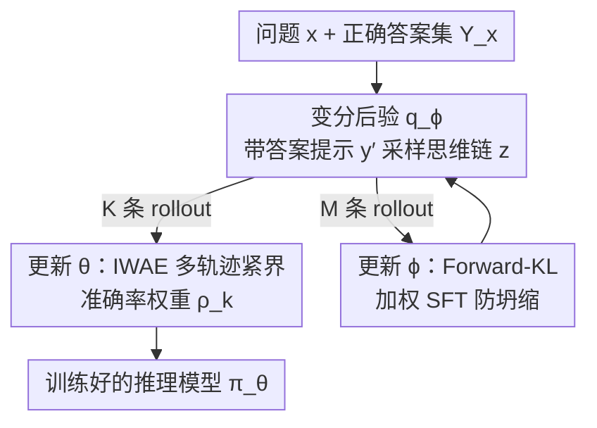

# Variational Reasoning for Language Models

**会议**: ICLR 2026  
**OpenReview**: [https://openreview.net/forum?id=fGGcovg6oW](https://openreview.net/forum?id=fGGcovg6oW)  
**代码**: 有（论文提供 Code Link）  
**领域**: LLM推理  
**关键词**: 变分推理, 隐变量思维链, ELBO, IWAE, Forward-KL

## 一句话总结
本文把语言模型的"思维链"当成隐变量、把"答对"当成观测，用变分推理从 ELBO 出发推出训练目标：引入一个带"答案提示"的变分后验来采样更可能答对的思维链，用 IWAE 多轨迹紧界 + 准确率权重更新模型、用 forward-KL 更新后验防坍缩，并顺手证明 RFT 与 GRPO 都是"按准确率加权的局部 forward-KL"、因而隐含偏向简单题；在 Qwen2.5/Qwen3 多个尺度上稳定超过强基线。

## 研究背景与动机

**领域现状**：要让大模型学会推理，主流是两条路——监督微调（SFT）直接模仿人工/教师整理的长思维链，强化学习（RL，如 GRPO）用可验证奖励（答案对错）去优化策略。两者都各自取得了不错的实证效果。

**现有痛点**：SFT 依赖昂贵的人工长思维链，作为离线方法泛化差、还容易灾难性遗忘；RL 训练不稳定、输出多样性会坍缩，越难的题正确答案越稀少，甚至出现 Pass@K 低于基座模型的尴尬。两条路都缺一个"有原理依据"的统一目标。

**核心矛盾**：现有方法把"思维链 $z$ + 答案 $y$"当成一个整体输出来优化，看不清"想"和"答"各自该怎么学；而真正想最大化的其实是"在所有可能思维链上边缘化后答对的概率" $P_\theta(Y_x|x)=\sum_z \pi_\theta(y\in Y_x|x,z)\pi_\theta(z|x)$，但这个对 $z$ 的求和不可计算，只能退而求其次去优化整段输出，丢掉了概率建模的结构。

**本文目标**：把推理显式拆成"思维过程 $z$（隐变量）+ 答案 $y$（观测）"，给出一个能直接优化 $\log P_\theta(Y_x|x)$、又兼容可验证奖励、还能解释现有方法的统一训练目标。

**切入角度**：思维链天生就是隐变量——我们只看到了答案对不对，却看不到"模型该怎么想才对"。变分推理正是为这种"含隐变量的极大似然"设计的：用一个变分后验近似"已知答对时该怎么想"的真实后验，把不可计算的边缘化换成可计算的下界。

**核心 idea**：用变分推理替代"整段输出优化"——引入条件在答案提示 $y'$ 上的变分后验 $q_\phi(z|x,y')$ 来采样"更可能答对"的思维链，以 ELBO/IWAE 作为可优化的紧下界，从而把 SFT 与 RL 统一在同一个概率框架里。

## 方法详解

### 整体框架

整篇方法可以看成一个"EM 风格"的交替优化循环：把答对概率的对数 $\log P_\theta(Y_x|x)$ 作为最终要最大化的极大似然目标，但因为对思维链 $z$ 的求和不可计算，用变分推理把它下放为一个证据下界（ELBO）。框架里有两个被训练的网络——推理模型 $\pi_\theta(z,y|x)$ 和变分后验 $q_\phi(z|x,y')$，每一轮交替：先用 $q_\phi$ 在"看到了正确答案提示 $y'$"的条件下采样若干条思维链 $z$，再分两路用这些轨迹分别更新 $\theta$（IWAE 多轨迹紧界 + 准确率权重）和 $\phi$（forward-KL 加权 SFT）。实验里只跑一轮（$T=1$）就已足够。

下图是训练管线（图中三个贡献节点分别对应下文关键设计 1/2/3；关键设计 4 是对 RFT/GRPO 的统一性解释，属于理论分析，不在这条管线上）：

### 关键设计

**1. 把思维链当隐变量：ELBO 与带答案提示的变分后验**

直接最大化 $\log P_\theta(Y_x|x)$ 要对所有思维链求和，不可计算。本文套用变分推理推出证据下界：

$$\log P_\theta(Y_x|x)\ \ge\ \mathbb{E}_{q_\phi(z|x,y')}\big[\log \pi_\theta(Y_x|x,z)\big]-D_{\mathrm{KL}}\big(q_\phi(z|x,y')\,\|\,\pi_\theta(z|x)\big).$$

关键巧思在于变分后验 $q_\phi(z|x,y')$ 不只条件在问题 $x$ 上，还额外塞进一个"答案提示" $y'$（用 `<hint>y'</hint>` 包起来拼在 $x$ 后面），且 $y'$ 直接取自正确答案集 $Y_x$（参考答案的某种改写）。这相当于"先偷看答案、再倒推该怎么想"，引导后验生成更可能答对的思维链。作者进一步证明：最大化 ELBO 关于 $q_\phi$ 等价于最小化 $q_\phi(z|x,y')$ 与真实后验 $P_\theta(z|x,Y_x)=\pi_\theta(Y_x|x,z)\pi_\theta(z|x)/P_\theta(Y_x|x)$ 的反向 KL，最优解就是 $q_\phi^\*=P_\theta(z|x,Y_x)$——也就是把先验 $\pi_\theta(z|x)$ 按"这条思维链有多容易答对"重新加权后的分布。

**2. IWAE 多轨迹紧界 + 准确率权重：收紧下界并压低方差**

RL 里本来就习惯对一个问题并行 rollout 多条轨迹，本文顺势把单轨迹 ELBO 扩成 IWAE 风格的多轨迹下界：用 $K$ 条 $z_{1:K}\sim q_\phi$ 得到

$$\mathcal{L}^K_{\mathrm{ELBO}}=\mathbb{E}_{z_{1:K}\sim q_\phi}\Big[\log \tfrac{1}{K}\textstyle\sum_{k=1}^{K}\tfrac{\pi_\theta(z_k,Y_x|x)}{q_\phi(z_k|x,y')}\Big],$$

$K$ 越大下界越紧。更新 $\theta$ 时每条轨迹带一个归一化重要性权重 $\tilde\rho_k$，其中 $\pi_\theta(Y_x|x,z)$ 这一项有两种无偏估计：基于似然的和基于准确率的。本文给出 Theorem 1：当正确答案集 $|Y_x|>1$ 且模型准确率 $\pi_\theta(Y_x|x,z)\ge 1/|Y_x|$ 时，准确率估计器的最坏情况方差更低（$\max_{\pi_\theta}\mathrm{Var}_{\mathrm{acc}}\le \max_{\pi_\theta}\mathrm{Var}_{\mathrm{like}}$）；而实际题目正确表达往往很多（$|Y_x|\gg 1$），所以默认用准确率估计器。似然比 $\pi_\theta(z_k|x)/q_\phi(z_k|x,y')$ 还做了逐 token 的几何平均归一化（按 $1/|z_k|$ 次方），牺牲一点偏差换取大幅降方差，避免长思维链上比值爆炸。

**3. Forward-KL 训练变分后验：防止坍缩成抄答案**

如果按 ELBO 的原始形式（反向 KL）去训 $q_\phi$，会出问题：基座 LLM 的 $\pi_\theta(z|x)$ 通常已经训得不错，而 $q_\phi$ 在拿到答案提示 $y'$ 后很容易走捷径——直接把答案 token 泄漏进思维链里"假装在想"，导致后验坍缩、学不到真正的推理路径。本文改用 forward KL $D_{\mathrm{KL}}(P_\theta(z|x,Y_x)\,\|\,q_\phi(z|x,y'))$ 来训后验，它和反向 KL 共享同一个最优解，但梯度形式变成一个加权 SFT：

$$\nabla_\phi \mathcal{L}^M_{\mathrm{forward}}=\mathbb{E}_{z_{1:M}\sim \pi_\theta(z|x)}\Big[\textstyle\sum_{m=1}^{M}\tilde w_m\,\nabla_\phi \log q_\phi(z_m|x,y')\Big],\quad \tilde w_m=\tfrac{w_m}{\sum_j w_j},\ w_m=\pi_\theta(Y_x|x,z_m).$$

注意训练数据 $z_m$ 是从 $\pi_\theta(z|x)$（不偷看答案）采来的、再按"这条轨迹的准确率 $w_m$"加权去拟合后验。这样后验是在"模型自己想得出来的合理思维链"上、按答对概率加权学习，是 mode-covering 的，自然回避了"直接抄答案"的捷径坍缩。

**4. 统一视角：RFT/GRPO 是加权 forward-KL，揭示偏向简单题的隐式偏置**

把输出显式拆成 $z$ 和 $y$ 后，作者发现两类主流方法都能被本框架重新表达。拒绝采样微调（RFT）只看思维链那部分的梯度可写成

$$\nabla_\theta \mathcal{L}_{\mathrm{RFT}}=-P_{\mathrm{ref}}(Y_x|x)\cdot \nabla_\theta D_{\mathrm{KL}}(P_{\mathrm{ref}}(z|x,Y_x)\,\|\,\pi_\theta(z|x)),$$

即"按模型准确率 $P_{\mathrm{ref}}(Y_x|x)$ 加权的 forward KL"。二值奖励 RL（含 GRPO）同理：GRPO 因为对组内奖励做了标准差归一化，每题权重变成 $\sqrt{P_\theta(Y_x|x)/(1-P_\theta(Y_x|x))}$，随准确率单调递增。这两种加权都会"压低难题、抬高易题"——准确率低（难）的题权重小，于是训练系统性偏向简单题，这是此前未被明确指出的隐式偏置。相比之下，本文 Eq.(9) 的 forward-KL 目标对各题一视同仁，对难题更友好。这一节是理论解释而非新模块，但它是把变分框架"反向照进现有方法"的关键贡献。

### 损失函数 / 训练策略

训练遵循 Algorithm 1，交替更新两套参数（实验中 $T=1$）：

- **更新 $\phi$（变分后验）**：从 $\pi_{\theta_{t-1}}(z|x)$ rollout $M$ 条轨迹，算准确率权重 $\tilde w_m$，按 $\nabla_\phi\mathcal{L}^M_{\mathrm{forward}}$ 做加权 SFT。
- **更新 $\theta$（推理模型）**：从 $q_{\phi_t}(z|x,y')$ rollout $K$ 条轨迹，按 Eq.(8) 估计 $\tilde\rho_k$（几何平均似然比 × 准确率），按 IWAE 梯度 $\sum_k \tilde\rho_k\nabla_\theta(\log\pi_\theta(z_k|x)+\log\pi_\theta(Y_x|x,z_k))$ 更新。

实践中先各自从同一基座独立微调出初始 $\pi_{\theta_0}$（用 Bespoke-Stratos 配方）和 $q_\phi$（forward-KL），不共享权重；再用训好的 $q_\phi$ 对每个训练样本生成 8 条响应，算权重后做最终训练。数据有 17K（全量，每样本取权重最高的 $q_\phi$ 响应 + 原样本）和 1K（1000 样本子集、8 条响应全用）两种设置。

## 实验关键数据

### 主实验

在 Bespoke-Stratos-17k 上训练，评测数学/代码/通用共 10 个 benchmark（其中 GPQA-D、MMLU-Pro 对本文训练数据是 OOD）。"-Acc / -GML" 是两种权重估计器，"-PA / -PB" 是两套提示模板。

| 基座 | 方法 | 数学组 Avg | 通用/代码组 Avg |
|------|------|-----------|----------------|
| Qwen3-4B-Base | 基座 | 21.38 | 18.26 |
| Qwen3-4B-Base | Bespoke-Stratos-4B† | 51.35 | 40.40 |
| Qwen3-4B-Base | **Ours-PB-Acc-4B** | **55.72** | **46.12** |
| Qwen3-8B-Base | Bespoke-Stratos-8B† | 58.54 | 49.46 |
| Qwen3-8B-Base | **Ours-PB-Acc-8B** | **62.77** | **54.69** |
| Qwen2.5-32B-Inst | Bespoke-Stratos-32B | 70.34 | 66.32 |
| Qwen2.5-32B-Inst | RLT-32B | 70.43 | 65.82 |
| Qwen2.5-32B-Inst | **Ours-PA-Acc-32B** | **72.01** | **67.21** |

> 数学组为 MATH500/AIME24/AIME25/AMC23/OlympiadBench 平均；通用/代码组为 GPQA-D/LCB-E/LCB-M/LCB-H/MMLU-Pro 平均。本文相对同数据的强基线 Bespoke-Stratos-4B† 数学组高 ~8.5%、通用域高 ~14%，相对基座数学提升超 160%。即便在 OOD 的 GPQA-D/MMLU-Pro 上也超过专为通用域训练的 General-Reasoner-4B，说明推理增益能跨域泛化。

### 消融实验

| 配置 | 数学组 Avg | 通用组 Avg | 说明 |
|------|-----------|-----------|------|
| Ours-4B（完整） | 55.72 | 46.12 | 带答案提示 $y'$ |
| w/o $y'$ | 48.18 | 37.80 | 后验不条件在答案提示上 |
| Qwen2.5-7B-1K · Ours-Acc | 45.41 | — | 准确率估计器 |
| Qwen2.5-7B-1K · Ours-GML | 45.38 | — | 几何平均似然估计器 |
| Qwen2.5-7B-1K · Ours-L | 43.01 | — | 朴素似然估计器 |

### 关键发现
- **答案提示 $y'$ 是后验的命门**：去掉 $y'$ 后数学组掉 7.5+、通用组掉 8+，证实"先偷看答案再倒推思维链"对采样高质量轨迹至关重要。
- **准确率/几何平均估计器明显优于朴素似然**：Acc(45.41) ≈ GML(45.38) > L(43.01)，与 Theorem 1 的"低方差"分析一致；Acc 在数学类略有优势。
- **复杂任务 Pass@K 优势随 $K$ 增大而扩大**（如 LiveCodeBench-Hard），简单任务与多选题上差距收窄——说明变分推理真正的价值在难题上。
- **训练更稳**：Fig.1 显示本方法的训练 loss 和梯度范数都低于 Bespoke-Stratos 基线。
- **对提示模板鲁棒**：PA 与 PB 两套模板结果接近，均超基线。

## 亮点与洞察
- **"偷看答案训后验、不偷看答案训模型"的非对称设计很巧**：变分后验靠答案提示 $y'$ 生成优质思维链，但更新模型 $\theta$ 时用的 IWAE 权重和更新后验 $\phi$ 时用的训练数据都来自不偷看答案的 $\pi_\theta(z|x)$，既借了答案的"导航"又不把答案泄漏进最终模型。
- **用 forward-KL 替反向-KL 治"坍缩"是可迁移的 trick**：凡是"条件生成 + 容易走捷径泄漏目标"的隐变量训练，都可考虑把反向 KL（mode-seeking、易坍缩）换成 forward KL（等价加权 SFT、mode-covering）。
- **把 RFT/GRPO 统一成"按准确率加权的 forward-KL"并指出偏向简单题**，是最让人"啊哈"的理论贡献：它不仅解释了为什么 RL 在难题上吃力，也给"如何去掉这个偏置"指了方向。
- Theorem 1 给"似然估计器 vs 准确率估计器谁方差低"画了清晰边界（$|Y_x|>1$ 且准确率 $\ge 1/|Y_x|$ 时选准确率），把工程选择落到了理论上。

## 局限与展望
- 作者只跑了单轮 $T=1$，多轮交替训练（真正的变分 EM 迭代）留作未来工作，潜在收益未验证。
- 方法依赖正确答案集 $Y_x$ 与可验证 verifier（数学/代码），在无规则验证器的开放域任务上如何取 $y'$、如何估准确率权重仍是开放问题。
- 准确率权重需要对每条思维链额外采样多个候选答案来估计 $\mathbb{E}_{y\sim\pi_\theta}[\mathbb{1}(y\in Y_x)]$，训练成本（rollout 次数 $K,M$ + 每轨迹多采样）不低。
- 几何平均似然比是有偏的方差折中，其偏差对最终性能的影响缺乏定量分析。

## 相关工作与启发
- **vs RFT / GRPO（二值奖励 RL）**：本文证明它们都是"按模型准确率加权的局部 forward-KL"，隐含偏向简单题；本文的 forward-KL 目标对各难度题一视同仁，对难题更友好，且有 IWAE 紧界与准确率估计器加持。
- **vs VeriFree（Zhou et al. 2025）**：同样显式拆分 $z$/$y$，VeriFree 直接用 policy gradient 优化 $P_\theta(y|x)$；本文从 ELBO 出发给出更系统的概率框架，并把变分后验的答案提示与多轨迹紧界纳入。
- **vs RLT（Reinforcement Learning Teachers）**：本文把"反向 KL 用 policy gradient 优化后验"的形式与 RLT 的密集奖励对应起来（一项对应 $\log\pi_\theta(Y_x|x,z)$、一项对应 $-\log\frac{q_\phi}{\pi_\theta}$），为 RLT 那个"直觉设计的奖励"补上了变分推理的理论依据，并用 IWAE 紧界与准确率估计器加以增强。

## 评分
- 新颖性: ⭐⭐⭐⭐⭐ 把变分推理系统性地引入 LLM 推理训练，并统一解释 RFT/GRPO、揭示偏向简单题的隐式偏置。
- 实验充分度: ⭐⭐⭐⭐ 覆盖 4 个模型尺度、10 个 benchmark，含估计器/提示/$y'$ 消融与 Pass@K 分析；但只跑单轮、缺无验证器域验证。
- 写作质量: ⭐⭐⭐⭐⭐ 从 ELBO 一路推到统一视角，公式与算法表清晰、动机层层递进。
- 价值: ⭐⭐⭐⭐⭐ 提供了一个有原理依据、稳定且兼容可验证奖励的推理训练目标，并对现有方法给出统一解释，理论与实践都有抓手。

<!-- RELATED:START -->

## 相关论文

- [\[ICLR 2026\] On the Thinking-Language Modeling Gap in Large Language Models](on_the_thinking-language_modeling_gap_in_large_language_models.md)
- [\[ICLR 2026\] On the Reasoning Abilities of Masked Diffusion Language Models](on_the_reasoning_abilities_of_masked_diffusion_language_models.md)
- [\[ICLR 2026\] Improving Reasoning for Diffusion Language Models via Group Diffusion Policy Optimization](improving_reasoning_for_diffusion_language_models_via_group_diffusion_policy_opt.md)
- [\[ICLR 2026\] SLM-MUX: Orchestrating Small Language Models for Reasoning](slm-mux_orchestrating_small_language_models_for_reasoning.md)
- [\[ICLR 2026\] Pushing on Multilingual Reasoning Models with Language-Mixed Chain-of-Thought](pushing_on_multilingual_reasoning_models_with_language-mixed_chain-of-thought.md)

<!-- RELATED:END -->
