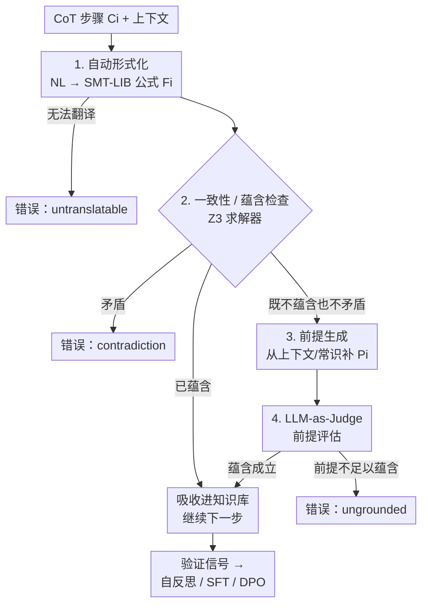

# VERICOT: Neuro-Symbolic Chain-of-Thought Validation via Logical Consistency Checks

**会议**: ICLR 2026  
**OpenReview**: [https://openreview.net/forum?id=zHuV3Vatov](https://openreview.net/forum?id=zHuV3Vatov)  
**代码**: 无  
**领域**: LLM推理  
**关键词**: 思维链验证, 神经符号, 一阶逻辑, 自动形式化, SMT求解器

## 一句话总结
VERICOT 把 LLM 思维链（CoT）的每一步翻译成一阶逻辑公式，用 SMT 求解器逐步检查它能否由「已建立的前提」蕴含，从而定位「无依据 / 自相矛盾 / 不可翻译」的推理步骤；这套验证信号既能预测最终答案是否正确，又能驱动自反思、SFT 和 DPO，让模型生成更可验证的推理。

## 研究背景与动机
**领域现状**：CoT 已经成为提升 LLM 推理能力的主流手段，DeepSeek-R1、o1 这类模型都靠它展示了强推理。但「能算对答案」和「推理过程在逻辑上站得住」是两回事。

**现有痛点**：LLM 经常在推理链里犯逻辑错误，哪怕最终答案对了，中间某一步也可能是错的（论文的例子：本该说"Charlie 不超过 18 岁"，模型却说成"不超过 15 岁"）。在医疗、法律这类高风险场景里，用户对推理路径的正确性和最终答案同样在意，一步错就会动摇对模型的信任。根因在于语言模型只是按概率预测文本，**没有任何显式机制去验证它生成语义的逻辑有效性**。

**核心矛盾**：已有的纠错工作要么靠外部知识库检索事实、靠独立 critic 模型打分，要么靠程序执行 / 符号检查，但都不能保证 LLM 整段输出在逻辑上有效。最接近目标的 Explanation-Refiner 用定理证明器对 NL 解释做迭代形式化，可它只针对 NLI 任务。换句话说，业界还缺一个**同时满足**这三件事的验证器：①作用在 CoT 的每一步上；②把每一步的「上下文依据」也形式化出来；③能在 code/math 之外的领域真正提升推理的逻辑有效性。

**本文目标**：构造一个神经符号验证器，给定上下文（问题 + 可选对话历史 + 源文档）和 CoT 步骤 $C_1,\dots,C_n$，逐步判定每一步能否被一组从上下文里推断出来的、自洽的逻辑前提蕴含，并在失败时给出可解释的错误原因。

**切入角度**：作者的核心观察是——CoT 之所以「读起来通顺但其实没依据」，是因为它隐含地引用了很多没说出口的前提。如果能把每一步翻译成 FOL 公式、并强迫验证器**把支撑它的隐含前提显式列出来**，那么逻辑漏洞就无处可藏。

**核心 idea**：用「自动形式化 + 增量前提推断 + SMT 求解器蕴含检查」逐步验证 CoT——每来一步就形式化成逻辑公式、检查能否被已有知识蕴含，不能就尝试从上下文/常识补出前提，补不出就报告它无依据或矛盾。

## 方法详解

### 整体框架
VERICOT 把 CoT 验证建模成一个**逐步增长知识库**的过程。它维护两个集合：已确立的逻辑公式集 $\mathcal{F}_{i-1}$ 和前提集 $\mathcal{P}_{i-1}$（初始都为空）。对每个 CoT 步骤 $C_i$，先把它**自动形式化**成一阶逻辑公式 $F_i$（编码为 SMT-LIB，用 Z3 求解），然后交给约束求解器判断 $F_i$ 与现有知识 $\mathcal{F}_{i-1}$ 的逻辑关系：被蕴含（必然成立）、被矛盾（与已知冲突）、还是既不蕴含也不矛盾。若被蕴含就直接吸收进知识库；若矛盾就记一个 `contradiction` 错误；若两者都不是，就触发**前提生成**，从问题文本、源文档或常识里推断出一组能蕴含 $F_i$ 的支撑前提 $P_i$，再用 **LLM-as-Judge** 检查这些前提是否真的可靠（有据可依 / 合理）。整套流程跑完后，若每一步都能被一组自洽前提蕴含，则该 CoT 判为 valid；否则输出每个未通过步骤的错误原因（无依据 / 矛盾 / 不可翻译）。这些结构化错误信号反过来用于推理时自反思和微调数据蒸馏。

### 关键设计

**1. 两阶段自动形式化：把每一步 CoT 翻译成带词表的 SMT-LIB 公式**

要验证逻辑，第一步是把自然语言变成机器可判定的形式语言，但「NL→FOL」本身就极易出错，且不同步骤要复用同一套谓词/常量才能互相蕴含。VERICOT 的做法是分两阶段、用 LLM 翻译：第一阶段把已产生的逻辑**词表（vocabulary）作为上下文**喂给 LLM，要求它只用现有的变量和类型生成一个结构化中间表示，并标注 $C_i$ 里哪段文字对应 $F_i$ 的哪部分；第二阶段，如果某些文字 LLM 觉得相关但现有词表表达不了，就再调一次 LLM 生成新的 SMT-LIB 声明（如 `declare-fun`、`declare-sort`），把声明加进词表后回到第一阶段重试。这个扩词表-重译循环最多重复三次，仍失败就把该步标为 `untranslatable`。论文给的例子很直观：翻译"Charlie 在 2023 年最多 18 岁"时，初始词表只有 `birth_year`、`lives_with` 等谓词，LLM 先报告词表不足（输出 `(assert false)`），随后新增 `current_year`、`age_in_year` 声明，才成功译出 $\texttt{(<= (age\_in\_year charlie current\_year) 18)}$。复用既有词表是关键——只有谓词和常量在各步之间统一，求解器才能跨步骤做蕴含。

**2. 增量前提推断 + SMT 蕴含检查：用三类逻辑关系判定每一步是否成立**

CoT 步骤往往不能被已有公式直接蕴含，而是依赖上下文细节、文档条款或常识里没说出口的前提。VERICOT 把验证拆成三种逻辑关系来处理：若 $\mathcal{F}_{i-1} \models F_i$（蕴含），直接接受并设 $\mathcal{F}_i = \mathcal{F}_{i-1}\cup\{F_i\}$；若 $\mathcal{F}_{i-1} \models \neg F_i$（矛盾），报 `contradiction`；若既不蕴含也不矛盾，就进入前提生成——让 LLM 从上下文/常识里产出多个互不矛盾的候选 NL 前提，逐个形式化，并用求解器筛掉与已有知识不一致的（保留满足 $\mathcal{F}_{i-1}\wedge p$ 可满足的），最后把剩下的合取成 $P_i$。若补上 $P_i$ 后仍 $\mathcal{F}_{i-1}\cup\{P_i\}\not\models F_i$，则报 `ungrounded`。整个判定由 SMT 求解器 Z3 执行，逻辑公式落在支持线性算术、未解释函数和量词的一阶逻辑片段上。论文的四步示例完整演示了这套机制：从问题推出 $P_1$、从常识补出 $P_2:\ \forall x,y.\ \mathrm{age}(x,y)\le y-\mathrm{birthYear}(x)$、从文档补出资格规则 $P_3$，最终结论 $\mathrm{Qualifies}(\mathrm{charlie})$ 无需新前提即可导出。这套设计的价值在于：它不只判对错，还把「接受这条推理需要承认哪些隐含前提」一条条摆出来，让无依据的过度假设暴露出来——实验里 `ungrounded` 正是最常见的错误类型，印证了 CoT 爱「过度生成假设」。

**3. LLM-as-Judge 前提评估：堵住「形式上自洽但内容荒谬」的前提漏洞**

求解器只能保证 CoT 在 FOL 上可表示、前提集自洽，但管不了前提本身是否**值得被接受**——它可能列出"天空是紫色的"这种形式上无矛盾、内容却荒谬的前提来硬凑蕴含。为此 VERICOT 在前提生成结束后加一道 LLM-as-Judge：对来自源文本的前提，把源文档和前提的 NL 版本一起给裁判 LLM，让它判断该前提是否**可归因于源文本**（grounded）；对来自常识的前提，则在给定上下文和目标推理步的前提下判断它是否**可接受**（acceptable，免去归因要求）。这一步把「生成器可能编造或漏掉细节」的风险再过滤一遍，降低错误前提蒙混过关的概率。实验（Table 2/3）显示各类前提在 LLMaJ 下的得分都很高（如 SARA 的 grounded contextual premise 93.5），且 LLMaJ 判断与人工标注的一致率达 95–100%。

**4. 验证信号的三大下游应用：从「只验证」到「主动提升推理」**

VERICOT 产出的结构化反馈（每步的错误类型、补出的前提、形式化结果、求解器执行细节）不止用来打分，还沿三条路径反哺模型。其一**推理时自反思**：若 CoT 没通过验证，就把所有相关信息（原始步骤、补充前提、形式化、错误、检查结果，及可选的 LLMaJ 评估）回灌给模型让它自我修正，生成新 CoT 再验证。其二**监督微调（SFT）**：用一个更强的教师模型（Claude-3.5-Sonnet-v2）蒸馏 CoT，只保留**同时通过求解器检查和 LLMaJ 评估**的高保真样本来微调 Qwen2.5-7B-Instruct——当缺少标准答案标签时，这种「验证过滤」比随机采样的未过滤轨迹监督精度更高。其三**偏好微调（DPO）**：把基于验证的成对奖励（验证通过 vs 不通过）作为偏好信号做 DPO，进一步把模型推向生成更可验证的 CoT。三条路径共享同一套验证信号，体现了「先有可靠验证器，才能反过来训练推理器」的闭环思路。

### 一个例子：SARA 税法资格判定的四步验证
以 Figure 1 的 CoT 走一遍（上下文：Charlie 生于 2005、与父母同住；文档：未满 21 岁且与父母同住者可申领福利；问题：2023 年是否符合资格）：
- **Step 1**「Charlie 生于 2005 且与父 Bob 同住」→ 形式化为 $F_1$，此时 $\mathcal{F}_0=\varnothing$ 不能蕴含，于是从问题里推出前提 $P_1$（恰好与 $F_1$ 相同），验证 $P_1\wedge\mathcal{F}_0\models F_1$ 后接受。
- **Step 2**「Charlie 在 2023 年最多 18 岁」→ $F_2:\ \mathrm{age}(\mathrm{charlie},2023)\le18$，无法从 $F_1$ 导出，补出常识前提 $P_2:\ \forall x,y.\ \mathrm{age}(x,y)\le y-\mathrm{birthYear}(x)$，结合 $F_1$ 即可导出。若这步错写成"最多 15 岁"，会因与 $P_2$ 矛盾被报为 inconsistent。
- **Step 3**「18 岁或以下且与父母同住者符合资格」→ 文档里有更强的"未满 21 岁"规则，补出 $P_3$ 后可蕴含 $F_3$。若文档没这条规则，则会被判 `ungrounded`。
- **Step 4**「因此 Charlie 在 2023 年符合资格」→ $F_4:\ \mathrm{Qualifies}(\mathrm{charlie})$，已可由 $\mathcal{F}_3$ 直接导出，无需新前提。

整条 CoT 因此判为 valid，并附上 $P_1,P_2,P_3$ 这组让推理成立的显式前提清单。

### 训练策略
SFT 用教师模型蒸馏并仅保留通过验证的 CoT 作为高保真监督；DPO 用「验证通过 / 不通过」构造成对偏好奖励。两者都在 Qwen2.5-7B-Instruct 上进行，执行器（VERICOT 本体）用 Claude-3.5-Sonnet-V2 通过 API 调用。

## 实验关键数据

### 主实验
三个数据集：ProofWriter（规则库证明）、LegalBench-SARA（税法法条推理）、BioASQ（以 PubMed 摘要为上下文的生物医学 QA）。指标：验证通过率（Pass Rate）、验证器精度（Precision，被验证为有效的 CoT 中答案正确的比例）、验证且正确率（VCAR）、任务准确率（Task Acc）。基线为 Explanation-Refiner（ER）、Direct SMT Baseline（DSB）、VERICOT-NoPrem（关掉前提生成）。

| 数据集 | 指标 | VERICOT | ER | DSB | VERICOT-NoPrem |
|--------|------|---------|-----|-----|----------------|
| ProofWriter | Pass Rate | **45.2** | 14.8 | 10.0 | 3.3 |
| ProofWriter | VCAR | **42.5** | 12.3 | 9.5 | 3.3 |
| BioASQ | Pass Rate | **25.3** | 1.5 | 5.9 | 2.9 |
| BioASQ | VCAR | **21.3** | 1.2 | 4.2 | 1.6 |
| SARA | Pass Rate | **15.2** | 6.8 | 4.8 | 0.6 |
| SARA | VCAR | **13.2** | 6.3 | 4.5 | 0.3 |

关键点：VERICOT 在三个数据集上都拿到最高 Pass Rate 和 VCAR，且**精度始终高于任务准确率**（如 ProofWriter 精度 94.1 > 任务准确率 75.8），说明「被 VERICOT 验证通过」是比原始 CoT 更可靠的正确性信号。VERICOT-NoPrem 通过率极低（SARA 仅 0.6），印证前提生成是覆盖率的核心来源。

### 消融与自反思实验
自反思后（Table 4）各方法均有提升，VERICOT 增益最强：

| 配置 | 数据集 | ΔPass Rate | ΔVCAR | 说明 |
|------|--------|-----------|-------|------|
| VERICOT-Base | ProofWriter | +14.9 | +11.6 | 仅用求解器信号 |
| VERICOT-w LLMaJ | ProofWriter | +15.4 | +12.3 | 叠加 LLMaJ 信号 |
| VERICOT-Base | BioASQ | +8.1 | +7.5 | — |
| VERICOT-Base | SARA | +10.0 | +8.4 | — |

跨数据集平均：自反思带来覆盖率 +12.3%（绝对）/ +46.4%（相对）、VCAR +9.5%（绝对）/ +41.1%（相对）。微调侧（Table 5）：在 ProofWriter 上，`SFT w Verified CoTs + DPO` 把任务准确率从 47.5 提到 51.8、VCAR 从 16.7 提到 23.0，明显优于「SFT w Random Distilled CoTs」（准确率 47.3）。

### 关键发现
- **`ungrounded` 是最常见的失败类型**：说明 CoT 倾向于「过度生成假设」——步骤看似合理却缺乏支撑；自反思能显著减少 ungrounded 和 contradiction，但 translation 类错误基本不变。
- **前提生成是通过率的命门**：关掉它（NoPrem）后通过率断崖式下跌，验证了「显式补前提」而非「直接判定」才是覆盖更多可验证推理的关键。
- **LLMaJ 增益有限**：w LLMaJ 相比 Base 在自反思上只带来边际提升，因为求解器本身已给出信息量更大的错误信号；LLMaJ 的主要价值在前提质量把关而非自反思。
- **形式化质量已相当可靠**：自动形式化错误率低于 20%，CoT 分解的信息保真度 96.7%，LLMaJ 与人工判断一致率 95–100%。

## 亮点与洞察
- **把「隐含前提」变成一等公民**：VERICOT 最巧妙的地方是不满足于判 CoT 对错，而是强迫验证器把「接受这条推理需要承认哪些前提」逐条列出并标注来源（上下文/常识），把验证问题从「找支撑」转化成「评估已找出的支撑」，大幅降低人工审查成本。
- **首个非 math/code 领域的 CoT 神经符号验证器**：以往符号验证多局限于代码/数学，VERICOT 在法律、生物医学这类「非形式化」领域跑通了 NL→FOL 的逐步验证，且把 SMT-LIB + Z3 这套成熟工具链接进来。
- **验证器即奖励源**：把同一套验证信号同时用于自反思、SFT 数据过滤和 DPO 成对奖励，体现「先有可靠 verifier 再训 reasoner」的闭环——这个思路可迁移到任何能定义「步骤级正确性」的推理任务（如多跳 QA、数学证明）。
- **精度高于任务准确率**这一现象很有说服力：它意味着即便不看标准答案，单凭「能否被形式化验证」就能筛出更可信的推理，对缺标注的高风险场景尤其有用。

## 局限与展望
- **受限于 FOL 片段表达力**：只能处理可翻译进 SMT-LIB 支持的一阶逻辑片段（线性算术 + 未解释函数 + 量词）的推理；超出此范围的步骤会被判 `untranslatable`，且实验显示自反思几乎降不下 translation 类错误。
- **依赖强执行器 LLM**：验证本体用 Claude-3.5-Sonnet-V2，自动形式化、前提生成、LLMaJ 都靠 LLM，存在编造前提或漏译的风险（虽有 LLMaJ 兜底，但裁判本身也是 LLM）。
- **多次 LLM 调用 + 求解器，开销不低**：每步要做扩词表重译（最多 3 次）、候选前提生成、求解器检查、LLMaJ，整体延迟和成本对长 CoT 不友好，论文未深入讨论效率。
- **改进方向**：扩展支持的逻辑理论以降低 untranslatable 率；探索更轻量的执行器或缓存复用词表以降本；把验证信号用于过程奖励的在线 RL 而非离线 DPO。

## 相关工作与启发
- **vs Explanation-Refiner (ER)**：ER 也做自动形式化 + 定理证明器迭代精炼，但针对 NLI 任务、把整段解释当一个对象处理；VERICOT 作用在 CoT 的**每一步**上、并显式形式化每步的上下文依据，覆盖率（Pass Rate）大幅领先（ProofWriter 45.2 vs 14.8）。
- **vs Direct SMT Baseline (DSB)**：DSB 用 few-shot 一次性把带类型的推理步并行生成 SMT 表达式，对文档/常识步只做一致性检查、对推理步做蕴含检查；VERICOT 的增量前提生成让它能补出隐含前提，通过率与 VCAR 全面更高。
- **vs 一般 self-refinement（检索/critic 模型/程序执行）**：这些方法靠外部反馈纠错但不保证整段输出的逻辑有效性；VERICOT 用符号求解器给出**可证明**的逐步蕴含判定，并把「为什么不成立」拆成三类可操作的错误原因。

## 评分
- 新颖性: ⭐⭐⭐⭐⭐ 首个面向非 math/code 领域、逐步形式化上下文依据的 CoT 神经符号验证器，把隐含前提显式化的思路很扎实。
- 实验充分度: ⭐⭐⭐⭐ 三数据集 + 四指标 + 自反思/SFT/DPO 三路应用 + 人工评估，较完整；但缺效率/开销分析，且仅一个执行器模型。
- 写作质量: ⭐⭐⭐⭐⭐ 算法、四步示例、词表扩展实例层层递进，把抽象的形式化讲得很具象。
- 价值: ⭐⭐⭐⭐⭐ 「验证器即奖励源」的闭环对高风险领域的可信推理很有借鉴意义，方法可迁移性强。

<!-- RELATED:START -->

## 相关论文

- [\[ICLR 2026\] A Balanced Neuro-Symbolic Approach for Commonsense Abductive Logic](a_balanced_neuro-symbolic_approach_for_commonsense_abductive_logic.md)
- [\[ICLR 2026\] Learning to Reason via Mixture-of-Thought for Logical Reasoning](learning_to_reason_via_mixture-of-thought_for_logical_reasoning.md)
- [\[ACL 2026\] Accurate Legal Reasoning at Scale: Neuro-Symbolic Offloading and Structural Auditability for Robust Legal Adjudication](../../ACL2026/llm_reasoning/accurate_legal_reasoning_at_scale_neuro-symbolic_offloading_and_structural_audit.md)
- [\[ICLR 2026\] ActivationReasoning: Logical Reasoning in Latent Activation Spaces](activationreasoning_logical_reasoning_in_latent_activation_spaces.md)
- [\[ICML 2026\] On Robustness and Chain-of-Thought Consistency of RL-Finetuned VLMs](../../ICML2026/llm_reasoning/on_robustness_and_chain-of-thought_consistency_of_rl-finetuned_vlms.md)

<!-- RELATED:END -->
