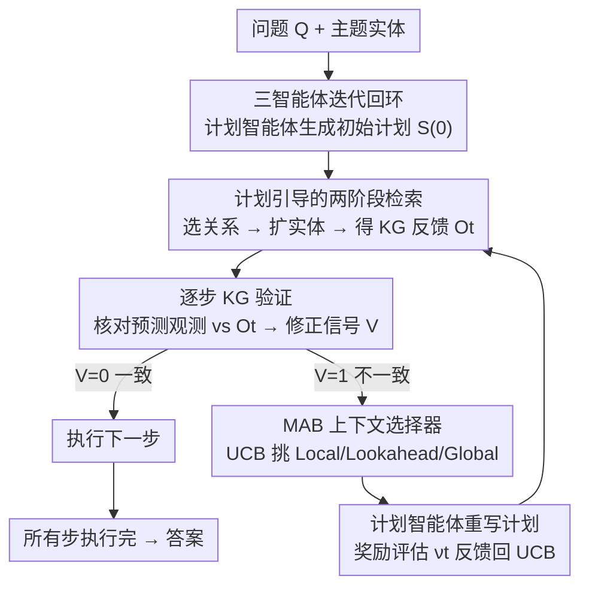

# VoG: Enhancing LLM Reasoning through Stepwise Verification on Knowledge Graphs

**会议**: ICLR 2026  
**OpenReview**: [https://openreview.net/forum?id=0RdAmwfVku](https://openreview.net/forum?id=0RdAmwfVku)  
**代码**: https://github.com/WenxinAZhao/VoG  
**领域**: LLM推理  
**关键词**: 知识图谱问答, 多跳推理, 逐步验证, 多臂老虎机, 自适应修正

## 一句话总结
VoG 用「计划—检索—验证—修正」三智能体迭代回环让 LLM 在知识图谱上做多跳推理：每一步都拿检索回来的 KG 三元组去核对当前推理计划，一旦发现不一致就用多臂老虎机自适应挑选上下文范围去改写计划，从而在三个 KGQA 基准上同时提升了准确率和效率（token 消耗反而比基线更低）。

## 研究背景与动机
**领域现状**：LLM 在知识密集型、需要多跳推理的任务上容易幻觉、事实不一致，根因是预训练里缺乏最新/专业知识、推理过程不透明。主流补救办法是引入知识图谱（KG）做外部知识源，现有 KG 增强方案大致分两类——一类让 LLM 先规划结构化路径或 SPARQL 查询再去查图（planning），一类专注优化检索过程（retrieval），把三元组静态喂给 LLM 或用 agent 逐步检索。

**现有痛点**：作者用「哥斯达黎加国歌→货币」这个多跳问题把现有范式的失败模式逐一拆开：（1）**推理僵化**——纯 planning 方法生成的路径可能根本不可执行（如把 `composition.language` 接到 `country.languages_spoken`），retrieval-only 方法又靠固定的深度/宽度剪枝，导致 KG 证据用不全、错误层层级联；（2）**信息利用有限**——大多数 agent 框架每一步只盯着当前局部检索到的三元组，忽略了全局上下文（之前的推理步、前瞻关系），于是中间步一碰到 KG 里无法识别的实体（如 `m.0h_1h3x` 这种无名 mid）就卡住，或者还没走完计划就提前下结论给出错误答案。

**核心矛盾**：现有框架都是**静态集成**——计划一旦生成就照着执行，检索机制不会随着上下文和新检索到的证据动态调整。问题的根本在于：推理计划与 KG 反馈之间缺乏一个「边走边对账、对不上就回头改」的闭环。

**本文目标**：（i）让推理能根据 KG 反馈逐步纠错、阻断错误传播；（ii）在修正时不要只看局部三元组，而是按场景动态决定该引入多少上下文。

**切入角度**：与其相信初始计划一次成型，不如把推理计划当成「可被验证、可被修订的活物」——每执行一步就用 KG 证据验证这一步的预测观测对不对，不对就触发修正；而修正该带多少上下文是不确定的，干脆把它建模成一个探索-利用问题让模型自己学。

**核心 idea**：用「逐步验证 + 自适应修正」替换「静态计划执行」——三个专职 LLM 智能体（计划/检索/验证）协同迭代，并用 KG 感知的多臂老虎机（MAB）在每个修正步动态挑选最有信息量的上下文子集。

## 方法详解

### 整体框架
VoG 把多跳 KGQA 拆成一个可迭代的反馈回环：先由**计划智能体**根据问题 $Q$ 生成完整的多跳推理计划 $S^{(0)}=[s_1,\dots,s_T]$（每步 $s_t=(T_t, A_t, \text{Pred\_}O_t)$ 是「思考-动作-预测观测」三元组，受 ReAct 启发，既当全局路线图又当跨长链的上下文记忆）；然后**检索智能体**按当前步的动作 $A_t$ 去 KG 做两阶段检索（先选关系、再扩实体），得到这一步的 KG 反馈 $O_t$；**验证智能体**拿 $O_t$ 去核对该步的预测观测 $\text{Pred\_}O_t$，给出一个 0/1 修正信号；若判定不一致，计划智能体就用 MAB 上下文选择器挑选上下文范围、重写从 $t+1$ 起的计划，并用奖励信号评估这次修正好不好。整个过程逐步推进直到计划全部执行并验证完毕——注意步数 $T$ 隐式定义了推理深度，是由计划本身的执行动态决定的，而非固定深度。

### 关键设计

**1. 三智能体迭代回环：把"一次成型的计划"变成"可验证可修订的活计划"**

针对「推理僵化、错误层层级联」的痛点，VoG 不再让 LLM 一口气生成路径就照执行，而是拆出计划、检索、验证三个专职智能体在一个回环里协作。计划智能体先产出完整推理计划 $S^{(0)}=[s_1,\dots,s_T]$ 作为全局路线图，每步显式带上预测观测 $\text{Pred\_}O_t$（即「我预期这一步会查到什么」）；检索智能体按动作 $A_t$ 去 KG 取证据；验证智能体逐步核对。关键在于推理深度 $T$ 不是预设的固定值，而是由计划执行过程自适应决定——某些问题两跳就够、某些要多跳，避免了 retrieval-only 方法固定深度/宽度剪枝带来的「证据没用全就停」或「过度展开」。把「预测观测」写进每一步，是这个设计能做验证的前提：有了预测才有东西可对账。

**2. 计划引导的两阶段检索：先选关系再扩实体，按需做熵自适应采样降噪**

为了让检索贴合当前子目标、又不被 KG 海量邻边淹没，检索分成两阶段（对应论文 Figure 3）。**关系检索**：在第 $t$ 步，对上一步得到的实体集 $E_{t-1}=\{e^{(t-1)}_1,\dots,e^{(t-1)}_N\}$，用结构化 KG 查询枚举每个实体的邻接关系，凑成候选关系集 $R^{cand}_t$，再让检索智能体以当前动作 $A_t$ 为输入选出最相关的关系子集 $R_t$；当候选集很大、噪声多时，用基于 Sentence-BERT 相似度的**熵自适应采样**做过滤。**实体检索**：对选中的每个关系 $r\in R_t$ 和实体 $e^{(t-1)}_i$，用 $(e^{(t-1)}_i, r, ?)$ 和 $(?, r, e^{(t-1)}_i)$ 两个模式查 KG 得到候选实体集 $E^{cand}_t$，同样按需熵采样，选出 $E_t$ 并把对应三元组 $(e^{(t-1)}_i, r, e^{(t)})$ 追加进 KG 反馈 $O_t$。这种「计划引导 + 按需采样」既减少了无关展开，也让后续推理有充分支撑，是 VoG 比 ToG 的 beam search 更省 token 的来源之一。

**3. 逐步 KG 验证：用检索回来的事实给每一步推理"对账"，不一致就触发修正**

这是 VoG 阻断错误传播的核心。给定计划中的步 $s_t$ 和该步检索到的反馈 $O_t=\{(e^{(t)}_{head}, r, e^{(t)}_{tail})\}$，验证智能体把 KG 三元组当事实依据，去比对该步的预测观测 $\text{Pred\_}O_t$；为提高可靠性，还额外接了一个预训练 DeBERTa 验证器做二次校验。修正信号形式化定义为

$$V(Q, s_t, O_t) = \begin{cases} 1 & \text{若 } \text{Pred\_}O_t \text{ 与 } O_t \text{ 不一致} \\ 0 & \text{否则} \end{cases}$$

当 $V=1$，VoG 把当前步标记为不可靠并触发修正流程，确保推理与 KG 反馈对齐后再往下走。和「照初始计划闷头检索」的现有做法相比，逐步验证让错误在产生当下就被拦截，而不是等到链条末端才暴露。

**4. MAB 上下文选择器 + 奖励设计：把"该带多少上下文去修正"建模成探索-利用问题**

修正面临两个难题：（i）LLM 对上下文输入高度敏感，不同场景需要的上下文范围不同，固定启发式很脆；（ii）LLM 可能生成幻觉/冗余步反而误导后续。VoG 用一个**KG 感知的多臂老虎机**解决（i）：定义三种互补策略当「臂」——**Local** 只用当前 KG 反馈 $O_t$（有明确三元组时纠幻觉最有效）、**Lookahead** 额外引入未来关系 $R_{t+1}$ 做前瞻调整、**Global** 聚合全部计划和历史反馈 $O_{1:t}$ 做全局重评估（适合累积误差或意图漂移时）。选臂用 UCB 并扩展了上下文感知先验：

$$\text{UCB}_t(c) = \underbrace{\frac{R_c}{N_c}}_{\text{利用}} + \underbrace{\alpha\sqrt{\frac{\log N}{N_c}}}_{\text{探索}} + \underbrace{B_{ent}(H_t) + B_{KG}(t, E_{rep}) + B_{div}(c)}_{\text{上下文感知先验}}$$

其中 $H_t$ 是答案分布的归一化熵（衡量不确定性），$E_{rep}$ 是从累积反馈里被重复检索的实体集；三个 bonus 分别鼓励高不确定性下多探索、惩罚重复检索、惩罚老选同一个策略。针对难题（ii），奖励 $\nu_t$ 评估每次修正质量：**任务奖励** $\nu_{local}$ 用五个轻量预训练模型打分的指标——Validation（修正后观测与 KG 是否一致）、Quality（与问题 $Q$ 的语义相关度）、Question Alignment（子步与查询目标是否一致）、Thought Coherence（思考与 KG 反馈是否连贯）、Efficiency（惩罚重复/重叠步）；**置信奖励** $\nu_{conf}(S_i)=\frac{1}{|P|}\sum_{S\in P}\mathbb{I}(a_S \sim a_{S_i})$ 衡量某候选计划的最终答案在所有候选 $P$ 中被一致支持的程度。最后用**熵感知加权**融合：$\lambda_t = \beta\cdot\exp(-H_t)$，$\nu_t = (1-\lambda_t)\nu_{local} + \lambda_t\nu_{conf}$——答案不确定时（高 $H_t$）全局共识奖励占主导，答案笃定时局部推理质量占主导。$\nu_t$ 累加进 $R_c$ 更新 UCB，闭合「修正评估↔策略选择」的回路。

### 一个完整示例
以 Qwen2.5-7B 跑「哥斯达黎加国歌对应国家用什么货币」为例：初始计划想「先找国家、再找货币」。检索到的实体 `m.0h_1h3x` 在 KG 里存在但没有可解析的名字——此时 **Local 策略失效**（没有明确三元组可对账），但 **Lookahead** 因为观测到未来关系、**Global** 因为能避免查询意图漂移，都能成功改写计划；而如果把所有上下文一股脑全塞进去，反而会分散 LLM 注意力诱发幻觉。MAB 选择器在这一步自适应地避开 Local、挑到能成功的策略，最终把货币正确修正为 Costa Rican colón。这个例子说明：没有哪个固定上下文策略能通吃所有场景，按步自适应挑选才是关键。

### 损失函数 / 训练策略
VoG 是 model-agnostic、免微调的推理框架，不训练 LLM 主干；验证侧的 DeBERTa 和 $\nu_{local}$ 用的五个评分模型都是轻量预训练模型直接调用，相比依赖 LLM 打分的做法更省推理开销。UCB 的 $\alpha$、熵加权的 $\beta$ 是固定常数超参。

## 实验关键数据

### 主实验
在 CWQ、WebQSP、WebQuestions 三个数据集（底层均为 Freebase）上，用 EM(Hits@1)/F1 评测，与 LLM-only、微调方法、LLM agent+KG 三类基线对比。VoG 在所有 backbone 上都超过同类 agent 基线（ToG、PoG）：

| Backbone | 方法 | CWQ EM | WebQSP EM | WebQuestions EM |
|----------|------|--------|-----------|-----------------|
| GPT-4 | ToG | 67.6 | 82.6 | 57.9 |
| GPT-4 | PoG | 75.0 | 87.3 | 71.7 |
| GPT-4 | **VoG** | **77.6** | **88.7** | **72.3** |
| GPT-3.5 | PoG | 63.2 | 82.0 | 61.7 |
| GPT-3.5 | **VoG** | **64.7** | **83.2** | **63.0** |
| Qwen2.5-7B | PoG | 46.0 | 58.5 | 46.2 |
| Qwen2.5-7B | **VoG** | **53.3** | **67.3** | **52.8** |

即便在小模型 Qwen2.5-7B 上 VoG 也稳定超基线（CWQ 53.3 vs PoG 46.0），说明增益来自方法而非模型规模；免微调却能打平甚至超过 DECAF、KG-Agent 等微调方法。

### 消融实验（GPT-3.5）

| 配置 | CWQ | WebQSP | WebQuestions | 说明 |
|------|-----|--------|--------------|------|
| VoG（完整） | 64.7 | 83.2 | 63.0 | 完整模型 |
| w/o Context Selector·Local | 60.1 (↓4.6) | 80.6 (↓2.6) | 58.2 (↓4.8) | 固定只用 Local |
| w/o Context Selector·Lookahead | 63.6 (↓1.1) | 81.4 (↓1.8) | 59.9 (↓3.1) | 固定只用 Lookahead |
| w/o Context Selector·Global | 60.2 (↓4.5) | 80.3 (↓2.9) | 60.6 (↓2.4) | 固定只用 Global |
| w/o Verify+Revise | 51.7 (↓13.0) | 72.1 (↓11.1) | 55.8 (↓7.2) | 只用初始计划直接出答案 |

### 效率分析

| 方法 | CWQ Tokens | CWQ Calls | WebQSP Tokens | WebQSP Calls |
|------|-----------|-----------|---------------|--------------|
| ToG | 9669.4 | 22.6 | 6031.2 | 15.9 |
| PoG | 8156.2 | 13.3 | 5517.7 | 9.0 |
| VoG | 6566.8 | 14.5 | 3439.0 | 9.4 |

### 关键发现
- **验证+修正回环贡献最大**：去掉后 CWQ 暴跌 13 分、WebQSP 跌 11 分，远超去掉上下文选择器的影响，证明「逐步验证 + 修正」是 VoG 的命门；但即便退化成 plan-only，仍优于标准 CoT 和 Self-Consistency，说明 LLM 内部规划本身就有不错的多跳能力，只是缺了外部验证就容易错误传播。
- **没有哪个固定上下文策略能通吃**：Local/Lookahead/Global 单独用都掉点，且在不同数据集上各有强弱（如 Lookahead 在 CWQ 只掉 1.1 但 Global 掉 4.5），正因为有效策略高度依赖上下文，自适应选择器才有必要。
- **效率反向提升**：VoG 在准确率领先的同时 token 消耗更低（WebQSP 仅 ToG 的 57%），因为自适应检索控制了深度/广度、上下文选择器削减了无关输入，且把上下文隐式存进推理计划、免去 PoG 那样的外部记忆模块和额外 LLM 调用。

## 亮点与洞察
- **「预测观测」是验证能成立的关键 trick**：每个计划步显式写出「我预期会查到什么」，才让 KG 反馈有对账目标——这个设计可迁移到任何需要 self-verify 的 agent，让验证从「事后判断对错」变成「逐步比对预期 vs 现实」。
- **把上下文选择建模成 MAB 很巧**：不同场景该带多少上下文本质是个不确定的探索-利用问题，固定规则必然顾此失彼；用 UCB + KG 感知先验让模型自己学，比手工规则鲁棒。这个「上下文范围当作可学习决策」的思路能迁到 RAG 的检索深度、记忆检索的窗口大小等。
- **熵感知奖励融合很有想法**：用答案分布的熵动态在「局部推理质量」和「全局答案共识」之间切换权重——不确定时信群体共识、笃定时信局部质量，是对 LLM 不稳定性的一种务实补偿。

## 局限与展望
- 全套流程依赖 DeBERTa 验证器和五个评分模型，虽说轻量，但在新领域/新语言上这些预训练打分器的可靠性存疑，可能成为新的误差源。
- MAB 只有三个固定策略臂（Local/Lookahead/Global），上下文空间被人工离散化成三档；更细粒度或可学习的上下文组合可能进一步提升，但探索成本也会上升。
- 主实验集中在 Freebase（附录补了 Wikidata 泛化），实体多为有名实体；像 `m.0h_1h3x` 这类无名 mid 仍是失败高发区，验证-修正能缓解但未根治。
- 五项任务奖励指标和三个 UCB bonus 引入了若干超参（$\alpha$、$\beta$ 及各 bonus 权重），论文主文未充分展开敏感性，实际部署的调参成本待观察。

## 相关工作与启发
- **vs ToG/PoG（agent+KG 检索）**: ToG 用固定宽度/深度的 beam search 检索、PoG 引入外部记忆模块，二者每步基本只看局部三元组，缺乏对推理计划的逐步验证与自适应修正；VoG 把检索-验证-修正串成闭环、用 MAB 动态选上下文，既更准又更省 token。
- **vs 微调类（RoG/DECAF/KG-Agent/GNN-RAG）**: 这些方法要么微调 LLM 要么微调检索器，训练成本高、迁移性差；VoG 完全免微调、model-agnostic，靠验证驱动和计划自适应就打平甚至超过它们，且能直接换不同 backbone。
- **vs 纯 planning（RoG 等生成 SPARQL/逻辑路径）**: planning 方法的结构化路径容易不可执行、对检索错误敏感；VoG 让计划可被 KG 反馈逐步验证和修订，把「计划」从一次性产物变成迭代纠错的对象。

## 评分
- 新颖性: ⭐⭐⭐⭐ 「逐步验证 + MAB 自适应上下文修正」组合在 KG-augmented LLM 推理里是有辨识度的新框架。
- 实验充分度: ⭐⭐⭐⭐ 三数据集 × 三 backbone（含小模型）+ 效率分析 + 消融 + 案例，附录还补了 Wikidata 泛化，较扎实。
- 写作质量: ⭐⭐⭐⭐ 用一个贯穿全文的失败案例把动机讲透，方法分节清晰；公式略密、部分细节压进附录。
- 价值: ⭐⭐⭐⭐ 免微调、model-agnostic、还省 token，对低成本可扩展 KGQA 部署有实用价值。

<!-- RELATED:START -->

## 相关论文

- [\[ICLR 2026\] MolecularIQ: Characterizing Chemical Reasoning Capabilities Through Symbolic Verification on Molecular Graphs](moleculariq_characterizing_chemical_reasoning_capabilities_through_symbolic_veri.md)
- [\[AAAI 2026\] Graph of Verification: Structured Verification of LLM Reasoning with Directed Acyclic Graphs](../../AAAI2026/llm_reasoning/graph_of_verification_structured_verification_of_llm_reasoning_with_directed_acy.md)
- [\[ICLR 2026\] Plan-Answer-Refine-on-Graph: Structured Planning and Self-Refinement for Large Language Model Reasoning on Knowledge Graphs](plan-answer-refine-on-graph_structured_planning_and_self-refinement_for_large_la.md)
- [\[ICLR 2026\] MathFimer: Enhancing Mathematical Reasoning by Expanding Reasoning Steps through Fill-in-the-Middle Task](mathfimer_enhancing_mathematical_reasoning_by_expanding_reasoning_steps_through_.md)
- [\[ICLR 2026\] Generative Adversarial Reasoner: Enhancing LLM Reasoning with Adversarial Reinforcement Learning](generative_adversarial_reasoner_enhancing_llm_reasoning_with_adversarial_reinfor.md)

<!-- RELATED:END -->
