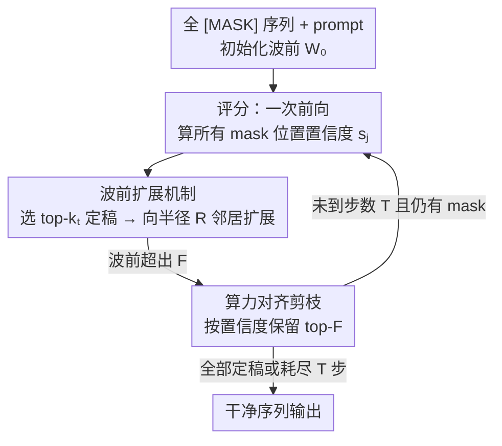

# WavefrontDiffusion: Dynamic Decoding Schedule for Improved Reasoning

**会议**: ICLR 2026  
**OpenReview**: [https://openreview.net/forum?id=4smJ6zY7vy](https://openreview.net/forum?id=4smJ6zY7vy)  
**代码**: https://github.com/page link (论文中给出占位链接，待开源)  
**领域**: LLM推理 / 扩散语言模型  
**关键词**: 扩散语言模型, 解码调度, 波前扩展, 数学推理, 代码生成

## 一句话总结
针对扩散语言模型（DLM）解码时"该先确定哪些 token"这个调度问题，本文提出 **WavefrontDiffusion**——一个免训练的动态调度策略，让已确定 token 像水波一样向外扩展候选区域，使每个 token 在拥有足够上下文时才被定稿；在五个推理与代码基准上以**完全相同的算力预算**稳定超过当前最强的 BlockDiffusion。

## 研究背景与动机

**领域现状**：扩散语言模型（DLM）把文本生成建模成对离散 token 序列的迭代去噪：从一整串 `[MASK]` 出发，每一步并行预测多个被遮盖位置，逐步收敛到干净序列。相比自回归模型一次只定稿一个 token，DLM 能并行更新、保持全局一致性，被视为有竞争力的替代范式。而 DLM 输出质量很大程度上取决于**去噪调度（denoising schedule）**——即每一步从所有遮盖位置里挑哪些 token 来定稿。

**现有痛点**：主流两种调度都有结构性缺陷。**Standard Diffusion** 做全局去噪、不限制更新范围，每步只根据局部置信度挑出最自信的几个 token 定稿；但因为缺乏全局结构约束，模型常常对 EOS（句末）token 过度自信、过早结束序列，且早期错误一旦锁定就无法纠正，会沿着后续步骤级联放大。**BlockDiffusion** 把序列切成固定大小、固定从左到右顺序的块，每步只在当前块内更新，稳定性更好、是目前块式调度里的 SOTA；但固定边界会**人为切断语义单元**——函数签名、公式、推理步骤这些天然连贯的结构可能被块边界劈开，迫使模型在上下文不完整时就定稿；而且更新顺序写死，无法随上下文或置信度灵活调整。

**核心矛盾**：块边界（固定的）与真正的语义边界（变长、跨块、随内容而变）之间存在错位。语义单元长度不一、依赖常常跨多个块，任何固定切分都是次优的，这正是早期错误和级联失败的根源。

**本文目标**：设计一个新调度，同时满足三点——(1) **自适应调度**：根据生成上下文动态调整去噪顺序，而非固定模式；(2) **上下文完整性**：让每个 token 在被定稿时拥有更完整的局部上下文；(3) **算力不变**：开销与块式方法持平，质量提升只来自更好的调度而非更多计算。

**核心 idea**：把生成想象成一道**向外扩散的波**——维护一个"波前（wavefront）"候选集，它从已定稿 token 向周围遮盖区域逐步扩展；token 只在它进入波前、局部上下文已基本就位时才被定稿。

## 方法详解

### 整体框架

WavefrontDiffusion 是一个**免训练**的解码调度策略，可直接套在现成 DLM 主干上（输入一串全 `[MASK]` + prompt，输出干净序列），只改"每步挑哪些位置定稿"，不改模型权重。它的核心抽象是**波前集合** $W_t$：在第 $t$ 步，波前包含所有"距某个已定稿位置不超过半径 $R$"的遮盖 token，即
$$W_t = \{i \mid \mathrm{dist}(i, C_t) \le R\}$$
其中 $C_t$ 是当前已定稿位置集合，$\mathrm{dist}(i,C_t)$ 是位置 $i$ 到任一已定稿位置的最小距离，$R$ 是用户设定的扩展半径。直觉上波前就是"已完成区域周围一圈、上下文已基本就绪"的候选位置。初始时 $C_0$ 只含 prompt，$W_0$ 取 prompt 之后的前 $F$ 个位置（$F$ 是波前最大容量）。

每一步走一个**评分 → 选择定稿 → 扩展 → 剪枝**的四步循环，让去噪前沿像水波一样从已定稿区域向外推进，既贴合语义的自然延展方向，又把每步预算严格卡死，使总更新量等于块式方法。

### 关键设计

**1. 波前候选集：让去噪沿语义结构向外生长，而非啃固定块**

这一设计直接针对 BlockDiffusion 切断语义单元、Standard Diffusion 上下文不足两个痛点。不同于在预切好的固定块里更新，WavefrontDiffusion 维护一个动态前沿 $W_t$，它从已定稿 token 向外扩展：每当一批位置被定稿（加入 $C_t$），就把它们半径 $R$ 内、仍是 `[MASK]` 的邻居纳入下一步波前
$$W_t = \bigcup_{i \in C_t} \{\, j \mid \mathrm{dist}(j,i) \le R,\; x_j = [\text{MASK}] \,\}$$
这样波前边界随生成内容自然漂移，把算力聚焦到"刚完成区域的周边"这些语义上最相关、上下文最充分的位置。作者用**信息梯度假设（Information Gradient Hypothesis）**为它提供理论支撑：一个 token 的条件熵随它到已定稿上下文的距离单调增大；因此在"距离定义的等熵面"内做受限搜索，比固定块能包含更高密度的低熵（高确定性）候选，从而最小化语义错配概率（附录 D 给出证明）。和固定块相比，关键区别是边界是**内容驱动、随时间变化**的，而非预先写死。

**2. 置信度评分 + 逐步预算的选择定稿：只确定"现在最有把握"的 token**

光有候选区还不够，还要决定区内挑哪些、挑几个定稿。每步先做**一次**前向，对每个遮盖位置 $j$ 算置信度为最大 softmax 概率
$$s_j = \max_{v \in V} p_\theta(x_j = v \mid x_t, c)$$
然后从当前波前 $W_{t-1}$ 里选置信度 top-$k_t$ 的位置，用预测值替换其 mask 完成定稿。每步定稿数 $k_t$ 由总长 $N$ 与总步数 $T$ 摊匀：
$$k_t = k_{\text{base}} + \mathbb{1}[t \le \text{extra}], \quad k_{\text{base}} = \lfloor N/T \rfloor,\ \text{extra} = N \bmod T$$
即前 `extra` 步每步多定稿 1 个，把余数均匀分摊。若波前内候选不足 $k_t$，则从前沿外补入高置信度位置以满足预算。这套机制保证 token "在有把握时才定稿"，把 Standard Diffusion 那种过早锁定、级联出错的风险压低，同时让每步工作量可控、可复现。

**3. 算力对齐的剪枝：把质量提升和算力增加彻底解耦**

波前会随定稿不断扩张，若不约束，开销就会超出块式基线，"提升来自更好调度"的结论也站不住。为此每步扩展后做**剪枝**：若 $|W_t| > F$，只按缓存的置信度分数保留 top-$F$ 个位置。由此总 token 更新量被严格限制在 $F \times T$，与 BlockDiffusion 的预算完全相等——两者唯一差别是"在哪里更新"而非"更新多少"。这条设计是论文实验说服力的基石：在固定 1024 步前向、相同壁钟预算下做对比，任何精度提升都只能归因于**调度方式更优**，而非堆算力。

### 损失函数 / 训练策略
本方法**免训练**，不引入任何额外可学习参数或训练目标，只替换推理阶段的解码调度。DLM 主干本身按标准方式在遮盖位置上用变分下界（VLB）下的交叉熵训练。两个核心超参为波前最大容量 $F$ 与扩展半径 $R$，默认 $F=8$、$R=2$。

## 实验关键数据

### 主实验
五个基准：GSM8K、MATH、BBH（推理，报 exact-match 准确率）、HumanEval、MBPP（代码，报 pass@1）。三个主干：LLaDA-8B-Instruct、LLaDA-1.5、Dream-7B。所有方法固定 1024 步前向、温度 0.0、零样本无 CoT，确保差异只来自调度。

| 主干 | 策略 | GSM8K | MATH | HumanEval | MBPP | BBH |
|------|------|-------|------|-----------|------|-----|
| LLaDA-8B-Instruct | Standard | 23.15 | 26.60 | 17.68 | 13.50 | 11.30 |
| LLaDA-8B-Instruct | Block (旧SOTA) | 80.74 | 40.62 | 45.73 | 41.17 | 43.23 |
| LLaDA-8B-Instruct | **Wavefront** | **82.03** | **41.04** | **47.56** | **42.40** | **44.30** |
| LLaDA-1.5 | Block | 82.33 | 41.64 | 46.34 | 44.04 | 44.56 |
| LLaDA-1.5 | **Wavefront** | **82.94** | **41.96** | **48.17** | **46.20** | **45.26** |
| Dream-7B | Block | 78.92 | 43.60 | 53.05 | 58.52 | 45.13 |
| Dream-7B | **Wavefront** | **80.66** | **44.00** | **54.27** | **59.03** | **46.91** |

WavefrontDiffusion 在**全部任务、全部三个模型家族**上都最优。相对 BlockDiffusion 的提升以 LLaDA-8B 为例为 +1.27（GSM8K）/+0.42（MATH）/+1.83（HumanEval）/+1.23（MBPP）/+1.07（BBH）；Dream-7B 上也有 +1.74（GSM8K）等一致增益。提升幅度不大但跨数学推理与代码合成、跨模型尺度都稳定，且都在相同步数与壁钟预算内取得。

### 语义保真度与调度质量

| 指标（WikiText, BERTScore） | F1 | P | R |
|------|------|------|------|
| Standard | 0.7885 | 0.7664 | 0.7913 |
| Block | 0.7946 | 0.7663 | 0.8142 |
| **Wavefront** | **0.8094** | **0.7749** | **0.8236** |

Precision 提升说明它更少插入无关 token，Recall 提升说明序列补得更完整，共同抬高 F1，佐证"等上下文够了再定稿"确实减少了块式碎片化。论文还提出 **MHCO（Masked Higher-Confidence Outside）** 指标量化"调度是否尊重置信度顺序"：

$$\text{MHCO}_t = \frac{1}{|S_t|}\sum_{i \in S_t} \mathbb{1}\big[\exists j \in N_{\text{out}}: c_t(j) > c_t(i)\big]$$

其中 $S_t$ 为本步选中定稿的集合，$N_{\text{out}}$ 为前沿外半径 $R$ 内的遮盖 token，$c_t(\cdot)$ 为置信度。它统计"定稿了一个低置信 token、而旁边还有更高置信 token 没定"的频率，越低越好。图 2 显示 Wavefront 在所有数据集与两个尺度上 MHCO 都低于 Block，说明它更一致地按置信度排序定稿——这与 Table 1 的精度增益相关联。

### 消融实验（超参敏感性，LLaDA-8B）

| 配置 | MATH | GSM8K | HumanEval | 说明 |
|------|------|-------|-----------|------|
| F=4 (R=2) | 41.02 | 82.71 | 45.12 | 候选偏少 |
| **F=8 (R=2)** | 41.04 | 82.03 | **47.56** | 默认配置 |
| F=16 (R=2) | 41.22 | 82.03 | 45.12 | 收益递减，冗余候选 |
| F=8, R=4 | 40.98 | 82.03 | 46.34 | 半径稍大、增益微弱 |
| F=8, R=8 | 41.00 | 82.09 | 42.07 | 半径过大，HumanEval 掉点 |

### 关键发现
- **算力对齐是结论可信度的核心**：所有对比都在固定 1024 步前向、$F\times T$ 更新量相同的预算下完成，精度提升只能归因于调度本身，排除了"靠多算"的混淆因素。
- **$F$ 从 4→8 有增益、8→16 收益递减**：更大波前能纳入更多上下文充分的候选，但过大只会塞进冗余候选、不增信息。
- **$R$ 不宜过大**：从 2→4 提升微弱，到 8 时 HumanEval 从 47.56 掉到 42.07——过宽前沿会削弱局部聚焦、引入噪声。整体对超参不敏感，$F=8,R=2$ 即默认且稳健，几乎无需调参。

## 亮点与洞察
- **"波前"是个很贴切的物理隐喻**：把"上下文从已知向未知扩散"形式化成一个随距离生长的候选集，既比 Standard 的全局更新有结构、又比 Block 的固定块更灵活，是介于两者之间的优雅折中。
- **信息梯度假设给了直觉以理论骨架**："条件熵随到已定稿上下文的距离单调增"这一假设把"为什么近处的 token 该先定稿"说圆了，并由此论证动态边界比固定块包含更高密度低熵候选。
- **免训练、即插即用**：只换解码调度、不动权重，可直接套在任意 DLM 主干（LLaDA、Dream）上，迁移成本极低；这种"只优化推理调度"的思路也可启发其它并行解码场景。
- **MHCO 是个可复用的诊断指标**：它把"调度有没有违反置信度优先级"量化出来，且与最终精度相关，可作为评估并行解码策略合理性的通用探针。

## 局限与展望
- **依赖内部置信度，可能失准**：方法用 max softmax 概率当置信度选 token，但置信度本身可能 miscalibrated，尤其在域外场景，会误导定稿顺序。
- **不能完全避免级联错误**：一旦长推理链早期出错，后续仍可能被带偏；定稿是不可逆的。作者提出未来可探索**延迟定稿 / 可逆解码**来缓解。
- **提升幅度有限**：相对 Block 多在 +0.3~+2 个点，属稳健小增益而非量级飞跃；优势在于零额外算力下的"白拿"。
- **扩展方向**：改进置信度校准以增强鲁棒性；推广到多模态或结构化域（代码、图）。

## 相关工作与启发
- **vs Standard Diffusion**：它全局并行更新、无范围限制，只看局部置信度定稿，易过早锁定 EOS、级联出错；本文用波前限制候选范围、保证上下文完整，再定稿，纠正了"上下文不足就定稿"的问题。
- **vs BlockDiffusion**：它用固定大小、固定顺序的块控制误差传播，是块式 SOTA，但固定边界会切断语义单元、顺序不可变；本文把"固定块"换成"内容驱动、动态扩展的波前"，在**完全相同的 $F\times T$ 算力预算**下尊重语义边界，唯一差别是更新位置而非更新数量。

## 评分
- 新颖性: ⭐⭐⭐⭐ 把解码调度建模成"动态波前扩展"并配信息梯度假设，角度新颖且免训练
- 实验充分度: ⭐⭐⭐⭐ 五基准 × 三主干 + 算力严格对齐 + 自定义 MHCO 指标 + 超参分析，较完整；但缺与更多并行解码变体的横向对比
- 写作质量: ⭐⭐⭐⭐ 动机—理论—算法—实验逻辑清晰，物理隐喻易懂
- 价值: ⭐⭐⭐⭐ 零额外算力即可稳定提升 DLM 推理/代码生成，即插即用、迁移成本低

<!-- RELATED:START -->

## 相关论文

- [\[ICLR 2026\] Dynamic Early Exit in Reasoning Models](dynamic_early_exit_in_reasoning_models.md)
- [\[ICLR 2026\] Sample Smart, Not Hard: Correctness-First Decoding for Better Reasoning in LLMs](sample_smart_not_hard_correctness-first_decoding_for_better_reasoning_in_llms.md)
- [\[ICLR 2026\] FastGRPO: Accelerating Policy Optimization via Concurrency-aware Speculative Decoding and Online Draft Learning](fastgrpo_accelerating_policy_optimization_via_concurrency-aware_speculative_deco.md)
- [\[ACL 2026\] Adapt to Thrive! Adaptive Power-Mean Policy Optimization for Improved LLM Reasoning](../../ACL2026/llm_reasoning/adapt_to_thrive_adaptive_power-mean_policy_optimization_for_improved_llm_reasoni.md)
- [\[ICML 2026\] DyCon: Dynamic Reasoning Control via Evolving Difficulty Modeling](../../ICML2026/llm_reasoning/dycon_dynamic_reasoning_control_via_evolving_difficulty_modeling.md)

<!-- RELATED:END -->
