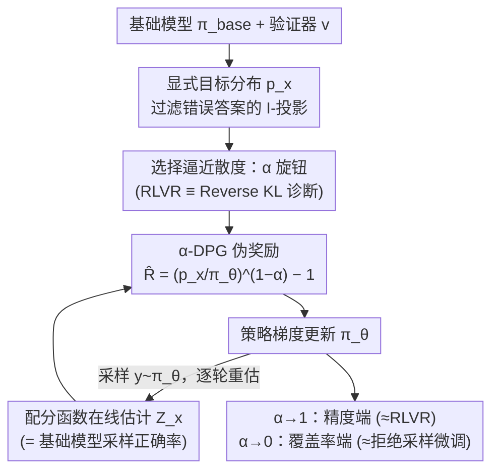

# Whatever Remains Must Be True: Filtering Drives Reasoning in LLMs, Shaping Diversity

**会议**: ICLR 2026  
**arXiv**: [2512.05962](https://arxiv.org/abs/2512.05962)  
**代码**: [https://github.com/naver/alpha-dpg](https://github.com/naver/alpha-dpg)  
**领域**: LLM NLP / 强化学习 / LLM推理  
**关键词**: α-散度, 分布匹配, RLVR, 多样性保持, 定理证明

## 一句话总结
提出 DMVR 框架和 α-DPG 算法，通过显式定义"过滤掉错误答案"的目标分布并用 α-散度族来逼近，统一了 RLVR（Reverse KL）和拒绝采样微调（Forward KL），在 Lean 定理证明上实现了精度-覆盖率 Pareto 前沿的最优表现。

## 研究背景与动机

**领域现状**：基于可验证奖励的强化学习（RLVR，如 GRPO/PPO）已成为调优 LLM 推理能力的标准方法。然而，越来越多的证据表明 RLVR 训练后的模型存在**严重的多样性损失**（mode collapse）——虽然 pass@1 提高了，但生成策略的多样性大幅降低，导致 pass@k（k 较大时）反而不如基础模型。

**现有痛点**：RLVR（GRPO/PPO 等）隐式优化了 Reverse KL 散度到目标分布，这是一种"模式寻求"（mode-seeking）散度——它让模型集中在少数高奖励区域，忽略其他有效解。当 β=0 时，退化为纯 REINFORCE，完全没有多样性保护。现有缓解方法（KL 惩罚、Rw-Ulkly 等）治标不治本。

**核心矛盾**：精度（pass@1）与覆盖率（pass@k）之间存在根本权衡。现有 RL 方法只能偏向精度端，缺乏系统性控制这一权衡的手段。

**本文目标**：如何在保持正确性的同时保留基础模型中已有的解的多样性？如何提供精度-覆盖率权衡的连续可控机制？

**切入角度**：从**分布匹配**（Distributional Matching）的角度重新审视 RLVR——显式定义目标分布为"过滤掉错误答案、保留正确答案相对概率"的分布 $p_x(y) \propto \pi_{\text{base}}(y|x) \cdot v(y,x)$。然后用 α-散度族来逼近这个目标分布，不同 α 值对应不同的精度-多样性权衡。

**核心 idea**：多样性损失的根源不在目标分布（过滤本身），而在用来逼近它的散度选择——用 α-散度替代 Reverse KL 可系统性控制精度与多样性的平衡。

## 方法详解

### 整体框架
这篇论文想回答一个看似矛盾的现象：RLVR 明明在 pass@1 上更强了，为什么大采样预算下的 pass@k 反而崩了？作者的答案是把整个问题翻译成**分布匹配**——训练的目标不应该是"最大化奖励"，而应该是把策略 $\pi_\theta$ 拉向一个明确写出来的目标分布 $p_x(y) \propto \pi_{\text{base}}(y|x) \cdot v(y,x)$，也就是"在基础模型的输出里把错误答案删掉、正确答案的相对概率原样保留"。

一旦目标分布被显式写死，剩下的自由度就只在"用什么散度去逼近它"。DMVR（Distributional Matching with Verifiable Rewards）框架把这一步交给 α-散度族 $D_{f_\alpha}(\pi_\theta \,\|\, p_x)$，再用 f-DPG 的策略梯度来训练。α 这个标量就成了精度与多样性之间的旋钮：α→1 时偏 mode-seeking、行为接近 RLVR；α→0 时偏 mass-covering、行为接近拒绝采样微调，中间可以连续滑动。下图把"先定目标、再选散度、最后在训练回环里逐轮更新"这条主线串起来，方框对应下面四个关键设计。

### 关键设计

**1. 显式目标分布：把"训练目标"和"如何逼近"彻底拆开**

RLVR 的麻烦在于它的目标是隐式的——奖励里塞了个温度 $\beta$，真正在逼近的其实是平滑近似 $p_{x,\beta}(y) \propto \pi_{\text{base}}(y|x) \cdot \exp(v(y,x)/\beta)$，"目标是什么"和"怎么逼近"混在一起，没法单独换逼近策略。本文反其道而行，先把理想目标写死：$p_x(y) \propto \pi_{\text{base}}(y|x) \cdot v(y,x)$。这个分布有个干净的刻画——它是满足两个条件的唯一分布：(i) 所有输出都通过验证器 $v$；(ii) 在所有满足 (i) 的分布里，它与基础模型的 Forward KL 最小，也就是信息几何里的 I-投影。换句话说，它是"在保证正确的前提下，离原模型最近"的那个分布，因此天然保留了基础模型的解的多样性。目标一旦固定，"用哪种散度去够它"就变成一个可以独立调的选择，这正是后面 α 旋钮的立足点。

**2. RLVR ≡ Reverse KL：证明多样性损失的根子在散度，不在过滤**

要论证"问题出在散度而非目标"，得先把 RLVR 到底在最小化什么说清楚。引理 1 给出梯度等式 $\nabla_\theta \mathbb{E}_x[\mathrm{KL}(\pi_\theta \,\|\, p_{x,\beta})] = -\frac{1}{\beta} \nabla_\theta \mathbb{E}_{x,y\sim\pi_\theta}[v(y,x) - \beta \log \frac{\pi_\theta}{\pi_{\text{base}}}]$——也就是说，最大化 RLVR 的伪奖励，等价于最小化策略到 $p_{x,\beta}$ 的 **Reverse KL**。引理 2 再补上一句 $\lim_{\beta\to 0} p_{x,\beta} = p_x$，把平滑目标和本文的硬过滤目标接上。两条引理合起来给出诊断：Reverse KL 是 zero-forcing（模式寻求）的散度，它允许策略直接忽略目标分布的整片模式，只要守住一两个高奖励区域就够——于是 mode collapse 不是 bug，而是 Reverse KL 的必然行为。问题被精确定位到散度的选择上。

**3. α-DPG：用一个标量 α 遍历整条 Pareto 前沿**

既然根子在散度，那就把散度参数化。α-DPG 用 α-散度族重写 f-DPG 的伪奖励：

$$\hat{R}_\theta(y,x) = \min\left(\left(\frac{p_x(y)}{\pi_\theta(y|x)}\right)^{1-\alpha} - 1,\; M\right)$$

这一个式子吃下了所有特例：α→1 时退回 REINFORCE（mode-seeking，对应 RLVR），α→0 时退回 KL-DPG / 拒绝采样微调（mass-covering），α=0.5 时正好是 Hellinger 距离。也就是说 RLVR（Reverse KL, α≈1）、KL-DPG（Forward KL, α=0）、RS-FT 都只是这条谱线上的点，调一个 α 就能从精度端连续滑到覆盖率端，把整条精度-覆盖率 Pareto 前沿走一遍——比起去手调 KL 惩罚系数 β，这个旋钮的物理意义直接得多。工程上有两个稳定性补丁：用 leave-one-out 的每上下文伪奖励均值当 baseline 压方差，以及把伪奖励 clip 到 $M=10$，防止小 α 时比值 $(p_x/\pi_\theta)^{1-\alpha}$ 爆炸。

**4. 配分函数在线估计：把归一化常数白嫖回来**

目标分布 $p_x$ 带一个归一化常数 $Z_x$，看上去要额外采样才能算。作者注意到它其实有现成含义——$Z_x = \mathbb{P}_{y\sim a(\cdot|x)}[v(y,x)=1]$，就是基础模型在该题上的采样正确率。于是直接拿当前批次已经采出来的样本在线估一下就行，不用复制模型、也不用多跑一遍采样，几乎零额外开销；唯一要小心的是难题正确率可能为 0，所以把下限 clamp 到 $\epsilon = 10^{-4}$ 防止除零。

### 损失函数 / 训练策略
- 伪奖励：$\hat{R}_\theta(y,x) = \min((\frac{p_x(y)}{\pi_\theta(y|x)})^{1-\alpha} - 1, M)$
- 梯度：$\nabla_\theta \mathcal{L} = \mathbb{E}_{x,y\sim\pi_\theta}[-\hat{A}^f(y,x) \nabla_\theta \log \pi_\theta(y|x)]$
- Baseline：leave-one-out 每上下文伪奖励均值
- 训练细节：4×A100，512序列/步，200迭代（约3轮），最大响应1024 tokens，float16

## 实验关键数据

### 主实验
在 Lean 定理证明任务上（10K训练题，200测试题）的 pass@k 结果：

| 方法 | pass@1 | pass@16 | pass@256 | 特点 |
|------|--------|---------|----------|------|
| Base-SFT | 低 | 中 | 中高 | 多样但不精准 |
| GRPO (β=0) | **高** | 中 | 低 | 精准但多样性崩溃 |
| GRPO (High-KL) | 中高 | 中高 | 中高 | KL惩罚缓解 |
| Rw-Ulkly | 中高 | 中高 | 中高 | 排名偏好保多样性 |
| Pass@k训练 | 中 | 中高 | 高 | 专门优化覆盖率 |
| α-DPG (α=0.999) | **高** | **高** | 中高 | 接近RLVR精度+更好覆盖 |
| α-DPG (α=0.25) | 中 | **高** | **最高** | 最佳覆盖率 |

### 消融实验

| α值 | 行为 | 精度 (pass@1) | 覆盖率 (pass@256) |
|-----|------|--------------|------------------|
| α=0.25 | 强 mass-covering | 中等改善 | 最高，超越所有方法 |
| α=0.5 (Hellinger) | 平衡 | 中等 | 高 |
| α=0.75 | 偏 mode-seeking | 较高 | 中高 |
| α=0.999 | 接近 Reverse KL | 最高 | 与GRPO相当 |
| 不同 α 的 Pareto 前沿 | 全部在或接近前沿 | 连续可控 | 连续可控 |

### 关键发现
- **α-DPG 模型几乎全部在 Pareto 前沿上**：单一超参 α 即可遍历精度-覆盖率权衡空间
- **α=0.999 通常支配 GRPO 和纯 RL 方法**：相似精度+更好覆盖率
- **α=0.25 实现所有方法中最高的 pass@256**：覆盖率超越 Base-SFT、Pass@k 训练和 KL 正则化
- **问题难度转移分析**：GRPO 和 α=0.999 使许多中等问题变简单，但也导致部分难题完全不可解；α=0.25 和 High-KL 更保守，仅丢失3个问题的可解性
- **多样性分析**：策略/前提的多样性（Shannon指数）与 pass@256 正相关、与 pass@1 负相关
- **困惑度分析**：所有模型生成的序列在基础模型下都有很低的困惑度，证实 RL 不创造新能力而是重新加权已有行为

## 亮点与洞察
- **"多样性损失在散度，不在目标"的核心洞察**：将问题从"RL 是否有害"重新框架化为"用什么散度逼近同一个目标分布"。这个视角转换非常深刻——目标分布（过滤）是完全合理的，问题出在 Reverse KL 的模式寻求特性
- **大统一框架**：α-DPG 将 REINFORCE/GRPO（α≈1）、KL-DPG（α=0）、拒绝采样微调（α=0，离线版）统一在同一框架下，仅通过一个标量 α 参数区分。这种理论简洁性很有价值
- **Pareto 可控性**：单一超参数即可连续遍历精度-覆盖率前沿，比调 KL 惩罚系数 β 更直观、效果更好
- **对 RLVR 的反思**：本文严格证明 RLVR ≡ Reverse KL 到过滤分布，配合近期"RL不创新只重排"的发现，清楚解释了为什么 RLVR 模型在大采样预算下不如基础模型

## 局限与展望
- **仅在 Lean 定理证明上验证**：是否推广到代码生成、数学推理等其他可验证任务未知
- **仅用 7B 模型**：对更大模型（70B+）的效果未测试
- **低 α 时训练不稳定**：α≤0.5 需要 clipping，但 clipping 引入偏差
- **配分函数估计噪声**：在线估计 $Z_x$ 在正确率很低的困难问题上不准确
- **可改进方向**：α 的课程学习（先低后高，兼顾早期覆盖和后期精度）；扩展到非二值奖励场景；与 MCTS 等搜索策略结合

## 相关工作与启发
- **vs GRPO/PPO（RLVR）**：它们隐式优化 Reverse KL，必然牺牲多样性。α-DPG 在 α≈1 时恢复其精度但保留更多覆盖
- **vs KL-DPG (Khalifa et al.)**：KL-DPG 用 Forward KL，保多样性但精度不够。α-DPG 统一了两端
- **vs Rw-Ulkly (He et al.)**：通过排名偏好惩罚保多样性，但缺乏理论指导。α-DPG 有散度族的信息几何理论支撑
- **vs Pass@k 训练**：直接优化 pass@k，但缺乏分布匹配的理论视角。α-DPG 在覆盖率上更优
- 这篇论文对理解"RL后训练到底在做什么"有深刻启发——下次看到 mode collapse 应首先检查用的散度而非目标函数

## 评分
- 新颖性: ⭐⭐⭐⭐⭐ 从散度选择的角度统一和解释RLVR的多样性问题，提出α-DPG是优雅的概念贡献
- 实验充分度: ⭐⭐⭐⭐ Lean任务上的实验全面（Pareto分析、难度转移、多样性分析、困惑度），但限于单一任务和模型
- 写作质量: ⭐⭐⭐⭐⭐ 理论推导严谨，从引用到表达都体现深厚功底，表达精准
- 价值: ⭐⭐⭐⭐⭐ 对RLVR领域的核心问题提供了理论框架和实用解法，α参数的Pareto可控性极有实际价值

<!-- RELATED:START -->

## 相关论文

- [\[ICLR 2026\] Diversity-Enhanced Reasoning for Subjective Questions](diversity-enhanced_reasoning_for_subjective_questions.md)
- [\[ICLR 2026\] FROST: Filtering Reasoning Outliers with Attention for Efficient Reasoning](frost_filtering_reasoning_outliers_with_attention_for_efficient_reasoning.md)
- [\[ICLR 2026\] Smarter Not Harder: Generative Process Evaluation with Intrinsic-Signal Driving and Ability-Adaptive Reward Shaping](smarter_not_harder_generative_process_evaluation_with_intrinsic-signal_driving_a.md)
- [\[ICLR 2026\] Executable Counterfactuals: Improving LLMs' Causal Reasoning Through Code](executable_counterfactuals_improving_llms_causal_reasoning_through_code.md)
- [\[ICLR 2026\] On Code-Induced Reasoning in LLMs](on_code-induced_reasoning_in_llms.md)

<!-- RELATED:END -->
