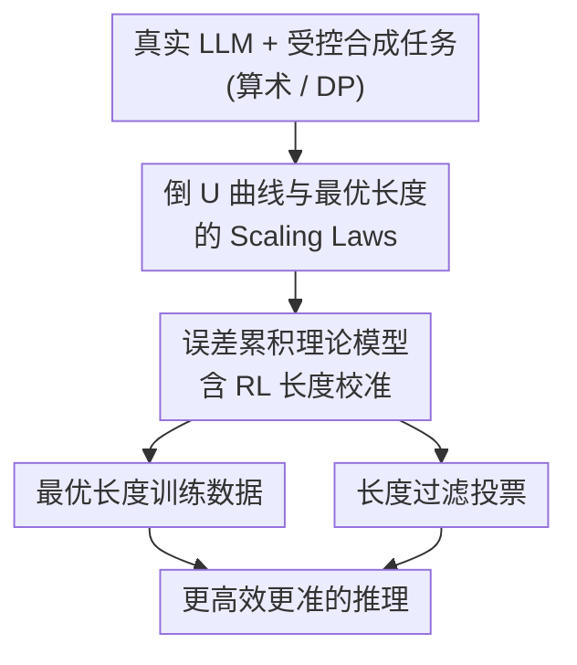

# When More Is Less: Understanding Chain-of-Thought Length in LLMs

**会议**: ICLR 2026  
**OpenReview**: [https://openreview.net/forum?id=6QDFsYxtI1](https://openreview.net/forum?id=6QDFsYxtI1)  
**代码**: https://github.com/PKU-ML/CoT-Length  
**领域**: LLM推理  
**关键词**: 思维链, CoT长度, 误差累积, 过度思考, 强化学习校准

## 一句话总结
本文系统揭示了"思维链越长越好"是个误解——任务准确率随 CoT 长度呈**倒 U 型**曲线，存在一个随任务难度增大、随模型能力增强而缩短的**最优长度**；作者用一个误差累积理论模型解释了这一现象并推导出 scaling law，进而给出"按最优长度造训练数据 + 推理时按长度过滤投票"两个实用配方。

## 研究背景与动机
**领域现状**：思维链（Chain-of-Thought, CoT）已是 LLM 解决复杂推理任务的核心技术——让模型显式生成中间步骤，把难题拆成一串可管理的子问题，类似分治。随着 o1 这类推理模型兴起，"扩展 test-time compute、生成更长的 CoT"几乎成了提升推理能力的默认信仰。

**现有痛点**：主流直觉（以及不少早期研究）认为 CoT 越长越细、性能越好，尤其在难题上。但也有相反证据显示简洁 CoT 有时反而更有效。两派观点冲突，背后缺一个统一解释：推理性能到底是随 CoT 加长而单调改善，还是存在某个内在上限？而当前训练实践里，监督微调常常**对不同模型、不同任务复用同一份 CoT 数据**，完全没有自适应性。

**核心矛盾**：CoT 加长有两股相反的力——拆解（decomposition）让每一步变简单、降低单步难度；但步数变多会让**单步误差不断累积**。短到欠拆解（underthinking）则每步太难、单步错误率高。两者博弈意味着一定存在一个折中的最优长度，而非"越长越好"。

**本文目标**：(1) 证明最优 CoT 长度的存在性；(2) 刻画它如何随任务难度与模型能力 scaling；(3) 给出理论解释；(4) 把洞察落成可操作的训练/推理配方。

**切入角度**：真实 LLM 的 CoT 含太多不可控变量（反思、回溯、规划、异质预训练），难做机理分析。作者设计**受控合成任务**（算术加法、动态规划三角形最大路径和），用步长 $t$（每步处理的算子数）精确控制 CoT 长度 $N \approx T/t$，在固定总难度 $T$ 下隔离"推理结构本身"的影响。

**核心 idea**：用"逐步误差累积"这一个视角统一解释倒 U 曲线、最优长度的 scaling law，以及 RL 为何能校准长度——并据此指导 CoT 数据设计与推理时投票。

## 方法详解

### 整体框架
本文不是提出一个新模型，而是一条"现象→受控验证→理论解释→实践落地"的研究链路。先在真实 Qwen2.5 系列（1.5B–72B）上观察到 CoT 长度与准确率的倒 U 关系；再用合成算术/DP 任务做受控实验，精确刻画最优长度 $N^*$ 随任务难度 $T$ 与模型能力 $M$ 的 scaling；然后建立一个误差累积理论模型，从单步误差出发推导出倒 U 曲线、最优长度闭式解和 scaling law，并解释 RL 为何收敛到最优长度；最后据此给出两个 proof-of-concept 配方——按最优长度造训练数据、推理时按长度过滤投票。四个环节环环相扣，理论预测与经验观测高度吻合。

### 关键设计

**1. 倒 U 曲线与最优长度的 Scaling Laws：把"越长越好"证伪并量化最优长度怎么动**

作者首先在真实与合成两侧坐实了核心现象：固定任务难度 $T$、改变 CoT 步数 $N$，准确率呈倒 U 型——太短（欠思考，单步过难）和太长（过度思考，误差累积）都掉点，中间存在一个最优长度 $N^*$。在 MMLU STEM 上，用最优长度推理比用最长可能 CoT 在 72B 模型上高出 60% 以上。关键不止于"存在最优"，而是它**随两个变量系统性移动**：

- **随任务难度上升而变长**：用 $(1-\text{acc})$ 当难度代理，Qwen2.5-7B 上难度与最优长度显著正相关（$p = 1\times10^{-4} \ll 0.05$）；合成实验里最优峰随 $T$ 增大右移。
- **随模型能力增强而变短**：最优长度从 1.5B/7B 的 11、10 步降到 32B/72B 的 3、4 步。强模型能把推理"压缩"进更少、更有力的步骤，呼应 Simplicity Bias。
- **难任务的最优单步也更难**：合成实验（图 3a）显示随 $T$ 增大，最优"每步算子数" $t^*$ 也增大——难题不能只靠多堆简单步骤，还得提高每步子任务的复杂度，这直接指向**循环 Transformer**（loop 数可调，给每步分配更多算力）这类自适应深度结构。

这一节同时暴露了实践的系统性错配：监督训练对不同规模模型复用同一份 CoT 数据、或把大模型 CoT 直接蒸馏给小模型，都违背了"最优长度应随模型与任务自适应"的结论，甚至导致大模型表现不如小模型。

**2. 误差累积理论模型：一个单步成功率就能推出倒 U 曲线和闭式最优长度**

为解释上述现象，作者建一个极简但够用的理论模型。把 $N$ 步 CoT 的最终正确率按似然分解为每步"子问题 + 子答案"的乘积，并聚焦两类误差：子问题误差 $\sigma(T)\in[0,1)$ 随难度上升；子答案误差 $E(N,M,T)\in[0,1]$ 取决于模型能力 $M$ 与有效单步难度 $T/N$。其中能力 $M(\theta)$ 用"推理边界"定义——模型能在单步内可靠解出的最大子问题规模。假设逐步平稳且条件独立，最终准确率为

$$A(N) = \alpha\big[(1-\sigma(T))(1-E(N,M,T))\big]^N.$$

取线性特例 $\sigma(T)=T/C$、$E=T/(NM)$，得 $A(N)=\alpha(1-T/C)^N(1-T/(NM))^N$：小 $N$ 时拆解有益（准确率升），大 $N$ 时误差累积（准确率降）——倒 U 自然浮现。进一步求极值得到最优长度闭式解

$$N^*(M,T) = \frac{TZ}{M(Z+1)}, \quad Z = W_{-1}\!\Big(-\big(1-\tfrac{T}{Ce}\big)\Big),$$

其中 $W_{-1}$ 是 Lambert W 函数的负分支。由此**形式化推导出前面三条 scaling law**：$N^*$ 随 $T$ 增、随 $M$ 减，且最优单步难度 $t^*=T/N^*=M(1+1/Z)$ 随 $T$ 增。这套分析还能扩展到非线性、随机误差函数，鲁棒性良好。

这个模型的价值在于：它不是事后拟合，而是从"每步有个成功概率、错误会沿步数复利累积"这一条直觉，**同时**导出了存在性、闭式解和经验观测到的全部 scaling 趋势，把零散现象收进一个统一框架。

**3. RL 把推理引向最优长度：解释 RL 为何优于监督微调**

作者把"选 CoT 长度"建模成一个无状态 bandit：在离散动作集 $A=\{N_1,\dots,N_k\}$ 中选 $N_i$，得到二元奖励，成功概率即 $A(N_i)$；用 softmax 策略做梯度上升，可证明策略收敛到确定性最优 $\pi_\theta(N_i)=1 \iff i=\arg\max_j A(N_j)$，即 **RL 自动收敛到最优 CoT 长度**。合成实验印证：从混合长度预训练的 GPT-2 出发做 RL，长度分布从分散在 5/12/24 逐步坍缩到准确率最优的长度 5；真实 GRPO 训练（Qwen2.5-7B on LeetCode-2K）也显示平均 CoT 长度随准确率上升而**下降**——推翻了"RL 必然产生更长 CoT"的常见信念。这给监督微调与 RL 的差异提供了新视角：即便监督数据的 CoT 长度选得不对，RL 也能把模型行为自适应地校准回最优长度区间。作者还发现**自纠错训练**（按概率 $p=0.3$ 注入"先错后改"片段）会显著缩短最优长度、同时抬高最优单步难度 $t^*$——学会修局部错误让模型对单步误差更鲁棒，于是能用更少但更强的步骤。

**4. 最优长度训练数据 + 长度过滤投票：把洞察变成两个可操作配方**

理论落地为两个 proof-of-concept。**训练侧**：用"对该模型规模与任务难度而言最优"的长度造 CoT 数据，对比均匀混合长度数据——结果一个 6 层小模型用最优长度数据训练，竟能超过用混合长度数据训练的 9 层大模型，且任务越难差距越大，证明训练数据的 CoT 长度匹配度至关重要。**推理侧**：提出 **Length-Filtered Vote**。标准 majority vote（self-consistency）对所有采样路径一视同仁，但太短/太长的路径会往投票池里塞噪声。作者先按 CoT 长度 $\ell(c_i)$ 把候选答案分到等宽（$D=2$）的组 $\{L_j\}$，对每组算最终答案的 Shannon 熵 $H(L_i)$，只在熵最小的 $K=3$ 个组里做多数投票——理论说准确率在某段长度上峰值，而低不确定性正是好预测的信号。在 GPQA 上，它稳定优于普通投票和随机分组过滤投票，且随采样数增加几乎不退化。这条配方的妙处是：当 token 级概率拿不到时，**CoT 长度是最易计算、又与准确率相关的特征**。

## 实验关键数据

### 主实验
真实 LLM 与合成任务一致呈现倒 U 曲线与可预测的 scaling；最优长度推理在大模型上远超最长 CoT。

| 场景 | 关键观测 | 数据 |
|------|---------|------|
| MMLU STEM (72B) | 最优长度 vs 最长 CoT | 准确率高出 **>60%** |
| Qwen2.5 1.5B→72B | 最优长度随模型增大而缩短 | 11/10 步 → 3/4 步 |
| Qwen2.5-7B | 任务难度 vs 最优长度 | 正相关 $r=0.39$, $p=1\times10^{-4}$ |
| 合成训练 ($T=32/64$) | 6 层(最优长度) vs 9 层(混合长度) | 小模型反超大模型 |
| GPQA (Llama3-8B / Qwen2.5-7B) | Length-Filtered Vote vs 普通投票 | 稳定更高且不随采样数退化 |

### 消融实验
自纠错训练（SC）对最优长度 $N^*$ 与最优单步难度 $t^*$ 的影响（算术任务，6 层 GPT-2）：

| 任务难度 $T$ | 16 | 24 | 32 | 40 | 说明 |
|------|----|----|----|----|------|
| $N^*$ w/o SC | 4 | 5 | 8 | 10 | 无自纠错 |
| $N^*$ w/ SC | 2 | 2 | 3 | 5 | 自纠错后步数显著减少 |
| $t^*$ w/o SC | 4 | 5 | 4 | 4 | 单步难度 |
| $t^*$ w/ SC | 8 | 12 | 11 | 8 | 单步难度显著升高 |

### 关键发现
- **倒 U 是普适的**：算术、DP、真实 MMLU/MATH/WinoGrande 一致出现，且峰值随难度右移、随模型能力左移——不是个例而是规律。
- **RL 不一定让 CoT 变长**：GRPO 训练中平均长度随准确率上升而下降，长度分布坍缩到最优值，说明 RL 本质在"校准长度"而非"加长推理"。
- **自纠错让步骤更少更强**：注入"先错后改"信号后 $N^*$ 几乎腰斩、$t^*$ 翻倍，模型学会用更少但更难的步骤——对训练数据设计有直接启发。
- **长度即信号**：在拿不到 token 概率的黑盒场景，仅靠 CoT 长度过滤就能稳定提升 self-consistency。

## 亮点与洞察
- **一个直觉撑起整篇理论**：从"每步有成功概率、错误复利累积"出发，同时推出倒 U 存在性、Lambert-W 闭式最优长度和三条 scaling law，理论与经验严丝合缝，难得的"简单却有解释力"。
- **受控合成任务的巧设计**：用算术加法的"每步算子数 $t$"在固定总难度 $T$ 下精确调 CoT 长度 $N\approx T/t$，干净地隔离了"推理结构"这一变量，是真实 LLM 做不到的机理实验。
- **把 RL 优势归因到"长度校准"**：用无状态 bandit 把 RL 选长度形式化，给"RL 为何强于 SFT"一个新且具体的解释，可迁移到任何把 test-time 行为当动作的分析。
- **可直接落地的两招**：最优长度造数据（小模型反超大模型）、Length-Filtered Vote（黑盒可用），都不需要改模型结构，工程上很轻。

## 局限与展望
- **真实场景最优长度难精确估计**：理论闭式解依赖 $\sigma(T)$、$E$ 的形式假设和能力参数 $M$，作者也承认真实问题里只能粗估，训练配方仍是 proof-of-concept。
- **合成任务偏简单**：算术/DP 三角形是高度结构化、可自动合成的任务，单步难度 $t$ 与"总难度" $T$ 都人为可控；真实推理的反思/回溯/规划被抽象成"任务拆解的不同选择"，是否完全覆盖存疑。
- **能力 $M$ 用"层数"代理**：合成实验用 GPT-2 层数代表模型能力、用"推理边界"定义 $M$，与真实 LLM 的能力维度（预训练数据、宽度、对齐）并不等价，跨设定外推需谨慎。
- **自适应单步算力仍待探索**：作者指出循环 Transformer 是匹配"自适应单步难度"的天然结构，但承认这一方向"尚未充分研究"，本文只给了 6-loop vs 9-loop 的初步验证。

## 相关工作与启发
- **vs "longer is better" 直觉 (Fu et al. 2023; Jin et al. 2024)**：他们认为更长更细的 CoT 普遍更好、并主张过滤掉短 CoT；本文证明那只在"越长越好"的 2023 时代小模型上成立，倒 U 与最优长度才是更普适的图景，过滤策略也应换成"按最优长度区间"而非"一味去短"。
- **vs 简洁 CoT 有效论 (Nayab et al. 2024)**：他们观察到简洁 CoT 有时更优但在难题上有 trade-off；本文用倒 U + scaling law 把"何时该短、何时该长"统一进一个由 $T$ 和 $M$ 决定的框架，给出了定量条件。
- **vs CoT 理论 (Feng et al. 2023; Chen et al. 2024b 推理边界)**：复用了 DP 三角形任务与"推理边界"概念，但把视角从"CoT 能否表达某类问题"转到"CoT 长度如何影响误差累积与最优性"。
- **vs RL 长度增长论 (Gandhi et al. 2025)**：他们指出 RL 对长度的影响强依赖基座、增长可能只是回溯；本文进一步用 bandit 证明 RL 收敛到最优长度，并实测 GRPO 反而缩短 CoT。

## 评分
- 新颖性: ⭐⭐⭐⭐⭐ 把"越长越好"证伪并给出统一的倒 U + scaling law + 闭式最优长度，视角新且自洽
- 实验充分度: ⭐⭐⭐⭐ 真实 1.5B–72B + 合成受控 + 理论三线印证，但真实侧最优长度估计与配方仍偏 proof-of-concept
- 写作质量: ⭐⭐⭐⭐⭐ 现象→受控→理论→实践逻辑清晰，图表与结论对应紧密
- 价值: ⭐⭐⭐⭐⭐ 对"过度思考"给出原理性解释，并产出可直接用的训练/推理指导，影响面广

<!-- RELATED:START -->

## 相关论文

- [\[ICLR 2026\] When Reasoning Meets Compression: Understanding the Effects of LLMs Compression on Large Reasoning Models](when_reasoning_meets_compression_understanding_the_effects_of_pruning_and_quant.md)
- [\[ICLR 2026\] Are Reasoning LLMs Robust to Interventions on Their Chain-of-Thought?](are_reasoning_llms_robust_to_interventions_on_their_chain-of-thought.md)
- [\[ICLR 2026\] When Silence is Golden: Can LLMs Learn to Abstain in Temporal QA and Beyond?](when_silence_is_golden_can_llms_learn_to_abstain_in_temporal_qa_and_beyond.md)
- [\[ICML 2026\] When the Chain of Thought Knows Better: Failure Modes in Multi-Turn Reasoning Models](../../ICML2026/llm_reasoning/when_the_chain_of_thought_knows_better_failure_modes_in_multi-turn_reasoning_mod.md)
- [\[ICLR 2026\] Making Slow Thinking Faster: Compressing LLM Chain-of-Thought via Step Entropy](making_slow_thinking_faster_compressing_llm_chain-of-thought_via_step_entropy.md)

<!-- RELATED:END -->
