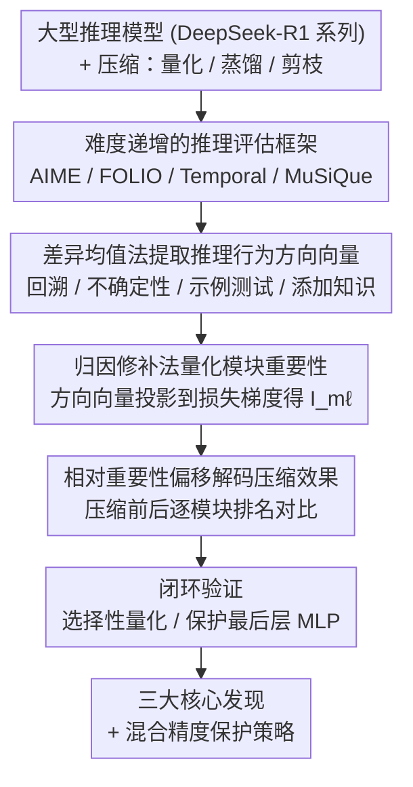

# When Reasoning Meets Compression: Understanding the Effects of LLMs Compression on Large Reasoning Models

**会议**: ICLR2026  
**arXiv**: [2504.02010](https://arxiv.org/abs/2504.02010)  
**代码**: [github.com/psunlpgroup/Compression-Effects](https://github.com/psunlpgroup/Compression-Effects)  
**领域**: LLM推理  
**关键词**: 模型压缩, 推理模型, 量化, 蒸馏, 剪枝, 可解释性, DeepSeek-R1

## 一句话总结
系统研究量化、蒸馏、剪枝三种压缩方法对大型推理模型 (LRM) 的影响，通过性能基准测试和机制可解释性分析，揭示权重数量对知识记忆影响大于推理、最后一层 MLP up_proj 是最关键组件、以及当前量化方法过度压缩最后层等核心发现。

## 背景与动机
- DeepSeek-R1 等大型推理模型在复杂推理任务上表现优异，但部署成本高昂
- 已有压缩研究存在两个瓶颈：
    - **评估瓶颈**：现有量化/剪枝评估主要使用困惑度和简单任务，未在复杂推理基准上充分测试
    - **分析瓶颈**：缺乏对压缩效果的深入可解释性分析
- 核心问题：LRM 的推理能力在压缩过程中如何受损？哪些权重对推理最重要？

## 方法详解

### 整体框架
本文不提出新的压缩算法，而是搭建一套「性能基准 + 机制可解释性」的双层分析框架：先在难度递增的推理基准上系统测量量化、蒸馏、剪枝三类压缩对 DeepSeek-R1 系列模型的损伤，再用激活方向向量与归因修补逐线性模块定位「哪些权重对推理最关键、压缩又破坏了哪些」，最后通过选择性量化和保护实验把可解释性结论闭环验证回性能。

### 关键设计

**1. 难度递增的推理评估框架：让压缩损伤暴露在复杂任务上**

已有压缩评估多停留在困惑度和简单任务，掩盖了推理能力的退化。本文覆盖三类压缩变体——量化（Unsloth 动态量化 2.51/1.73/1.58-bit、AWQ、GPTQ、GPTAQ、ANY4/ANY3）、蒸馏（R1-Distill-Llama 70B/8B、R1-Distill-Qwen 32B/7B）、剪枝（SparseGPT、AlphaPruning 多稀疏度），并在四个难度递增的基准上评测：AIME 2024（数学推理）、FOLIO（逻辑推理）、Temporal Sequences（取自 BIG-Bench Hard 的时序推理）、MuSiQue（多跳推理，用 closed-book 设置同时考查知识与推理）。MuSiQue 的引入尤为关键，它让「知识记忆」与「纯推理」两条受损路径得以分离，直接支撑了后文「剪枝伤知识、量化保参数」的结论。

**2. 差异均值法提取推理行为方向向量：把抽象推理行为变成可测的激活方向**

要判断某个权重对推理是否重要，先得在激活空间里刻画推理行为本身。本文聚焦四种核心推理行为——回溯（backtracking）、不确定性估计（uncertainty estimation）、示例测试（example testing）、添加知识（adding knowledge），用对比数据集 $\mathcal{D}_+$（含该行为）与 $\mathcal{D}_-$（不含）的平均激活之差，为每个线性模块 $m$ 在层 $\ell$ 处构造行为 $c$ 的方向向量：

$$\mathbf{u}_{m\ell}^c = \frac{1}{|\mathcal{D}_+|} \sum_{s_i^c \in \mathcal{D}_+} \bar{\mathbf{a}}_{m\ell}^c(s_i^c) - \frac{1}{|\mathcal{D}_-|} \sum_{s_j \in \mathcal{D}_-} \bar{\mathbf{a}}_{m\ell}(s_j)$$

其中 $\bar{\mathbf{a}}_{m\ell}^c(s_i^c)$ 是行为 token 序列上的平均激活。这一方向向量给出了「该模块在多大程度上、朝哪个方向参与某种推理行为」的可操作表示，是后续因果归因的输入。

**3. 归因修补法量化模块重要性：用梯度把方向向量翻译成因果强度**

有了方向向量还不够，关键是它对模型输出是否有因果作用。本文用归因修补（attribution patching）把方向向量 $\tilde{\mathbf{u}}_{m\ell}^c$ 投影到损失对激活的梯度上，得到模块对行为 $c$ 的重要性得分：

$$\mathbf{I}_{m\ell}^c \approx \frac{1}{|\mathcal{D}_+|} \left| \sum_{s_i^c \in \mathcal{D}_+} (\tilde{\mathbf{u}}_{m\ell}^c)^\top \frac{\partial}{\partial \mathbf{a}_{m\ell}} \mathcal{L}(s_i^c) \right|$$

$\mathbf{I}_{m\ell}^c$ 越高，说明沿该行为方向扰动模块激活对损失的影响越大，即模块与推理行为 $c$ 的因果关系越强。相比逐层（layer-wise）分析，这种逐线性模块的得分能精确指认出「最后一层 MLP up_proj」这类细粒度关键组件。

**4. 相对重要性偏移解码压缩效果：把压缩前后的重要性变化对齐为可读信号**

最后要回答「压缩到底破坏了什么」。本文比较压缩前后模块的相对重要性 $\mathbf{RI}_{m\ell}^c$（同一行为下各模块重要性的归一化排名），用其偏移量追踪压缩的影响——若某关键模块在压缩后重要性被异常削弱，说明该模块遭到过度压缩。这一信号直接催生了后文的验证实验：仅量化最后层 up_proj（占总权重 0.7%）即让平均准确率掉 16.3%，反过来仅把约 2% 的最后层 MLP 保留为全精度即回升 6.57%，从而把可解释性发现闭环成可落地的混合精度保护策略。

## 实验关键数据

### 总体性能对比

| 模型 | 参数量 | 压缩方式 | AIME 2024 | FOLIO | Temporal | Avg | MuSiQue (EM, F1) |
|------|--------|----------|-----------|-------|----------|-----|-------------------|
| DeepSeek-R1 | 671B | 无 | 73.3 | 76.4 | 99.6 | 83.1 | (17.0, 27.51) |
| DeepSeek-R1 | 671B | 2.51-bit | 76.7 | 77.8 | 100.0 | **84.8** | (17.0, 24.43) |
| DeepSeek-R1 | 671B | 1.58-bit | 66.7 | 75.4 | 94.0 | 78.7 | (14.0, 22.34) |
| R1-Distill-Llama | 70B | 蒸馏 | 65.6 | 79.8 | 99.9 | 81.8 | (13.3, 21.57) |
| R1-Distill-Qwen | 32B | 蒸馏 | 64.4 | 82.3 | 99.9 | 82.2 | (2.7, 10.95) |
| R1-Distill-Llama | 8B | 蒸馏 | 42.2 | 71.9 | 81.5 | 65.2 | (0.0, 4.43) |
| R1-Distill-Llama | 70B | 50% SparseGPT | 23.3 | 71.6 | 97.6 | 64.2 | (6.7, 13.49) |

### 选择性量化验证重要性

| 量化组件 | 排名 | AIME 2024 | FOLIO | Temporal | Avg |
|----------|------|-----------|-------|----------|-----|
| 32_up (最后层up_proj) | 全局第1 | 20.0 | 63.1 | 63.6 | 48.9 |
| 32_gate | 列第2 | 33.3 | 62.1 | 67.2 | 54.2 |
| 32_v | 列最后 | 43.3 | 68.0 | 79.6 | 63.6 |
| 未量化基线 | - | 42.2 | 71.9 | 81.5 | 65.2 |

仅量化 32_up（占总权重 0.7%）即导致平均准确率下降 **16.3%**！

### 保护关键权重的效果

| 压缩方式 | 是否保护 | AIME 2024 | FOLIO | Temporal | Avg |
|----------|---------|-----------|-------|----------|-----|
| 3-bit AWQ | 否 | 10.0 | 59.6 | 68.4 | 46.0 |
| 3-bit AWQ | 保护最后层 MLP | **16.7** | **67.0** | **74.0** | **52.57** |

仅保护约 2% 的权重为全精度，平均准确率提升 **6.57%**，最高超越 SOTA 量化方法 **23.17%**。

### 崩溃点分析（SparseGPT 不同稀疏度）

| 稀疏度 | R1-Distill-Llama-70B AIME | R1-Distill-Llama-70B FOLIO |
|--------|---------------------------|---------------------------|
| 0% | 63.3 | 78.8 |
| 30% | 63.3 | 79.3 |
| 40% | 56.7 | 73.9 |
| 50% | 26.7 | 70.9 |
| 60% | 0.0 | 65.0 |
| 70% | 0.0 | 49.8 |

崩溃点与任务难度负相关：AIME 在 40-50% 崩溃，FOLIO 在 60-70% 崩溃。

## 三大核心发现

### Finding 1: 权重数量对知识记忆影响大于推理
- Qwen 推理能力强于 Llama，但 MuSiQue (知识密集型) 得分远低于 Llama-70B
- 剪枝导致知识记忆崩溃比推理更早（MuSiQue 在 30-40% 稀疏即崩溃）
- 结论：知识密集型任务应优先选择量化（保持参数数量）而非剪枝/蒸馏

### Finding 2: 最后一层 MLP up_proj 是最关键组件
- 在 R1-Distill-Llama-8B 和 R1-Distill-Qwen-7B 上均观察到该规律
- 蒸馏是造成该组件重要性突出的原因（原始 Llama 不具有此特征）
- 补充了已有研究声称 o_proj 最重要的结论

### Finding 3: 当前量化方法过度压缩最后层和 gate_proj
- AWQ 和 GPTQ 都过度压缩最后层模块和中间层的 gate_proj
- 保护最后层 MLP 模块即可显著提升性能（+6.57% 平均）
- 该发现同样适用于剪枝方法

## 亮点
1. **首次系统性比较三种压缩方法对 LRM 的影响**：填补了 LRM 压缩研究的空白
2. **细粒度可解释性分析**：逐线性模块分析重要性，超越已有的逐层分析
3. **实用价值极高**：仅保护 2% 权重即获得显著提升，为未来压缩方法提供明确指导
4. **发现可泛化**：核心发现在 R1 和非 R1 模型家族均成立
5. **理论与实践结合**：每个发现都有验证实验支撑

## 局限性 / 可改进方向
- 可解释性分析仅用 120 个实例，样本量较小
- 未探索混合精度量化的最优策略（仅做了简单的最后层保护验证）
- 剪枝分析较量化和蒸馏少，因为高稀疏度模型不可用
- 蒸馏效果分析仅限于 SFT 方式，未涉及 RL 阶段蒸馏
- 未讨论推理时间和部署效率的具体数据

## 与相关工作的对比
- 相比已有压缩基准（EleutherAI harness 等）：本文使用更具挑战的推理数据集
- 相比 Venhoff et al. 的层级分析：本文提供模块级细粒度分析
- 相比 Shao & Wu 认为 o_proj 最重要：本文发现 up_proj 在蒸馏模型中更关键
- 相比 Liu et al. 和 Feng et al. 的 survey：本文提供独到的可解释性视角

## 启发与关联
- 最后一层 MLP up_proj 的重要性发现可直接指导未来量化/剪枝算法设计
- 混合精度保护策略可推广到更多压缩场景
- 知识vs推理的分离视角为选择合适的压缩方法提供理论依据
- 崩溃点与任务难度的关联可用于预估压缩后的能力边界

## 评分
- 新颖性: ⭐⭐⭐⭐ (系统性研究+可解释性分析的结合新颖，但基础方法非原创)
- 实验充分度: ⭐⭐⭐⭐⭐ (覆盖量化/蒸馏/剪枝、多模型、多基准、多验证实验)
- 写作质量: ⭐⭐⭐⭐ (结构清晰，发现表述精练，但表格较多读起来略繁)
- 价值: ⭐⭐⭐⭐⭐ (三个核心发现直接可用于改进压缩方法，保护2%权重提升6.57%极具实用性)

<!-- RELATED:START -->

## 相关论文

- [\[ICLR 2026\] When More Is Less: Understanding Chain-of-Thought Length in LLMs](when_more_is_less_understanding_chain-of-thought_length_in_llms.md)
- [\[ACL 2026\] Can Reasoning Path still be Effective as Input? Bridging Post-Reasoning to Chain-of-Thought Compression](../../ACL2026/llm_reasoning/can_reasoning_path_still_be_effective_as_input_bridging_post-reasoning_to_chain-.md)
- [\[ICLR 2026\] Variation in Verification: Understanding Verification Dynamics in Large Language Models](variation_in_verification_understanding_verification_dynamics_in_large_language_.md)
- [\[ICML 2026\] Internalizing Safety Understanding in Large Reasoning Models via Verification](../../ICML2026/llm_reasoning/internalizing_safety_understanding_in_large_reasoning_models_via_verification.md)
- [\[ICLR 2026\] Characterizing and Mitigating Reasoning Drift in Large Language Models](characterizing_and_mitigating_reasoning_drift_in_large_language_models.md)

<!-- RELATED:END -->
