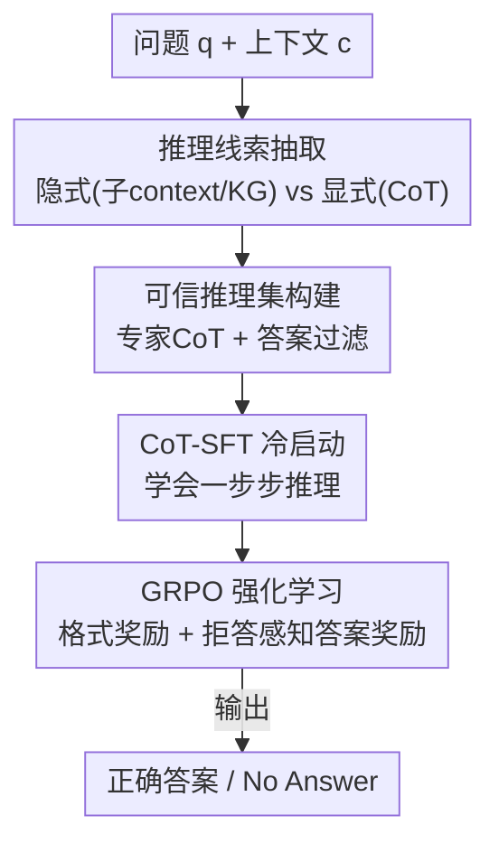

# When Silence is Golden: Can LLMs Learn to Abstain in Temporal QA and Beyond?

**会议**: ICLR 2026  
**论文**: [OpenReview](https://openreview.net/)（⚠️ 以原文为准）  
**代码**: https://github.com/Blackzxy/AbstentionTemporalQA  
**领域**: LLM推理 / 可靠性与拒答  
**关键词**: 拒答（Abstention）、时序问答、CoT 冷启动、GRPO、奖励设计

## 一句话总结
这篇论文系统研究"如何教 LLM 在时序问答里该不知道就拒答"，提出一条 **CoT-SFT 冷启动 + GRPO 强化学习（带拒答感知奖励）** 的流水线，让一个 1.5B 小模型在 TimeQA 上的 Exact-Match 反超 GPT-4o（Easy/Hard 分别 +3.46% / +5.80%），同时揭示出 SFT 会让模型过度自信、RL 提升准确率但拒答行为在难题上反而退化的 trade-off。

## 研究背景与动机
**领域现状**：LLM 在各类问答上表现亮眼，但有个顽固毛病——**宁可流畅地编一个答案，也不肯承认"我不知道"**。让模型在没有依据时拒答（abstain，即回 "No Answer"），是可靠性的关键。主流补救手段包括置信度校准（calibration）、训练时加辅助目标、提示工程、一致性投票、多模型聚合等。

**现有痛点**：这些方法在标准 QA 上有些效果，但放到**时序问答（temporal QA）**就明显失灵。时序问题要求模型理解"事件随时间演化、答案会过期"——比如"Anna Karina 在 1966–1967 年的配偶是谁？"，若两人 1965 年已离婚，正确答案应是"无法回答"，但 GPT-4o 会自信地编一个名字。时间表达本身又充满模糊（"before"/"after"/"早 1980 年代"）和矛盾，使得拒答判断比普通 QA 更难。

**核心矛盾**：校准类方法在**复杂多步推理**场景下根本刻画不准不确定性；训练类方法又要额外监督、泛化差。更深层的矛盾是 **整体准确率 ↔ 拒答能力** 之间存在 trade-off：让模型更敢答，可答题涨分但乱答更多；让模型更爱拒答，又容易"什么都不答"。

**本文目标**：作者明确说"不只是想做个更强的模型"，而是要系统回答三个子问题——（1）哪种**信息线索**（原始 context、时序子 context、知识图谱、显式 CoT）最能帮助带拒答的时序推理；（2）**模型规模**怎么影响；（3）**SFT vs RL** 等训练策略各自对推理和拒答行为有什么副作用。

**切入角度**：把"拒答"当成一种**可教的技能（teachable skill）**，而不是事后做置信度阈值。作者假设：用专家模型蒸馏出的 CoT 做冷启动、再用规则化奖励的 RL 去强化"诚实地说不知道"，能把推理能力和拒答行为联合优化。

**核心 idea**：**CoT-SFT 提供推理冷启动 + GRPO 用"答对给分、该拒答时拒答给满分、乱答给 0"的规则奖励做强化**，让小模型既学会时序推理又学会该闭嘴时闭嘴。

## 方法详解

### 整体框架
论文先把"喂给模型的推理线索"分成两大类做对比实验，再给出真正的训练流水线。**隐式推理信息**（implicit）指间接帮助推理、但不显式给出推理步骤的背景，包含两种：时序相关子 context（`tc`）和从 context 抽出的时序知识图谱（KG 四元组）。**显式推理信息**（explicit）则是用 GPT-o1 生成的 **CoT 推理链**，直接给出一步步的思考过程。

真正的方法主线是一条三步走的 **CoT+RL 流水线**：先用专家模型生成并过滤出"可信推理集"，用它做 CoT-SFT 冷启动，再用 GRPO 强化学习配上**格式奖励 + 拒答感知答案奖励**进一步打磨。输入是 `(问题 q, 上下文/线索 e)`，模型输出 `o`——要么给正确答案，要么在不可答时输出 "No Answer"。

### 关键设计

**1. 推理线索抽取：到底喂什么信息最能帮带拒答的时序推理**

针对"时序 context 噪声大、模型抓不住与问题时间戳相关的事实"这个痛点，作者并行设计了三类线索做对照。**时序子 context** 用 GPT-4o-mini 加一个时间过滤 prompt，从原始 `c` 里只留下与问题时间戳 `tq` 相关的片段 $tc = \text{ExtractTimeRelated}(q, c)$，砍掉无关时间事实的噪声。**知识图谱** 把 context 抽成时序四元组 $(h, r, t, \tau)$（头实体、关系、尾实体、时间戳），再用语义相似度（Faiss）或关键词匹配（KeyBERT）检索 Top-$k$ 条 $KG_k = \text{Top-}k(\text{Sim}(q, s_i))$，最后改写成自然语言塞回输入。**显式 CoT** 则用 GPT-o1 为每题生成 `{推理步骤 r, 答案 â}`。这一组对照的价值在于：它后来用实验回答了"隐式线索其实帮助有限、显式 CoT 才是关键"这个核心结论。

**2. 可信推理集构建：用答案过滤保证冷启动监督是干净的**

冷启动不需要海量数据，但极其在意质量——脏的推理链会教坏小模型。作者用 GPT-o1 生成 CoT 后，**只保留生成答案 `â` 与真值 `a` 完全一致的样本**，丢弃其余，构成"可信推理集"（trusted reasoning set），TimeQA-Easy/Hard 分别只留下 2,119 / 1,045 条。这一步是"冷启动质量 > 数量"思路的体现：宁可少而准，也不要让模型在冷启动阶段就学到错误的推理轨迹。

**3. CoT-SFT 冷启动：先让小模型学会"一步步想"再谈强化**

直接对基座模型做 RL 会失败（论文实测：没有 CoT-SFT 时 RL 训练根本起不来）。所以这一步用可信推理集做监督微调，**让模型同时生成推理步骤 `r` 和最终答案 `a`**，而不是直接吐答案——本质是把专家的 step-by-step 推理能力"种"进小模型，激活其内在推理潜力。作者强调小模型从 CoT-SFT 冷启动里获益，远大于从 KG 或 context 里获益，这是后续 RL 能反超 GPT-4o 的前提。

**4. GRPO + 拒答感知奖励：用规则奖励同时优化"答对"和"该拒答就拒答"**

这是把拒答变成可强化技能的核心。RL 用 GRPO：对每个问题采样一组 $G$ 个输出 $\{o^{(1)}, \dots, o^{(G)}\}$，按组内相对优势更新策略，并用 KL 惩罚约束新策略别偏离参考模型太远。奖励是**纯规则、无奖励模型**（规避 reward hacking），由两部分组成。格式奖励 $R_{format}=0.5$，要求把思考放进 `<think></think>`、答案放进 `<answer></answer>`，否则为 0。答案奖励是关键：

$$R_{ans}(o,a)=\begin{cases}1.0, & o=\text{No Answer} \text{ 且 } a=\text{No Answer}\\ \text{Rouge-L}(o,a)+\text{EM}(o,a), & o\neq\text{No Answer} \text{ 且 } a\neq\text{No Answer}\\ 0, & \text{其他}\end{cases}$$

最妙的是第一行：**当题目不可答、模型也老实回 "No Answer" 时直接给满分 1.0**，明确奖励"诚实拒答"；第三行把"该答却拒答（over-abstain）"和"该拒答却乱答（hallucinate）"都罚成 0，双向夹逼。总奖励 $R=R_{format}+R_{ans}$。这套设计让"拒答"和"答对"在同一个标量信号里被联合优化，而不是事后加阈值。

### 损失函数 / 训练策略
GRPO 目标函数（式 1）为组内 PPO-clip 形式：
$$J_{GRPO}=\mathbb{E}\Big[\tfrac{1}{G}\sum_{i=1}^{G}\min\big(\tfrac{\pi_\theta}{\pi_{\theta_{old}}}A_i,\ \text{clip}(\tfrac{\pi_\theta}{\pi_{\theta_{old}}},1-\epsilon,1+\epsilon)A_i\big)-\beta D_{KL}(\pi_\theta\|\pi_{ref})\Big]$$
训练配置：SFT 全参微调 2 epoch（$lr=1\text{e-}5$，weight decay $1\text{e-}2$）；RL 先 CoT-SFT 1 epoch，再 GRPO 训 3 epoch，组大小 $G=4$，KL 系数 $\beta=0.01$，$\epsilon=0.2$，4×H100 训练。

## 实验关键数据

### 主实验
TimeQA 含 2 万+ QA 对、5.5K 时序事实、70 种关系，分 Easy（显式时间表达）/Hard（隐式时间引用）两档，且都含可答/不可答样本。下表为 Exact-Match（%）主结果对比：

| 设置 | 模型 | TimeQA-Easy EM | TimeQA-Hard EM |
|------|------|------|------|
| 仅问题 (INF) | GPT-4o | 21.56 | 20.72 |
| +原始 context (INF) | GPT-4o | 39.95 | 29.95 |
| +时序子context (INF) | GPT-4o | 45.15 | 34.12 |
| +原始 context (INF) | o4-mini | 44.14 | 37.12 |
| +原始 context, **RL** | **Qwen2.5-1.5B** | **43.41** | **35.75** |
| +原始 context, SFT | Qwen2.5-7B | 3.70 | 0.37 |

RL 训练的 1.5B 模型 EM 反超 GPT-4o（+3.46% Easy / +5.80% Hard，⚠️ 论文正文口径，与表中 INF 数值略有差异，以原文为准），而**全参 SFT 的 7B 模型 EM 几乎崩到个位数**——说明单靠 SFT 教不会带拒答的时序推理。

### 消融实验
奖励设计与超参（TimeQA，Qwen2.5-1.5B）：

| 配置 | Easy EM(%) | Hard EM(%) | 说明 |
|------|-----------|-----------|------|
| RL ($\beta{=}0.01$, ROUGE+EM) | 43.41 | 35.75 | 默认完整奖励 |
| RL (ROUGE only) | 42.74 | 26.67 | 去 EM，Hard 暴跌 |
| RL ($\beta{=}0.04$, ROUGE) | 41.56 | 25.40 | β 偏大更差 |
| RL (ROUGE+BERTScore) | 34.40 | 35.46 | 语义分让 Easy 掉分 |
| RL (ROUGE+BERTScore+EM) | 33.71 | 37.62 | Hard 最好但 Easy 最差 |

### 关键发现
- **CoT-SFT 冷启动是 RL 成败的命门**：直接对基座做 RL 会失败，必须先用专家 CoT 冷启动激活推理能力。
- **隐式线索帮助有限**：时序子 context 略优于原始 context，但 KG 反而更差；"直接把 context 放进 prompt"是最实用的方案。显式 CoT 才是真正解锁推理的钥匙。
- **SFT 让模型过度自信**：相比直接推理，SFT 降低 FP 但同时压低 TP、抬高 FN，对不可答题还是硬答，提升的是覆盖率而非真正的不确定性识别。
- **RL 的拒答行为在难易题上相反**：Easy 上 RL 显著提升诚实度（TP↑、幻觉↓）；Hard 上反而回避拒答、FN 飙升——在复杂时序推理里"正确地拒答"比"瞎猜一个"更难。
- **数据配比敏感**：原始 Easy 仅 12.4% 不可答时模型几乎忽略拒答；把不可答比例提到 50% 又会"逢题必拒"，需同时调数据分布和奖励。
- **KG 越多越不拒答**：KG 数量增加时模型变"自信"、FP 骤降，可答性能涨但拒答能力退化，构成实用两难。

## 亮点与洞察
- **把拒答写进规则奖励的一行 case**——"不可答且回 No Answer → 给满分 1.0"，用最朴素的方式把"诚实"变成可优化信号，且无奖励模型、规避 reward hacking，这个思路可直接迁移到任意需要"该弃权就弃权"的生成任务（医疗、法律 QA）。
- **首个系统研究时序 QA 拒答**的工作，把"信息线索 × 模型规模 × 训练策略"三个维度拉成完整对照矩阵，结论（隐式线索没用、CoT 冷启动是关键、SFT 致过度自信）很有指导价值。
- **1.5B 反超 GPT-4o** 的反差很有冲击力：在窄而难的时序推理上，小模型 + 对的训练配方 > 大模型直接推理。

## 局限与展望
- 作者承认**准确率与拒答能力存在 trade-off**，设计有效奖励和最优数据配比仍是开放难题，没有给出通用解。
- **拒答能力难以泛化到 OOD**：在 MMLU/HellaSwag/SQuAD 上，SFT 能部分迁移 TP，但 RL 反而诱发过度自信，跨域拒答不稳。
- 自己发现的局限：方法重度依赖 GPT-4o-mini / GPT-o1 等闭源专家做线索抽取和 CoT 生成，成本与可复现性受限；评测主要在 TimeQA 单一 benchmark，时序拒答的结论是否跨数据集成立存疑。
- 改进思路：探索去 KL（$\beta=0$）的长 CoT 训练、自适应数据配比，以及用模型自身一致性替代闭源专家做 CoT 蒸馏。

## 相关工作与启发
- **vs 校准类方法（Tian et al. 2023 等）**：他们调置信度让其更贴近正确性，本文认为校准在复杂多步推理里刻画不准，改用 RL 把拒答当技能直接强化，优势是契合推理场景、劣势是训练成本高。
- **vs 数学域 RL 拒答（Song et al. 2025）**：同样用 RL 教拒答，但本文首次落到**时序 QA**——动态事件结构和模糊时间表达让拒答更难，并系统刻画了失败模式。
- **vs 多模型聚合（Feng et al. 2024b）**：他们靠多模型投票、无共识则拒答，本文是单模型内化拒答技能，更轻量但泛化到 OOD 仍弱。

## 评分
- 新颖性: ⭐⭐⭐⭐ 首个系统研究时序 QA 拒答，奖励设计简洁有效。
- 实验充分度: ⭐⭐⭐⭐⭐ 信息线索/规模/训练策略/奖励/数据配比/OOD 全维度对照，TP-FP-FN 分析到位。
- 写作质量: ⭐⭐⭐⭐ 结论清晰、把 trade-off 讲透，但部分指标口径（正文 vs 表）需对照。
- 价值: ⭐⭐⭐⭐ "诚实拒答 = 规则奖励一行" 的范式对可靠 LLM 很有参考价值。

<!-- RELATED:START -->

## 相关论文

- [\[ICLR 2026\] When More Is Less: Understanding Chain-of-Thought Length in LLMs](when_more_is_less_understanding_chain-of-thought_length_in_llms.md)
- [\[ICLR 2026\] Off-Trajectory Reasoning: Can LLMs Collaborate on Reasoning Trajectories?](off-trajectory_reasoning_can_llms_collaborate_on_reasoning_trajectories.md)
- [\[ICLR 2026\] Hybrid Reinforcement: When Reward Is Sparse, Better to Be Dense](hybrid_reinforcement_when_reward_is_sparse_better_to_be_dense.md)
- [\[ICLR 2026\] Beyond English-Centric Training: How Reinforcement Learning Improves Cross-Lingual Reasoning in LLMs](beyond_english-centric_training_how_reinforcement_learning_improves_cross-lingua.md)
- [\[ICLR 2026\] Tracing the Traces: Latent Temporal Signals for Efficient and Accurate Reasoning](tracing_the_traces_latent_temporal_signals_for_efficient_and_accurate_reasoning.md)

<!-- RELATED:END -->
