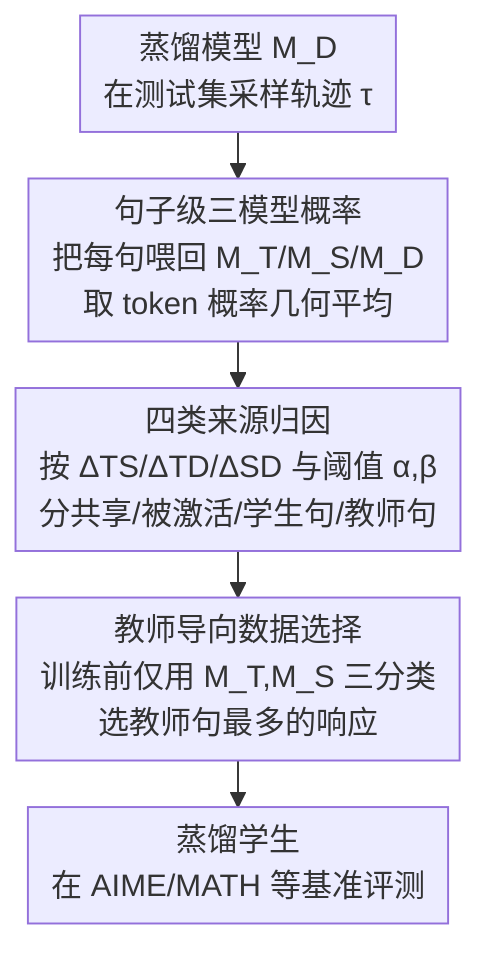

# Where Did This Sentence Come From? Tracing Provenance in LLM Reasoning Distillation

**会议**: ICLR 2026  
**论文**: ICLR 2026 Conference Paper  
**代码**: 无  
**领域**: LLM推理  
**关键词**: 推理蒸馏, 来源追踪(provenance), 教师导向数据选择, 句子级归因, 泛化分析

## 一句话总结
把蒸馏学生在测试时输出的每一句话，按"教师/学生/共享/被激活"四类归因到它真正的来源模型，证明学生在新场景里确实复用了教师句、且这些句子与答对相关；再据此提出一个"挑教师句最多的训练样本"的数据选择策略，在多组教师-学生配对上平均提升 1.7%–2.5%。

## 研究背景与动机
**领域现状**：推理蒸馏（reasoning distillation）现在是把强推理大模型能力"廉价搬运"到小模型的主流手段——用 DeepSeek-R1、QwQ 这类教师模型在高质量问题上采样出推理轨迹，再让学生用交叉熵去模仿这些轨迹。近期工作（OpenThoughts、AceReason、GRAPE 等）大多在"怎么挑、怎么过滤训练样本"上做文章。

**现有痛点**：这些方法几乎只盯着"最终性能"，却从没认真回答一个问题——学生在训练上下文里学会模仿教师，**但到了测试时面对全新上下文，它到底是继续按教师的逻辑走，还是悄悄退回了自己原来的输出分布？** 没有人把蒸馏模型测试时的每一步行为归因到来源，于是"蒸馏到底有没有真的迁移推理能力，还是只是强化了学生本来就有的模式"一直是糊涂账。

**核心矛盾**：训练阶段的"行为一致"不等于测试阶段的"行为一致"。学生可能在训练分布上完美复现教师，却在 out-of-context 时回退（regress）到原始模式，这正是蒸馏泛化性受质疑的根源。要回答这个问题，必须有一种能在**句子粒度**上、跨教师/学生/蒸馏三个模型对比的归因工具。

**切入角度**：作者的关键观察是——既然没法直接逐句重采两个模型再比相似度（太贵、相似度也难量化），不如换个视角：只从蒸馏模型采一条轨迹，然后把这条轨迹**喂回**教师、原始学生、蒸馏三个模型，看它们各自给"下一句"打多高的概率。谁打的概率显著高，这句话就主要源自谁。

**核心 idea**：用"同一上下文下三模型对同一句的预测概率差"作为来源信号，把每句话归到四类来源；再把这个信号前移到训练前，挑出"教师句"最多的训练响应作为蒸馏数据。

## 方法详解

### 整体框架
整篇工作分两步走，前一步是**分析框架**（解释蒸馏为什么有效），后一步是**训练方法**（反过来用结论指导选数据）。

第一步 **Reasoning Distillation Provenance Tracing**：在测试集 $\{Q^i_{test}\}$ 上**只**从蒸馏模型 $M_D$ 采样得到轨迹 $\tau^i$，按句子切分成动作序列 $\{a_{(i,j)}\}$；把每个动作 $a_{(i,j)}$ 连同其上下文喂回三个模型 $M_T$（教师）、$M_S$（原始学生）、$M_D$（蒸馏后），分别得到三个句子级概率 $p^T_{(i,j)}, p^S_{(i,j)}, p^D_{(i,j)}$；用阈值 $\alpha,\beta$ 把每句归为四类来源（共享/被激活/学生句/教师句）。统计各动作位置上四类的占比，得到"蒸馏模型在第几句倾向输出哪类来源"的画像。

第二步 **Teacher-guided Data Selection**：训练前手上只有 $M_T$ 和 $M_S$（还没有 $M_D$），所以把四分类塌缩成三分类（教师句/学生句/其余统称 Common），对同一问题的多个候选教师响应，数每条里"教师句"的个数，挑教师句**绝对数量最多**的那条进训练集。

### 关键设计

**1. 句子级概率：把"逐句重采"换成"喂回打分"**

直接逐句截断、让两个模型各自重新生成再比相似度，有两个硬伤：推理输出很长、句子数巨大，逐句重采成本爆炸；而且两段新生成文本的相似度本身就难以可靠度量。作者换了个更省的视角——不重新生成，只**把蒸馏模型已经生成的那一句喂回各模型，读它给这句的概率**。由于教师/蒸馏模型词表可能不一致，token 级直接对比不可靠，于是改在句子级比较：把一句话 $a_{(i,j)}$ 的概率定义为该句内各 token 概率的几何平均

$$p_{(i,j)} = \exp\big(\text{mean}(\log p_k)\big)$$

其中 $p_k$ 是句内第 $k$ 个 token 的概率。这样一句话只需一次前向、不必逐 token 生成，三模型在同一上下文下给出的 $p^T,p^S,p^D$ 就直接可比。

**2. 四类来源归因：用三模型概率差判定每句出自谁**

有了 $p^T_{(i,j)}, p^S_{(i,j)}, p^D_{(i,j)}$，定义两两之差 $\Delta_{SD}=p^S-p^D$、$\Delta_{TD}=p^T-p^D$、$\Delta_{TS}=p^T-p^S$，再用两个阈值 $\alpha,\beta$ 做分类：

$$
\begin{cases}
\text{Shared}, & |\Delta_{SD}|\le\alpha \wedge |\Delta_{TD}|\le\alpha \wedge |\Delta_{TS}|\le\alpha\\
\text{Teacher}, & \Delta_{TS} > \beta\\
\text{Student}, & -\Delta_{TS} > \beta\\
\text{Boosted}, & |\Delta_{TS}| < \beta
\end{cases}
$$

判定按 Shared → Teacher → Student → Boosted 的顺序进行。四类的语义是：**共享句（Shared）**——三模型概率几乎一致，本来教师学生都会、蒸馏没再抬升；**被激活句（Boosted）**——教师学生概率接近、但 $p^D$ 显著更高，说明这是学生本就潜藏、被蒸馏训练放大的内部模式；**教师句（Teacher）**——$\Delta_{TS}$ 大（教师远高于学生），这句主要源自教师迁移的知识；**学生句（Student）**——反过来学生远高于教师。$\alpha$ 用来滤掉细小概率差的噪声，$\beta$ 用来把各类型分开、可自适应确定（细节在附录 A.2）。注意"教师句"不代表学生完全不会，只是**主要**来自教师。

**3. 三个观察：教师句解释了蒸馏的泛化收益**

在 DeepSeek-Distill-Qwen-7B、DeepSeek-R1-0528-Qwen3-8B、LIMO-v2 三个开源蒸馏模型、AIME24/GPQA-D 上做归因，得到三条可解释结论：**(i) 推理早期教师句概率高**——前几句更可能是教师句，作者推测教师有"开局先分析输入、规划后续"的独特模式被学生学了去；**(ii) 学生内部模式常被激活但并非都有益**——教师句+被激活句的逐点概率和均值超过 0.7，说明蒸馏模型输出主要就是这两类；但在小模型（7B）上被激活句反而在**错误**响应里概率更高，呼应了 LIMO-v2 原文"小模型同法训练效果差"的现象，说明并非所有被激活的内部模式都值得激活；**(iii) 教师句与答对强相关**——多数模型/数据集上，教师句在正确答案里被赋予更高概率（绿色实线常压过虚线），因为教师本身性能高，学生越贴教师越容易答对。这条相关性正是后面数据选择方法的依据。

**4. 教师导向数据选择：把来源信号前移到训练前选样本**

分析结论既然是"教师句越多越可能答对"，那训练前若能**主动挑教师句多的样本**，就能把这种泛化收益提前放大。难点在于训练前还没有 $M_D$，只有 $M_T,M_S$，于是把四分类塌缩成三分类——

$$
\begin{cases}
\text{Common}, & |\Delta_{TS}|\le\beta\\
\text{Teacher}, & \Delta_{TS} > \beta\\
\text{Student}, & -\Delta_{TS} > \beta
\end{cases}
$$

其中 Common 吞并了原来的 Shared 与 Boosted（这俩在只有两模型时无法区分）。对每个问题的多个教师候选响应，数每条里的教师句个数，**优先选教师句绝对数量最多的那条**（Maximize Absolute Count）进训练集。这与代表性前作 GRAPE 形成鲜明对照：GRAPE 把数据喂回学生、按学生 logits 算启发式指标、挑"最贴学生原分布"的样本（学生单边信号）；本文则直接用**教师-学生分歧**作为跨模型选择准则——挑教师学生差异最大的样本，目标更明确。开销上：若本来就在采样，logits 顺手可得、无额外成本；若是过滤已有开源数据集，把序列喂回取 logits 也只需一次前向，远快于逐 token 生成。

### 损失函数 / 训练策略
蒸馏本身仍是标准 SFT：在同一上下文下最小化学生预测与教师动作之间的交叉熵（输入 $(Q^i_{train}, a_{(i,1)}, a_{(i,2)})$、输出 $a_{(i,3)}$）。本文不改损失，只改**喂给这个损失的训练数据**——即用教师导向选择策略替换随机/GRAPE 选样。所有策略产出的训练集大小严格相同，保证可比。$\beta$ 在训练前用数据驱动方式自适应选取（实验中 $\beta=0.1$ 给出最干净的类型划分），是 training-free 的。

## 实验关键数据

### 主实验
四组教师-学生-数据配对，对比 Vanilla（≈随机选样）、GRAPE、Ours，四个推理基准取平均准确率：

| 设置（教师+学生+数据） | AIME24 | AIME25 | MATH500 | OlympiadBench | 平均 |
|------|------|------|------|------|------|
| DeepSeek-R1 + Qwen3-4B-Base + AceReason，Vanilla | 44.4 | 33.3 | 91.2 | 55.9 | 56.2 |
| 同上，GRAPE | 43.0 | 34.1 | 88.6 | 54.8 | 55.1 |
| 同上，**Ours** | **49.3** | **37.9** | 90.8 | **56.6** | **58.7**（+2.5） |
| DeepSeek-R1 + Qwen3-8B-Base + AceReason，**Ours** | 57.3 | 41.5 | 92.8 | 58.7 | **62.6**（+1.7） |
| QwQ-32B + Qwen2.5-7B-Instruct + OpenThought3，**Ours** | 48.1 | 36.3 | 90.0 | 56.3 | **57.7**（+1.7） |
| GPT-OSS-120B + Qwen3-4B-Instruct-2507 + AceReason，**Ours** | 77.9 | 68.3 | 94.6 | 64.9 | **76.4**（+2.4） |

四组里 Ours 平均都最好（+1.7%~+2.5%），且跨 DeepSeek/QwQ/GPT-OSS 三个不同家族教师、四种学生都稳定，说明教师导向选择不依赖特定模型族。值得注意 GRAPE 在第一组反而低于 Vanilla（55.1 vs 56.2），印证"只贴学生分布"的启发式并不总有效。

### 消融实验

| 选择指标（DeepSeek-R1+Qwen3-4B-Base+AceReason） | AIME24 | AIME25 | MATH500 | OlympiadBench | 平均 |
|------|------|------|------|------|------|
| Maximize Absolute Count（本文用） | 49.3 | 37.9 | 90.8 | 56.6 | **58.7** |
| Longest（选最长响应） | 48.1 | 37.5 | 90.0 | 55.9 | 57.9 |
| Relative Proportion（教师句占比） | 46.9 | 35.0 | 88.8 | 55.1 | 56.4 |
| Vanilla（随机） | 44.4 | 33.3 | 91.2 | 55.9 | 56.2 |
| Minimize Absolute Count（反向：选教师句最少） | 42.9 | 35.2 | 87.8 | 54.2 | 55.0 |

| β 值 | AIME24 | AIME25 | MATH500 | OlympiadBench | 平均 |
|------|------|------|------|------|------|
| 0.05 | 47.9 | 37.1 | 89.8 | 57.0 | 58.0 |
| **0.1** | 49.3 | 37.9 | 90.8 | 56.6 | **58.7** |
| 0.15 | 46.3 | 37.5 | 90.2 | 56.3 | 57.6 |

### 关键发现
- **"教师句绝对数量"是最优选择指标**：Maximize Absolute Count（58.7）> Longest > Relative Proportion，而反向的 Minimize Absolute Count 最差（55.0，甚至低于随机）。一正一反的对照直接验证了"教师句多→性能好"这一核心假设。
- **β 不敏感且可训练前确定**：$\beta=0.1$ 给出最干净的类型划分（Figure 6 重叠最少），也对应最佳准确率；$\beta=0.05/0.15$ 仍都超过 Vanilla，说明方法对 $\beta$ 不挑剔，且这个 training-free 的 β 选取在训练前就能定下来。
- **跨领域有效且能正向迁移**：用 GPT-OSS-120B 在 OpenScienceReasoning-2（科学领域）选数据训练后，不仅 GPQA-D 涨（42.9 vs Vanilla 39.9），连数学测试集 AIME/MATH/Olympiad 也涨（OlympiadBench 48.0 vs 44.0）。作者推测科学领域的教师句与数学领域共享某些共性，解释了科学数据能改善数学性能。
- **规模局限**：受资源限制只验证到 ≤8B 模型；教师句对更大模型是否同样有益、LIMO-v2 仅 800 样本是否撑得起中后期结论，作者明确标注为开放问题。⚠️ 以原文为准。

## 亮点与洞察
- **"喂回打分"替代"逐句重采"**：归因不靠重新生成，而是把已生成句子喂回三模型读概率，一次前向搞定。这个 trick 把原本指数级昂贵的逐句对比降到可承受，且天然规避了"两段生成文本相似度难量化"的麻烦——可迁移到任何"想判断某段输出更像哪个模型"的场景。
- **解释与训练闭环**：先用归因框架**解释**蒸馏为何泛化（教师句早期密集、与答对相关），再把同一信号**反向**用于训练前选数据，分析和方法不是两张皮，而是同一把尺子的正反两用。这种"先理解机制、再据机制设计干预"的范式很值得学。
- **跨模型 vs 单模型信号**：把数据选择从"贴学生分布"（GRAPE 的单边启发式）升级为"看教师-学生分歧"的跨模型显式准则，既更有原理性，又解释了为什么单看学生的方法有时还不如随机。
- **被激活句的辩证发现**：蒸馏不只迁移教师知识，还会激活学生潜藏模式（Boosted），但在小模型上这些激活反而拖累正确率——提醒大家"蒸馏让概率升高"不等于"升高的都是好东西"。

## 局限与展望
- **作者承认**：只做到 8B 以下模型，教师句对大模型是否同样有益未知；LIMO-v2 仅 800 样本、主要为激活学生内部模式设计，中后期"教师句更利答对"的结论证据有限。
- **自己发现的局限**：四类归因强依赖阈值 $\alpha,\beta$，虽说可自适应但本质仍是人为切线，边界附近的句子归类可能不稳；句子级几何平均概率会抹掉句内 token 的局部信号，对很长或很短的句子是否公平存疑。⚠️ 以原文为准。
- **可比性 caveat**：主表里各设置教师/学生/数据都不同，绝对数值不可横向直接比大小，只能看同设置内三策略的相对增益。
- **改进思路**：把"绝对数量"换成考虑句子位置加权（早期教师句更重要）的指标；或把归因信号在训练中**在线**使用（而非仅训练前一次性选样），动态调整样本权重。

## 相关工作与启发
- **vs GRAPE（Zhang et al., 2025）**：GRAPE 把训练数据喂回学生、按学生 logits 算启发式、挑最贴学生原分布的样本（学生单边信号）；本文挑教师-学生分歧最大、教师句最多的样本（跨模型信号）。区别在于一个"向学生看齐"、一个"向教师拉拢"，主实验里本文稳定优于 GRAPE，且 GRAPE 偶尔还不如随机。
- **vs 主流推理蒸馏数据工程（OpenThoughts / AceReason / LIMO 等）**：它们靠质量过滤、正确性检查、多样性筛选构建大规模语料，关注"性能"；本文补上"来源可解释性"这一维，回答"蒸馏到底迁移了能力还是只强化旧模式"。
- **vs 模型审计（Model Auditing）**：审计关心"模型记住了哪些训练数据、输出能否归因到数据源"（数据成员问题）；本文做的是"模型级来源追踪"——追溯某条输出主要源自哪个上游模型，关注的是模型谱系而非数据成员。

## 评分
- 新颖性: ⭐⭐⭐⭐⭐ 句子级跨三模型来源归因 + 把归因信号反向用于训练前选数据，视角新颖且自洽
- 实验充分度: ⭐⭐⭐⭐ 四组教师-学生配对 + 三族教师 + 跨领域验证，但规模限于 8B 以下、缺大模型证据
- 写作质量: ⭐⭐⭐⭐ 分析→方法闭环讲得清楚，四类来源定义明确；部分结论依赖图示、纯文字略难复现
- 价值: ⭐⭐⭐⭐ 既给推理蒸馏一个可解释框架，又给出即插即用、几乎零额外成本的选数据准则

<!-- RELATED:START -->

## 相关论文

- [\[ICLR 2026\] Tracing the Traces: Latent Temporal Signals for Efficient and Accurate Reasoning](tracing_the_traces_latent_temporal_signals_for_efficient_and_accurate_reasoning.md)
- [\[ICLR 2026\] Probing to Refine: Reinforcement Distillation of LLMs via Explanatory Inversion](probing_to_refine_reinforcement_distillation_of_llm_reasoners_via_explanatory_in.md)
- [\[ICLR 2026\] KaVa: Latent Reasoning via Compressed KV-Cache Distillation](kava_latent_reasoning_via_compressed_kv-cache_distillation.md)
- [\[ICLR 2026\] Explain in Your Own Words: Improving Reasoning via Token-Selective Dual Knowledge Distillation](explain_in_your_own_words_improving_reasoning_via_token-selective_dual_knowledge.md)
- [\[ICLR 2026\] SkillFactory: Self-Distillation for Learning Cognitive Behaviors](skillfactory_self-distillation_for_learning_cognitive_behaviors.md)

<!-- RELATED:END -->
