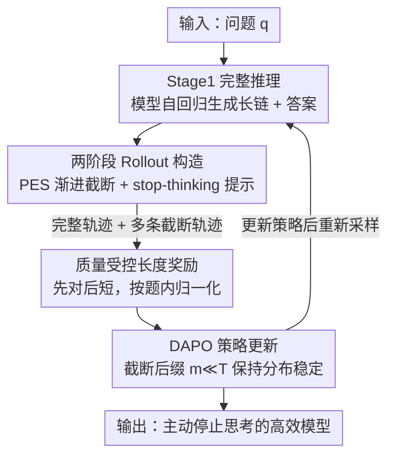

# Your Models Have Thought Enough: Training Large Reasoning Models to Stop Overthinking

**会议**: ICLR 2026  
**代码**: https://github.com/JinyiHan99/Just-Enough-Think/ (有)  
**领域**: LLM推理  
**关键词**: 高效推理, overthinking, 轨迹截断, 长度奖励, 强化学习

## 一句话总结
针对大推理模型「想太多」的问题，本文提出 JET（Just-Enough Thinking）：在 RL rollout 阶段把模型自己生成的长推理链**渐进截断**并补一句 stop-thinking 提示，构造出与模型自身分布一致的短推理样本，再配一个「先对后短」的质量受控长度奖励，让模型学会在信息够用时主动停止思考——在 Olympiad 上用 1.5B 模型实现 +4.6% 准确率的同时把输出长度压掉 46.3%。

## 研究背景与动机

**领域现状**：以 OpenAI o1、DeepSeek-R1 为代表的大推理模型（LRM）靠 System-2 式的长链推理在数学竞赛、代码等难任务上拿到大幅提升——它们会做冗长的中间步骤、反复自检、探索多条解法路径。强化学习（RL）已成为提升推理能力的主流后训练范式。

**现有痛点**：这种长推理带来巨大的算力浪费——模型经常用远超必要的步数才得到正确答案，这就是「overthinking（过度思考）」。为了让推理更高效，现有 RL 方法走两条路：(i) 自适应思考模式选择，先 SFT 让模型具备 think/no-think 两种模式，再用 RL 奖励去选；(ii) 基于长度的优化，直接加一个长度奖励鼓励简短推理。

**核心矛盾**：有效的奖励学习依赖让模型见到**多样**的样本，但 LRM 天生偏爱啰嗦输出，几乎不会自发产生短推理轨迹（论文 Figure 1a 显示 500 个回答里短于 1000 token 的极其罕见）。训练数据于是被「长」严重偏置，长度奖励信号失真，学不到简短推理。一个直接的补救是压缩长答案或外部喂入短答案，但这会在「模型自然生成分布」和「人工缩短样本」之间引入显著的**分布失配**，破坏梯度更新的稳定性，反而损害模型在自己生成过程内的学习。

**切入角度**：作者从认知科学的**证据累积模型（Evidence Accumulation Models）**得到启发——人的决策是一个动态过程，信息不断累积直到越过一个阈值，此后再多的证据只是「支持」已做出的决定，对结论本身不再有贡献。作者假设 LRM 的推理也是如此：轨迹早期就已经累积了足够确定最终答案的信息，后面的步骤大多是冗余。他们用 pilot 实验验证了这一点：在 MATH500 上只保留前 75% 推理链仍能保住 90%+ 的原本正确解，只保留前 50% 也还能答对约四分之三，而且**截断有时还能把原本错的答案改对**（冗余推理会把模型带偏）。

**核心 idea**：既然短而正确的推理本来就「藏」在模型自己的长链里，那就**从模型自身的长推理中截取出短的、分布一致的轨迹**来训练它，而不是从外部塞短答案。由此得到 JET——训练模型在「信息够用」时主动终止思考。

## 方法详解

### 整体框架
JET 是一个建立在 DAPO 之上的 RL 方法，目标是让模型既答得对又推得短。它的关键在于改造 rollout（采样）阶段和奖励设计：先让模型按自己的方式生成**完整推理轨迹**（Stage 1），再用 **PES（渐进式提前停止）** 沿这条完整轨迹在不同位置切一刀、并补上一句 stop-thinking 提示，逼模型立刻给出结论，从而构造一批长短不一但仍在模型自然分布内的**截断轨迹**（Stage 2）。完整轨迹和截断轨迹一起送进 RL 训练，配上一个**质量受控的长度奖励**（先保证正确、再奖励简短），用 DAPO 目标更新策略。整条 pipeline 让模型同时看到「同一道题、长度和对错都不同」的多条路径，学会何时该停。

### 关键设计

**1. 两阶段 Rollout 构造：从模型自己的长链里裁出分布一致的短样本**

这一设计直击「模型不会自发产生短轨迹、外部塞短答案又会分布失配」的核心矛盾。Stage 1 让模型按标准自回归过程生成完整推理轨迹，它既是模型自然推理行为的参照，也为下一阶段提供可裁剪的母本。Stage 2 在这条完整轨迹的不同中间位置截断，并插入一句显式的 stop-thinking 提示（如「Wait, I have enough information to get the final answer. Therefore, the final answer is...」），让模型基于已有的部分推理立刻产出结论。关键在于：截断点之前的 token 全部来自模型自己采样、之后只接一句很短的强制后缀，所以**截断轨迹依然落在模型的生成分布内**，避免了压缩/外部短答案带来的分布漂移。这样同一道题就能同时得到「长的、短的、对的、错的」多条路径，给后续奖励学习提供了真正多样的对照样本。

**2. PES 渐进式提前停止：用一串等间隔截断点近似最优停止位置**

确定「在哪里停」本身很难——停太早答案会错，停太晚又留下冗余步骤，而穷举所有截断点代价高、拖慢 RL。PES（Progressive Early-Stopping）用一个简单有效的渐进方案绕开搜索：沿每条完整轨迹生成一系列截断变体，截断位置为
$$t_k = t_0 + k\Delta t,\quad k = 0, 1, \dots, K$$
其中 $t_0$ 是初始截断点，$\Delta t$ 是预设步长（按分位间隔），$K$ 控制截断次数；每个截断点都接一句 stop-thinking 提示促使模型立即给出答案。这一串等间隔的截断点 (i) 保持与模型自身生成分布一致，(ii) 提高了命中某个最优/近最优截断点 $t^*$ 的概率，(iii) 提供长度各异的提前停止轨迹来教模型「何时停才划算」。它还带来巨大的工程收益：截断后的轨迹更短、前向次数更少、梯度计算更快——相比每次都生成完整链的策略，PES 在 rollout 生成和策略优化上实现了最高约 **5 倍**加速。

**3. 质量受控的长度奖励：先保证对，再在「对的里面」奖励短**

光加长度惩罚容易把模型逼成「为短而短」反而答错。本文的奖励遵循三条原则：**正确优先**（只有正确回答才有资格拿长度奖励，准确率始终是第一目标）、**偏好简短**（正确回答里越短奖励越高）、**按题内归一化**（相对于该题最短/最长正确回答来度量，避免不同题目长度分布差异带来的偏置）。设某题的正确回答集合为 $C=\{i\mid r_{acc}(i)=1\}$，记 $\ell_{min}=\min_{j\in C}\ell_j$、$\ell_{max}=\max_{j\in C}\ell_j$，则长度奖励为
$$r_\ell(i) = \begin{cases}\left(\dfrac{\ell_{max}-\ell_i}{\ell_{max}-\ell_{min}+\varepsilon}\right)\cdot\alpha\cdot(1-\delta)+\delta, & i\in C\\[2mm] 0, & i\notin C\end{cases}$$
其中 $\alpha$ 控制奖励随长度衰减的速率，$\delta\in(0,1)$ 给正确回答设一个最低奖励下限（保证不会把必要的推理步骤也罚掉），$\varepsilon>0$ 防止所有正确回答等长时分母为零。总奖励再把格式、正确、长度三项加权组合：$R(i)=w_f r_f(i)+w_{acc} r_{acc}(i)+w_\ell r_\ell(i)$，其中 $r_f$ 要求答案放进 `\boxed{}`、$r_{acc}$ 用与标准答案精确字符串匹配判对。

### 损失函数 / 训练策略
JET 沿用 DAPO 目标，对每个 query $q$ 采样一组输出 $\{o_i\}_{i=1}^G$ 做带 clip 的策略梯度更新，优势 $\hat A_{i,t}=\frac{R_i-\mathrm{mean}(\{R_i\})}{\mathrm{std}(\{R_i\})}$。与标准 DAPO 只在完整轨迹上算 loss 不同，JET 把**截断后再补全**的轨迹也纳入目标，从而让策略学会「信息够用就停」。论文还给了梯度分析：截断轨迹 $\hat o_i^{(T)}$ 的前 $T$ 个 token 来自旧策略 $\pi_{\theta_{old}}$、后 $m$ 个是强制后缀且 $m\ll T$，于是序列级概率可分解为 $\pi_\theta(\hat o_i)=\pi_\theta(o_{i,1:T})\cdot C$，后缀因子 $C$ 贡献可忽略；前缀 token 的重要性比 $r_{i,t}(\theta)\approx 1$ 落在 clip 区间内，后缀 token 数少且被 clip——因此序列级重要性比 $\frac{\pi_\theta(\hat o_i)}{\pi_{\theta_{old}}(\hat o_i)}\approx 1$，附加短后缀**不会破坏信任域内的稳定更新**。训练数据由 MATH 与 DAPO-MATH 混合、去掉中文题后得到的 14,564 条混合难度样本。

## 实验关键数据

### 主实验
主干模型为 DeepSeek-R1-Distill-Qwen 1.5B / 7B，对比 SFT、DPO、DAPO、AdaptThink、Laser-D/DE、LCR1 等高效推理方法。下表为 1.5B 上各数学基准的准确率与 token 压缩率（括号为相对 Base 的变化）：

| 数据集 (1.5B) | Base ACC | JET ACC | Δacc | JET 长度变化 |
|--------|------|------|------|------|
| GSM8K | 76.0 | 83.8 | +7.8 | +29.3%（易题，⚠️ 见下）|
| MATH500 | 79.6 | 83.0 | +3.4 | -42.7% |
| AIME24 | 28.7 | 32.0 | +3.3 | -39.9% |
| AMC | 63.3 | 66.1 | +2.8 | -49.3% |
| Olympiad | 47.0 | 51.6 | +4.6 | -46.3% |
| **AVG** | **58.9** | **63.3** | **+4.4** | **-29.8%** |

> ⚠️ GSM8K 这类简单题 Base 长度本就很短（468 token），JET 的「长度」列原文为 605（+29.3%），是少数长度反增的情形；但 AVG 仍为 -29.8% 压缩，难任务上压缩显著。以原文为准。

在 7B 上 JET 的 AVG 为 ACC 75.2（+0.8）、长度 -26.3%；对照之下 LCR1 虽在 MATH500-7B 压掉 >50% 长度，却掉了 4.4pp 准确率，违背了「高效推理」的初衷——JET 的优势是在大幅压缩的同时**不牺牲甚至提升**准确率。论文还在 DeepSeek-R1-Distill-Llama-8B 上验证：域内任务准确率 +2、token -31%，说明方法跨规模、跨模型族稳健。

**域外泛化（Table 2）**：JET 虽为数学推理设计，却在常识/专业/多学科任务上同样出色，尤其是难度高的 GPQA-Diamond：

| 数据集 | 模型 | Base ACC | JET ACC | Δacc | JET 长度压缩 |
|--------|------|------|------|------|------|
| GPQA-Diamond | 1.5B | 32.3 | 43.4 | +11.1 | -25.6% |
| GPQA-Diamond | 7B | 47.5 | 52.5 | +5.0 | -13.0% |
| AVG(CSQA/GPQA/MMLU) | 1.5B | 40.1 | 44.5 | +4.4 | -39.7% |
| AVG(CSQA/GPQA/MMLU) | 7B | 57.1 | 60.9 | +3.8 | -14.9% |

GPQA 上 1.5B +11.1 的大幅提升表明 JET 增强的是模型捕捉深层推理结构的能力，而非依赖表层模式匹配。

### 消融实验
论文的消融以图为主（Figure 3/4/5），核心对照如下（数值为图中近似读数，⚠️ 以原文为准）：

| 配置 | 关键效果 | 说明 |
|------|---------|------|
| **PES（完整）** | 准确率↑、长度↓、最优 | 渐进截断产生长度多样的路径，教模型何时早停划算 |
| Fix（固定位置截断） | 不如 PES | 固定截断点无法适应题目复杂度 |
| w/o PES（不截断，全长推理） | 最差 | 长序列误差累积，且 rollout 慢 |
| PES vs 无 PES（效率） | rollout 与训练最高约 **5×** 加速 | 短轨迹前向更少、梯度更快（Figure 4）|
| 长度奖励：Ours(加权线性) vs Linear/Exp/Sigmoid | Ours 平衡最好 | 既缩短输出又保留必要步骤，设最低奖励防过罚（Figure 5）|

### 关键发现
- **截断点策略（PES）贡献最大**：去掉 PES 改用全长推理（w/o PES）效果最差，证明「构造分布一致的短样本」是 JET 生效的根，而非单纯加长度惩罚。
- **分布一致性是关键**：训练中 JET 的 KL 散度始终低于 DAPO（Figure 3b），说明截断后缀没有把模型推离原生分布，因而 RL 更新稳定——这与第 3.3 节 $m\ll T$ 的梯度分析吻合。
- **难任务收益更大**：JET 在 AIME24、AMC、GPQA 这类高难题上提升最明显，说明它砍掉的是「把模型带偏的冗余步骤」，而非有用推理。
- **长度奖励要带下限**：加权线性 + 最低奖励 $\delta$ 的设计避免了「为短而短」，是准确率不掉的保证。

## 亮点与洞察
- **「从模型自己长链里裁短样本」这一招很巧**：它把「需要短样本训练」和「短样本会分布失配」这对矛盾一次性解开——前缀全是模型自采样、只补一句短后缀，分布几乎不变。这个思路可迁移到任何「想用 RL 教模型某种简洁/受控行为，却苦于模型自身不产出这类样本」的场景。
- **认知科学类比落到了可操作的机制上**：证据累积模型不只是 motivation 装饰，而是直接导出「早期信息够用→可截断」的 pilot 验证和 PES 设计，理论-实验闭环完整。
- **效率与精度双赢且附带 5× 训练加速**：多数高效推理方法是「拿精度换长度」，JET 的截断让 rollout 本身变快，训练提速是「免费」附赠。
- **梯度分析给了截断稳定性一个干净的理由**：$m\ll T$ ⇒ 序列级重要性比 ≈1，把「为什么补强制后缀不炸 RL」讲清楚了，可作为同类「轨迹改写 + RL」方法的稳定性论证模板。

## 局限与展望
- **截断仍依赖一个写死的 stop-thinking 提示句**：提示语的措辞、$t_0/\Delta t/K$ 等 PES 超参如何按任务自适应，文中未深入；不同领域是否需要不同提示尚不清楚。
- **正确性判定用精确字符串匹配**：对数学/有标准答案的任务可行，但迁移到开放生成、无唯一答案的推理任务时，长度奖励的「正确优先」前提会失效。
- **简单任务上长度可能不降反增**（如 GSM8K-1.5B），说明在已经很短的任务上 JET 的收益边际递减，方法主战场是中高难度长链推理。
- **改进方向**：把固定提示换成可学习的「停止 token / 停止策略」，或让截断点由一个轻量价值头预测而非等间隔扫描，可能进一步逼近最优停止位置。

## 相关工作与启发
- **vs SFT / DPO（用最短正确答案做样本）**：两者都从 rollout 里取最短正确答案构造监督/偏好数据，但这些样本相对模型当前分布是「外部」的，实验中长度压缩有限、个别任务还掉点；JET 把短样本留在模型自身分布内，trade-off 更优。
- **vs AdaptThink（think/no-think 模式选择）**：AdaptThink 让模型在两种粗粒度模式间二选一；JET 不切模式，而是在连续的推理位置上学「停在哪」，粒度更细，对题目难度的适配更平滑（GSM8K 上不会像 Laser 那样长度暴涨 105.8%）。
- **vs Laser-D/DE（基于目标长度的阶梯奖励）**：Laser 用难度感知的阶梯函数奖励，在部分任务上与 JET 相当，但其动态机制对简单题适配差、容易在易题上仍产出过长推理；JET 在全难度上保持一致的精度-长度平衡。
- **vs LCR1（激进剪枝）**：LCR1 压缩率最高但准确率代价大（MATH500-7B 掉 4.4pp），JET 在相近甚至更高压缩下保住精度，体现「质量受控」长度奖励的价值。

## 评分
- 新颖性: ⭐⭐⭐⭐⭐ 「从模型自身长链截断构造分布一致短样本」是对 overthinking-RL 数据偏置问题的一个真正新颖且优雅的解。
- 实验充分度: ⭐⭐⭐⭐ 覆盖两个主干 + 8B 验证、域内域外 8 个基准、消融到 PES/长度奖励/KL/效率，较全面；部分消融仅以图给出、缺独立 arXiv 号。
- 写作质量: ⭐⭐⭐⭐⭐ 动机—pilot—方法—梯度分析—实验逻辑链清晰，认知科学类比贯穿始终。
- 价值: ⭐⭐⭐⭐⭐ 高效推理是 LRM 落地的核心痛点，方法简单、提速明显、可直接接到 DAPO/GRPO 流水线上，实用价值高。

<!-- RELATED:START -->

## 相关论文

- [\[ICLR 2026\] Training Large Reasoning Models Efficiently via Progressive Thought Encoding](training_large_reasoning_models_efficiently_via_progressive_thought_encoding.md)
- [\[ICLR 2026\] Pruning Long Chain-of-Thought of Large Reasoning Models via Small-Scale Preference Optimization](pruning_long_chain-of-thought_of_large_reasoning_models_via_small-scale_preferen.md)
- [\[ICLR 2026\] ProofOptimizer: Training Language Models to Simplify Proofs without Human Demonstrations](proofoptimizer_training_language_models_to_simplify_proofs_without_human_demonst.md)
- [\[ICLR 2026\] Vision-R1: Incentivizing Reasoning Capability in Multimodal Large Language Models](vision-r1_incentivizing_reasoning_capability_in_multimodal_large_language_models.md)
- [\[ICLR 2026\] AgentMath: Empowering Mathematical Reasoning for Large Language Models via Tool-Augmented Agent](agentmath_empowering_mathematical_reasoning_for_large_language_models_via_tool-a.md)

<!-- RELATED:END -->
